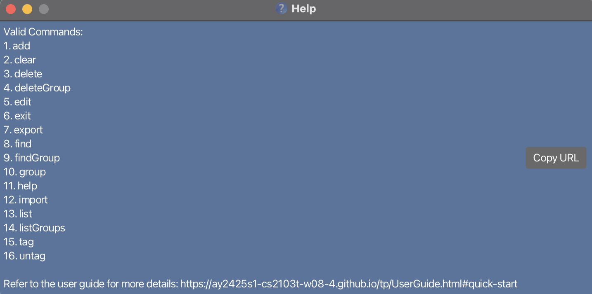
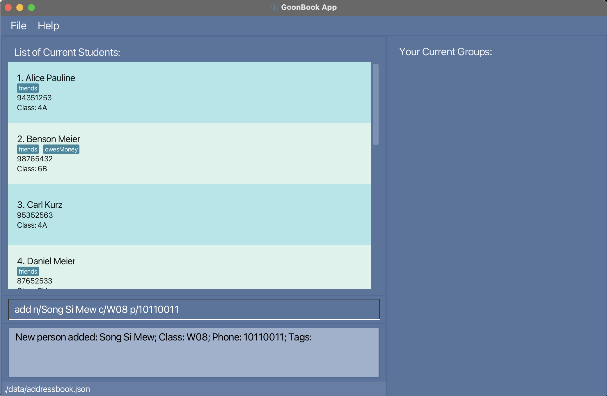
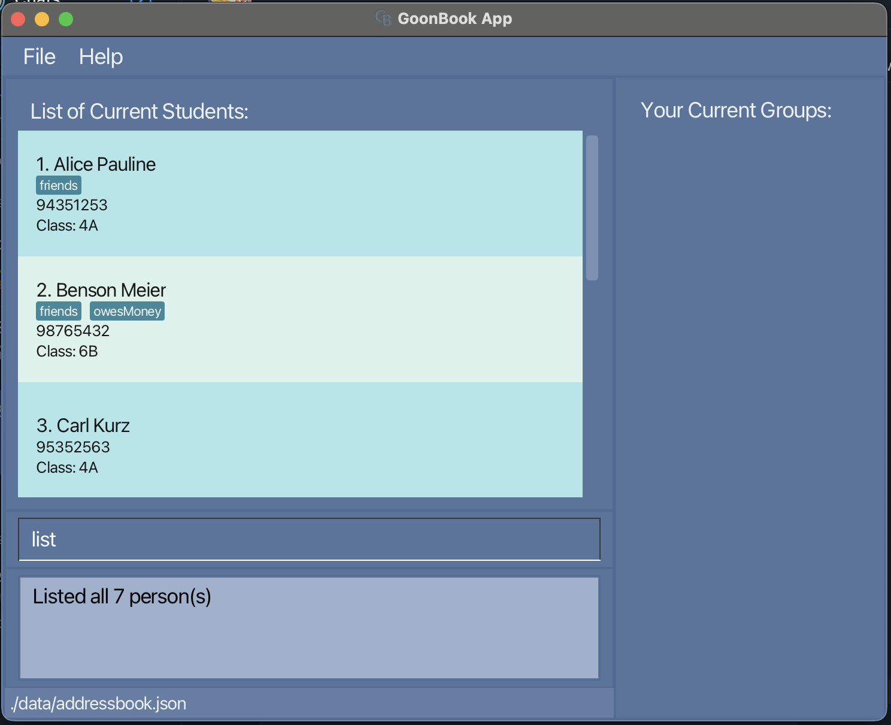
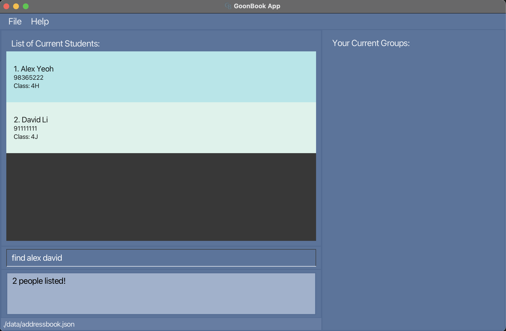
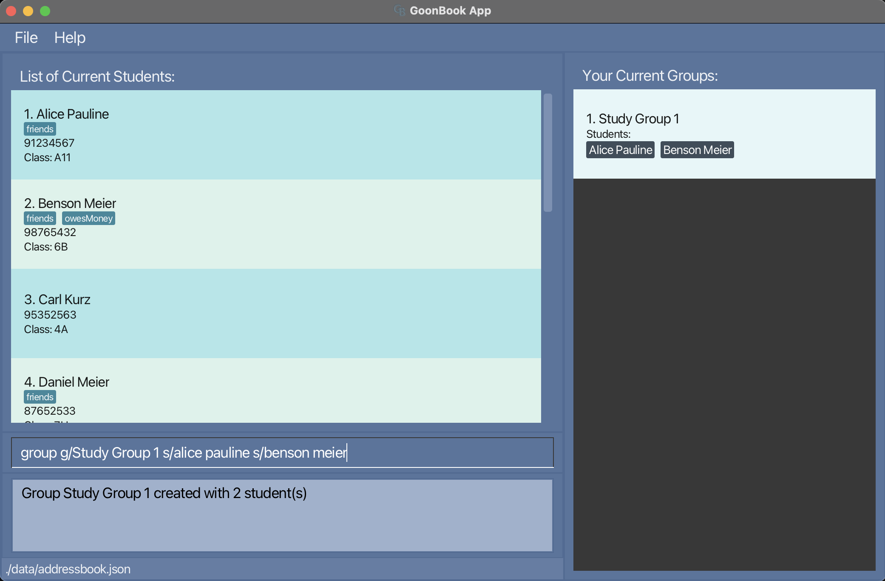
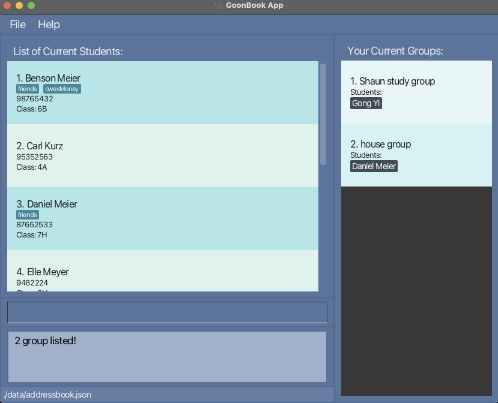
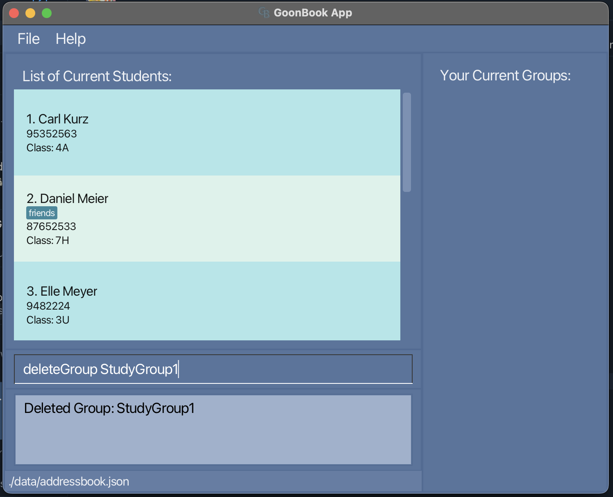
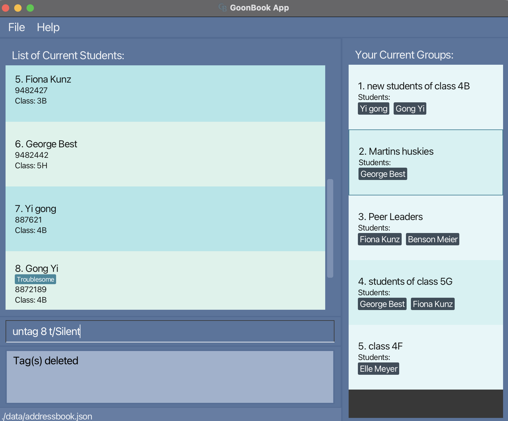
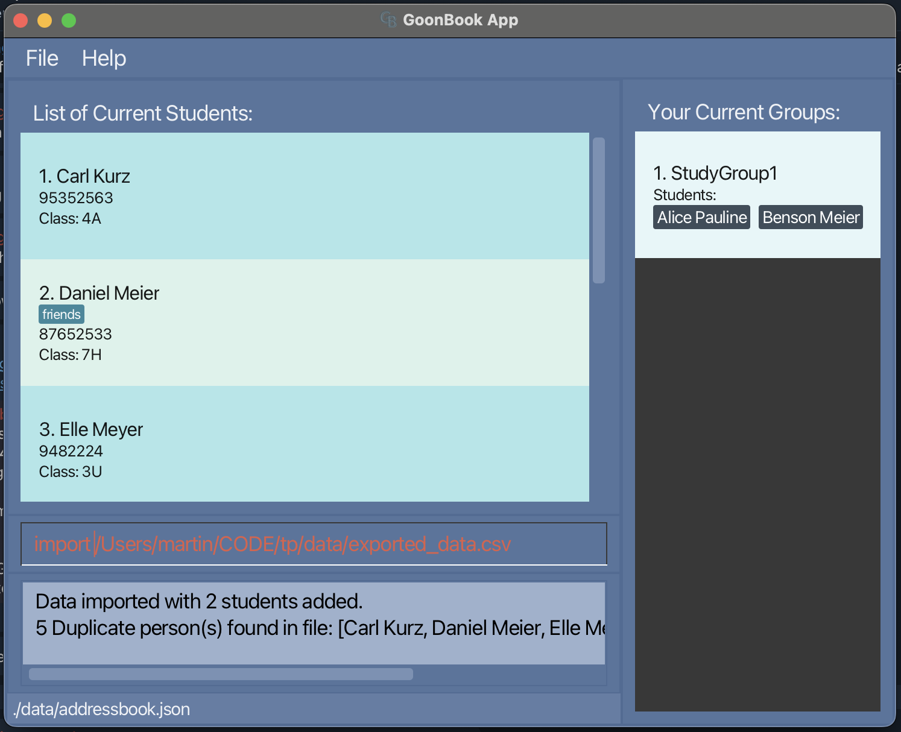
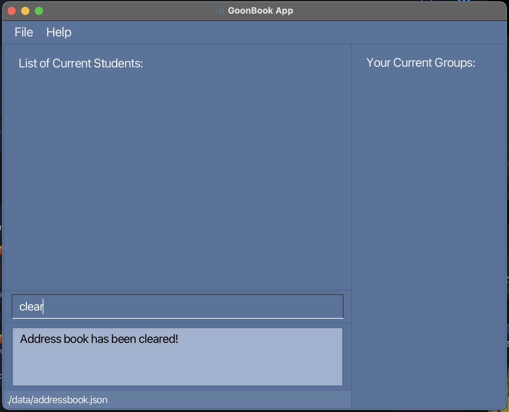

## About GoonBook

GoonBook is a **modern desktop application designed for educators to efficiently manage their students**. It combines the speed and efficiency of a Command Line Interface (CLI) with an intuitive Graphical User Interface (GUI). Featuring robust student management capabilities including:

- Quick student information lookup and editing
- Smart grouping system for organizing students
- Tag-based organization for tracking student attributes
- Import/Export functionality for seamless data management
- Automatic data saving and backup

Perfect for educators who value efficiency and prefer keyboard-based interactions. With GoonBook, managing your student records becomes faster, simpler, and more organized than traditional GUI-only applications.

## **Table of Contents**

1. [Getting Started](#getting-started)
2. [Learning GoonBook](#learning-goonbook)
3. [Quick References](#quick-references)
4. [Need Help](#need-help)
5. [Quick Start](#quick-start)
6. [Layout](#layout)
7. [Getting Help](#getting-help)
   1. [Viewing help](#viewing-help--help)
8. [Managing Students](#managing-students)
   1. [Adding a student](#adding-a-student-add)
   2. [Listing all students](#listing-all-students--list)
   3. [Editing a student](#editing-a-student--edit)
   4. [Deleting a student](#deleting-a-student--delete)
   5. [Finding a student](#locating-students-by-name-find)
9. [Managing Groups](#managing-groups)
   1. [Listing all groups](#listing-all-groups--listgroups)
   2. [Grouping students together](#grouping-students-together-group)
   3. [Locating groups by name](#locating-groups-by-name-findgroup)
   4. [Deleting a group](#deleting-a-group--deletegroup)
10. [Managing Tags](#managing-tags)
    1. [Adding a tag](#adding-a-tag--tag)
    2. [Deleting a tag](#deleting-a-tag--untag)
11. [Importing and Exporting Data](#importing-and-exporting-data)
    1. [Import students](#import-students-import-csv_file_location)
    2. [Export students](#export-students-export)
    3. [Exported csv data file location](#exported-csv-data-file-location)
12. [Data Management](#data-management)
    1. [Clearing all entries](#clearing-all-entries--clear)
    2. [Saving the data](#saving-the-data)
    3. [Editing the data file](#editing-the-data-file)
    4. [Archiving data files](#archiving-data-files-coming-in-v20)
13. [Exiting the Program](#exiting-the-program)
    1. [Exiting the program](#exiting-the-program--exit)
14. [FAQ](#faq)
15. [Known Issues](#known-issues)
16. [Command Summary](#command-summary)
17. [Acknowledgements](#acknowledgements)

---

## How to Use This Guide

### Getting Started

If you haven't installed GoonBook yet, start with the [Quick Start](#quick-start) section which will guide you through:

- Installing Java 17
- Downloading GoonBook
- Setting up your workspace
- Running your first command

### Learning GoonBook

Once GoonBook is running, familiarize yourself with:

1. **Basic Interface**

   - The command box for entering commands
   - The student list panel
   - The group management area
   - The results display

2. **Essential Features**

   - [Adding students](#adding-a-student-add)
   - [Creating groups](#grouping-students-together-group)
   - [Managing tags](#adding-a-tag--tag)
   - [Importing/Exporting data](#import-students-import-csv_file_location)

### Quick References

- For a complete list of commands, refer to the [Command Summary](#command-summary)
- Experienced users can use this as a quick refresher
- Each command includes examples of proper usage

### Need Help?

- Check the [FAQ](#faq) section for common questions
- Review [Known Issues](#known-issues) if you encounter problems
- Refer to the [Features](#features) section for detailed command usage

## Quick start

1. Ensure you have Java `17` or above installed in your Computer.

   - If you are on MacOS do note you may need to download a specific JDK 17 version. More on this [here](https://nus-cs2103-ay2425s1.github.io/website/admin/programmingLanguages.html#programming-language).

2. Download the latest `.jar` file from [here](https://github.com/AY2425S1-CS2103T-W08-4/tp/releases/).

3. Copy the file to the folder you want to use as the _home folder_ for your GoonBook.

4. Open a command terminal, `cd` into the folder you put the jar file in, and use the `java -jar goonbook.jar` command to run the application. 
   A GUI similar to the below should appear in a few seconds. Note how the app contains some sample data.

    
   

   Examples:

   - cd /users/desktop/goonbook/goonbook.jar

5. Type the command in the command box and press Enter to execute it. e.g. typing **`help`** and pressing Enter will open the help window. 
   Some example commands you can try:

   - `list` : Lists all students.

   - `add n/Song Si Mew c/W08 p/10110011 t/Japanese` : Adds a student named `Song Si Mew` to the GoonBook.

   - `delete 1` : Deletes the 1st student shown in the current list.

   - `clear` : Deletes all students.

   - `exit` : Exits the app.

6. Refer to the [Features](#features) below for details of each command.

---

## Layout

When you launch GoonBook, GoonBook appears on your screen as a Graphical User Interface, or GUI. Let’s look at the layout of the different components of GoonBook.

GoonBook’s GUI consists of a single main window, as well as the Help Window. The main window consists of three components:

1. Student List Box
2. Group List Box
3. Command Input and Output Boxes

The following picture of the main window shows the three components, numbered accordingly:

Besides the main window, GoonBook also has the Help Window. It is not part of the main GUI and is only shown after a [Help Command](#viewing-help--help) is run.

---

## Features

**:information_source: Notes about the command format:** 

- Words in `UPPER_CASE` are the parameters to be supplied by the user. 
  e.g. in `add n/NAME`, `NAME` is a parameter which can be used as `add n/John Doe`.

- Items in square brackets are optional. 
  e.g `n/NAME [t/TAG]` can be used as `n/John Doe t/friend` or as `n/John Doe`.

- Items with `…`​ after them can be used multiple times including zero times. 
  e.g. `[t/TAG]…​` can be used as ` ` (i.e. 0 times), `t/friend`, `t/friend t/family` etc.

- Parameters can be in any order. 
  e.g. if the command specifies `n/NAME p/PHONE_NUMBER`, `p/PHONE_NUMBER n/NAME` is also acceptable.

- Extraneous parameters for commands that do not take in parameters (such as `help`, `list`, `exit` and `clear`) will be ignored. 
  e.g. if the command specifies `help 123`, it will be interpreted as `help`.

- If you are using a PDF version of this document, be careful when copying and pasting commands that span multiple lines as space characters surrounding line-breaks may be omitted when copied over to the application.

## Getting Help

### Viewing help : `help`

Shows a message explaining how to access the help page.

Format: `help`

## Managing Students

### Adding a student: `add`

Adds a student to the GoonBook.

Format: `add n/NAME c/CLASS p/PHONE_NUMBER [t/TAG]…​`

- Students of same `NAME` is considered duplicate.
- `NAME` is case-insensitive. It must be alphanumeric and allows whitespace.
- `CLASS` must be alphanumeric.
- `PHONE_NUMBER` must be at least 3 digits long and only contain numbers.
- `PHONE_NUMBER` has support for `+` for the extension code.
- `TAG` must be alphanumeric and allows whitespace. It must be within 30 characters.

:bulb: **Tip:**
A person can have any number of tags (including 0)

Examples:

- `add n/Song Si Mew c/W08 p/10110011`
  - Successfully adds new student `Song Si Mew` from class `W08` and phone number `10110011` successfully.
- `add n/SONG SI MEW c/W08 p/10110011`
  - Returns `This student already exists in the address book`
- `add n/Aaron Tan c/G12 p/11110011 t/Trivial t/CS `
  - Successfully adds new student `Aaron Tan` from class `G12`, phone number `11110011`, tags `Trivial` and `CS` successfully.
- `add n/Beh Wen Jie c/ p/`
  - Returns `Student's class names cannot be empty and should be alphanumeric`
- `add n/Beh Wen Jie c/S09 p/###`
  - Returns `Phone numbers should only contain numbers, and it should be at least 3 digits long`

### Listing all students : `list`

Shows a list of all students in the GoonBook.

Format: `list`

### Editing a student : `edit`

Edits an existing student in the GoonBook.

Format: `edit INDEX [n/NAME] [p/PHONE_NUMBER] [c/CLASS] [t/TAG]…​`

- Edits the student at the specified `INDEX`. The index refers to the index number shown in the displayed person list. The index **must be a positive integer** 1, 2, 3, …​

- `INDEX` refers to the index number shown in the displayed person list.
- `NAME` is case-insensitive. It must be alphanumeric and allows whitespace.
- `CLASS` must be alphanumeric.
- `PHONE_NUMBER` must be at least 3 digits long and only contain numbers.
- `PHONE_NUMBER` has support for `+` for the extension code.
- `TAG` must be alphanumeric and allows whitespace. It must be within 30 characters.

- At least one of the optional fields must be provided.
- Existing values will be updated to the input values.
- When editing tags, the existing tags of the student will be removed i.e adding of tags is not cumulative.
- You can remove all the student’s tags by typing `t/` without
  specifying any tags after it.
- You can add multiple `t/` to add more than one tag.

Examples:

- `edit 1 c/A11 p/91234567`
  - Edits the class and phone number of the 1st student to be `A11` and `91234567` respectively.
- `edit 2`
  - Returns `At least one field to edit must be provided.`
- `edit 1 c/W-08`
  - Returns `Student's class names cannot be empty and should be alphanumeric`

### Deleting a student : `delete`

Deletes the specified student from the GoonBook.

Format: `delete INDEX`

- Deletes the student at the specified `INDEX`.
- `INDEX` refers to the index number shown in the displayed person list.
- `INDEX` **must be a positive integer** 1, 2, 3, …​

Examples:

- `list` followed by `delete 2`
  - Successfully deletes the 2nd person in the Goon book.
- `find Betsy` followed by `delete 1`
  - Successfully deletes the 1st person in the results of the `find` command.
- `delete 100`
  - If contains fewer than 100 students, returns `The index provided is greater than the max students`

### Locating students by name: `find`

Finds students whose names contain any of the given keywords.

Format: `find KEYWORD [MORE_KEYWORDS]`

- The search is case-insensitive. e.g `hans` will match `Hans`
- The order of the keywords does not matter. e.g. `Hans Bo` will match `Bo Hans`
- Only the name is searched.
- Only full words will be matched e.g. `Han` will not match `Hans`
- Students matching at least one keyword will be returned (i.e. `OR` search).
  e.g. `Hans Bo` will return `Hans Gruber`, `Bo Yang`

Examples:

- `find alex david`
  - Returns `Alex Yeoh`, `David Li`
- `find alex dav`
  - Returns `Alex Yeoh`

#### Tips for Effective Use

- Use the `list` command to display all students again.

## Managing groups

## Listing all groups : `listGroups`

Shows a list of all groups in the Goon Book.

Format: `listGroups`

### Grouping students together: `group`

Groups students together.

Format: `group g/GROUPNAME s/STUDENTNAME [s/STUDENTNAME]…​`

- Each group must have a unique name.
- `GROUPNAME` must be alphanumeric and allows whitespace (case-insensitive).
- `STUDENTNAME` must match exactly (case-sensitive).
- Group is successfully created only if all student names match.

Examples:

If the group contains `Alice Pauline` and `Benson Meier`,

- `group g/Study Group 1 s/alice pauline s/benson meier`
  - Successfully groups `Alice Pauline` and `Benson Meier` into `StudyGroup1`.
- `group g/STUDY GROUP 1 s/alice pauline s/benson meier`
  - Returns `Group name already taken!!`
- `group g/Study Group 2 s/ali`
  - Returns `The following students could not be found: ali`

**Note:** The group command requires exact, case-sensitive matches for student names. Double-check the names before executing the command to ensure the group is created successfully.

### Locating groups by name: `findGroup`

Finds existing group(s) whose name contains the given keyword.

Format: `findGroup KEYWORD`

- The search is case-insensitive. e.g `class` will match `Class`
- Only the group name is searched.
- findGroup is a partial name serach where if group names contain the keyword they will be matched e.g. `findGroup cla` will match `class 9A`
- Groups containing the keyword will be returned.
  e.g. `findGroup s` will return `shaun's study group` or `house group` but not `Running Group`

Examples:

- `findGroup study group`
  - Returns `study group 1` and `study group 2`
- `findGroup study group 1`
  - Returns `study group 1`

#### Tips for Effective Use

- Use the `listGroups` command to display all groups again.

### Deleting a group : `deleteGroup`

Deletes the specified Group from the GoonBook.

Format: `deleteGroup GROUPNAME`

- Deletes the group given the specific `GROUPNAME`.
- The group name refers to the name shown in the group list.

Examples:

- `groups` followed by `deleteGroup StudyGroup1` deletes StudyGroup1

**Warning:** Deleting a group using deleteGroup will permanently remove the group. The students in the group will not be deleted.

## Managing Tags

### Adding a tag : `tag`

Adds a tag to a specified student.

Format: `tag INDEX t/TAG [t/TAG]…​`

- Ability to add more than one tag at once by doing another `t/TAG` after.
- `INDEX` **must be a positive integer** 1, 2, 3, …​
- `INDEX` refers to the index number shown in the displayed person list.
- `TAG` must be alphanumeric and allows whitespace. It must be within 30 characters.
- `TAG` will be converted to all lowercase characters.

Examples:

- `tag 1 t/needs consult t/quiet`
  - Successfully tags 1st student to `needs consult` tag and `quiet` tag
- `tag 1 t/QUIET`
  - Returns `Tag(s) already exist`
- `tag 100 t/hardworking`
  - If contains fewer than 100 students, returns `The person index provided is invalid`

### Deleting a tag : `untag`

Deletes a tag of a specified student.

Format: `untag INDEX t/TAG [t/TAG]…​`

- `INDEX` **must be a positive integer** 1, 2, 3, …​
- `INDEX` refers to the index number shown in the displayed person list.
- `TAG` letters must match exactly (case-insensitive)

Examples:
- `untag 8 t/Silent`
  - Successfully removes `silent` tag from 8th student
- `untag 1 t/needs consult t/quiet`
  - Successfully removes `needs consult` tag and `quiet` tag from 1st student
- `untag 1 t/qquiet`
  - Returns `The tag(s) does not exist`

## Importing and Exporting Data

### Import students: `import`

Imports and adds new NON-DUPLICATE students from a .csv file into GoonBook.

Format: `import CSV_FILE_LOCATION`

- Only adds NON-DUPLICATE students (i.e. students with same name).
- Does not update existing users with the new imported data.
- Will notify user of all duplicate students found and not imported.
- `CSV_FILE_LOCATION` must be absolute path and valid.
- Csv files must be properly formatted to GoonBook style (see exported_data.csv).
- Csv files are to have 4 columns: `[name, class, phone number, tags]`.
- Tags in the csv file are to be seperated with a space.
- Will show user data corrupted error if parse or data is not formatted right.
- Will show user cannot find error if no or invalid file location is given.
- Will show user invalid file format, must be .csv if a valid file which is not a .csv is entered.

Examples:

- `import /Users/martin/CODE/tp/data/exported_data.csv`
  - Successfully imports data
- `import /invalid/path`
  - Returns `Invalid path!`

**Warning:** When importing students with the import command, ensure that the CSV file is correctly formatted and contains valid data. Improper formatting may cause the import to fail or lead to data corruption.

### Export students: `export`

Exports all students in GoonBook to a .csv file.

Format: `export`

- Exports all students to fixed location as exported_data.csv
- Location can be found at `[JAR FILE LOCATION]/data/exported_data.csv`

### Exported csv data file location

GoonBook csv data files are saved automatically as a .csv file at `[JAR file location/data/exported_data.csv]`.

## Data Management

### Clearing all entries : `clear`

Clears all entries from the GoonBook.

Format: `clear`

**Warning:** The `clear` command has no confirmation prompt and will delete all data immediately. Use with caution.

## Exiting the Program

### Exiting the program : `exit`

Exits the program.

Format: `exit`

**Note:** Always exit the application using the `exit` command to ensure all data is saved properly.

### Saving the data

GoonBook data are saved in the hard disk automatically after any command that changes the data. There is no need to save manually.

### Editing the data file

GoonBook data are saved automatically as a JSON file `[JAR file location]/data/addressbook.json`. Advanced users are welcome to update data directly by editing that data file.

**Warning:** Manually editing the data file may lead to data loss if the JSON format is not strictly followed. Always back up your data before making direct edits.

:exclamation: **Caution:**
If your changes to the data file makes its format invalid, GoonBook will discard all data and start with an empty data file at the next run. Hence, it is recommended to take a backup of the file before editing it. 
Furthermore, certain edits can cause the GoonBook to behave in unexpected ways (e.g., if a value entered is outside of the acceptable range). Therefore, edit the data file only if you are confident that you can update it correctly.

### Archiving data files `[coming in v2.0]`

- Import and Export feature to include Group support.

---

## FAQ

**Q**: How do I transfer my data to another Computer? 
**A**: Install the app in the other computer and overwrite the empty data file it creates with the file that contains the data of your previous GoonBook home folder.
**Q**: Is there support for importing and exporting groups? 
**A**: It is a planned enhacement. Do check out our Developer Guide for more information.
**Q**: I don't understand what caused the error in my command what can I do? 
**A**: Take note of the command you tried using and look at the command format and examples in the user guide.

---

## Known issues

1. **When using multiple screens**, if you move the application to a secondary screen, and later switch to using only the primary screen, the GUI will open off-screen. The remedy is to delete the `preferences.json` file created by the application before running the application again.
2. **If you minimize the Help Window** and then run the `help` command (or use the `Help` menu, or the keyboard shortcut `F1`) again, the original Help Window will remain minimized, and no new Help Window will appear. The remedy is to manually restore the minimized Help Window.
3. **If you require use of special characters**, unfortunately we currently support alphanumeric representations hence, special characters cannot be used in our application. However we will be adding support for this in future implementations as we understand some students or classes may require use of special characters.
4. **If you are trying to identify a specific student using find** but cannot explicity just return that single student due to them having a space in their name, we understand this can be a problem. Our team will be adding support for more specific searches to more accurately and preciesly locate students.
5. **Index isn't referencing the correct number**, index for our commands reference the currently displayed list of students and not the entire student list. Thus, it will be the index or number you see on you screen.

## Before submitting issues
Do read up on our known issues and planned enhacements to see if we have already planned and covered potentially submitted issues!

---

## Command summary

| Action              | Format, Examples                                                                                                                     |
| ------------------- | ------------------------------------------------------------------------------------------------------------------------------------ |
| **Add**             | `add n/NAME c/CLASS p/PHONE_NUMBER [t/TAG]…​`   e.g., `add n/James Ho p/22224444 c/4B t/friend t/colleague`                       |
| **Clear**           | `clear`                                                                                                                              |
| **Delete**          | `delete INDEX`  e.g., `delete 3`                                                                                                  |
| **Delete Group**    | `deleteGroup g/GROUP_NAME`   e.g., `deleteGroup g/studygroup1`                                                                    |
| **Edit**            | `edit INDEX [n/NAME] [p/PHONE_NUMBER] [c/CLASS] [t/TAG]…​`  e.g.,`edit 2 n/James Lee c/4L`                                        |
| **Export Students** | `export`                                                                                                                             |
| **Find**            | `find KEYWORD [MORE_KEYWORDS]`  e.g., `find James Jake`                                                                           |
| **Find Group**      | `findGroup g/GROUP_NAME`   e.g., `findGroup g/studygroup1`                                                                        |
| **Delete Group**    | `deleteGroup g/GROUP_NAME`   e.g., `deleteGroup g/studygroup1`                                                                    |
| **Create Group**    | `group g/GROUP_NAME s/STUDENT_NAME [s/STUDENT_NAME]…​`   e.g., `group g/studygroup1 s/Annie s/Martin s/Jianbing s/Shaun s/Wenjie` |
| **Import**          | `import FILELOCATION`   e.g., `import /users/shaun/desktop/tp/test.csv`                                                           |
| **List Students**   | `list`                                                                                                                               |
| **List Groups**     | `listGroups`                                                                                                                         |
| **Tag**             | `tag INDEX t/TAG [t/TAG]…​`   e.g., `tag 2 t/HighAchiever t/SecondTag`                                                            |
| **Untag**           | `untag INDEX t/TAG [t/TAG]…​`   e.g., `tag 2 t/HighAchiever t/SecondTag`                                                          |
| **Help**            | `help`                                                                                                                               |

---

## Glossary

| Term                    | Definition                                                   |
|-------------------------|--------------------------------------------------------------|
| **CLASS (placeholder)** | The field for users to input student classes                 |
| **CLI**                 | Command Line Interface, where you enter commands             |
| **INDEX (placeholder)**              | Refers to the index number shown in the displayed person list |
| **KEYWORD (placeholder)**        | The text we use search for a group or student                |
|**NAME (placeholder)** | The field for users to input student's names |
|**PHONE_NUMBER (placeholder)** | The field for users to input student's phone numbers |
|**TAG (placeholder)** | The field for users to input student tags |

---

## Acknowledgements

GoonBook is a brownfield software project based off AddressBook Level-3, taken under the CS2103T Software Engineering module held by the School of Computing at the National University of Singapore.

Java dependencies:

- JavaFX for GUI
- JUnit5 for testing

Documentation dependencies:

- Jekyll for rendering the website
- PlantUML for creating UML diagrams
