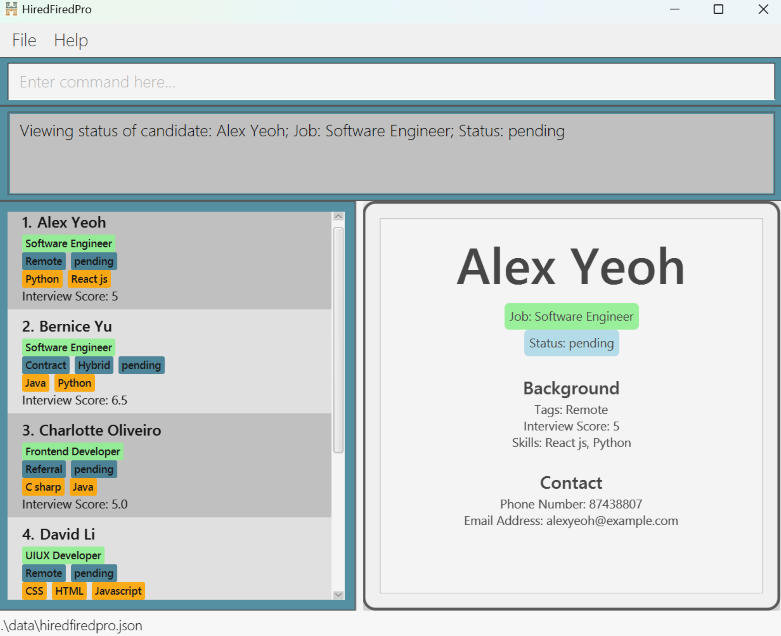

# HiredFiredPro User Guide

HiredFiredPro is a **desktop app for managing interviews, optimized for use via a Command  Line Interface** (CLI) while still having the benefits of a Graphical User Interface (GUI). If you can type fast, HiredFiredPro can get your interview management tasks done faster than traditional GUI apps.

<!-- * Table of Contents -->
* [About This Document](#about-this-document)
  * [HiredFiredPro Layout](#hiredfiredpro-layout)
  * [Command Format](#command-format)
  * [Commonly Used Parameters](#commonly-used-parameters)
* [Quick Start](#quick-start)
* [Features](#features)
  * [Viewing help: ](#viewing-help--help)`help`
  * [Adding a candidate: ](#adding-a-candidate-add)`add`
  * [Listing all candidates: ](#listing-all-candidates-list)`list`
  * [Editing a candidate: ](#editing-a-candidate-edit)`edit`
  * [Hiring a candidate: ](#hiring-a-candidate-hire)`hire`
  * [Rejecting a candidate: ](#rejecting-a-candidate-reject)`reject`
  * [View a candidate's status: ](#view-a-candidates-status-view)`view`
  * [Locating candidates by name: ](#locating-candidates-by-name-find)`find`
  * [Deleting a candidate: ](#deleting-a-candidate-delete)`delete`
  * [Sorting candidates by interview score: ](#sorting-candidates-by-interview-scores-sort)`sort`
  * [Clearing all candidates: ](#clearing-all-candidates-clear)`clear`
  * [Exiting the program: ](#exiting-the-program-exit)`exit`
* [FAQ](#faq)
* [Known Issues](#known-issues)
* [Command Summary](#command-summary)

--------------------------------------------------------------------------------------------------------------------

## About This Document

This section introduces the HiredFiredPro layout, command format and commonly used parameters to help you understand the document.

* If you are interested in setting up and using HiredFiredPro, head over to the [Quick Start](#quick-start) section.
* If you are interested in learning more about the features, you can visit the [Features](#features) section.
  

### HiredFiredPro Layout

The image below shows the different components of HiredFiredPro.

* **Command Input Line:** You can type your commands here and execute them by pressing Enter.
* **Result panel:** Displays the results of the command that has been executed.
* **Candidate panel:** Displays the complete or filtered list of candidates.
* **Display panel:** Displays the details of a candidate.
  

### Command Format

<box type="info">

**Notes about the command format:** 

* Words in `UPPER_CASE` are the parameters to be supplied by the user. 
  e.g. in `add n/NAME`, `NAME` is a parameter which can be used as `add n/John Doe`.

* Items in square brackets are optional. 
  e.g. `n/NAME [t/TAG]` can be used as `n/John Doe t/Remote` or as `n/John Doe`.

* Items with `…`​ after them can be used multiple times including zero times. 
  e.g. `[t/TAG]…​` can be used as ` ` (i.e. 0 times), `t/Contract`, `t/Contract t/Remote` etc.

* If you are using a PDF version of this document, be careful when copying and pasting commands that span multiple lines as space characters surrounding line-breaks may be omitted when copied over to the application.
</box>
  

### Commonly Used Parameters

<box type="info">

**Notes about the parameters:** 

* Parameters can be in any order. 
  e.g. if the command specifies `n/NAME p/PHONE_NUMBER`, `p/PHONE_NUMBER n/NAME` is also acceptable.

* Extraneous parameters for commands that do not take in parameters (such as `help`, `list`, `exit` and `clear`) will be ignored. 
  e.g. if the command specifies `help 123`, it will be interpreted as `help`.
</box>

Parameter     | Notes
-----------|----------------------------------------------------------------------------------------------------------------------------------------------------------------------
**`NAME`**   | should contain only English alphabets
**`JOB`**    | should be alphanumeric
**`PHONE_NUMBER`**   | should only contain digits `0-9`, and it should be at least 3 digits long
**`EMAIL`** | should be a valid email of the format `local-part@domain`
**`SKILL`**   | should be alphanumeric
**`INTERVIEW_SCORE`**   | should be a number ranging from `0.0` to `10.0` with a maximum of a single decimal place, e.g. `5.5`, `8`, `10.0` are valid but `5.`, `6.55`, `11`, `.5` are invalid
**`TAG`**   | should be alphanumeric and should not contain any spaces
**`INDEX`**   | refers to the index number shown in the displayed candidate list and **must be a positive integer**, i.e. 1, 2, 3, ...
**`ORDER`**   | should be either `a` (ascending) or `d` (descending)

--------------------------------------------------------------------------------------------------------------------

## Quick start

1. Ensure you have Java `17` or above installed in your Computer.

2. Download the latest `.jar` file from [here](https://github.com/AY2425S1-CS2103T-W09-1/tp/releases).

3. Copy the file to the folder you want to use as the _home folder_ for HiredFiredPro.

4. Open a command terminal, `cd` into the folder you put the jar file in, and use the `java -jar hiredfiredpro.jar` command to run the application. 
   A GUI similar to the below should appear in a few seconds. Note how the app contains some sample data.  
    

5. Type the command in the command box and press Enter to execute it. e.g. typing **`help`** and pressing Enter will open the help window. 
   Some example commands you can try:

   * `list` : Lists all candidates.

   * `add n/John Doe j/Software Developer p/98765432 e/johnd@example.com i/7.5` : Adds a candidate named `John Doe` to HiredFiredPro.

   * `delete 3` : Deletes the 3rd candidate shown in the current list.

   * `clear` : Deletes all candidates.

   * `exit` : Exits the HiredFiredPro app.

6. Refer to the [Features](#features) below for details of each command.

--------------------------------------------------------------------------------------------------------------------

## Features
  
### Viewing help : `help`

Shows a table summarising the commands in HiredFiredPro and a link to the user guide.

Format: `help`
  

### Adding a candidate: `add`

Adds a candidate to HiredFiredPro.

Format: `add n/NAME j/JOB p/PHONE_NUMBER e/EMAIL [s/SKILL]… i/INTERVIEW_SCORE  [t/TAG]…​`

<box type="tip">

**Tip:** A candidate can have any number of tags and skills (including 0)
</box>

<box type="info">

**Note:** Candidates are considered duplicates if they have the same name and same job
</box>

Examples:
* `add n/John Doe j/Software Engineer p/98765432 e/johnd@example.com i/5.0 t/Remote`
* `add n/Betsy Crowe j/Software Tester t/Hybrid e/betsycrowe@example.com  p/1234567 i/7 s/Python s/Java`
  

### Listing all candidates: `list`

Shows a list of all candidates in HiredFiredPro.

Format: `list`
  

### Editing a candidate: `edit`

Edits an existing candidate in HiredFiredPro.

Format: `edit INDEX [n/NAME] [j/JOB] [p/PHONE] [e/EMAIL] [s/SKILL]… [i/INTERVIEW_SCORE] [t/TAG]…​`

* Edits the candidate at the specified `INDEX`. The index refers to the index number shown in the displayed candidate list. The index **must be a positive integer** 1, 2, 3, …​
* At least one of the optional fields must be provided.
* Existing values will be updated to the input values.
* When editing tags/skills, the existing tags/skills of the candidate will be removed i.e. adding of tags/skills is not cumulative.
* You can remove all the candidate’s tags by typing `t/` without
    specifying any tags after it.
* You can remove all the candidate’s skills by typing `s/` without
  specifying any skills after it.

Examples:
*  `edit 1 p/91234567 e/johndoe@example.com` Edits the phone number and email address of the 1st candidate to be `91234567` and `johndoe@example.com` respectively.
*  `edit 2 n/Betsy Crower t/` Edits the name of the 2nd candidate to be `Betsy Crower` and clears all existing tags.
  

### Hiring a candidate: `hire`

Changes an existing candidate's status to "Hired" in HiredFiredPro.

Format: `hire n/NAME j/JOB`

* Changes the candidate's status to `Hired`.
* Both the name of the candidate and the job that he/she is applying for must be provided.
* Existing status will be updated to the `Hired` status.

<box type="tip">

**Tip:** `NAME` and `JOB` are case-insensitive, i.e. Both `hire n/Hans j/Software Engineer` and `hire n/hans j/SOFTWARE engineer` will mark the candidate as hired.
</box>
  

### Rejecting a candidate: `reject`

Changes an existing candidate's status to "Rejected" in HiredFiredPro.

Format: `reject n/NAME j/JOB`

* Changes the candidate's status to `Rejected`.
* Both the name of the candidate and the job that he/she is applying for must be provided.
* Existing status will be updated to the `Rejected` status.

<box type="tip">

**Tip:** `NAME` and `JOB` are case-insensitive, i.e. Both `reject n/Hans j/Software Engineer` and `reject n/hans j/SOFTWARE engineer` will mark the candidate as rejected.
</box>
  

### View a candidate's status: `view`

Shows a candidate's status and details in HiredFiredPro.

Format: `view n/NAME j/JOB`

* Views the candidate's status (Hired / Rejected / Pending) and full details.
* Both the name of the candidate and the job that he/she is applying for must be provided.
* Details of the candidate being viewed will be displayed in the display panel.

<box type="tip">

**Tip:** `NAME` and `JOB` are case-insensitive, i.e. Both `view n/Hans j/Software Engineer` and `view n/hans j/SOFTWARE engineer` will show the candidate's status and details.
</box>

Examples:
* `view n/Alex Yeoh j/Software Engineer` displays the details of candidate Alex Yeoh in the display panel, as shown below:

  

### Locating candidates by name: `find`

Finds candidates whose names contain any of the given keywords.

Format: `find KEYWORD [MORE_KEYWORDS]`

* The search is case-insensitive. e.g. `hans` will match `Hans`.
* The order of the keywords does not matter. e.g. `Hans Bo` will match `Bo Hans`.
* Only full words will be matched e.g. `Han` will not match `Hans`.
* Candidates matching at least one keyword will be returned (i.e. `OR` search).
  e.g. `Hans Bo` will return `Hans Gruber`, `Bo Yang`.

Examples:
* `find John` returns `john` and `John Doe`
* `find alex david` returns `Alex Yeoh`, `David Li`, as shown below:

  
  

### Deleting a candidate: `delete`

Deletes the specified candidate from HiredFiredPro.

Format: `delete INDEX`

<box type="warning">

**Caution:** This action is irreversible! Only enter this command if you are sure that the candidate is not needed.
</box>

* Deletes the candidate at the specified `INDEX`.
* The index refers to the index number shown in the displayed candidate list.
* The index **must be a positive integer** 1, 2, 3, …​

Examples:
* `list` followed by `delete 2` deletes the 2nd candidate in HiredFiredPro.
* `find Betsy` followed by `delete 1` deletes the 1st candidate in the results of the `find` command.
  

### Sorting candidates by interview scores: `sort`

Sorts the list of candidates in ascending or descending order based on their interview scores.

Format: `sort ORDER`

* `ORDER` can be either `a`(ascending) or `d`(descending).

Examples:
* `list` followed by `sort a` sorts the entire list of candidates in ascending order based on their interview scores.
* `find Alice Betsy Charlie` followed by `sort d` sorts the resulting candidate list of the `find` command in descending order based on their interview scores.
  

### Clearing all candidates: `clear`

Clears all candidates from HiredFiredPro.

Format: `clear`

<box type="warning">

**Caution:** This action is irreversible! Only enter this command if you are sure that all existing candidates are not needed.
</box>
  

### Exiting the program: `exit`

Exits the program.

Format: `exit`
  

--------------------------------------------------------------------------------------------------------------------

## FAQ

**Q**: How do I save the data? 
**A**: HiredFiredPro data are saved in the hard disk automatically after any command that changes the data. There is no need to save manually.
  

**Q**: How do I transfer my data to another Computer? 
**A**: Install the app in the other computer and overwrite the empty data file it creates with the file that contains the data of your previous HiredFiredPro home folder.
  

**Q**: Can I edit the data file directly? 
**A**: HiredFiredPro data are saved automatically as a JSON file `[JAR file location]/data/hiredfiredpro.json`. Advanced users are welcome to update data directly by editing that data file.

<box type="warning">

**Caution:** If your changes to the data file makes its format invalid, HiredFiredPro will discard all data and start with an empty data file at the next run.  Hence, it is recommended to take a backup of the file before editing it. 
Furthermore, certain edits can cause HiredFiredPro to behave in unexpected ways (e.g., if a value entered is outside the acceptable range). Therefore, edit the data file only if you are confident that you can update it correctly.
</box>
  

--------------------------------------------------------------------------------------------------------------------

## Known issues

1. **When using multiple screens**, if you move the application to a secondary screen, and later switch to using only the primary screen, the GUI will open off-screen. The remedy is to delete the `preferences.json` file created by the application before running the application again.
2. **If you minimize the Help Window** and then run the `help` command (or use the `Help` menu, or the keyboard shortcut `F1`) again, the original Help Window will remain minimized, and no new Help Window will appear. The remedy is to manually restore the minimized Help Window.

--------------------------------------------------------------------------------------------------------------------

## Command summary

Action     | Format, Examples
-----------|----------------------------------------------------------------------------------------------------------------------------------------------------------------------
**List**   | `list`
**Add**    | `add n/NAME j/JOB p/PHONE_NUMBER e/EMAIL [s/SKILL]… i/INTERVIEW_SCORE  [t/TAG]…​`   e.g., `add n/James Ho j/Site Reliability Engineer p/22224444 e/jamesho@example.com s/python s/java i/8.5 t/Remote`
**Edit**   | `edit INDEX [n/NAME] [j/JOB] [p/PHONE] [e/EMAIL] [s/SKILL]… [i/INTERVIEW_SCORE] [t/TAG]…​`  e.g.,`edit 2 n/James Lee e/jameslee@example.com`
**Delete** | `delete INDEX`  e.g., `delete 3`
**Hire**   | `hire n/NAME j/JOB`  e.g., `hire n/James Jake j/Software Engineer`
**Reject**   | `reject n/NAME j/JOB`   e.g., `reject n/James Jake j/Software Engineer`
**View**   | `view n/NAME j/JOB`  e.g., `view n/James Jake j/Software Engineer`
**Find**   | `find KEYWORD [MORE_KEYWORDS]`  e.g., `find James Jake`
**Sort**   | `sort ORDER`  e.g., `sort a`
**Help**   | `help`
**Clear**  | `clear`
**Exit**  | `exit`

