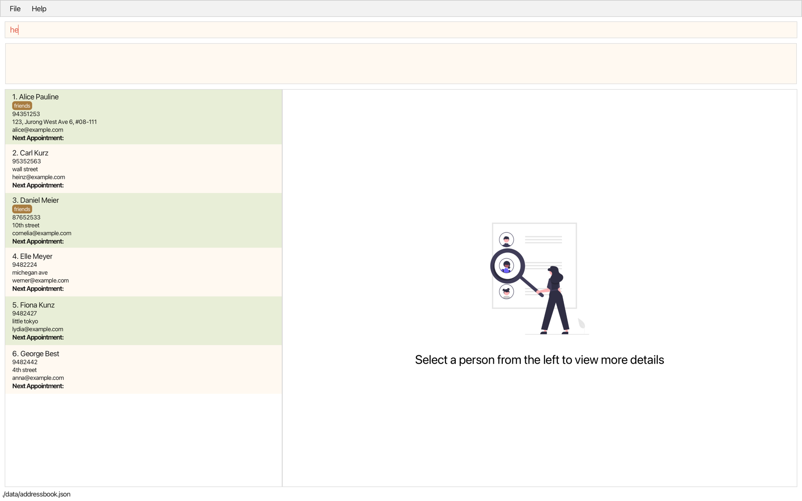
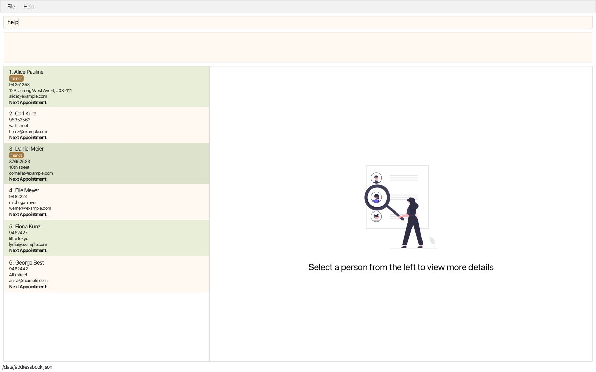

CareConnect is a **CLI-first** **case management application** that enables social workers to efficiently manage client details, appointments, and priorities. Repeated chores including data entry and search will be streamlined via simple CLI inputs, easing the mental load of the social workers, allowing them to focus more on delivering high-quality care and support for the clients.

* Table of Contents
{:toc}

--------------------------------------------------------------------------------------------------------------------

## Quick start

1. Ensure you have Java `17` or above installed in your Computer.

1. Download the latest `.jar` file from [here](https://github.com/AY2425S1-CS2103T-W13-2/tp/releases).

1. Copy the file to the folder you want to use as the _home folder_ for your CareConnect application.

1. Open a command terminal, `cd` into the folder you put the jar file in, and use the `java -jar careconnect.jar`
   command to run the application. 
   A GUI similar to the below should appear in a few seconds. Note how the app contains some sample data. 
   

1. Type the command in the command box.

   - Note that invalid commands will be coloured in red.
       
   - Valid command words would briefly show in colour grey to indicate the command word is correct.
       
   - Once the completed, valid command is entered, the command will return to colour black. 
       
   - Press Enter to execute command. e.g. typing **`help`** and pressing Enter
     will open the help window. 

4. Some example commands you can try:

   * `list` : Lists all contacts.

   * `add n/John Doe p/98765432 e/johnd@example.com a/John street, block 123, #01-01` : Adds a contact named `John Doe` to the Case Management System.

   * `delete 3` : Deletes the 3rd contact shown in the current list.

   * `clear` : Deletes all contacts.

   * `exit` : Exits the app.

1. Refer to the [Features](#features) below for details of each command.

--------------------------------------------------------------------------------------------------------------------

## Features

**:information_source: Notes about the command format:** 

* Words in `UPPER_CASE` are the parameters to be supplied by the user. 
  e.g. in `add n/NAME`, `NAME` is a parameter which can be used as `add n/John Doe`.

* Items in square brackets are optional. 
  e.g `n/NAME [t/TAG]` can be used as `n/John Doe t/friend` or as `n/John Doe`.

* Items with `…`​ after them can be used multiple times including zero times. 
  e.g. `[t/TAG]…​` can be used as ` ` (i.e. 0 times), `t/friend`, `t/friend t/family` etc.

* Parameters can be in any order. 
  e.g. if the command specifies `n/NAME p/PHONE_NUMBER`, `p/PHONE_NUMBER n/NAME` is also acceptable.

* Extraneous parameters for commands that do not take in parameters (such as `help`, `list`, `exit` and `clear`) will be ignored. 
  e.g. if the command specifies `help 123`, it will be interpreted as `help`.

* If you are using a PDF version of this document, be careful when copying and pasting commands that span multiple lines as space characters surrounding line-breaks may be omitted when copied over to the application.

### Viewing help : `help`

Opens up your default browser and displays the CareConnect user guide webpage.

Format: `help`

### Adding a client: `add`

Adds a client to the case management system.

Format: `add n/NAME p/PHONE_NUMBER e/EMAIL a/ADDRESS [t/TAG]…​`

:bulb: **Tip:**
A client can have any number of tags (including 0)

Examples:
* `add n/John Doe p/98765432 e/johnd@example.com a/John street, block 123, #01-01`
* `add n/Betsy Crowe t/friend e/betsycrowe@example.com a/Newgate Prison p/1234567 t/criminal`

### Listing all beneficiaries : `list`

Shows a list of all beneficiaries in the case management system.

Format: `list`

### Viewing a client's details: `view`

View the details of the specified client in the case management system.

Format: `view INDEX`

* Opens up record of the client at the specified `INDEX`.
* The index refers to the index number shown in the displayed client list.
* The index **must be a positive integer** 1, 2, 3, …​

Examples:
* `list` followed by `view 2` opens up the record of the 2nd client in the case management system.
* `find Betsy` followed by `delete 1` opens up the record of the 1st client in the results of the `find` command.

### Editing a client : `edit`

Edits an existing client in the case management system.

Format: `edit INDEX [n/NAME] [p/PHONE] [e/EMAIL] [a/ADDRESS] [t/TAG]…​`

* Edits the client at the specified `INDEX`. The index refers to the index number shown in the displayed client list. The index **must be a positive integer** 1, 2, 3, …​
* At least one of the optional fields must be provided.
* Existing values will be updated to the input values.
* When editing tags, the existing tags of the client will be removed i.e adding of tags is not cumulative.
* You can remove all the client’s tags by typing `t/` without
    specifying any tags after it.

Examples:
*  `edit 1 p/91234567 e/johndoe@example.com` Edits the phone number and email address of the 1st client to be `91234567` and `johndoe@example.com` respectively.
*  `edit 2 n/Betsy Crower t/` Edits the name of the 2nd client to be `Betsy Crower` and clears all existing tags.

### Tagging a client: `tag`

Tags a client in the case management system.

Format: `tag INDEX t/TAG_NAME`

* Adds the tag to the client at the specific `INDEX`.
* The tag must not contain any spaces
* Only one tag can be added at once

Example:
- `tag 1 t/urgent`

### Untagging a client: `untag`

Untags a client in the case management system.

Format: `untag INDEX t/TAG`

* Removes the tag from the client at the specific `INDEX`.
* Only one tag can be removed at once
* If the tag is not found, a warining will be displayed

Example:
- `untag 1 t/urgent`

### Setting an appointment: `setappointment`

Sets an appointment date for a client

Format: `setappointment INDEX d/[YYYY-MM-DD]`

* Sets appointment date for the client at the specific `INDEX`
* If the date is left empty, the current appointment date will be removed

Example:
- `setappointment 1 d/2024-11-23`

### Searching and filtering clients: `find`

Finds and filters clients using a combination of name, address, and tags.

Format: `find n/KEYWORD [MORE_KEYWORDS] a/KEYWORD [MORE_KEYWORDS] t/TAG [MORE_TAGS]`

* At least one of name, address, or tag needs to be entered. 
* The search is case-insensitive. e.g `hans` will match `Hans`
* The order of the keywords does not matter. 
  * e.g. `n/Hans Bo` will match name `Bo Hans`
  * `a/Ave Clementi` will match the address`Clementi Ave`
* Partial names and addresses will also be matched 
  * e.g. `Han` will match `Hans`
  * e.g. `Cle` will match `Clementi`
* Note that tags is a complete string match
  * e.g. `elderly` will match `elderly`
  * e.g. `urg` will not match `urgent`
* For name searching, beneficiaries matching at least one keyword will be returned (i.e. `OR` search).
  - e.g. `find n/Hans Bo` will return `Hans Gruber`, `Bo Yang`
* For address and tags searching, beneficiaries must match all keywords to be returns (i.e `AND` search)
  - This is to search as a filtering function 
  - e.g. `find t/urgent elderly` will return clients with both the `urgent` and `elderly` tags
  - e.g. `find a/clementi ave` will return clients whose address contains both `clementi` and `ave`

* If multiple parameters are used, only those matching all parameters will be returned
    to help quickly filter and narrow down searches
    - e.g. `find n/Hans Bo a/serangoon` will return 
        1. `Hans Gruber` who has the address `Serangoon street 2, blk 111`
        2. `Bo Yang` who has the address `Blk 777 Serangoon Ave 1`
        3.  It will **not** return `John Hans` who has the address `9 Bishan Road, 302534`

Examples:
* `find n/ John` returns `johnny` and `John Doe`
* `find n/ benson carl` returns `Benson Meier`, `Carl Kurz` 
* `find a/ serangoon` will return `Bernice Yu` with address `Blk 30 Lorong Serangoon Gardens, #07-18` and `David Li` with address `Blk 436 Serangoon Gardens 26, #16-43`
* `find a/ cl av` will return `Carl` with address `Blk 777 Clementi Ave 2`
* `find n/john a/Bishan t/urgent` will return `John Hans` with address `9 Bishan road, 302534` and tags `urgent`, `ill`

### Deleting a client : `delete`

Deletes the specified client from the case management system.

Format: `delete INDEX`

* Deletes the client at the specified `INDEX`.
* The index refers to the index number shown in the displayed client list.
* The index **must be a positive integer** 1, 2, 3, …​

Examples:
* `list` followed by `delete 2` deletes the 2nd client in the case management system.
* `find Betsy` followed by `delete 1` deletes the 1st client in the results of the `find` command.

### Adding a log entry : `addlog`

Adds a log entry to the specified client in the case management system.

Format: `addlog INDEX r/REMARK [d/DATE]`
* Adds a log entry to the client at the specified `INDEX`.
* The index refers to the index number shown in the displayed client list.
* The index **must be a positive integer** 1, 2, 3, …​
* The remark is mandatory. It can be any non-empty string. e.g. `Client is doing well`
* The date is optional and defaults to the current date and time if not provided.
* The date must be in the format `yyyy-MM-dd HH:mm` e.g. `2022-12-12 14:00`

### Deleting a log entry : `deletelog`

Deletes the specified log entry from the specified client in the case management system.

Format: `deletelog INDEX l/LOG_INDEX`
* Deletes the log entry at the specified `LOG_INDEX` from the client at the specified `INDEX`.
* The index refers to the index number shown in the displayed client list.
* The index **must be a positive integer** 1, 2, 3, …​
* The `LOG_INDEX` refers to the index number shown in the displayed log list.
* The log index **must be a positive integer** 1, 2, 3, …​
* The log index is specific to the client at the specified `INDEX`.

### Clearing all entries : `clear`

Clears all entries from the case management system.

Format: `clear`

### Exiting the program : `exit`

Exits the program.

Format: `exit`

### Saving the data

CareConnect data are saved in the hard disk automatically after any command that changes the data. There is no need to
save
manually.

### Autocomplete commands

CareConnect provides command autocompletion when pressing the Tab key. For example, typing `f` and pressing Tab will auto complete the command to `find`.

### Syntax Highlighting
CareConnect provides visual feedback to help users recognize and correct commands by highlighting text in different colors.

* Black: Indicates a fully valid command.
* Gray: Indicates a valid command word pending arguments.
* Red: Indicates an invalid command.

This color-coded feedback helps users ensure their commands are correct and minimizes errors in usage.

### Easy keyboard navigation
CareConnect offers convenient keyboard navigation. Press `Shift + Tab` to switch focus between the command box, log list, and person list. Use the `Up` and `Down` arrow keys to scroll through lists.

### Editing the data file

CareConnect data are saved automatically as a JSON file `[JAR file location]/data/addressbook.json`. Advanced users are
welcome to update data directly by editing that data file.

:exclamation: **Caution:**
If your changes to the data file makes its format invalid, CareConnect will discard all data and start with an empty data file at the next run. Hence, it is recommended to take a backup of the file before editing it. 
Furthermore, certain edits can cause the CareConnect to behave in unexpected ways (e.g., if a value entered is outside of the acceptable range). Therefore, edit the data file only if you are confident that you can update it correctly.

--------------------------------------------------------------------------------------------------------------------

## FAQ

**Q**: How do I transfer my data to another Computer? 
**A**: Install the app in the other computer and overwrite the empty data file it creates with the file that contains the data of your previous CareConnect home folder.

--------------------------------------------------------------------------------------------------------------------

## Known issues

1. **When using multiple screens**, if you move the application to a secondary screen, and later switch to using only the primary screen, the GUI will open off-screen. The remedy is to delete the `preferences.json` file created by the application before running the application again.

--------------------------------------------------------------------------------------------------------------------

## Command summary

Action | Format, Examples
--------|------------------
**Help** | `help`
**Add** | `add n/NAME p/PHONE_NUMBER e/EMAIL a/ADDRESS [t/TAG]…​`   e.g., `add n/James Ho p/22224444 e/jamesho@example.com a/123, Clementi Rd, 1234665 t/friend t/colleague`
**List** | `list`
**View** | `view INDEX`   e.g., `delete 3`
**Edit** | `edit INDEX [n/NAME] [p/PHONE_NUMBER] [e/EMAIL] [a/ADDRESS] [t/TAG]…​`  e.g.,`edit 2 n/James Lee e/jameslee@example.com`
**Tag** | `tag INDEX t/TAG_NAME`   e.g., `tag 1 t/highPriority`
**Untag** | `untag INDEX t/TAG_NAME`   e.g., `untag 1 t/highPriority`
**Set Appointment** | `setappointment INDEX d/[YYYY-MM-DD]`   e.g., `setappointment 1 d/2024-11-23`
**Find** | `find KEYWORD [MORE_KEYWORDS]`  e.g., `find James Jake`
**Delete** | `delete INDEX`  e.g., `delete 3`
**Add Log** | `addlog INDEX r/REMARK [d/DATE]`  e.g., `addlog 2 r/Client is doing well d/2022-12-12 14:00`
**Delete Log** | `deletelog INDEX l/LOG_INDEX`  e.g., `deletelog 2 l/3`
**Clear** | `clear`
**Exit** | `exit`
