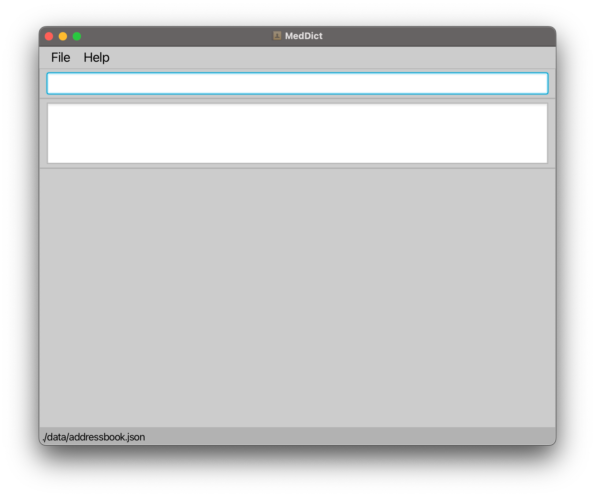
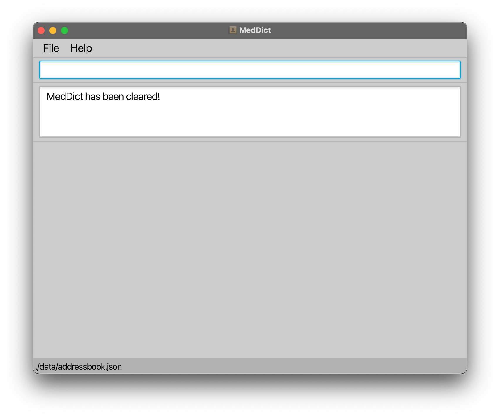

<br>
Welcome to the **MedDict User Guide!** 🎉

We're excited to have you on board with us 🥳🥳🥳

**MedDict** is a desktop application designed for medical staff who manage a large number of patients. It simplifies data entry and retrieval, allowing quick access to contact details, patient conditions, and the progress of recurring or long-term patients. The application is designed with large databases in mind, supporting a streamlined process for tracking medical history, patient appointments, and treatment progress.

Unlike most other applications who predominantly function on a **Graphical User Interface (GUI)** where most of the user's inputs and outputs are achieved via the use of a mouse or touchscreen, MedDict is built upon the philosophy that a **Command Line Interface (CLI)** -- where all features and utility can be achieved via typed-in commands -- could be far more efficient.


With **MedDict**, we believe we can revolutionise your work and management experience! 💪

With all that said, let's start you on your journey towards a new peak level of efficiency! 💯

If you would like to skip to any specific part of the User Guide, you can refer to the table below! 😊

<div style="page-break-after: always;"></div>

<br>
* Table of Contents
{:toc}

<div style="page-break-after: always;"></div>

## Quick Start

This section is for users who are experienced in installing and using Java executables. If you require a more detailed Quick Start guide, please click [here](#quick-start-beginner-friendly-detailed) or scroll past this section.

1. Ensure you have Java `17` or above installed in your device.

2. Download the latest `.jar` file from <a href="https://github.com/AY2425S1-CS2103T-T08-3/tp/releases" target="_blank">here.</a>

3. Copy or move the `.jar` file to the folder you want to use as the home folder for your MedDict application. We recommend creating a separate folder for the application as MedDict will create files in the directory it is saved in for storage purposes.

4. Open a command terminal, `cd` into the folder you put the `.jar` file in, and use the `java -jar addressbook.jar` command to run the application.<br><br>
   After completing the above, the application should open with a Graphical User Interface (GUI) similar to the one below should appear in a few seconds. Note that the interface may vary slightly depending on the Operating System (OS) and the presence of data.<br>
   
   <br>

5. Type the command in the command box and press Enter to execute it. e.g. typing **`help`** and pressing Enter will open the help window.<br><br>
   Some example commands you can try:

   * `list` : Lists all contacts.

   * `createP n/John Doe p/98765432 e/johnd@example.com a/311, Clementi Ave 2, #02-25 ` : Adds a contact named `John Doe` to the Address Book with the specified information.

   * `delete z/2` : Deletes the person with the specified ID of 2. (Won't work if you don't have a patient with an ID of 2!)

   * `clear` : Deletes all contacts.

   * `exit` : Exits the app.

6. That's all for the setup! If you require a more detailed set-up guide, you can scroll down to our [detailed quick start guide](#quick-start-beginner-friendly-detailed). Otherwise, you can refer to the [Features Section below](#features) for details of each command, alternatively, check out the [summary of commands here!](#command-summary)

<div style="page-break-after: always;"></div>

## Quick Start (beginner-friendly, detailed)

If you are less experienced in installing and using Java executables, no worries! The set-up is relatively simple 😉, and we will be guiding you with each step.

If anytime throughout the set-up, you feel lost or feel like you may require more assistance, try searching through our [FAQ Section](#faq). If you still require more assistance, feel free to reach out on our <a href="https://github.com/AY2425S1-CS2103T-T08-3/tp/discussions" target="_blank">GitHub Discussions Page!</a>

⬇️ With all that said, let's get started! ⬇️

1. **Make sure Java 17 or higher is installed on your computer.**

    * To Check if Java is Installed:

        1. Open your terminal:
            - **Windows**: Press `Windows + R`, type `cmd`, and press Enter.
            - **Mac**: Press `Command + Space`, type `Terminal`, and press Enter.
            - **Linux**: Press `Ctrl + Alt + T`, or look for "Terminal" in your applications menu.

        2. In the terminal, enter the following command and press Enter:

           ```bash
           java -version
           ```

        3. If Java 17 or higher is installed, you should see a version similar to this:

           ```bash
           java version "17.0.x" 2024-xx-xx LTS
           ```
           If you see this, you can skip the step below.<br>

        4. (Only if you do not have Java 17) If you do not have Java 17 installed, continue with the following steps to install Java 17.
           1. Visit [Oracle’s Java 17 download page](https://www.oracle.com/java/technologies/javase-jdk17-downloads.html).
           2. Download and install the correct Java Development Kit (JDK) for your operating system by following the on-screen instructions.
           3. Once installed, run the `java -version` command again to confirm that Java is installed correctly.
<br><br>
2. After verifying that you have the correct version of Java installed, **download the latest `.jar` file as follows:**
    1. Go to <a href="https://github.com/AY2425S1-CS2103T-T08-3/tp/releases" target="_blank">our GitHub release page.</a>
    2. Find the latest version of MedDict on our release page. Typically, it should be the release at the top of the page, and should have the largest number (e.g. v1.0.2 is a more updated version than v0.2.2).
    3. Download (by clicking) the `.jar` file from the website by scrolling to the "Assets" portion of the latest release notes (bottom section of the release notes). An example of a `.jar` file is `meddict-v0.1.1-alpha.jar` under the v0.1.1-alpha release notes. 
<br><br>
3. **Copy the `.jar` file to the folder you want to use as the home folder for MedDict.**<br>
   We recommend creating a separate folder for the application as MedDict will create files in the directory it is saved in for storage purposes.<br><br>
   Depending on your Operating System (OS):

    * **Windows:**
        1. Open File Explorer and navigate to where the `.jar` file is saved in, typically, this is the Downloads folder.
        2. Right-click on the `.jar` file and select Copy.
        3. Go to the destination folder where you want to store the application, right-click, and select Paste.

    * **Mac:**
        1. Open Finder and navigate to where the `.jar` file is saved in, typically, this is the Downloads folder.
        2. Right-click (or use `Control + Click`) on the `.jar` file and choose Copy.
        3. Go to the destination folder where you want to store the application, right-click, and select Paste.

    * **Linux:**
        1. Open File Manager and navigate to where the `.jar` file is saved in, typically, this is the Downloads directory.
        2. Right-click on the `.jar` file and choose Copy.
        3. Go to the destination folder where you want to store the application, right-click, and select Paste.
<br><br>
4. **Open a command terminal, navigate to the folder where the `.jar` file is saved using the `cd` command, and then run the application with the following command.**<br>
   Depending on your Operating System (OS):
    * **Windows:**
        1. Open the folder where the `.jar` file is saved. (If you have just finished step 3 above, the folder should still be open)
        2. To get the full path of this folder:
            - Right-click on the folder and select Properties.
            - In the General tab, locate the Location field and copy the path. (Alternatively, open the folder, click on the address bar, and copy the full path, e.g., `C:\Users\YourName\Documents\MedDict`).
        3. Open the Command Prompt:
            - Press `Windows + R`, type `cmd`, and press Enter.
            - Use the `cd` command and paste (`Ctrl + V`) the copied path to navigate to the folder where the `.jar` file is saved. For example:<br>
               ```
               cd C:\Users\YourName\Documents\MedDict
               ```
        4. Run the application according to the name of the jar file downloaded:<br>
           For example, if the name of the jar file is `meddict-v1.6.jar`, type the following:
           ```bash
           java -jar meddict-v1.6.jar
           ```
    * **Mac/Linux:**
        1. Open the Terminal by searching for it or by pressing `Ctrl + Alt + T`.
        2. To get the full path of the folder where the `.jar` file is located:
            - Open Finder (Mac) or File Explorer (Linux).
            - Navigate to the folder where you saved the `.jar` file. (If you have just finished step 3 above, the folder should still be open)
            - Right-click on the folder and choose Get Info (Mac) or Properties (Linux) to see the full path, or press `Cmd + Option + C` (Mac) to copy it.
        3. Use the `cd` command and paste the copied path to go to the folder where the `.jar` file is saved. For example:
           ```
           cd /Users/YourName/Documents/MedDict
           ```
        4. Run the application according to the name of the jar file downloaded:<br>
           For example, if the name of the jar file is `meddict-v1.6.jar`, type the following:
           ```bash
           java -jar meddict-v1.6.jar
           ```
           ---
   After completing the above, the application should open with a Graphical User Interface (GUI) similar to the one below should appear in a few seconds. Note that the interface may vary slightly depending on the Operating System (OS) and the presence of data.<br>
   
   <br><br>
5. If you've reached this step, **🎉 CONGRATULATIONS!!! 🎉 MedDict has been installed successfully on your device!**<br>
   What's next is to try out some of MedDict's commands. Type the command in the command box by clicking on the empty bar at the top, typing a command and pressing Enter on your keyboard to execute it. (e.g. typing `help` and pressing Enter will open the help window.) <br><br>
   Some example commands you can try:

    * `list` : Lists all contacts.

    * `createP n/John Doe p/98765432 e/johnd@example.com a/311, Clementi Ave 2, #02-25 ` : Adds a contact named `John Doe` to the Address Book with the specified information.

    * `delete z/2` : Deletes the person with the specified ID of 2. (Won't work if you don't have a person with an ID of 2!)

    * `clear` : Deletes all contacts.

    * `exit` : Exits the app.
<br><br>
6. That's all for the setup! Refer to the [Features Section below](#features) for details of each command, alternatively, check out the [summary of commands here!](#command-summary)

<div style="page-break-after: always;"></div>

## Features

<div markdown="block" class="alert alert-info">

**:information_source: Notes about the command format:**<br>

* Words in `UPPER_CASE` are the parameters to be supplied by the user.<br>
  e.g. in `delete z/ID`, `ID` is a parameter which can be used as `delete z/01`.

* Items in square brackets are optional.<br>
  e.g. `n/NAME [r/REMARK]` can be used as `n/John Doe r/friend` or as `n/John Doe`.

* Parameters can be in any order.<br>
  e.g. if the command specifies `n/NAME p/PHONE_NUMBER`, `p/PHONE_NUMBER n/NAME` is also acceptable.

* Extraneous parameters for commands that do not take in parameters (such as `help`, `list`, `exit` and `clear`) will be ignored.<br>
  e.g. if the command specifies `help 123`, it will be interpreted as `help`.

* The output messages you may see in your own application when running the commands may differ slightly from the example output. This could be due to the different databases present in your own local application and of that present in the example outputs, or due to the example outputs being demonstrated on a different device than yours. Regardless, where relevant, you can refer to the error messages provided in the event that a command did not work as intended.

* Some variations in terminology in the example outputs such as `id` and `ID` are interchangeable unless stated otherwise. In this case, `id` or `ID` or `Id` all refer to one's identification number (within the database).

* If you are using a PDF version of this document, be careful when copying and pasting commands that span multiple lines as space characters surrounding line-breaks may be omitted when copied over to the application.

* If you are using a PDF version of this document, highlighting and copying commands or lines may lead to unintended special characters, symbols or whitespaces being added to the clipboard (the text that was copied). Hence, to avoid pasting unintended commands into the application, do double-check the commands when you are copy-pasting.
</div>

<div class="alert alert-block alert-success">

For your convenience and easy reference, you can click on the header of the command to go to the command summary table!<br><br>

Likewise, you can click on a command from the command summary table to read about its specific implementation.<br><br>

For example, try clicking on "Viewing Help" in the "Viewing Help: `help`" section below!
</div>

### [Viewing Help](#command-summary): `help`

Displays a message with a link to the User Guide (you're here right now!).

Format: `help`

Examples:
* `help` <br>
  **Output**: <br>


### [Creating and Adding a Doctor](#command-summary): `createD`

Creates a doctor with given details and adds the doctor to the MedDict database.

Format: `createD n/NAME p/PHONE_NUMBER e/EMAIL a/ADDRESS`

* **NAME**: Only alphanumeric characters and spaces; cannot be blank.
* **PHONE_NUMBER:** Numeric only; minimum of 3 digits.
* **EMAIL**: Must follow standard email format 'local-part@domain.com', where the local part contains only alphanumeric characters and certain special characters,
  but cannot start or end with these special characters (+_.-). The domain consists of labels separated by periods,
  ending with a label at least two characters long, with each label starting and ending with an alphanumeric character and allowing hyphens in between.
* **ADDRESS**: Address of the doctor.
* **Note:**: Duplicate doctors (same name, phone, and email) are not allowed.
* A _notification message_ will be displayed if MedDict could not create the doctor with the given information.

Examples:
* `createD n/Dr Jane Smith p/87654321 e/dr.jane.smith@hospital.com a/456 Elm Street` <br>
  **Output**: <br>
    Successfully created a new doctor with ID: #1 : <br>
    Dr Jane Smith; Phone: 87654321; Email: dr.jane.smith@hospital.com; Address: 456 Elm Street;

* `createD n/Dr Jane Smith p/87654321 e/dr.jane.smith@hospital.com a/456 Elm Street` <br>
  **Output**: <br>
  This doctor already exists.
  

### [Creating and Adding a Patient](#command-summary): `createP`

Creates a patient with given details and adds the patient to the MedDict database.

Format: `createP n/NAME p/PHONE_NUMBER e/EMAIL a/ADDRESS`

* **NAME**: Only alphanumeric characters and spaces; cannot be blank.
* **PHONE_NUMBER:** Numeric only; minimum of 3 digits.
* **EMAIL**: Must follow standard email format 'local-part@domain.com', where the local part contains only alphanumeric characters and certain special characters,
  but cannot start or end with these special characters (+_.-). The domain consists of labels separated by periods,
  ending with a label at least two characters long, with each label starting and ending with an alphanumeric character and allowing hyphens in between.
* **ADDRESS**: Address of the patient.
* **Note**: Duplicate patients (same name, phone, or email) are not allowed.
* A _notification message_ will be displayed if MedDict could not create the patient with the given information.


Examples:
* `createP n/John Doe p/98765432 e/johndoe@example.com a/123 Baker Street` <br>
  **Output**: <br> 
    Successfully created a new patient with ID: #0 : <br>
    John Doe; Phone: 98765432; Email: johndoe@example.com; Address: 123 Baker Street;

* `createP n/John Doe p/98765432 e/johndoe@example.com a/123 Baker Street` <br>
  **Output**: <br>
This patient already exists.

<div markdown="block" class="alert alert-info">

<strong>Tip!</strong> You may notice that patient contacts created have an even-numbered ID while doctor contacts have an odd-numbered ID. Where relevant, you can use this information to your advantage! For example, instead of checking the UI to see whether the person contact is a patient or a doctor, you can determine their role based on their ID!

</div>

### [Deleting a Person](#command-summary): `delete`

Deletes the person with the specified `ID` from the MedDict database.

Format: `delete z/ID`

* **ID**: Must be valid, present in the MedDict database.
* A _notification message_ will be displayed if MedDict could not delete the person with the given ID.

Examples:
* `delete z/2` <br>
  **Output**: <br>
  Successfully deleted the person.

* `delete z/2` <br>
  **Output**: <br>
  Unable to delete the person, check the ID entered!

### [Add a Remark to a Patient](#command-summary): `addR`

Adds a remark to an existing patient with the specified `PATIENT_ID` in the MedDict database in address book.

Format: `addR z/PATIENT_ID r/REMARK`

* **PATIENT_ID**: Must be valid, present in the MedDict database, and an _even integer_ (0, 2, 4, …​).
* A _notification message_ will be displayed if MedDict could not add remarks to the patient with the given ID.

Examples:
*  `addR z/0 r/cancer` <br>
    **Output**: <br>
   Successfully added remarks: cancer to patient of ID: 0.

<div style="page-break-after: always;"></div>

### [Listing All Persons](#command-summary): `list`

Displays a list of all persons in the address book.

Format: `list`

Examples:
*   `list` <br>
    **Output**: <br>
    

<div style="page-break-after: always;"></div>

### [Editing a Person](#command-summary): `edit`

Edits an existing person with the specified `ID` in the database.

Format: `edit z/ID [n/NAME] [p/PHONE_NUMBER] [e/EMAIL] [a/ADDRESS]`

* **ID**: The Person ID must be valid, present in the MedDict database, and an _integer_ (0, 1, 2, …​).
* At least one of the optional fields must be provided.
* Existing values will be updated to the input values.
* Editing the person with the same details as the existing detail is not allowed.
* A _notification message_ will be displayed if MedDict could not edit the person with the given ID.

Examples:
*  `edit z/1 p/91234567 e/johndoe@example.com` <br>
   **Output**: <br>
   Edited Person: Dr Jane Smith; Phone: 91234567; Email: johndoe@example.com; Address: 456 Elm Street;

*  `edit z/2` <br>
   **Output**: <br>
   At least one field to edit must be provided.

* `edit z/1 p/91234567 e/johndoe@example.com` <br>
  **Output**: <br>
  This person already exists in the address book.

### [Getting ID of Doctor or Patient by Name](#command-summary): `get`

Gets the ID of a doctor or patient whose names contain any of the given keywords.

Format: `get KEYWORD`

* The search is case-insensitive. e.g. `hans` will match `Hans`
* The order of the keywords does not matter. e.g. `Hans Bo` will match `Bo Hans`
* Only the name is searched.
* Only full words will be matched e.g. `Han` will not match `Hans`
* Persons matching at least one keyword will be returned (i.e. `OR` search).
  e.g. `Hans Bo` will return `Hans Gruber`, `Bo Yang`
* A _notification message_ will be displayed if MedDict could not find a person associated with the KEYWORD.

Examples:
* `get john` <br>
  **Output**: <br>
  The ID of the person that you are finding is: 0

* `get johnny` <br>
  **Output**: <br>
  Invalid name entered! Check the name that you want to search ID for! Key in 'list' to view all patients

* `get johnny` <br>
  **Output**: <br>
  2 persons listed that suits your keyword! <br>
  Enter more specific name keywords to retrieve the ID of the person

### [Finding Doctor or Patient by Name](#command-summary): `find`

Finds a doctor or patient whose names contain any of the given keywords.

Format: `find KEYWORD`

* The search is case-insensitive. e.g. `hans` will match `Hans`
* The order of the keywords does not matter. e.g. `Hans Bo` will match `Bo Hans`
* Only the name is searched.
* Only full words will be matched e.g. `Han` will not match `Hans`
* Persons matching at least one keyword will be returned (i.e. `OR` search).
  e.g. `Hans Bo` will return `Hans Gruber`, `Bo Yang`
* A _notification message_ will be displayed if MedDict could not find a person associated with the KEYWORD.

Examples:
* `find john` <br>
  **Output**: <br>
  One person listed! Key in 'list' to view all patients

* `find ` <br>
  **Output**: <br>
  Invalid name entered! Check the name that you want to search ID for! <br>
  Key in 'list' to view all patients

* `find johnny` <br>
  **Output**: <br>
  2 persons listed that suits your keyword! <br>
  Enter more specific name keywords to retrieve the ID of the person

### [Adding an Appointment](#command-summary): `addA`

Adds an appointment to an existing patient with the specified `PATIENT_ID` and doctor with the specified `DOCTOR_ID` in the MedDict database.

Format: `addA z/PATIENT_ID z/DOCTOR_ID x/DATE_TIME [r/REMARK]`

<div class="alert alert-block alert-warning">
    <strong>Warning!</strong> Usually, the order of parameters in the command do not matter. However, in this case, do take extra effort to ensure you key in z/PATIENT_ID before z/DOCTOR_ID. Remember, the patient always comes first! 😉
</div>

* **Patient ID**: Must be valid, present in the MedDict database, and an _even integer_ (0, 2, 4, …​).
* **Doctor ID**: Must be valid, present in the MedDict database, and an _odd integer_ (1, 3, 5, …​).
* **DateTime**: Must use _yyyy-MM-dd HH:mm_ format (e.g. 2024-12-31 23:59).
* **Remark**: Optional, user can add remark details by adding `[r/Remark]` when calling the command.
  Empty remark will be added to the appointment if remark is not specified.
* When adding appointment, the appointment detail will be added to both the patient's and doctor's appointment lists.
* Each appointment must be scheduled at a unique time to prevent overlap for both the patient and the doctor.
* A _notification message_ will be displayed if MedDict could not add the appointment successfully.

Examples:
*  `addA z/0 z/1 x/2024-12-31 15:23 r/Third physiotherapy session` <br>
   **Output**: <br>
   Successfully added appointment to a patient.

*  `addA z/0 z/1 x/2024-12-31 15:23` <br>
   **Output**: <br>
   Successfully added appointment to a patient.

*  `addA z/0 z/1 x/2024-12-31 15:23` <br>
   **Output**: <br>
   The patient or doctor already has another appointment!

<div style="page-break-after: always;"></div>

### [View History of a Person](#command-summary): `view`

Displays the history of an existing person with the specified `ID` in the MedDict database.

Format: `view z/ID [x/DATE_TIME]`

* **ID**: Must be valid, present in the MedDict database.
* **DateTime**: Optional, user can view history of the patient on a specific date by adding `[x/DATE_TIME]` when calling the command. Must use _yyyy-MM-dd HH:mm_ format (e.g. 2024-12-31 23:59).
* A _notification message_ will be displayed if MedDict could not find any history or appointments associated with the person's ID.

Examples:
*  `view z/0 x/2024-12-31 15:23` <br>
   **Output**: <br>
   \[Incomplete] Appointment: `2024-12-31 15:23` for `0` (patient id) with `1` (doctor id). Remarks: `Third physiotherapy session`.

*  `view z/0` <br>
   **Output**: <br>
   \[Completed] Appointment: `2024-12-31 15:23` for `0` (patient id) with `1` (doctor id). Remarks: `Third physiotherapy session`. <br>
   \[Incomplete]Appointment: `2024-12-31 16:23` for `0` (patient id) with `1` (doctor id). Remarks: `Fourth physiotherapy session`.

*  `view z/1 x/2024-12-31 16:23` <br>
   **Output**: <br>
   No history found for the person.

### [Check Appointments of a Person](#command-summary): `checkA`

Checks the appointments of an existing person with the specified `ID` in the MedDict database.

Format: `checkA z/ID y/DATE`

* **ID**: Must be valid, present in the MedDict database.
* A _notification message_ will be displayed if MedDict could not find any appointments associated with the person's ID.

Examples:
*  `checkA z/1 y/2024-12-31` <br>
   **Output**: <br>
   Appointments on 2024-12-31:<br>
   \[Incomplete] Appointment: `2024-12-31` for `0` (patient id) with `1` (doctor id). Remarks: `Third physiotherapy session` <br>
   \[Completed] Appointment: `2024-12-31` for `0` (patient id) with `1` (doctor id). Remarks: `Fourth physiotherapy session`

*  `checkA z/2 y/2024-12-30` <br>
   **Output**: <br>
   No appointment found for the person: `Amy Bee`

### [Mark Appointment of a Doctor](#command-summary): `mark`

Marks appointment associated with the specified `PATIENT_ID`, `DOCTOR_ID`, `DATE_TIME` in the MedDict database.

Format: `mark z/PATIENT_ID z/DOCTOR_ID x/DATE_TIME`

<div class="alert alert-block alert-warning">
    <strong>Warning!</strong> Usually, the order of parameters in the command do not matter. However, in this case, do take extra effort to ensure you key in z/PATIENT_ID before z/DOCTOR_ID. Remember, the patient always comes first! 😉
</div>

* **Patient ID**: Must be valid, present in the MedDict database, and an _even integer_ (0, 2, 4, …​).
* **Doctor ID**: Must be valid, present in the MedDict database, and an _odd integer_ (1, 3, 5, …​).
* **DateTime**: Must use _yyyy-MM-dd HH:mm_ format (e.g. 2024-12-31 23:59).
* A _notification message_ will be displayed if MedDict could not find the appointment to mark.

Examples:
*  `mark z/0 z/1 x/2024-12-31 15:23` <br>
   **Output**: <br>
   Successfully marked appointment as complete

*  `mark z/0 z/1 x/2024-12-31 15:23` <br>
   **Output**: <br>
   The appointment is completed. Check the appointment that you want to mark!

*  `mark z/2 z/3 x/2024-12-31 16:23` <br>
   **Output**: <br>
   No appointments found on this date.

<div style="page-break-after: always;"></div>

### [Delete Appointment](#command-summary): `deleteA`

Deletes appointment associated with the specified `PATIENT_ID`, `DOCTOR_ID`, `DATE_TIME` from the MedDict database.

Format: `deleteA z/PATIENT_ID z/DOCTOR_ID x/DATE_TIME`

<div class="alert alert-block alert-warning">
    <strong>Warning!</strong> Usually, the order of parameters in the command do not matter. However, in this case, do take extra effort to ensure you key in z/PATIENT_ID before z/DOCTOR_ID. Remember, the patient always comes first! 😉
</div>

* **Patient ID**: Must be valid, present in the MedDict database, and an _even integer_ (0, 2, 4, …​).
* **Doctor ID**: Must be valid, present in the MedDict database, and an _odd integer_ (1, 3, 5, …​).
* **DateTime**: Must use _yyyy-MM-dd HH:mm_ format (e.g. 2024-12-31 23:59).
* A _notification message_ will be displayed if MedDict could not find the appointment to delete.

Examples:
*  `deleteA z/0 z/1 x/2024-12-31 15:23` <br>
   **Output**: <br>
   Successfully deleted appointment to a patient

*  `deleteA z/1 z/3 x/2024-12-31 15:23` <br>
   **Output**: <br>
   The appointment doesn't exist! Please check again the details you have entered!

<div style="page-break-after: always;"></div>

### [Clearing All Entries](#command-summary): `clear`

Clears all entries from the database, in other words, delete all contacts from the database.

Format: `clear`

Examples:
* `clear` <br>
  **Output**: <br>
  

### [Exiting the Program](#command-summary): `exit`

Exits the program.

Format: `exit`

<div style="page-break-after: always;"></div>

### Saving the Data

The data is saved in the hard disk automatically after any command changes the data. There is no need to save manually.

### Editing the Data File

The data is saved automatically as a JSON file `[JAR file location]/data/addressbook.json`. Advanced users are welcome to update data directly by editing that data file.

<div markdown="span" class="alert alert-warning">:exclamation: **Caution:**
If your changes to the data file makes its format invalid, MedDict will discard all data and start with an empty data file at the next run. Hence, it is recommended to take a backup of the file before editing it.<br>
Furthermore, certain edits can cause MedDict to behave in unexpected ways (e.g., if a value entered is outside the acceptable range). Therefore, edit the data file only if you are confident that you can update it correctly.
</div>

--------------------------------------------------------------------------------------------------------------------

## Known issues

1. **When using multiple screens**, if you move the application to a secondary screen, and later switch to using only the primary screen, the GUI will open off-screen. The remedy is to delete the `preferences.json` file created by the application before running the application again.
2. **If you minimize the Help Window** and then run the `help` command (or use the `Help` menu, or the keyboard shortcut `F1`) again, the original Help Window will remain minimized, and no new Help Window will appear. The remedy is to manually restore the minimized Help Window.
3. **When using sample dataset**, if you were to use `addR` on the sample dataset, on some devices, there were occasional occurrences of a bug where it would add the remarks to all people in the sample database. Thus, to avoid this, we recommend you to use the `clear` command and try out the different commands on a fresh dataset of your own creation.

<div style="page-break-after: always;"></div>

## FAQ

**Q1**: I am left-clicking to open the file but nothing happens / there is an error message!<br>
**A1**: To open and run MedDict, please refer to the [Quick Start Guide](#quick-start)!

**Q2**: How do I transfer my data to another Computer?<br>
**A2**: Install the app in the other computer and overwrite the empty data file it creates with the file that contains the data of your previous AddressBook home folder. If you are unsure what this means, you can refer to the answer to Q3 below.

**Q3**: I want to update my version of MedDict with the newest version, how do I transfer my data? Is that possible?<br>
**A3**: No worries, you can easily transfer your data! Refer to the steps below.

1. Navigate to the folder where you saved the `.jar` file. (Similar to steps in the [Detailed Quick Start Guide](#quick-start-beginner-friendly-detailed))
2. In that folder, find a folder titled data (e.g. `C:\Users\YourName\Documents\MedDict\data`)
3. Inside the folder, there should be a file titled addressbook.json, copy or backup this file into a safe location. (e.g. `C:\Users\YourName\Documents\MedDict\data\addressbook.json`)
4. Download the new release or version of MedDict (you can refer to the [Quick Start Guide](#quick-start) if needed)
5. Open / run the application once.
6. Close the application.
7. Go to where the new MedDict `.jar` file is located in, and repeat steps 2 to 3.
8. Replace the new addressbook.json file in the current data folder with the previous addressbook.json file that you have copied or saved. You can do this by copying the addressbook.json file from the old data folder and pasting it in the new data folder. When prompted to overwrite, click yes. Alternatively, you can use a text editor of your choice to edit the new and old addressbook.json file, then copy and paste all the content from the old addressbook.json file to the new one.

<div style="page-break-after: always;"></div>

## Command summary

| Action                                                          | Format, Examples                                                                                                                          |
|-----------------------------------------------------------------|-------------------------------------------------------------------------------------------------------------------------------------------|
| **[Help](#viewing-help-help)**                                  | `help` <br> Shows help page                                                                                                               |
| **[Create Doctor](#creating-and-adding-a-doctor-created)**      | `createD n/NAME p/PHONE_NUMBER e/EMAIL a/ADDRESS` <br> e.g., `createD n/Dr Jane p/87654321 e/dr.jane.smith@hospital.com a/456 Elm Street` |
| **[Create Patient](#creating-and-adding-a-patient-createp)**    | `createP n/NAME p/PHONE_NUMBER e/EMAIL a/ADDRESS` <br> e.g., `createP n/John Doe p/98765432 e/johndoe@example.com a/123 Baker Street`     |
| **[Delete Person](#deleting-a-person-delete)**                  | `delete z/ID` <br> e.g., `delete z/2`                                                                                                     |
| **[Add Notes](#add-a-remark-to-a-patient-addr)**                | `addR z/PATIENT_ID r/REMARK` <br> e.g., `addR z/0 r/cancer`                                                                               |
| **[List](#listing-all-persons-list)**                           | `list` <br> Shows all persons in address book                                                                                             |
| **[Edit](#editing-a-person-edit)**                              | `edit z/ID [n/NAME] [p/PHONE_NUMBER] [e/EMAIL] [a/ADDRESS]` <br> e.g., `edit z/2 p/91234567 e/johndoe@example.com`                        |
| **[Get ID](#getting-id-of-doctor-or-patient-by-name-get)**      | `get KEYWORD` <br> e.g., `get john`                                                                                                       |
| **[Add Appointment](#adding-an-appointment-adda)**              | `addA z/PATIENT_ID z/DOCTOR_ID x/DATE_TIME r/REMARK` <br> e.g., `addA z/0 z/1 x/2024-12-31 15:23 r/Third physiotherapy session`           |
| **[View History](#view-history-of-a-person-view)**              | `view z/ID [x/DATE_TIME]` <br> e.g., `view z/0 x/2024-12-31 15:23`                                                                        |
| **[Check Appointment](#check-appointments-of-a-person-checka)** | `checkA z/ID y/DATE` <br> e.g., `checkA z/1 y/2024-12-31`                                                                                 |
| **[Mark Appointment](#mark-appointment-of-a-doctor-mark)**      | `mark z/PATIENT_ID z/DOCTOR_ID x/DATE_TIME` <br> e.g., `mark z/0 z/1 x/2024-12-31 15:23`                                                  |
| **[Delete Appointment](#delete-appointment-deletea)**           | `deleteA z/PATIENT_ID z/DOCTOR_ID x/DATE_TIME` <br> e.g., `deleteA z/1 z/3 x/2024-12-31 15:23`                                            |
| **[Clear](#clearing-all-entries-clear)**                        | `clear` <br> Clears all entries                                                                                                           |
| **[Exit](#exiting-the-program-exit)**                           | `exit` <br> Exits the program                                                                                                             |


