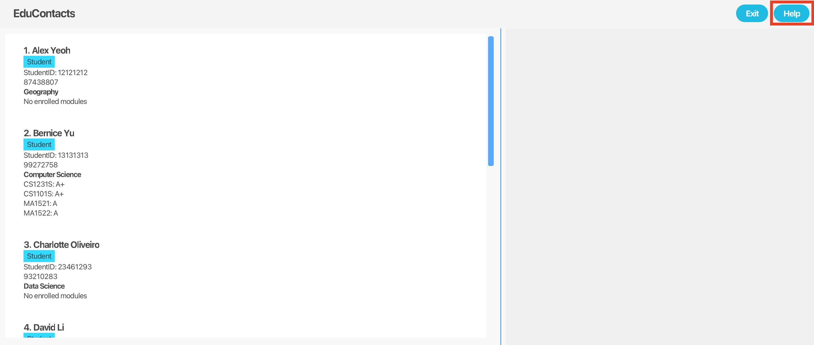

<br>

# EduContacts User Guide

<br>

EduContacts is a **desktop app for educators in tertiary institutions to manage contacts, optimized for use via a Command Line Interface** (CLI) while still having the benefits of a Graphical User Interface (GUI). For expert users familiar with command-based tools, EduContacts can get your contact management tasks done faster than traditional GUI apps. For new users, EduContacts also includes user-friendly and intuitive features and guidance, making it user-friendly and accessible for all users.

<br>
<!-- * Table of Contents -->

1. [Guidance Icons Legend](#guidance-icons-legend)
2. [Quick start](#quick-start)
3. [Features](#features)
    - [Viewing help : `help`](#viewing-help-help)
    - [Adding a person: `add`](#adding-a-person-add)
    - [Listing all persons : `list`](#listing-all-persons-list)
    - [Editing a person : `edit`](#editing-a-person-edit)
    - [Grading a person : `grade`](#grading-a-person-grade)
    - [Listing students by certain attributes : `filter`](#listing-students-by-certain-attributes-filter)
    - [Adding a module to a student: `module`](#adding-a-module-to-a-student-module)
    - [Deleting a person : `delete`](#deleting-a-person-delete)
    - [Finding a person: `find`](#finding-a-person--find)
    - [Clearing all entries : `clear`](#clearing-all-entries-clear)
    - [Exiting the program : `exit`](#exiting-the-program-exit)
4. [FAQ](#faq)
5. [Known issues](#known-issues)
6. [Command summary](#command-summary)

--------------------------------------------------------------------------------------------------------------------
<div style="page-break-after: always;"></div>

## Guidance Icons Legend

**Legend:**
<box type="tip" seamless>

**Tip:**  Helpful suggestions to improve your experience or maximize efficiency.</box>

<box type="info" seamless>

**Note:**  Important information or details to keep in mind for correct usage.</box>

<box type="warning" seamless>

**Warning:** Critical cautions to prevent errors, potential issues, or data loss.</box>

--------------------------------------------------------------------------------------------------------------------
<div style="page-break-after: always;"></div>

## Quick start

1. Ensure you have Java `17` or above installed in your computer.
[Download Java here](https://www.oracle.com/sg/java/technologies/downloads/) if you haven't already.

<box type="tip" seamless>

**Tip:**  After downloading, you can confirm installation by typing `java -version` in your command terminal.

</box>

2. Download the latest `.jar` file from [here](https://github.com/AY2425S1-CS2103T-F15-2/tp/releases).

3. Copy the file to the folder you want to use as the home folder for your EduContacts.

4. To run EduContacts, open a command terminal.

   To navigate to the folder where you placed the `.jar` file, use the `cd` command. For example, if you placed the file in a folder named `EduContacts` on your desktop, you would enter:

   ```bash
   cd ~/Desktop/EduContacts
   ```

   and use the following command to run the application:

   ```bash
   java -jar educontacts.jar
   ```

   A GUI similar to the screenshot below should appear in a few seconds. Note how the app contains some sample data.<br>

   

5. Type the command in the command box and press Enter to execute it. e.g. typing **`help`** and pressing Enter will open the help window.<br>
   Some example commands you can try:

   ```bash
   list
      ```
   Lists all contacts.

   ```bash
   add 12345678 n/John Doe p/99999999 e/johndoe@example.com a/123 Jane Doe Road c/Computer Science r/Student
   ```
   Adds a person named `John Doe` to EduContacts.

   ```bash
   delete 12345678
   ```
   Deletes a person contact with student ID `12345678`.

   ```bash
   clear
   ```
   Deletes all contacts.

   ```bash
   exit
   ```
   Exits the EduContacts application.

<box type="tip" seamless>

**Tip:** Use the UP and DOWN arrow keys to scroll through previous commands in the Command Box. This feature helps you reuse recent commands without retyping, making it faster for you to correct or repeat commands!
</box>

6. Refer to the [Features](#features) below for details of each command.

--------------------------------------------------------------------------------------------------------------------
<div style="page-break-after: always;"></div>

## Features

<box type="info" seamless>

**Notes about the command format:**<br>

* All command words should be in lowercase.


* Words in `UPPER_CASE` are the parameters to be supplied by the user.<br>
  e.g. in `add n/NAME`, `NAME` is a parameter which can be used as `add n/John Doe`.


* Parameters enclosed in square brackets indicate that they are optional. <br>
  e.g. in `filter n/NAME [m/MODULE]`, `MODULE` is a parameter which can be included or omitted as needed.


* Parameters can be in any order.<br>
  e.g. if the command specifies `n/NAME p/PHONE_NUMBER`, `p/PHONE_NUMBER n/NAME` is also acceptable.


* Extraneous parameters for commands that do not take in parameters (such as `help`, `list`, `exit` and `clear`) will be ignored.<br>
  e.g. if the command specifies `help 123`, it will be interpreted as `help`.


* If you are using a PDF version of this document, be careful when copying and pasting commands that span multiple lines as space characters surrounding line-breaks may be omitted when copied over to the application.
</box>

### Viewing help : `help`

Shows a message explaining how to access the help page.

Format:
```bash
help
```

The help window will display the help message as shown in the screenshot below:

Alternatively, you can click the button on the top right hand corner as indicated here:


<br>

### Adding a person: `add`

Adds a person contact to EduContacts.

Format:
```bash
add ID n/NAME p/PHONE e/EMAIL a/ADDRESS c/COURSE r/ROLE
```

Examples:
* `add 87654321 n/Betsy Crowe r/Student e/betsycrowe@example.com a/Blk 30 Geylang Street 29, #06-40 p/12345678 c/Business Analytics` will add a person named `Betsy Crowe` with student ID of `87654321` to EduContacts.
* `add 12345678 n/John Doe p/98981212 e/johndoe@example.com a/123 Jane Doe Road c/Computer Science r/Student` will add a person named `John Doe` with student ID of `12345678` to EduContacts.
* `add 71271222 n/Benson Boon p/89229191 e/benson@example.com a/Blk 12 Benson Street c/Economics r/Student` will add a person named `Benson Boon` with student ID of `71271222` to EduContacts (the response message of this command is shown in the screenshot below).

  

<br>

### Listing all persons : `list`

Shows a list of all persons in EduContacts.

Format:
```bash
list
```
The response message of this command is shown in the screenshot below:


<br>

### Adding a module to a person: `module`

Adds a module to a specified person in EduContacts.

Format:
```bash
module ID m/MODULE
```

Examples:
* `module 12345678 m/GEA1000` will add a module `GEA1000` to a person with student ID of `12345678`.
* `module 13131313 m/CS2103T` will add a module `CS2103T` to a person with student ID of `13131313` (the response message of this command is shown in the screenshot below).

  

<br>

### Editing a person : `edit`

Edits a specified person in EduContacts.

Format:
```bash
edit ID [FIELD_TO_EDIT_PREFIX] [NEW_VALUE]
```


* Edits a person's details according to the fields specified.
* At least one of the optional fields must be provided.
* Existing values will be updated to the input values.

Examples:
*  `edit 12345678 m/CS2103T CS2101` will edit a person with student ID of `12345678` by replacing the old module `CS2103T` with the new module `CS2101`.
*  `edit 12121212 c/Computer Science` will edit a person with student ID of `12121212` by editing their course to `Computer Science` (the response message of this command is shown in the screenshot below).

   

<br>

### Adding a grade : `grade`

Adds a grade to a person's module.

```bash
grade ID m/MODULE g/GRADE
```

* Adds a grade to a person according to the specified student ID and Module.
* Module specified must exist prior to execution grade command.
* Acceptable grades: `A+, A, A-, B+, B, B-, C+, C, D+, D, F`.
* Existing grade will be updated to the input grade.

Examples:
* `grade 23876767 m/CS2103T g/A` will assign an `A` grade to the `CS2103T` module of a person with student ID of `23876767`.
* `grade 14141414 m/CS1101S g/B+` will assign an `B+` grade to the `CS1101S` module of a person with student ID of `14141414`.

<br>

### Listing person by certain attributes : `filter`

Filters person contacts based on their names, courses and modules.

Format:
```bash
filter [KEYWORD_PREFIX] [MORE_KEYWORDS]
```

* **For filtering by names:**
  * Use prefix `n/`.
  * Only full words will be matched e.g. `Han` will not match `Hans`
  * The order of the keywords does not matter. e.g. `Hans Bo` will match `Bo Hans`
  * Persons matching at least one keyword will be returned (i.e. `OR` search).
  e.g. `Hans Bo` will return `Hans Gruber`, `Bo Yang`

<!-- -->

* **For filtering by Module:**
  * Use prefix `m/`.
  * Partial matching is supported, allowing users to input parts of module codes. e.g. `m/CS21` will match modules like "CS2103T" and "CS2101."

<!-- -->

* **For filtering by Course:**
  * Use prefix `c/`
  * Partial matching is supported, but the first keyword must match the beginning of the course name.
    e.g `Engineer` will match courses like "Engineering" but not "Civil Engineering".

<box type="tip" seamless>

**Tip:**  The search is case-insensitive. e.g `cs1231s` will match `CS1231S`.
</box>

Examples:
* `filter n/John` will return a list of all persons with `John` in their name e.g. `john` and `John Doe`.
* `filter m/CS2103T` will return a list of all persons with module `CS2103T`.
* `filter c/Computer Science` will return a list of all persons with course `Computer Science`.
* `filter n/alex david` will return a list of all persons with `alex` or `david` in their name e.g.  `Alex Yeoh`, `David Li` (the result of this command is shown in the screenshot below).

  
<br>

<box type="info" seamless>

**Note:**  After using `filter`, only the persons displayed in the filtered list can be edited or deleted, and persons not shown in this truncated list cannot be modified.  

To return to display the full list of persons, use the `list` command.

</box>

### Deleting a person/module : `delete`

Deletes the specified person/module from EduContacts. This command has 2 formats.

Format 1:
```bash
delete ID
```

* Deletes person with the specified student ID.

Examples:
* `delete 15151515` will delete a person with student ID of `15151515` from EduContacts.
* `delete 71271222` will delete a person with student ID of `71271222` from EduContacts (the response message of this command is shown in the screenshot below).

  

Format 2:
```bash
delete ID m/MODULE
```

* Deletes a module from the person with the specified student ID.

Examples: 
* `delete 13131313 m/CS2103T` will delete the module `CS2103T` from a person with student ID of `13131313` (the result of this command is shown in the screenshot below).

  
<div style="page-break-after: always;"></div>

### Finding a person : `find`

Finds the specified person from EduContacts and displays their details.

Format: `find ID`

* Finds student with the specified `ID`.

Examples:
* `find 12345678` will find a person with student ID of `12345678` and display their details.

<br>

### Clearing all entries : `clear`

Clears all entries from EduContacts.

Format:
```bash
clear
```

<box type="warning" seamless>

**Warning:**
The `clear` command will erase all contacts from the system. Please ensure that you have backed up any important information before proceeding. This action cannot be undone, so use this command with caution.

</box>

<br>

### Exiting the program : `exit`

Exits the EduContacts application.

Format:
```bash
exit
```

<br>

### Saving the data

EduContacts data are saved in the hard disk automatically after any command that changes the data. There is no need to save manually.

<br>

### Editing the data file

EduContacts data are saved automatically as a JSON file `[JAR file location]/data/educontacts.json`. Advanced users are welcome to update data directly by editing that data file.

<box type="warning" seamless>

**Warning:**
If your changes to the data file makes its format invalid, EduContacts will discard all data and start with an empty data file at the next run.  Hence, it is recommended to take a backup of the file before editing it.<br>
Furthermore, certain edits can cause the EduContacts to behave in unexpected ways (e.g., if a value entered is outside the acceptable range). Therefore, edit the data file only if you are confident that you can update it correctly.
</box>

--------------------------------------------------------------------------------------------------------------------
<div style="page-break-after: always;"></div>

## FAQ

**Q**: I am unfamiliar with command-line interfaces. How should I begin using EduContacts?<br>
**A**: We recommend starting with the **Quick Start** section of the user guide, which provides essential steps for setup and installation. Once you have the application running, utilize the `help` command or Help button to view a comprehensive list of available commands and their functions. Additionally, the **Features** section offers detailed instructions and examples for each command. We recommend familiarizing yourself with these resources as it will enhance your experience with EduContacts.

**Q**: How do I transfer my data to another computer?<br>
**A**: Install the app in the other computer and overwrite the empty data file it creates with the file that contains the data of your previous EduContacts home folder.

**Q**: Is there a way to recover accidentally deleted contacts?<br>
**A**: Unfortunately, once deleted, a contact cannot be recovered unless you have a backup of the JSON file from before deletion. Regular backups are recommended for this reason.

**Q**: Can I export my contacts to Excel or another format?<br>
**A**: EduContacts data is stored in JSON format. You can convert JSON files to Excel or CSV using an external tool or script to make data compatible with spreadsheet applications.

--------------------------------------------------------------------------------------------------------------------

## Known issues

1. **When using multiple screens**, if you move the application to a secondary screen, and later switch to using only the primary screen, the GUI will open off-screen. The remedy is to delete the `preferences.json` file created by the application before running the application again.
2. **If you minimize the Help Window** and then run the `help` command (or use the `Help` menu, or the keyboard shortcut `F1`) again, the original Help Window will remain minimized, and no new Help Window will appear. The remedy is to manually restore the minimized Help Window.

--------------------------------------------------------------------------------------------------------------------
<div style="page-break-after: always;"></div>

## Command summary

Action     | Format, Examples
-----------|----------------------------------------------------------------------------------------------------------------------------------------------------------------------
**Add**    | `add ID n/NAME p/PHONE e/EMAIL a/ADDRESS c/COURSE r/ROLE` <br> e.g., `add 12345678 n/John Doe p/99999999 e/johndoe@example.com a/123 Jane Doe Road c/Computer Science r/Student`
**Clear**  | `clear`
**Delete** | `delete ID`<br> e.g., `delete 12345678` <br> <br> `delete ID m/MODULE` <br> e.g., `delete 12345678 m/CS2103T`
**Edit**   | `edit ID [n/NAME] [p/PHONE_NUMBER] [e/EMAIL] [a/ADDRESS] [c/COURSE] [r/ROLE]…​`<br> e.g.,`edit 12345678 p/91234567 e/johndoe@example.com`
**Grade**  | `grade ID m/MODULE g/GRADE` <br> e.g. `grade 12345678 m/CS2103T g/A`
**Add Module** | `module ID m/MODULE` <br> e.g., `add 12345678 m/CS2103T`
**Filter**   | `filter [n/NAME] [c/COURSE] [m/MODULE]`<br> e.g., `filter n/James Jake`
**Find**   | `find ID`<br> e.g., `find 12345678`
**List**   | `list`

