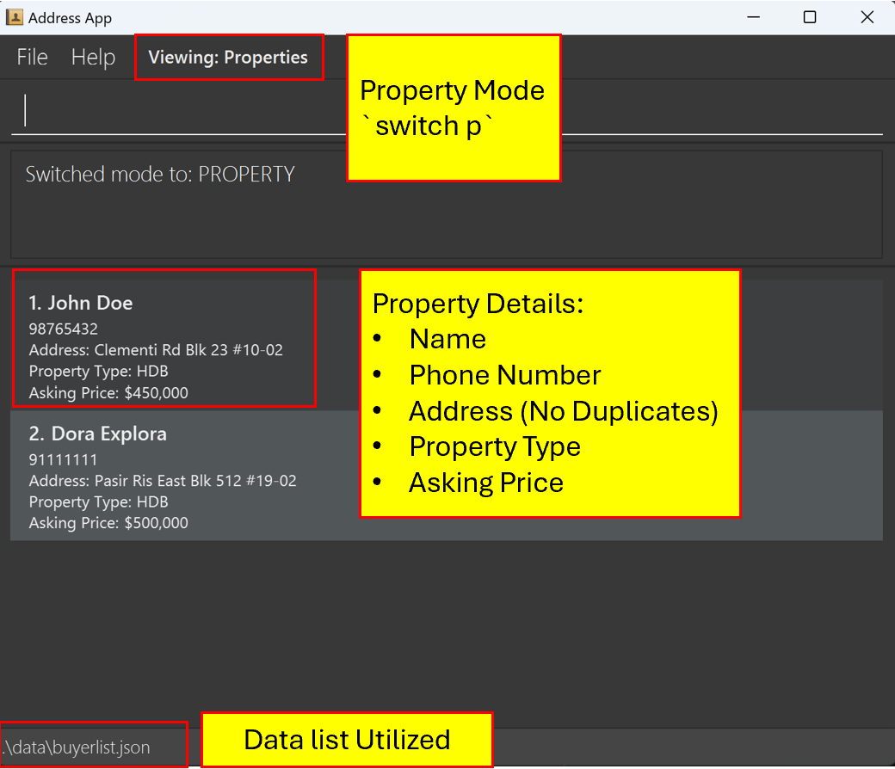

Address Book Command Line Interface (ABCLI) is a **desktop app made specially for Real Estate Agents to manage contacts and is optimized for use via a Command Line Interface** (CLI) while still having the benefits of a Graphical User Interface (GUI). If you are a real estate agent and can type fast, ABCLI can get your contact management tasks done faster than traditional GUI apps.

* Table of Contents
{:toc}

--------------------------------------------------------------------------------------------------------------------

## Quick start

1. Ensure you have Java `17` or above installed in your Computer.

2. Download the latest `.jar` file from [here](https://github.com/AY2425S1-CS2103T-F13-2/tp/releases/).

3. Copy the file to the folder you want to use as the _home folder_ for your application.

4. Open a command terminal, `cd` into the folder you put the jar file in, and use the `java -jar abcli.jar` command to run the application. 
   A GUI similar to the below should appear in a few seconds. Note how the app contains some sample data. 
   

5. Type the command in the command box and press Enter to execute it. e.g. typing **`help`** and pressing Enter will open the help window. 
   Some example commands you can try:

   * `list` : Lists all contacts.

   * `add n/John Doe p/98765432 e/johnd@example.com a/John street, block 123, #01-01 u/buyer` : Adds a contact named `John Doe` to the Address Book.

   * `delete 3` : Deletes the 3rd contact shown in the current list.

   * `clear` : Deletes all contacts.

   * `exit` : Exits the app.

6. Refer to the [Features](#features) below for details of each command.

--------------------------------------------------------------------------------------------------------------------

## Features

**:information_source: Notes about the command format:** 

* Words in `UPPER_CASE` are the parameters to be supplied by the user. 
  e.g. in `add n/NAME`, `NAME` is a parameter which can be used as `add n/John Doe`.

* Items in square brackets are optional. 
  e.g `n/NAME [t/TAG]` can be used as `n/John Doe t/friend` or as `n/John Doe`.

* Items in angle brackets represent input choices. 
    e.g `t/<buyer,seller>` can be used as `t/buyer` or as `t/seller` only.

* Items with `…`​ after them can be used multiple times including zero times. 
  e.g. `[t/TAG]…​` can be used as ` ` (i.e. 0 times), `t/friend`, `t/friend t/family` etc.

* Parameters can be in any order. 
  e.g. if the command specifies `n/NAME p/PHONE_NUMBER`, `p/PHONE_NUMBER n/NAME` is also acceptable.

* Extraneous parameters for commands that do not take in parameters (such as `help`, `list`, `exit` and `clear`) will be ignored. 
  e.g. if the command specifies `help 123`, it will be interpreted as `help`.

* If you are using a PDF version of this document, be careful when copying and pasting commands that span multiple lines as space characters surrounding line-breaks may be omitted when copied over to the application.

## General

### Viewing help : `help`

Shows a message explaining how to access the help page.

Format: `help`

### Clearing all entries : `clear`

Clears all entries from the buyer list.

Format: `clear`

### Exiting the program : `exit`

Exits the program.

Format: `exit`

### Saving the data

BuyerList data are saved in the hard disk automatically after any command that changes the data. There is no need to save manually.

### Editing the data file

All data is saved automatically as a JSON file within the storage folder. Advanced users are welcome to update data directly by editing that data file.

Note: By default, the storage folder is set to a folder named `package` in the home folder.

:exclamation: **Caution:**
If your changes to the data file makes its format invalid, the data files will discard all data and start with an empty data file at the next run. Hence, it is recommended to take a backup of the file before editing it. 
Furthermore, certain edits can cause the JSON files to behave in unexpected ways (e.g., if a value entered is outside the acceptable range). Therefore, edit the data file only if you are confident that you can update it correctly.

### Switching parser modes : `switch`

Switches the parser mode to the specified parser mode.

Format: `switch PARSER_MODE`

* Switches the parser mode to the specified `PARSER_MODE`.
* The parser mode takes 3 types:
* `b` for [buyers](#buyer-mode)
* `m` for meet-ups
* `p` for properties [properties](#property-mode)
* The default parser mode is set to `b`.

Examples:
* Upon entering the application, the parser mode is set to `b`.
* `switch` followed by `m` switches the parser mode to meet-ups.

**:information_source: Notes about parser mode-switching:** 

* The mode before the switch can be seen at the top bar, where it says `Viewing: Buyers`, after the switch it changes to `Viewing: Meet Ups`.

* The view also automatically changes from showing `Buyers` to `Meet Ups` after the switch command, this view will also change appropriately when switching to `b` or `p`.

* The mode is important for command execution, e.g. to `add` a `Buyer`, you need to be in the `b` mode, to `add` a `MeetUp`, you need to be in the `m` mode, etc.

## Buyers

**:information_source: These commands are for when the parser is in `b` mode (Buyer mode) see [Switching parser modes](#switching-parser-modes--switch):** 

* Note how the list already contains sample `Buyer`s (if this is the first time using the app)

* Note how the mode is highlighted by `Viewing: Buyers` above the command line

In buyer mode, you will be able to store and view the list of buyer's details.

### Viewing all buyers : `view`

Shows a list of all buyers in the buyer list.

Format: `view`

### Adding a buyer: `add`

Adds a buyer to the buyer list.

Format: `add n/NAME p/PHONE_NUMBER e/EMAIL b/BUDGET [t/TAG]…​`

* New buyers must have unique names and cannot duplicate names of existing buyers.

:bulb: **Tip:**
A buyer can have any number of tags (including 0)

Examples:
* `add n/John Doe p/98765432 e/johnd@example.com b/100,000`
* `add n/Betsy Crowe t/urgent e/betsycrowe@example.com b/7,000,000 p/91234567 t/referred`

### Editing a buyer : `edit`

Edits an existing buyer in the buyer list.

Format: `edit INDEX [n/NAME] [p/PHONE] [e/EMAIL] [b/BUDGET] [t/TAG]…​`

* Edits the buyer at the specified `INDEX`. The index refers to the index number shown in the displayed buyer list. 
* The index refers to the index number shown in the **displayed buyer list**.
* The index must be a positive integer: 1, 2, 3, …​
* Existing values will be updated to the input values.
* When editing tags, the existing tags of the buyer will be removed i.e adding of tags is not cumulative.
* You can remove all the buyer’s tags by typing `t/` without
    specifying any tags after it.

Examples:
*  `edit 1 p/81234567 e/johndoe@example.com` Edits the phone number and email budget of the 1st buyer to be `81234567` and `johndoe@example.com` respectively.
*  `edit 2 n/Betsy Crower t/` Edits the name of the 2nd buyer to be `Betsy Crower` and clears all existing tags.

### Locating buyer contacts: `find`

Finds existing buyers in existing buyer list based on keywords.

Format: `find n/KEYWORD [MORE_KEYWORDS]`

* Only the name is searched.
* The search is case-insensitive. e.g `hans` will match `Hans`
* The order of the keywords does not matter. e.g. `Hans Bo` will match `Bo Hans`
* Only full words will be matched e.g. `Han` will not match `Hans`
* Buyers matching at least one keyword will be returned (i.e. `OR` search).
  e.g. `Hans Bo` will return `Hans Gruber`, `Bo Yang`

:rocket: **Future Enhancement:**
Planned update will allow searches using other attributes, such as: `b/BUDGET`, `p/PHONE`, `e/EMAIL`, and `t/TAG`.

Examples:
* `find n/John` returns `john` and `John Doe`
* `find n/alex david` returns `Alex Yeoh`, `David Li` 

### Deleting a buyer : `delete`

Deletes the specified buyer from the buyer list.

Format: `delete INDEX`

* Deletes the buyer at the specified `INDEX`.
* The index refers to the index number shown in the **displayed buyer list**.
* The index must be a positive integer: 1, 2, 3, …​
* The index cannot exceed the displayed list's range.

Examples:
* `view` followed by `delete 2` deletes the 2nd buyer in the displayed buyer list.
* `find Betsy` followed by `delete 1` deletes the 1st buyer in the displayed results of the `find` command.

## Meet Up

**:information_source: These commands are for when the parser is in `m` mode (MeetUp mode) see [Switching parser modes](#switching-parser-modes--switch):** 

* Note how the list already contains sample `Meet Up`s (if this is the first time using the app)

* Note how the mode is highlighted by `Viewing: Meet Ups` above the command line

### Adding a meetup: `add`

Adds a meet-up to the meet-up list.

Format: `add n/MEETUP_SUBJECT i/MEETUP_INFO from/MEETUP_FROM to/MEETUP_TO`

MEETUP_FROM and MEETUP_TO fields should follow the format YYYY-MM-DD HH:MM

Examples:
* `add n/Product Pitch i/Product pitch for James at MBS from/2024-10-31 13:00 to/2024-10-31 15:30`
* `add n/Show buyer 3 houses i/Meet with James Jimes to show him 3 houses that fit his expectations from/2024-10-30 09:30 to/2024-10-30 10:30`

Meet Ups with clashing timings will be displayed in red. Otherwise, the default display colour for timing is green.

### Viewing all meet-ups : `view`

Shows a list of all meet-ups in the meet-up list.

Format: `view`

Examples: `view` will show you all meet-ups in the meet-up list.

### Editing a meet-up : `edit`

Edits an existing meet-up in the meet-up list.

Format: `edit INDEX i/MEETUP_INFO from/MEETUP_FROM to/MEETUP_FROM`

MEETUP_FROM and MEETUP_TO` fields should follow the format  `YYYY-MM-DD HH:MM`

* Edits the meet-up at the specified `INDEX`. The index refers to the index number shown in the displayed meet-up list. The index **must be a positive integer** 1, 2, 3, …​
* All fields need to be provided.
* Existing values will be updated to the input values.

Examples:
*  `edit 1 i/Meet with Johnny to show him houses. from/2024-10-28 10:00 to/2024-10-28 12:00` Edits the info, meet-up time of the 1st meet-up to be `Meet with Johnny to show him houses.`, `2024-10-28 10:00` and `2024-10-28 12:00` respectively.

### Locating meet-ups by name: `find`

Finds meet-ups whose meet-up names contain any of the given keywords.

Format: `find KEYWORD`

* The search is case-insensitive. e.g `meet` will match `Meet`
* Only the meet-up name is searched.
* Keyword will be matched to full words and sentences e.g. `meet` will match `meetup` and `meet with Jack`

Examples:
* `find Meet` returns `Meet up with Jack to discuss property prices` and `Go to MBS for meeting with Jane`

### Deleting a meet-up : `delete`

Deletes the specified meet-up from the buyer list.

Format: `delete INDEX`

* Deletes the meet-up at the specified `INDEX`.
* The index refers to the index number shown in the displayed meet-up list.
* The index **must be a positive integer** 1, 2, 3, …​

Examples:
* `list` followed by `delete 2` deletes the 2nd meet-up in the meet-up list.
* `find meet` followed by `delete 1` deletes the 1st meet-up in the results of the `find` command.

## Properties

**:information_source: These commands are for when the parser is in `p` mode (Property mode) see [Switching parser modes](#switching-parser-modes--switch):** 

* Note how the list already contains sample `Property`s (if this is the first time using the app)

* Note how the mode is highlighted by `Viewing: Properties` above the command line

In property mode, you will be able to store and view the list of property's details.

### Viewing all properties : `view`

Shows a list of all properties in the property list.

Format: `view`

### Adding a property: `add`

Adds a property to the property list.

Format: `add n/LANDLORD_NAME p/PHONE_NUMBER a/ADDRESS s/ASKING_PRICE t/PROPERTY_TYPE`

Examples:
* `add n/John p/87152433 a/Paya Lebar s/200,000 t/Condominium`

### Editing a property : `edit`

Edits an existing property in the property list.

Format: `edit INDEX [n/LANDLORD_NAME] [p/PHONE_NUMBER] [a/ADDRESS] [s/ASKING_PRICE] [t/PROPERTY_TYPE]`

* Edits the buyer at the specified `INDEX`. The index refers to the index number shown in the displayed property list. The index **must be a positive integer** 1, 2, 3, …​
* At least one of the optional fields must be provided.
* Existing values will be updated to the input values.

Examples:
*  `edit 1 p/91234567 e/johndoe@example.com` Edits the phone number and email of the 1st buyer to be `91234567` and `johndoe@example.com` respectively.
*  `edit 2 n/Betsy Crower` Edits the name of the 2nd buyer to be `Betsy Crower`.

### Locating Properties: `find`

Find existing properties in the property list based on either name or address keywords.

Format: `find n/LANDLORD_NAME`
Format: `find a/ADDRESS`

* The tags used in searching should only be `n/` or `a/`, but not both.
* The search is case-insensitive. e.g `hans` will match `Hans`
* The order of the keywords does not matter. e.g. `Hans Bo` will match `Bo Hans`
* Only full words will be matched e.g. `Han` will not match `Hans`
* Properties matching at least one keyword will be returned (i.e. `OR` search).
  e.g. `n/Hans Bo` will return property linked with `Hans Gruber`, `Bo Yang`.

Examples:
* `find n/John` returns `john` and `John Doe`
* `find a/Pasir Ris` returns `pasir ris east` and `Pasir Ris West`

### Deleting a property: `delete`

Deletes the specified property from the property list

Format: `delete INDEX`

* Deletes the property at the specified `INDEX`.
* The index refers to the index number shown in the **displayed property list**.
* The index must be a positive integer: 1, 2, 3, ...
* The index cannot exceed the displayed list's range

Examples:
* `view` followed by `delete 4` deletes the 4th property in the displayed property list.
* `find n/Adam` followed by `delete 2` deletes the 2nd property in the displayed results of the find command.
--------------------------------------------------------------------------------------------------------------------

## FAQ

**Q**: How do I transfer my data to another Computer? 
**A**: Install the app in the other computer and overwrite the empty data files (`buyerlist.json`, `meetuplist.json`, and `propertylist.json`) it creates with the respective files that contain your previous data (which should be in the old `buyerlist.json`, `meetuplist.json`, and `propertylist.json`).

**Q**: Where can I find my local data files? 
**A**: In the same folder that contains your app `Abcli.jar`, there should be a folder called `data` which contains `buyerlist.json`, `meetuplist.json`, and `propertylist.json`.

**Q**: How do I add MeetUps or Properties? I can only add buyers 
**A**: You are likely in the `BuyerMode` indicated by the `Viewing: Buyers` shown at the top bar, to switch to `MeetUpMode`, use `switch m`, and to switch to `Property Mode`, use `switch p`. For more details, see [Switching parser modes](#switching-parser-modes--switch).

**Q**: Is there a separate save command/button, are all my changes auto-saved? 
**A**: Any successfully inputted command will save the changes into the data files, thus there is no need to worry about manually saving your changes.

--------------------------------------------------------------------------------------------------------------------

## Known issues

1. **When using multiple screens**, if you move the application to a secondary screen, and later switch to using only the primary screen, the GUI will open off-screen. The remedy is to delete the `preferences.json` file created by the application before running the application again.
2. **If you minimize the Help Window** and then run the `help` command (or use the `Help` menu, or the keyboard shortcut `F1`) again, the original Help Window will remain minimized, and no new Help Window will appear. The remedy is to manually restore the minimized Help Window.

--------------------------------------------------------------------------------------------------------------------

## Command summary

<table>
    <tr>
        <th>Action</th>
        <th>Buyer</th>
        <th>Property</th>
        <th>Meetup</th>
    </tr>
    <tr>
        <td><b>Add</b></td>
        <td><code>add n/NAME p/PHONE e/EMAIL b/BUDGET [t/TAG]…​</code>  e.g., <code>add n/James Ho p/22224444 e/jamesho@example.com a/1200000 t/friend t/colleague</code></td>
        <td><code>add n/LANDLORD_NAME a/ADDRESS p/PHONE s/ASKING_PRICE t/TYPE…​</code>  e.g., <code>add n/Janice Tan a/123 West Coast #12-288 p/33334444 a/650000 t/HDB</code></td>
        <td><code>add s/SUBJECT i/INFO f/FROM t/TO [a/ADDED_BUYERS]…​</code>  e.g., <code>add s/Discuss work plans i/Meet with Eswen to discuss the March Project a/Alex Yeoh a/David Li f/2024-02-03 14:00 t/2024-02-03 15:30 </code></td>
    </tr>
    <tr>
        <td><b>Delete</b></td>
        <td><code>delete INDEX</code>  e.g., <code>delete 3</code></td>
        <td><code>delete INDEX</code>  e.g., <code>delete 5</code></td>
        <td><code>delete INDEX</code>  e.g., <code>delete 2</code></td>
    </tr>
    <tr>
        <td><b>Edit</b></td>
        <td><code>edit INDEX [n/NAME] [p/PHONE] [e/EMAIL] [b/BUDGET] [t/TAG]…​</code>  e.g., <code>edit 2 n/James Lee e/jameslee@example.com</code></td>
        <td><code>edit INDEX [n/LANDLORD_NAME] [a/ADDRESS] [p/PHONE] [a/ASKING_PRICE] [t/TYPE]…​</code>  e.g., <code>edit 2 n/Ben Tan a/East Coast Blk 20 #11-283 </code></td>
        <td><code>edit INDEX [s/SUBJECT] [i/INFO] [f/FROM] [t/TO] [a/ADDED_BUYERS]…​</code>  e.g., <code>edit 3 a/Alex Yeoh a/Ben Ten</code></td>
    </tr>
    <tr>
        <td><b>Find</b></td>
        <td><code>find KEYWORD [MORE_KEYWORDS]</code>  e.g., <code>find James Jake</code></td>
        <td><code>find [a/KEYWORD] [n/KEYWORD] [MORE_KEYWORDS]</code>  e.g., <code>find a/Lakefront</code></td>
        <td><code>find KEYWORD [MORE_KEYWORDS]</code>  e.g., <code>find Project </code></td>
    </tr>
    <tr>
        <td><b>List</b></td>
        <td colspan="3"><code>view</code></td>
    </tr>
    <tr>
        <td><b>Help</b></td>
        <td colspan="3"><code>help</code></td>
    </tr>
    <tr>
        <td><b>Clear</b></td>
        <td colspan="3"><code>clear</code></td>
    </tr>
</table>
