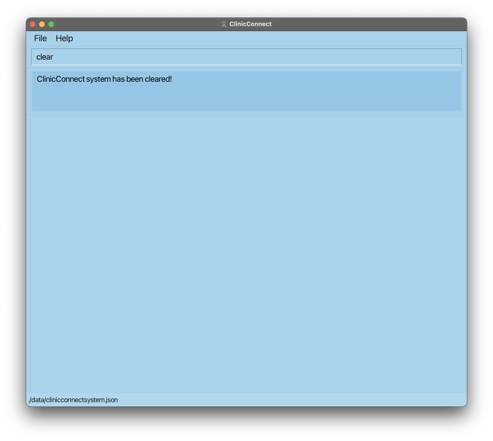

ClinicConnect is the **the *ideal* patient management and appointment tracker system for health-screening clinics.** With *unique* functions and layouts tailored to your workflows as health screening clinic assistants, ClinicConnect can get your patient management tasks done faster, more efficiently, and hassle-free.

---

## Table of Contents

{:toc}

---

## Quick start

1. Ensure you have Java `17` or above installed in your Computer.

1. Download the latest `.jar` file from [here](https://github.com/se-edu/addressbook-level3/releases).

1. Copy the file to the folder you want to use as the _home folder_ for your ClinicConnectSystem.

1. Open a command terminal, `cd` into the folder you put the jar file in, and use the `java -jar clinicconnectsystem.jar` command to run the application. 
   A window similar to the one below should appear in a few seconds. Note how the app contains some sample data. 
   

1. Type the command in the command box at the top and press Enter to execute it. e.g. typing **`help`** and pressing Enter will open the help window. 
   Some example commands you can try:

   * `home` : Lists all patients.

   * `add n|John Doe i|T0123456A p|98765432 s|M d|1990-12-29` : Adds a patient named `John Doe` to the ClinicConnect system.

   * `delete T0123456A` : Deletes the patient with the NRIC "T0123456A" shown in the current list.

   * `clear` : Deletes all patients.

   * `exit` : Exits the app.

1. Refer to the [Features](#features) below for details of each command.

--------------------------------------------------------------------------------------------------------------------

## ClinicConnect Features

ClinicConnect is designed to streamline clinic processes with various functionalities to book appointments and manage patient details effectively. These features allow you to perform a range of operations, from adding new patient records, managing patient details, scheduling appointments, filtering health services and customizing data to enhance productivity. 

The following sections will delve into the individual features, providing detailed descriptions and guidance on how to utilize each function to make the most out of the system's capabilities. 

### Legend
These boxes might offer some additional information of different types:

**:information_source: Important:** 
Highlights important information that you should know.

:bulb: **Tip:**
Provides you with tips to use our system more effectively.

:bulb: **Tip:**
You can search for relevant info in the user guide by typing <code>Ctrl + F</code> for Windows and Linux computers and <code>⌘ + F</code> for Mac.

**:information_source: Notes about the command format:** 

* Words in `UPPER_CASE` are the parameters to be supplied by the user. 
  e.g. in `add n|NAME`, `NAME` is a parameter which can be used as `add n|John Doe`.

* Items in square brackets are optional. 
  e.g `n|NAME [al|ALLERGY]` can be used as `n|John Doe al|friend` or as `n|John Doe`.

* Parameters immediately preceding an ellipsis(...) can appear more than once, to add multiple arguments of the same type. 
  e.g `al|ALLERGY...` can be used as `al|fish al|nuts` or `al|nuts`.

* Parameters can be in any order. 
  e.g. if the command specifies `n|NAME p|PHONE_NUMBER`, `p|PHONE_NUMBER n|NAME` is also acceptable.

* Extraneous parameters for commands that do not take in parameters (such as `home`, `exit` and `clear`) will be ignored. 
  e.g. if the command specifies `home 123`, it will be interpreted as `home`.

* If you are using a PDF version of this document, be careful when copying and pasting commands that span multiple lines as space characters surrounding line-breaks may be omitted when copied over to the application.

### Viewing help : `help`

Opens a separate help window detailing a summary of the commands available and their functions.

Format: `help`

#### Viewing help for individual commands

Opens a separate help window showing more information about a specific command.

Format: `help COMMAND_KEYWORD`

**:information_source: Important:** 
This command only takes in one command keyword.

**:information_source: Information:** 
Multiple help windows can be open at any point in time, but only one help window per command keyword can be open.

Examples:
* `help add`
* `help edit`

:bulb: **Tip:**
Press `esc` to close the help window.

:bulb: **Tip:**
You can keep the help windows open and refer to it while using our application.

To check out the list of all commands in ClinicConnect, click [here](#command-summary).

### Adding a patient: `add`

Adds a new patient record into the system.

Format: `add n|NAME i|NRIC s|SEX d|DATE_OF_BIRTH p|PHONE_NUMBER`

**:information_source: Important:** 
Each person should have a unique NRIC.
ClinicConnect does not allow two patients with the same NRIC to exist in the system.

:bulb: **Tip:**
Use this command to quickly add a patient with only the required information.

Example: `add n|Abraham Tan i|S9758366N s|M d|1997-10-27 p|87596666`
 
Adds a patient Abraham Tan with his NRIC, Sex, Date-of-Birth and Phone Number.

For more information on each individual parameter click [here](#command-parameters-summary).

### Adding a patient with additional information: `addf`

Adds a new patient record into the system with additional information.

Format: `add n|NAME i|NRIC s|SEX d|DATE_OF_BIRTH p|PHONE_NO [e|EMAIL] [a|ADDRESS] [b|BLOOD_TYPE]
[nokn|NEXT_OF_KIN_NAME] [nokp|NEXT_OF_KIN_PHONE] [al|ALLERGY]…​ [rl|RISK_LEVEL] [ec|EXISTING_CONDITIONS] [no|NOTES]`

**:information_source: Important:** 
Each person should have a unique NRIC.
ClinicConnect does not allow two patients with the same NRIC to exist in the system.

:bulb: **Tip:**
Use this command if you want to add a patient with additional information in addition to the required fields
(NAME, NRIC, SEX, DATE_OF_BIRTH, PHONE_NO)

:bulb: **Tip:**
Multiple allergies can be added using multiple "al|" prefixes

Examples:
* `addf n|Abraham Tan i|S9758366N s|M d|1997-10-27 p|87596666
   e|abramhamtan@gmail.com a|Blk 123, NUS Road, S123123 b|A+ nokn|Licoln Tan nokp|91234567
   al|nuts al|shellfish rl|HIGH ec|Diabetes no|Patient needs extra care` adds a patient Abraham Tan with his NRIC, Sex, Date-of-Birth, Phone, Email, Address, Blood Type,
     Next-of-Kin Name, Next-of-Kin Phone, Risk Level, Existing Conditions, Notes and his two allergies.
* `addf n|Lincoln Park i|S9751269M s|M d|1980-04-01 p|87296619
   e|linkinpark@gmail.com a|Blk 516, Clementi Road, S661836 b|AB- al|wheat` adds a patient Lincoln Park with his NRIC, Sex, Date-of-Birth, Phone, Email, Address, Blood Type,
     and his allergy.

For more information on each individual parameter click [here](#command-parameters-summary).

### Editing a patient: `edit`

Edits the information of an existing patient in the system by searching for their NRIC.

Format: `edit NRIC [n|NAME] [i|NRIC] [s|SEX] [d|DATE_OF_BIRTH] [p|PHONE_NO] [e|EMAIL] [a|ADDRESS] [b|BLOOD_TYPE]
[nokn|NEXT_OF_KIN_NAME] [nokp|NEXT_OF_KIN_PHONE] [al|ALLERGY]…​ [rmal|ALLERGY_TO_BE_REMOVED]…​ [rl|RISK_LEVEL]
[ec|EXISTING_CONDITIONS] [no|NOTES]`

**:information_source: Important:** 
<ul>
<li>
NRIC provided must be a valid NRIC currently in the system
</li>
<li>
Input must contain at least one parameter to be edited
</li>
<li>
Not all parameters are compulsory
</li>
</ul>

**:information_source: Important:** 
<ul>
<li>
Except for allergies, existing values will be updated to the input values.
</li>
<li>
Editing EXISTING_CONDITIONS and NOTES is not cumulative (i.e. the existing conditions and notes of the patient will be removed)
</li>
<li>
Not all parameters are compulsory
</li>
</ul>

:bulb: **Tip:**
<ul>
<li>
Multiple allergies can be added using multiple "al" prefixes. Ensure allergies to be added are not current allergies 
of the patient
</li>
<li>
Multiple allergies can be removed using multiple "rmal" prefixes. Ensure allergies to be removed
are current allergies of the patient
</li>
</ul>

Examples:
* `edit S9758366N n|Abraham Lee d|1997-10-28` edits the name and date-of-birth of the patient with NRIC S9758366N.
* `edit S9758366N al|wheat al|eggs rmal|fish` add wheat and eggs and remove fish allergies to the patient with NRIC S9758366N.

For more information on each individual parameter click [here](#command-parameters-summary).

### Listing all patients : `home`

Returns to ClinicConnect home page which displays a list of all patients in the ClinicConnect System.

Format: `home`

:bulb: **Tip:**
Home Command also informs you on the number of patients currently registered in the system.

### Booking an appointment: `bookappt`
### Booking an upcoming appointment: `bookappt`

Book an upcoming appointment for an existing patient in the system for a health service provided by the clinic.

Format: `bookappt NRIC dt|APPOINTMENT_DATE_TIME h|HEALTH_SERVICE`

**:information_source: Important:** 
<ul>
<li>
NRIC provided must be a valid NRIC in the system
</li>
<li>
All parameters are compulsory
</li></ul>

Example:
* `bookappt S9758366N dt|2024-12-29 13:00 h|Vaccination` books a Vaccination appointment for the given patient by NRIC at the specified time.

For more information on each individual parameter click [here](#command-parameters-summary).

### Delete Appointment : `deleteappt`

Identifies a specific patient using NRIC and deletes the appointment specified.

Format: `deleteappt NRIC dt|APPOINTMENT_DATE_TIME`

**:information_source: Important:** 
<ul>
<li>
NRIC provided must be a valid NRIC in the system
</li>
<li>
All parameters are compulsory
</li></ul>

Example:
* `deleteappt T01234567A dt|2024-11-05 16:00`

For more information on each individual parameter click [here](#command-parameters-summary).

### Filter appointments : `filter`

Filters existing patient records based on the specified parameters.

Format: `filter [sd|START DATE] ed|END DATE [h|HEALTH SERVICE]`

Start date and health service parameters are optional.
End date parameter is compulsory.

When all parameters are specified, it returns all appointments from start-date to end-date which matches the specified health service.
When start date and end date are specified, it returns all appointments from start date to end date.
When end date and health service is specified, it returns all appointments from today's date to end date which matches the specified health service.
When end date is specified, it returns all appointments from today's date to end-date.

:bulb: **Tip:**
To retrieve appointments on a single date e.g. 2024/10/20, you can input the same start and end date

`filter sd|2024-10-20 ed|2024-10-10`

Examples:
*  `filter sd|2012-10-01 ed|2012-11-01 h|blood test` filters the blood test appointments of patients from Oct 01 2012 to Nov 01 2012.
*  `filter ed|2024-12-12 h|vaccination` filters the vaccination appointments from today's date to Dec 12 2024.
*  `filter sd|2012-10-01 ed|2012-11-01` filters all appointments from Oct 01 2012 to Nov 01 2012.

For more information on each individual parameter click [here](#command-parameters-summary).

### View patients full profile: `view`

Identifies the specific patient using NRIC and shows the full profile of the patient.

Format: `view NRIC`

**:information_source: Important:** 
NRIC provided must be a valid NRIC currently in the system.

Example:
* `view T0123456A`

### Deleting a patient : `delete`

Deletes the patient with the specified NRIC from the address book.

Format: `delete NRIC`

* Deletes the patient at the specified `NRIC`.
* The NRIC refers to the nric of the patient shown in the displayed patient list.
* The NRIC **must be a valid NRIC number present in the system**

### Clearing all entries : `clear`

Clears **all** patient entries and data in the system.

Format: `clear`

**:information_source: Important:** 
Using clear will delete all data in the system. Please use it carefully.

### Exiting the program : `exit`

Exits the system and closes all windows of ClinicConnect.

Format: `exit`

:bulb: **Tip:**
Using exit command will also close any help windows that are currently open.

### Saving the data

ClinicConnectSystem data are saved in the hard disk automatically after any command that changes the data. There is no need to save manually.

### Editing the data file

ClinicConnectSystem data are saved automatically as a JSON file `[JAR file location]/data/clinicconnectsystem.json`. Advanced users are welcome to update data directly by editing that data file.

:exclamation: **Caution:**
If your changes to the data file makes its format invalid, ClinicConnectSystem will discard all data and start with an empty data file at the next run. Hence, it is recommended to take a backup of the file before editing it. 
Furthermore, certain edits can cause the ClinicConnectSystem to behave in unexpected ways (e.g., if a value entered is outside of the acceptable range). Therefore, edit the data file only if you are confident that you can update it correctly.

### Archiving data files `[coming in v2.0]`

_Details coming soon ..._

--------------------------------------------------------------------------------------------------------------------

## FAQ

**Q**: How do I transfer my data to another Computer? 
**A**: Install the app in the other computer and overwrite the empty data file it creates with the file that contains the data of your previous ClinicConnectSystem home folder.

--------------------------------------------------------------------------------------------------------------------

## Known issues

1. **When using multiple screens**, if you move the application to a secondary screen, and later switch to using only the primary screen, the GUI will open off-screen. The remedy is to delete the `preferences.json` file created by the application before running the application again.
2. **If you minimize the Help Window** and then run the `help` command (or use the `Help` menu, or the keyboard shortcut `F1`) again, the original Help Window will remain minimized, and no new Help Window will appear. The remedy is to manually restore the minimized Help Window.
3. **When adding or editing patient entries**, the combination of a NRIC starting with the character "S" and a birthdate after 1 January 2000 will be accepted by the 
system, despite this being an impossible combination of NRIC and birthdate for a patient.

--------------------------------------------------------------------------------------------------------------------

## Command summary

| Action                 | Format, Examples                                                                                                                                                                                                                                                                                                                                                                                                                                                                                                                                                 |
|------------------------|------------------------------------------------------------------------------------------------------------------------------------------------------------------------------------------------------------------------------------------------------------------------------------------------------------------------------------------------------------------------------------------------------------------------------------------------------------------------------------------------------------------------------------------------------------------|
| **Add**                | `add n|NAME i|NRIC s|SEX d|DATE_OF_BIRTH p|PHONE_NUMBER`     e.g. `add n|Abraham Tan i|S9758366N s|M d|1997-10-27 p|87596666` |
| **Add Full**           | `addf n|NAME i|NRIC s|SEX d|DATE OF BIRTH p|PHONE NUMBER [e|EMAIL] [a|ADDRESS] [b|BLOOD TYPE] [nokn|NEXT-OF-KIN NAME] [nokp|NEXT-OF-KIN PHONE NUMBER] [al|ALLERGIES]…​ [rl|HEALTH RISK LEVEL] [ec|EXISTING CONDITIONS] [no|ADDITIONAL NOTES]`    e.g. `addf n|Abraham Tan i|S9758366N s|M d|1997-10-27 p|87596666 e|abrahamtan@gmail.com a|Blk 123, NUS Road, S123123 b|A+ nokn|Lincoln Tan nokp|91234567 al|nuts al|shellfish rl|HIGH ec|Diabetes no|Patient needs extra care`                                               |
| **Book Appointment**   | `bookappt NRIC dt|APPOINTMENT_DATE_TIME h|HEALTH_SERVICE`     e.g. `bookappt S9758366N dt|2024-12-29 13:30 h|Vaccination`                                                                                                                                                                                                                                                                                                                                                                                                                              |
| **Clear**              | `clear`                                                                                                                                                                                                                                                                                                                                                                                                                                                                                                                                                          |
| **Delete Appointment** | `deleteappt NRIC dt|APPOINTMENT_DATE_TIME`     e.g. `deleteappt S9758366N dt|2024-12-29 13:30`                                                                                                                                                                                                                                                                                                                                                                                                                                                           |
| **Delete**             | `delete NRIC`     e.g. `delete S0123456Z`                                                                                                                                                                                                                                                                                                                                                                                                                                                                                                                  |
| **Edit**               | `edit NRIC [n|NAME] [i|NRIC] [s|SEX] [d|DATE_OF_BIRTH] [p|PHONE_NO] [e|EMAIL] [a|ADDRESS] [b|BLOOD_TYPE] [nokn|NEXT_OF_KIN_NAME] [nokp|NEXT_OF_KIN_PHONE] [al|ALLERGY]…​ [rmal|ALLERGY_TO_BE_REMOVED]…​ [rl|RISK_LEVEL] [ec|EXISTING_CONDITIONS] [no|NOTES]`     e.g. `edit S9758366N n|Keanu Reeves i|S9975483H s|M s|1997-11-30 p|86526969 e|keanureeves@gmail.com a|Blk 512 Ang Mo Kio Ave 2 b|O+ nokn|Mila Kunis nokp|84126990 al|nuts al|shellfish rmal|cake rmal|wheat rl|LOW ec|diabetes no|Patient is a fall risk` |
| **Exit**               | `exit`                                                                                                                                                                                                                                                                                                                                                                                                                                                                                                                                                           |
| **Filter**             | `filter [sd|START DATE] ed|END DATE [h|HEALTH SERVICE]`     e.g. `filter sd|2024-12-29 ed|2024-12-30 h|Blood Test`                                                                                                                                                                                                                                                                                                                                                                                                                                   |
| **Home**               | `home`                                                                                                                                                                                                                                                                                                                                                                                                                                                                                                                                                           |
| **View**               | `view NRIC`     e.g. `view S9758366N`                                                                                                                                                                                                                                                                                                                                                                                                                                                                                                                      |
| **Help**               | `help` **OR** `help COMMAND_KEYWORD`     e.g. `help add`                                                                                                                                                                                                                                                                                                                                                                                                                                                                                                   |

--------------------------------------------------------------------------------------------------------------------

## Command Parameters Summary

Some commands include parameters which are identified by prefixes. Here is a table showing the prefixes and what each entails:

**:information_source: Important:** 
All Prefixes/Parameters should:
<li>
Not be blank
</li>
<li>
Not start with a whitespace
</li>
<li>
Should follow the specifications given below
</li>

<table>
  <thead>
    <tr>
      <th style="text-align:center;">No.</th>
      <th style="text-align:center;">Parameter</th>
      <th style="text-align:center;">Prefix Format</th>
      <th style="text-align:center;">Specifications</th>
    </tr>
  </thead>
  <tbody>
    <tr>
      <td style="text-align:center;">1</td>
      <td style="text-align:center;">Address</td>
      <td style="text-align:center;">a|</td>
      <td>Takes all values.</td>
    </tr>
    <tr>
      <td style="text-align:center;">2</td>
      <td style="text-align:center;">Allergy</td>
      <td style="text-align:center;">al|</td>
      <td>Takes all values.</td>
    </tr>
    <tr>
      <td style="text-align:center;">4</td>
      <td style="text-align:center;">Birthdate</td>
      <td style="text-align:center;">d|</td>
      <td>Should follow the format YYYY-MM-DD. Should not be after today's date.</td>
    </tr>
    <tr>
      <td style="text-align:center;">5</td>
      <td style="text-align:center;">Blood Type</td>
      <td style="text-align:center;">b|</td>
      <td>Should be either A/B/AB/O followed by the Rhesus factor (+/-).</td>
    </tr>
    <tr>
      <td style="text-align:center;">6</td>
      <td style="text-align:center;">Date and Time</td>
      <td style="text-align:center;">dt|</td>
      <td>Should follow the format YYYY-MM-DD HH:MM. Should not be before the current date and time.</td>
    </tr>
    <tr>
      <td style="text-align:center;">7</td>
      <td style="text-align:center;">Email</td>
      <td style="text-align:center;">e|</td>
      <td>Should be of the format local-part@domain. The <code>local-part</code> section should only contain alphanumeric characters and the special characters <code>+_.-</code>. The <code>local-part</code> section may not start or end with special characters. The <code>domain</code> section must:
        <ul>
          <li>start with a domain name (<em>gmail</em>.com) at least 1 character long</li>
          <li>end with a domain label (.<em>com</em>) at least 2 characters long</li>
          <li>have each domain label start and end with alphanumeric characters</li>
          <li>have each domain label consist only of alphanumeric characters, which can be separated by hyphens.</li>
        </ul>
      </td>
    </tr>
    <tr>
      <td style="text-align:center;">8</td>
      <td style="text-align:center;">Existing Condition</td>
      <td style="text-align:center;">ec|</td>
      <td>Takes all values.</td>
    </tr>
    <tr>
      <td style="text-align:center;">9</td>
      <td style="text-align:center;">Health Risk</td>
      <td style="text-align:center;">rl|</td>
      <td>Should be either <code>HIGH</code>, <code>MEDIUM</code> or <code>LOW</code>. Case insensitive.</td>
    </tr>
    <tr>
      <td style="text-align:center;">10</td>
      <td style="text-align:center;">Health Service</td>
      <td style="text-align:center;">h|</td>
      <td>Should be either <code>BLOOD TEST</code>, <code>CANCER SCREENING</code>, <code>VACCINATION</code>, or <code>CONSULT</code>.</td>
    </tr>
    <tr>
      <td style="text-align:center;">11</td>
      <td style="text-align:center;">Name</td>
      <td style="text-align:center;">n|</td>
      <td>Should only contain alphanumeric values (A-Z, 0-9) and spaces.</td>
    </tr>
    <tr>
      <td style="text-align:center;">12</td>
      <td style="text-align:center;">Note</td>
      <td style="text-align:center;">no|</td>
      <td>Takes all values.</td>
    </tr>
    <tr>
      <td style="text-align:center;">13</td>
      <td style="text-align:center;">NRIC</td>
      <td style="text-align:center;">i|</td>
      <td>Should be 9 digit uppercase sequence with an alphabet at the start and at the end. Starting character should either be an uppercase "S", "T", "F", "G" or "M", followed by 7 numbers and ending with an uppercase alphabet.</td>
    </tr>
    <tr>
      <td style="text-align:center;">14</td>
      <td style="text-align:center;">Next-of-Kin Name</td>
      <td style="text-align:center;">nokn|</td>
      <td>Should only contain alphanumeric values (A-Z, 0-9) and spaces.</td>
    </tr>
    <tr>
      <td style="text-align:center;">15</td>
      <td style="text-align:center;">Next-of-Kin Phone</td>
      <td style="text-align:center;">nokp|</td>
      <td>Should only contain numbers. Should be at least 3 digits long.</td>
    </tr>
    <tr>
      <td style="text-align:center;">16</td>
      <td style="text-align:center;">Phone</td>
      <td style="text-align:center;">p|</td>
      <td>Should only contain numbers. Should be at least 3 digits long.</td>
    </tr>
    <tr>
      <td style="text-align:center;">17</td>
      <td style="text-align:center;">Remove Allergy</td>
      <td style="text-align:center;">rmal|</td>
      <td>Takes all values. Can be multiple values</td>
    </tr>
    <tr>
      <td style="text-align:center;">18</td>
      <td style="text-align:center;">Sex</td>
      <td style="text-align:center;">s|</td>
      <td>Should either be uppercase characters M or F</td>
    </tr>
    <tr>
      <td style="text-align:center;">19</td>
      <td style="text-align:center;">Start Date</td>
      <td style="text-align:center;">sd|</td>
      <td>Should follow the format YYYY-MM-DD.</td>
    </tr>
    <tr>
      <td style="text-align:center;">20</td>
      <td style="text-align:center;">End Date</td>
      <td style="text-align:center;">ed|</td>
      <td>Should follow the format YYYY-MM-DD.</td>
    </tr>
  </tbody>
</table>
