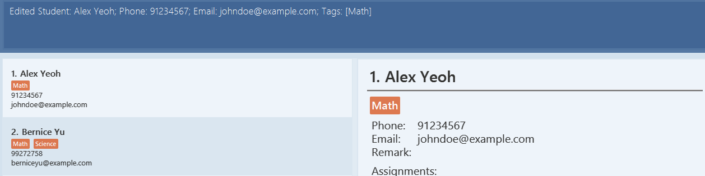
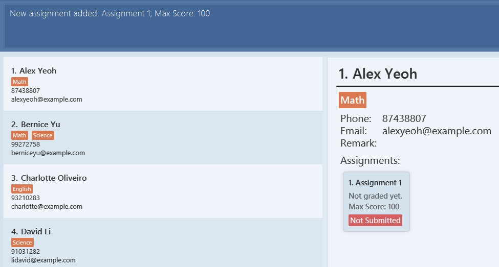
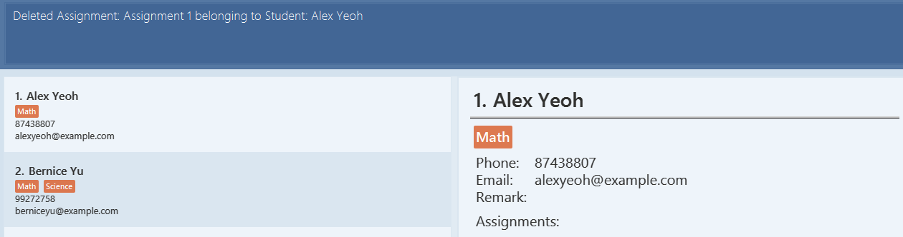
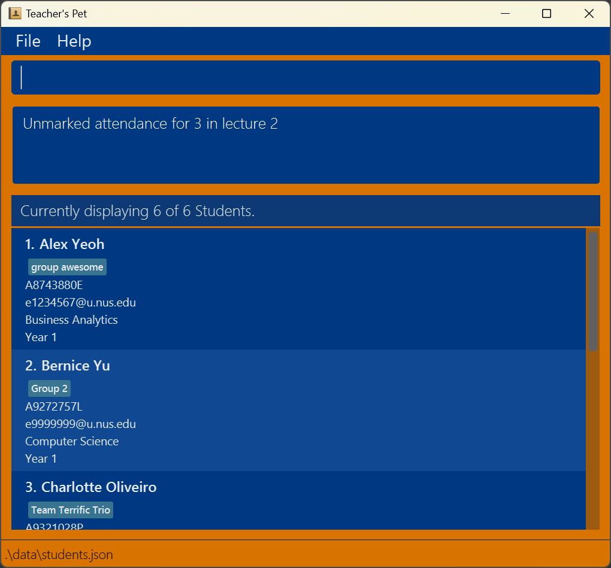

# TAchy User Guide

TAchy is a **desktop app for managing students, optimized for use via a  Line Interface** (CLI) while
still having the benefits of a Graphical User Interface (GUI). If you can type fast, TAchy can get your student
management tasks done faster than traditional GUI apps.

<!-- * Table of Contents -->
<page-nav-print />

--------------------------------------------------------------------------------------------------------------------

## Quick start

1. Ensure you have Java `17` or above installed in your Computer.

2. Download the latest `TAchy.jar` file from [here](https://github.com/AY2425S1-CS2103-F11-1/tp/releases).

3. Copy the file to the folder you want to use as the _home folder_ for TAchy.

4. Open a command terminal, `cd` into the folder you put the jar file in, and use the `java -jar TAchy.jar` command to
   run the application.
  By default, it should be saved in your Downloads folder.  
   - For Windows users: Type `cd Downloads`, and press `Enter`.
   - For MacOS and Linux users: Type `cd ~/Downloads`, and press `Enter`.
  However, if you have saved your file in another location, navigate to that location.  
   - For Windows users: Replace `{FILE_PATH}` with the location where the file is stored, type `cd {FILE_PATH}`, and press `Enter`.
   - For MacOS and Linux users: Replace `{FILE_PATH}` with the location where the file is stored, type `cd ~/{FILE_PATH}`, and press `Enter`.

5. Type the command `java -jar TAchy.jar` into the terminal to run the application.
 
   A GUI similar to the below should appear in a few seconds. Note how the app contains some sample data. 
   

6. Type the command in the command box and press Enter to execute it. e.g. typing **`help`** and pressing Enter will open the help window. 
   Some example commands you can try:

   * `list` : Lists all students.

   * `add_student n/John Doe p/98765432 e/johnd@example.com ` : Adds a student named
     `John Doe` to the app.

   * `view_student 2` : Displays the details of the 2nd student shown in the current list.

   * `delete_student 3` : Deletes the 3rd student shown in the current list.

   * `add_assignment si/1 an/Assignment 1 ms/100` : Adds Assignment 1 to the 1st student in the current list with max score 100.

   * `grade si/1 ai/1 s/100` : Edits the score of the 1st assignment belonging to the 1st student in the current list to be 100.

   * `clear` : Deletes all students.

   * `exit` : Exits the app.

7. Refer to the [Features](#features) below for details of each command.

--------------------------------------------------------------------------------------------------------------------
## Glossary

Term           | Explanation
------------------|----------------------------------------------------------------------------------------------------------------------------------------------------------------------------------------
**CLI**   | A command-line interface (CLI) is a text-based interface that allows users to interact with programs, in this case TAchy, by typing commands.
**GUI**  | A graphical user interface (GUI) is a visual interface where users interact with programs using graphical elements like icons, buttons, and menus.
**Assignment**         | An assignment in TAchy refers to a task or piece of work assigned by the tutor (the user) to students.
**Index**| The index of a student represents their position in the currently displayed list, starting from 1 for the first student at the top.
**Score**  | The score represents the grade a student receives for a specific assignment.
**Remark**          | A remark allows the tutor to record important notes or comments about a student for reference.
**Unmark**          | An Unmark command will cause a previously submitted Assignment to be reset to "not submitted". If the assignment was previously graded, the score will be reset by default.
**Mark**            | A Mark command will cause an unsubmitted Assignment to be marked as Submitted. The grade will remain as "not submitted yet", until a Grade Command is performed.
**Grade**           | A Grade command will assign a score to an assignment. This score must be within the valid range of 0 to the maximum score of the assignment. When the grade command executes, the submission status of the assignment will also be marked as "submitted". 

--------------------------------------------------------------------------------------------------------------------
## Features

<box type="info" seamless>

**Notes about the command format:** 

* Words in `UPPER_CASE` are the parameters to be supplied by the user. 
  e.g. in `add n/NAME`, `NAME` is a parameter which can be used as `add n/John Doe`.

* Items in square brackets are optional. 
  e.g `n/NAME [t/TAG]` can be used as `n/John Doe t/Science` or as `n/John Doe`.

* Items with `…`​ after them can be used multiple times including zero times. 
  e.g. `[t/TAG]…​` can be used as ` ` (i.e. 0 times), `t/Science`, `t/Math t/English` etc.

* Parameters can be in any order. 
  e.g. if the command specifies `n/NAME p/PHONE_NUMBER`, `p/PHONE_NUMBER n/NAME` is also acceptable.

* Extraneous parameters for commands that do not take in parameters (such as `help`, `list`, `exit` and `clear`) will be ignored. 
  e.g. if the command specifies `help 123`, it will be interpreted as `help`.

* If you are using a PDF version of this document, be careful when copying and pasting commands that span multiple lines as space characters surrounding line-breaks may be omitted when copied over to the application.
</box>

### Viewing help : `help`

Shows a message explaining how to access the help page.

Format: `help`

### Adding a student: `add_student`

Adds a student to the app.

Format: `add_student n/NAME p/PHONE_NUMBER e/EMAIL [t/TAG]…​`  
Constraints:
* Tags must be at most 40 characters long, and must be alphanumeric
* Maximum length for a name is 256 characters long
* Maximum phone number is 16 numbers
* Maximum email length is 256 characters
<box type="tip" seamless>
**Tip:** A student can have any number of tags (including 0)
</box>

Examples:
* `add_student n/John Doe p/98765432 e/johnd@example.com`
* `add_student n/Betsy Crowe t/friend e/betsycrowe@example.com p/1234567 t/likesMath`

### Viewing a student: `view_student`

Displays all the details of a student in the details panel.

Format: `view_student INDEX`

* Displays the details of a student at the specified `INDEX`.
* The index refers to the index number shown in the displayed student list.

* The index **must be a positive integer** 1, 2, 3, …​

Constraints:
* Index must exist in the current displayed student list.

Examples:
* `list` followed by `view_student 2` displays the 2nd student in the list.
* `find Betsy` followed by `view_student 1` displays the 1st student in the results of the `find` command.

### Listing all students : `list`

Shows a list of all students in the app.

Format: `list`

### Editing a student : `edit_student`

Edits an existing student in the app.

Format: `edit_student si/INDEX [n/NAME] [p/PHONE] [e/EMAIL] [t/TAG]…​`
Constraints:
* Tags must be at most 40 characters long, and must be alphanumeric
* Maximum length for a name is 256 characters long
* Maximum phone number is 16 numbers
* Maximum email length is 256 characters
  <box type="tip" seamless>
  **Tip:** A student can have any number of tags (including 0)
  </box>

* Edits the student at the specified `INDEX`. The index refers to the index number shown in the displayed student list. The index **must be a positive integer** 1, 2, 3, …​
* At least one of the optional fields must be provided.
* Existing values will be updated to the input values.
* When editing tags, the existing tags of the student will be removed i.e adding of tags is not cumulative.
* You can remove all the student’s tags by typing `t/` without
    specifying any tags after it.

Examples:
*  `edit_student si/1 p/91234567 e/johndoe@example.com` Edits the phone number and email address of the 1st student to be `91234567` and `johndoe@example.com` respectively.
   
* `edit_student si/2 n/Betsy Crower t/` Edits the name of the 2nd student to be `Betsy Crower` and clears all existing tags.

### Locating students by name: `find`

Finds students whose names contain any of the given keywords.

Format: `find KEYWORD [MORE_KEYWORDS]`

* The search is case-insensitive. e.g `hans` will match `Hans`
* The order of the keywords does not matter. e.g. `Hans Bo` will match `Bo Hans`
* Only the name is searched.
* Only full words will be matched e.g. `Han` will not match `Hans`
* Students matching at least one keyword will be returned (i.e. `OR` search).
  e.g. `Hans Bo` will return `Hans Gruber`, `Bo Yang`

Examples:
* `find John` returns `john` and `John Doe`
* `find alex david` returns `Alex Yeoh`, `David Li` 
  

### Deleting a student : `delete_student`

Deletes the specified student from the app.

Format: `delete_student INDEX`

* Deletes the student at the specified `INDEX`.
* Similar to the View Command, this index is specified by the number as shown on the left of the Student's name, in the student list display.
* The index **must be a positive integer** 1, 2, 3, …​

Examples:
* `list` followed by `delete_student 2` deletes the 2nd student in the app.

* `find Betsy` followed by `delete_student 1` deletes the 1st student in the results of the `find` command.

### Adding an assignment: `add_assignment`

Adds an Assignment to the app.

Format: `add_assignment si/INDEX an/ASSIGNMENT_NAME ms/MAX_SCORE`

* Adds an assignment to the student at the specified `INDEX`. The index refers to the index number shown in the
  displayed student list.
* The max score must be a positive integer.

Constraints:
* Assignment name must be at most 256 characters long, and must be alphanumeric

Examples:
* `list` followed by `add_assignment si/3 an/Assignment 1 ms/100` adds an assignment to the
  3rd student in the app.
* `list` followed by `add_assignment si/1 an/Assignment 1 ms/100` adds an assignment to the
  1st student in the app.
  

### Deleting an assignment: `delete_assignment`

Deletes an assignment belonging to a student based on the student's index number and the assignment's index.

Format: `delete_assignment si/INDEX ai/INDEX`

* Deletes the assignment at the specified `INDEX`. The indices refer to the index number shown in the displayed student
  list and the assignment list on the student detail panel respectively. The index **must be a positive integer** 1, 2, 3, …​

Examples:
* `find John` followed by `delete_assignment si/1 ai/1` deletes the 1st assignment of the 1st student in the results of the `find` command.
* `delete_assignment si/1 ai/1`
  

### Editing an assignment: `edit_assignment`

Edits an assignment belonging to a student based on the student's index number and the assignment's index.
If an assignment is edited, but the details remain identical, TAchy will not treat this as an error. Instead,TAchy has been designed to allow for the assignment to be overwritten with the exact details.

Format: `edit_assignment si/INDEX ai/INDEX [an/NEW_ASSIGNMENT_NAME] [ms/NEW_MAX_SCORE]`

* Edits the assignment at the specified `INDEX`. The indices refer to the index number shown in the displayed student 
  list and the assignment list on the student detail panel respectively.
  The index **must be a positive integer** 1, 2, 3, …​
* At least one of the optional fields must be provided.
* Existing values will be updated to the input values.

Examples:
* `view_student 1` followed by `edit_assignment si/1 ai/1 an/Assignment 1 ms/100` edits the 1st assignment of the 1st
  student to the new name and new max score specified.
* `edit_assignment si/1 ai/1 an/Assignment 1` will only change the name of the selected assignment.
* `edit_assignment si/1 ai/1 ms/100` will only change the max score of the selected assignment.
* `edit_assignment si/1 ai/2 an/Math Assignment ms/100` will change the 2nd assignment of the 1st student to be with
  a new name `Math Assignment` and a new max score `100`.

  Before execution:
  
  After execution:
  

### Marking an assignment as submitted: `mark`

Marks an existing assignment belonging to a student as submitted, based on the student's index and the assignment's index.

Constraints:
- The assignment must not have been submitted prior to the Mark Command.
- The assignment must already exist and belong to a particular student. 

Format: `mark si/INDEX ai/INDEX`

Examples:
* `list` followed by `mark si/3 ai/1` marks the 1st assignment of the 3rd student in the app.
* `mark si/1 ai/1`

  

### Unmarking an assignment: `unmark`

Unmarks an existing assignment belonging to a student, resetting its status to not submitted.

Constraints:
- The assignment must already have been submitted prior to the Unmark Command.
- The assignment must already exist and belong to a particular student. 

Format: `unmark si/INDEX ai/INDEX`

Examples:
* `unmark si/1 ai/1`

  

### Grading an assignment: `grade`

Edits the score of an assignment belonging to a student and marks it as submitted.

Format: `grade si/INDEX ai/INDEX s/ASSIGNMENT_SCORE`
* Grades the assignment at the specified `INDEX`. The indices refer to the index numbers shown in the displayed student
  list and the assignment list on the student detail panel respectively.

Constraints:
* The index **must be a positive integer** 1, 2, 3, …​
* The score must be a positive integer that is in bounds of the minimum and maximum scores of the assignment.
* The score can be regraded multiple times by using the `grade` command again. If the assignment was already assigned a grade previously, it will be overwritten, and a warning is shown to the user.

Examples:
* `view_student 1` followed by `grade si/1 ai/1 s/80` grades the 1st assignment of the 1st
    student with a score of 80.
* `grade si/1 ai/1 s/80`
  

### Adding a remark to a student: `remark`
Adds a remark to a existing student in the displayed list.

Format: `remark si/INDEX r/REMARK`

Examples:
* `remark si/1 r/Weak in Math`

  

### Clearing all entries : `clear`

Clears all entries from the app.

Format: `clear`

### Exiting the program : `exit`

Exits the program.

Format: `exit`

### Saving the data

TAchy data are saved in the hard disk automatically after any command that changes the data. There is no need to save manually.

### Editing the data file

TAchy data are saved automatically as a JSON file `[JAR file location]/data/addressbook.json`. Advanced users are welcome to update data directly by editing that data file.

<box type="warning" seamless>

**Caution:**
If your changes to the data file makes its format invalid, TAchy will discard all data and start with an empty data file at the next run.  Hence, it is recommended to take a backup of the file before editing it. 
Furthermore, certain edits can cause the TAchy to behave in unexpected ways (e.g., if a value entered is outside the acceptable range). Therefore, edit the data file only if you are confident that you can update it correctly.
</box>

### Archiving data files `[coming in v2.0]`

_Details coming soon ..._

--------------------------------------------------------------------------------------------------------------------

## FAQ

**Q**: How do I transfer my data to another Computer? 
**A**: Install the app in the other computer and overwrite the empty data file it creates with the file that contains the data of your previous TAchy home folder.

**Q**: What are the system requirements for TAchy? 
**A**: TAchy requires Java 17 or above to run. It is compatible with Windows, MacOS, and Linux operating systems.

**Q**: Is it necessary to back up my TAchy data? 
**A**: Regularly backing up your addressbook.json data file is highly recommended. Save a copy in a secure location to ensure your data can be restored in case of unexpected software or hardware problems.

**Q**: What happens if I accidentally delete a student or an assignment? 
**A**: Deleted data cannot be recovered directly within TAchy. However, if you have a backup of your data file, you can restore it by replacing the current data file in the application folder with the backup.

**Q**: Can multiple users use TAchy on the same computer? 
**A**: Yes, but each user should maintain a separate data file to avoid overwriting each other's records.

**Q**: Does TAchy automatically save my progress? 
**A**: Yes, TAchy saves all changes automatically in the data file whenever you add, edit, or delete information.

**Q**: Can I use TAchy offline? 
**A**: Absolutely! TAchy is designed to work entirely offline, so you can manage student and assignment information without an internet connection.

**Q**: What should I do if I encounter an error or bug? 
**A**: Please report any issues through our [GitHub repository](https://github.com/AY2425S1-CS2103-F11-1/tp/issues), including the steps to reproduce the bug and any error messages you receive.

--------------------------------------------------------------------------------------------------------------------

## Known issues

1. **When using multiple screens**, if you move the application to a secondary screen, and later switch to using only the primary screen, the GUI will open off-screen. The remedy is to delete the `preferences.json` file created by the application before running the application again.
2. **If you minimize the Help Window** and then run the `help` command (or use the `Help` menu, or the keyboard shortcut `F1`) again, the original Help Window will remain minimized, and no new Help Window will appear. The remedy is to manually restore the minimized Help Window.
3. **Duplicate names are not allowed**. If students have duplicate names (e.g: common names such as "Nicholas Tan"), then the tutor should add an extra word in the name to distinguish the students. For example ('Nicholas Tan RJC' and 'Nicholas Tan HCI') can be done to distinguish students with duplicate names.
4. **Student names cannot include the symbol '/'**. Even if legal names include symbols (e.g: Suresh S/O Rama), TAchy will not be able to parse such names. Users are advised to instead remove such characters, or write the names in full (e.g: Suresh son of Rama)

--------------------------------------------------------------------------------------------------------------------

## Command summary

Action            | Format, Examples
------------------|----------------------------------------------------------------------------------------------------------------------------------------------------------------------------------------
**Add Student**   | `add_student n/NAME p/PHONE_NUMBER e/EMAIL [t/TAG]…​`   e.g., `add_student n/James Ho p/22224444 e/jamesho@example.com t/likesMath`
**View Student**  | `view_student INDEX`  e.g., `view_student 3`
**Clear**         | `clear`
**Delete Student**| `delete_student INDEX`  e.g., `delete_student 3`
**Edit Student**  | `edit_student si/INDEX [n/NAME] [p/PHONE_NUMBER] [e/EMAIL] [t/TAG]…​ [r/REMARK]`  e.g.,`edit 2 n/James Lee e/jameslee@example.com`
**Find**          | `find KEYWORD [MORE_KEYWORDS]`  e.g., `find James Jake`
**List**          | `list`
**Help**          | `help`
**Add Assignment**| `add_assignment si/INDEX an/ASSIGNMENT_NAME ms/MAX_SCORE`  e.g., `add_assignment si/1 an/Assignment 1 ms/100`
**Delete Assignment** | `delete_assignment si/INDEX ai/INDEX`  e.g., `delete_assignment si/1 ai/1`
**Edit Assignment** | `edit_assignment si/INDEX ai/INDEX [an/NEW_ASSIGNMENT_NAME] [ms/NEW_MAX_SCORE]`  e.g., `edit_assignment si/1 ai/1 an/Assignment 2 ms/80`
**Mark Assignment** | `mark si/INDEX ai/INDEX`  e.g., `mark si/1 ai/1`
**Unmark Assignment** | `unmark si/INDEX ai/INDEX`  e.g., `unmark si/1 ai/1`
**Grade Assignment** | `grade si/INDEX ai/INDEX s/ASSIGNMENT_SCORE`  e.g., `grade si/1 ai/1 s/100`
**Add Remark** | `remark si/INDEX r/REMARK`   e.g., `remark si/1 r/Weak in Math`
