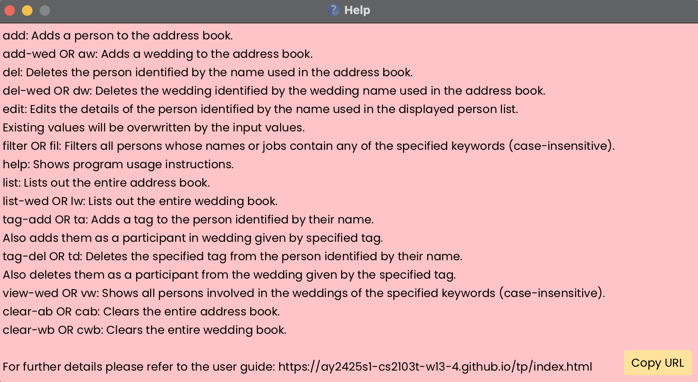
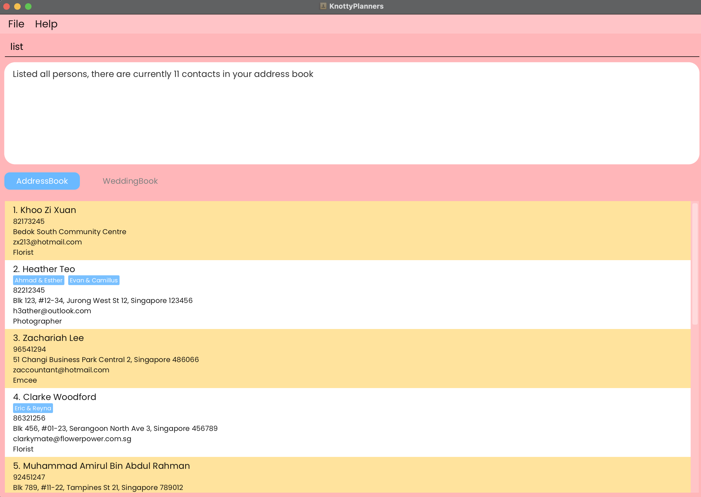
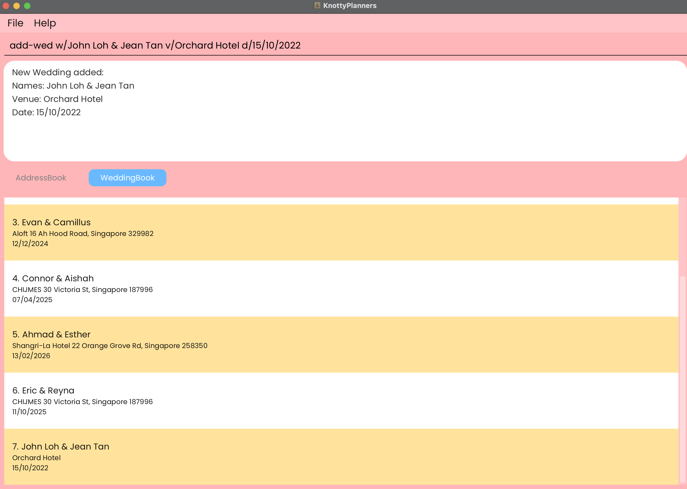
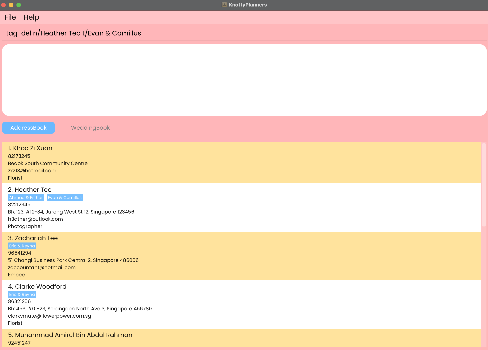
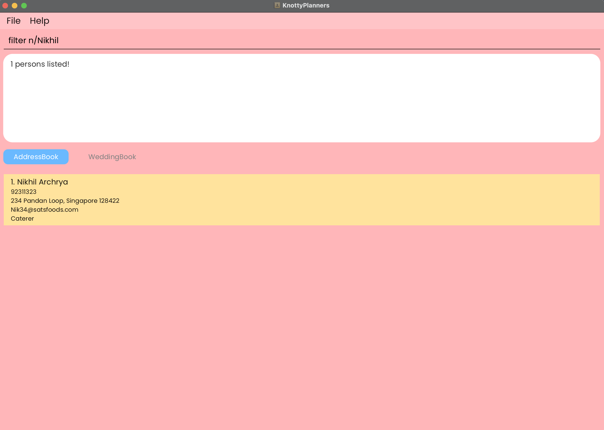
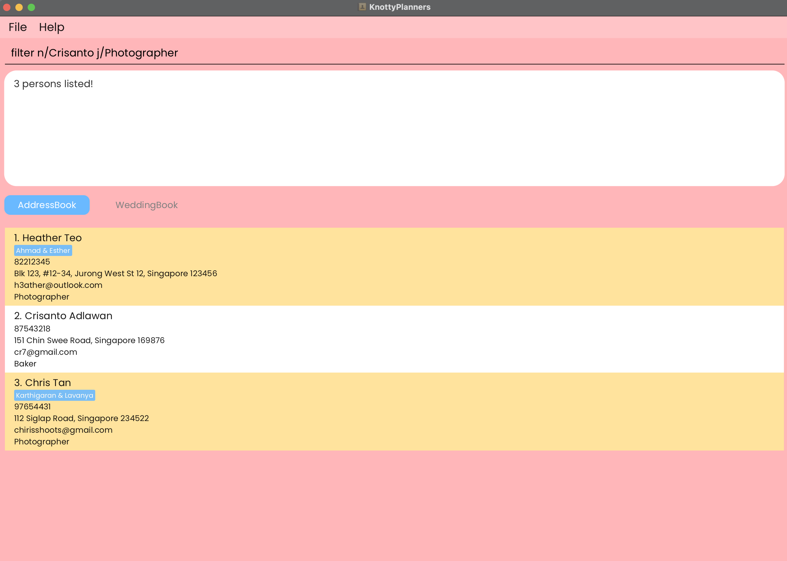
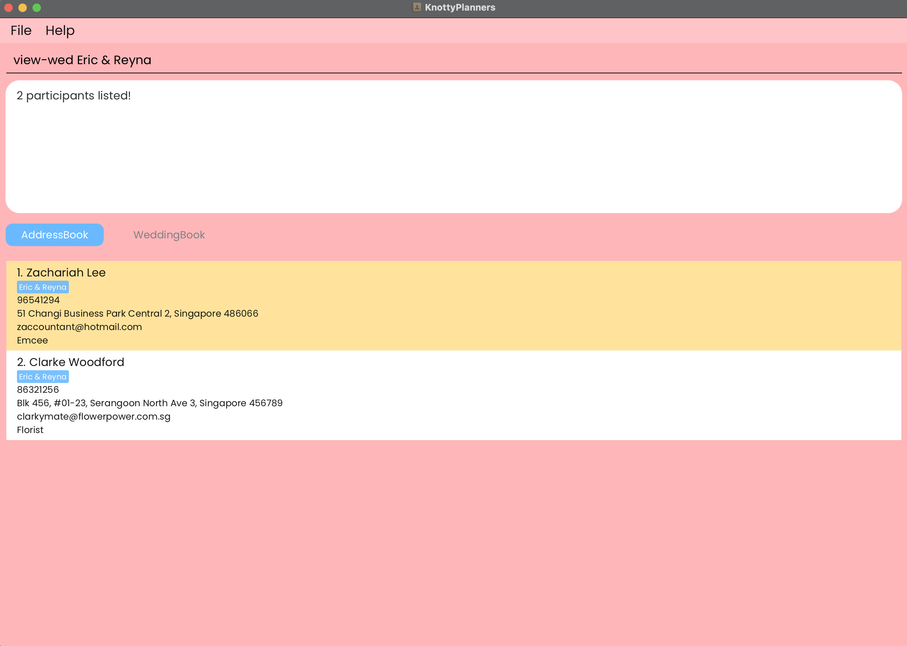
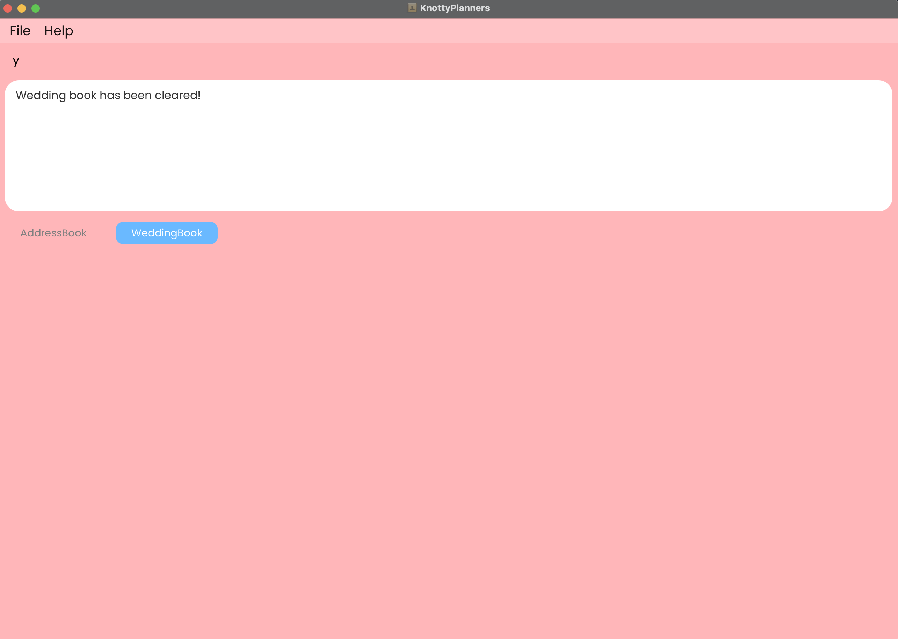

# KnottyPlanners 💍🎀

KnottyPlanners is a **desktop app for wedding planners, optimised for use via a Command Line Interface** (CLI) while still having the benefits of a Graphical User Interface (GUI). If you are a wedding planner who can type fast, KnottyPlanners can make organising multiple weddings at once a walk in the park! 🌳 

If you are a technical user experienced with CLI feel free to jump right into [quick start for technical users!](#quick-start-technical-users). If it's your first time, don't panic we will walk you through in this User Guide! 😊

### What is Command Line Interface? 🤔
Command Line Interface (CLI) allows you to type text commands to perform specific tasks quickly and efficiently on a computer. For example, type `list` in the interface and press enter, the user interface will show you all the contacts you have, simple right! Don't worry if you are still unsure about CLI, it's very easy to pick it up! 😁

### Why use Command Line Interface ? 
* **Efficiency:** Perform tasks faster by replacing multiple mouse clicks into a single line of text ✅
* **Precision:** Avoid mis-clicking and mistakes as CLI will execute the exact command you type 💯
* **Offline:** CLI does not require internet and allows you to use it anywhere 👩‍💻

<!-- * Table of Contents -->
## Table of Contents
- [Quick Start](#quick-start-non-technical-users)
- [Command Summary](#command-summary)
- [Parameter Constraints](#parameter-constraints)
- [Features](#features)
- [FAQ](#faq)
- [Known Issues](#known-issues)

<page-nav-print />

<box type="tip" seamless>

* Here's a quick tip! To navigate back to the top of the pdf, use the `Home` key on Windows/Linux or `command + ↑` on Mac.
* If you already know what to search for, use `CTRL-F` for Windows/Linux or `COMMAND-F` for Mac to find exactly what you need!

</box>

--------------------------------------------------------------------------------------------------------------------

## Quick Start (Non-technical Users)

1. Open up the command prompt (in Windows) or terminal (in MacBook) on your computer.

2. Type in `java -version` and hit enter.

3. If your version of Java is 17 and above, skip to step 6. If it is less than 17, click [here](https://www.oracle.com/java/technologies/javase/jdk17-archive-downloads.html) to download Java 17.

4. For Windows users, download the Windows x64 Installer. For MacBook users, download the macOS ARM 64 DMG Installer. Follow the respective installation guides.

5. After successfully completing the installation, repeat steps 1 to 3 to ensure that you have Java 17.

6. Download the latest `KnottyPlanners.jar` file under the Assets tab from [here](https://github.com/AY2425S1-CS2103T-W13-4/tp/releases).

7. Create a new folder in your Desktop and copy the `KnottyPlanners.jar` file into that folder.

8. Repeat step 1 to open up a new terminal.

9. Type in `cd Desktop\NEW_FOLDER_NAME` where `NEW_FOLDER_NAME` is the name of the folder you created in step 7 and hit enter.

10. Type in `java -jar KnottyPlanners.jar` and hit enter to run the application.

11. You can refer to the [Command Summary](#command-summary) for an overview of the available commands. If you need more information, the [Features](#features) section below contains more details regarding each command.

## Quick Start (Technical Users)

1. Ensure you have Java `17` or above installed in your Computer.

2. Download the latest `.jar` file from [here](https://github.com/AY2425S1-CS2103T-W13-4/tp/releases).

3. Copy the file to the folder you want to use as the _home folder_ for your KnottyPlanners.

4. Open a command terminal, `cd` into the folder you put the jar file in, and use the `java -jar KnottyPlanners.jar` command to run the application.

5. You can refer to the [Command Summary](#command-summary) for an overview of the available commands. If you need more information, the [Features](#features) section below contains more details regarding each command.

<box type="info" seamless>

**Note**: We have a default database for you to try out and test commands! If you prefer not to have it, you can use the commands `clear-ab` and `clear-wb` to clear the address book and wedding book respectively.

</box>

## Command Summary
Feel free to use this command summary table and navigate to the features that interests you by clicking on the action words 😁

| Action                                                                       | Format, Examples                                                                                                                                                                                     |
|------------------------------------------------------------------------------|------------------------------------------------------------------------------------------------------------------------------------------------------------------------------------------------------|
| **[Help](#viewing-help-help)**                                               | `help`                                                                                                                                                                                               |
| **[Add](#adding-a-contact-add)**                                             | `add n/NAME p/PHONE_NUMBER e/EMAIL a/ADDRESS j/JOB [t/TAG]`   e.g., `add n/James Ho p/22224444 e/jamesho@example.com a/123, Clementi Rd, 1234665 j/Photographer t/June & James`                   |
| **[Delete](#deleting-a-contact-del-followed-by-y-or-n)**                     | `del n/NAME` followed by `y` or `n`  e.g., `del n/John Doe` followed by `y`                                                                                                                       |
| **[Edit](#editing-a-contact-edit)**                                          | `edit n/NAME [new/NEW_NAME] [p/NEW_PHONE] [e/NEW_EMAIL] [a/NEW_ADDRESS] [j/NEW_JOB]`  e.g.,`edit n/John new/James Lee e/jameslee@example.com`                                                     |
| **[List](#listing-all-contacts-list)**                                       | `list`                                                                                                                                                                                               |
| **[Add Wedding](#adding-a-wedding-add-wed-aw)**                              | `add-wed w/NAME & NAME v/VENUE d/DATE` or `aw w/NAME & NAME v/VENUE d/DATE`   e.g., `add-wed w/ John & June v/Orchard Hotel d/12/12/2030` or `aw w/ John & June v/Orchard Hotel d/12/12/2030`     |
| **[Delete Wedding](#deleting-a-wedding-del-wed-dw)**                         | `del-wed w/NAME & NAME` or `dw w/NAME & NAME` followed by `y` or `n`  e.g., `del-wed w/John Loh & Jean Tan` or `dw w/John Loh & Jean Tan` followed by `y`                                         |
| **[List Weddings](#listing-all-weddings-list-wed-lw)**                       | `list-wed` or `lw`                                                                                                                                                                                   |
| **[Add Tag](#adding-tag-s-to-a-contact-tag-add-ta)**                         | `tag-add n/NAME t/TAG [t/TAG]...` or `ta n/NAME t/TAG [t/TAG]...`   e.g., `tag-add n/John Doe t/June & James` or `ta n/John Doe t/June & James` or `ta n/John Doe t/June & James t/Jeremy & Maya` |
| **[Deleting Tags](#deleting-tag-s-from-a-contact-tag-del-td)**               | `tag-del n/NAME t/TAG [t/TAG]...` or `td n/NAME t/TAG [t/TAG]...`   e.g., `tag-del n/John Doe t/June & James` or `td n/John Doe t/June & James` or `td n/John Doe t/June & James t/Jeremy & Maya` |
| **[Filter](#filtering-contacts-by-name-and-job-filter-fil)**                 | `filter [n/KEYWORD]... [j/KEYWORD]...` or `fil n[n/KEYWORD]... [j/KEYWORD]...`   e.g., `filter n/John` or `filter n/Sam j/Photographer` or `fil j/Caterer`                                        |
| **[View Wedding](#view-wedding-view-wed-vw)**                                | `view-wed NAME & NAME` or `vw NAME & NAME`   e.g., `view-wed John & Sarah` or `vw John & Sarah`                                                                                                   |
| **[Clear Address Book](#clearing-all-entries-in-address-book-clear-ab-cab)** | `clear-ab` or `cab` followed by `y` or `n`                                                                                                                                                           |
| **[Clear Wedding Book](#clearing-all-entries-in-wedding-book-clear-wb-cwb)** | `clear-wb` or `cwb` followed by `y` or `n`                                                                                                                                                           |
| **[Exit](#exiting-the-program-exit)**                                        | `exit`                                                                                                                                                                                               |

<box type="important" seamless>

**IMPORTANT:**

**Delete and clear operations in KnottyPlanners:**

All delete and clear operations (except `tag-del`) in KnottyPlanners will be followed by a confirmation prompt to avoid accidental deletion. Therefore, delete and clear operations must be followed by either `y` command (confirm delete operation) or `n` command (remove pending operation). Otherwise, the previous operation will remain pending and following delete and clear commands may be affected. Hence, if you accidentally mistype or enter an unintended command before confirming, we suggest you to use `n` to cancel any pending delete operations to ensure everything runs smoothly 😊.

**TAKE NOTE:** `Y` and `N` will be considered as invalid commands as they are NOT same as `y` and `n` respectively.

</box>

### Parameter Constraints
The table below provides a brief explanation of each parameter encountered in the command summary above. It also details the constraints of each parameter used in a command.

<box type="important" seamless>

**IMPORTANT:** 
* Please ensure that all parameters adhere to the constraints mentioned below. If you choose not to do so, the command will not be executed and error messages will be shown.
* KnottyPlanners do not accept any empty parameters, hence, please add in a placeholder value that you choose to replace an empty input (e.g. `p/000` or `a/nil` ).

</box>

<box type="info" seamless>

**Autoformatting in KnottyPlanners:** 

* KnottyPlanners aligns with industry standards by automatically formatting the `NAME`, `JOB`, `TAG` and `WEDDING NAME` fields.
* All other fields that are not mentioned above are not formatted and will be saved based on your user input.

* For each field:
    - The first letter of each word is auto-capitalised.
    - Leading and trailing spaces are trimmed.
    - Extra spaces in between words are trimmed to 1 space.

* Examples:
    - `li sirui` is formatted to `Li Sirui` to ensure consistency in the name format.
    - `  Wedding Photographer ` is formatted to `Wedding Photographer` to ensure consistency in the job names.
    - `Adam &    Harry` is formatted to `Adam & Harry` to ensure consistency in the wedding names.

**Duplication Detection in KnottyPlanners:**

This section details what constitutes as a duplicate in KnottyPlanners.
KnottyPlanners uses names to distinguish contacts from one another. However, due to autoformatting, duplicates may not be exact matches and therefore, may not be immediately obvious to you, the user.
Each parameter is followed by examples that explains if the input is considered a duplicate in KnottyPlanners.

`NAME`
* `Jeremy Ng` is equivalent to `JEREMY NG`, `Jeremy    Ng`, `jeremy ng` and `    jeremy ng    `.
* `Jeremy Ng` is NOT the same as `Jeremy Lin`.

`JOB`
* `Head Chef` is equivalent to `HEAD CHEF`, `Head   Chef`, `head chef` and `    head chef    `.
* `Head Chef` is NOT the same as `Head Waiter`.

`TAG` and `WEDDING NAME`
* `John Stones & Mary Jane` is equivalent to `JOHN STONES & MARY JANE`, `John   Stones &   Mary Jane`, `john stones & mary jane` and `     John Stones & Mary Jane      `.
* `John Stones & Mary Jane` is NOT the same as `Mary Jane & John Stones`.
</box>

  
| Parameter      | Prefix | Definition                                        | Case-Sensitivity | Constraints                                                                                                                                                                                                                                                                                                                                                                                              | Examples                                                                                                                                                                                                                        |
|----------------|--------|---------------------------------------------------|------------------|----------------------------------------------------------------------------------------------------------------------------------------------------------------------------------------------------------------------------------------------------------------------------------------------------------------------------------------------------------------------------------------------------------|---------------------------------------------------------------------------------------------------------------------------------------------------------------------------------------------------------------------------------|
| `NAME`         | `n/`   | Name of the person.                               | Case-insensitive | - Only alphanumeric characters, spaces, `/`, and `.` are allowed.   - Should not be blank.   - If the name contains a `-`, a possible workaround is to replace the `-` with an empty spacing.                                                                                                                                                                                                      | :+1: `Muhammad Ali`  :+1: `Henry s/o Nathan`  :+1: `Robert Downey Jr.`  :x: `Trent Alexander-Arnold`  :x: `@JohnnyBoi`  :x: `Tom s/O Pat`  :x: `Tom s/O Pat`  :x: `Sherry d/O Nat`  :x: `Henry D/o Nat` |
| `PHONE`        | `p/`   | Phone number of the person.                       | NA               | - Only numbers and `+` are allowed.   - Should be at least 3 digits long.   - Should not be blank.   - Should not have spaces in between numbers.   - There is no limit on the maximum length of phone numbers accepted to accommodate international phone numbers as well.                                                                                                                  | :+1: `98765432`  :+1: `+6598765432`  :x: `1234 5678 (HP) 1111-3333 (Office)`                                                                                                                                              |
| `EMAIL`        | `e/`   | Email address of the person.                      | Case-sensitive   | - Should be in the format `local-part@domain`.   - `local-part` should only contain alphanumeric characters and the special characters `+`, `_`, `.`, `-`. `local-part` may not start or end with any special characters, or contain consecutive special characters.   - `domain` must be at least 2 characters long, start and end with alphanumeric characters.   - Should not be blank.   | :+1: `gary@yahoo.com`  :x: `henry`  :x: `j++a@rocketmail.com`                                                                                                                                                             |
| `ADDRESS`      | `a/`   | Address of the person.                            | Case-sensitive   | - All values are allowed.   - Should not be blank.                                                                                                                                                                                                                                                                                                                                                    | :+1: `Woodlands Dr 71, Blk 680C, #08-12, S721767`                                                                                                                                                                               |
| `JOB`          | `j/`   | Occupation of the person.                         | Case-insensitive | - All values are allowed.   - Should not be blank.   - We recommend that only one job is assigned per person for a better user experience.                                                                                                                                                                                                                                                         | :+1: `DJ`                                                                                                                                                                                                                       |
| `TAG`          | `t/`   | A tag is the wedding associated with that person. | Case-insensitive | - Only alphanumeric characters spaces, `/`, `.` and `&` are allowed.   - Should be in the format `NAME & NAME`.   - Should not be blank.                                                                                                                                                                                                                                                           | :+1: `Ahmad & Esther`   :+1: `Kattar d/o Hanif & Xavier Lee`   :x: `Jerry and Stacy`   :x: `Farah x Adam`                                                                                                              |
| `WEDDING NAME` | `w/`   | Name of a wedding.                                | Case-insensitive | - Only alphanumeric characters spaces, `/`, `.` and `&` are allowed.   - Should be in the exact format `NAME & NAME`.   - Both names must be unique.   - Should not be blank.                                                                                                                                                                                                                   | :+1: `Henry & Terry`  :+1: `Eubanks Jr. & Ayesha`   :x: `Nwakame Dickson`   :x: `Siti n Syafie`   :x: `Jolyn &Max`   :x: `Sara & Sara`                                                                           |
| `VENUE`        | `v/`   | Location of the wedding.                          | Case-sensitive   | - All values are allowed.   - Should not be blank.                                                                                                                                                                                                                                                                                                                                                    | :+1: `Fullerton Hotel, Ballroom 1, #01-05`                                                                                                                                                                                      |
| `DATE`         | `d/`   | Date of the wedding.                              | NA               | - Should be in the format `DD/MM/YYY`.   - Only numbers and `/` are allowed.   - Should not be blank.   - The range of dates allowed are `01/01/1900` to `31/12/2099`                                                                                                                                                                                                                           | :+1: `12/12/2025`   :x: `12th June 2021`   :x: `2025-09-03`   :x: `31/12/1899`   :x: `01/01/2100`                                                                                                                   |

## Features

<box type="info" seamless>

**Important notes about the command format:** 

* Words in `UPPER_CASE` are the parameters to be supplied by the user. 
  e.g. in `add n/NAME`, `NAME` is a parameter which can be used as `add n/John Doe`.

* Parameters can be in any order. 
  e.g. if the command specifies `n/NAME p/PHONE_NUMBER`, `p/PHONE_NUMBER n/NAME` is also acceptable.

* Ensure that an empty space ` ` comes before each prefix. This will prevent your inputs from being misinterpreted by KnottyPlanners. 
  e.g. `edit n/john a/woodlandsj/job` will not be interpreted correctly. Rectify this by typing in `edit n/john a/woodlands j/job`.

* Tags in KnottyPlanners are used exclusively to tag person to wedding, hence both wedding name and tag names should be 2 person names separated with a & (e.g. `John Loh & Jean Tan`, `Stacy & Sam`).

* Items with `…`​ after them can be used multiple times including zero times. 
  e.g. `[t/TAG]…​` can be used as ` ` (i.e. 0 times), `John Loh & Jean Tan`, `Stacy & Sam` etc.

* Extraneous parameters for commands that do not take in parameters (such as `help`, `list`, `list-wed`, `exit`, `clear-ab` and `clear-wb`) will be ignored. 
  e.g. if the command specifies `help 123`, it will be interpreted as `help`.

* Prefixes refer to the identifier before the parameter e.g. `n/` before `NAME`. Invalid prefixes (i.e. prefixes that do not exist) will be ignored. 
e.g. if the command specifies `tag-add n/John Doe b/juice t/John Loh & Jean Tan`, it will be interpreted as `tag-add n/John Doe t/John Loh & Jean Tan`.

* If you are using a PDF version of this document, be careful when copying and pasting commands that span multiple lines as space characters surrounding line-breaks may be omitted when copied over to the application.
  </box>

### Viewing Help: `help`

You can view a popup with an overview of all commands, and also a link to this user guide if you need more details.

Format: `help`

### Adding a Contact: `add`

You can add a person to the list of contacts.

Format: `add n/NAME p/PHONE_NUMBER e/EMAIL a/ADDRESS j/JOB [t/TAG]`

* A person can have any number of tags (including 0). Tags are associated to the weddings this person is
  involved in. Weddings must already exist in the wedding book to successfully tag a person to a wedding.

<box type="important" seamless>

**IMPORTANT:**

* If you are worried about adding duplicated people, fret not! KnottyPlanners will alert you when an identical person is added
* If you add tags of a weddings that does not exist, KnottyPlanners will still add the person and ignore invalid tags
* We will also alert you when you add a different person with the same name, you can add in keywords in these situations to differentiate them 😊 (e.g. if `John` is duplicated, you can consider changing into `John Tan` or `John from school`)    

</box>

Examples:
* `add n/John Doe p/98765432 e/johnd@example.com a/John street, Blk 123, #01-04 j/Photographer`
* `add n/Betsy Crowe p/90341259 e/betsycrowe@example.com a/Newgate Center j/Caterer t/Stacy & Sam` P.S. The wedding `Stacy & Sam` must be created first using `add-wed` command!

### Deleting a Contact: `del` followed by `y` or `n`

You can delete a person from your list of contacts.

Format: `del n/NAME` followed by `y` or `n`

* Deletes the person with the specified `NAME` from the address book.
* The contact's details are shown for confirmation.
* The contact is deleted if `y` is entered.
* The contact is not deleted if `n` is entered, cancelling the delete operation and nothing will occur.

<box type="important" seamless>

**IMPORTANT:** 
* `del n/NAME` MUST BE followed by either of the two commands, otherwise, following delete commands may be affected. Refer to [Command Summary](#command-summary) for more information ☺️.

</box>

  

    

      
      

    

    

      
MUST BE followed by y or n command

    

  

  

    

      
      
Success

    

    

      
      
Cancel Operation

    

  

Examples:
* `del n/John Doe` followed by `y` deletes the person named `John Doe` from the address book.
* `del n/John Doe` followed by `n` cancels the delete operation.

### Editing a Contact: `edit`

You can edit an existing contact's details (name, phone number, email, address and job).

Format: `edit n/NAME [new/NEW_NAME] [p/NEW_PHONE] [e/NEW_EMAIL] [a/NEW_ADDRESS] [j/NEW_JOB]`

* You have to provide at least one of the optional fields.
* Tags can't be edited, so if you'd like to change a tag, simply delete the existing one using
['tag-del'](#adding-tag-s-to-a-contact-tag-add-ta) and add a new one using ['tag-add'](#deleting-tag-s-from-a-contact-tag-del-td)!

<box type="important" seamless>

**IMPORTANT:**
* Multiple inputs of the same parameter can be added but only the last one will be accepted.
* Examples:
  - `edit n/John p/111 p/222` will edit John's phone number to `222` (the first phone number will be ignored).
  - `edit n/John n/Gary a/Tampines Heights` will edit Gary's address to `Tampines Heights` (John's address will remain unedited)
* Order of parameters does not matter and the person to edit will depend on the `n/NAME`.
* Examples:
  - `edit p/222 n/John` will edit John's phone number to `222`.
  - `edit a/Tampines Heights p/123 n/John` will edit John's address to `Tampines Heights` and John's phone number to `123` respectively.
* Editing a field with the original value will be considered as a valid command
  - `edit n/John new/John` is a valid command and no changes will be made, same applies to other fields.
  - `edit n/John new/john` or `edit n/John new/   john` is a valid command and no changes will be made as names are auto-formatted to 'John' in KnottyPlanners.

</box>

   

    
    
Before

  

  

    
    
After

  

Examples:
*  `edit n/John Doe p/91234567 e/johndoe@example.com` Edits the phone number and email address of John Doe to be
   `91234567` and `johndoe@example.com` respectively.
*  `edit n/James new/Clark e/clarknewemail@example.com j/Florist` Edits the name, email and job to be
   `James`, `clarknewemail@example.com` and `Florist` respectively.

### Listing All Contacts: `list`

You can now view all contacts in the order they were added in!

Format: `list`

### Adding a Wedding: `add-wed` / `aw`

You can add a wedding to the list of weddings.

Format: `add-wed w/NAME & NAME v/VENUE d/DATE` / `aw w/NAME & NAME v/VENUE d/DATE`

* If you are worried about adding duplicated weddings, fret not! KnottyPlanners will alert you when an identical wedding is added.
* We will also alert you when you add a different wedding with the same name, you can add keywords into the wedding names in these situations to differentiate them 😊(e.g. `John & Jane Local` and `John & Jane Overseas`).

<box type="important" seamless>

**IMPORTANT:**

* Please take note that the order of the names matters. `John & Jane` is NOT same as `Jane & John` and will not be treated as a duplicate.

</box>

Examples:
* `add-wed w/John Loh & Jean Tan v/Orchard Hotel d/15/10/2022`
* `aw w/Jonus Ho & Izzat Syazani v/Pasir Ris Hotel d/02/11/2022`

### Deleting a Wedding: `del-wed` / `dw`

You can delete a wedding from your list of weddings.

Format: `del-wed w/NAME & NAME` / `dw w/NAME & NAME` followed by `y` or `n`

* Deletes the wedding with the specified `NAME & NAME` from the address book.
* The wedding's details are shown for confirmation.
* The wedding is deleted if `y` is entered.
* The wedding is not deleted if `n` is entered, cancelling the delete operation and nothing will occur.

<box type="important" seamless>

**IMPORTANT:** 

* `dw w/NAME & NAME` MUST BE followed by either of the two commands, otherwise, following delete commands may be affected. Refer to [Command Summary](#command-summary) for more information ☺️.
* The wedding must be entered exactly as it was saved in the wedding book to successfully delete it.
* As we do not have an edit wedding command, please use ['del-wed'](#deleting-a-wedding-del-wed-dw) and ['add-wed'](#adding-a-wedding-add-wed-aw) to change details of a wedding.

</box>

  

    

      
      

    

    

      
MUST BE followed by y or n command

    

  

  

    

      
      
Success

    

    

      
      
Cancel Operation

    

  

Examples:
* `del-wed w/John Loh & Jean Tan` followed by `y` deletes the wedding named `John Loh & Jean Tan` from the address book.
* `dw w/Jonus Ho & Izzat Syazani` followed by `n` cancels the delete operation.

### Listing All Weddings: `list-wed` / `lw`

You can now view all weddings in the order they were added in!

Format: `list-wed` / `lw`

### Tagging a Contact

### Adding Tag(s) to a Contact: `tag-add` / `ta`
Add your contacts to a particular wedding!

Format: `tag-add n/NAME t/TAG [t/TAG]...` / `ta n/NAME t/TAG [t/TAG]...`

* At least one `TAG` field must be present.
* The name of the tag must match the wedding that you want to add the contact to.
* You can add one contact to multiple weddings in one go by specifying multiple tags in your command.

<box type="important" seamless>

**IMPORTANT:** 

* The wedding must already exist in the wedding book to successfully tag a person to a wedding.
* If multiple tags of the same wedding are added, KnottyPlanners will only process one and ignore the other tags for you. 

</box>

    

        
        
Before

    

    

        
        
After

    

Examples:
*  `tag-add n/John Doe t/Adam and Steve` Adds the tag `Adam and Steve` to John Doe.
*  `ta n/Betsy Crower t/Lacy & Bacy t/Peter & Mary t/Jonny & Bonny` Adds the tags `Lacy & Bacy`, `Peter & Mary`, and `Jonny & Bonny` to Betsy Crower.

### Deleting Tag(s) from a Contact: `tag-del` / `td`
Remove your contacts from a particular wedding!

Format: `tag-del n/NAME t/TAG [t/TAG]...` / `td n/NAME t/TAG [t/TAG]...`

* At least one `TAG` field must be present.
* The name of the tag must match the wedding that you want to delete the contact from.
* You can remove a contact from multiple weddings in one go by specifying multiple tags in your command.

<box type="important" seamless>

**IMPORTANT:** 

* The wedding must already exist in the wedding book to successfully delete a person from a wedding.
* If multiple tags of the same wedding are deleted, KnottyPlanners will only process one and ignore the other tags for you. 

</box>

    

        
        
Before

    

    

        
        
After

    

Examples:
*  `tag-del n/John Doe t/Adam and Steve` Removes the tag `Adam and Steve` from John Doe.
*  `td n/Betsy Crower t/Lacy & Bacy t/Peter & Mary t/Jonny & Bonny` Removes the tags `Lacy & Bacy`, `Peter & Mary`, and `Jonny & Bonny` from Betsy Crower.

### Filtering Contacts by Name and Job: `filter` / `fil`

Conveniently search for contacts in your address book by name and/or job.

Format: `filter [n/KEYWORD]... [j/KEYWORD]...` / `fil [n/KEYWORD]... [j/KEYWORD]...`

* At least one of the `NAME` or `JOB` fields must be present.
* `KEYWORD` is not case-sensitive. e.g. `photographer` will match `Photographer`.
* Only full words will be matched e.g. `jak` will not match `Jake`, `sam` will not match `Sam Tan`, `Photographer` will not match `Wedding Photographer`.
* `filter` returns the largest range of matches based on your input.

<box type="tip" seamless>

**Tip:** 
* You can filter by multiple name and/or job fields at once!
* Keep in mind that partial matches within the name (e.g. middle or last names alone) won’t return results.
To ensure a match, start from the beginning of the full name or first name.

</box>

    

        
        
Filter One Field

    

    

        
        
Filter Multiple Fields

    

Examples:
* `filter j/Photographer` returns `John` and `Ernest` whose jobs are photographers.
* `filter n/John` returns a person whose name is John.
* `fil n/jonus n/harry j/photographer` returns `Jonus`, `Harry` and all photographers that are in your contacts.
* `fil j/host j/caterer` returns all hosts and caterers that are in your contacts.

### View Wedding: `view-wed` / `vw`

You can view a list of all contacts tagged to the specified wedding.

Format: `view-wed NAME & NAME` / `vw NAME & NAME`

* `view-wed` / `vw` shows participants based on wedding names that match the keyword.
* `NAME & NAME` has to be in the correct order as saved in your wedding book e.g. `alice & bob` will not match `Bob & Alice`.
* Only full words will be matched e.g. `jak` will not match `Jake`, `Sam` will not match `Sam Tan`, `ian & sky` will not match `Ian Pang & Sky Tan`.
* Persons matching at least one keyword will not be returned (i.e. `AND` search)
  e.g. `Alice` will not return `Alice & Bob`.

<box type="important" seamless>

**TAKE NOTE:**
* No prefixes are required for this command.
* If you are in the WeddingBook tab and the wedding you request to view has no participants, KnottyPlanners will display all weddings to allow you to conveniently view other weddings if needed.
* If you are in the AddressBook tab and the wedding you request to view has no participants, KnottyPlanners will not display any participants.

</box>

Examples:
* `view-wed Jane Lim & Tom Koh` returns `John Doe` who is a caterer for that wedding.
* `vw Ahmad & Esther` returns `Halim` who is the best man for Ahmad and `Jia Zhun` who is a photographer for that wedding as well.

### Clearing All Entries in Address Book: `clear-ab` / `cab`

You can delete ALL contacts in the address book from the application.

Format:
* `clear-ab` / `cab` followed by `y` clears all contacts in the address book.
* `clear-ab` / `cab` followed by `n` will not clear all contacts in the address book.

1. `clear-ab` / `cab` clears all contacts in address book.
2. The command will prompt for confirmation before deleting all entries.
3. If you confirm with `y`, all entries will be deleted.
4. If you cancel with `n`, no entries will be deleted.

<box type="important" seamless>

**IMPORTANT:** 

* The clear command must be followed by either `y` or `n` command. Refer to [Command Summary](#command-summary) for more information ☺️.

</box>

### Clearing All Entries in Wedding Book: `clear-wb` / `cwb`

You can delete ALL weddings in the wedding book from the application.

Format:
* `clear-wb` / `cwb` followed by `y` clears all weddings in the wedding book.
* `clear-wb` / `cwb` followed by `n` will not clear all weddings in the wedding book.

1. `clear-wb` / `cwb` clears all weddings in wedding book.
2. The command will prompt for confirmation before deleting all entries.
3. If you confirm with `y`, all entries will be deleted.
4. If you cancel with `n`, no entries will be deleted.

<box type="important" seamless>

**IMPORTANT:** 

* The clear command must be followed by either `y` or `n` command. Refer to [Command Summary](#command-summary) for more information ☺️.

</box>

### Exiting the Program: `exit`

You can exit the application and save any new changes.

Format: `exit`

### Saving the Data

KnottyPlanners data will be saved in the hard disk automatically after any command that changes the data.
There is no need to save manually.

### Editing the Data File

* KnottyPlanners data are saved automatically as a JSON file.
  * `[JAR file location]/data/addressbook.json`.
  * `[JAR file location]/data/weddingbook.json`.
* Advanced users are welcome to update data directly by editing that data file.

<box type="warning" seamless>

**CAUTION:**
  
* If your changes to the data file makes its format invalid, KnottyPlanners will discard all data and start with an empty data file at the next run.  Hence, it is recommended to take a backup of the file before editing it. 

* Furthermore, certain edits can cause the KnottyPlanners to behave in unexpected ways (e.g. if a value entered is outside the acceptable range). Therefore, edit the data file only if you are confident that you can update it correctly.

</box>

--------------------------------------------------------------------------------------------------------------------

## FAQ

**Q**: How do I transfer my data to another Computer? 
**A**: Install the app in the other computer and overwrite the empty data file it creates with the file that contains the data of your previous KnottyPlanners home folder.

**Q**: What should I do if the application does not start? 
**A**: If you are using a Mac, you may need to right-click the jar file and select `Open` to run the application. If you are using Windows, you may need to run the jar file as an administrator.

**Q**: How do I update the application? 
**A**: Download the latest jar file from the [[releases page]](https://github.com/AY2425S1-CS2103T-W13-4/tp/releases)

**Q**: How do all the commands work? 
**A**: Refer to the [Command summary](#command-summary) section for details of each command. Additionally, some tips and important details are provided in the [Features](#features) section.

--------------------------------------------------------------------------------------------------------------------

## Known issues

1. **When using multiple screens**, if you move the application to a secondary screen, and later switch to using only the primary screen, the GUI will open off-screen. The remedy is to delete the `preferences.json` file created by the application before running the application again.
2. **If you minimise the Help Window** and then run the `help` command (or use the `Help` menu, or the keyboard shortcut `F1`) again, the original Help Window will remain minimised, and no new Help Window will appear. The remedy is to manually restore the minimised Help Window.
3. **Edit commands** can have multiple inputs of the same parameter but only the last input will be accepted (e.g. `edit n/John p/111 p/222` the edited phone number will become `222`).
--------------------------------------------------------------------------------------------------------------------
