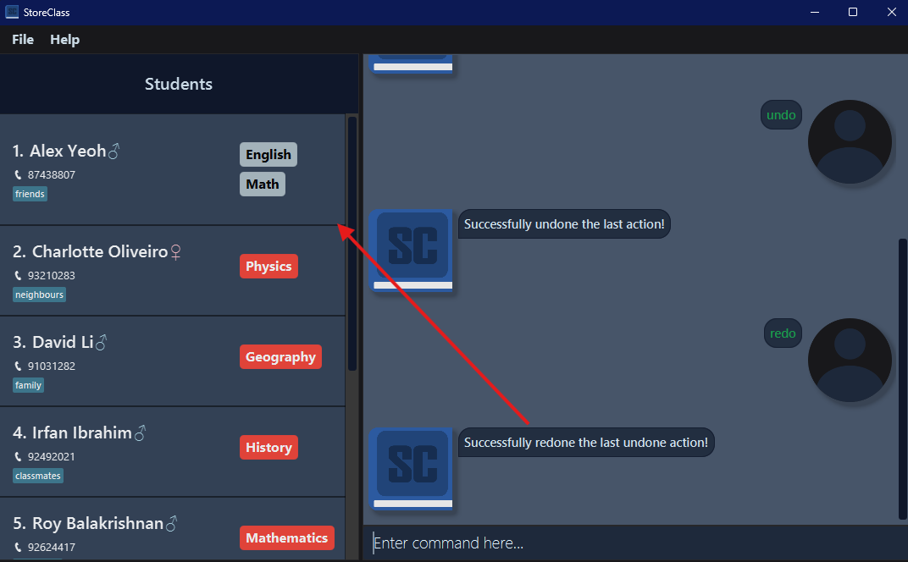
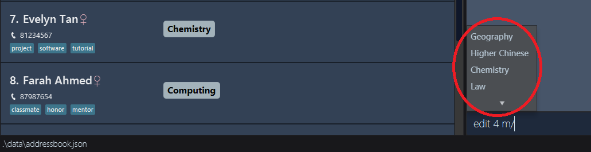

StoreClass (SC) is a desktop app for educators from private organizations e.g. tuition centers to manage their students. The educators will interact with the app through type while viewing the app through the window.

 

If you can type fast, StoreClass will become a perfect tools to manage student data.

* Table of Contents
{:toc}

--------------------------------------------------------------------------------------------------------------------

## Quick start

1. Ensure you have Java `17` or above installed in your Computer.
   - For Windows 11, see [here](https://www.youtube.com/watch?v=ykAhL1IoQUM)
   - For MacOS, see [here](https://www.youtube.com/watch?v=lYKHFz8YaD4)

1. Download the latest `.jar` file from [here](https://github.com/se-edu/addressbook-level3/releases).

1. Copy the file to the folder you want to use as the _home folder_ for StoreClass.

1. Use the terminal to run the jar file
   - How to run a jar file using Terminal? See [here](https://www.youtube.com/watch?v=j7A7DOZePXs)
   
   A GUI similar to the below should appear in a few seconds. Note how the app contains some sample data. 
   

1. Type the command in the command box and press Enter to execute it. e.g. typing **`help`** and pressing Enter will open the help window. 
   Some example commands you can try:

   * `list` : Lists all contacts.

   * `add n/John Doe p/98765432 g/male m/Physics` : Adds a student named `John Doe` to StoreClass.

   * `delete 3` : Deletes the 3rd contact shown in the current list.

   * `clear` : Deletes all contacts.

   * `exit` : Exits the app.

1. Refer to the [Features](#features) below for details of each command.

--------------------------------------------------------------------------------------------------------------------

## Features

**:information_source: Notes about the command format:** 

* Words in `UPPER_CASE` are the parameters to be supplied by the user. 
  e.g. in `add n/NAME`, `NAME` is a parameter which can be used as `add n/John Doe`.

* Items in square brackets are optional. 
  e.g `n/NAME [t/TAG]` can be used as `n/John Doe t/friend` or as `n/John Doe`.

* Items with `...`​ after them can be used multiple times. 
    e.g. `m/MODULE...​` can be used as `m/Mathematics`, `m/Chemistry m/English` etc.

* Items with `…`​ after them can be used multiple times including zero times. 
  e.g. `[t/TAG]…​` can be used as ` ` (i.e. 0 times), `t/friend`, `t/friend t/family` etc.

* Parameters can be in any order unless specified. 
  e.g. if the command specifies `n/NAME p/PHONE_NUMBER`, `p/PHONE_NUMBER n/NAME` is also acceptable.

* Extraneous parameters for commands that do not take in parameters (such as `help`, `list`, `exit` and `clear`) will be ignored. 
  e.g. if the command specifies `help 123`, it will be interpreted as `help`.

* If you are using a PDF version of this document, be careful when copying and pasting commands that span multiple lines as space characters surrounding line-breaks may be omitted when copied over to the application.

### Viewing help : `help`

Shows a message explaining how to access the help page.

Format: `help`

### Adding a person: `add`

Adds a new student to StoreClass.

Format: `add n/NAME p/PHONE_NUMBER g/GENDER m/MODULE... [t/TAG]…​`

* `n/NAME` : The full name of the student to be added.
* `p/PHONE_NUMBER` : The phone number of the student to be added.
* `g/GENDER` : The gender of the student to be added.
* `m/MODULE` : The module that the student is taking.
* `t/TAG` : The tag of the student.

 :notebook: **Note:** Field Constraints
- Names should only contain alphabets, hyphens, dots, commas, forward slash and spaces, and be between 1 and 100 characters long.
- Phone numbers should only contain numbers, and be exactly 8 digits long.
- Gender should be either `male` or `female`.
- Module should consist of alphanumeric characters and spaces only, and it should be between 1 and 30 characters long.
- Tag should consist of alphanumeric characters only, and it should be between 1 and 30 characters long.

Examples:
* `add n/John Doe p/98765432 g/male m/Mathematics` : Adds a student named `John Doe` to StoreClass.
* `add n/Betsy Crowe g/female p/1234567 m/Physics m/Chemistry t/OLevels t/new` : Adds a student named `Betsy Crowe` to StoreClass.

### Listing all persons : `list`

Shows a list of all persons in the address book.

Format: `list`

### Editing a person : `edit`

Edits an existing student in the address book.

Format: `edit INDEX [n/NAME] [p/PHONE] [g/GENDER] [m/MODULE]... [t/TAG]…​`

* Edits the person at the specified `INDEX`. The index refers to the index number shown in the displayed person list. The index **must be a positive integer** 1, 2, 3, …​
* At least one of the optional fields must be provided.
* Existing values will be updated to the input values.
* When editing tags, the existing tags of the person will be removed i.e adding of tags is not cumulative.
* You can remove all the person’s tags by typing `t/` without
    specifying any tags after it.

Examples:
*  `edit 1 p/91234567` : Edits the phone number of the 1st person to be `91234567`.
*  `edit 2 n/Betsy Crower t/` : Edits the name of the 2nd person to be `Betsy Crower` and clears all existing tags.

### Locating persons by name: `find`

Finds persons whose names or tags contain any of the given keywords.

Format: `find KEYWORD [MORE_KEYWORDS]`

* The search is case-insensitive. e.g `hans` will match `Hans`
* The order of the keywords does not matter. e.g. `Hans Bo` will match `Bo Hans`
* Only the name and tags are searched.
* Only full words will be matched e.g. `Han` will not match `Hans`
* Persons matching at least one keyword will be returned (i.e. `OR` search).
  e.g. `Hans Bo` will return `Hans Gruber`, `Bo Yang`

Examples:
* `find John` : returns `john` and `John Doe` _(search by name)_
* `find colleague` : returns `Bernice Yu` and `Roy Balakrishnan` _(search by tag)_
* `find alex david` : returns `Alex Yeoh`, `David Li` _(search by multiple parameters)_   

  

### Filter persons : `filter`

Filters persons who meet all specified conditions.

Format: `filter [n/name] [p/phone] [g/gender] [t/tag]... [m/module]...`
* The filter is case-insensitive. eg `hans` will match `Hans`.
* At least one of the optional fields must be provided.
* Only full words will be matched e.g. `Han` will not match `Hans`, same to all parameter except phone number.
* At least 3 digits of number must be provided to filter phone number and it will return all matching numbers that contains specified number.
* Persons matching all the given conditions will be returned (i.e. `AND` search).

⚠️ **Warning:**
Each parameter can only contain one keyword.

Examples:
* `filter n/John` : returns `john` and `John Doe` (filter by name)
* `filter g/male t/new` : returns `James Li`, `Roy Balakrishnan` and `Linus Koo`. _(filter by gender and tag)_
* `filter g/female t/new t/OLevels` : returns `Alex Yeoh` and `David Li` _(filter by gender and multiple tags)_
* `filter g/female t/IB m/Physics` : return `Bernice Yu` _(filter by multiple conditions)_

### Deleting a person : `delete`

Deletes the specified person from the address book.

Format: `delete INDEX`

* Deletes the person at the specified `INDEX`.
* The index refers to the index number shown in the displayed person list.
* The index **must be a positive integer** 1, 2, 3, …​

Examples:
* `list` followed by `delete 2` deletes the 2nd person in the address book.
* `find Betsy` followed by `delete 1` deletes the 1st person in the results of the `find` command.

### Undoing the last action: `undo`

Reverts the last action performed in the application, allowing you to recover data that may have been deleted or modified unintentionally.

Format: `undo`

* **Note:** This command does not work with the `list`, `filter`, or `find` commands.

Examples:
* `undo` will revert the last command executed, restoring the previous state of the address book.

### Redoing the last undone action: `redo`

Restores the last action that was undone, allowing you to recover data after an undo operation.

Format: `redo`

* **Note:** This command does not work with the `list`, `filter`, or `find` commands.

Examples:
* `redo` will reapply the last command that was undone, restoring the previous state of the address book.

### Grading a Module: `grade`

Assigns a grade to a module that a student is taking.

**Format:** `grade INDEX [m/MODULE s/GRADE]`

- Assigns a numerical grade (between 0 and 100) to the module identified by the `INDEX` number shown in the displayed person list.
- `INDEX`: The index number of the student in the displayed person list (must be a positive integer).
- `m/MODULE`: The module code to which the grade is assigned.
- `s/GRADE`: The numerical grade (between 0 and 100) to assign to the module.
- You can provide multiple `m/MODULE s/GRADE` pairs to assign grades to multiple modules in a single `grade` command.
- The grade can be any whole number between 0 and 100, inclusive.

 :notebook: **Important Note:**
- Each module specified in the `grade` command must be a module that the student is taking.
- The number of `m/MODULE` prefixes must match the number of `s/GRADE` prefixes.
- Grades are assigned to modules based on the order of the `m/MODULE s/GRADE` pairs provided in the command.

**Examples:**
- `grade 1 m/Physics s/85` : assigns a grade of 85 to Physics for the first student.
- `grade 2 m/Chemistry s/90` : assigns a grade of 90 to Chemistry for the second student.
- `grade 3 m/English s/80 m/Chinese s/85` assigns a grade of 80 to English and 85 to Chinese for the third student.

### Archiving data files `archive`

Archive the current address book to the specific file name.

The archived file and be found at `archived/FILENAME`.

Format: `archive pa/FILENAME`

Example: `archive pa/mybook.json`

The file name must ends with ".json" and must not contain any slash "/".

There should be only one file name provided.

:rotating_light: **Warning:**
All entries in the current address book will be discarded.

Archiving into an existing address book will overwrite the old address book.

### Load data files `load`

Load the current address book to the specific file name.

This command will only load from a folder named `archived` which is in the same folder as the `jar` file.

The archived file and be found at `load/FILENAME`.

Format: `load pa/FILENAME`

Example: `load pa/mybook.json`

The file name must ends with ".json", must not contain any slash "/" and must point to an existing address book .json file.

There should be only one file name provided.

:rotating_light: **Warning:**
Avoid loading non-address book .json files as it may result in unexpected behaviours

All the entries in the current address book will be discard. So archiving current address book before loading is recommended.

### Clearing all entries : `clear`

Clears all entries from the address book.

Format: `clear`

### Exiting the program : `exit`

Exits the program.

Format: `exit`

### Autocomplete

The Autocomplete feature provides real-time command suggestions as you type, helping you quickly and accurately enter commands. Autocomplete identifies keywords and suggests matches, allowing you to streamline input by selecting from relevant options instead of typing full commands or field values.

#### How It Works
Autocomplete operates based on the word at the caret position:

* As you begin typing a command or field, suggestions will appear that match your input. For example, typing `ad` will display a list of commands beginning with `ad`, like `add`.
* Autocomplete for command keywords applies only to the first word you type in the command box. This initial word is treated as the command.
* Autocomplete for student fields applies to all subsequent words after the first word. All subsequent words after the first are treated as student fields with specific prefixes. 

 :notebook: **Note:** Autocomplete will **not** match subsequent words after the first word with command keywords! 

#### Supported Fields
Autocomplete currently supports the following fields with these prefixes:

| Prefix   | Field            | Description                                     |
|----------|------------------|-------------------------------------------------|
| `m/`     | Modules          | Matches **all existing** module names           |
| `t/`     | Tags             | Matches **all existing** tags                   |
| `g/`     | Gender           | Matches gender values: `male` or `female`       |
| `pa/`    | File Paths       | Matches **all existing** archived file paths    |

When these prefixes are detected, autocomplete automatically displays a list of suggestions related to these fields. The list of suggestions are generated through the existing list of students inside StoreClass.

#### Example Usage
If you begin typing `edit 1 m/M`, Autocomplete will provide suggestions for available modules starting with the letter `M`, helping you to quickly select the correct module name. Similarly, typing `t/` after the command will bring up a list of tags, allowing you to specify tags accurately without needing to remember or retype exact names.

:question: **Common Question:**
Why are there no suggestions when I type in `m/`, `t/` or `pa/`?  
Autocomplete searches for suggestions relevant to these fields based on the existing data in StoreClass. If there are no data or students inside StoreClass, then no suggestions will be 
generated for these fields. This usually occurs after a `clear` command.

:bulb: **Tips:** for Efficient Usage  

1. **Start with the command**: Autocomplete only activates for commands when typing the first word.  
2. **Remember to use prefixes**: For fields, make sure to use the correct prefix (`m/`, `t/`, `g/`, `pa/`) to activate Autocomplete for those fields.  
3. **Select from suggestions using arrow keys**: Save time by selecting from the suggestion list using arrow keys rather than typing full names or values. 
4. **Typos**: When you accidentally type in the wrong name for an existing field, instead of holding backspace and retyping the entire field, simply move the caret position over to the 
prefix, and select from the list of suggestions. Autocomplete will replace the entire field with your selection for you.

By utilizing Autocomplete, you can input commands more quickly, reduce typos, and improve your overall efficiency in navigating the software!

### Saving the data

StoreClass data are saved in the hard disk automatically after any command that changes the data. There is no need to save manually.

### Editing the data file

StoreClass data are saved automatically as a JSON file `[JAR file location]/data/addressbook.json`. Advanced users are welcome to update data directly by editing that data file.

:exclamation: **Caution:**
If your changes to the data file makes its format invalid, StoreClass will discard all data and start with an empty data file at the next run. Hence, it is recommended to take a backup of the file before editing it. 
Furthermore, certain edits can cause the StoreClass to behave in unexpected ways (e.g., if a value entered is outside of the acceptable range). Therefore, edit the data file only if you are confident that you can update it correctly.

--------------------------------------------------------------------------------------------------------------------

## FAQ

**Q**: How do I transfer my data to another Computer? 
**A**: Install the app in the other computer and overwrite the empty data file it creates with the file that contains the data of your previous StoreClass home folder.

--------------------------------------------------------------------------------------------------------------------

## Known issues

1. **When using multiple screens**, if you move the application to a secondary screen, and later switch to using only the primary screen, the GUI will open off-screen. The remedy is to delete the `preferences.json` file created by the application before running the application again.
2. **If you minimize the Help Window** and then run the `help` command (or use the `Help` menu, or the keyboard shortcut `F1`) again, the original Help Window will remain minimized, and no new Help Window will appear. The remedy is to manually restore the minimized Help Window.

--------------------------------------------------------------------------------------------------------------------

## Command summary

Action | Format, Examples
--------|------------------
**Add** | `add n/NAME g/GENDER p/PHONE_NUMBER m/MODULE... [t/TAG]…​`   e.g., `add n/James Ho g/male p/83216574 m/English m/Chemistry t/new t/IB`
**Clear** | `clear`
**Delete** | `delete INDEX`  e.g., `delete 3`
**Edit** | `edit INDEX [n/NAME] [g/GENDER] [p/PHONE_NUMBER] [m/MODULE] [t/TAG]…​`  e.g.,`edit 2 n/James Lee`
**Find** | `find KEYWORD [MORE_KEYWORDS]`  e.g., `find James Jake`
**Grade** | `grade INDEX [m/MODULE s/GRADE]`  e.g., `grade 1 m/History s/85`
**Undo** | `undo`
**Redo** | `redo`
**List** | `list`
**Help** | `help`
**Archive** | `archive pa/PATH`
**Load** | `load pa/PATH`

