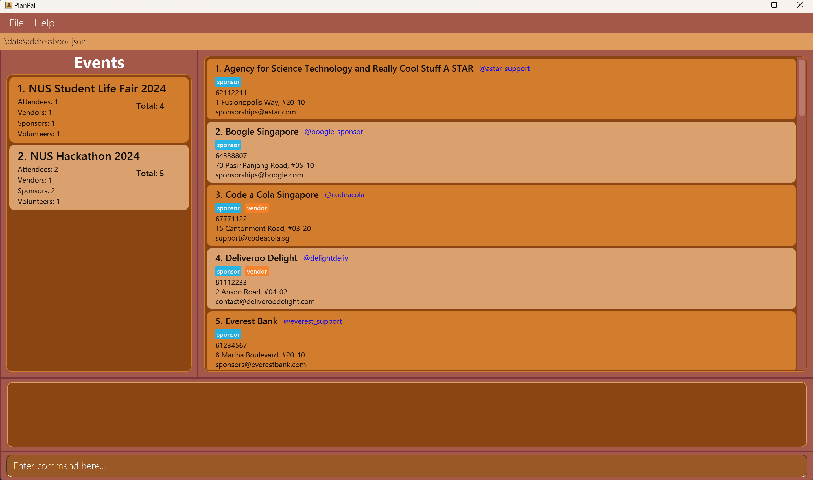

PlanPal is an **address book** designed for **student event planners** at NUS who need to manage contacts
(e.g., attendees, vendors, sponsors, and volunteers) for their events.

PlanPal offers a **centralized platform** to organize, track, and access contact information, ensuring 
efficient coordination and smooth communication throughout the event planning process.

This project is based on the AddressBook-Level3 project created by the [SE-EDU initiative](https://se-education.org).


* Table of Contents
{:toc}

--------------------------------------------------------------------------------------------------------------------
<div style="page-break-after: always"></div>

## Quick Start

### Pre-requisites

Ensure that you have Java `17` or above installed on your computer. If you are unsure whether Java is installed, follow the steps below based on your operating system to check.

**Windows**
1. Open Command Prompt by typing `cmd` in the Start menu and pressing Enter.
2. Type `java -version` and press Enter.
3. If Java is installed, the version will be displayed. Ensure it is version `17` or above.

**Mac**
1. Open Terminal (you can find it by searching in Spotlight by pressing the `Cmd + Space` keys, then type "Terminal").
2. Type `java -version` and press Enter.
3. If Java is installed, the version will be displayed. Ensure it is version `17` or above.

**Linux**
1. Open your terminal.
2. Type `java -version` and press Enter.
3. If Java is installed, the version will be displayed. Ensure it is version `17` or above.

If Java is not installed or if the version is below `17`, download the latest Java Development Kit (JDK) from the [official Oracle website](https://www.oracle.com/java/technologies/javase-jdk17-downloads.html) or use a package manager like `Homebrew` on Mac or `apt-get` on Linux to install Java.

---

### Steps to Start PlanPal

1. **Download the Application**: Download the latest `.jar` file for PlanPal from [this link](https://github.com/AY2425S1-CS2103T-F09-2/tp/releases).

2. **Set Up the Application Folder**: Copy the downloaded `.jar` file to the folder where you want to store PlanPal’s data. This folder will be your _home folder_ for PlanPal.

3. **Run the Application**:
    - Open a command terminal.
    - Navigate to the folder containing the `.jar` file by typing `cd path/to/your/folder` and pressing Enter.
    - Run the application by typing:
      ```bash
      java -jar planpal.jar
      ```
    - Press Enter. After a few seconds, a GUI similar to the one shown below should appear. Note that the application will start with some sample data preloaded for testing purposes.

   

4. **Try Out Basic Commands**:
    - In the command box within PlanPal, type a command and press Enter to execute it. For example:
        - **`help`**: Opens the help window with guidance on commands.
        - **`list`**: Displays a list of all contacts.
        - **`add n/John Doe p/98765432 e/johnd@example.com a/John street, block 123, #01-01`**: Adds a contact named `John Doe` to the address book.
        - **`delete 3`**: Removes the 3rd contact in the current list.
        - **`clear`**: Deletes all contacts from the address book.
        - **`exit`**: Closes the application.

5. **Explore Additional Features**: For detailed explanations of each command and additional features, refer to the [Features](#features) section below.

--------------------------------------------------------------------------------------------------------------------
<div style="page-break-after: always"></div>

## Features

<div markdown="block" class="alert alert-info">

**:information_source: Notes about the command format:**<br>

* Words in `UPPER_CASE` are the parameters to be supplied by the user.<br>
  e.g. in `add n/NAME`, `NAME` is a parameter which can be used as `add n/John Doe`.

* Items in square brackets are optional.<br>
  e.g `n/NAME [r/ROLE]` can be used as `n/John Doe r/attendee` or as `n/John Doe`.

* Items in angled brackets require at least one item to be present.<br>
  e.g `ei/EVENT_INDEX <a/ or s/ or ve/ or vo/>CONTACT_INDEX` can be used as `ei/2 a/1` or as `ei/2 a/1 ve/3 vo/2 s/5`.

* Items with `…`​ after them can be used multiple times including zero times.<br>
  e.g. `[r/ROLE]…​` can be used as ` ` (i.e. 0 times), `r/attendee`, `r/attendee r/sponsor` etc.

* Parameters can be in any order.<br>
  e.g. if the command specifies `n/NAME p/PHONE_NUMBER`, `p/PHONE_NUMBER n/NAME` is also acceptable.

* Extraneous parameters for commands that do not take in parameters (such as `help`, `list`, `exit` and `clear`) will be ignored.<br>
  e.g. if the command specifies `help 123`, it will be interpreted as `help`.

* If you are using a PDF version of this document, be careful when copying and pasting commands that span multiple lines as space characters surrounding line-breaks may be omitted when copied over to the application.
</div>

### Viewing help : `help`

Shows a message explaning how to access the help page.


Format: `help`

### Contact Related Features

#### Adding a contact: `add`

Adds a contact to the address book.

Format: `add n/NAME p/PHONE e/EMAIL a/ADDRESS [t/TELEGRAM_USERNAME] [r/ROLE]…​`

<div markdown="span" class="alert alert-primary">**Note:**
A contact can have any number of roles (including 0), and the Telegram username is optional.
</div>

Examples:
* `add n/John Doe p/98765432 e/johnd@example.com a/John street, block 123, #01-01`
* `add n/Betsy Crowe e/betsycrowe@example.com a/Newgate Prison p/1234567 t/betsyyy r/attendee r/sponsor`


#### Editing a Contact : `edit`

Edits an existing contact in the address book.

Format: `edit INDEX <n/NAME p/PHONE_NUMBER e/EMAIL a/ADDRESS t/TELEGRAM_USERNAME r/ROLE…​>`

* Edits the contact at the specified `INDEX`. The index refers to the position number shown in the displayed contact list. The index **must be a positive integer** (e.g., 1, 2, 3, …).
* At least one of the optional fields must be provided.
* Existing values will be updated to the new values entered.
* When adding roles, only the following are valid roles: attendee, sponsor, vendor, volunteer.

<div markdown="span" class="alert alert-primary">:bulb: **Tip:** 
To remove all roles from a contact, type `r/` without specifying any role after it. Similarly, to remove a Telegram handle, type `t/` with no username after it.
</div>

<div markdown="span" class="alert alert-warning">:exclamation: **Caution:**
Editing a contact's information will update it across all events where that contact is included!
</div>

Examples:
*  `edit 1 p/91234567 e/johndoe@example.com` Edits the phone number and email address of the 1st contact to `91234567` and `johndoe@example.com`.
*  `edit 2 n/Jason Brown t/` Changes the name of the 2nd contact to `Jason Brown` and clears their Telegram username.
*  `edit 3 n/Betsy Crower r/` Updates the name of the 3rd contact to `Betsy Crower` and removes all existing roles.

#### Locating Contacts by Name or Role: `find-name` and `find-role`

##### Find Contacts by Keywords in Name: `find-name` or `fn`
Finds contacts whose names contain any of the provided keywords.

Format: `find-name KEYWORD [MORE_KEYWORDS]...`

* The search is case-insensitive (e.g., `hans` matches `Hans`).
* The order of keywords does not matter (e.g., `Hans Bo` matches `Bo Hans`).
* Contacts matching at least one keyword will be returned (i.e., an `OR` search).<br>
  For example, `Hans Bo` will return `Hans Gruber` and `Bo Yang`.

Examples:
* `find-name John` returns `John` and `John Doe`.
* `find-name alex david` returns `Alex Yeoh` and `David Li`.<br>
  


##### Find Contacts by Role: `find-role` or `fr`
Finds contacts who have the specified role.

Format: `find-role ROLE`

* The search is case-insensitive (e.g., `attendee` matches `Attendee`).
* Only full words will be matched (e.g., `attend` will not match `attendee`).
* Valid roles are: `attendee`, `sponsor`, `vendor`, `volunteer`.
* If more than one role is specified, contacts matching at least one role will be returned (i.e., an `OR` search).<br>
  For example, `attendee sponsor` returns contacts who are either attendees or sponsors.

Examples:
* `find-role attendee` returns all contacts with the attendee role.<br>
* `find-role attendee sponsor` returns all contacts with either the attendee or sponsor roles (or both!).<br>


#### Deleting a Contact : `delete`

Removes the specified contact from the address book.

Format: `delete INDEX`

* Deletes the contact at the specified `INDEX`.
* The index refers to the number shown in the displayed contact list.
* The index **must be a positive integer** (e.g., 1, 2, 3, …).

<div markdown="span" class="alert alert-warning">:exclamation: **Caution:**
Once you delete a contact, they will also be automatically removed from all events!
</div>

Examples:
* `list` followed by `delete 2` deletes the 2nd contact in the address book.
* `find Betsy` followed by `delete 1` deletes the 1st contact in the search results from the `find` command.

<div style="page-break-after: always"></div>

### Event related Features

#### Adding a new Event : `new`

Adds a new Event to address book.

Format: `new EVENT_NAME`

**Note:** The event name cannot be blank.

Examples:
* `new Sumo Bot Festival`
* `new RC Horror Night`

#### Finding all Contacts in an event: `find-event`
Displays the list of contacts in the specified event.

Format: `find-event EVENT_INDEX`

* Event name cannot be blank
* Event must exist in PlanPal.

Examples:
* `find-event 1`

#### Adding a Contact to an Event : `event-add` or `ea`
Adds a contact to an event with a specified role.

Format: `event-add ei/EVENT_INDEX <a/ or s/ or ve/ or vo/> CONTACT_INDEX, [MORE_CONTACT_INDICES]...`

Guide for flag roles:
* `a/` - attendee
* `s/` - sponsor
* `ve/` - vendor
* `vo/` - volunteer

**Note:** At least one of the following prefixes is required—`a/`, `e/`, `ve/`, or `vo/`—each followed by one or more contact index/indices

Examples:
* `event-add ei/1 a/1,2,3`

#### Removing a Contact from an Event : `remove`
Removes a contact from an event.

Format: `remove ei/EVENT_INDEX ci/PERSON_INDEX`

Example:
* `remove ei/1 ci/1`

#### Deleting an Event : `erase`
Deletes an event from the event list.

Format: `erase EVENT_INDEX`

Example:
* `erase 1`

#### Clear all events: `clear-event`
Clear all events from the event list.

Format: `clear-event`

### Search Mode for Event Management : `search-mode` or `sm`
Search Mode allows you to search for contacts based on multiple criteria,
enabling you to add multiple contacts to an event simultaneously. 
You can search using criteria such as:

- Name
- Phone Number
- Email
- Address
- Telegram Handle
- Role

To enter Search Mode, type `search-mode` or `sm` and press Enter. The display will change to the Search Mode interface.


Search Mode displays all contacts in PlanPal on the right panel (similar to the `list` command).
The contacts matching your search criteria will be shown in the center panel.

The following commands can be used in Search Mode:
- `search` : Searches for contacts based on specified criteria.
- `exclude` : Excludes contacts from appearing in search results.
- `clear-excluded` or `clx` : Clears all excluded contacts.
- `check-excluded` or `chx` : Displays the list of excluded contacts.
- `exit-search` or `es` : Exits Search Mode and returns to the normal display.
- `help` : Displays the help message.
- `exit` : Exits the program (same as the `exit` command).

<div style="page-break-after: always"></div>

#### Searching in Search-mode `search`

Format: `search <n/NAME p/PHONE_NUMBER e/EMAIL a/ADDRESS t/TELEGRAM_USERNAME r/ROLE…​>`

For each field, you can specify multiple keywords or partial keywords.
Contacts whose details match at least one keyword or contain all partial keywords will be returned.

For example:
- `search n/Samuel Tan` returns all contacts whose name matches `Samuel Tan` or contains `"samuel"` or `"Tan"`.

When multiple fields are specified, the search will return only contacts that match **all** criteria.
Example:
- `search n/Samuel Tan a/Avenue` returns all contacts whose:
    - name contains `Samuel Tan`
    - address contains `Avenue`.


**Note:** A flag parameter should not be empty (e.g. `n/` or `t/`), as it will not return any results.
Flag parameters should also not be repeated (e.g. `n/Alex n/John`).

<div markdown="span" class="alert alert-primary">:bulb: **Tip:**
You can chain multiple searches to get the full list of contacts you are looking for!
If you are looking for a specific contact, try to be as specific as possible to get the best results!
</div>

#### Excluding Contacts in Search Mode : `exclude`

Format: `exclude ci/INDEX, [MORE_INDICES]...`

Exclude contacts from the search results using the `exclude` command.
Excluded contacts will not appear in any subsequent searches until they are cleared from the excluded list.

Example:
- `search n/John` returns a list of contacts named `John`.
  
- `exclude ci/2` excludes the second contact from the search results.
  
- Subsequent searches will not include the excluded contact.
    - `search p/9234512` will match the previously excluded contact but will not reappear in the results.
    

#### Viewing Excluded Contacts : `check-excluded` or `chx`
To view the contacts currently excluded from search results, use the `check-excluded` command.

Format: `check-excluded`

Example:
- `check-excluded` displays the list of excluded contacts.
  

#### Clearing Excluded Contacts : `clear-excluded` or `clx`
To remove all contacts from the excluded list, use the `clear-excluded` command. Excluded contacts will then
appear in search results again.

Format: `clear-excluded`

Example:


#### Adding All Selected Contacts to an Event : `add-all` or `aa`
To add all selected contacts in Search Mode to an event, use the `add-all` command.

Format: `add-all EVENT_INDEX`

Example: `add-all 2`

#### Exiting Search Mode : `exit-search` or `es`
To exit Search Mode and return to the normal display, use the `exit-search` or `es` command.

Format: `exit-search` or `es`

_This concludes the commands available in Search Mode. The following commands can be used in the normal display mode._

<div style="page-break-after: always"></div>

### Clearing All Entries : `clear`

Removes all entries from the address book.

Format: `clear`

### Exiting the Program : `exit`

Closes the program.

Format: `exit`

### Saving Data

PlanPal data is saved automatically to your hard disk after any command that changes the data. There is no need to save manually.

### Editing the Data File

PlanPal data is stored as a JSON file in `[JAR file location]/data/addressbook.json`. Advanced users can edit this data file directly.

<div markdown="span" class="alert alert-warning">:exclamation: **Caution:**
If your changes to the data file make its format invalid, PlanPal will discard all data and start with an empty data file on the next run. **We recommend creating a backup of the file before editing it.**
</div>

### Navigating Through Command History

Use the `up` and `down` arrow keys to navigate through your command history. Pressing the up arrow displays previously executed commands, allowing you to re-run or edit past commands without retyping them. The down arrow moves forward through the command history, returning to more recent commands.

--------------------------------------------------------------------------------------------------------------------

<div style="page-break-after: always"></div>

## FAQ

**Q**: How do I transfer my data to another computer?<br>
**A**: Install the app on the other computer and replace the empty data file it creates with the file containing the data from your previous AddressBook home folder.

**Q**: What should I do if the program isn’t launching correctly?<br>
**A**: First, ensure you have Java 17 or above installed. If you do, try re-downloading the `.jar` file and running it again. If issues persist, check your system’s permissions for accessing and running files.

**Q**: Can I customize the data file's storage location?<br>
**A**: The data file is saved automatically in `[JAR file location]/data/addressbook.json`. While you cannot change this location within the application, you can move the entire PlanPal folder to a different location. Make sure to update any shortcuts or file paths accordingly.

**Q**: How can I restore accidentally deleted contacts?<br>
**A**: If you recently deleted contacts, the data is permanently removed from PlanPal. We recommend keeping regular backups of your data file to restore information if needed.

**Q**: Why does the GUI open off-screen when I switch monitors?<br>
**A**: This can happen when switching between multiple monitors. To fix this, delete the `preferences.json` file, which stores display settings, and restart PlanPal.

--------------------------------------------------------------------------------------------------------------------


## Known Issues

1. **When using multiple screens**: If you move the application to a secondary screen and later switch to using only the primary screen, the GUI may open off-screen. **Solution**: Delete the `preferences.json` file created by the application before running it again.

2. **Minimized Help Window Issue**: If you minimize the Help Window and then run the `help` command (or use the `Help` menu, or the `F1` shortcut) again, the original Help Window will remain minimized, and no new Help Window will appear. **Solution**: Manually restore the minimized Help Window from your taskbar.

---

## Command Summary

### Basic Commands

| Action               | Format, Examples                                                                                                                                                                                                              |
|----------------------|-------------------------------------------------------------------------------------------------------------------------------------------------------------------------------------------------------------------------------|
| **Add Contact**      | `add n/NAME p/PHONE_NUMBER e/EMAIL a/ADDRESS [t/TELEGRAM_USERNAME] [r/ROLE]…​` <br> e.g., `add n/James Ho p/22224444 e/jamesho@example.com a/123, Clementi Rd, 1234665 t/james_ho`                                            |
| **Clear All Contacts** | `clear`                                                                                                                                                                                                                       |
| **Delete Contact**   | `delete INDEX`<br> e.g., `delete 3`                                                                                                                                                                                           |
| **Edit Contact**     | `edit INDEX <n/NAME p/PHONE_NUMBER e/EMAIL a/ADDRESS t/TELEGRAM_USERNAME r/ROLE…​>`<br> e.g.,`edit 2 n/James Lee e/jameslee@example.com`                                                                                      |
| **Find by Name**     | `find-name KEYWORD [MORE_KEYWORDS]...` or `fn KEYWORD [MORE_KEYWORDS]...` <br> e.g., `find-name James Jake`                                                                                                                   |
| **Find by Role**     | `find-role ROLE [MORE_ROLES]` or `fr ROLE [MORE_ROLES]` <br> e.g., `find-role sponsor`                                                                                                                                        |
| **Add Event**        | `new EVENT_NAME` <br> e.g., `new Sumo Bot Festival`                                                                                                                                                                           |
| **Add Contact to Event** | `event-add ei/EVENT_INDEX <a/ or s/ or ve/ or vo/>CONTACT_INDEX, [MORE_CONTACT_INDICES]...` or <br>`ea ei/EVENT_INDEX <a/ or s/ or ve/ or vo/>CONTACT_INDEX, [MORE_CONTACT_INDICES]` <br> e.g., `e.g. event-add ei/1 a/1,2,3` |
| **Find Contacts in Event** | `find-event EVENT_INDEX` or `fe EVENT_INDEX` <br> e.g., `find-event 1`                                                                                                                                                        |
| **Remove Contact from Event** | `remove ei/EVENT_INDEX ci/CONTACT_INDEX` <br> e.g., `remove ei/1 ci/1`                                                                                                                                                        |
| **Delete Event**     | `erase EVENT_INDEX`                                                                                                                                                                                                           
| **Clear-Event**      | `clear-event`                                                                                                                                                                                                                 |
| **List Contacts**    | `list`                                                                                                                                                                                                                        |
| **Help**             | `help`                                                                                                                                                                                                                        |

### Search Mode Summary

| Action                        | Format, Examples                                               |
|-------------------------------|----------------------------------------------------------------|
| **Enter Search Mode**         | `search-mode` or `sm`                                          |
| **Search Contacts**           | `search`                                                       |
| **Exclude Contact**           | `exclude ci/INDEX [MORE_INDEXES]...` <br> e.g., `exclude ci/2` |
| **Check Excluded Contacts**   | `check-excluded` or `chx`                                      |
| **Clear Excluded Contacts**   | `clear-excluded` or `clx`                                      |
| **Add All Selected Contacts** | `add-all EVENT_INDEX` or `aa EVENT_INDEX`                      |
| **Exit Search Mode**          | `exit-search` or `es`                                          |
