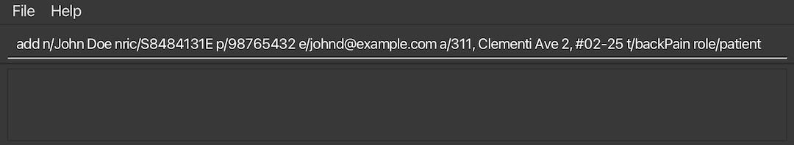
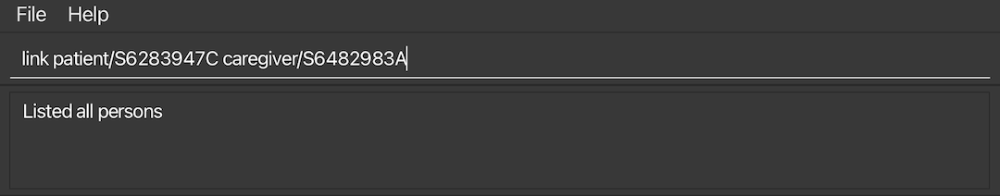

AddressBook Level 3 (AB3) is a **desktop app for managing contacts, optimized for use via a Command Line Interface** (CLI) while still having the benefits of a Graphical User Interface (GUI). If you can type fast, AB3 can get your contact management tasks done faster than traditional GUI apps.

- Table of Contents
* [Quick start](#quick-start)
* [Features](#features)
    * [Viewing help : help](#viewing-help--help)
    * [Adding a person: add](#adding-a-person-add)
    * [Listing all persons : list](#listing-all-persons--list)
    * [Editing a person : edit](#editing-a-person--edit)
    * [Locating persons by name, NRIC, role, or tags: find](#locating-persons-by-name-nric-role-or-tags-find)
    * [Deleting a person : delete](#deleting-a-person--delete)
    * [Clearing all entries : clear](#clearing-all-entries--clear)
    * [Exiting the program : exit](#exiting-the-program--exit)
    * [Saving the data](#saving-the-data)
    * [Editing the data file](#editing-the-data-file)
    * [Archiving data files [coming in v2.0]](#archiving-data-files-coming-in-v20)
* [FAQ](#faq)
* [Known issues](#known-issues)
* [Command summary](#command-summary)

---

## Quick start

1. Ensure you have Java `17` or above installed in your Computer.

1. Download the latest `.jar` file from [here](https://github.com/se-edu/addressbook-level3/releases).

1. Copy the file to the folder you want to use as the _home folder_ for your AddressBook.

1. Open a command terminal, `cd` into the folder you put the jar file in, and use the `java -jar carelink.jar` command to run the application. 
   A GUI similar to the below should appear in a few seconds. Note how the app contains some sample data. 
   

1. Type the command in the command box and press Enter to execute it. e.g. typing **`help`** and pressing Enter will open the help window. 
   Some example commands you can try:

   - `list` : Lists all contacts.

   - `add n/John Doe p/98765432 e/johnd@example.com a/John street, block 123, #01-01` : Adds a contact named `John Doe` to the Address Book.

   - `delete S6483749D` : Deletes the person with NRIC `S6483749D`.

   - `clear` : Deletes all contacts.

   - `exit` : Exits the app.

1. Refer to the [Features](#features) below for details of each command.

---

## Features

**:information_source: Notes about the command format:** 

- Words in `UPPER_CASE` are the parameters to be supplied by the user. 
  e.g. in `add n/NAME`, `NAME` is a parameter which can be used as `add n/John Doe`.

- Items in square brackets are optional. 
  e.g `n/NAME [t/TAG]` can be used as `n/John Doe t/friend` or as `n/John Doe`.

- Items with `…`​ after them can be used multiple times including zero times. 
  e.g. `[t/TAG]…​` can be used as ` ` (i.e. 0 times), `t/friend`, `t/friend t/family` etc.

- Parameters can be in any order. 
  e.g. if the command specifies `n/NAME p/PHONE_NUMBER`, `p/PHONE_NUMBER n/NAME` is also acceptable.

- Extraneous parameters for commands that do not take in parameters (such as `help`, `list`, `exit` and `clear`) will be ignored. 
  e.g. if the command specifies `help 123`, it will be interpreted as `help`.

- If you are using a PDF version of this document, be careful when copying and pasting commands that span multiple lines as space characters surrounding line-breaks may be omitted when copied over to the application.

### Viewing help : `help`

Shows a message explaning how to access the help page.

Format: `help`

### Adding a person: `add`

Adds a person to the address book.

Format: `add n/NAME p/PHONE_NUMBER e/EMAIL a/ADDRESS r/ROLE [t/TAG]…​`

**The role must be either a patient or a caregiver**

:bulb: **Tip:**
A person can have any number of tags (including 0)

Examples:
* `add n/John Doe nric/S8484131E p/98765432 e/johnd@example.com a/311, Clementi Ave 2, #02-25 t/backPain role/patient`

- `add n/John Doe p/98765432 e/johnd@example.com a/John street, block 123, #01-01`
- `add n/Betsy Crowe t/friend e/betsycrowe@example.com a/Newgate Prison p/1234567 t/criminal`

### Linking a patient and a caregiver: `link`

Links a patient to the caregiver in CareLink.

Format: `link patient/PATIENT_NRIC caregiver/CAREGIVER_NRIC`

Examples:

- `link patient/S6283947C caregiver/S7012345B`
- `link caregiver/S7012345B patient/S6482983A`

### Listing all persons : `list`

Shows a list of all persons in the address book.

Format: `list`

### Editing a person : `edit`

Edits an existing person in the address book.

Format: `edit NRIC [n/NAME] [p/PHONE] [e/EMAIL] [a/ADDRESS] [t/TAG]…​`

- Edits the person with the specified `NRIC`. The `NRIC` must be a valid Singapore National Identification Card Number.
- At least one of the optional fields must be provided.
- Existing values will be updated to the input values.
- When editing tags, the existing tags of the person will be removed i.e adding of tags is not cumulative.
- You can remove all the person’s tags by typing `t/` without
  specifying any tags after it.

Examples:

- `edit S1234567D p/91234567 e/johndoe@example.com` Edits the phone number and email address of the person with `S1234567D` to be `91234567` and `johndoe@example.com` respectively.
- `edit S6483749D n/Betsy Crower t/` Edits the person with NRIC `S6483749D` to be `Betsy Crower` and clears all existing tags.

### Locating persons by name, NRIC, role, or tags: `find`

Finds persons based on the specified criteria using the provided prefixes.

**Format**: `find [n/NAME] [nric/NRIC] [role/ROLE] [t/TAG]...`

- The search is case-insensitive. e.g., `n/alex` will match `Alex`.
- The order of the prefixes and keywords does not matter. e.g., `n/Alex nric/S1234567D` is equivalent to `nric/S1234567D n/Alex`.
- Partial matches are not supported. e.g., `n/Al` will not match `Alex`.
- Persons matching any of the provided criteria will be returned (i.e., `OR` search). For example, `n/Alex t/friend` will return persons whose name contains "Alex" or have the tag "friend".

### Prefixes:
- `n/NAME`: Searches by name.
- `nric/NRIC`: Searches by Singapore National ID.
- `role/ROLE`: Searches by role (e.g., `role/patient` or `role/caregiver`).
- `t/TAG`: Searches by tag (e.g., `t/friend`, `t/family`).

### Examples:
- `find n/John` returns `John`, `John Doe`.
- `find n/Alex nric/S1234567D` returns persons whose name contains `Alex` or with NRIC `S1234567D`.
- `find role/patient t/friend` returns all patients or persons with the tag `friend`.
### Deleting a person : `delete`

Deletes the specified person from the address book.

Format: `delete NRIC`

* Deletes the person with the specified `NRIC`.
* The NRIC **must be a valid Singapore National ID** (eg. S1234567D)​

Examples:
* `find n/David` returns `David LI` with NRIC `S6483749D`
* `delete S6483749D` deletes the person with the NRIC `S6483749D` in the address book.
    

### Clearing all entries : `clear`

Clears all entries from the address book.

Format: `clear`

### Exiting the program : `exit`

Exits the program.

Format: `exit`

### Saving the data

AddressBook data are saved in the hard disk automatically after any command that changes the data. There is no need to save manually.

### Editing the data file

AddressBook data are saved automatically as a JSON file `[JAR file location]/data/addressbook.json`. Advanced users are welcome to update data directly by editing that data file.

:exclamation: **Caution:**
If your changes to the data file makes its format invalid, AddressBook will discard all data and start with an empty data file at the next run. Hence, it is recommended to take a backup of the file before editing it. 
Furthermore, certain edits can cause the AddressBook to behave in unexpected ways (e.g., if a value entered is outside of the acceptable range). Therefore, edit the data file only if you are confident that you can update it correctly.

### Archiving data files `[coming in v2.0]`

_Details coming soon ..._

---

## FAQ

**Q**: How do I transfer my data to another Computer? 
**A**: Install the app in the other computer and overwrite the empty data file it creates with the file that contains the data of your previous AddressBook home folder.

---

## Known issues

1. **When using multiple screens**, if you move the application to a secondary screen, and later switch to using only the primary screen, the GUI will open off-screen. The remedy is to delete the `preferences.json` file created by the application before running the application again.
2. **If you minimize the Help Window** and then run the `help` command (or use the `Help` menu, or the keyboard shortcut `F1`) again, the original Help Window will remain minimized, and no new Help Window will appear. The remedy is to manually restore the minimized Help Window.

---

## Command summary

| Action          | Format, Examples                                                                                                                                                      |
| --------------- | --------------------------------------------------------------------------------------------------------------------------------------------------------------------- |
| **Add**         | `add n/NAME p/PHONE_NUMBER e/EMAIL a/ADDRESS [t/TAG]…`   e.g., `add n/James Ho p/22224444 e/jamesho@example.com a/123, Clementi Rd, 1234665 t/friend t/colleague` |
| **Link**        | `link patient/PATIENT_NRIC caregiver/CAREGIVER_NRIC`   e.g. `link patient/S6283947C caregiver/S7012345B`                                                           |
| **Clear**       | `clear`                                                                                                                                                               |
| **Delete**      | `delete NRIC`  e.g., `delete S6483749D`                                                                                                                                   |
| **Edit**        | `edit NRIC [n/NAME] [p/PHONE_NUMBER] [e/EMAIL] [a/ADDRESS] [t/TAG]…`   e.g.,`edit S1234567D n/James Lee e/jameslee@example.com`                                           |
| **Find**        | `find [n/NAME] [nric/NRIC] [role/ROLE] [t/TAG]...`  e.g., `find n/Alex nric/S1234567D`
| **List**        | `list`
| **Help**        | `help`
