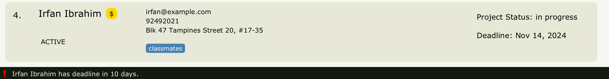

Clientele+ seamlessly combines client contacts, payment tracking and more in one efficient package, tailored specifically for freelance software developers.

* Table of Contents
{:toc}

--------------------------------------------------------------------------------------------------------------------

# Quick start

**:information_desk_person: If you are an experienced user, and know how to set up jar files, you may wish to skip to the [command summary](#command-summary) and get started.**

1. Ensure you have Java `17` or above installed in your Computer.

2. Download the latest `ClientelePlus.jar` file from [here](https://github.com/AY2425S1-CS2103T-F14A-3/tp/releases).

3. Copy the file to the folder you want to use as the _home folder_ for Clientele+.

4.  Open a command terminal, `cd` into the folder you put the jar file in, and use the `java -jar ClientelePlus.jar` command to run the application.  
    A GUI similar to the below should appear in a few seconds
   

5. Type the command in the command box and press `Enter` to execute it. e.g. typing **`help`** and pressing `Enter` will open the help window. 
   Some example commands you can try:

    * `list` : Lists all clients' contacts.

    * `add n/John Dimon p/98765432 e/johnd@gmail.com a/Maxwell Street, #05-01 t/JP Morgan py/pending cs/active d/09-09-2024` : Adds a client contact named `John Dimon` with pending payment to Clientele+.

    * `delete id/3` : Deletes the 3rd client contact shown in the current list.

    * `blacklist 1` : Blacklists the 1st client contact shown in the current list.

    * `archive 2` : Archives the 2nd client contact shown in the current list.

    * `edit n/James Thompson d/11-05-2025` : Set a client's deadline, and automatically update reminder manager

    * `find n/Jeremy` : Finds all clients whose name matches Jeremy

    * `edit n/Joseph Wharton py/late` : Update client's payment status (will display as red $ on GUI)

6. Refer to the [Features](#features) below for details of each command.

--------------------------------------------------------------------------------------------------------------------

# Features

**:information_source: Notes about the command format:** 

* Words in `UPPER_CASE` are the parameters to be supplied by the user. 
  e.g. in `add n/NAME`, `NAME` is a parameter which can be used as `add n/John Doe`.

* Items in square brackets are optional. 
  e.g `n/NAME [t/TAG]` can be used as `n/John Doe t/friend` or as `n/John Doe`.

* Items with `…`​ after them can be used multiple times including zero times. 
  e.g. `[t/TAG]…​` can be used as ` ` (i.e. 0 times), `t/friend`, `t/friend t/family` etc.

* Parameters can be in any order. 
  e.g. if the command specifies `n/NAME p/PHONE_NUMBER`, `p/PHONE_NUMBER n/NAME` is also acceptable.

* Extraneous parameters for _some_ commands that do not take in parameters (such as `help`, `list`, `exit` and `clear`) will be ignored. 
  e.g. if the user enters `help 123`, it will be interpreted as `help`.

* If you are using a PDF version of this document, be careful when copying and pasting commands that span multiple lines as space characters surrounding line-breaks may be omitted when copied over to the application.

## Accepted values by field

Field | Accepted input values | Examples | Exceptions
----------|-----------------------|----------|-----------
`NAME` | Any valid English name. Alphanumeric characters, spaces and dashes are allowed to account for scenarios where clients may prefer to use a username or pseudonym instead of their real name. | `Josh1248`, `Jean Mary-Jane`, `Jackie  Chan` | None
`PHONE_NUMBER` | Must consist of digits (0 to 9), but spaces and dashes are allowed. | `9143 9032`, `872-233-8554`, `987223414` | None
`EMAIL` | Must be a in a valid email format (no underscores): `somestring@domain.topleveldomain` | `jemma22@github.com`, `rahulSingh@rocket.net`, `cassie@finance.morganstanley.com` | None
`ADDRESS` | Any non-empty string | `Singapore`, `42 Wallaby Way, Sydney` | None
`DEADLINE` | Any valid date in the format dd-mm-[yy]yy Day and Month must be a valid combination (so no 31st of February for example) Year can be either 2-digit or 4-digit Dashes (-), Slashes (/), underscores (_) and vertical bars (&#124;) can be used as delimiters | `1-1-25` (represents "January 1, 2025"), `10/8/2040` (represents "August 10, 2040"), <code>29&#124;2&#124;28</code> (represents "February 29, 2028") | None
`TAG` | Any non-empty alphanumeric string (spaces allowed) | `friends`, `CEO of IMB`, `Born 2017` | None
`CLIENT_STATUS` | Must be `old`, `potential`, `unresponsive` or `active`. | `old`, `potential`, `unresponsive`, `active` | `blacklisted` is also a valid client status but can only be set using the `blacklist` command ([see here](#blacklist-a-client-blacklist)).
`PROJECT_STATUS` | Must be `in progress` or `completed` (note the past tense) | `in progress`, `completed` | None
`PAYMENT_STATUS` | Must be `pending`, `partial`, `paid` or `late` | `pending`, `partial`, `paid`, `late` | None

## General Commands
### Viewing help: `help`

Shows a message explaining how to access the help page.

Format: `help`

### Listing all Clients: `list`

Show a list of all clients contacts in Clientele+.

Format: `list`

:bulb: **Tip:** 

You can use this command to return to the main client list.

### Clearing All Entries: `clear`

Clears all entries from Clientele+.

Format: `clear`

:exclamation: **Caution:**

 
**This command permanently deletes all clients from the main client list. This action cannot be undone.** Please ensure you fully understand the consequences before proceeding. This command does not affect clients in the archived list.

### Exiting the Program: `exit`

Automatically saves all of the user's client data and exits the program.

Format: `exit`

:bulb: **Tip:**

 
You can also exit the program by clicking the "x" at the top left corner of the window. The program will automatically save your data before closing.

## Client Management
### Add Client Details: `add`

Add a client to Clientele+, including details such as client name, contact information, project deadline, project status, payment status and client status. Accepted values are as specified in the [accepted values table above](#accepted-values-by-field).

Format: `add n/NAME p/PHONE_NUMBER e/EMAIL a/ADDRESS d/DEADLINE [t/TAG]…​
[ps/PROJECT_STATUS] [py/PAYMENT_STATUS] [cs/CLIENT_STATUS]`

* Clients with the **same** `NAME`, `EMAIL` and `PHONE NUMBER` are considered duplicates and will not be added
* A person can have 0 or more tags.
* `NAME` is case-insensitive. `John Doe` and `joHN dOE` are considered the same name, but name is stored in the same case as the input (so `John Doe` is stored as `John Doe` and `JOHN Doe` is stored as `JOHN Doe`).
* If `PAYMENT_STATUS` is not specified, default payment status of `pending` is used.
* If `CLIENT_STATUS` is not specified, default client status of `active` is used.
* If `PROJECT_STATUS` is not specified, default project status of `in progress` is used.

Examples:
* `add n/John Dimon p/98765432 e/johnd@gmail.com a/Maxwell Street, #05-01 t/JP Morgan t/CTO ps/in progress py/pending cs/active d/09-09-2024`
* `add n/Betsy Crowe t/SoftEng Inc e/betsycrowe@gmail.com a/Wallich Street p/1234567 t/Founder d/11-04-2024`

:bulb: **Tip:**

 1. The deadline could be the date you need to submit the project to the client.  
2. The deadline could instead be the date by which you need to follow up with a potential client.  
3. Payment status values are displayed as an icon with the colours orange, yellow, green and red for the values pending, partial, paid and late respectively.  
4. You may hover over the Payment Status Icon to view the payment status as text.

### Update Client Details: `edit`

Allows updating of various statuses of an existing client. Accepted values are as specified in the [accepted values table above](#accepted-values-by-field).

Format: `edit INDEX [n/NAME] [p/PHONE] [e/EMAIL] [a/ADDRESS] [d/DEADLINE]
[t/TAG]…​ [ps/PROJECT_STATUS] [py/PAYMENT_STATUS] [cs/CLIENT_STATUS]`

* Edits the person at the specified `INDEX`. The index refers to the index number shown in the _displayed_ person list. The index **must be a positive integer** 1, 2, 3, …​
* At least one of the optional fields must be provided.
* Existing values will be updated to the input values.
* When editing tags, the existing tags of the person will be removed i.e adding of tags is not cumulative.
* You can remove all the person’s tags by typing `t/` without
  specifying any tags after it.
* Any fields not specified will remain unchanged.

Examples:
*  `edit 1 p/91234567 e/johndoe@example.com` Updates the first person’s phone number to `91234567` and email address to `johndoe@example.com`
*  `edit 2 n/Betsy Crower t/` Updates the name of the 2nd person to be `Betsy Crower` and clears all existing tags.
*  `edit 1 ps/completed py/paid cs/old` Updates the project status, payment status and client status of the 1st person to be `completed`, `paid` and `old` respectively.

:bulb: **Tip:**

 
If a client's project deadline has passed and the client status is still `active` the GUI labels the client card as `OVERDUE`. So if the client has paid, and your business with them is finished, you can set their client status to `old` so the deadline field doesn't show `OVERDUE`.

### Locating Clients: `find`

Finds persons in main client list who match parameters specified. Accepted values are as specified in the [accepted values table above](#accepted-values-by-field).

Format: `find [n/NAME] [p/PHONE_NUMBER] [e/EMAIL] [a/ADDRESS] [d/DEADLINE] [t/TAG]… [ps/PROJECT_STATUS] [py/PAYMENT_STATUS] [cs/CLIENT_STATUS]`

* All values matched for any parameter are **case-insensitive**.
* The order of the name keywords does not matter. e.g. `n/Hans Bo` will match `Bo Hans`.
* Persons matching at least one name keyword will be returned (i.e. `OR` search).
  e.g. `find n/Han Bo` will return `Hans Gruber`, `Bo Yang`.
* Names only need to match the start of a word. e.g. `find n/Han` OR `find n/B` matches `Hans Bo`.
* Phone number, email, address, project status, tags, payment status, client status and deadline must match the exact string.
  e.g. `ps/in progress` will not match `ps/in prog`.
* All fields need to be matched for a person to be found
  e.g. `find n/Rah py/paid ps/in progress` matches those clients whose name starts with "Rah", payment status is `paid` and project status is `in progress`.
* When searching by tags, if multiple tags are specified then only one of the tags need to be matched.

Examples:
* `find n/John` returns `john` and `John Doe`.
* `find n/John ps/completed` returns all clients whose names start with "John" and project status is set to `completed`.
* `find n/John t/homeowner t/ceo` returns all clients whose names start with "John" and have either a "ceo" tag or a "homeowner" tag.
* `find n/alex david` returns `Alex Yeoh`, `David Li`: 

  

:bulb: **Tip:**  
**Shortcuts: Finding blacklisted/whitelisted clients**
 
To find all clients that are blacklisted (with no other fields specified), the command `blacklist` can be entered.

Similarly, the `whitelist` command can be entered to find all clients who are whitelisted.
 
_Note: both of these commands need to be entered without any parameters otherwise the app responds with an error message._

### Delete Client Details: `delete`

Deletes the specified person from Clientele+.

Format: `delete [n/NAME] [id/INDEX]`

* Deletes clients identified by the specified `INDEX` or `NAME`.
* `NAME` Acceptable values are same as [above](#accepted-values-by-field); the command looks for an **exact, case-insensitive** match in the name
  * Ex: `delete n/John` will match `john`, `JOHN` and `John`, but not `John Doe`.
* `INDEX` refers to the index number shown in the displayed person list, and **must be a positive integer** 1, 2, 3, …​

Examples:
* `delete n/John` deletes the client with the name `John`.
* `list` followed by `delete id/2` deletes the 2nd person in the list.
* `find n/Betsy` followed by `delete id/1` deletes the 1st person in the result of the `find` command.

:bulb: **Tip:**

 
If you try to delete by name but there are 2 or more clients in the list with that same name, then you will be shown a list of those clients and prompted to delete by index instead.

### Blacklist a Client: `blacklist`

Marks a client as "blacklisted".

Format: `blacklist INDEX`

* Marks the client specified by the index `INDEX` as "blacklisted".
* `INDEX` refers to the index number shown in the displayed person list and **must be a positive integer** 1, 2, 3, ...

Examples:
* `blacklist 2` marks the second person in the list as blacklisted

:bulb: **Tip:**
 
Entering `blacklist` on its own without any other parameters will filter and display all clients who have been blacklisted.

### Whitelist a Client: `whitelist`

Whitelists a previously-blacklisted client.

_Note: a client is considered to be on the whitelist if their client status is **not** "blacklisted"._

Format: `whitelist INDEX cs/NEW_CLIENT_STATUS`

* Changes the status of the client specified by the index `INDEX` from "blacklisted" to `NEW_CLIENT_STATUS`.
* `INDEX` refers to the index number shown in the displayed person list.
* `INDEX` **must be a positive integer** 1, 2, 3, ...
* `NEW_CLIENT_STATUS` refers to the new status of the client. Acceptable values are `potential`, `unresponsive`, `old` and `active`.

Examples:
* `whitelist 2 cs/active` whitelists the second person in the list and marks them as an `active` client.
* `whitelist 1 cs/old` whitelists the first person in the list and marks them as an `old` client.

:bulb: **Tip:**

 
Entering `whitelist` on its own without any other parameters will filter and display all clients who have been whitelisted.

### Sort Client list: `sort`

Sorts the client list in ascending order by the specified field.

Format: `sort FIELD ORDER`

* `FIELD` can be either `deadline` or `name` (**case-insensitive**)
* `ORDER` can be either `ascending` or `descending` (**case-insensitive**)

Examples:
* `sort name ascending` sorts the client list alphabetically by name in ascending order.
* `sort deadline descending` sorts the client list by project deadline (later dates first).

:bulb: **Tip:**

 
Clientele+ saves you the hassle of sorting the list every time you open the app. Every time you sort, it will save the list in the specified sort order.

### Archive a Client: `archive`
Archives a client present in the main client list.

Format: `archive INDEX`

* `INDEX` refers to the index number shown in the displayed person list and **must be a positive integer** 1, 2, 3, ...

Examples:
* `archive 1` archives the first person in the main client list, removing it and storing it in an archived list

### Unarchive a Client: `unarchive`
Unarchives a client and adds the client back to the main client list.

Format: `unarchive INDEX`

* `INDEX` refers to the index number shown in the displayed person list and **must be a positive integer** 1, 2, 3, ...

Examples:
* `unarchive 1` removes the first person from the archived list, adding it back to the main client list

### Listing all archived clients: `archive-list`
Shows a list of all archived clients' contacts in Clientele+.

Format: `archive-list`

:information_source: **Note:**
 
The archive list is a purely read-only list. You can only use 4 commands while viewing it:

1. `unarchive` (to unarchive a client)
2. `list` (to navigate back to the main client list)
3. `exit` (to exit the application)
4. `archive-list` (redundant)
 
All other commands will require you to navigate back to the main client list first using the `list` command.

### Deadline Reminder

The Deadline Reminder feature automatically tracks the latest upcoming and overdue deadlines for active clients and displays them in the footer. This feature runs without any command input from the user.

* Reminders are only shown for clients with an `active` status.
* The feature does not track `completed` projects.
* If there are `overdue` deadlines, only overdue projects are shown; upcoming deadlines will not be displayed
* `No upcoming or overdue reminders.` This indicates there are no active clients with upcoming or overdue deadlines.

Examples:

Single Client Due Today:
* `John has deadline due today.` This shows that John, an active client, has a deadline due today.

More Than Three Clients Due Today:
* `John, Alice, Charlie and 1 more have deadlines due today.` This shows that John, Alice, Charlie, and one additional active client have deadlines due today.

:information_source: **Note:**

 
Reminders shown are only for clients in the main client list, not for those in the archive list.

## Data Management
### Saving the Data

Clientele+ data are saved in the hard disk automatically after any command that changes the data. There is no need to save manually.

### Editing the data file

Clientele+ data is saved automatically as a JSON file `[JAR file location]/data/addressbook.json`. Advanced users are welcome to update data directly by editing that data file.

Data of archived clients is saved automatically as a separate JSON file `[JAR file location]/data/archivedAddressBook.json`.

:exclamation: **Caution:**

 
If your changes to the data file makes its format invalid, **Clientele+ will discard all data and start with an empty data file at the next run.** Hence, it is recommended to take a backup of the file before editing it. 
Furthermore, **certain edits can cause the Clientele+ to behave in unexpected ways** (e.g., if a value entered is outside of the acceptable range). Therefore, edit the data file only if you are confident that you can update it correctly.

### Undo Command `[coming in v2.0]`

_Details coming soon ..._

### Add Notes for a Client `[coming in v2.0]`

_Details coming soon ..._

--------------------------------------------------------------------------------------------------------------------

## FAQ

**Q**: How do I transfer my data to another Computer? 
**A**: Install the app in the other computer and overwrite the empty data file it creates with the file that contains the data of your previous AddressBook home folder.

--------------------------------------------------------------------------------------------------------------------

## Known issues

1. **When using multiple screens**, if you move the application to a secondary screen, and later switch to using only the primary screen, the GUI will open off-screen. The remedy is to delete the `preferences.json` file created by the application before running the application again.
2. **If you minimize the Help Window** and then run the `help` command (or use the `Help` menu, or the keyboard shortcut `F1`) again, the original Help Window will remain minimized, and no new Help Window will appear. The remedy is to manually restore the minimized Help Window.
3. **When adding/editing a client after using a `find`/`blacklist`/`whitelist` command**, the application resets to the main client list. This is because newly added/edited clients may not match your previous `find`/`blacklist`/`whitelist` command. The remedy is to reuse the `find`/`blacklist`/`whitelist` command.

--------------------------------------------------------------------------------------------------------------------

## Command summary

Action | Format, Examples
--------|------------------
**Add** | `add n/NAME p/PHONE_NUMBER e/EMAIL a/ADDRESS [t/TAG]…​ [ps/PROJECT_STATUS] [py/PAYMENT_STATUS] [cs/CLIENT_STATUS] d/DEADLINE`   e.g., `add n/John Doe p/98765432 e/johnd@example.com a/John street, block 123, #01-01 t/friends ps/in progress py/pending cs/active d/10-11-2024`
**Clear** | `clear`
**Delete** | `delete [n/NAME] [id/ID]`  e.g., `delete n/John Doe` or `delete id/4`
**Edit** | `edit INDEX [n/NAME] [p/PHONE_NUMBER] [e/EMAIL] [a/ADDRESS] [t/TAG]…​ [ps/PROJECT_STATUS] [py/PAYMENT_STATUS] [cs/CLIENT_STATUS] [d/DEADLINE]`  e.g.,`edit 2 n/James Lee e/jameslee@example.com`
**Find** | `find [n/NAME] [p/PHONE_NUMBER] [e/EMAIL] [a/ADDRESS] [t/TAG]… [ps/PROJECT_STATUS] [py/PAYMENT_STATUS] [cs/CLIENT_STATUS] [d/DEADLINE]`  e.g., `find n/James Jake ps/completed py/paid`
**Blacklist** | `blacklist INDEX`
**Whitelist** | `whitelist INDEX cs/NEW_CLIENT_STATUS`
**Blacklist list** | `blacklist`
**Whitelist list** | `whitelist`
**Sort** | `sort FIELD ORDER`   e.g., `sort name ascending` or `sort deadline descending`
**Archive** | `archive INDEX`
**Unarchive** | `unarchive INDEX`
**Archive-list** | `archive-list`
**List** | `list`
**Help** | `help`
