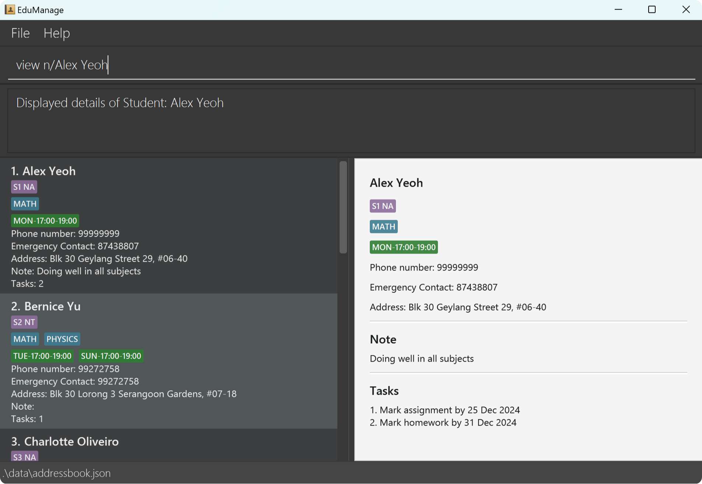

# EduManage User Guide

EduManage is a **desktop app for managing contacts, optimized for use via a Command Line Interface** (CLI) while still having the benefits of a Graphical User Interface (GUI). If you can type fast, EduManage can get your contact management tasks done faster than traditional GUI apps.

<!-- * Table of Contents -->
<page-nav-print />

- [Quick Start](#quick-start)
- [Command Summary](#command-summary)
- [Features](#features)
    * [Notes on the Command Format](#notes-on-the-command-format)
    * [Adding a Student](#adding-a-student)
    * [Deleting a Student](#deleting-a-student)
    * [Updating a Student](#updating-a-student)
    * [Finding Students](#finding-students)
    * [Listing All Students](#listing-all-students)
    * [Tagging a Student](#tagging-a-student)
    * [Recording Notes](#recording-notes)
    * [Clearing All Contacts](#clearing-all-contacts)
    * [Viewing Help](#viewing-help)
    * [Adding a Task](#adding-a-task)
    * [Deleting a Task](#deleting-a-task)
    * [Updating a Task](#updating-a-task)
    * [Viewing All Tasks](#viewing-all-tasks)
    * [Viewing a Specific Student](#viewing-a-specific-student)
    * [Exiting EduManage](#exiting-edumanage)
    * [Saving the Data](#saving-the-data)
    * [Editing the Data File](#editing-the-data-file)
- [FAQ](#faq)
- [Known Issues](#known-issues)

--------------------------------------------------------------------------------------------------------------------

## Quick Start

1. Ensure you have Java `17` or above installed in your Computer.

1. Download the latest `.jar` file from [here](https://github.com/AY2425S1-CS2103T-W08-3/tp/releases).

1. Copy the file to the folder you want to use as the _home folder_ for EduManage.

1. Open a command terminal, `cd` into the folder you put the jar file in, and use the `java -jar EduManage.jar` command to run the application. 
   A GUI similar to the below should appear in a few seconds. Note how the app contains some sample data. 
   

1. Type the command in the command box and press Enter to execute it. e.g. typing **`help`** and pressing Enter will open the help window. 
   Some example commands you can try:

   * `list` : Lists all contacts.

   * `add n/John Doe p/98765432 e/99999999 a/John street, block 123, #01-01` : Adds a contact named `John Doe` to the Address Book.

   * `delete 3` : Deletes the 3rd contact shown in the current list.

   * `clear` : Deletes all contacts.

   * `exit` : Exits the app.

1. Refer to the [Features](#features) below for details of each command.

--------------------------------------------------------------------------------------------------------------------

## Command summary

| Index |        Action         |                                                        Format                                                        |                                           examples                                            |
|:-----:|:---------------------:|:--------------------------------------------------------------------------------------------------------------------:|:---------------------------------------------------------------------------------------------:|
|   1   |          Add          |         `add n/NAME p/PHONE_NUMBER e/EMERGENCY_CONTACT a/ADDRESS [l/LEVEL] [s/SUBJECT]…​ [lt/LESSON_TIME]…​`         | `add n/James Ho p/22224444 e/99999999 a/123, Clementi Rd, 1234665 l/S1 NT s/MATH s/CHEMISTRY` |
|   2   |        Delete         |                                                   `delete i/INDEX`                                                   |                                         `delete i/2`                                          |
|   3   |        Update         | `update NAME [n/NAME] [p/PHONE_NUMBER] [e/EMERGENCY_CONTACT] [a/ADDRESS] [l/LEVEL] [s/SUBJECT]…​ [lt/LESSON_TIME]…​` |                           `update Alex Yeoh n/James Lee e/99999999`                           |
|   4   |         Find          |                        `find n/KEYWORD [MORE_KEYWORDS]` or `find l/LEVEL` or `find s/SUBJECT`                        |                       `find n/Alex` or `find l/S2 NA` or `find s/MATH`                        |
|   5   |         List          |                                                        `list`                                                        |                                            `list`                                             |
|   6   |          Tag          |                                          `tag n/NAME [l/LEVEL] [s/SUBJECT]`                                          |                                `tag n/John Doe l/S1 NT s/MATH`                                |
|   7   |         Note          |                                                `note n/NAME nt/NOTES`                                                |                        `note n/John Doe nt/Doing well in all subjects`                        |
|   8   |         Clear         |                                                       `clear`                                                        |                                            `clear`                                            |
|   9   |         Help          |                                                        `help`                                                        |                                            `help`                                             |
|  10   |       Add Task        |                                          `addtask n/NAME t/TASK d/DEADLINE`                                          |                         `addtask n/John Doe t/Mark CA1 d/2024-10-15`                          |
|  11   |      Delete Task      |                                          `deletetask n/NAME ti/TASK_INDEX`                                           |                                 `deletetask n/John Doe ti/1`                                  |
|  12   |      Update Task      |                                  `updatetask n/NAME ti/INDEX [t/TASK] [d/DEADLINE]`                                  |                        `updatetask n/Joht Doe ti/2 t/Mark assignment`                         |
|  13   |    View All Tasks     |                                                     `viewtasks`                                                      |                                          `viewtasks`                                          |
|  14   | View Specific Student |                                                    `view n/NAME`                                                     |                                       `view n/John Doe`                                       |
|  15   |         Exit          |                                                        `exit`                                                        |                                            `exit`                                             |

--------------------------------------------------------------------------------------------------------------------

## Features

<box type="info" seamless>

### Notes on the Command Format

* Words in `UPPER_CASE` are the parameters to be supplied by the user. 
  e.g. in `add n/NAME`, `NAME` is a parameter which can be used as `add n/John Doe`.

* Names with multiple spaces are treated as if they contain a single space, and names are not case-sensitive. 
  e.g. `alex yeoh` and `Alex  yeoh` are the same as `Alex Yeoh`.

* Items in square brackets are optional. 
  e.g `n/NAME [s/SUBJECT]` can be used as `n/John Doe s/MATH` or as `n/John Doe`.

* Items with `…`​ after them can be used multiple times including zero times. 
  e.g. `[s/SUBJECT]…​` can be used as ` ` (i.e. 0 times), `s/MATH`, `s/MATH s/PHYSICS` etc. 
  e.g. `[lt/LESSON_TIME]…​` can be used as ` ` (i.e. 0 times), `lt/SUN-11:00-13:00`, `lt/SUN-11:00-13:00 lt/WED-17:00-19:00` etc.

* `lt/LESSON_TIME` must follow the format:`lt/day-start-end` 
  e.g. `lt/SUN-13:00-15:00`
  * Acceptable values for `day` are `MON`, `TUE`, `WED`, `THU`, `FRI`, `SAT`, `SUN`.
  * `start` must be in `HH:MM`, `HH` must be between 0 and 23 inclusive, `MM` must be between 0 and 59 inclusive.
  * `end` must be in `HH:MM`, `HH` must be between 0 and 23 inclusive, `MM` must be between 0 and 59 inclusive, and `end` must be later than `start`.

* Parameters can be in any order. 
  e.g. if the command specifies `n/NAME p/PHONE_NUMBER`, `p/PHONE_NUMBER n/NAME` is also acceptable.

* Extraneous parameters for commands that do not take in parameters (such as `help`, `list`, `exit` and `clear`) will be ignored. 
  e.g. if the command specifies `help 123`, it will be interpreted as `help`.

* If you are using a PDF version of this document, be careful when copying and pasting commands that span multiple lines as space characters surrounding line-breaks may be omitted when copied over to the application.
</box>

***

### Adding a Student

Adds a student to the address book.

**Format:** `add n/NAME p/PHONE_NUMBER e/EMERGENCY_CONTACT a/ADDRESS [l/LEVEL] [s/SUBJECT]…​ [lt/LESSON_TIME]…​`

<box type="tip" seamless>

**Tip:** A student can have any number of subjects (including 0)
</box>

**Examples:**
* `add n/John Doe p/98765432 e/99999999 a/John street, block 123, #01-01`
* `add n/Betsy Crowe s/MATH e/88888888 a/Newgate Prison p/1234567 l/S1 NA s/ENGLISH`

***

### Deleting a Student

Deletes the specified student from the address book.

**Format:** `delete i/INDEX`

* Deletes the student at the specified `INDEX`.
* The index refers to the index number shown in the displayed student list.
* The index **must be a positive integer** 1, 2, 3, …​

**Examples:**
* `list` followed by `delete 2` deletes the 2nd student in the address book.
* `find n/Betsy` followed by `delete 1` deletes the 1st student in the results of the `find` command.

***

### Updating a Student

Updates the details of an existing student in the address book.

**Format:** `update NAME [n/NAME] [p/PHONE] [e/EMERGENCY_CONTACT] [a/ADDRESS] [l/LEVEL] [s/SUBJECT]…​ [lt/LESSON_TIME]…​`

* Updates the student with the specified `NAME`. The name refers to the full name shown in the displayed student list.
* At least one of the optional fields must be provided.
* Existing values will be updated to the input values.
* When updating subjects, the existing subjects of the student will be removed i.e adding of subjects is not cumulative.
* You can remove all the student’s subjects by typing `s/` without specifying any subjects after it.

**Examples:**
*  `update Alex Yeoh p/91234567 e/99999999` updates the phone number and emergency contact of `Alex Yeoh` to be `91234567` and `99999999` respectively.
*  `update Alex Yeoh n/Betsy Crower s/` updates the name of `Alex Yeoh` to be `Betsy Crower` and clears all existing subjects.

***

### Finding Students

Find students by either their name, level or subject.

**Format:**
1. `find n/KEYWORD [MORE_KEYWORDS]`
1. `find l/LEVEL`
1. `find s/SUBJECT`

* The search is case-insensitive. e.g `hans` will match `Hans`
* The order of the keywords does not matter. e.g. `Hans Bo` will match `Bo Hans`
* Students matching at least one keyword will be returned (i.e. `OR` search).
  e.g. `Hans Bo` will return `Hans Gruber`, `Bo Yang`

**Examples:**
* `find n/John` returns `john` and `John Doe`
* `find l/S3 NA` returns all students tagged with level `S3 NA`
* `find s/MATH` returns all students tagged with subject `MATH`
* `find n/alex david` returns `Alex Yeoh`, `David Li` 
  

***

### Listing All Students

Shows a list of all students in the address book.

**Format:** `list`

***

### Tagging a Student

Allows tagging a student by their level and subject. A student must have a level assigned before they can be tagged with a subject.

**Format:** `tag n/NAME [l/LEVEL] [s/SUBJECT]…​`
* To tag multiple subjects, use the format `s/FIRST_SUBJECT s/SECOND_SUBJECT ...`

**Examples:**
* `tag n/John Doe l/S3 NA s/ENGLISH`
* `tag n/Jane Smith s/MATH` only works if `Jane Smith` has a `level` assigned previously

***

### Recording Notes

Records a note for the specified student.

**Format:** `note n/NAME nt/NOTES`

**Examples:**
* `note n/John Doe nt/Doing well in all subjects`
* `note n/Jane Smith nt/Struggling with trigonometry`

***

### Clearing All Contacts

Clears all entries from the address book.

**Format:** `clear`

***

### Viewing Help

Shows a message explaining how to access the help page.

**Format:** `help`

***

### Adding a Task

Adds a task to the task list of the specified student.

**Format:** `addtask n/NAME t/TASK d/DEADLINE`

* Deadline must be a valid date in the format of YYYY-MM-DD

**Examples:**
* `addtask n/John Doe t/Mark CA1 d/2024-10-15`
* `addtask n/Jane Smith t/Handle MC d/2024-02-13`

***

### Deleting a task

Deletes a task from the specified student's task list.

**Format:** `deletetask n/NAME ti/TASK_INDEX`

**Examples:**
* `deletetask n/John Doe ti/1`

***

### Updating a Task

Updates the details of an existing task in a student's task list.

**Format:** `updatetask n/NAME ti/INDEX [t/TASK] [d/DEADLINE]`
* The task index refers to the index number shown in the student's task list.
* The task index **must be a positive integer** 1, 2, 3, …​
* At least one of the optional fields must be provided.
* Existing values will be updated to the input values.

**Examples:**
* `updatetask n/John Doe ti/2 t/Mark assignment` updates the 2nd task in John Doe's task list to be `Mark assignment`
* `updatetask n/Jane Smith ti/1 t/Handle MC d/2024-10-13` updates the 1st task in Jane Smith's task list to be `Handle MC` with a deadline `2024-10-13`

***

### Viewing all tasks

Views all tasks, organized by student.

**Format:** `viewtasks`

***

### Viewing a Specific Student

Views a specific student on the right side window.

**Format:** `view n/NAME`

**Examples:**
* `view n/Alex Yeoh`

***

### Exiting EduManage

Exits EduManage.

**Format:** `exit`

***

### Saving the Data

EduManage data are saved in the hard disk automatically after any command that changes the data. There is no need to save manually.

***

### Editing the Data File

EduManage data are saved automatically as a JSON file `[JAR file location]/data/addressbook.json`. Advanced users are welcome to update data directly by editing that data file.

<box type="warning" seamless>

**Caution:**
If your changes to the data file makes its format invalid, EduManage will discard all data and start with an empty data file at the next run.  Hence, it is recommended to take a backup of the file before editing it. 
Furthermore, certain edits can cause the EduManage to behave in unexpected ways (e.g., if a value entered is outside the acceptable range). Therefore, edit the data file only if you are confident that you can update it correctly.
</box>

--------------------------------------------------------------------------------------------------------------------

## FAQ

**Q**: How do I transfer my data to another Computer? 
**A**: Install the app in the other computer and overwrite the empty data file it creates with the file that contains the data of your previous EduManage home folder.

--------------------------------------------------------------------------------------------------------------------

## Known issues

1. **When using multiple screens**, if you move the application to a secondary screen, and later switch to using only the primary screen, the GUI will open off-screen. The remedy is to delete the `preferences.json` file created by the application before running the application again.
2. **If you minimize the Help Window** and then run the `help` command (or use the `Help` menu, or the keyboard shortcut `F1`) again, the original Help Window will remain minimized, and no new Help Window will appear. The remedy is to manually restore the minimized Help Window.

--------------------------------------------------------------------------------------------------------------------
[(Back to top)](#edumanage-user-guide)
