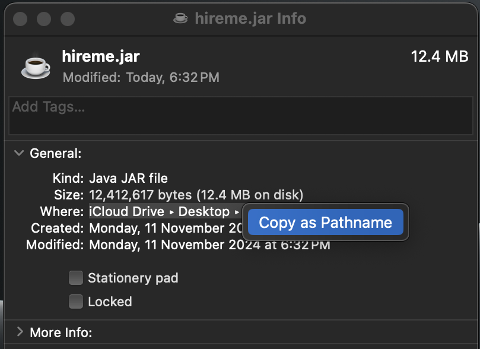
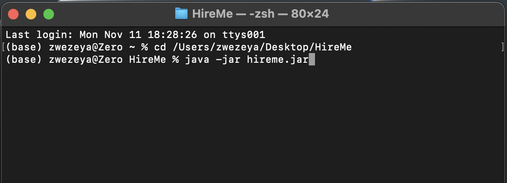

#  HireMe User Guide

## Welcome to HireMe! 

Thank you for choosing **HireMe** to simplify your internship journey.
With so many positions to apply for, managing applications becomes a real challenge, on top of classes, projects, and exams.
**HireMe** is here to keep you organised and focused on landing your dream internship.
Let's dive in and make your internship search a little easier!

**_Use HireMe to get hired now!_**
  

## Overview of User Guide

HireMe is a **free desktop application that helps you manage your extensive list of internship applications.** 

* _Easy to use_
  - **Type simple commands:** If you can type fast, HireMe can get your internship tracking tasks done faster than traditional apps.
* _User friendly interface_
  - **Simple design:** View all your internship applications and statuses at a glance.
* _Streamlining management_
  - **Core features:** Add, delete and find entries.
  - **Advanced features:** Update status, sort, filter by status and view chart. 
* _Detailed insights_
  - **Tailored summary**: Gain hidden insights from your list of internship applications.

  
### Table of Contents
<!-- TOC -->
  * [Welcome to HireMe!](#welcome-to-hireme)
  * [Overview of User Guide](#overview-of-user-guide)
  * [Overview of target users](#overview-of-target-users)
  * [How to use our User Guide](#how-to-use-our-user-guide)
  * [Quick start](#quick-start)
    * [Part 1: Setting up and downloading HireMe](#part-1-setting-up-and-downloading-hireme)
    * [Part 2: Using the HireMe application](#part-2-using-the-hireme-application)
      * [Mac Users](#mac-users)
      * [Windows Users](#windows-users)
      * [Using the terminal](#using-the-terminal)
      * [Using the HireMe application](#using-the-hireme-application)
  * [Features](#features)
    * [Viewing help : `/help`](#viewing-help-help)
    * [Adding an internship application: `/add`](#adding-an-internship-application-add)
    * [Listing all internship applications : `/list`](#listing-all-internship-applications-list)
    * [Deleting an internship application : `/delete`](#deleting-an-internship-application-delete)
    * [Finding applications by company name: `/find`](#finding-applications-by-company-name-find)
    * [Updating the status of an internship application: `/accept`, `/pending`, `/reject`](#updating-the-status-of-an-internship-application-accept-pending-reject)
    * [Filtering internship applications by status: `/filter`](#filtering-internship-applications-by-status-filter)
    * [Sorting internship applications: `/sort`](#sorting-internship-applications-sort)
    * [Clearing all entries : `/clear`](#clearing-all-entries-clear)
    * [Viewing status chart: `/chart`](#viewing-status-chart-chart)
    * [Exiting the program : `/exit`](#exiting-the-program-exit)
    * [Saving the data](#saving-the-data)
  * [FAQ](#faq)
  * [Troubleshooting](#troubleshooting)
      * [HireMe application setup failed](#hireme-application-setup-failed)
      * [Getting errors when using the commands](#getting-errors-when-using-the-commands)
      * [Unable to see the full text on the screen](#unable-to-see-the-full-text-on-the-screen)
  * [Known Issues](#known-issues)
  * [Command summary](#command-summary)
  * [Glossary](#glossary)
  * [Acknowledgements](#acknowledgements)
<!-- TOC -->

--------------------------------------------------------------------------------------------------------------------

## Overview of target users

If you’re a Computer Science undergraduate who **doesn’t have much time**, can **type quickly**, and wants to **better manage your internship applications**, HireMe is the perfect solution for you! Tracking internship applications can sometimes be troublesome and time-consuming. We understand the importance of tracking, as it allows you to follow up on your applications. That’s why we created HireMe to help you **stay organized without much effort**, knowing that you may be busy with coursework. Let’s get you started with HireMe.

--------------------------------------------------------------------------------------------------------------------
## How to use our User Guide

First time using **HireMe**? Don't worry! We've got you covered! This tutorial will help maximise your usage of **HireMe**.
* To get started, refer to the [Quick Start](#quick-start), which will walk you through getting **HireMe** all set up!
* Need a quick refresher of the commands available for you? Check out our [Command Summary](#command-summary)!
* Is there a burning question you want answers for? The [FAQ](#faq) might have the answer.

Before continuing, here are some important information you need to know about the User Guide:
1. There are two different kinds of boxes that provide extra information.
    * *Note boxes* provide important information that you should take note of.

      <box type="info" seamless>
      
      **Note:** This is a Note box.
      </box>

    * *Warning boxes* provide a warning about certain errors that might occur as a precaution for incorrect usage.

      <box type="warning" seamless>

      **Warning:** This is a warning box.
      </box>

2. Refer to [Features](#features) for detailed explanations of each feature of **HireMe**!

--------------------------------------------------------------------------------------------------------------------

## Quick start
This section has two parts: complete [Part 1](#part-1-setting-up-and-downloading-hireme) **once**, and **repeat** [Part 2](#part-2-using-the-hireme-application) **each time** you wish to use HireMe.

### Part 1: Setting up and downloading HireMe
1. Ensure that you have Java `17` or above installed on your computer for the hireme application to run. If not, download the latest version of Java from their [website](https://www.oracle.com/sg/java/technologies/downloads/).

2. Download `hireme.jar` file from our [GitHub](https://github.com/AY2425S1-CS2103T-W09-3/tp/releases/tag/v1.6).

    

3. Create a new folder and name it any name you want (e.g. HireMe).

4. Find the downloaded `hireme.jar` file and drag it into the folder you created in step 3.  

    

  
### Part 2: Using the HireMe application
For steps 5 and 6, refer to **either** [Mac Users](#mac-users) **or** [Windows Users](#windows-users) section that matches your computer system.
Continue to [Using the terminal](#using-the-terminal) after completing steps 5 and 6.
  
#### _Mac users_
5. Use Mac's spotlight search (Command + Space bar) and type Terminal, click on open. 

      
   
    You will see a window like this.  

    
    

6. Click into the folder created in step 3. Right click on the `hireme.jar` file and select `Get Info`.  

   
      
    On the new window that pops up, right click on `Where` and copy the file path.

   
     

#### _Windows users_
5. Use Windows' search and type Terminal, click on `Open`. 

   
  
You will see a window like this.  

   

6. Click into the folder created in step 3. Click on the empty space of the bar located at the top and copy the file path. 

   
   <box type="info" seamless>
   <strong>Note:</strong> File path here is highlighted in blue
   </box>
     

#### _Using the terminal_
7. Type `cd FILEPATH`  (replacing FILEPATH with the actual file path copied in step 6) and press `Enter`.

8. Type `java -jar hireme.jar` and press `Enter` to run the HireMe application.
  
   - Windows Terminal:  
   
      
       
   - Mac Terminal:  
   
      
  

#### _Using the HireMe application_
A GUI similar to the one below should appear in a few seconds. It is encouraged to **expand the window to full screen** for better viewability. Note how the app contains some sample data. 

   

9. Type the command in the command box and press `Enter` to execute it. (e.g. typing **`/help`** and pressing `Enter` will open the help window.)  
   Some example commands you can try:

    * `/add n/Google r/Software Engineer Intern e/google@gmail.com d/16/09/24`: Adds an internship application at Google to the list of added entries.

    * `/delete 1` : Deletes the first internship application shown in the displayed list.

    * `/list` : Lists all your internship applications.

    * `/clear` : Deletes all your internship applications.

    * `/chart` : Shows a pie chart with your applications' statistics.

    * `/exit` : Exits the app.

Refer to the [Features](#features) below for more details of each command.  
Refer to [Troubleshooting](#troubleshooting) if you are facing problems for setting up.

--------------------------------------------------------------------------------------------------------------------

## Features

<box type="info" seamless>

#### Notes about the command format:

* Parameters can be in any order. 
  e.g. if the command specifies `n/NAME r/ROLE`, `r/ROLE n/NAME` is also acceptable.

* Extraneous parameters for commands that do not take in parameters (such as `/help`, `/list`, `/exit`, `/clear` and `/chart`) are not permitted. 
  e.g. if the command specifies `/help 123` instead of `/help`, an "Invalid command format!" error message will be shown.

* Command names must be in **lowercase only**. 
  e.g. `/list` is acceptable but `/List` and `/LIST` are not.

</box>

  
### Viewing help: `/help`

Shows a message explaining how you can access the help page.

Format: `/help`

  

### Adding an internship application: `/add`

Adds your internship application to HireMe with required details such as company's name, internship role, email and date of application.

Format: `/add n/COMPANY_NAME r/ROLE e/EMAIL d/DATE`

* `NAME` can only contain alphanumeric or special characters like `_`,`&`,`/`,`.`,`:`,`(`, and `)`.
* `ROLE` can only contain alphanumeric or `/`.
* `EMAIL` must be a [valid email address](#faq).
* The `DATE` must be within the year 2000 and the current year. It also cannot be a future date which means that the date used must be before today or today's date.
* It must be in the format `dd/mm/yy`, and each field must be double digits (e.g. 01 is valid while 1 is not)

Examples:
* `/add r/Data Scientist Intern n/Facebook e/fb@example.com d/21/10/24`
* `/add n/Google r/Software Engineer Intern e/google@gmail.com d/01/01/24`

These are the before and after images of the second example

  
  

<box type="info" seamless>
<strong>Note:</strong> HireMe identifies an entry as a duplicate if its <em>NAME</em>, <em>ROLE</em>, <em>EMAIL</em> and <em>DATE</em> match <strong>(case-insensitive)</strong> with those of an existing internship application entry. Attempting to add a duplicate will result in an error.
</box>

  

### Listing all internship applications: `/list`

Shows a list of all of your internship applications in HireMe.

Format: `/list`

  

### Deleting an internship application: `/delete`

Deletes the specified internship application from HireMe.

Format: `/delete INDEX`

* Deletes the internship application at the specified `INDEX`.
* The `INDEX` refers to the index number shown in the displayed internship application list.
* The `INDEX` **must be a positive integer** 1, 2, 3, …​
* The `INDEX` **must be a valid index number** (e.g. 5 is not valid when there is less than five applications in the displayed list).

Examples:
* `/list` followed by `/delete 2` deletes the second application in the list.
* `/find Google` followed by `/delete 1` deletes the first application in the results of the `/find` command.
* `/list` followed by `/delete 4` when you only have three internship applications returns an error message.

These are the before and after images of the first example

  
  

  

### Finding applications by company name: `/find`

Finds all of your applications whose company names contains words that starts with the specified characters.

Format: `/find KEYWORD [ADDITIONAL_KEYWORDS]`

* The search is **case-insensitive**. e.g. `goo` will match `Google`.
* The search is **only for company names**.
* The search uses **prefix search**.
* The search allows for **more than one** `KEYWORD`
* If you search for `go`, then you will see a list of all the internship applications that you have applied for
  whose companies have words starting with `go` in their names.

Examples:
* `/find Goo` returns `Google` and `Google 2`
* `/find face` returns `Facebook`
* `/find app` returns `Apple`, but not `CashApp`
* `/find young` returns `Ernest & Young`
* `/find amaZoN NetFlix` returns `Amazon` and `Netflix`

These are the before and after images of the last example

  
  

  

### Updating the status of an internship application: `/accept`, `/pending`, `/reject`

Use these commands to update the status of a specified internship application to `ACCEPTED`, `PENDING`, or `REJECTED`.

Format: `/accept INDEX`, `/reject INDEX`, `/pending INDEX`

* `/accept INDEX`: Changes the status of the application at index `INDEX` in the displayed list to `ACCEPTED`.
* `/pending INDEX`: Changes the status of the application at index `INDEX` in the displayed list to `PENDING`.
* `/reject INDEX`: Changes the status of the application at index `INDEX` in the displayed list to `REJECTED`.
*  The `INDEX` refers to the position of an application in the displayed list.
* `INDEX` **must be a positive integer** (e.g., 1, 2, 3, …).
* `INDEX` **must be a valid number** for the displayed list length (e.g., `/reject 5` is invalid if there are fewer than five applications in the displayed list).

**Important:** Commands like `/accept`, `/pending`, and `/reject` work on the displayed list, not the entire application database. For example, if you have ten total applications, but after using `/filter ACCEPTED` only five applications are shown, then `/reject 5` will target the last item on this filtered list.

Examples:
1. `/list` followed by `/accept 2`: Changes the status of the second application in the displayed list to `ACCEPTED`.
2. `/pending 3`: Changes the status of the third application in the currently displayed list to `PENDING`.
3. `/reject 1`: Changes the status of the first application in the currently displayed list to `REJECTED`.
4. `/filter PENDING` followed by `/accept 1`: Updates the status of the first application on the filtered list (currently `PENDING`) to `ACCEPTED`, removing it from the list view as it no longer matches the `PENDING` filter.
5. `/list` followed by `/accept 4` when there are only three internship applications returns an error message.

These are the before and after images of the first example

  
  

<box type="info" seamless>
<strong>Note:</strong> You can update an application’s status to its current state. For example, using <em>/accept INDEX</em> on an already accepted application will keep its status as <em>ACCEPTED</em>, <em>/pending INDEX</em> on a pending application will keep it as <em>PENDING</em>, and <em>/reject INDEX</em> on a rejected application will maintain its <em>REJECTED</em> status.
</box>

  

### Filtering internship applications by status: `/filter`

Filters all of your existing internship applications with specified status.

Format: `/filter STATUS`

* Valid statuses are `pending`, `accepted` or `rejected` only.
* The status is **case-insensitive**. (e.g. `"pending"`, `"PenDiNg"` and `"PENDING"` are all allowed.)

Examples:
* `/filter pending` displays all the internship applications that have a status of pending.
* `/filter accepted` displays all the internship applications that have a status of accepted.
* `/filter rejected` displays all the internship applications that have a status of rejected.

These are the before and after images of the second example

  
  

  

### Sorting internship applications: `/sort`

Sorts your internship applications in **ascending / descending** order based on the date of application.

Format: `/sort ORDER`

* There are only two orders that are valid: `earliest` or `latest` only.
* The order is **case-insensitive**. (e.g. `"earliest"`, `"eaRLiEsT"` and `"EARLIEST"` are all allowed.)
* Once you sort the list, even if you exit the application and reopen it, the list remains sorted unless you add more internship applications.
* Even if you find or filter the list, sorting it afterwards will also sort the entire main list.

Examples:
* `/sort earliest` displays the internship application list sorted according to the earliest applications first.
* `/sort latest` displays the internship application list sorted according to the latest applications first.

These are the before and after images of the first example

  
  

  

### Clearing all entries: `/clear`

Clears all of your internship application entries from the HireMe application.

<box type="warning" seamless>

**Warning:**
This removes all the internship applications that you have been tracking. You will not be able to revert and get back your saved data once this command is executed.
</box>

Format: `/clear`

  

### Viewing status chart: `/chart`

</img>
  
Opens a new window that displays a pie chart with summary data of the statuses of all of your internship applications.

Format: `/chart`

  

### Exiting the program: `/exit`

Exits the HireMe application.

Format: `/exit`

  

### Saving the data

HireMe data are saved in the hard disk automatically after any command that changes the data. There is no need for you to save manually.

--------------------------------------------------------------------------------------------------------------------

## FAQ
Get your questions or doubts about HireMe's functionality and details answered here. If you have further questions, you can contact us through our email `hireme@gmail.com`.

#### Q1: Where is the data for the application stored?
Ans: HireMe's data is saved automatically as a JSON file `[JAR file location]/data/hireme.json`. You can make a backup of the file if you wish to.
  

#### Q2: Can I edit the data file directly?
Ans: You are strongly encouraged to **not** edit the JSON data file directly. You can use the commands as mentioned above to augment any data.
Should the changes made to the data file cause the format to be invalid, HireMe will discard all data and start with an empty data file.
It is highly recommended to make a copy of the data file before editing it.  

Users should only edit the data file only if they are confident in updating it correctly.
  

#### Q3: What is considered valid, when editing the JSON data file directly?
Ans: Data entries are valid, if they are achievable through a sequence of commands.  

Examples:  
Having `30/02/24` is an invalid `dateString` field for an application, as there is no sequence of commands that will lead to an application having the respective date. 

Having `REJECTED` is a valid `statusString` field for an application, as the user can `/add` an internship and update the status via `/reject`.
  

#### Q4: Can I find followed by filter to filter out the applications with a specific keyword?
Ans: Currently, `/find` and `/filter` do not stack. These commands will find or filter based on all of your internship application entries.
  

#### Q5: After I sort my internship applications, will a new entry be added in the right order automatically?
Ans: New entries will not be inserted in the right order. They are inserted to the bottom of the list.
  

#### Q6: Will adding / deleting new entries or changing the statuses of existing entries be reflected in the pie chart?
Ans: Yes! You are not required to close the window. Any changes made will be reflected immediately in the pie chart.
  

#### Q7: What is considered a valid email address format?
Ans: If you have an existing email address account, it will be allowed by HireMe. You can check [here](https://verifalia.com/validate-email).

--------------------------------------------------------------------------------------------------------------------
## Troubleshooting
If you are facing problems while setting up or using HireMe, we want to help you. This section covers some of the common problems and ways to solve them. If you need further help, you can reach out to us through our email `hireme@gmail.com`.
  

#### HireMe application setup failed
Check that you have the `hireme.jar` in the correct folder and copied the correct file path into the terminal. Check that you have Java `17` or above downloaded in your computer. Follow the correct set of instructions based on your computer system, see [Part 2](#part-2-using-the-hireme-application) of setting up.
  

#### Getting errors when using the commands
Check that you have the typed the correct [command format](#notes-about-the-command-format). Check that you have included all necessary parameters. Check that you have used valid inputs (refer to each command for valid inputs).
  

#### Unable to see the full text on the screen
Try opening the window to full screen or scroll to view the full text. Avoid inputting texts that are too lengthy.

--------------------------------------------------------------------------------------------------------------------

## Known Issues

1. If the user opens the application on a first monitor, then moves the application window to a second monitor and closes the application, then when the user tries to open the application again, the application would not work after opening. The current work around is that the user will then have to move the application window back to the first monitor for the application to work.

--------------------------------------------------------------------------------------------------------------------

## Command summary

Action     | Format, Examples
-----------|----------------------------------------------------------------------------------------------------------------------------------------------------------------------
**Help**   | `/help`
**Add**    | `/add n/COMPANY_NAME r/ROLE e/EMAIL d/DATE`   e.g. `/add n/Google r/Software Engineer Intern e/google@gmail.com d/16/09/24`
**List**   | `/list`
**Delete** | `/delete INDEX`  e.g. `/delete 3`
**Find**   | `/find KEYWORD [ADDITIONAL_KEYWORDS]`  e.g. `/find Google Facebook`
**Accept** | `/accept INDEX`  e.g. `/accept 2`
**Pending**| `/pending INDEX`  e.g. `/pending 3`
**Reject** | `/reject INDEX`  e.g. `/reject 1`
**Filter** | `/filter STATUS`  e.g. `/filter pending`
**Sort**   | `/sort ORDER`  e.g. `/sort earliest`
**Clear**  | `/clear`
**Chart**  | `/chart`
**Exit**   | `/exit`

--------------------------------------------------------------------------------------------------------------------

## Glossary

Term     | Definition
-----------|----------------------------------------------------------------------------------------------------------------------------------------------------------------------
**Action**    | The task carried out by the HireMe application such as Add, Delete, Update entries. 
**Alphanumeric**    | Consisting of both letters and numbers. 
**Application Status**   | - **PENDING**: The internship application is currently in progress.   - **REJECTED**: The user has rejected or been rejected from this internship application.  - **ACCEPTED**: The user has accepted the offer for this internship.
**Command** | The input the user types into the HireMe application’s command bar to carry out a particular action.
**Command Bar** | The input bar at the top of the HireMe application which allows users to type in a string command.
**Company Email** | The email of the company that the user is applying for an internship role at.
**Company Name** | The name of the company that the user is applying for an internship role at.
**Command Line Interface (CLI)** | An interface that the user interacts with by typing text commands instead of using a mouse to click on buttons or icons. 
**Filepath** | The location through which a file can be accessed in a file system.
**Graphical User Interface (GUI)** | An interface that the user interacts with using visual elements like buttons, icons and windows.
**Index** | The application number of the internship application displayed in the list.
**Java** | A programming language for coding applications, websites and other software.
**Java Archive (Jar)** | A file format used to package multiple files into one file for distribution. 
**JavaScript Object Notation (JSON)** | A readable format to represent structured data, which is commonly used for web applications.
**Order** | The order that the user would like the list to be in, based on the date of application.
**Parameter** | The details needed to perform specific commands. (e.g. Add command has a parameter for company name) 
**Role** | The role of the internship the user applied for.
**Terminal** | A text-based interface for interacting with a computer. It allows users to execute commands and view the results.

--------------------------------------------------------------------------------------------------------------------

## Acknowledgements

We would like to acknowledge the following contributions:

We started with a general [AB3 user guide](https://se-education.org/addressbook-level3/UserGuide.html) template and adapted it to the functional requirements of HireMe. We also used [MarkBind](https://markbind.org/) which is a third party library to generate a dynamic user guide website from Markdown text.

AI tools such as ChatGPT were also used to check for grammatical errors.
