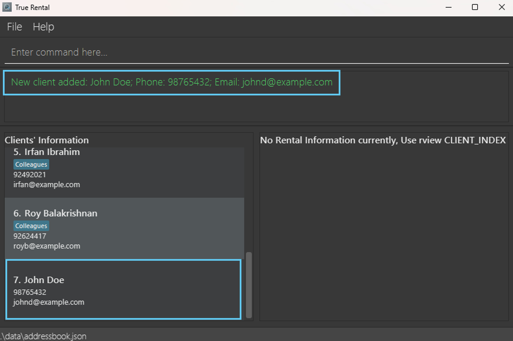
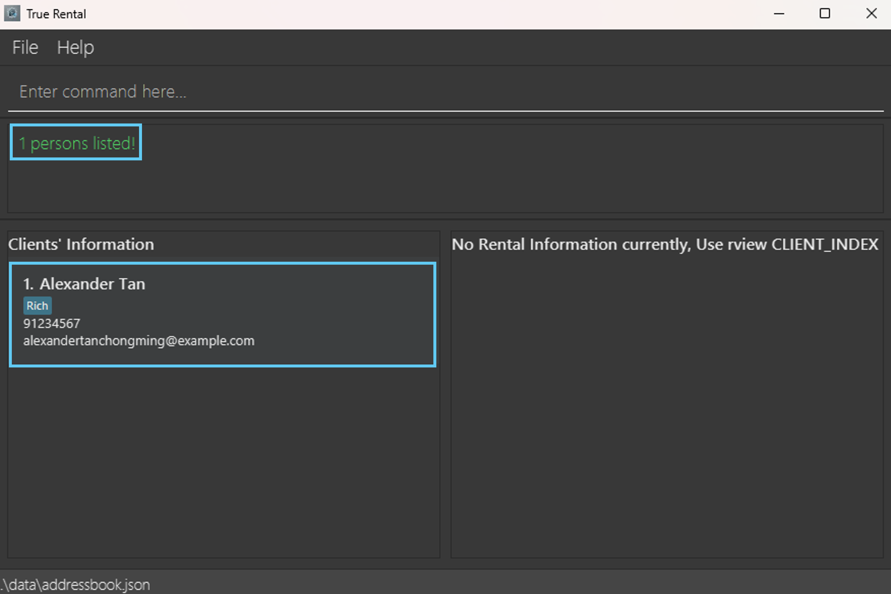

# TrueRental User Guide

TrueRental is a **desktop** application for managing your client details, **optimized** for use via a Command Line Interface (CLI) while still having the benefits of a Graphical User Interface (GUI). 

TrueRental prioritises **productivity** and **efficiency**.

TrueRental can get your client management tasks done **much faster** than traditional GUI apps, due to minimal mouse movements and distractions.

Our application allows you to perform multiple operations that suits your needs as a Letting Agent, such as:
1. Adding new clients
2. Updating existing clients
3. Removing outdated clients
4. Filtering clients based on needs
5. Import and Export client details

This project is built on top of [AddressBook-Level3 Project](https://se-education.org/). Special thanks and appreciation for the team of AddressBook-Level 3.

<!-- * Table of Contents -->
<page-nav-print />
<!--TODO: TOC -->
--------------------------------------------------------------------------------------------------------------------

## Quick Start

1. Ensure you have Java `17` or above installed in your Computer.

2. Download the latest `.jar` file from [here](https://github.com/AY2425S1-CS2103T-T15-1/tp/releases).

3. Copy the file to the folder you want to use as the _home folder_ for your TrueRental application.

4. Open a command terminal, `cd` into the folder you put the jar file in, and use the `java -jar truerental.jar` command to run the application. 
   <box type="info" seamless>
   Note: A GUI similar to the image below should appear in a few seconds. The image below consist of existing sample data. 
   </box>

   
5. Type the command in the command box and press Enter to execute it. E.g. Typing **`help`** in the command box and pressing enter will open the help window. 
   
6. Simple and Quick Tutorial:

   1. `cadd n/Steven Tan e/steventan@tutorial.com p/98765432`: Adds a client named `Steven Tan` to TrueRental with email `steventan@tutorial.com` and phone number `98765432`.
    
   2. `list`: Lists all clients. There should be 6 clients listed within the TrueRental application.

   3. `cdelete 3`: Deletes the 3rd client shown in the current list, namely client called `Charlotte Oliveiro`. 
   Enter `y`: Yes for confirmation to the operation.
   
   4. `clear`: Deletes every client and their associated rental information from TrueRental application. 
   Enter `y`: Yes for confirmation to the operation.

   5. `exit`: Exits the application.

<!--TODO: Screenshots of tutorial run down AFTER sample data has been updated in the application -->

7. Refer to the [Command Summary](#command-summary) for a quick overview of available commands.

8. Refer to the [Features](#features) for details of each command.

--------------------------------------------------------------------------------------------------------------------

## Important Notes

<box type="info" seamless>

**Notes about the command format:** 

* Words in `UPPER_CASE` are the parameters to be supplied by the user. 
  E.g. in `cadd n/NAME`, `NAME` is a parameter which can be used as `add n/John Doe`.

* Items without brackets are **mandatory**, you must provide a value. 
  E.g. `n/NAME` for `cadd`, `c/CLIENT_INDEX` and `a/ADDRESS` for `radd`.

* Items in square brackets `[]` are **mandatory** to have **at least one of them**, you should not use omit any of them in a command. 
  E.g `cedit` can be used as `cedit 1 n/Steven Tan e/steventan@abc.com p/98765432` or `cedit 1 n/Steven Tan p/98765432`.

* Items in curly brackets `{}` are **optional**, you may choose not to have them in your command. 
  E.g `radd` can be used as `radd c/1 a/BLK 123 Bishan` or `radd c/1 a/BLK 123 Bishan m/3500`.

* Items with `...`​ after them can be used multiple times. 
  E.g. `k/KEYWORDS` for `find` can be used as `find k/Steven Tan k/98765432` (2 times), `find k/98765432` (1 time), etc.

* Parameters can be in any order. 
  E.g. if the command specifies `n/NAME p/PHONE_NUMBER`, `p/PHONE_NUMBER n/NAME` is also acceptable.

* Extraneous parameters for commands that do not take in parameters (such as `help`, `list`, `exit`, 'sort' and `clear`) will be ignored. 
  E.g. if the command specifies `help 123`, it will be interpreted as `help`.

* If you are using a PDF version of this document, be careful when copying and pasting commands that span multiple lines as space characters surrounding line-breaks may be omitted when copied over to the application.

</box>

## Command Summary
<box type="info" seamless>

**Please refer to "Notes about the command format" in [Features](#features) for a better understanding of the command format.**

</box>

| Action                                                                                               | Format, Examples                                                                                                                                                                                                                     |
|------------------------------------------------------------------------------------------------------|--------------------------------------------------------------------------------------------------------------------------------------------------------------------------------------------------------------------------------------|
| [Show manual: **help**](#viewing-help-help)                                                          | `help`                                                                                                                                                                                                                               |
| [Add a client: **cadd**](#adding-a-client-cadd)                                                      | `cadd n/NAME [p/PHONE_NUMBER] [e/EMAIL]`   e.g., `cadd n/Steven Tan e/steventan@abc.com p/98765432`                                                                                                                               |
| [Add rental information for a client: **radd**](#adding-a-rental-information-for-a-client-radd)      | `radd c/CLIENT_INDEX a/ADDRESS {s/RENTAL_START_DATE} {e/RENTAL_END_DATE} {dd/RENT_DUE_DATE} {m/MONTHLY_RENT} {d/DEPOSIT} {cl/CUSTOMER_LIST}`   e.g., `radd c/3 a/65 Den Road s/2024-09-01 e/2025-08-30 c/Steven Lim dd/20 m/2750` |
| [List all clients: **list**](#listing-all-clients-list)                                              | `list`                                                                                                                                                                                                                               |
| [View rental information of a client: **rview**](#listing-rental-information-of-a-client-rview)      | `rview CLIENT_INDEX`   e.g., `rview 1`                                                                                                                                                                                            |
| [Edit a client: **cedit**](#editing-a-client-cedit)                                                  | `cedit CLIENT_INDEX [n/NAME] [p/PHONE_NUMBER] [e/EMAIL]`   e.g.,`cedit 1 n/Steven Tan e/steventan@abc.com p/98765432`                                                                                                             |
| [Edit rental information for a client: **redit**](#editing-a-client-s-rental-information-redit)      | `redit c/CLIENT_INDEX r/RENTAL_INDEX [a/ADDRESS] [s/RENTAL_START_DATE] [e/RENTAL_END_DATE] [dd/RENT_DUE_DATE] [m/MONTHLY_RENT] [d/DEPOSIT] [cl/CUSTOMER_LIST]`   e.g.,`redit c/1 r/1 a/65 Anderson Road m/3000 d/0`               |
| [Find information: **find**](#locating-clients-find)                                                 | `find [k/KEYWORDS...] [n/NAME...] [p/PHONE_NUMBER...] [e/EMAIL...] [t/TAG]...`  e.g., `find k/Tan n/Steven Tan p/98765432`                                                                                                        |
| [Delete a client: **cdelete**](#deleting-a-client-cdelete)                                           | `cdelete CLIENT_INDEX`   e.g., `cdelete 3`                                                                                                                                                                                        |
| [Delete rental information from a client: **rdelete**](#deleting-a-rental-information-rdelete)       | `rdelete c/CLIENT_INDEX r/RENTAL_INDEX`   e.g., `rdelete c/1 r/2`                                                                                                                                                                 |
| [Delete all clients and their associated rental information: **clear**](#clearing-all-entries-clear) | `clear`                                                                                                                                                                                                                              |
| [Import data from an external file: **import**](#importing-data-import)                              | `import`                                                                                                                                                                                                                             |
| [Export data to an external file: **export**](#exporting-data-export)                                | `export`                                                                                                                                                                                                                             |
| [Exit the application: **exit**](#exiting-the-application-exit)                                      | `exit`                                                                                                                                                                                                                               |

## Parameter Constraints
<!-- TODO: Parameter constraints table -->

--------------------------------------------------------------------------------------------------------------------
## Features

### Viewing help : `help`
<!--TODO: MAKE ALL DESCRIPTIONS BIGGER-->
Displays a message with a link that directs you to the TrueRental website.

Format: `help`

  

### Adding a client: `cadd`

Adds a client to TrueRental.

Format: `add n/NAME [p/PHONE_NUMBER] [e/EMAIL] [t/TAG]…​`

<box type="important" seamless>

**Constraints:** A client must have at least **either** **one phone number** or **one email address**.

</box>

<box type="tip" seamless>

<!--TODO: CLARIFY IF SHOULD WE CAP IN THE APP ITSELF? OR SHOULD WE LET IT BE "INFINITE" -->
**Tip:** A client can have any number of tags, ranging from 0 to infinity.

</box>

<box type="info" light>

**Example inputs**:
1. `cadd n/John Doe p/98765432 e/johnd@example.com`
2. `cadd n/Clarice Long e/claricelong@example.com`
3. `cadd n/Betsy Crowe e/betsycrowe@example.com t/North t/Friend`

</box>

<box type="success" light>

**Example outputs**:
1. `New client added: John Doe; Phone: 98765432; Email: johnd@example.com`
2. `New client added: Clarice Long; Email: claricelong@example.com`
3. `New client added: Betsy Crowe; Email: betsycrowe@example.com; Tags: [Friend] [North]`

</box>

  

### Adding a rental information for a client: `radd`

Adds a rental information for the specific client to TrueRental.

Format: `radd CLIENT_INDEX a/ADDRESS [s/RENTAL_START_DATE] [e/RENTAL_END_DATE] [dd/RENT_DUE_DATE] [m/MONTHLY_RENT] [d/DEPOSIT] [cl/CUSTOMER_LIST]`

<box type="important" seamless>

**Constraints:**
* The `CLIENT_INDEX` refers to the index number shown in the displayed client list and must be a positive integer starting from 1.
* The value of **address** for the rental information cannot be empty.

</box>

<box type="info" light>

**Example inputs**:
1. `radd 1 a/140 Robinson Road, #03-05, Chow House m/3200 dd/10 d/0`
2. `radd 1 a/Blk 26 Defu Lane 10 #01-190 e/31/10/2024 m/2350 dd/15`
3. `radd 3 a/25 Jalan Sempadan #02-06 s/01/09/2024 e/31/08/2025 cl/Steven Lim dd/20 m/2750 d/8250`

</box>

<box type="success" light>

**Example outputs**:
1. `New rental information is added to the client: Address: 140 Robinson Road, #03-05, Chow House; Rental Start Date: —; Rental End Date: —; Rent Due Date: 10; Monthly Rent: $3200.00; Deposit: $0.00; Customer List: —`
2. `New rental information is added to the client: Address: Blk 26 Defu Lane 10 #01-190; Rental Start Date: —; Rental End Date: 31 Oct 2024; Rent Due Date: 15; Monthly Rent: $2350.00; Deposit: —; Customer List: —`
3. `New rental information is added to the client: Address: 25 Jalan Sempadan #02-06; Rental Start Date: 01 Sep 2024; Rental End Date: 31 Aug 2025; Rent Due Date: 20; Monthly Rent: $2750.00; Deposit: $8250.00; Customer List: Steven Lim`

</box>

  

### Listing all clients : `list`

Displays a list of all clients within TrueRental in a table format.

Format: `list`

  

### Listing rental information of a client : `rview`

Displays a list of all rental information related to a specific client within TrueRental.

Format: `rview CLIENT_INDEX`

<box type="info" seamless>

**Note:** Displays all rental information related to the client at the specified `CLIENT_INDEX`.

</box>

<box type="important" seamless>

**Constraints:** The `CLIENT_INDEX` refers to the index number shown in the displayed client list and must be a positive integer starting from 1.

</box>

<box type="info" light>

**Example inputs**:
1. `rview 1`  
2. `rview 2`  

</box>

<box type="success" light>

**Example outputs**:
1. `4 rentals listed!`
2. `1 rental listed`

</box>

  

### Editing a client : `cedit`

Edits an existing client with TrueRental. The provided input will replace the existing input, subjected to the parameter constraints.
<!-- TODO: Hyperlink paramter constraints to the table at the top -->

Format: `cedit CLIENT_INDEX [n/NAME] [p/PHONE] [e/EMAIL] [t/TAG]…​`

<box type="important" seamless>

**Constraints:** 
* The `CLIENT_INDEX` refers to the index number shown in the displayed client list and must be a positive integer starting from 1.
* A client **name** cannot be empty.
* A client must have at least **either** **one phone number** or **one email address**.

</box>

<box type="tip" seamless>

**Tip:** 
* You can **remove** a client's existing phone number or email address by providing an empty input after `p/` or `e/` respectively.
* You can **remove** a client's existing tags by providing an empty input after `t/`.

</box>

<box type="info" light>

**Example inputs**:
1. `cedit 1 p/91234567 e/jasonlee@example.com` 
2. `cedit 2 n/Betsy Crower t/Twin` 
3. `cedit 3 p/`

</box>

<box type="success" light>

**Example outputs**:
1. `Edited Client: Jason Lee; Phone: 91234567; Email: jasonlee@example.com; Tags: [Rich]`
2. `Edited Client: Betsy Crower; Phone: 91231231; Email: alice@outlook.com; Tags: [Twin]`
3. `Edited Client: Brandon Tan; Email: brandontan@example.com`

</box>

  

### Editing a client's rental information: `redit`

Edits a specific client's rental information in the address book.

Format: `redit CLIENT_INDEX r/RENTAL_INDEX [a/ADDRESS] [s/RENTAL_START_DATE] [e/RENTAL_END_DATE] [dd/RENT_DUE_DATE] [m/MONTHLY_RENT] [d/DEPOSIT] [cl/CUSTOMER_LIST]`

<box type="important" seamless>

**Constraints:**
* The `CLIENT_INDEX` refers to the index number shown in the displayed client list and must be a positive integer starting from 1.
* The `RENTAL_INDEX` refers to the client's rental index number shown in the displayed rental information list (run `rview CLIENT_INDEX` to display the rental information list) and must be a positive integer starting from 1.
* The value of **address** for the rental information cannot be empty (if a/ is specified in the input).

</box>

<box type="tip" seamless>

**Tip:**
* You can **remove** the value of existing rental start date, rental end date, rent due date, monthly rent, deposit or customer list of the specified rental information by providing an empty value after `s/`, `e/`, `dd/`, `m/`, `d/` or `cl/` respectively.

</box>

<box type="info" light>

**Example inputs**:
1. `redit 1 r/1 a/10 North Bridge Rd #02-5125 m/3000 d/0`
2. `redit 1 r/2 e/31/12/2024 dd/1`
3. `redit 3 r/1 s/01/01/2025 e/ d/12000 cl/Tan Eng Heng`

</box>

<box type="success" light>

**Example outputs**:
1. `Edited Client's Rental Information: Address: 10 North Bridge Rd #02-5125; Rental Start Date: 01 Apr 2018; Rental End Date: 31 Dec 2024; Rent Due Date: 15; Monthly Rent: $3000.00; Deposit: $0.00; Customer List: Jackson;Yummi`
2. `Edited Client's Rental Information: Address: Blk 112 Bishan Ave 5, #15-521; Rental Start Date: 01 Jan 2019; Rental End Date: 31 Dec 2024; Rent Due Date: 1; Monthly Rent: $2700.00; Deposit: $8100.00; Customer List: Ryan Low;Matthew`
3. `Edited Client's Rental Information: Address: Blk 8 Hougang Ave 10, #11-2411; Rental Start Date: 01 Jan 2025; Rental End Date: —; Rent Due Date: 15; Monthly Rent: $1500.00; Deposit: $12000.00; Customer List: Tan Eng Heng`

</box>

  

### Locating clients: `find`

Finds clients whose names contain any of the given keywords, name, email, phone or tag.

Format: `find [k/KEYWORD]... [n/NAME]... [p/PHONE]... [e/EMAIL]... [t/TAG]...`

<box type="important" seamless>

**Constraints**: Must contain at least one of the optional fields.

</box>

<box type="info" seamless>

**Note:** Utilising the **keyword** will perform a search for all clients for the matching keyword throughout all attributes, including rental information.

</box>

<box type="tip" seamless>

**Tips:**
* The search is case-insensitive. e.g `hans` will match `Hans`.
* Substrings will be matched e.g. `Han` will match <code><b>Han</b>s</code>
* Persons matching at least one keyword will be returned (i.e. `OR` search).
    e.g. `k/Hans k/Bo` will return `Hans Gruber`, `Bo Yang`

</box>

<box type="info" light>

Example inputs:
1. `find n/Jason`
2. `find k/912`
3. `find n/Jason Lee p/91231231`

</box>

<box type="success" light>

Example outputs:
1. `3 persons listed!`. It will return every client with the name called `jason`.
2. `3 persons listed!`. It will return every client with the keyword `912` within all its attributes.
3. `3 persons listed!`. It will return every client with the name `Jason Lee` and phone number `91231231`.

</box>

  

### Deleting a client : `cdelete`

Deletes the specified client from TrueRental.

<!--TODO: Nathan-->

Format: `cdelete CLIENT_INDEX`

<box type="info" seamless>

**Note**: Confirmation required. Type `y` for **yes** and `n` for **no**.

</box>

* Deletes the client at the specified `CLIENT_INDEX` and all related rental information.
* The index refers to the index number shown in the displayed client list.
* The index **must be a positive integer** 1, 2, 3, …​

Examples:
* `list` followed by `cdelete 2` deletes the 2nd client in the address book.
* `find Betsy` followed by `cdelete 1` deletes the 1st client in the results of the `find` command.

  

### Deleting a rental information : `rdelete`

Deletes the specified rental information from the specified client

<!--TODO: Nathan-->

Format: `rdelete c/CLIENT_INDEX r/RENTAL_INDEX`

<box type="info" seamless>

**Note**: Confirmation required. Type `y` for **yes** and `n` for **no**.

</box>

* Deletes the rental information at the specified `RENTAL_INDEX` from the client at the specified `CLIENT_INDEX`.
* `CLIENT_INDEX` refers to the index number shown in the displayed client list.
* `RENTAL_INDEX` refers to the index number shown in the displayed rental information list when the `rview` command is run. (i.e. `rview CLIENT_INDEX`)
* `CLIENT_INDEX` and `RENTAL_INDEX` **must be positive integers** 1, 2, 3, …​

Examples:
* `list` followed by `rdelete c/2 r/1` deletes the 1st rental information from the 2nd client in the address book.
* `find Betsy` followed by `rdelete c/1 r/2` deletes the 2nd rental information from the 1st client in the results of the `find` command.

### Sorting all entries : `sort`

Sorts all entries from the address book according to name in alphabetical order.

Format: `sort`

<!--TODO: Bryan-->

  

### Clearing all entries : `clear`

Clears all entries from TrueRental.

Format: `clear`

<box type="info" seamless>

**Note**: Confirmation required. Type `y` for **yes** and `n` for **no**.

</box>

  

### Command History: `up arrow-key` and `down arrow-key`

Navigates through all previously entered commands.

1. Entering the `up arrow-key` will revisit the **previous** command in the command history.
2. Entering the `down arrow-key` will revisit the **next** command in the command history.

<box type="important" seamless>

**Constraints:** 
* If there are no more previous commands, it will display the last command within the command history in the command box.
* If there are no more next commands, it will display an empty command in the command box.

</box>

<box type="info" seamless>

**Note:** 
* All commands within the command history will be cleared upon exiting the TrueRental application.

</box>

<box type="info" light>

**Example inputs:** (Steps 1 to 6 are performed sequentially)
1. `cadd n/John Doe p/99887766 e/johndoe@example.com`
2. `radd 1 a/BLK 1 Bishan s/01/01/2024 e/31/12/2024 dd/15 m/2700 d/8100 cl/Steven;David`
3. `cadd n/Amy Tan p/99887766`
4. `rview 1`
5. `list`
6. `cdelete 2`

</box>

<box type="success" light>

**Example Outputs:** (Steps 1 to 13 are performed sequentially)
1. Step 1: Press up-arrow key on the keyboard. 
       Expected: `cdelete 2` is shown in the command box.
2. Step 2: Press up-arrow key on the keyboard. 
   Expected: `list` is shown in the command box.
3. Step 3: Press up-arrow key on the keyboard. 
   Expected: `rview 1` is shown in the command box.
4. Step 4: Press up-arrow key on the keyboard. 
   Expected: `cadd n/Amy Tan p/99887766` is shown in the command box.
5. Step 5: Press up-arrow key on the keyboard. 
   Expected: `radd 1 a/BLK 1 Bishan s/01/01/2024 e/31/12/2024 dd/15 m/2700 d/8100 cl/Steven;David` is shown in
   the command box.
6. Step 6: Press up-arrow key on the keyboard. 
   Expected: `cadd n/John Doe p/99887766 e/johndoe@example.com` is shown in the command box.
7. Step 7: Press up-arrow key on the keyboard. 
   Expected: `cadd n/John Doe p/99887766 e/johndoe@example.com` is still shown in the command box, because there
   are no more previous commands.
8. Step 8: Press down-arrow key on the keyboard. 
   Expected: `radd 1 a/BLK 1 Bishan s/01/01/2024 e/31/12/2024 dd/15 m/2700 d/8100 cl/Steven;David` is shown in
   the command box.
9. Step 9: Press down-arrow key on the keyboard. 
   Expected: `cadd n/Amy Tan p/99887766` is shown in the command box.
10. Step 10: Press down-arrow key on the keyboard. 
    Expected: `rview 1` is shown in the command box.
11. Step 11: Press down-arrow key on the keyboard. 
    Expected: `list` is shown in the command box.
12. Step 12: Press down-arrow key on the keyboard. 
    Expected: `cdelete 3` is shown in the command box.
13. Step 13: Press down-arrow key on the keyboard. 
    Expected: : Nothing is shown in the command box.

</box>

### Importing data: `import`

Imports and overwrite all existing data from a `.json` file.

Format: `import`

<box type="important" seamless>

**Constraints**:
* Only `.json` files can be imported.
* The chosen file must have the correct format.

</box>

<box type="info" seamless>

**Note**:
* Importing data will delete all current data in the address book. It is recommended to back up the current data via the `export` command.
* Confirmation required. Type `y` for **yes** and `n` for **no**.
* A new window will be opened that prompts for a file. 

</box>

  

### Exporting data: `export`

Exports all data within TrueRental into a `.json` file.

Format: `export`

<box type="info" seamless>

**Note**:
* Address book data can only be exported as `.json` files.
* A new window will be opened that prompts for a file. 

</box>

  

### Exiting the application : `exit`

Exits the program.

Format: `exit`

  

### Saving the data

AddressBook data are saved in the hard disk automatically after any command that changes the data. There is no need to save manually.

### Editing the data file

AddressBook data are saved automatically as a JSON file `[JAR file location]/data/addressbook.json`. Advanced users are welcome to update data directly by editing that data file.

<box type="warning" seamless>

**Caution:**
If your changes to the data file makes its format invalid, AddressBook will discard all data and start with an empty data file at the next run.  Hence, it is recommended to take a backup of the file before editing it. 
Furthermore, certain edits can cause the AddressBook to behave in unexpected ways (e.g., if a value entered is outside the acceptable range). Therefore, edit the data file only if you are confident that you can update it correctly.

</box>

### Archiving data files `[coming in v2.0]`

_Details coming soon ..._

--------------------------------------------------------------------------------------------------------------------

## FAQ

**Q**: How do I transfer my data to another Computer? 
**A**: Install the app in the other computer and overwrite the empty data file it creates with the file that contains the data of your previous AddressBook home folder.

--------------------------------------------------------------------------------------------------------------------

## Known issues

1. **When using multiple screens**, if you move the application to a secondary screen, and later switch to using only the primary screen, the GUI will open off-screen. The remedy is to delete the `preferences.json` file created by the application before running the application again.
2. **If you minimize the Help Window** and then run the `help` command (or use the `Help` menu, or the keyboard shortcut `F1`) again, the original Help Window will remain minimized, and no new Help Window will appear. The remedy is to manually restore the minimized Help Window.
