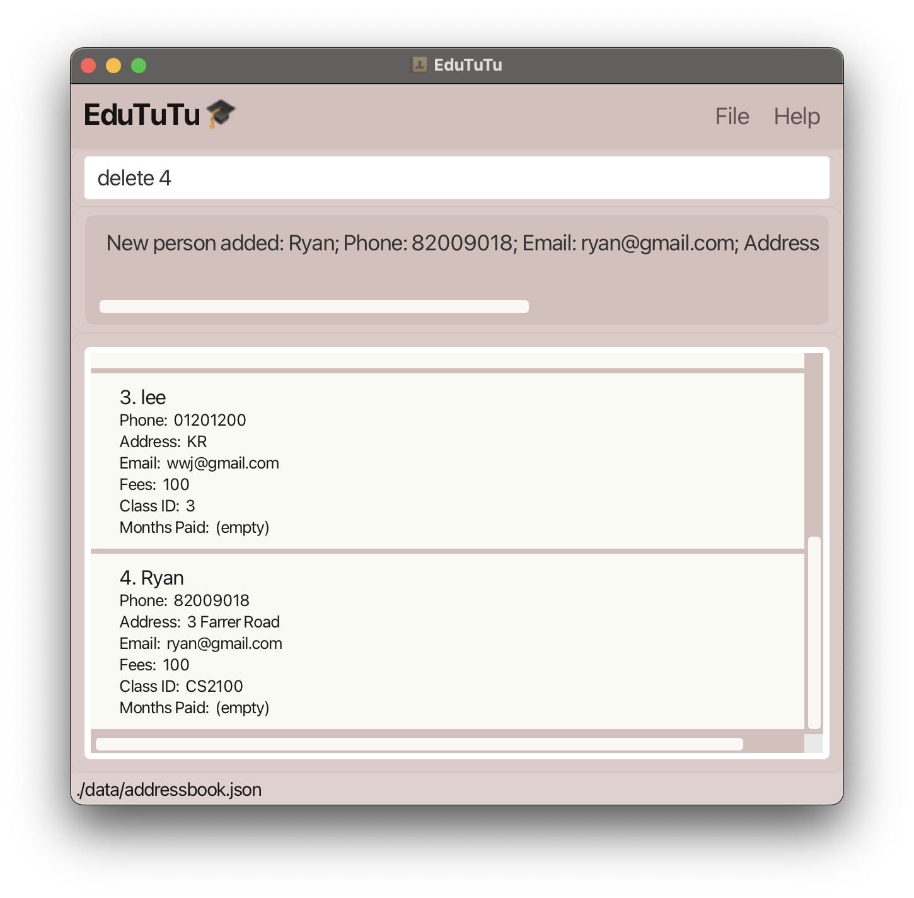
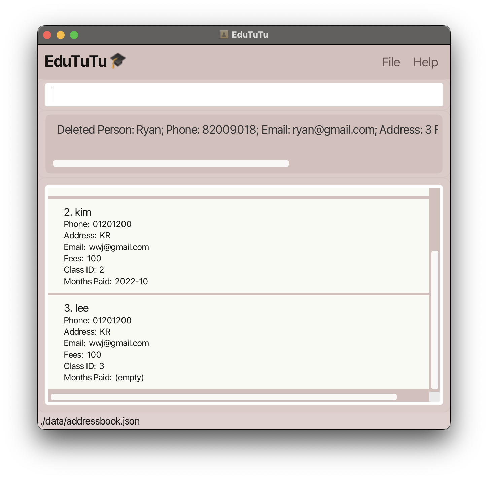
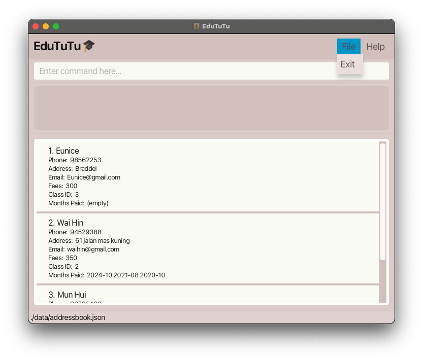

**EduTUTU** is a desktop application designed to streamline contact management for tuition centers, making it easier to 
organise and access student information. Optimised for use through a [Command Line Interface (CLI)](#cli-command-line-interface) while incorporating 
the convenience of a [Graphical User Interface (GUI)](#gui-graphical-user-interface), EduTUTU allows you to manage student details with speed and 
efficiency. Whether you’re handling student registrations, updating records, or searching for students, EduTUTU helps 
you complete these tasks more quickly than traditional applications, making it an ideal solution for tuition center 
administrators.

***

## Table of Contents

1. [Installation](#1-installation)
2. [Command Instructions](#2-command-instructions)
   - [2.1 Viewing Help](#21-viewing-help-help)
   - [2.2 Adding a Person](#22-adding-a-person-add)
   - [2.3 Deleting a Person](#23-deleting-a-person-delete)
   - [2.4 Marking a Payment Date](#24-marking-a-payment-date-markpaid)
   - [2.5 Unmarking a Payment Date](#25-unmarking-a-payment-date-unmarkpaid)
   - [2.6 Editing a Person](#26-editing-a-person-edit)
   - [2.7 Listing All Persons](#27-listing-all-persons-list)
   - [2.8 Finding a Person](#28-finding-a-person-find)
   - [2.9 Clearing All Entries](#29-clearing-all-entries-clear)
   - [2.10 Undo/Redo Commands](#210-undoredo-commands-undo-and-redo)
   - [2.11 Displaying Pie Chart of Class Distribution](#211-displaying-pie-chart-of-class-distribution-pie)
   - [2.12 Displaying Bar Chart](#212-displaying-bar-chart-bar)
   - [2.13 Viewing Command History](#213-viewing-command-history-arrow-keys)
   - [2.14 View Student Details](#214-view-student-details-info)
   - [2.15 Editing the Data File](#215-editing-the-data-file)
   - [2.16 Saving the Data](#216-saving-the-data)
   - [2.17 Exiting the Program](#217-exiting-the-program-exit)
3. [FAQ](#3-faq)
4. [Glossary](#4-glossary)

***

## 1. Installation

1. Ensure you have Java `17` or above installed in your Computer. It can be downloaded [here](https://www.oracle.com/java/technologies/javase/jdk17-archive-downloads.html).

1. Download the latest `.jar` file from [here](https://github.com/AY2425S1-CS2103T-T15-2/tp/releases/tag/v1.3).

1. Copy the file to the folder you want to use as the _home folder_ for your AddressBook.

1. Open a command terminal, `cd` into the folder you put the jar file in, and use the `java -jar edututu.jar` command to run the application. 

   A [GUI](#gui-graphical-user-interface) similar to the below should appear in a few seconds. Note how the app contains some sample data. 
   

1. Type the command in the command box and press Enter to execute it. e.g. typing **`help`** and pressing Enter will open the help window. 
   Some example commands you can try:

   * `list` : Lists all contacts.

   * `add n/John Doe p/98765432 e/johnd@example.com a/John street, block 123, #01-01 f/250, c/1 ` : Adds a contact named `John Doe` to the Address Book.

   * `delete 3` : Deletes the 3rd contact shown in the current list.

   * `clear` : Deletes all contacts.

   * `exit` : [Exits](#exit) the app.

1. Refer to the features below for details of each command.

[Back to Table of Contents](#table-of-contents)

***

## 2. Command Instructions
### Command Format Guidelines

* ` `: Commands format is indicated in the shaded boxes.
* `[ ]`: Items in square brackets are optional. 
  e.g `n/NAME [t/TAG]` can be used as `n/John Doe t/friend` or as `n/John Doe`.
* `…`: Items with `…` after them can be used multiple times including zero times.
* `UPPER_CASE`: Words in `UPPER_CASE` are the parameters to be supplied by the user.
* `INDEX`: Refers to the index number shown in the displayed person list.
* `MONTH_PAID`: Refers to the format `YYYY-MM` (e.g., `2024-10` for October 2024).
* `KEYWORD`: Refers to the search term used to find persons.
* `MORE_KEYWORDS`: Refers to additional search terms used to find persons.
* Parameters can be in any order. 
  e.g. if the command specifies `n/NAME p/PHONE_NUMBER`, `p/PHONE_NUMBER n/NAME` is also acceptable.
* `n/` is for name, `p/` is for phone number, `e/` is for email, `a/` is for address, `f/` is for fees, `c/` is for class ID, and `t/` is for tags.
* The commands help, list, exit, and clear do not accept parameters; any provided parameters will be disregarded.  e.g. if the command specifies `help 123`, it will be interpreted as `help`.
* EduTuTu allows the handling of only alphanumeric characters and spaces. Special characters and emojis are not supported.
* If you are using a PDF version of this document, be careful when copying and pasting commands that span multiple lines as space characters surrounding line-breaks may be omitted when copied over to the application.

[Back to Table of Contents](#table-of-contents)
***

### 2.1 Viewing Help: `help`

**[Command Format](#command-format):** `help`

Shows a message explaining how to access the help page.

**Tips:**
- Press "esc" to close the help window.

[Back to Table of Contents](#table-of-contents)

***

### 2.2 Adding a Person: `add`

Adds a person to [EduTuTu](#edututu).

**[Command Format](#command-format):** `add n/NAME p/PHONE_NUMBER e/EMAIL a/ADDRESS f/FEES c/CLASS_ID [t/TAG]…`

**[Command Word Alias](#command-word-alias):** `a`

> **Remark:** A person can have any number of tags (including 0).

**Example Usage:**

`add n/Ryan p/82154565 e/Ryan@gmail.com a/3 Padang Chancery f/550 c/1`

  <!-- Text Section -->
  

    

      
<b>Input:</b> User enters the `add` command.

    

    

      
<b>Output:</b> The UI updates to show the added person.

    

  

  <!-- Image Section -->
  

    

      
    

    

      
    

  

**Tips:**

- Use the `add` command to add a new person with their name, phone number, email, address, fees, and [class id](#class-id).
- [Tag](#tag) can be added to classify or group persons for easier management.
- The `add` command is helpful when setting up new contacts in [EduTuTu](#edututu).
- `MONTH_PAID` cannot be specified for `add`.

[Back to Table of Contents](#table-of-contents)

***

### 2.3 Deleting a Person: `delete`

Deletes the specified person from the address book.

**[Command Format](#command-format):** `delete INDEX`

**[Command Word Alias](#command-word-alias):** `d`

* Deletes the person at the specified `INDEX`.
* The [index](#index) refers to the index number shown in the displayed person list.
* The [index](#index) **must be a positive integer** 1, 2, 3, …

**Example Usage:** `delete 3`

  <!-- Text Section -->
  

    

      
<b>Input:</b> User enters the `delete 3` command to remove the 3rd person in the displayed list.

    

    

      
<b>Output:</b> The UI updates to reflect the deletion of the person.

    

  

  <!-- Image Section -->
  

    

      
    

    

      
    

  

[Back to Table of Contents](#table-of-contents)

***

### 2.4 Marking a Payment Date: `markpaid`

Updates the [payment status](#payment-status) of a student to completed.

**[Command Format](#command-format):** `markpaid INDEX m/MONTH_PAID`

**[Command Word Alias](#command-word-alias):** `mp`

* Marks the payment of the person at the specified `INDEX` for the given month and year.
* The `INDEX` refers to the index number shown in the displayed person list.
* The `MONTH_PAID` should be in the format `YYYY-MM` (e.g., `2024-10` for October 2024).
* The [index](#index) **must be within the range** of the number of people in the list.
* The year must be within 1900 to 2100 inclusive, and the month must be within 01 to 12 inclusive.

**Example Usage:**

  <!-- Text Section -->
  

    

      
<b>Input:</b> User enters the `markpaid 1 m/2024-10` command to mark the first student as paid for October 2024.

    

    

      
<b>Output:</b> The UI updates to show the payment status of the student.

    

  

  <!-- Image Section -->
  

    

      
    

    

      
    

  

[Back to Table of Contents](#table-of-contents)

***

Here's the markdown for the `unmarkpaid` feature following your provided format:

### 2.5 Unmarking a Payment Date: `unmarkpaid`

Updates the [payment status](#payment-status) of a student by removing the completed status for a specific month.

**[Command Format](#command-format):** `unmarkpaid INDEX m/MONTH_UNPAID`

**[Command Word Alias](#command-word-alias):** `ump`

* Removes the payment mark of the person at the specified `INDEX` for the given month and year.
* The `INDEX` refers to the index number shown in the displayed person list.
* The `MONTH_UNPAID` should be in the format `YYYY-MM` (e.g., `2024-10` for October 2024).
* The [index](#index) **must be within the range** of the number of people in the list.
* The year must be within 1900 to 2100 inclusive, and the month must be within 01 to 12 inclusive.

**Example Usage:**

  <!-- Text Section -->
  

    

      
<b>Input:</b> User enters the `unmarkpaid 1 m/2024-10` command to remove the payment status of the first student for October 2024.

    

    

      
<b>Output:</b> The UI updates to remove the payment status of the student for the specified month.

    

  

  <!-- Image Section -->
  

    

      
    

    

      
    

  

[Back to Table of Contents](#table-of-contents)

***

### 2.6 Editing a Person: `edit`

Edits an existing person in the address book.

**[Command Format](#command-format):** `edit INDEX [n/NAME] [p/PHONE] [e/EMAIL] [a/ADDRESS] [f/FEES] [c/CLASSID] [m/YEAR-MONTH] [t/TAG]…​`

**[Command Word Alias](#command-word-alias):** `e`

* Edits the person at the specified `INDEX`. The [index](#index) refers to the [index](#index) number shown in the displayed person list.
* At least one of the optional fields must be provided.
* Existing values will be updated to the input values.
* When editing [tags](#tags), the existing [tags](#tags) of the person will be removed, i.e., adding of [tags](#tags) is not cumulative.
* You can remove all the person’s [tags](#tags) by typing `t/` without specifying any [tags](#tags) after it.

**Example Usage:** `edit 1 p/91088511 e/wongwaihin7@gmail.com m/2024-10,2024-11`

  <!-- Text Section -->
  

    

      
<b>Input:</b> User enters the `edit` command to change the phone number and email address of the 1st person.

    

    

      
<b>Output:</b> The UI updates to show the edited details.

    

  

  <!-- Image Section -->
  

    

      
    

    

      
    

  

[Back to Table of Contents](#table-of-contents)

***

### 2.7 Listing All Persons: `list`

The `list` command displays a list of all persons currently stored in [EduTuTu](#edututu).

**[Command Format](#command-format):** `list`

**[Command Word Alias](#command-word-alias):** `l`

After entering the `list` command, all persons stored in the address book will be displayed in the UI.

**Example Usage:**

  <!-- Input Section -->
  

    
<b>Input:</b> User enters the `list` command.

    
  

  <!-- Output Section -->
  

    
<b>Output:</b> The UI updates to show all persons.

    
  

**Tips:**
- The `list` command is particularly useful after adding, editing, or deleting records to confirm changes.

[Back to Table of Contents](#table-of-contents)

***

### 2.8 Finding A Person: `find`

The `find` command allows you to list persons by their names, [Class IDs](#class-id), or [payment status](#payment-status) (paid/unpaid).

**[Command Format](#command-format):** `find`

**[Command Word Alias](#command-word-alias):** `f`

- **By Name Prefix:** `find n/NAME_PREFIX [MORE_NAME_PREFIXES]`
- **By Phone Number Prefix:** `find p/PHONE_PREFIX [MORE_PHONE_PREFIXES]`
- **By Address Prefix:** `find a/ADDRESS_PREFIX [MORE_ADDRESS_PREFIXES]`
- **By Email Prefix:** `find e/EMAIL_PREFIX [MORE_EMAIL_PREFIXES]`
- **By Fees (Exact Match):** `find f/FEES [MORE_FEES]`
- **By Class ID:** `find c/CLASSID [MORE_CLASSIDS]`
- **By Months Paid:** `find mp/YEAR-MONTH [MORE_YEARS-MONTHS]`
- **By Months Not Paid:** `find !mp/YEAR-MONTH [MORE_YEARS-MONTHS]`

**Examples of Combined Searches**
- **By Name and Phone Prefix:** `find n/NAME_PREFIX [MORE_NAME_PREFIXES] p/PHONE_PREFIX [MORE_PHONE_PREFIXES]`
- **By Email and Address Prefix:** `find e/EMAIL_PREFIX [MORE_EMAIL_PREFIXES] a/ADDRESS_PREFIX [MORE_ADDRESS_PREFIXES]`
- **By Name, Class ID, and Fees:** `find n/NAME_PREFIX [MORE_NAME_PREFIXES] c/CLASSID [MORE_CLASSIDS] f/FEES [MORE_FEES]`

**Notes:**
- Searches are case-insensitive. For example, `serangoon` will match `Serangoon`.
- The order of keywords does not matter. For example, `find n/Esther p/832` will match the same as `find p/832 n/Esther`.
- Fuzzy matches are supported for **Name**, **Phone**, **Email**, **Address**, **Class ID**, and **Months Paid** fields, meaning partial matches will return results (e.g., `832` will match phone numbers starting with `832`).
- **Exact match** is required for the **Fees** field, so `find f/350` will only return results with an exact fee of 350.
- Only individuals matching all specified criteria will be included in the search results.

**Example Usage:** `find n/Kim`

  <!-- Input Section -->
  

    
<b>Input:</b> User enters the `find` command to search for persons whose names contain the keyword `Kim`.

    
  

  <!-- Output Section -->
  

    
<b>Output:</b> The UI updates to show persons matching the search keyword.

    
  

[Back to Table of Contents](#table-of-contents)

***

### 2.9 Clearing All Entries: `clear`

[Clears](#clear) all entries from the address book.

**[Command Format](#command-format):** `clear`

Upon entering the command, all entries will be cleared from [EduTuTu](#edututu). A message  
"Address book has been cleared!" will be displayed in the command box.

**Example Usage:** `clear`

  <!-- Input Section -->
  

    
<b>Input:</b> User enters the `clear` command to remove all entries.

    
  

  <!-- Output Section -->
  

    
<b>Output:</b> The UI updates to show that all entries have been cleared.

    
  

**Tips:**
- Be careful when using this command, as it permanently deletes all current entries.
- Consider exporting your data before using the `clear` command if you need a [backup](#backup).

[Back to Table of Contents](#table-of-contents)

***

### 2.10 Undo/Redo Commands: `undo` and `redo`

**[Command Format](#command-format):** `undo` and `redo`

The `undo` and `redo` commands allow you to reverse or reapply the most recent changes made to the address book.

**Format:**
- `undo` – Reverses the most recent change to the address book.
- `redo` – Reapplies the most recent change that was undone.

* The `undo` command can be used to revert the last command that modified the address book.
* The `redo` command can be used only if an `undo` was performed previously.

**Example Usage:**
*Input: User enters the `undo` command to reverse the last change.*

*Output: The UI updates to reflect the reversal of the most recent change.*

*Input: User then enters the `redo` command to reapply the change.
The UI updates to reflect the reapplication of the previously undone change*

**Tips:**
- The `redo` command is only available after an `undo`, allowing you to reapply the change if needed.
- Remember that `undo` and `redo` are limited to the most recent changes. For more comprehensive [backups](#backup), consider exporting your data regularly.

[Back to Table of Contents](#table-of-contents)

***

### 2.11 Displaying Pie Chart of Class Distribution: `pie`

Creates a pie chart showing the distribution of students in each class. This feature allows tuition center administrators to quickly visualize the number of students in each class, helping them efficiently allocate class sizes.

**[Command Format](#command-format):** `pie`

For example, given the following data set with 4 students:
- 1 student in class 1
- 2 students in class 2
- 1 student in class 3

  <!-- Input Section -->
  

    
<b>Input:</b> User enters the `pie` command.

    
  

  <!-- Output Section -->
  

    
<b>Output:</b> A pie chart is displayed, showing the distribution of students in each class.

    
  

**Tips:**
- Make sure the data is up-to-date before using the `pie` command for accurate visualisation.
- Press "esc" to close the pie chart window.

[Back to Table of Contents](#table-of-contents)

***

### 2.12 Displaying Bar Chart: `bar`

Displays a [bar chart](#bar-chart) showing the number of students who made payments for each month. This feature allows you to visually track payment trends over time.

**[Command Format](#command-format):** `bar`

* The x-axis represents the months (e.g., 2024-01, 2024-02, etc.).
* The y-axis shows the number of students who made their payments during each month.
* If no payments were made in a given month, the value for that month will be zero.

  <!-- Input Section -->
  

    
<b>Input:</b> User enters the `bar` command.

    
  

  <!-- Output Section -->
  

    
<b>Output:</b> A bar chart displays.

    
  

**Tips:**
- Use the bar command to monitor payment trends and identify any seasonal patterns.
- Ensure that all payment records are updated for accurate chart visualisation.
- Press "esc" to close the bar chart window.

[Back to Table of Contents](#table-of-contents)

***

### 2.13 Viewing Command History: *Arrow Keys*

Allows users to quickly access previously entered commands using the up and down arrow keys.

**[Command Format](#command-format):** *No specific command required.*

* Press the **up arrow key** to cycle back through previously entered commands.
* Press the **down arrow key** to move forward through the [command history](#command-history).
* This feature is useful for repeating recent commands without needing to retype them.

[Back to Table of Contents](#table-of-contents)

***

### 2.14 Viewing Student Details: `info`

Displays the detailed information of a student in the list.

**[Command Format](#command-format):** `info`

* Shows the detailed information of the person at the specified `INDEX`.
* `INDEX` refers to the index number shown in the displayed person list.
* The [index](#index) **must be within the range** of the number of people in the list.
* Additionally, clicking on a student’s entry in the [GUI](#gui-graphical-user-interface) triggers a pop-up window displaying the same detailed information.

Displaying the detailed command window can be done in two ways:

#### Method 1:
**Example Usage:**

  <!-- Input Section -->
  

    
<b>Input:</b> User enters the `info 1` command to display detailed information for the first student.

    
  

  <!-- Output Section -->
  

    
<b>Output:</b> A window pops up with the detailed information of the student.

    
  

#### Method 2:
**Example Usage:**

  <!-- Input Section -->
  

    
<b>Input:</b> Double-click on the student’s entry in the GUI to display detailed information in a pop-up window.

    
  

  <!-- Output Section -->
  

    
<b>Output:</b> A window pops up with the detailed information of the student.

    
  

**Tips:**
- Press "esc" to close the pie chart window.

[Back to Table of Contents](#table-of-contents)

***

### 2.15 Editing the Data File

[EduTuTu](#edututu) data is saved automatically as a [JSON](#json-file) file at `[JAR file location]/data/addressbook.json`. Advanced users can modify data directly by editing that file.

> **Caution:**
> - If your changes to the data file make its format invalid, EduTuTu will discard all data and start with an empty data file at the next run. It is highly recommended to take a backup of the file before making any edits.
> - Certain edits can cause EduTuTu to behave in expected ways (e.g., if a value entered is outside the acceptable range). Edit the data file only if you are confident in your ability to update it correctly.

[Back to Table of Contents](#table-of-contents)

***

### 2.16 Saving the Data

[EduTuTu](#edututu) data is saved in the hard disk automatically after the execution of any command that modifies the data. There is no need for manual saving.

[Back to Table of Contents](#table-of-contents)

***

### 2.17 Exiting the Program: `exit`

**[Command Format](#command-format):** `exit`

[Exits](#exit) the program.

Exiting the program can be done in two ways:

#### Method 1:

  <!-- Step 1 -->
  

    
1. Click the File button at the top right corner of the window.

    
  

  <!-- Step 2 -->
  

    
2. Click on the Exit button.

    
  

3. The program will close.

Method 2:
1. Type the command [exit](#exit) in the command box and press Enter.
   

2. The program will close.

[Back to Table of Contents](#table-of-contents)

***

# 3. FAQ

**Q**: How do I transfer my data to another Computer? 
**A**: Install the app in the other computer and overwrite the empty data file it creates with the file that contains the data of your previous EduTuTu home folder.

**Q**: How do I save my data?  
**A**: EduTuTu automatically saves any changes. No manual saving is needed.

**Q**: Can I see a bar chart of monthly payment records?  
**A**: Yes, use the bar command to see the payment trends for each month.

**Q**: What if I forget to add the fees when creating a student entry?  
**A**: You can update the fee amount later using the edit command, like edit 1 f/500 to set fees to 500 for the first student.

[Back to Table of Contents](#table-of-contents)

***

# 4. Glossary

- **EduTuTu**: A desktop application designed for tuition centers to streamline student information management. It combines the speed of a Command Line Interface (CLI) with the convenience of a Graphical User Interface (GUI).

- **Command Word Alias**: A shorter version of a command word that can be used to perform the same action.

- **CLI (Command Line Interface)**: An interface where users type commands to interact with the application. CLI allows for quick and precise control, often preferred by users familiar with typing commands.

- **GUI (Graphical User Interface)**: A user-friendly interface with graphical elements like buttons, icons, and windows, allowing users to interact with the application more visually.

- **Command Format**: The specific way a command should be typed to work properly in EduTuTu. Following the exact format is essential for the command to be understood by the application.

- **Index**: A unique number assigned to each person entry in EduTuTu, used to identify and select entries for actions like editing or deleting.

- **Tag**: A label or keyword associated with a person, which helps categorise or organise entries (e.g., `student`, `alumni`, `parent`).

- **Month Paid**: A month and year combination, used for representing a month when a person has paid. (e.g., `2024-01`, `2024-12`).

- **Class ID**: A unique identifier assigned to each class within EduTuTu, helping to organise and locate students in specific classes (e.g., `CS2100`, `ES2660`).

- **Pie Chart**: A circular chart divided into slices that shows the proportion of students in each class. It provides a visual overview of class distributions.

- **Bar Chart**: A chart with rectangular bars representing data (e.g., monthly payments) on the x-axis and values on the y-axis, helpful for viewing trends over time.

- **Command History**: A feature that stores a log of previously entered commands. Users can navigate this history using arrow keys to quickly repeat recent commands.

- **JSON File**: A text file format for storing data in an organised way, readable by humans and computers. EduTuTu saves all data in a JSON file for easy access and editing.

- **Payment Status**: Indicates whether a student’s monthly payment is complete or pending. EduTuTu includes commands to mark payments as completed.

- **Parameter**: A value or setting provided by the user within a command to specify details like a name or phone number. Parameters help customise commands to suit specific actions.

- **Backup**: A saved copy of data, which can be restored if the original data is lost or corrupted. It’s advisable to back up the JSON data file before editing it directly.

- **Clear**: A command used to remove all entries from the address book, resetting the data.

- **Exit**: A command that closes the EduTuTu application safely.

- **Storage File**: The file where EduTuTu data is automatically saved. No manual saving is needed, as data is updated after every command.

[Back to Table of Contents](#table-of-contents)

***

## Known issues

1. **When using multiple screens**, if you move the application to a secondary screen, and later switch to using only the primary screen, the GUI will open off-screen. The remedy is to delete the `preferences.json` file created by the application before running the application again.
2. **If you minimise the Help Window** and then run the `help` command (or use the `Help` menu, or the keyboard shortcut `F1`) again, the original Help Window will remain minimised, and no new Help Window will appear. The remedy is to manually restore the minimised Help Window.

[Back to Table of Contents](#table-of-contents)

***

## Command summary

| Action                      | Format, Examples                                                                                                                                                      |
|-----------------------------|-----------------------------------------------------------------------------------------------------------------------------------------------------------------------|
| **Add**                     | `add n/NAME p/PHONE_NUMBER e/EMAIL a/ADDRESS [t/TAG]…​`   e.g., `add n/James Ho p/22224444 e/jamesho@example.com a/123, Clementi Rd, 1234665 t/friend t/colleague` |
| **Bar Chart**               | `bar`                                                                                                                                                                 |
| **Clear**                   | `clear`                                                                                                                                                               |
| **Delete**                  | `delete INDEX`  e.g., `delete 3`                                                                                                                                   |
| **Edit**                    | `edit INDEX [n/NAME] [p/PHONE_NUMBER] [c/CLASS_ID] [f/FEES] [m/MONTH_PAID] [e/EMAIL] [a/ADDRESS] [t/TAG]…​`  e.g.,`edit 2 n/James Lee e/jameslee@example.com`      |
| **Exit**                    | `exit`                                                                                                                                                                |
| **Help**                    | `help`                                                                                                                                                                |
| **Find**                    | `find KEYWORD [MORE_KEYWORDS]`  e.g., `find n/James Jake`                                                                                                          |
| **List**                    | `list`                                                                                                                                                                |
| **Mark Paid**               | `markpaid INDEX YEAR_MONTH`  e.g., `markpaid 1 m/2024-10` (Marks the payment for October 2024 as completed for the student at index 1)                             |
| **Pie Chart**               | `pie`                                                                                                                                                                 |
| **Undo**                    | `undo`  Reverts the last action taken                                                                                                                              |
| **Redo**                    | `redo`  Reapplies the last action that was undone                                                                                                                  |
| **Viewing Command History** | *No command needed*  Use the arrow keys to navigate through previous commands                                                                                      |
| **Viewing Student Details**  | `info INDEX`   Displays detailed information of a specific student at the given `INDEX` in a new window                                                            |
| **Editing the Data File**   | *No command*  Direct editing of the data JSON file (backup recommended)                                                                                            |
| **Saving the Data**         | *Automatic*  Data is saved automatically to the storage file after each command                                                                                    |

[Back to Table of Contents](#table-of-contents)
