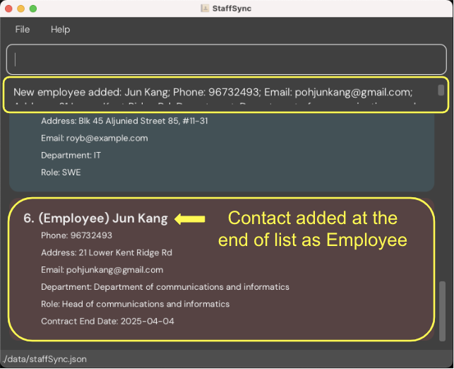
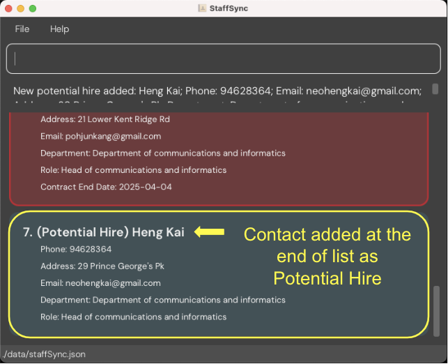

<link rel="stylesheet" href="https://fonts.googleapis.com/css2?family=Material+Symbols+Outlined:opsz,wght,FILL,GRAD@20..48,100..700,0..1,-50..200&icon_names=chevron_right" />

<h1 class="headers headers-first">StaffSync User Guide</h1>

  Welcome to StaffSync! Are you a Human Resources (HR) Manager that has a lot of potential hires and employees to manage? StaffSync allows you to manage your potential hires and employees on your desktop, optimized for use via a Command Line Interface (CLI) while still having the benefits of a Graphical User Interface (GUI). If you type fast, you can complete your contact management tasks faster with StaffSync than with GUI apps.

 

<h1 class="toc headers">Table of Contents</h1>

  <a href="#installation-and-quick-start">
    <button class="toc-btns toc-btns-first">1. Installation and Quick Start</button>
  </a>
  <a href="#commands">
    <button class="toc-btns">2. Commands</button>
  </a>
  <a href="#command-summary">
    <button class="toc-btns">3. Commands Summary</button>
  </a>
  <a href="#storing-data">
    <button class="toc-btns">4. Storing Data</button>
  </a>
  <a href="#glossary">
    <button class="toc-btns">5. Glossary</button>
  </a>
  <a href="#faq">
    <button class="toc-btns">6. FAQ</button>
  </a>
  <a href="#known-issues">
    <button class="toc-btns toc-btns-last">7. Known Issues</button>
  </a>

 

<h1 class="headers" id="installation-and-quick-start">Installation and Quick Start</h1>

<strong>1. </strong>**Download** and **install** [Java `17`](https://www.oracle.com/java/technologies/downloads/#java17) if you don't have it installed. We don't support other versions.

_You may check your installed version of Java by entering the following in your command terminal_

java -version

 

 

<strong>2. </strong>**Download** the latest version of `StaffSync.jar` from [our Github page](https://github.com/AY2425S1-CS2103T-T10-2/tp/releases).

 

 

<strong>3. </strong>**Copy** `StaffSync.jar` into the folder you want to use as the _home folder_ for StaffSync. StaffSync will store all save data here.

 

 

<strong>4. </strong>Open a command terminal, and **change your directory** to the StaffSync's _home folder_ by using the `cd` command.

For example, if the _home folder_ is located at `Desktop/StaffSync`, enter the command

cd "Desktop/StaffSync"

 

 

<strong>5. </strong>Next, let's **run** StaffSync.

In your command terminal, enter the following command

java -jar StaffSync.jar

 

A GUI similar to the below should appear in a few seconds with some sample data. 

 

 

<strong>6. </strong>To **run any command**, type it in the command box and press Enter to execute it.

For example, entering the following command will open the help window.

help
 

Some example commands you can try:

List all potential hires.

list ph
 

Add an employee named `John Doe` to StaffSync.

employee n/John Doe p/81234567 e/pohjunkang@gmail.com a/21 Lower Kent Ridge Rd d/Department of communications and informatics r/Head of communications and informatics ced/2021-01-01
 

Delete the 1st person shown if they are a potential hire

delete ph 1
 

Exit the app.

exit
 

 

<strong>7. </strong>You can refer to the [Commands](#commands) below for **details of each command**.

If you would like to remove all sample data, you can run the command

clear
 

 

<strong>8. </strong>Now, you are all set to use StaffSync. We wish you all the best on your journey with StaffSync!

 

<h1 class="headers" id="commands">Commands</h1>

**Notes about the command **format**:**

 

* Words in `UPPER_CASE` are the **compulsory** parameters to be **supplied by the user**.
  e.g. in `employee n/NAME`, `NAME` is a parameter which can be used as `employee n/John Doe`.

 

* Items in round brackets are **compulsory**.
  e.g. `list (e/ph/all)` must be used as `list e` or `list ph` or `list all`.

 

* Items in square brackets are **optional**.
  e.g. `edit INDEX [n/NAME] [e/EMAIL]` can be used as `edit 1 n/John Doe e/johndoe@gmail.com` or `edit 1 n/John Doe`.

 

* Items in curly brackets are **requirements for the format**, but are **not entered** into the command box.
  e.g. `demote INDEX {must be a positive integer}` means that index must be a positive integer.

 

* Parameters can be in **any order**.
  e.g. if the command specifies `n/NAME p/PHONE_NUMBER`, `p/PHONE_NUMBER n/NAME` is also acceptable.

 

* Parameters and commands are **case-sensitive**.
  e.g. the command `Help` and `edit 1 N/John Doe` will return an error.

 

* Extra parameters for commands that do not take in parameters (such as `help`, `exit` and `clear`) will be **ignored**.
  e.g. if the command specifies `help 123`, it will be interpreted as `help`.

 

* If you are using a PDF version of this document, be careful when copying and pasting commands that span multiple lines as there may be formatting issues.

  

    <strong>Clearing all entries <code>clear</code></strong>
    
      chevron_right
    
  

  

  You can clear all entries from StaffSync.

   
   

  

  **Format**: `clear`
  

   

  

  **Warning:** There is **NO confirmation prompt** when using this command and is irreversible.
  

  

  

    <strong>Deleting a person <code>delete</code></strong>
    
      chevron_right
    
  

  

  You can delete the specified person from StaffSync.

   
   

  

  **Format**: `delete PARAMETER INDEX`
  

   

  You can delete the potential hire/employee at the specified shown `INDEX`.

 

**Parameters:**

  `PARAMETER`:
  * `e` for employees
  * `ph` for potential hires.

  `INDEX`: The index number shown in your displayed person list.
  * `INDEX` **must be a positive integer** 1, 2, 3, …​
  * `INDEX` **must be within the size of the list** shown.

 

**Examples:**

  * `list ph` followed by `delete ph 2` deletes the 2nd person in the display shown by `list`, if he/she is a potential hire.
  * `find e n/Betsy` followed by `delete e 1` deletes the 1st person in the display shown by `find`, if he/she is an employee.
    
 

Example: `delete e 1`
  

  

  

  

  

  **Common Mistakes:**
  * `delete E 1` - invalid format, you should type `e` instead of `E` as it is case-sensitive
  * `delete 1` - invalid format, you forgot to specify the person type `e` or `ph`
  

  

  

  

    <strong>Demoting a person <code>demote</code></strong>
    
      chevron_right
    
  

  

  You can demote the specified employee from StaffSync into a potential hire.

   
   

  

  **Format**: `demote INDEX`
  

 

**Parameters:**

  `INDEX`: The index number shown in your displayed person list.
  * `INDEX` **must be a positive integer** 1, 2, 3, …​
  * `INDEX` **must be within the size of the list** shown.
  * The person at the `INDEX` must be an employee.

 

**Examples:**

  * `list e` followed by `demote 2` demotes the 2nd person in your employee list.
  * `find e n/Betsy` followed by `demote 1` demotes the 1st employee in the results of the `find` command.

 

Example: `demote 1`
  

  

  

  

  

  **Common Mistakes:**
  * `list ph` followed by `demote 2` - You cannot demote a potential hire, you can use `list e` instead of `list ph` to get the list of employees
  * `demote 0` - invalid format, you should change 0 to a greater number corresponding to the index
  * `demote 3` but only have 2 entries - invalid index number, index out of list size, you might want to check the index number again
  

  

  

    <strong>Editing a person <code>edit</code></strong>
    
      chevron_right
    
  

  

  You can edit an existing person in StaffSync.

   
   

  

  **Format**: `edit INDEX [n/NAME] [p/PHONE_NUMBER] [e/EMAIL] [a/ADDRESS] [d/DEPARTMENT] [r/ROLE] [ced/CONTRACT_END_DATE]`
  

   

  You can edit the person at the specified `INDEX`.

 

**Parameters:**

  `INDEX`: The index number shown in your displayed person list.
  * `INDEX` **must be a positive integer** 1, 2, 3, …​
  * `INDEX` **must be within the size of the list** shown.

**Optional Parameters:**
  * You should include at least one of the optional fields.
  * Existing values will be updated to the input values.
  * You can refer to the `employee` command for each parameter's format.

  

  **Tip:** You cannot edit the contract end date of a potential hire.
  

 

**Examples:**

  *  `edit 1 p/91234567 e/johndoe@example.com` Edits the phone number and email address of the 1st person to be `91234567` and `johndoe@example.com` respectively.
  *  `edit 2 n/Betsy Crower` Edits the name of the 2nd person to be `Betsy Crower`.
 

  Example: `edit 1 p/96734857`
  

  

  

  

  

    <strong>Adding an employee <code>employee</code></strong>
    
      chevron_right
    
  

  

  You can add an employee to StaffSync.

   
   

  

  **Format**: `employee n/NAME p/PHONE_NUMBER a/ADDRESS e/EMAIL d/DEPARTMENT r/ROLE ced/CONTRACT_END_DATE`
  

 

  **Parameters:**

  `NAME`: Contains only alphanumeric characters and spaces, and it should not be blank.

  `PHONE_NUMBER`: Contains numbers that are at least 3 digits long.

  `ADDRESS`: Takes any values, and it should not be blank.

  `EMAIL`: In the format local-part@domain.

  `DEPARTMENT`: Takes any values, and it should not be blank.

  `ROLE`: Takes any values, and it should not be blank.

  `CONTRACT_END_DATE`: In the format of yyyy-MM-dd.

  

  **Tip:** All fields are mandatory.
  

 

**Examples:**

  * `employee n/Jun Kang p/96732493 a/21 Lower Kent Ridge Rd e/pohjunkang@gmail.com d/Department of communications and informatics r/Head of communications and informatics ced/2025-04-04`
     

  

  

  

  

  

    <strong>Exiting the program <code>exit</code></strong>
    
      chevron_right
    
  

  

  You can exit the program.

   
   

  

  **Format**: `exit`
  

   

  

  

    <strong>Locating persons by name <code>find</code></strong>
    
      chevron_right
    
  

  

  You can find all employees and/or potential hires whose names contain any of the specified keywords.

   
   

  

  **Format**: `find PARAMETER [n/NAMES] [p/PHONE_NUMBERS] [e/EMAILS] [d/DEPARTMENTS] [r/ROLES]`
  

 

**Parameters:**

  `PARAMETER`:
  * `all` for all persons.
  * `e` for employees.
  * `ph` for potential hires.

**Optional Parameters:**

  * You can refer to the `employee` or `potential` command for each parameter's format.
  * Only name, phone number, email, department and role can be searched.
  * Only full words will be matched. e.g. `find e n/Han` will not match `find e n/Hans`.
  * The search is case-insensitive. e.g. `find all n/hans` will match `find all n/Hans`.
  * You can search for multiple fields. e.g. `find all n/alice p/12345678 e/alice@example.com` returns persons
  with name `alice`, with phone number `123445678` and with email `alice@example.com`.
  * Persons matching at least one keyword in every field specified will be returned.
    e.g. `find e n/Hans Bo p/12345678 87654321` will return employees with name either `Hans` or `Bo`,
    and with phone number either `12345678` or `87654321`.
  * The order of the keywords does not matter. e.g. `find all e/alice@example.com bob@example.com` will match
  `find all e/bob@example.com alice@example.com`.
  * The order of the keywords prefixes does not matter. e.g. `find all n/john e/john@example.com` will match
  `find all e/john@example.com n/john`.

  

  **Tip:** At least one keyword is required.
  

 

**Examples:**

  * `find all n/John p/12345678` returns persons with `John` in their name, and with phone number `12345678`.
  * `find e p/12345678 e/john@example.com alice@example.com` returns employees with phone number `12345678` and with
  email either `john@example.com` or `alice@example.com`.
  * `find ph d/IT r/SWE Manager` returns potential hires with department `IT`, and role either `SWE` or `Manager`.

 

Example: `find ph n/David`
  

  

  

  

  

  **Common Mistakes:**
  * `find a n/John` - invalid format, you might want to use `e`, `ph` or `all` instead of `a`.
  * `find all a/John` - invalid keyword prefix, you might want to use `n/`, `p/`, `e/` , `d/` or `r/` instead of `a/`.
  * `find all n/John n/John` - duplicate keyword prefix, you can remove either one of the `n/John`.
  

  

  

    <strong>Viewing help <code>help</code></strong>
    
      chevron_right
    
  

  

  Displays a help window for you to see the list of commands, its purpose and the format.

   
   

  

  **Format**: `help`
  

  

  
  

  

  

    <strong>Listing all persons <code>list</code></strong>
    
      chevron_right
    
  

  

  You can see a list of all persons in StaffSync.

   
   

  

  **Format**: `list PARAMETER`
  

   

  You can list type of persons based on the parameter given.

 

**Parameters:**

  `PARAMETER`:
  * `all` for all persons.
  * `ph` for potential hires.
  * `e` for employees.

 

**Examples:**

  * `list all`
  * `list e`
  * `list ph`
 

Example: `list all`
  

  

  

  

  

    <strong>Adding a potential hire <code>potential</code></strong>
    
      chevron_right
    
  

  

  You can add a potential hire to StaffSync.

   
   

  

  **Format**: `potential n/NAME p/PHONE_NUMBER a/ADDRESS e/EMAIL d/DEPARTMENT r/ROLE`
  

   

  **Parameters:**

  `NAME`: Contains only alphanumeric characters and spaces, and it should not be blank.

  `PHONE_NUMBER`: Contains numbers that are at least 3 digits long.

  `ADDRESS`: Takes any values, and it should not be blank.

  `EMAIL`: In the format local-part@domain.

  `DEPARTMENT`: Takes any values, and it should not be blank.

  `ROLE`: Takes any values, and it should not be blank.

  

  **Tip:** All fields are mandatory.
  

 

**Examples:**

  * `potential n/Heng Kai p/94628364 a/29 Prince George's Pk e/neohengkai@gmail.com d/Department of communications and informatics r/Head of communications and informatics`
     

  

  

  

  

  

    <strong>Promoting a person <code>promote</code></strong>
    
      chevron_right
    
  

  

  You can promote the specified potential hire from StaffSync into an employee with a specific contract end date.

   
   

  

  **Format**: `promote INDEX CONTRACT_END_DATE`
  

 

**Parameters:**

  `INDEX`: The index number shown in your displayed person list.

  * `INDEX` **must be a positive integer** 1, 2, 3, …​
  * `INDEX` **must be within the size of the list** shown.
  * The person at the `INDEX` must be a potential hire

  `CONTRACT_END_DATE`: The contract end date of the employee in the format of yyyy-MM-dd.

 

**Examples:**

  * `list ph` followed by `promote 2 2025-12-20` promotes the 2nd person in the potential hire list with a contract end date of 20 Dec 2025.
  * `find ph n/Betsy` followed by `promote 1 2025-12-20` promotes the 1st potential hire in the results of the `find` command with a contract end date of 20 Dec 2025.

 

Example: `promote 1 2025-12-20`
  

  

  

  

  

  **Common Mistakes:**
  * `promote 2 12-20-2025` - the contract end date is in the wrong date format, you can enter `2025-12-20` to represent 20 Dec 2025 instead of `12-20-2025`.
  * `promote 2 2025-20-12` - the day and the month of the contract end date is swapped, you can enter `2025-12-20` to represent 20 Dec 2025 instead of `2025-20-12`.
  * `list e` followed by `promote 2 2025-12-20` - cannot promote an employee, you can use `list ph` instead of `list e` to get the list of potential hires.
  * `promote 0 2025-12-20` - invalid format, you should change 0 to a greater number corresponding to the index.
  * `promote 3 2025-12-20` but only have 2 entries - invalid index number, index out of list size, you might want to check the index number again.
  

  

  

    <strong>Sorting the list <code>sort</code></strong>
    
      chevron_right
    
  

  

  You can sort the list in ascending or descending order by the given parameter.

   
   

  

  **Format**: `sort FIELD [ORDER]`
  

   

  You can sort the list by the given field in the given order.

 

**Parameters:**

  `FIELD`: The type of data you want to sort by.
  * `name` will sort the list based on the names of your contacts in alphabetical order.
  * `date` will sort the list based on the contract end dates of your employees.
  * `dept` will sort the list based on the department of your contacts in alphabetical order.
  * `role` will sort the list based on the roles of your contacts in alphabetical order.

 

**Optional Parameters:**

  `[ORDER]`: The order you wish to sort the list in. Defaults to ascending order if not specified.
  * `asc` will sort your list in ascending order.
  * `desc` will sort your list in descending order.

  

  **Tips:**
  * Sort only sorts the contacts shown at the current point in time.
  * When sort date is used, potential hires show up at the bottom as they do not have a contract end date.
  * If the order is left out StaffSync will sort in ascending order by default.
  

 

**Examples:**

  * `sort name` sorts your contacts by name in alphabetical order.
  * `sort date desc` sorts by contract end date with your potential hires at the bottom.
  * `sort role asc` sorts your contacts by role in alphabetical order.

 

Example: `sort name`
  

  

  

  

 

<h1 class="headers" id="command-summary">Commands Summary</h1>

Action     | Format                                                                                        | Examples
-----------|-----------------------------------------------------------------------------------------------|--------------------------------------------------------------------------------------------------
**Clear**  | `clear`                                                                                       |
**Delete** | `delete e INDEX`   `delete ph INDEX`                                                       | `delete e 3`  `delete ph 1`
**Demote** | `demote INDEX`                                                                                | `demote 2`
**Edit**   | `edit INDEX [n/NAME] [p/PHONE_NUMBER] [e/EMAIL] [a/ADDRESS] [d/DEPARTMENT] [r/ROLE] [ced/CONTRACT_END_DATE]` | `edit 2 n/James Lee e/jameslee@example.com`
**Employee**| `employee n/NAME p/PHONE_NUMBER a/ADDRESS e/EMAIL d/DEPARTMENT r/ROLE ced/CONTRACT_END_DATE​` | `employee n/Jun Kang p/81234567 a/21 Lower Kent Ridge Rd e/pohjunkang@gmail.com d/Department of communications and informatics r/Head of communications and informatics ced/2021-01-01`
**Exit**   | `exit`                                                                                        |
**Find**   | `find (e/ph/all) [n/NAMES] [p/PHONE_NUMBERS] [e/EMAILS] [d/DEPARTMENTS] [r/ROLES]`            | `find e n/Jake e/jake@example.com`   `find ph n/Don p/97651234`   `find all n/James d/IT r/SWE`
**Help**   | `help`                                                                                        |
**List**   | `list all`   `list e`   `list ph`                                                       |
**Potential Hire**| `potential n/NAME p/PHONE_NUMBER a/ADDRESS e/EMAIL d/DEPARTMENT r/ROLE​`                | `potential n/Jun Kang p/81234567 a/21 Lower Kent Ridge Rd e/pohjunkang@gmail.com d/Department of communications and informatics r/Head of communications and informatics`
**Promote** | `promote INDEX CONTRACT_END_DATE`                                                            | `promote 2 2025-12-20`
**Sort**   | `sort (name/date/dept/role) [asc/desc]` | `sort name`   `sort date asc`   `sort dept desc`

 

<h1 class="headers" id="storing-data">Storing Data</h1>

### **Saving the data**

StaffSync data are saved in the hard disk automatically after any command that changes the data. There is no need for you to save manually.

 

### **Editing the data file**

  StaffSync data are saved automatically as a JSON file `[JAR file location]/data/staffSync.json`. Advanced users are welcome to update data directly by editing that data file.

**Caution:**
If your changes to the data file makes its format invalid, StaffSync will discard all data and start with an empty data file at the next run.  Hence, it is recommended to take a backup of the file before editing it.

 

Furthermore, certain edits can cause the StaffSync to behave in unexpected ways (e.g. if a value entered is outside the acceptable range). Therefore, edit the data file only if you are confident that you can update it correctly.

 

<h1 class="headers" id="glossary">Glossary</h1>

### **Alphanumeric**

A mix of letters and numbers only. Includes both alphabets (a to z) and digits (0 to 9) with no spaces or special characters.

Example: StaffSync123

### **Command Line Interface**

A text-based interface that lets you type instructions directly to your computer to perform certain tasks. Instead of
clicking on menus or icons, you would type specific commands into the text-based interface and the computer or software
will run those commands for you. 

Example: To show a list of potential hire, simply type `list ph` and press enter. The list of potential hire will appear. 

### **Graphical User Interface**

The "face" of a program, designed to use visual elements like buttons, icons, windows and menus to make it easier for
people to interact with the program.

Example: You can see each entry of potential hire or employees in a box with their details nicely formatted and easy to
read.

### **Index**

The order or position of an item in a list. The value starts from 1 and it must be a positive
integer.

Example: If you have a list of names (1. Alice, 2. Betty, 3. Charlie) then, Alice is at index 1, Betty is at index 2
and Charlie is at index 3.

### **Integer**

A whole number with no fractions and decimals that can be positive, 0 or negative. The range of a valid integer in
programming is from -2147483648 to 2147483647, inclusive of both.

Example: -2147483648, -15, 0, 35, 2147483647

### **Parameter**

A piece of information you would give to a program to allow it to know exactly how you want it to work.

Example: In order to display a list of employee and not a list of potential hire, you would type in `list e` instead of
`list ph` as `e` is the parameter to allow the program to know that you want the list of employees.

<h1 class="headers" id="faq">FAQ</h1>

  

    <strong>Q: How do I transfer my data to another Computer?</strong>
  

  

  <strong>A: </strong>Install the app in the other computer and overwrite the empty data file it creates with the file that contains the data of your previous StaffSync home folder.

  

 

<h1 class="headers" id="known-issues">Known Issues</h1>

1. **When using multiple screens**, if you move the application to a secondary screen, and later switch to using only the primary screen, the GUI will open off-screen. The remedy is to delete the `preferences.json` file created by the application before running the application again.

 

2. **If you minimize the Help Window** and then run the `help` command (or use the `Help` menu, or the keyboard shortcut `F1`) again, the original Help Window will remain minimized, and no new Help Window will appear. The remedy is to manually restore the minimized Help Window.

