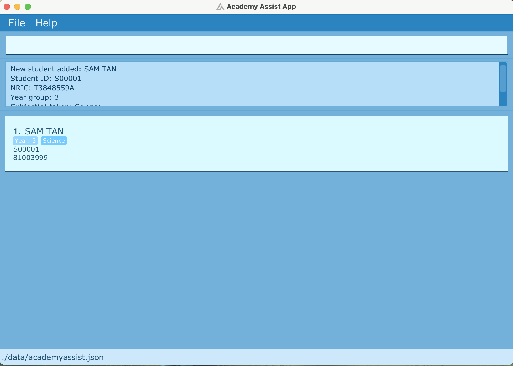
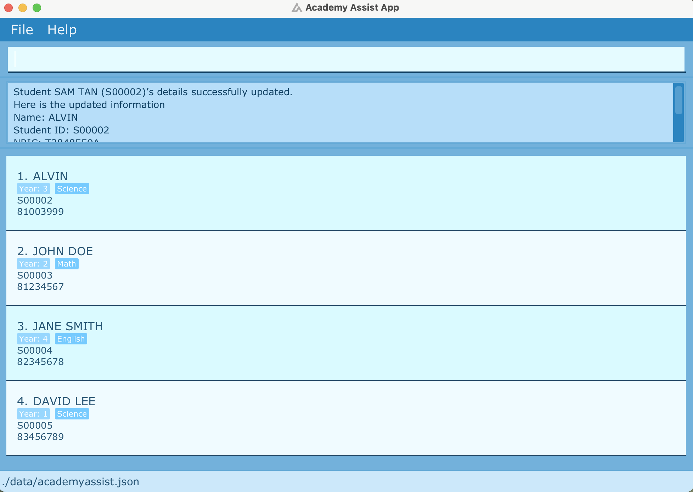
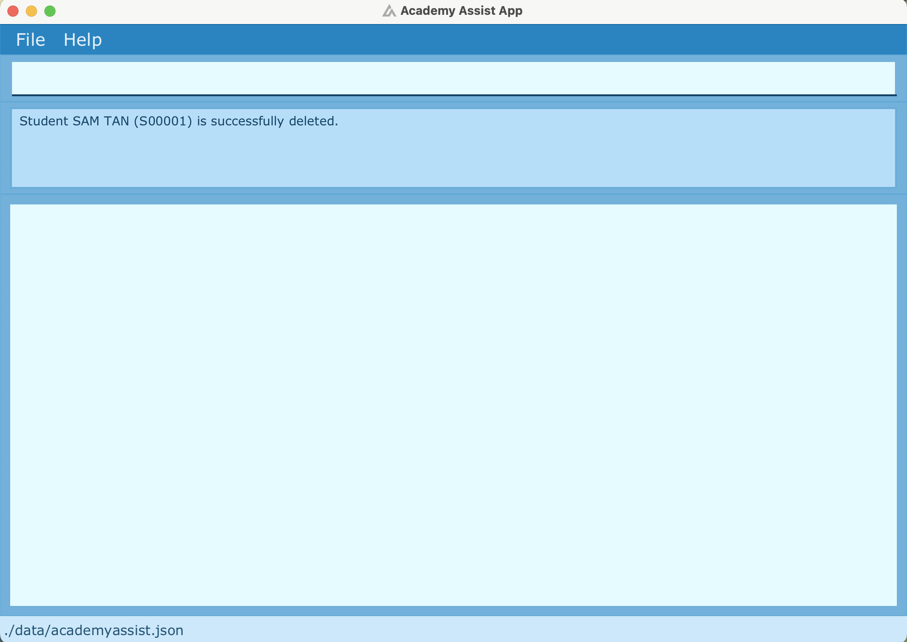
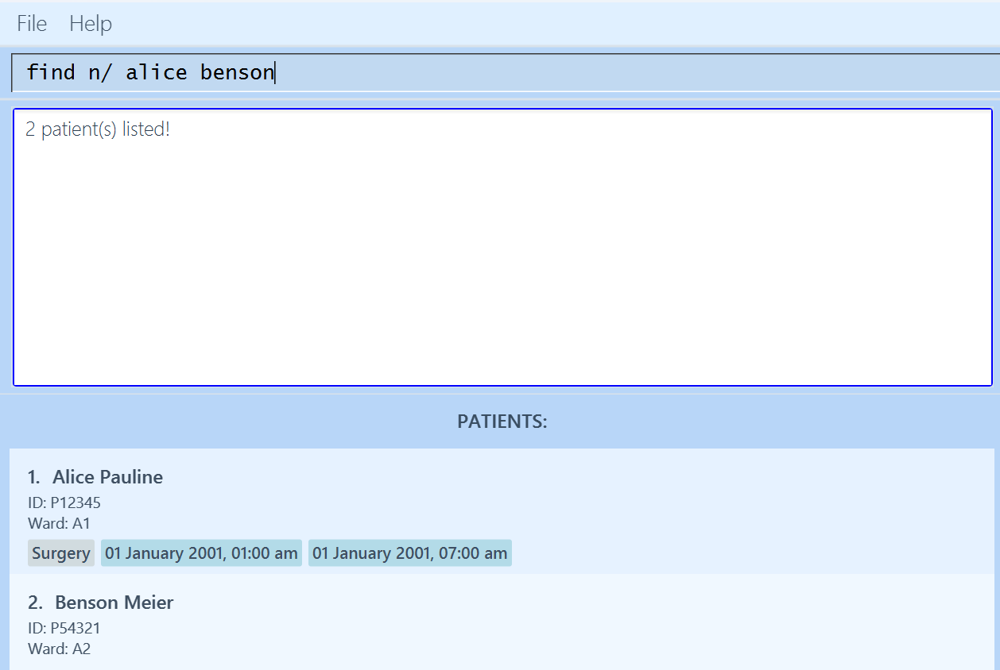
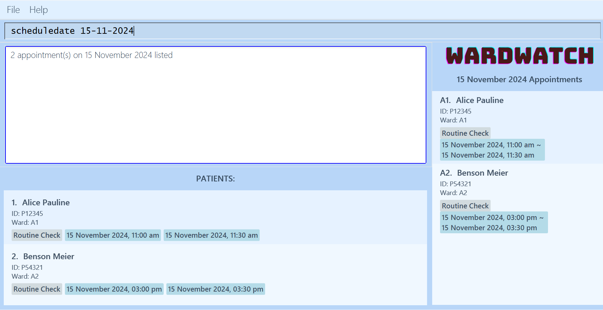

# WardWatch User Guide

WardWatch (WW) is a **desktop app targeted towards doctors and nurses for managing patients information in hospitals**, optimized for use via a [Command Line Interface (CLI)](#glossary) while still having the benefits of a [Graphical User Interface (GUI)](#glossary). If you can type fast, WW can get your patient management tasks done faster than traditional GUI apps.

<!-- * Table of Contents -->

# Table of Contents

1. [Quick Start](#quick-start)
2. [General Guidelines](#general-guidelines)
3. [Input Parameters](#input-parameters)
4. [Features](#features)
   - **General Commands**
     - [Viewing help](#viewing-help-help)
     - [Clearing all entries](#clearing-all-entries-clear)
     - [Exiting the program](#exiting-the-program-exit)
   - **Patient Management**
     - [Adding a patient](#adding-a-patient-add)
     - [Editing a patient](#editing-a-patient-edit)
     - [Deleting a patient](#deleting-a-patient-delete)
     - [Listing all patients](#listing-all-patients-list)
     - [Searching patients by field](#searching-patients-by-field-find)
     - [Viewing a patient's details](#viewing-a-patient-s-details-view)
   - **Notes Management**
     - [Adding notes to a patient](#adding-notes-to-a-patient-addnotes)
     - [Deleting notes from a patient](#deleting-notes-from-a-patient-delnotes)
   - **Appointment Management**
     - [Adding an appointment to a patient](#adding-an-appointment-to-a-patient-makeappt)
     - [Deleting an appointment from a patient](#deleting-an-appointment-from-a-patient-delappt)
     - [List all patient appointments on a specific date](#show-appointments-on-a-specific-date-scheduledate)
     - [List all patient appointments](#list-all-patient-appointments-scheduleall)
5. [FAQ](#faq)
6. [Glossary](#glossary)
7. [Known Issues](#known-issues)
8. [Command Summary](#command-summary)

---

# Quick start

1. Ensure you have Java `17` or above installed in your Computer. Refer to this [guide](https://www.java.com/en/download/help/version_manual.html) to find out how.
2. Download the latest `.jar` file from [here](https://github.com/AY2425S1-CS2103T-T15-3/tp/releases/).
3. Copy the file to the folder you want to use as the _home folder_ for the WardWatch application.
4. Open a command terminal, *navigate* into the folder you put the jar file in, and use the `java -jar wardwatch.jar` command to run the application. If you are unsure on how to *navigate* the terminal, refer to this [guide](https://www.codecademy.com/learn/learn-the-command-line/modules/learn-the-command-line-navigation/cheatsheet) here. 

A GUI similar to the image below should appear in a few seconds. Note how the app contains some sample data. 

5. Type the command in the command box located at the top of the window and press Enter to execute it. e.g. typing **`help`** and pressing Enter will open the help window.  
   Some example commands you can try:

   * `list` : Lists all patients.
   * `add i/P23456 n/Donald Duck w/B5 d/Diabetes m/Insulin` : Adds a contact named `Donald Duck` to the patient list.
   * `delete 3` : Deletes the 3rd patient shown in the current list.
   * `find w/ B1` : Finds all patients with ward B1.
   * `clear` : Deletes all patients.
   * `exit` : Exits the app.
6. Refer to the [Features](#features) below for details of each command.

[Back to Table of Contents](#table-of-contents)

---

# General Guidelines

As a [CLI-based](#glossary) application, users will interact with WardWatch by typing commands.  Commands typically begin with a `COMMAND_WORD`, followed by its relevant `PARAMETERS` as necessary.

<box type="info" seamless>

**Notes about the command format:** 

There are 5 CLI command formats as shown below:

1) `COMMAND_WORD`
2) `COMMAND_WORD INDEX`
3) `COMMAND_WORD PARAMETER`
4) `COMMAND_WORD PARAMETERS`
5) `COMMAND_WORD INDEX PARAMETERS`
   </box>

For more information on the format of `PARAMETERS`, please refer to [Input parameters](#input-parameters).

**Other things to note in this User Guide:**

1) Items in square brackets are optional: 
   - `n/NAME [d/DIAGNOSIS]` can be used as `n/John Doe d/diabetes` or as `n/John Doe`.
2) Parameters can be in any order:  
   - `n/NAME w/WARD` is equivalent to `w/WARD n/NAME`.
3) Items with …​ after them can be used multiple times including zero times. 
   - `[MORE_KEYWORDS]…​` can be used as ` ` (i.e. 0 times), `Bo`, `Hans`, `Bo Hans Joe`, `Bo Han Joe Lee`, etc.
4) Extra parameters for commands without parameters (such as `help`, `list`, `exit` and `clear`) will be ignored:  
   - `help 123` is interpreted as `help`.
5) Command word is not case-sensitive:  
   - `list` and `LIST` are both valid commands.
6) If you are using a PDF version of this document, be careful when copying and pasting commands that span multiple lines as space characters surrounding line-breaks may be omitted when copied over to the application.

**Save and Storage information:**

- WardWatch data are saved in the [hard disk](#glossary) automatically after any command that changes the data. There is no need to save manually.

- WardWatch data are saved automatically as a JSON file `[JAR file location]/data/wardwatch.json`. Advanced users are welcome to update data directly by editing that data file.

<box type="warning" seamless>

**Caution:**
If your changes to the data file makes its format invalid, WardWatch will discard all data and start with an empty data file at the next run.  Hence, it is recommended to take a backup of the file before editing it. 
Furthermore, certain edits can cause WardWatch to behave in unexpected ways (e.g., if a value entered is outside the acceptable range). Therefore, edit the data file only if you are confident that you can update it correctly.
</box>

[Back to Table of Contents](#table-of-contents)

---

# Input parameters

<box type="info" seamless>

**Notes about parameters:** 

Parameters often take up the form of `p/[PARAMETER]` where p is the parameter symbol. For example: `add n/John Doe` 

- `n/` -> parameter symbol 
- `John Doe` -> parameter.
  </box>

### Patient Parameters

| Symbol  | Parameter    | Constraints                                                                                                                                                                                                                                                                                      |
| ------- | ------------ |--------------------------------------------------------------------------------------------------------------------------------------------------------------------------------------------------------------------------------------------------------------------------------------------------|
| **`n`** | `NAME`       | - Must contain **at least 1 alphabetic** character and has a character **limit of 50**.  - Allows alphabetic characters, spaces, rounded brackets, hyphen, forward-slashes, @, and commas.                                                                                                    |
| **`i`** | `ID`         | - Must contain **at least 1 alphanumeric** character and has a character **limit of 36**.  - Allows alphanumeric characters, hyphens, forward-slashes, hashes, rounded brackets.  - **Unique**: Cannot have duplicates (case sensitive)        e.g. `P123` and `p123` are 2 unique IDs. |
| **`w`** | `WARD`       | - Must contain **at least 1 alphanumeric** character and has a character **limit of 50**.                                                                                                                                                                                                        |
| **`d`** | `DIAGNOSIS`  | - Must contain **at least 1 alphabetic** character and has a character **limit of 80**.                                                                                                                                                                                                          |
| **`m`** | `MEDICATION` | - Must contain **at least 1 alphanumeric** character and has a character **limit of 80**.  - Allows alphanumeric characters, spaces, commas, hyphen, forward-slashes, rounded brackets, periods.                                                                                              |

### Notes Parameters

| Symbol   | Parameter | Constraints                                                                               |
| -------- | --------- |-------------------------------------------------------------------------------------------|
| **`pn`** | `NOTES`   | - Must contain **at least 1 alphanumeric** character and has a character **limit of 80**. |

### Appointment Parameters

| Symbol  | Parameter     | Constraints                                                                                                                                                    |
| ------- | ------------- |----------------------------------------------------------------------------------------------------------------------------------------------------------------|
| **`a`** | `DESCRIPTION` | - Must contain **at least 1 alphabetic** character and has a character **limit of 80**.                                                             |
| **`s`** | `START`       | - A singular`DATE-TIME` in the form `dd-MM-yyyy-HH-mm`, where `dd` is the day, `MM` is the month, `yyyy` is the year, `HH` is the hour and `mm` is the minute. |
| **`e`** | `END`         | - A singular`DATE-TIME` in the form `dd-MM-yyyy-HH-mm`, where `dd` is the day, `MM` is the month, `yyyy` is the year, `HH` is the hour and `mm` is the minute. |

<box type="info" seamless>

**Notes on `START` and `END` Date Parameters:**  
Dates entered on an invalid day (e.g. February 31) are automatically adjusted to the nearest valid day in the specified month.
However, dates exceeding the maximum possible (e.g. the 32nd of any month) will result in an error.

**Examples:**
- `makeappt 1 a/Surgery s/31-02-2024-10-00 e/31-02-2024-11-00` is adjusted to `makeappt 1 a/Surgery s/29-02-2024-10-00 e/29-02-2024-11-00` (February 2024 has only 29 days).
- `makeappt 1 a/Surgery s/32-01-2024-10-00 e/32-01-2024-11-00` will trigger an error, as no month can have a 32nd day.

</box>

### Other Parameters

Symbol     | Parameter   | Constraints
-----------|-------------|----------------------------------------------------------------------------------------------------------------------------------------------------------
**-**  | `INDEX`     |- Refers to the index number shown in the displayed patient list. - **Must be a positive integer** 1, 2, 3, …​ - Must not be greater than `Integer.MAX_VALUE` of **2147483647**.
**-**  | `DATE`      |- **Must be of the form `dd-MM-yyyy`**, where `dd` is the day, `MM` is the month, and `yyyy` is the year.
**-**  | `KEYWORD`   |- Cannot be empty. - Accepts any character.

[Back to Table of Contents](#table-of-contents)

---

# Features

### Viewing help : `help`

Shows a pop-up message explaining how to access the help page.

Format: `help`

[Back to Table of Contents](#table-of-contents)

### Clearing all entries : `clear`

Clears all patients and appointments information from WardWatch.

Format: `clear`

<box type="warning" seamless>

**Caution:**
The command will execute **without any warnings**.  
Use the command **only if you are sure** you no longer need the data!
</box>

[Back to Table of Contents](#table-of-contents)

### Exiting the program : `exit`

Exits the program.

Format: `exit`

[Back to Table of Contents](#table-of-contents)

### Adding a patient: `add`

Adds a patient to WardWatch.

Format: `add n/NAME i/ID w/WARD [d/DIAGNOSIS] [m/MEDICATION]`

* `DIAGNOSIS` and `MEDICATION` fields are optional. The user can use the [Edit Command](#editing-a-patient-edit) to add these fields in the future.
* `ID` of patients are **case sensitive** and must be **unique**.
* View parameter constraints [here](#input-parameters)!

Examples:

* `add n/John Doe i/P12345 w/A1 d/TYPE 1 DIABETES m/METFORMIN `
* `add n/Nicky Lam i/P17777 w/A5 d/Gastritis m/Proton pump inhibitors `

[Back to Table of Contents](#table-of-contents)

### Editing a patient : `edit`

Edits an existing patient in WardWatch.

Format: `edit INDEX [n/NAME] [i/ID] [w/WARD] [d/DIAGNOSIS] [m/MEDICATION]`

* Edits the patient at the specified `INDEX`.
* **At least one** of the optional fields must be provided.
* Existing values will be updated to the input values.
* View parameter constraints [here](#input-parameters)!

Examples:
*  `edit 1 i/P12345 w/A2` Edits the patient ID and ward of the _1st patient_ to be `P12345` and `A2` respectively.
*  `edit 2 n/Betsy Crower m/Paracetamol` Edits the name and medication of the _2nd patient_ to be `Betsy Crower` and `Paracetamol`.

[Back to Table of Contents](#table-of-contents)

### Deleting a patient : `delete`

Deletes the specified patient from WardWatch.

Format: `delete INDEX`

* Deletes the patient at the specified `INDEX`.

Examples:
* `delete 2` deletes the _2nd patient_ of the displayed list.

[Back to Table of Contents](#table-of-contents)

### Listing all patients : `list`

Shows a list of all patients in WardWatch.

Format: `list`

[Back to Table of Contents](#table-of-contents)

### Searching patients by field: `find`

Finds patients whose specified field contain any of the given keywords. 

Format: `find FIELD/ KEYWORD [MORE_KEYWORDS]…`

* The search is case-insensitive.
    - `hans` will match `Hans`
* The order of the keywords does not matter.
    - `Hans Bo` will match `Bo Hans`
* Able to search any field, but **only one** field at a time.
* Any valid [substring](#glossary) will be matched.
    - `Ha` will match `Hans` and `shannon`
* Patients matching **at least one** keyword will be returned.
    - `Hans Bo` will return `Hans Gruber`, `Bo Yang`
* Patients who currently have the specified field empty **will not** be returned during the search.

Valid fields for `find` Command:

* **Name**: Use `n/` to search by patient name.
* **ID**: Use `i/` to search by patient ID.
* **Ward**: Use `w/` to search by ward.
* **Diagnosis**: Use `d/` to search by diagnosis.
* **Medication**: Use `m/` to search by medication.
* **Patient Notes**: Use `pn/` to search by patient notes.
* **Appointment description**: Use `a/` to search by appointment description.
* View parameter constraints [here](#input-parameters)!

Examples:

* `find n/ John` returns `john` and `John Doe`.
* `find w/ B1` returns all patients in ward B1.
* `find m/ Dave` returns an empty list.
* `find n/ alice benson` returns `Alice Pauline`, `Benson Meier`. 

[Back to Table of Contents](#table-of-contents)

### Viewing a patient's details: `view`

Displays more details about a specific patient listed.

Format: `view INDEX`

* Shows the patient at the specified `INDEX`.
* Displays additional information such as a patient's `DIAGNOSIS`, `MEDICATION`, `NOTES` and `APPOINTMENT`.

Examples:

* `view 1` to view the _1st patient_ of the displayed list.

[Back to Table of Contents](#table-of-contents)

### Adding notes to a patient : `addnotes`

Adds notes to an existing patient in WardWatch.

Format: `addnotes INDEX pn/NOTES`

* Adds notes to the patient at the specified `INDEX`.
* To view the added note, run [View Command](#viewing-a-patient-s-details-view).
* View parameter constraints [here](#input-parameters)!

<box type="warning" seamless>

**Caution:**
Adding a note to a patient who already has an existing note will cause the existing note to be overwritten.
</box>

Examples:

* `addnotes 1 pn/Patient is prone to falling.`
* `addnotes 2 pn/Patient requires frequent checkups.`

[Back to Table of Contents](#table-of-contents)

### Deleting notes from a patient : `delnotes`

Deletes notes from an existing patient in WardWatch.

Format: `delnotes INDEX`

* Deletes notes to the patient at the specified `INDEX`.
* The patient specified **must have existing notes** or an error message will be shown.

Examples:

* `delnotes 1`

[Back to Table of Contents](#table-of-contents)

### Adding an Appointment to a patient: `makeappt`

Makes an appointment for a patient.

Format: `makeappt INDEX a/DESCRIPTION s/START e/END`

* Adds appointment to the patient at the specified `INDEX`.
* The `DESCRIPTION` refers to the description of the appointment.
* `START` and `END` refers to the date and time the appointment starts and ends respectively.
  * Appointments can be created for date and time in the past to support record-keeping and flexibility.
  

**Constraints**
* A patient can only hold **one** appointment at a time.
* The `START` date and time **must not be after** the `END` date and time.
* Appointment added **must not overlap** the duration of existing appointments.
* View parameter constraints [here](#input-parameters)!

<box type="warning" seamless>

**Caution:**
Adding an appointment to a patient who already has an existing appointment will cause the existing appointment to be overwritten. 
- Note that attempting to overwrite an appointment will still require the new appointment to **not overlap any existing ones**, including the appointment that is about to be overwritten.
</box>

<box type="info" seamless>

**Note:** To reduce ambiguity, indexes in the appointments list begins with an "A", i.e. `A1`, to reduce ambiguity from the indexes in the patient list.
</box>

Examples:

* `makeappt 1 a/Surgery s/23-10-2024-12-00 e/23-10-2024-15-00` adds a _Surgery_ appointment on the *23rd of October 2024 from 12pm to 3pm* to the
  1st patient in the displayed list.

[Back to Table of Contents](#table-of-contents)

### Deleting an Appointment from a patient: `delappt`

Deletes an appointment from a patient.

Format: `delappt INDEX`

* Deletes the appointment for the patient at the specified `INDEX`.
* The patient specified **must have an appointment** or an error message will be shown.

[Back to Table of Contents](#table-of-contents)

### Show appointments on a specific date: `scheduledate`

Lists all the appointments on a specific date.

Format: `scheduledate DATE`

* `DATE` **must be in the form of `dd-MM-yyyy`.**
* Appointments that overlap with the specified date will be displayed on the appointment list.

Examples:

* `scheduledate 01-01-2020` returns all the appointments that takes place on *1st January 2020*.

[Back to Table of Contents](#table-of-contents)

### List all patient appointments: `scheduleall`

Lists all the appointments assigned to every patient.

Format: `scheduleall`

[Back to Table of Contents](#table-of-contents)

---

# FAQ

**Q**: How do I transfer my data to another Computer? 
**A**: Install WardWatch in the other computer and overwrite its data file with the old data file from your previous WardWatch home folder.

**Q**: I want to edit an appointment, but there is no command for it. What now? 
**A**: Although you could use the [`makeappt` command](#adding-an-appointment-to-a-patient-makeappt) to overwrite an existing appointment, we do not recommend this method. Instead, we suggest deleting the existing appointment with [`delappt` command](#deleting-an-appointment-from-a-patient-delappt) first before using [`makeappt` command](#adding-an-appointment-to-a-patient-makeappt) to create a new appointment with the edited details.

**Q**: My patient's details are too long and gets cut off when displayed. How do I see it in full? 
**A**: To see the full details of a patient, please use the [`view` command](#viewing-a-patient-s-details-view).

[Back to Table of Contents](#table-of-contents)

---

# Glossary

1. **Command Line Interface (CLI):** A user interface where users interact with a computer or software by typing text-based commands. Instead of clicking on icons or buttons, users enter specific commands in a terminal or command prompt window to perform tasks.
2. **Graphical User Interface (GUI):** A user interface that allows users to interact with electronic devices through graphical elements such as icons, buttons, and windows, rather than text-based commands. GUIs make it easier for users to navigate and use software applications visually.
3. **Hard Disk (HDD):** A storage device inside a computer that uses spinning magnetic disks to store and retrieve data, commonly used for long-term storage of files, programs, and the operating system.
4. **Substring:** A substring is any consecutive sequence of characters within a sentence. For example, in the sentence "Hello, world!", "ell", "world" and "Hello, world!" are all substrings of the entire sentence.

[Back to Table of Contents](#table-of-contents)

---

# Known issues

1. **When using multiple screens**, if you move the application to a secondary screen, and later switch to using only the primary screen, the GUI will open off-screen. The remedy is to delete the `preferences.json` file created by the application before running the application again.
2. **If you minimize the Help Window** and then run the `help` command (or use the `Help` menu) again, the original Help Window will remain minimized, and no new Help Window will appear. The remedy is to manually restore the minimized Help Window.
3. **If you run `addnotes` command after you have filtered the patient list with `find` command**, the filter from the `find` command will be removed and the patient list will show all patients. The remedy is to run the `find` command again to filter the patient list.

[Back to Table of Contents](#table-of-contents)

---

# Command summary

| Action                            | Format, Examples                                                                                                      |
| --------------------------------- | --------------------------------------------------------------------------------------------------------------------- |
| **Help**                          | `help`                                                                                                                |
| **Clear**                         | `clear`                                                                                                               |
| **Exit**                          | `exit`                                                                                                                |
| **Add**                           | `add n/NAME i/ID w/WARD [d/DIAGNOSIS] [m/MEDICATION]`  e.g. `add i/P23456 n/Donald Duck w/B5 d/Diabetes m/Insulin` |
| **Edit**                          | `edit INDEX [n/NAME] [i/ID] [w/WARD] [d/DIAGNOSIS] [m/MEDICATION]`  e.g.`edit 2 n/Betsy Crower m/Paracetamol`      |
| **Delete**                        | `delete INDEX`  e.g. `delete 3`                                                                                    |
| **List**                          | `list`                                                                                                                |
| **Find**                          | `find FIELD/ KEYWORD [MORE_KEYWORDS]…`  e.g. `find n/ James Jake`                                                   |
| **View**                          | `view INDEX`  e.g. `view 1`                                                                                        |
| **Add Notes**                     | `addnotes INDEX pn/NOTES`  e.g. `addnotes 1 pn/Patient is prone to falling`                                        |
| **Delete Notes**                  | `delnotes INDEX`  e.g. `delnotes 1`                                                                                |
| **Add appointment**               | `makeappt INDEX a/DESCRIPTION s/START e/END`  e.g.`makeappt 1 a/Surgery s/23-10-2024-12-00 e/23-10-2024-15-00`     |
| **Delete appointment**            | `delappt INDEX`  e.g. `delappt 1`                                                                                  |
| **Schedule appointments by date** | `scheduledate DATE`  e.g.`scheduledate 01-01-2020`                                                                 |
| **Schedule all appointments**     | `scheduleall`                                                                                                      |

[Back to Table of Contents](#table-of-contents)
