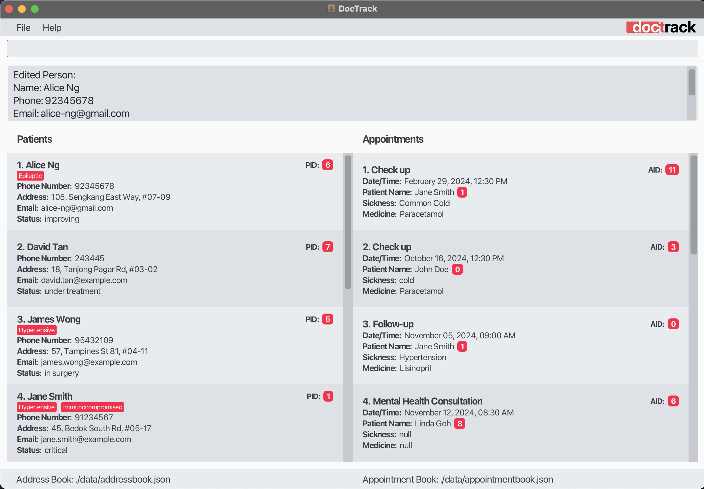

<br>


# **User Guide**

<box type="info" light theme="primary">
<b>DocTrack</b> is a desktop application for <b>general practitioners (GPs)</b> to quickly access patient contact 
details, appointments, and treatment records.
</box>

With **DocTrack**, you can take the first step towards digitalisation of your practice!
**DocTrack** aims to simplify your patient and appointment tracking process, by allowing you to
- easily add and update patient and appointment records
- delete records for regulation purposes
- search for records based on important criteria such as dates and names
with an intuitive and user-friendly interface!

To get started, you can read the introduction below, which shows all the different sections
in this user guide.

<!-- * Table of Contents -->
<page-nav-print></page-nav-print>

---

<div style="page-break-after: always;"></div>

## **Introduction**

<box type="tip" light>

<a href="#quick-start" class="badge bg-success">Quick Start</a>

Quickly get started with DocTrack!

Click on this section for a quick set-up guide, with examples of commands that you can use, out of the box.

</box>

<box type="info" light>

<a href="#interacting-with-doctrack" class="badge bg-info">Interacting with DocTrack</a>

Learn how you can interact with DocTrack!

DocTrack functions through a set of commands. Click on this section to learn more.

</box>

<box type="definition" light>

<a href="#command-overview" class="badge bg-primary">Command Overview</a>

Click on this section to know more about the commands you can use in DocTrack.
For more specifics, click on the subsections below.

<box light>

<a href="#person-commands" class="badge bg-dark">Person commands</a>
Click on this section for a rough summary of all the commands related to persons.

</box>

<box light>

<a href="#appointment-commands" class="badge bg-dark">Appointment commands</a>
Click on this section for a rough summary of all the commands related to appointments.

</box>

<box light>

<a href="#general-commands" class="badge bg-dark">General commands</a>
Click on this section for a rough summary of all the general commands.

</box>

</box>

<box type="warning" light>

<a href="#faq" class="badge bg-warning">FAQs</a>

Have questions? Read here to see answer to commonly asked questions.

</box>

<box type="warning" light>

<a href="#known-issues" class="badge bg-warning">Known issues</a>

Having a problem? Read here to see some common issues that may arise while you are using DocTrack.

</box>

<br>

---

<div style="page-break-after: always;"></div>

<br>

## **Quick start**

1. Ensure you have Java `17` or above installed in your computer.
   - To install `Java 17`, download Java. Refer to the [guide for installing Java](https://docs.oracle.com/en/java/javase/17/install/overview-jdk-installation.html).
     - Alternatively, download it from [here](https://www.oracle.com/java/technologies/javase/jdk17-archive-downloads.html).
   - To check your Java version, refer [here](https://www.java.com/en/download/help/version_manual.html#).

<br>

2. You can download our latest release file from [here](https://github.com/se-edu/addressbook-level3/releases). It 
   is a `.jar` file. For more information, you can refer to: 
   - [What is a JAR file?](https://docs.oracle.com/javase/8/docs/technotes/guides/jar/jarGuide.html)
   - [How to run a JAR file](https://stackoverflow.com/questions/5774970/run-jar-file-in-command-prompt).

<br>

3. Copy the file to the folder you want to use as the _home folder_ for your DocTrack application. 
   - The DocTrack application will create a `data` folder in this _home folder_ to store your [data files](#faq).

<br>

4. Open a [command terminal](https://developer.mozilla.org/en-US/docs/Learn/Tools_and_testing/Understanding_client-side_tools/Command_line) of your preference, and run the commands:
    ```
    cd HOME_FOLDER
    java -jar DocTrack.jar
   ```
    **_Example:_** if you copied `DocTrack.jar` into the folder `C:/Users/user/Documents`,
    run the commands:
    ```
   cd C:/Users/user/Documents
   java -jar DocTrack.jar
   ```

<br>

5. A GUI similar to the one below should appear in a few seconds. Note how the DocTrack application contains some sample data.
   <br>
   

<br>

6. Type the command in the command box, which is indicated by `Enter command here...`. Press `Enter` to execute it.<br>
   _**Example:** Typing **`help`** and pressing `Enter` will open the help window._<br>
   
   Some other examples of commands you can enter:
   * `list person` : Lists all contacts.
   * `add person n/John Doe p/98765432 e/johnd@example.com a/John street, block 123, #01-01 st/recovering` : Adds a contact named `John Doe` to the Address Book.
   * `delete person 3` : Deletes the 3rd contact shown in the current list.
   * `clear person` : Deletes all contacts.
   * `exit` : Exits the app.

<br>

<box type="tip" light>

**Tip:**

This would be a good time to run the `clear person` command, to start afresh without sample data.

</box>

<br>

7. You can refer to the <a href="#command-overview" class="badge bg-primary">Command Overview</a> below for details of each command. 
    * You can also go to the specific subsections:
   <a href="#person-commands" class="badge bg-dark">Person commands</a>
    <a href="#appointment-commands" class="badge bg-dark">Appointment commands</a>
    <a href="#general-commands" class="badge bg-dark">General commands</a>

<br>

<div style="page-break-after: always;"></div>

---

<br>

## **Interacting with DocTrack**

All interactions with the DocTrack platform are done through a series of **commands** 
(explained in <a href="#command-overview" class="badge bg-primary">Command Overview</a>) entered by you. 
- These commands allow you to perform various **tasks**, such as adding, editing, listing, deleting, finding,
and clearing persons/appointments. 
- The commands are designed to be flexible and user-friendly. 
  - You can add fields in any order.
  - You can add multiple entries for specific fields.

<box type="tip" light>

Here are some **key points** to keep in mind when you are using the commands:

- You should supply **all** the fields (words in **`UPPER_CASE`**) that are needed for a command.<br>
  _**Example:** In `add person n/NAME`, **`NAME`** is a field which can be used as `add person n/John Doe`._

- The **`INDEX`** in command formats like `edit person INDEX` and `delete appt INDEX` refers to the index 
  number (shown beside the person or appointment) in the displayed list. The index **must be a positive integer i.e. 1, 2, 3...** <br>
  _**Example:** The index of the first person displayed at the top the list is `1`, the index of the second person displayed is `2`, and so on._

- Items in **square** brackets **`[]`** are **optional**. <br>
  _**Example:** `n/NAME [t/TAG]` can be used as `n/John Doe t/friend` or as `n/John Doe`._

- Items with `…​` after them can be used **zero times or more times**. <br>
  _**Example:**`[t/TAG]…​` can be used as ` ` (i.e. 0 times), `t/friend`, `t/friend t/family` etc._

- You can add fields in **any order**. <br>
  _**Example:** If the command specifies `n/NAME p/PHONE_NUMBER`, then `p/PHONE_NUMBER n/NAME` is also acceptable._

<box type="tip" theme="success" light style="border: 1px solid">

**Tip:** 

If you add extraneous fields for commands that do not take in fields (such as `help`, `list person`, 
`list appt`, `exit` and `clear`), they will be ignored. <br>
_**Example:** If the command specifies `help 123`, then it will be interpreted as `help`._

</box>

<box type="warning" light style="border: 1px solid red">

**Caution:**

If you are using a PDF version of this document, be careful when copying and pasting commands that span multiple lines. This is because some space characters surrounding line-breaks may be omitted when copied over.

</box>

</box>

<div style="page-break-after: always;"></div>

<br>

---

<br>

## **Command Overview**

The following sections describe the various commands you can use in the DocTrack application.

---

<a href="#person-commands" class="badge bg-dark">Person commands</a>
Click this section to know more about the commands, or click on the individual commands below for information 
specific to those commands.

| Action                                                      | Format                                                                                    | Examples                                                                                                       |
|-------------------------------------------------------------|-------------------------------------------------------------------------------------------|----------------------------------------------------------------------------------------------------------------|
| **[Add person](#adding-a-person-add-person)**               | `add person n/NAME p/PHONE_NUMBER e/EMAIL a/ADDRESS st/STATUS [t/TAG]…​`                  | `add person n/John Doe p/98765432 e/johnd@example.com a/John street, block 123, #01-01 st/recovering t/friend` |
| **[List all persons](#listing-all-persons-list-person)**    | `list person`                                             <br/>                           | `list person`                                                                                                  |
| **[Edit person](#editing-a-person-edit-person)**            | `edit person INDEX [n/NAME] [p/PHONE_NUMBER] [e/EMAIL] [a/ADDRESS] [st/STATUS] [t/TAG]…​` | `edit person 2 n/James Lee e/jameslee@example.com`                                                             |
| **[Find person](#finding-persons-by-name-find-person)**     | `find person KEYWORD [MORE_KEYWORDS]`                                                     | `find person n/James Jake`                                                                                     |
| **[Delete person](#deleting-a-person-delete-person)**       | `delete person INDEX`                                                                     | `delete person 3`                                                                                              |
| **[Clear all persons](#clearing-all-persons-clear-person)** | `clear person`                                                                            | `clear person`                                                                                                 |

<br>

---

<a href="#appointment-commands" class="badge bg-dark">Appointment commands</a>
Click this section to know more about the commands, or click on the individual commands below for information
specific to those commands.

| Action                                                                   | Format                                                                                                                   | Examples                                                              |
|--------------------------------------------------------------------------|--------------------------------------------------------------------------------------------------------------------------|-----------------------------------------------------------------------|
| **[Add appointment](#adding-an-appointment-add-appt)**                   | `add appt i/PERSON_ID d/DATE_TIME ty/APPOINTMENT_TYPE [s/SICKNESS] [m/MEDICINE]`                   <br/>           <br/> | `add appt i/1 d/2024-12-01 09:30 ty/Consulation s/Diabetes m/Insulin` |
| **[List all appointments](#listing-all-appointments-list-appt)**         | `list appt`                                                                                                              | `list appt`                                                           |
| **[Edit appointment](#editing-an-appointment-edit-appt)**                | `edit appt INDEX [i/PERSON_ID] [d/DATE_TIME] [ty/APPOINTMENT_TYPE] [s/SICKNESS] [m/MEDICINE]`                            | `edit appt 3 d/2024-12-05 13:00 m/Panadol`                            |
| **[Find appointment](#finding-appointments-by-name-and-date-find-appt)** | `find appt KEYWORD [MORE_KEYWORDS]`                                                                                      | `find appt d/2024-12-05`                                              |
| **[Delete appointment](#deleting-an-appointment-delete-appt)**           | `delete appt INDEX`                                                                                                      | `delete appt 2`                                                       |
| **[Clear all appointments](#clearing-all-appointments-clear-appt)**      | `clear appt`                                                                     <br/>                                   | `clear appt`                                                          |

<br>

---

<a href="#general-commands" class="badge bg-dark">General commands</a>
Click this section to know more about the commands, or click on the individual commands below for information
specific to those commands.

| Action                                | Format | Examples |
|---------------------------------------|--------|----------|
| **[Help](#viewing-help-help)**        | `help` | `help`   |
| **[Exit](#exiting-the-program-exit)** | `exit` | `exit`   |

<br>

<div style="page-break-after: always;"></div>

---

### **Person Commands**

A **person** is a patient with several fields. The fields and their corresponding prefixes are as follows:

| Field            | Prefix | Optional | Multiple |
|------------------|--------|----------|----------|
| **Name**         | `n/`   | No       | No       |
| **Phone number** | `p/`   | No       | No       |
| **Email**        | `e/`   | No       | No       |
| **Address**      | `a/`   | No       | No       |
| **Status**       | `st/`  | No       | No       |
| **Tag(s)**       | `t/`   | Yes      | Yes      |

You can identify these patients uniquely by their **patient ID (PID)** for easy reference. 

<br>

 You can also manage the patient information through different commands, which can be seen in the table below:

| Action                                                      | Format                                                                                    | Examples                                                                                                       |
|-------------------------------------------------------------|-------------------------------------------------------------------------------------------|----------------------------------------------------------------------------------------------------------------|
| **[Add person](#adding-a-person-add-person)**               | `add person n/NAME p/PHONE_NUMBER e/EMAIL a/ADDRESS st/STATUS [t/TAG]…​`                  | `add person n/John Doe p/98765432 e/johnd@example.com a/John street, block 123, #01-01 st/recovering t/friend` |
| **[List all persons](#listing-all-persons-list-person)**    | `list person`                                             <br/>                           | `list person`                                                                                                  |
| **[Edit person](#editing-a-person-edit-person)**            | `edit person INDEX [n/NAME] [p/PHONE_NUMBER] [e/EMAIL] [a/ADDRESS] [st/STATUS] [t/TAG]…​` | `edit person 2 n/James Lee e/jameslee@example.com`                                                             |
| **[Find person](#finding-persons-by-name-find-person)**     | `find person KEYWORD [MORE_KEYWORDS]`                                                     | `find person n/James Jake`                                                                                     |
| **[Delete person](#deleting-a-person-delete-person)**       | `delete person INDEX`                                                                     | `delete person 3`                                                                                              |
| **[Clear all persons](#clearing-all-persons-clear-person)** | `clear person`                                                                            | `clear person`                                                                                                 |

<br>

##### Adding a person: `add person`

You can add a person to the patient book.

**Format**: `add person n/NAME p/PHONE_NUMBER e/EMAIL a/ADDRESS st/STATUS [t/TAG]…​`

<box type="tip" light>

**Tip:** A person can have any number of tags (including 0). <br>
_**Example:** `t/friend t/likes coding` has 2 tags and it is valid._

</box>

**Examples**:

- `add person n/John Doe p/98765432 e/johnd@example.com a/John street, block 123, #01-01 st/recovering` 
  adds a person named `John Doe` with phone number `98765432`, email `johnd@example.com`, and address `John street, block 123, #01-01`, and status `recovering`.
- `add person n/Betsy Crowe t/friend e/betsycrowe@example.com a/Newgate Prison p/1234567 st/recovered t/criminal` adds a person named `Betsy Crowe` with email `betsycrowe@example.com`, address `Newgate 
  Prison`, phone number `1234567`, status `recovered`, and the tags `friend` and `criminal`.

<box style="background: #eeeeee">

**Navigate back to the subsections here:**
<a href="#command-overview" class="badge bg-primary">Command overview</a> 
<a href="#person-commands" class="badge bg-dark">Person commands</a> 
<a href="#appointment-commands" class="badge bg-dark">Appointment commands</a>
<a href="#general-commands" class="badge bg-dark">General commands</a>

</box>

<br>

##### Listing all persons : `list person`

You can view a list of all persons in the patient book.

**Format**: `list person` shows the list of all patients on the screen.

<box style="background: #eeeeee">

**Navigate back to the subsections here:**
<a href="#command-overview" class="badge bg-primary">Command overview</a>
<a href="#person-commands" class="badge bg-dark">Person commands</a>
<a href="#appointment-commands" class="badge bg-dark">Appointment commands</a>
<a href="#general-commands" class="badge bg-dark">General commands</a>

</box>

<br>

##### Editing a person : `edit person`

Edits an existing patient in DocTrack.

**Format**: `edit person INDEX [n/NAME] [p/PHONE] [e/EMAIL] [a/ADDRESS] [st/STATUS] [t/TAG]…​`

- Edits the patient at the specified `INDEX`.
- At least one of the optional fields must be provided.
- Existing values will be updated to the input values.
- When editing tags, the existing tags of the person will be removed i.e. adding of tags is not cumulative.
- You can remove all the person’s tags by typing `t/` without
  specifying any tags after it.

**Examples**:

- `list` followed by `edit person 1 p/91234567 e/johndoe@example.com` edits the phone number and email 
  address of the first person in the list to be `91234567` and `johndoe@example.com` respectively.
- `list` followed by `edit person 2 n/Betsy Crower t/` edits the name of the second person in the list to 
  be `Betsy Crower` and clears all existing tags.

<box type="tip" light>

**Tip:** When trying to add tags while keeping existing tags, remember to type in all the pre-existing tags with your new tags
</box>

<box style="background: #eeeeee">

**Navigate back to the subsections here:**
<a href="#command-overview" class="badge bg-primary">Command overview</a>
<a href="#person-commands" class="badge bg-dark">Person commands</a>
<a href="#appointment-commands" class="badge bg-dark">Appointment commands</a>
<a href="#general-commands" class="badge bg-dark">General commands</a>

</box>

<br>

##### Finding persons by name: `find person`

You can find person(s) whose **names** contain any of the given keywords.

**Format**: `find person KEYWORD [MORE_KEYWORDS]`

- Use the prefix `n/` to search for names.
- The search is case-insensitive. e.g. `hans` will match `Hans`
- The order of the keywords does not matter. e.g. `Hans Bo` will match `Bo Hans`
- Only the name is searched.
- Only full words will be matched e.g. `Han` will not match `Hans`
- Persons matching at least one keyword will be returned (i.e. `OR` search).
  e.g. `Hans Bo` will return `Hans Gruber`, `Bo Yang`

**Examples**:

- `find person n/John` returns `john` and `John Doe` 
- `find person n/alex david` returns `Alex Yeoh`, `David Li`<br><br>
  

<box style="background: #eeeeee">

**Navigate back to the subsections here:**
<a href="#command-overview" class="badge bg-primary">Command overview</a>
<a href="#person-commands" class="badge bg-dark">Person commands</a>
<a href="#appointment-commands" class="badge bg-dark">Appointment commands</a>
<a href="#general-commands" class="badge bg-dark">General commands</a>

</box>

<br>

##### Deleting a person : `delete person`

You can delete a specified person from the patient book.

**Format**: `delete person INDEX`

- Deletes the person at the specified `INDEX`.

<box type="warning" light>

**Warning:** This action is irreversible. Ensure you have selected the correct person before deleting.
Note that deleting a person will also delete all related appointments.

</box>

<box type="tip" light>

**Tip:** Make you have the correct index of the patient before deleting. Use `list person` to check

</box>

**Examples**:

- `list` followed by `delete person 2` deletes the second person in the list.
- `find Betsy` followed by `delete person 1` deletes the first person in the results of the `find` command.

<box style="background: #eeeeee">

**Navigate back to the subsections here:**
<a href="#command-overview" class="badge bg-primary">Command overview</a>
<a href="#person-commands" class="badge bg-dark">Person commands</a>
<a href="#appointment-commands" class="badge bg-dark">Appointment commands</a>
<a href="#general-commands" class="badge bg-dark">General commands</a>

</box>

<br>

##### Clearing all persons : `clear person`

You can delete all person entries from the patient book.

**Format**: `clear person`

<box type="warning" light>

**Warning:** This action is irreversible. Ensure you have a backup of the patient data before clearing. 
Note that this will also clear the appointment data.

</box>

<box style="background: #eeeeee">

**Navigate back to the subsections here:**
<a href="#command-overview" class="badge bg-primary">Command overview</a>
<a href="#person-commands" class="badge bg-dark">Person commands</a>
<a href="#appointment-commands" class="badge bg-dark">Appointment commands</a>
<a href="#general-commands" class="badge bg-dark">General commands</a>

</box>

<br>

<div style="page-break-after: always;"></div>

---

<br>

### **Appointment Commands**

An **appointment** is defined by several fields. The fields and their corresponding prefixes are as follows:

| Field               | Prefix | Optional | Multiple |
|---------------------|--------|----------|----------|
| **Person ID**       | `i/`   | No       | No       |
| **Appointment Type**| `ty/`  | No       | No       |
| **Date and Time**   | `d/`   | No       | No       |
| **Sickness**        | `s/`   | Yes      | No       |
| **Medicine**        | `m/`   | Yes      | No       |

You can manage the appointments through different commands, which can be seen in the table below:

<br>

| Action                                                                   | Format                                                                                                                   | Examples                                                              |
|--------------------------------------------------------------------------|--------------------------------------------------------------------------------------------------------------------------|-----------------------------------------------------------------------|
| **[Add appointment](#adding-an-appointment-add-appt)**                   | `add appt i/PERSON_ID d/DATE_TIME ty/APPOINTMENT_TYPE [s/SICKNESS] [m/MEDICINE]`                   <br/>           <br/> | `add appt i/1 d/2024-12-01 09:30 ty/Consulation s/Diabetes m/Insulin` |
| **[List all appointments](#listing-all-appointments-list-appt)**         | `list appt`                                                                                                              | `list appt`                                                           |
| **[Edit appointment](#editing-an-appointment-edit-appt)**                | `edit appt INDEX [i/PERSON_ID] [d/DATE_TIME] [ty/APPOINTMENT_TYPE] [s/SICKNESS] [m/MEDICINE]`                            | `edit appt 3 d/2024-12-05 13:00 m/Panadol`                            |
| **[Find appointment](#finding-appointments-by-name-and-date-find-appt)** | `find appt KEYWORD [MORE_KEYWORDS]`                                                                                      | `find appt d/2024-12-05`                                              |
| **[Delete appointment](#deleting-an-appointment-delete-appt)**           | `delete appt INDEX`                                                                                                      | `delete appt 2`                                                       |
| **[Clear all appointments](#clearing-all-appointments-clear-appt)**      | `clear appt`                                                                     <br/>                                   | `clear appt`                                                          |

<br>

##### Adding an appointment: `add appt`

You can an appointment to DocTrack. 

**Format**: `add appt i/PERSON_ID ty/APPOINTMENT_TYPE d/DATE_TIME [s/SICKNESS] [m/MEDICINE]`
- The format of `DATE_TIME` is `yyyy-MM-dd HH:mm`. For example, `2025-03-20 10:30`.

**Examples**:

- `add appt i/1 ty/Consulation d/2024-12-01 09:30 s/Diabetes m/Insulin` adds an appointment to the person with personId `1`. The appointment has appointment type `Consulation`, date and time `2024-12-01 09:30`, sickness `Diabetes`, and medicine `Insulin`.
- `add appt i/2 ty/Follow-up d/2024-02-01 16:40 s/Asthma m/Inhaler` adds an appointment to the person with personId `2`. The appointment has appointment type `Follow-up`, date and time `2024-02-01 16:40`, sickness `Asthma`, and medicine `Inhaler`.

<box type="info" light seamless>

**Note:** Although you type `DATE_TIME` in the format `yyyy-MM-dd HH:mm`, you will see it displayed as `Month Date, Year, Time`. <br>
_**Example:** You will see `2024-12-10 12:30` displayed as `December 10, 2024, 12:30 PM`._

</box>

<box type="tip" light>

**Tip:** You can decide to leave out sickness and medicine inputs when adding them, then edit them later.
</box>

<br>

<box style="background: #eeeeee">

**Navigate back to the subsections here:**
<a href="#command-overview" class="badge bg-primary">Command overview</a>
<a href="#person-commands" class="badge bg-dark">Person commands</a>
<a href="#appointment-commands" class="badge bg-dark">Appointment commands</a>
<a href="#general-commands" class="badge bg-dark">General commands</a>

</box>

<br>

##### Listing all appointments : `list appt`

You can view a list of all appointments in the appointment book.

**Format**: `list appt`

<box style="background: #eeeeee">

**Navigate back to the subsections here:**
<a href="#command-overview" class="badge bg-primary">Command overview</a>
<a href="#person-commands" class="badge bg-dark">Person commands</a>
<a href="#appointment-commands" class="badge bg-dark">Appointment commands</a>
<a href="#general-commands" class="badge bg-dark">General commands</a>

</box>

<br>

##### Editing an appointment : `edit appt`

You can an existing appointment in appointment book.

**Format**: `edit appt INDEX [i/PERSON_ID] [d/DATE_TIME] [ty/APPOINTMENT_TYPE] [s/SICKNESS] [m/MEDICINE]`

- Edits the appointment at the specified `INDEX`.
- At least one of the optional fields must be provided.
- Existing values will be updated to the input values.
- The format of `DATE_TIME` is `yyyy-MM-dd HH:mm`. For example, `2025-03-20 10:30`.

**Examples**:

- `edit appt 3 d/2024-12-05 13:00 m/Budesonide` edits the date and time and the medicine to be `2024-12-05 13:00` and `Budesonide` respectively.

<br>

<box style="background: #eeeeee">

**Navigate back to the subsections here:**
<a href="#command-overview" class="badge bg-primary">Command overview</a>
<a href="#person-commands" class="badge bg-dark">Person commands</a>
<a href="#appointment-commands" class="badge bg-dark">Appointment commands</a>
<a href="#general-commands" class="badge bg-dark">General commands</a>

</box>

<br>

##### Finding appointments by name and date: `find appt`

You can find appointments whose person names and / or dates contain any of the given keywords.

**Format**: `find appt KEYWORD [MORE_KEYWORDS]`
- Use the prefix `n/` to search for patient names.
- Use the prefix `d/` to search for dates.
- At least one keyword must be provided.
- The format of `DATE` is `YYYY-MM-DD`. For example, `2024-10-16`.

**Examples**:
- `find appt n/John` returns appointments with patients named `John`.
- `find appt d/2024-12-05` returns appointments on `2024-12-05`.
- `find appt n/John d/2024-12-05` returns appointments with patients named `John`, and is on `2024-12-05`.

<br>


<br>

<box type="tip" light>

**Tip:** Use the `find appt` command to filter out appointments for a certain day or patient

</box>

<br>

<box style="background: #eeeeee">

**Navigate back to the subsections here:**
<a href="#command-overview" class="badge bg-primary">Command overview</a>
<a href="#person-commands" class="badge bg-dark">Person commands</a>
<a href="#appointment-commands" class="badge bg-dark">Appointment commands</a>
<a href="#general-commands" class="badge bg-dark">General commands</a>

</box>

<br>

##### Deleting an appointment : `delete appt`

You can delete a specified appointment from appointment book.

**Format**: `delete appt INDEX`

- Deletes the appointment at the specified `INDEX`.

<box type="warning" light>

**Warning:** This action is irreversible. Ensure you have selected the correct appointment before deleting.

</box>

**Examples**:

- `list appt` followed by `delete appt 2` deletes the second appointment in the list of appointments.
- `find appt d/2024-12-05` followed by `delete appt 1` deletes the first appointment in the results of the 
  `find` command.


<br>

<box type="tip" light>

**Tip:** Use the `list appt` to check the index of the appointment before deleting one.

</box>
<br>

<box style="background: #eeeeee">

**Navigate back to the subsections here:**
<a href="#command-overview" class="badge bg-primary">Command overview</a>
<a href="#person-commands" class="badge bg-dark">Person commands</a>
<a href="#appointment-commands" class="badge bg-dark">Appointment commands</a>
<a href="#general-commands" class="badge bg-dark">General commands</a>

</box>

<br>

##### Clearing all appointments : `clear appt`

You can delete all appointment entries from the appointment book.

**Format**: `clear appt`

<box type="warning" light>

**Warning:**
This action is irreversible. Ensure you have a backup of the appointment data before clearing.

</box>

<br>

<box style="background: #eeeeee">

**Navigate back to the subsections here:**
<a href="#command-overview" class="badge bg-primary">Command overview</a>
<a href="#person-commands" class="badge bg-dark">Person commands</a>
<a href="#appointment-commands" class="badge bg-dark">Appointment commands</a>
<a href="#general-commands" class="badge bg-dark">General commands</a>

</box>

<br>

<div style="page-break-after: always;"></div>

---

<br>

### **General Commands**

**General commands** can help you with miscellaneous tasks related to patient and appointment management.

| Action                                | Format | Examples |
|---------------------------------------|--------|----------|
| **[Help](#viewing-help-help)**        | `help` | `help`   |
| **[Exit](#exiting-the-program-exit)** | `exit` | `exit`   |

<br>

##### Viewing help : `help`

You will be able to view a help window that directs you to this user guide.

**Format**: `help`


<br><sbr>

<box style="background: #eeeeee">

**Navigate back to the subsections here:**
<a href="#command-overview" class="badge bg-primary">Command overview</a>
<a href="#person-commands" class="badge bg-dark">Person commands</a>
<a href="#appointment-commands" class="badge bg-dark">Appointment commands</a>
<a href="#general-commands" class="badge bg-dark">General commands</a>

</box>

<br>

##### Exiting the program : `exit`

You will be able to exit the DocTrack application. 

**Format**: `exit`

<br>

<box style="background: #eeeeee">

**Navigate back to the subsections here:**
<a href="#command-overview" class="badge bg-primary">Command overview</a>
<a href="#person-commands" class="badge bg-dark">Person commands</a>
<a href="#appointment-commands" class="badge bg-dark">Appointment commands</a>
<a href="#general-commands" class="badge bg-dark">General commands</a>

</box>

<br>

##### Saving the data

The data of the patients and appointments are saved in the hard disk automatically after you run any command that changes the data. You do not need to save them manually.
- For more information on how the data is stored, you can refer to <a href="#faq" class="badge bg-warning">FAQs</a>.

<br>

##### Editing the data file

For advanced users, feel free to update patient and appointment data directly by editing the [data files](#faq) in the 
`data` folder. Learn more here: <a href="#faq" class="badge bg-warning">FAQs</a>.

<box type="warning" light>

**Caution:**

- If your changes to the data file makes its format invalid, DocTrack will discard all data and start with an empty data file at the next run. Hence, it is recommended that you have a backup of the file before 
  editing it.<br>
- Furthermore, certain edits can cause DocTrack to behave in unexpected ways (e.g., if a value entered is outside the acceptable range). Therefore, you should edit the data file only if you are confident that you 
  can update it correctly.
</box>

<br>

<div style="page-break-after: always;"></div>

---

<br>

## **FAQ**

**Q**: How is my data stored?<br>
**A**: Your data is stored in [.json](https://www.json.org/json-en.html) files, located in the `data` folder. The details of patients are stored in the `addressbook.json` file, 
while the appointments are stored in the `appointmentbook.json` file.

Examples:

An example of how the persons are stored:

```json
{
  "persons": [
    {
      "personId": 0,
      "name": "Alex Yeoh",
      "phone": "87438807",
      "email": "alexyeoh@example.com",
      "address": "Blk 30 Geylang Street 29, #06-40",
      "status": "Recovering",
      "tags": [
        "friends"
      ]
    },
    {
      "personId": 1,
      "name": "Bernice Yu",
      "phone": "99272758",
      "email": "berniceyu@example.com",
      "address": "Blk 30 Lorong 3 Serangoon Gardens, #07-18",
      "status": "Stable",
      "tags": [
        "colleagues",
        "friends"
      ]
    }
  ]
}
```

An example of how the appointments are stored:

```json
{
  "appointments": [
    {
      "appointmentId": 0,
      "appointmentType": "Consultation",
      "appointmentDateTime": "2024-10-20T09:30",
      "personId": 0,
      "sickness": "Flu",
      "medicine": "Antiviral"
    },
    {
      "appointmentId": 1,
      "appointmentType": "Follow-up",
      "appointmentDateTime": "2024-10-22T14:00",
      "personId": 1,
      "sickness": "Diabetes",
      "medicine": "Insulin"
    }
  ]
}
```
<br><br>

**Q**: How do I transfer my data (in the `addressbook.json` and `appointmentbook.json` files) to another 
computer?<br>
**A**: 
1. Save the `addressbook.json` and `appointmentbook.json` files from the `data` folder in your current computer.
2. [Install the DocTrack app](#quick-start) in the other computer. 
3. When you run DocTrack, it creates empty [.json](https://www.json.org/json-en.html) files in the `data` 
   folder. 
4. Replace these empty files with the `addressbook.json` and `appointmentbook.json` files you saved from your previous computer.

<br>

**Q**: Can I access DocTrack without internet connection?<br>
**A**: Yes, You can run DocTrack without an internet connection.

<br>

**Q**: How do I back up my data?<br>
**A**: Since the data is saved in the `addressbook.json` and `appointmentbook.json` files in the `data` 
folder, you can copy these files to another location as a backup.

<br><br>

---

<br>

## **Known issues**

1. **When using multiple screens**, if you move the application to a secondary screen, and later switch to using only the primary screen, the GUI will open off-screen. The remedy is to delete the `preferences.json` file created by the application before running the application again.

<br>

2. **If you minimize the Help Window** and then run the `help` command (or use the `Help` menu, or the keyboard shortcut `F1`) again, the original Help Window will remain minimized, and no new Help Window will appear. The remedy is to manually restore the minimized Help Window.

<br>

3. On **MacOS systems**, the bold fonts may appear slightly clipped.

<br>
