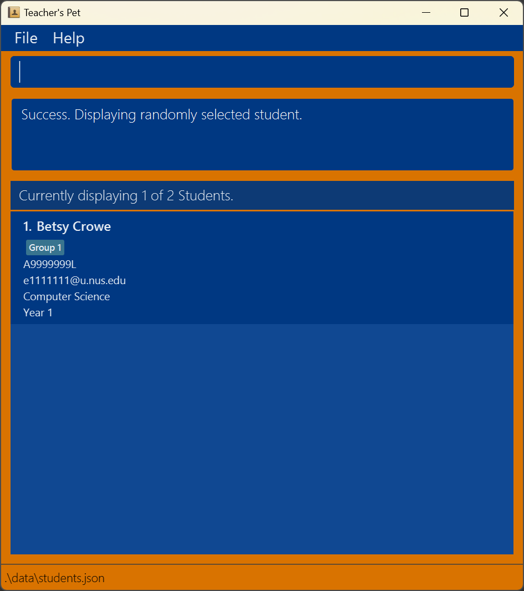

Teacher's Pet is a **desktop app for managing students, tailored for Teaching Assistants (TA) in the National University of Singapore (NUS)**. Teacher's Pet offers a lightweight, efficient solution optimized for small (<30 students) classes and works completely offline, promising performance even with an unstable network connection. 

To get started with Teacher's Pet, kindly refer to our [Quick Start](#quick-start) guide. 

If you simply need to find a command, you can refer to our [Command Summary](#command-summary) for the full list of commands and how to use them. 

Have a question? You might find the answer in our [FAQ](#faq) section.

* Table of Contents
{:toc}

--------------------------------------------------------------------------------------------------------------------

## Quick Start

You can refer to the [FAQ](#frequently-asked-questions-quick-start) section below for more information.

1. Ensure you have Java `17` or above installed in your Computer. You may download Java 17 through [this link](https://www.oracle.com/java/technologies/javase/jdk17-archive-downloads.html). 

2. Download the latest `teacherspet.jar` file from [here](https://github.com/AY2425S1-CS2103T-W10-1/tp/releases/tag/v1.3). The downloaded file should be  found in your  `Downloads` folder.

3. Copy the file, make an empty folder in your `Documents` folder and paste `teacherspet.jar` in the new folder.

4. Open a command terminal, enter `cd Downloads/NAME_OF_YOUR_FOLDER`. Then, enter `java -jar teacherspet.jar` to run the application. 
   A window similar to the one below should appear in a few seconds. Note how the app contains some sample data. 
   

5. Type the command in the command box and press Enter to execute it. e.g. typing **`help`** and pressing Enter will open the help window. 
   Some example commands you can try:

   * `list` : Lists all students.

   * `add n/John Doe id/A1234567B nid/E1234567 m/Math y/2 g/group 1` : Adds a student named `John Doe` to the app.

   * `delete 3` : Deletes the 3rd student shown in the current list.

   * `clear` : Deletes all students.

   * `exit` : Exits the app.

6. Refer to [Commands](#commands) below for more details of each command. Alternatively, refer to [Command Summary](#command-summary) for a cheatsheet of commands and how to use them.

:bulb: **Tip:**
 If you want the app to be in another folder, you can copy the app to any folder you want. Just make sure to copy all files in the original folder (Not just the `teacherspet.jar` file).

### Frequently Asked Questions (Quick Start)

Back to [Quick Start](#quick-start)

**Q:** How do I check what version of Java I have on my device?   
**A:** You can refer to this [link](https://www.java.com/en/download/help/version_manual.html) for more information.

**Q:** I clicked the link to install Java 17, now which file should I download?  
**A:** You want to look for the file with `Installer` in its name for the Operating System of your device (eg. `macOS x64 DMG Installer` if you use an Apple device). After downloading the file, simply run it to install Java 17.

**Q:** How do I open a command terminal?  
**A:** If you are using a Windows device, search for `Windows PowerShell` or `Command Prompt`. If you are using a Mac/Apple device, search for `Terminal`.

**Q:** After running the app, some messages appear on my terminal, should I be concerned?  
**A:** If a window similar to the one in the image above appears, then the app is working well and you can safely ignore any messages on the terminal.
--------------------------------------------------------------------------------------------------------------------

## Commands

**:information_source: Notes about the command format:** 

* Words in `UPPER_CASE` are the parameters to be supplied by you. 
  e.g. in `add n/NAME`, `NAME` is a parameter which can be used as `add n/John Doe`.

* Items in square brackets are optional. 
  e.g `n/NAME [m/MAJOR]` can be used as `n/John Doe m/Business` or as `n/John Doe`.

* Parameters can be in any order. 
  e.g. if the command specifies `n/NAME id/NUS_STUDENTID`, `id/NUS_STUDENTID n/NAME` is also acceptable.

* If you are using a PDF version of this document, be careful when copying and pasting commands that span multiple lines as space characters surrounding line-breaks may be omitted when copied over to the application.

---

### Viewing help : `help`

Shows you a message containing a link to the user guide.

Format: `help`

---

### Adding a student: `add`

You can add a student easily to Teacher's Pet!

Format: `add n/NAME id/NUS_STUDENTID [nid/NUS_NETID] [m/MAJOR] [y/YEAR] [g/GROUP_NAME]`

* The `NUS_STUDENTID` here refers to the NUS Matriculation Number of the student (Starts with 'A')
* The `NUS_NETID` here refers to the id that is associated with the student's NUS Outlook account ("NUS_NETID@u.nus.edu")
* The `NUS_STUDENTID` must be unique (ie. Two students cannot have the same `NUS_STUDENTID`)

Here are some examples for you to try!
* `add n/John Doe id/A1234567P`
* `add n/Betsy Crowe m/Computer Science nid/e1111111 id/A9999999L y/1 g/Group 1`

---

### Editing a student : `edit`

Edits an existing student in Teacher's Pet.

Format: `edit INDEX [n/NAME] [id/STUDENTID] [nid/EMAIL] [m/MAJOR] [y/YEAR] [g/group GROUP_NUMBER]`

* Edits the student at the specified `INDEX`. The index refers to the index number shown in the displayed student list. The index **must be a positive integer** 1, 2, 3, …​
* At least one of the optional fields must be provided.
* Existing values will be updated to the input values.

Examples:
*  `edit 1 m/ Science nid/e1234567` Edits the major and NUS NetID of the 1st student to be `Science` and `e1234567` respectively.
*  `edit 2 n/Betsy Crower g/` Edits the name of the 2nd student to be `Betsy Crower` and clears all existing groups.

---

### Commenting on a student: `comment`

Comments on a student in Teacher's Pet.

Format: `comment INDEX c/COMMENT`

:bulb: **Tip:**
Each student can only have one comment, to delete a comment use the same command `comment INDEX c/` but without
any COMMENT.

* The index refers to the index number shown in the displayed student list. The index **must be a positive integer** 1, 2, 3, …​
* The COMMENT refers to any input you want to use as a comment.

Examples:
* `comment 1 c/Is always late to class.`
* `comment 1 c/`

---

### Listing all students : `list`

Shows a list of all students in Teachers' Pet.

Format: `list`

---

### Displaying students in a group : `show`

Shows a list of students in the same group(s)

Format: show KEYWORDS

* The KEYWORDS is the name of the group you would like to search for in your current list. For instance, use `group 1` (for group 1) …​
* The search is case-insensitive. e.g., `group 1` will match `GROUP 1`.
* The order of the keywords does not matter. e.g., `1 group` will match `group 1`.
* Only full words will be matched for names. e.g., `gro` will not match `group 1`.

Examples:
* `show 1` returns students with who are in group 1.
  

---

### Finding students by name or student ID: `find`

Finds students matching the specified criteria.

Format: `find [n/ NAME_KEYWORDS] [id/ STUDENT_IDS]`

* The search is case-insensitive. e.g., `hans` will match `Hans`.
* The order of the keywords does not matter. e.g., `Hans Bo` will match `Bo Hans`.
* Only full words will be matched for names. e.g., `Han` will not match `Hans`.
* Student IDs must match exactly.
* At least one of the optional prefixes must be provided.
* Students matching any of the criteria will be returned (i.e., `OR` search).
  e.g., `find n/ Hans Bo id/ A1234567E` will return students whose names contain `Hans` or `Bo`, or whose student ID is `A1234567E`.

Examples:
* `find n/ John` returns students with names containing `John`.
* `find id/ A1234567E A2345678B` returns students with student IDs `A1234567E` or `A2345678B`.
* `find n/ alex david` returns `Alex Yeoh`, `David Li` 
  
* `find n/ Alice id/ A1234567E` returns students whose name contains `Alice` or whose student ID is `A1234567E`.

---

### Selecting a student randomly: `random`

You can randomly select a student from the current list! For example, you may want to randomly select a student to answer your question.

:bulb: **Tip:**
The student is randomly chosen from the currently displayed list. So you can use the `show` command first before using `random` if you want to select a random student from a particular group.

Format: `random`

---

### Deleting a student : `delete`

Deletes the specified student from the address book.

Format: `delete INDEX`

* The delete command deletes the student at the specified `INDEX`.
* The index refers to the index number shown in the displayed student list.
* The index **must be a positive integer** 1, 2, 3, …​

Examples:
* `list` followed by `delete 2` deletes the 2nd student in the list.
* `find /n Nic` followed by `delete 1` deletes the 1st student named Nic.

Expected Results:
* If successful, you will be notified on which student you have deleted.

Common Errors:
* It is likely you are facing an error due to incorrect `INDEX` being used.
* Within the application you will be notified on the exact error and how to rectify it. 

---

### Clearing all entries : `clear`

Clears all your students entries from Teacher's Pet.

:exclamation: **Caution:**
All students stored in Teacher's Pet will be deleted permanently and this command cannot be undone.
If you wish to save a copy of the data, refer to [FAQ](#faq) for more info)

Format: `clear`

---

### Exiting the program : `exit`

Exits from Teacher's Pet.

Format: `exit`

---
## Data Management

### Saving the data

Teacher's Pet data is saved in the hard disk automatically after any command that changes the data. There is no need to save manually.

### Editing the data file (Advanced)

Teacher's Pet data is saved automatically as a JSON file `[JAR file location]/data/addressbook.json`. Advanced users are welcome to update data directly by editing that data file.

:exclamation: **Caution:**
If your changes to the data file makes its format invalid, Teacher's Pet will discard all data and start with an empty data file at the next run. Hence, it is recommended to take a backup of the file before editing it. 
Furthermore, certain edits can cause Teacher's Pet to behave in unexpected ways (e.g., if a value entered is outside of the acceptable range). Therefore, edit the data file only if you are confident that you can update it correctly.

--------------------------------------------------------------------------------------------------------------------

## FAQ

**Q**: Where is my data saved? 
**A**: The data file for Teacher's Pet is named `students.json` and is saved in `[JAR file location]/data/students.json` by default. (ie, if your `teacherspet.jar` file is in `Documents` then the data file is found in `Documents/data/students.json`)

**Q**: How do I transfer my data to another Computer? 
**A**: 
1. Install the app on the other computer 
2. Run the app on the other computer (See [Quick Start](#quick-start) above) 
3. Find the data file on the other computer (See above) and replace the `students.json` file with the `students.json` file from the previous computer

**Q**: How do I keep a copy of my data? 
**A**: Find the `students.json` file and copy it to your desired location/storage device

**Q**: What is the maximum size of my student list? 
**A**: The maximum size is 2,147,483,647 students.

**Q**: Does the application require internet connection to run? 
**A**: After installation, the application does not require internet connection. Files are saved locally.

--------------------------------------------------------------------------------------------------------------------

## Known issues

1. **When using multiple screens**, if you move the application to a secondary screen, and later switch to using only the primary screen, the GUI will open off-screen. The remedy is to delete the `preferences.json` file created by the application before running the application again.
2. **If you minimize the Help Window** and then run the `help` command (or use the `Help` menu, or the keyboard shortcut `F1`) again, the original Help Window will remain minimized, and no new Help Window will appear. The remedy is to manually restore the minimized Help Window.

--------------------------------------------------------------------------------------------------------------------

## Command summary

Action | Format, Examples
--------|------------------
**Help** | `help`
**Add** | `add n/NAME id/NUS_STUDENTID [nid/NUS_NETID] [m/MAJOR] [y/YEAR] [g/GROUP_NAME]`   e.g., `add n/James Ho id/A1234567X nid/E1234567 m/Computer Science y/2 g/Group 4`
**Edit** | `edit INDEX [n/NAME] [id/STUDENTID] [nid/EMAIL] [m/MAJOR] [y/YEAR] [g/group GROUP_NUMBER]`  e.g.,`edit 1 n/James Lee m/4`
**Comment** | `comment INDEX c/COMMENT`  e.g., `comment 1 c/Is always late to class`
**List** | `list`
**Show** | `show GROUP_NAME`
**Find** | `find [n/ NAME_KEYWORDS] [id/ STUDENT_IDS]`  e.g., `find n/ James Jake`, `find id/ A1234567E A2345678B`, `find n/ Alice id/ A1234567E`
**Random** | `random`
**Delete** | `delete INDEX`  e.g., `delete 3`
**Clear** | `clear`
**Exit** | `exit`
