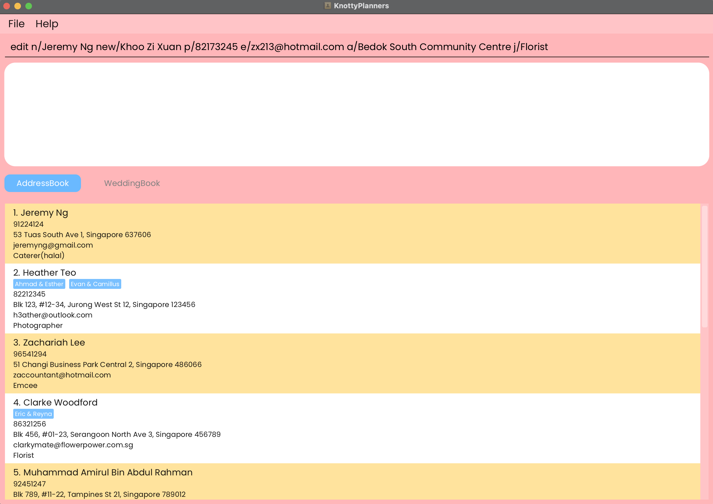

# Knotty Planner 💍🎀

Knotty Planner is a **desktop app for wedding planners, optimised for use via a Command Line Interface** (CLI) while still having the benefits of a Graphical User Interface (GUI). If you are a wedding planner who can type fast, Knotty Planner can make organising weddings a walk in the park!

<!-- * Table of Contents -->
## Table of Contents
- [Quick Start](#quick-start)        
- [Features](#features)
- [FAQ](#FAQ)
- [Known issues](#Known-issues)
- [Command summary](#Command-summary)

<page-nav-print />

--------------------------------------------------------------------------------------------------------------------

## Quick start

1. Ensure you have Java `17` or above installed in your Computer.

1. Download the latest `.jar` file from [here](https://github.com/AY2425S1-CS2103T-W13-4/tp/releases).

1. Copy the file to the folder you want to use as the _home folder_ for your Knotty Planner.

1. Open a command terminal, `cd` into the folder you put the jar file in, and use the `java -jar KnottyPlanner.jar` command to run the application. 
   A GUI similar to the below should appear in a few seconds. Note how the app contains some sample data. 
   

1. Type the command in the command box and press Enter to execute it. e.g. typing **`help`** and pressing Enter will open the help window. 
   Some example commands you can try:

   * `list` : Lists all contacts.

   * `add n/John Doe p/98765432 e/johnd@example.com a/John street, block 123, #01-01 j/Photographer` : Adds a contact named `John Doe` to the Address Book.

   * `delete n/John Doe` followed by `delete-y` : Deletes the contact named John Doe in the contacts list.

   * `clear` : Deletes all contacts.

   * `exit` : Exits Knotty Planner.

1. Refer to the [Features](#features) below for details of each command.

--------------------------------------------------------------------------------------------------------------------

## Features

<box type="info" seamless>

**Notes about the command format:** 

* Words in `UPPER_CASE` are the parameters to be supplied by the user. 
  e.g. in `add n/NAME`, `NAME` is a parameter which can be used as `add n/John Doe`.

* Items with `…`​ after them can be used multiple times including zero times. 
  e.g. `[t/TAG]…​` can be used as ` ` (i.e. 0 times), `t/friend`, `t/friend t/family` etc.

* Parameters can be in any order. 
  e.g. if the command specifies `n/NAME p/PHONE_NUMBER`, `p/PHONE_NUMBER n/NAME` is also acceptable.

* Extraneous parameters for commands that do not take in parameters (such as `help`, `list`, `exit` and `clear`) will be ignored. 
  e.g. if the command specifies `help 123`, it will be interpreted as `help`.

* If you are using a PDF version of this document, be careful when copying and pasting commands that span multiple lines as space characters surrounding line-breaks may be omitted when copied over to the application.
</box>

### Viewing help : `help`

If you require additional assistance, the `help` command shows a message with a link to the user guide,
explaining how to use the commands with detailed descriptions.

Format: `help`

### Adding a person: `add`

Adds a person to the contact list.

Format: `add n/NAME p/PHONE_NUMBER e/EMAIL a/ADDRESS j/JOB [t/TAG]`

<box type="tip" seamless>

**Tip:** Fields can be added in any order. The order of the fields does not matter.
**Tip:** A person can have any number of tags (including 0)

</box>

Examples:
* `add n/John Doe p/98765432 e/johnd@example.com a/John street, block 123, #01-01 j/Photographer`
* `add n/Betsy Crowe t/friend e/betsycrowe@example.com a/Newgate Prison p/1234567 j/Caterer`

### Listing All Contacts : `list`

Shows a list of all persons in the contact list.

Format: `list`

### Adding a wedding: `add-wedding`

Adds a person to the contact list.

Format: `add-wedding w/NAME & NAME v/VENUE d/DATETIME`

Examples:
* `add-wedding w/Jonus Ho & Izzat Syazani v/Pasir Ris Hotel d/11/11/2024`

<box type="tip" seamless>

**Tip:** Fields can be added in any order. The order of the fields does not matter.
**Tip:** Datetime must be a valid date in the format of dd/MM/yyyy

</box>

Examples:
* `add-wedding w/John Loh & Jean Tan v/Orchard Hotel d/15/10/2022`
* `add-wedding w/Jonus Ho & Izzat Syazani v/Pasir Ris Hotel d/02/11/2022`

### Editing A Contact : `edit`

Edits an existing person in the address book.

Format: `edit n/NAME [n/NAME] [p/PHONE] [e/EMAIL] [a/ADDRESS] [j/JOB] [t/TAG]`

* Edits the person with the specified `NAME`.
* At least one of the optional fields must be provided.
* Existing values will be updated to the input values.
* When editing tags, the existing tags of the person will be removed i.e adding of tags is not cumulative.
* You can remove all the person’s tags by typing `t/` without
    specifying any tags after it.

Examples:
*  `edit n/John Doe p/91234567 e/johndoe@example.com` Edits the phone number and email address of John Doe to be `91234567` and `johndoe@example.com` respectively.
*  `edit n/Betsy Crower t/` Edits the name of the 2nd person to be `Betsy Crower` and clears all existing tags.

### Tagging A Contact : `tag-add` / `tag-delete`

### Adding Tag(s) to A Contact
Add tag(s) to an existing person in the address book.

Format: `tag-add n/NAME t/TAG...`

* Tags the person with the specified `NAME`.
* Existing values will be updated together with the input values.

Examples:
*  `tag-add n/John Doe t/Adam and Eve 12 June t/Adam and Steve 16 June` Adds the tags `Adam and Eve 12 June`
and `Adam and Steve 16 June` to John Doe.
*  `tag-add n/Betsy Crower t/Wedding at Park Gala` Adds the tag `Wedding at Park Gala` to Betsy Crower.

### Deleting Tag(s) from A Contact
Delete tag(s) from an existing person in the address book.

Format: `tag-delete n/NAME t/TAG...`

* Deletes tag(s) from the person with the specified `NAME`.
* Existing values that match input values will be deleted.

Examples:
*  `tag-delete n/John Doe t/Adam and Eve 12 June t/Adam and Steve 16 June` Deletes the tags `Adam and Eve 12 June`
and `Adam and Steve 16 June` from John Doe.
*  `tag-delete n/Betsy Crower t/Wedding at Park Gala` Deletes the tag `Wedding at Park Gala` from Betsy Crower.

### Locating Contacts by name: `find`

Finds persons whose names contain any of the given keywords.

Format: `find KEYWORD [MORE_KEYWORDS]`

* The search is case-insensitive. e.g `hans` will match `Hans`
* The order of the keywords does not matter. e.g. `Hans Bo` will match `Bo Hans`
* Only the name is searched.
* Only full words will be matched e.g. `Han` will not match `Hans`
* Persons matching at least one keyword will be returned.
  e.g. `Hans Bo` will return `Hans Gruber`, `Bo Yang`

Examples:
* `find John` returns `john` and `John Doe`
* `find alex david` returns `Alex Yeoh`, `David Li` 

### Filtering Contacts by Job: `filter`

Filters persons whose jobs contain any of the given keywords.

Format: `filter KEYWORD [MORE_KEYWORDS]`

* The search is case-insensitive. e.g `photographer` will match `Photographer`
* The order of the keywords does not matter. e.g. `Photographer` will match `photographer`
* Only the job is searched.
* Only full words will be matched e.g. `photog` will not match `Photographer`
* Persons matching at least one keyword will be returned (i.e. `OR` search).
  e.g. `Photographer` will return `Photographer`, `Wedding Photographer`
* Persons matching all keywords will be returned (i.e. `AND` search).
  e.g. `Photographer Wedding` will return `Wedding Photographer`

Examples:
* `filter Photographer` returns `John` and `Ernest` whose jobs are photographers
* `filter caterer` returns `Adam` whose job is a caterer

### Deleting A Contact : `delete` followed by `delete-y` or `delete-n`

Deletes the specified person from the address book, with confirmation prompt.

Format: `delete INDEX` followed by `delete-y` or `delete-n`

* Deletes the person with the specified `NAME` from the address book.
* The contact's details are shown for confirmation.
* The contact is deleted if `delete-y` is entered.
* The contact is not deleted if `delete-n` is entered, cancelling the delete operation and nothing will occur.

Examples:
* `delete n/John Doe` followed by `delete-y` deletes the person named `John Doe` from the address book.
* `delete n/John Doe` followed by `delete-n` cancels the delete operation.

### Clearing all entries : `clear`

Clears all entries from the address book.

Format: `clear`

### Exiting the program : `exit`

Exits the program and saves data.

Format: `exit`

### Saving the data

Knotty Planner data will be saved in the hard disk automatically after any command that changes the data. There is no need to save manually.

### Editing the data file

* Knotty Planner data are saved automatically as a JSON file `[JAR file location]/data/knottyplanner.json`.
* Advanced users are welcome to update data directly by editing that data file.

<box type="warning" seamless>

**Caution:**
* If your changes to the data file makes its format invalid, Knotty Planner will discard all data and start with an empty data file at the next run.  Hence, it is recommended to take a backup of the file before editing it. 
* Furthermore, certain edits can cause the Knotty Planner to behave in unexpected ways (e.g., if a value entered is outside the acceptable range). Therefore, edit the data file only if you are confident that you can update it correctly.
</box>

### Archiving data files `[coming in v2.0]`

_Details coming soon ..._

--------------------------------------------------------------------------------------------------------------------

## FAQ

**Q**: How do I transfer my data to another Computer? 
**A**: Install the app in the other computer and overwrite the empty data file it creates with the file that contains the data of your previous KnottyPlanner home folder.

--------------------------------------------------------------------------------------------------------------------

## Known issues

1. **When using multiple screens**, if you move the application to a secondary screen, and later switch to using only the primary screen, the GUI will open off-screen. The remedy is to delete the `preferences.json` file created by the application before running the application again.
2. **If you minimise the Help Window** and then run the `help` command (or use the `Help` menu, or the keyboard shortcut `F1`) again, the original Help Window will remain minimised, and no new Help Window will appear. The remedy is to manually restore the minimized Help Window.

--------------------------------------------------------------------------------------------------------------------

## Command summary

Action            | Format, Examples
------------------|----------------------------------------------------------------------------------------------------------------------------------------------------------------------
**Add**           | `add n/NAME p/PHONE_NUMBER e/EMAIL a/ADDRESS j/JOB [t/TAG]`   e.g., `add n/James Ho p/22224444 e/jamesho@example.com a/123, Clementi Rd, 1234665 j/Photographer t/June and James 16 June`
**Clear**         | `clear`
**Delete**        | `delete n/NAME` followed by `delete-y` or `delete-n`  e.g., `delete n/John Doe` followed by `delete-y`
**Edit**          | `edit n/NAME [n/NAME] [p/PHONE_NUMBER] [e/EMAIL] [a/ADDRESS] [t/TAG]…​`  e.g.,`edit n/John n/James Lee e/jameslee@example.com`
**Adding Tags**   | `tag-add n/NAME t/TAG...`   e.g., `tag-add n/John Doe t/June and James 16 June`
**Deleting Tags** | `tag-delete n/NAME t/TAG...`   e.g., `tag-delete n/John Doe t/June and James 16 June`
**Find**          | `find KEYWORD [MORE_KEYWORDS]`  e.g., `find James Jake`
**List**          | `list`
**Help**          | `help`
