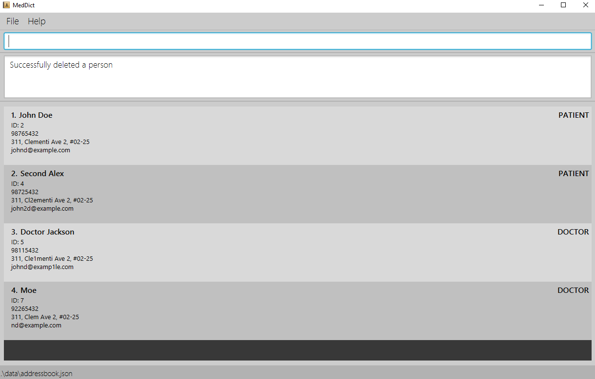

# MindMap User Guide

**MindMap is a specialized desktop application designed to streamline patient management for therapists.** It enables therapists to manage patient contact information and track session logs, and organize therapy notes efficiently, combining the speed of typing commands with a clear, visual interface tailored for therapy-focused task.

With MindMap, therapists can quickly record and access detailed patient information and session history simple text commands, allowing for a faster, more optimized experience than traditional, point-and-click-heavy applications. **Designed specifically for therapeutic practices**, MindMap is ideal for professionals managing multiple patients who require a structured yet flexible tool for session tracking and patient organization.

<!-- * Table of Contents -->
<page-nav-print />

--------------------------------------------------------------------------------------------------------------------

## Quick start

1. **Check Your Java Version**  
   Make sure Java **version 17** or above is installed on your computer. <br> <box type="info" seamless>Java is a software platform that lets you run certain types of applications, including `.jar` files. [Learn more about Java here](https://www.java.com/en/download/faq/whatis_java.xml).<br> <br> To check your current Java version, [learn more here](https://www.java.com/en/download/help/version_manual.html). <br>[Download Java here](https://www.oracle.com/java/technologies/javase/jdk17-archive-downloads.html) if needed. </box>


2. **Download MindMap**  
   Download the latest `.jar` file for MindMap from [this link](https://github.com/AY2425S1-CS2103T-W13-3/tp/releases). <br> <box type="info" seamless> A `.jar` file is a single file that contains everything needed to run a program. Think of it like a zipped folder that, when opened, lets you start using the application right away. <br> <br> To run it, you just need Java installed on your computer. </box>


3. **Choose a Folder**  
   Copy the `.jar` file to a folder you’d like to use as the home for your MindMap contacts.


4. **Open a Terminal**
   <br> <box type="info" seamless> We’ll use the Terminal (or PowerShell on Windows) to enter a few simple commands to launch the MindMap app. </box>

    - **For Windows**:
        - Open the Start menu, type “Windows PowerShell”, and click on it to open.

    - **For Mac**:
        - Press `Command + Space` to open the search bar.
        - Type "Terminal" and select it from the results.


5. **Get the Folder Path**
    - For **Windows**: Hold `Shift` and `Right-click` the folder containing the `.jar` file and select **Copy as Path**.
    - For **Mac**: [Follow these steps](https://www.google.com/url?sa=t&source=web&rct=j&opi=89978449&url=https://macpaw.com/how-to/copy-file-path-mac%23:~:text%3DControl%252Dclick%2520or%2520right%252Dclick%2520on%2520the%2520file%2520in%2520Finder,path%2520wherever%2520you%2520need%2520it.&ved=2ahUKEwiUn6S_jseJAxWVxzgGHTVQJQsQFnoECBQQAw&usg=AOvVaw22hRilijfEWC_nmiYfJzmQ) to copy the folder path.


6. **Navigate to the Folder in Terminal**  
   In the terminal, type the following line and press Enter:
   ```bash
   cd [paste the folder path from step 5 here]
   ```
   If successful, this command will take you into the folder where your .jar file is located.
   
7. **Start MindMap**  
   Now, type the following line in the terminal to launch the app:
   ```bash
   java -jar MindMap.jar
   ```
   This will open the MindMap app. You’re now ready to use it! If you see an error, double-check that Java is installed using **Step 1**.


8. **Get Started with the App**  
   In a few seconds, you'll see the MindMap interface open with some sample contacts to explore.

> **NOTE**: You should see something like this. The app also contains some sample data.<br>


9. **Try Out Some Commands**  
   Type the command in the command box and press Enter to execute it. e.g. typing **`help`** and pressing Enter will open the help window.<br>
   Some example commands you can try:

    * `list` : Lists all patients.

    * `add n/Ben Tan i/S1234567D p/82226688 e/bentan@gmail.com a/Block 322 Jurong East Street 31, #01-01 s/NEW` : Adds a patient named `Ben Tan` to the app.

    * `delete 3` : Deletes the 3rd contact shown in the current patient list.

    * `clear` : Deletes all patients and their logs (if any).

    * `exit` : Exits the app. 

10. **Learn More**  
    Refer to the [Features](#features) below for details of each command.

--------------------------------------------------------------------------------------------------------------------

## Features

<box type="info" seamless>

**Notes about the command format:**<br>

* Words in `UPPER_CASE` are the parameters to be supplied by the user.<br>
  e.g. in `add n/NAME`, `NAME` is a parameter which can be used as `add n/Ben Tan`.

* Items in square brackets are optional.<br>
  e.g `n/NAME [s/STATUS]` can be used as `n/Ben Tan s/LOW` or as `n/Ben Tan`.

* Parameters can be in any order.<br>
  e.g. if the command specifies `n/NAME p/PHONE_NUMBER`, `p/PHONE_NUMBER n/NAME` is also acceptable.

* All commmand flags are in lower case. <br>
  e.g. `l/` is the lower case of L and `i/` is the lower case of I

* Extraneous parameters for commands that do not take in parameters (such as `help`, `list`, `exit` and `clear`) will be ignored.<br>
  e.g. if the command specifies `help 123`, it will be interpreted as `help`.

* If you are using a PDF version of this document, be careful when copying and pasting commands that span multiple lines as space characters surrounding line-breaks may be omitted when copied over to the application.
</box>

<box type="warning" seamless>

Our application uses Singapore’s NRIC system extensively for the Identity Number field `i/`. To ensure NRICs are valid, we’ve included a simple verification feature. You can test this feature with sample NRIC number/FIN from the [provided list](#sample-nrics). 

</box>
<br>
<br>

### Viewing help : `help`

Shows a message explaning how to access the help page.


Format: `help`
<br>
<br>

### Adding a patient: `add`

Adds a patient to the app.
* **After using `add`, type `confirm` to complete the action**. You can also use `cancel` if you change your mind. 
* Note that typing any other commands other than `confirm` or `cancel` will cancel this operation.

Format: `add n/NAME i/IDENTITY_NUMBER p/PHONE_NUMBER e/EMAIL a/ADDRESS s/STATUS​`

* **NAME** only supports alphanumeric characters and spaces as it is only meant for identifying patients.

* **IDENTITY_NUMBER** has to be a **_valid NRIC_** (It must be 9 characters long, starting with 'S', 'T', 'F', or 'G', followed by 7 digits, and ending with a valid checksum letter (e.g. S1234567D).";))

* **PHONE_NUMBER** must be a valid Singapore mobile number. Our application only accepts mobile numbers, which should be 8 digits long and start with either '8' or '9' (e.g., 81234567 or 91234567).


Examples:
* `add n/Ben Tan i/S1234567D p/82226688 e/bentan@gmail.com a/Block 322 Jurong East Street 31, #01-01 s/NEW`
* `add n/Ally Lim i/S0022445F e/allylim@gmail.com a/12 Kent Ridge Drive p/92221100 s/NEW`
<br>
<br>

### Adding a log: `addlog`
Creates a new log entry for a specific patient. This command is typically used to keep track of sessions or important notes related to each session.
**Format**: `addlog i/IDENTITY_NUMBER d/DATE l/LOG_ENTRY`
* **IDENTITY_NUMBER** refers to the unique identifier (e.g., NRIC or FIN) of the patient.
* **DATE** should be in the format `DD MMM YYYY`.
* **LOG_ENTRY** is a description of the session with the patient.

  Examples:
* `addlog i/S1234567D d/20 May 2024 l/This should be replaced with the details of the session` adds a log for the contact with NRIC `S1234567D` on the date `20 May 2024`.

**Note:**

1) For logs that requires input text to include some of our flags like `i/`, `d/` and `l/` please use `addentry` command instead.
2) `\n` characters will be interpreted as new lines in the `l/LOG_ENTRY` fields of both `addlog` and `addentry`. This format will be preserved in the detailed view of the log entry.
3) Log entries that contains purely `\n` characters will be treated as a non-text entry which will disallow users from saving it as a log.
4) Adding an older log is allowed, considering a user may want to move their logs from a physical notebook to the application.
  <br>
  <br>

### Adding a log entry: `addentry`
Creates a **separate pop up window** to add new log entry for a patient, with the corresponding `i/IDENTITY_NUMBER` `d/DATE` previously inputted.

After entering the details, click the `Save` button to add the log entry to the patient's log list, `Cancel` to discard the log entry. Closing the window directly will also discard the log entry.
> **💡 Tip:** Alternatively, use **"Ctrl + Enter"** to save the log entry on Windows and **"Cmd + Enter"** on Mac.

**Format**: `addentry i/IDENTITY_NUMBER d/DATE`
* **IDENTITY_NUMBER** refers to the unique identifier (e.g., NRIC or FIN) of the patient.
* **DATE** should be in the format `DD MMM YYYY`.
  Examples:
* `addentry i/S1234567D d/20 May 2024` opens a new window to add a log entry for the contact with NRIC `S1234567D` on the date `20 May 2024`.
* Example:</br>
  
<br>

**Note:**

1) Compared to `addlog` this command allows users to type in flags like `i/`, `d/` and `l/` in the log entry field. This is useful for users who want to include these flags in their log entry.
2) `\n` characters will be interpreted as new lines in the `l/LOG_ENTRY` fields of both `addlog` and `addentry`. This format will be preserved in the detailed view of the log entry.
3) This feature is intended to cater to power users who prefer a more detailed log entry. If you prefer a more straightforward log entry, you can use the `addlog` command directly.
4) Log entries that contains purely `\n` characters will be treated as a non-text entry which will disallow users from saving it as a log.
5) Adding an older log is allowed, considering a user may want to move their logs from a physical notebook to the application.
<br>
<br>

### Editing a patient : `edit`

Edits an existing patient in the app by patient's specified INDEX.
* **After using `edit`, type `confirm` to complete the action**. You can also use `cancel` if you change your mind.

Format: `edit INDEX [n/NAME] [i/NRIC] [p/PHONE] [e/EMAIL] [a/ADDRESS] [s/STATUS]​`

* Edits the patient at the specified `INDEX`. The index refers to the index number shown in the displayed patient list. The index **must be a positive integer** 1, 2, 3, …​
* At least one of the optional fields must be provided.
* Existing values will be updated to the input values.

Examples:
*  `edit 1 p/91234567 e/johndoe@example.com` Edits the phone number and email address of the 1st patient to be `91234567` and `johndoe@example.com` respectively.
*  `edit S1234567D n/Benson Lim` Edits the name of the patient with the specified `NRIC` to be `Benson Lim`.
   <br>
   <br>

### Locating patients by name or NRIC: `find`

Finds patients whose names or NRIC contain any of the given keywords.

Format: `find KEYWORD [MORE_KEYWORDS]`

* The search is case-insensitive. e.g `hans` will match `Hans`
* The order of the keywords does not matter. e.g. `Hans Bo` will match `Bo Hans`
* For Names:
  Only full words will be matched e.g. `Han` will not match `Hans`
* For NRIC:
  Only the Full NRIC will be matched .e.g `S123` will not match `S1234567D`.
* Persons matching at least one keyword will be returned (i.e. `OR` search).
  e.g. `Hans Bo` will return `Hans Gruber`, `Bo Yang`

Examples:
* `find alex david` returns `Alex Yeoh`, `David Li`<br>
  
<br>
<br>

### Deleting a patient : `delete`

Deletes the specified patient from the app.

Format: `delete INDEX` or `delete i/IDENTITY_NUMBER`

* Deletes the patient at the specified `INDEX` or with the specified `IDENTITY_NUMBER`.
* The index refers to the index number shown in the displayed patient list.
* The index **must be a positive integer** 1, 2, 3, …​
* **After using `delete`, type `confirm` to complete the deletion**. You can also use `cancel` if you change your mind.

Examples:
* `delete i/S1234567D` deletes the patient with NRIC S1234567D in the address book.
* `list` followed by `delete 2` deletes the 2nd patient in MindMap.
* `find Betsy` followed by `delete 1` deletes the 1st patient in the results of the `find` command.
  <br>
  <br>

### Clearing all entries : `clear`

Clears all entries from MindMap **after confirming the action**.

Format: `clear`

* **After using `clear`, type `confirm` to proceed with the clearing of all entries**. You can also use `cancel` if you change your mind.
> **⚠️ Warning:** This deletes **ALL** of the patient contacts and their respective session logs. This action is non-reversible.
<br>
<br>

### Confirming a command : `confirm`

Confirms the command that is currently being executed. This command is used to confirm the action for `add`, `edit`, `delete`, and `clear`.

Examples:
* `delete i/S1234567D` followed by `confirm` deletes the patient with NRIC S1234567D in MindMap.
* `clear` followed by `confirm` clears all entries in the MindMap.
  <br>
  <br>

### Canceling a command : `cancel`

Cancels the command that is currently being executed. This command is used to cancel the action for `add`, `edit`, `delete`, and `clear`.

Examples:
* `delete i/S1234567D` followed by `cancel` cancels the deletion of the patient with NRIC S1234567D in MindMap.
* `clear` followed by `cancel` cancels the clearing of the MindMap.
  <br>
  <br>

### Listing all patients : `list`

Shows a list of all patients in the app.

Format: `list`
<br>
<br>

### Listing Session logs: `logs`

Lists all logs of a specific patient. This command will change the window to show the list of logs for a specific patient.
Clicking on individual logs will show the full description of the log.

- **Format**: `logs i/[IDENTITY_NUMBER]`

Example:
* `logs i/S3054081F` <br>
  

<box type="info" seamless>

Only the `logs` command will bring up the list of logs for the specific patient. Any other command will bring you right back to the patient list.

</box>
<br>
<br>

### Exiting the program : `exit`

Exits the program.

Format: `exit`
<br>
<br>

### Saving the data

MindMap data are saved in the hard disk automatically after any command that changes the data. There is no need to save manually.
<br>
<br>

### Editing the data file

MindMap data are saved automatically as a JSON file `[JAR file location]/data/addressbook.json`. Advanced users are welcome to update data directly by editing that data file.

<box type="warning" seamless>

**Caution:**
If your changes to the data file makes its format invalid, MindMap will discard all data and start with an empty data file at the next run.  Hence, it is recommended to take a backup of the file before editing it.<br>
Furthermore, certain edits can cause the MindMap to behave in unexpected ways (e.g., if a value entered is outside the acceptable range). Therefore, edit the data file only if you are confident that you can update it correctly.
</box>

--------------------------------------------------------------------------------------------------------------------

## FAQ

**Q**: How do I transfer my data to another Computer?<br>
**A**: Install the app in the other computer and overwrite the empty data file it creates with the file that contains the data of your previous MindMap home folder.

**Q**: Can the new **M** FIN series introduced in Singapore From 1 January 2022 onwards be used?<br>
**A**:Unfortunately, no. Our application only supports the format of the **F** and **G** FIN series, and for the **S** and **T** series for the NRIC. Also note that while most valid NRIC/FIN are able to be recognised by our application, some would inevitably fail as the Singapore Government does not disclose the true method to verify NRIC/FIN.

**Q**: Why can't I edit or delete logs?<br>
**A**: With regard to medical records, our research shows that it seems unethical to post-date or back-date medical information[1]. Moreover, our software is not designed to keep track of time stamps and medical information changes. As such there will be no way of detecting malicious practices. Hence, given the potential legal issues, we have decided to disallow the editing and deletion of logs.

However, there are mechanisms in place to prevent accidental inputs. The existence of save buttons in `addentry` helps prevent accidental saves as well as the text box being designed in a way that completely disallows users from saving empty logs.

[1] Singapore Medical Council. (2016). Ethical Code and Ethical Guidelines. Section B3 (6) and B4 (5). Retrieved from
https://www.healthprofessionals.gov.sg/docs/librariesprovider2/guidelines/2016-smc-ethical-code-and-ethical-guidelines---(13sep16).pdf

--------------------------------------------------------------------------------------------------------------------

## Known Issues

1. **Application Opening Off-Screen on Single-Monitor Setup**  
   When using multiple screens, if the application is moved to a secondary screen and the setup later reverts to a single screen, the application may open off-screen.  
   > **Workaround**: Delete the `preferences.json` file created by the application, then restart the application.

2. **Help Window Remains Minimized**  
   If the Help Window is minimized and the `help` command is executed again (or the `Help` menu or `F1` keyboard shortcut is used), the existing Help Window will remain minimized without reopening or restoring. <br>
   > **Workaround**: Manually restore the Help Window from the minimized state.

3. **Unable to Navigate List Items with Tab Key**  
   When using the Tab key to navigate, individual items in lists (like the patient list) cannot be accessed.  
   > **Workaround**: Currently, there is no workaround for this.
 
4. **New Line Handling in Log Entry**
   Entering "\n" in `addlog` or `addentry` will be treated as a new line. This feature is intended to allow flexible log formatting.
    > **Workaround**: This feature is intended


--------------------------------------------------------------------------------------------------------------------

## Command summary
| **Action**    | **Description**                      | **Format**                                                                         | **Example**                                                                                                     |
|---------------|--------------------------------------|------------------------------------------------------------------------------------|-----------------------------------------------------------------------------------------------------------------|
| **Add**       | Adds a patient to MindMap            | `add n/NAME i/NRIC p/PHONE_NUMBER e/EMAIL a/ADDRESS s/STATUS…​`                    | `add n/Ben Tan i/S1234567D p/82226688 e/bentan@gmail.com <br/> a/Block 322 Jurong East Street 31, #01-01 s/NEW` |
| **Clear**     | Clears all entries                   | `clear`                                                                            |                                                                                                                 |
| **Delete**    | Deletes a patient                    | `delete INDEX` or `delete i/NRIC`                                                  | `delete 3` <br/> `delete i/S1234567D`                                                                           |
| **Edit**      | Edits an existing patient            | `edit INDEX [n/NAME] [i/NRIC] [p/PHONE_NUMBER] [e/EMAIL] [a/ADDRESS] [s/STATUS]…​` | `edit 2 n/James Lee e/jameslee@example.com s/LOW`                                                               |
| **Find**      | Finds patients by keywords           | `find KEYWORD [MORE_KEYWORDS]`                                                     | `find James Jake` <br/> `find S1234567D`                                                                        |
| **Confirm**   | Confirms a deletion or clear action  | `confirm`                                                                          |                                                                                                                 |
| **Cancel**    | Cancels a delete or clear action     | `cancel`                                                                           |                                                                                                                 |
| **List**      | Lists all patients in the MindMap    | `list`                                                                             |                                                                                                                 |
| **List Logs** | Lists logs for a specific patient    | `logs i/NRIC`                                                                      | `logs i/S1234567D`                                                                                              |
| **Add Log**   | Adds a log for a patient             | `addlog i/NRIC d/DATE l/LOG_ENTRY`                                                 | `addlog i/S1234567D d/01 Nov 2024 l/Checked in at clinic`                                                       |
| **Add Entry** | Adds a log entry via a second window | `addentry i/NRIC d/DATE`                                                           | `addentry i/S1234567D d/01 Nov 2024`                                                                            |
| **Help**      | Displays help message                | `help`                                                                             |                                                                                                                 |


 ### Additional Notes

* **Parameters**:
    - `n/NAME` - Full name of the patient.
    - `p/PHONE_NUMBER` - Patient's phone number.
    - `e/EMAIL` - Email address.
    - `a/ADDRESS` - Address details.
    - `s/STATUS` - Statuses of the patients which can only be HIGH, LOW, MEDIUM, DISCHARGED AND NEW.
    - `l/LOG_ENTRY` - Description of the session with the patient.
    - `i/NRIC` - Unique identifier (e.g., NRIC or FIN) of the patient.
    - `d/DATE` - Date of the log entry in the format `DD MMM YYYY`.
    - `INDEX` - Index number of the patient in the list.
    - `KEYWORD` - Search keyword(s) to find patients.
    - `MORE_KEYWORDS` - Additional search keywords.

* **Commands**:
    - **Edit** and **Delete** require the `INDEX` number displayed in the list of patients.
    - **Clear**, **Delete**, **Add** and **Edit** actions require `confirm` to complete or `cancel` to abort.

* **Other Commands**:
    - **Help** shows a guide for using all commands.
---

## **Sample NRICs**

<box type="important">

The NRICs listed below are provided solely for testing and validation purposes within this application. Although randomly selected, some NRICs may correspond to real individuals. 

This data is not to be used for any purposes beyond application testing. Unauthorized use or misuse of these NRICs is strictly prohibited and may be subject to legal consequences. We are not responsible for any misuse of this information outside its intended scope.

</box>

| **Index** | **Sample NRIC** |
|-----------|-----------------|
| 1         | S0088873G       |
| 2         | T6498231H       |
| 3         | F3135002Q       |
| 4         | G7512224T       |
| 5         | S0556162J       |
| 6         | T8346779C       |
| 7         | F0333341T       |
| 8         | G7191281M       |
| 9         | S4998948B       |
| 10        | T3692411F       |
| 11        | G3715173X       |
| 12        | G2396162N       |
| 13        | S4145708B       |
| 14        | S7918626J       |
| 15        | T3347267B       |
| 16        | T9148887B       |
| 17        | F3573604L       |
| 18        | F1095991T       |
| 19        | T9463574D       |
| 20        | F7844260M       |


---

## **Stay Tuned: Future enhancements coming!**
>New UI Arriving Soon!


**Search by Sub-Strings**  
Currently, the `find` command only searches for exact matches. We plan to enhance this feature to allow users to search for sub-strings within names.

**Force execution of commands that require confirmation**  
To bypass confirmation for commands like `add`, `edit`, `delete` and `clear`, we plan to add a flag that allows users to force the execution of these commands.

