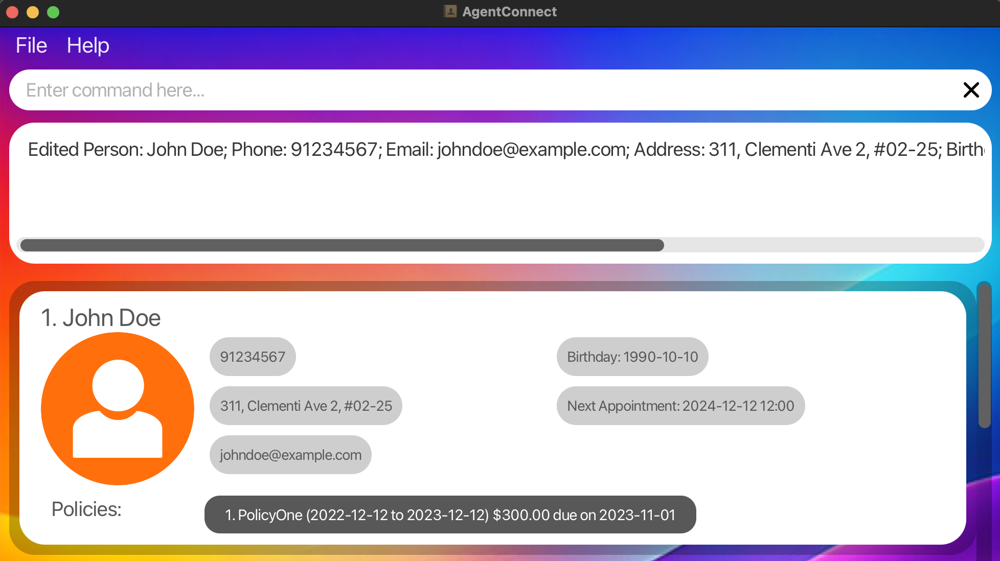
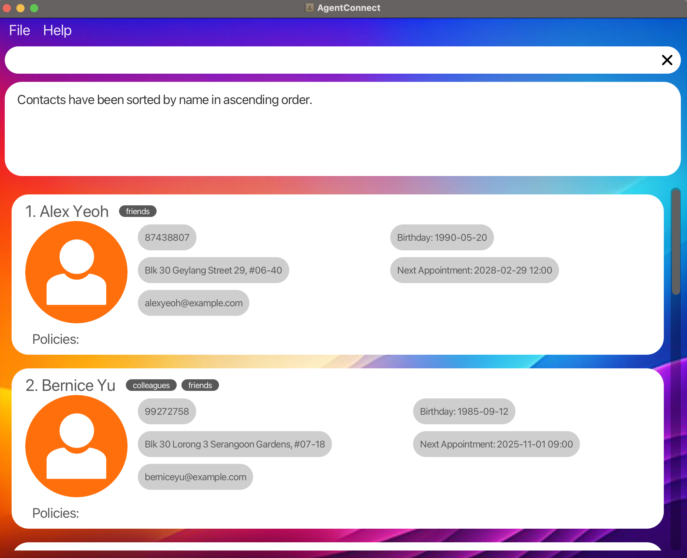
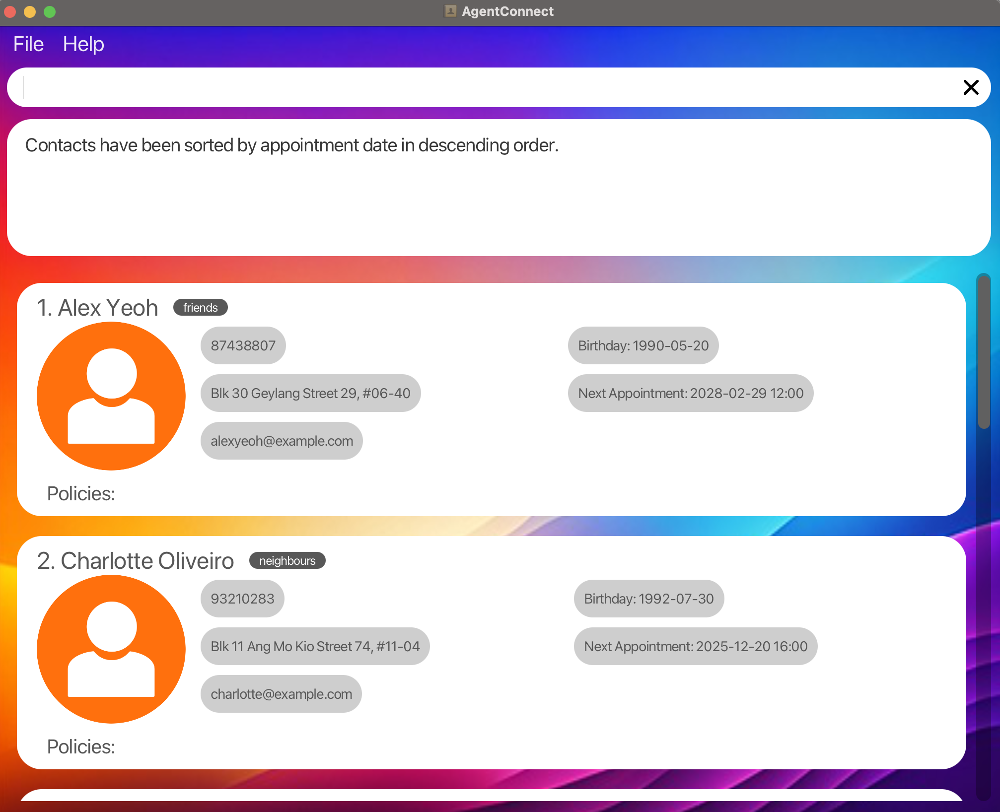
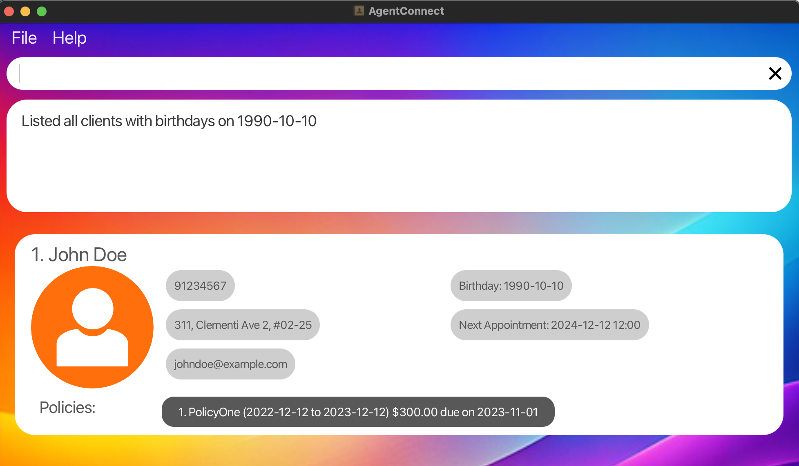
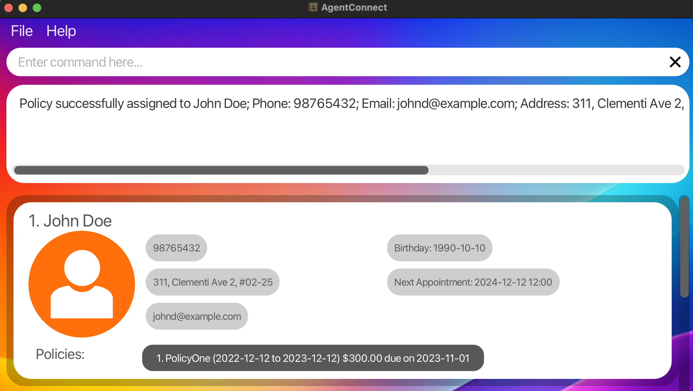
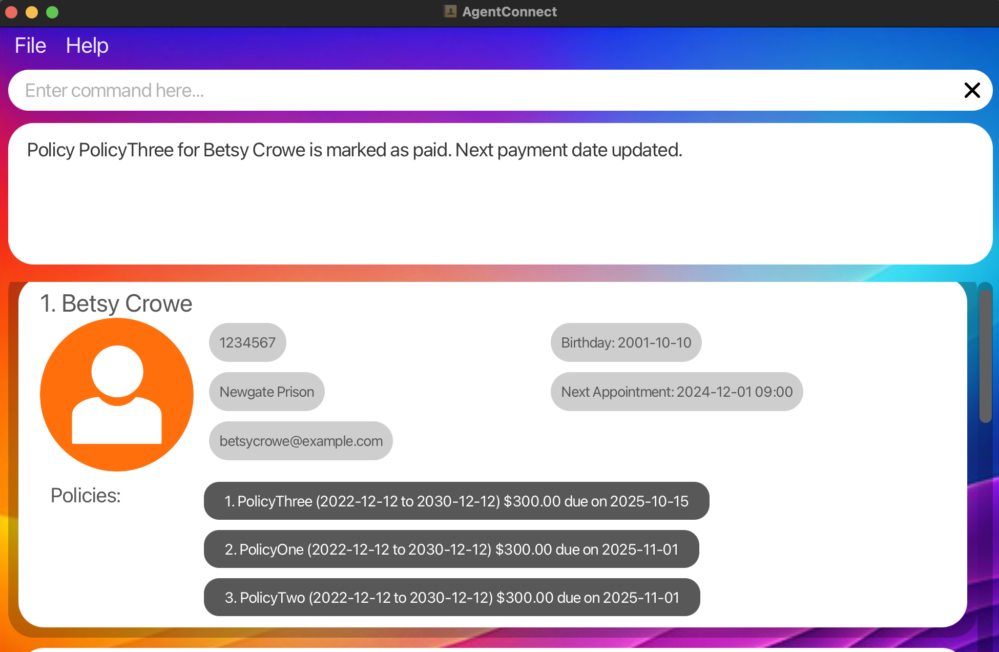

Welcome to the **AgentConnect User Guide**!

*AgentConnect* is a simple and powerful desktop application designed specifically for insurance agents like you. Managing your clients' contacts, appointments, and policies has never been easier!
## Why Choose AgentConnect?

- **Easy to Use:** AgentConnect combines the speed of typing commands with the ease of a visual interface, making it both powerful and user-friendly.
- **Efficient Management:** Quickly add, update, and organize your client information without the hassle of traditional address books.
- **Stay Organized:** Keep track of appointments and policy details all in one place, so you never miss an important date or update.

AgentConnect is designed with you in mind, ensuring that even if you're not tech-savvy, you can start managing your clients effectively right away. Let AgentConnect help you save time and stay organized, so you can focus on what matters most—your clients.

--------------------------------------------------------------------------------------------------------------------
## Introduction

[Table of Content](#table-of-contents): View all contents in this guide.  
[Quick Start](#quick-start): Get up and running with AgentConnect in no time.  
[Getting Started with AgentConnect](#getting-started): Learn the basics of using AgentConnect effectively.  
[Client Management](#client-management): Navigate here for more information on how to manage your clients with ease.  
[Policy Management](#policy-management): Navigate here for more information on handling policy assignments and payments.  
[Search Functions](#search-functions): Navigate here for more information on how to quickly find client's information.  
[Advanced Features](#advanced-features): Enhance your workflow with advanced commands.  
[Frequently Asked Questions (FAQ)](#frequently-asked-questions-faq): Common questions and answers about using AgentConnect.  
[Known Issues](#known-issues): List of current issues and their solutions.  

--------------------------------------------------------------------------------------------------------------------

## Table of Contents

1. [Quick Start](#quick-start)
2. [Getting Started](#getting-started)
    - [Command Format](#understanding-command-format)
    - [Viewing Help](#viewing-help--help)
    - [Saving Your Data](#saving-the-data)
    - [Exiting the Program](#exiting-the-program--exit)
3. [Features](#features)
   1. [Client Management](#client-management)
       - [Adding a Client](#adding-a-client--add)
       - [Deleting a Client](#deleting-a-client--delete)
       - [Listing All Clients](#listing-all-clients--list)
       - [Editing Client Details](#editing-a-client-details--edit)
       - [Sorting Clients](#sorting-clients--sort)
   2. [Search Functions](#search-functions)
      - [Locating Clients by Name](#locating-clients-by-name--find)
      - [Searching Appointments](#searching-appointments--search-a)
      - [Searching Birthdays](#searching-birthdays--search-b)
      - [Searching Policies](#searching-policy--search-p)
   3. [Policy Management](#policy-management)
       - [Assigning a Policy](#assigning-a-policy--assign)
       - [Deleting a Policy](#deleting-a-policy--delete)
       - [Mark Policy Payment](#marking-a-policy-payment-installment-as-paid--paid)
   4. [Advanced Features](#advanced-features)
       - [Undo a Command](#undo-a-command--undo)
       - [Redo a Command](#redo-a-command--redo)
       - [Clearing All Entries](#clearing-all-entries--clear)
4. [Frequently Asked Questions (FAQ)](#frequently-asked-questions-faq)
5. [Known Issues](#known-issues)
6. [Command Summary](#command-summary)

--------------------------------------------------------------------------------------------------------------------

## Quick start

1. Ensure that you have **Java 17 or above** installed on your computer:
    * If you are unsure, you can check if Java is installed by running `java --version`. For more instruction, you can refer to this link [here](https://www.java.com/en/download/help/version_manual.html).
    * If Java is not installed, you can refer to this guide on how to install [here](https://www.java.com/en/download/help/download_options.html).
      * You can also download Java directly from [here](https://www.oracle.com/java/technologies/downloads/).


2. Download the latest release version of AgentConnect. The application is a `.jar` file:
    * Get the latest version of AgentConnect from [this link](https://github.com/AY2425S1-CS2103T-W10-3/tp/releases). Look for a file named `AgentConnect.jar`.
  

3. Place the File:
   * Move the `AgentConnect.jar` file to a home folder where you want to store the application and its data.
   * Note that the data folder created by the `.jar` file which stores the client data will be stored in the same home folder


4. Run the Application:
    - **Option 1: Double-Click:**
      Simply double-click the `AgentConnect.jar` file to start the application.  
    - **Option 2: Use Command Prompt:**
      Open the Command Prompt (Windows) or Terminal (Mac/Linux), navigate to the folder containing the `AgentConnect.jar` file, and type:
      ```
      java -jar AgentConnect.jar
      ```
      For example, if you stored the `AgentConnect.jar` file in the directory `C:/Users/Desktop/Applications`, then run the following command:
      ```
      cd C:/Users/Desktop/Applications
      java -jar AgentConnect.jar
      ```
      To learn more about directory navigation, refer to this [link](https://gomakethings.com/navigating-the-file-system-with-terminal/).


5. **Application Interface:** A user interface similar to the below should appear in a few seconds.

6. 

6. **Try It Out:**
    - **Enter a Command:**
      Type a command into the command box and press **Enter**. For example, type `help` to see the help message.
    - **Explore:**
      Feel free to experiment with different commands.


7. Refer to the [Features](#features) below for details of each command.

--------------------------------------------------------------------------------------------------------------------
## Getting Started

### Understanding Command Format

Users engage with the AgentConnect application by inputting a series of commands. These commands enable a variety of actions, such as adding, updating, listing, and managing clients and policies, as well as retrieving client information like appointments and birthdays. This section will introduce some pointers to take note of when running commands.

* Angle brackets <> are placeholders for information you need to provide.
  Example: In `add n/<NAME>`, replace `NAME` with the client's name.  
   

* Square brackets [ ] indicate optional items.
  Example: `n/<NAME> [t/TAG]` means the `t/TAG` part is optional.


* Ellipsis ... means you can include the item multiple times or not at all. Example: `[t/TAG]...` allows for multiple tags or none.


* The parameters for the commands does not matter and you can enter the parameters in any order.
  Example: `n/John p/123` is the same as `p/123 n/John`.

* Extraneous parameters for commands that do not take in parameters (such as `help`, `list`, `exit` and `clear`) will be ignored.
e.g. if the command specifies `help 123`, it will be interpreted as `help`.

* If you are using a PDF version of this document, be careful when copying and pasting commands that span multiple lines as space characters surrounding line-breaks may be omitted when copied over to the application.


### Viewing Help : `help`

Shows a message explaining how to access the help page.


Format: `help`


### Saving the data

AgentConnect data are saved in the hard disk automatically after any command that changes the data. There is no need to save manually.


### Exiting the program : `exit`

Exits the program.

Format: `exit`

---
## Features

AgentConnect offers a range of features to help you manage your clients effectively. You can navigate to each section below:  
* [Client Management](#client-management)  
* [Search Functions](#search-functions)
* [Policy Management](#policy-management)
* [Advanced Features](#advanced-features)

## Client Management

The client management section contain commands that allows you to interact with your client's information. Each client contains the following fields: Name, phone number, home address, email address, birthday and next appointment.

<div markdown="span" class="alert alert-info"> **Note:**
Policies are not mentioned in this section as there is a dedicated section for managing client's policy. For more information regarding policy management, refer [here](#policy-management).
</div>

| **Action**                                                | **Command Format**                                                                                                                                                                             | **Command Example**                                                                               |
|-----------------------------------------------------------|------------------------------------------------------------------------------------------------------------------------------------------------------------------------------------------------|---------------------------------------------------------------------------------------------------|
| [Adding a Client](#adding-a-client--add)                  | `add n/<NAME> p/<PHONE_NUMBER> e/<EMAIL> addr/<ADDRESS> b/<BIRTHDAY> appt/<APPOINTMENT>`                                                                                                       | `add n/John Doe p/91234567 e/john@example.com addr/123 Street b/1990-01-01 appt/2024-12-12 14:00` |
| [Listing All Clients](#listing-all-clients--list)         | `list`                                                                                                                                                                                         | `list`                                                                                            |
| [Deleting a Client](#deleting-a-client--delete)           | `delete <INDEX>` or `delete <NAME>` Example: `delete 3` or `delete John Doe`                                                                                                                   | `delete 3` or `delete John Doe`                                                                   |
| [Editing Client Details](#editing-a-client-details--edit) | `edit INDEX [n/NAME] [p/PHONE] [e/EMAIL] [addr/ADDRESS] [b/BIRTHDAY] [appt/APPOINTMENT] [po/POLICY_INDEX pon/POLICY_NAME pos/START_DATE poe/END_DATE paydate/PAYMENT_DUE_DATE amt/AMOUNT_DUE]` | `edit 2 p/98765432`                                                                               |
| [Sorting Clients](#sorting-clients--sort)                 | `sort <CRITERIA> <ORDER>`                                                                                                                                                                      | `sort birthday asc`                                                                               |


### Adding a client : `add`

Adds a client to the address book.

Format: 
`add n/<NAME> p/<PHONE NUMBER> e/<EMAIL ADDRESS> addr/<HOME ADDRESS> b/<BIRTHDAY> appt/<APPOINTMENT TIME>`

- **Parameters**:
    * Birthday should be in `yyyy-mm-dd`
    * Appointment should be in `yyyy-mm-dd HH:mm` and accept both past and future dates
    * Phone number can only be 3 to 8 digits long
    * Clients with the same name and address are considered as duplicates
    * The system standardises addresses by removing commas, spaces, and hyphens and making
      all characters lowercase. This means that "311, Clementi Ave 5, unit 02-2" and
      "311 Clementi ave 5 unit 022" (without commas) will be treated as the same client address.

Examples:
* The command below adds a new client to the client list with the following information:
    * Client name: John Doe
    * Client number: 98765432
    * Client email: johnd@example.com
    * Home address: John street, block 123, #01-01
    * Client birthday: 2000-12-12
    * Client next appointment: 2024-12-12 12:00  
    `add n/John Doe p/98765432 e/johnd@example.com addr/John street, block 123, #01-01 b/2000-12-12 appt/2024-12-12 12:00`

* The command below adds a new client to the client list with the following information:
    * Client name: Betsy Crowe
    * Client number: 1234567
    * Client email: betsycrowe@example.com
    * Home address: Newgate Prison
    * Client birthday: 2001-10-10
    * Client next appointment: 2024-12-01 09:00  
    `add n/Betsy Crowe e/betsycrowe@example.com addr/Newgate Prison p/1234567 b/2001-10-10 appt/2024-12-01 09:00`
    

---

### Deleting a client : `delete`

Deletes the specified client from the application. There is a confirmation message before the deletion is executed. Type `y` and press enter to confirm deletion.

Format: `delete <INDEX>` or `delete <NAME>`
- **Parameters**:
    * Deletes the client at the specified `INDEX` or the specific `NAME`.
    * The index and name refers to the index number or name shown in the displayed client list.
    * The index **must be a positive integer** 1, 2, 3, …​ 
    * Any input after the first index will be ignored. Eg. `delete 1 2` or `delete 1 test` will be interpreted as `delete 1`.
    * The name of the client is case-sensitive and must be an exact match.

<div markdown="span" class="alert alert-info">💡**Tip:**
Always verify the client’s index number or exact name before executing the delete command to prevent accidental removals.
Best Practice: Use the list or find command to confirm the exact client you intend to delete.
</div>

Examples:
* `find Denon` followed by `delete 3` deletes the 3rd client in the results of the `find` command.
  

* Delete the client named `Betsy Crowe` from the list of the address book.
  ```
  delete Betsy Crowe
  ```

---

### Listing all clients : `list`

Shows a list of all clients in the address book.

Format: `list`

---

### Editing a client details : `edit`

Edits an existing client in the address book.

Format: 
`edit INDEX [n/NAME] [p/PHONE] [e/EMAIL] [a/ADDRESS] [t/TAG] [b/BIRTHDAY] [appt/APPOINTMENT] [po/POLICY_INDEX pon/POLICY_NAME pos/START_DATE poe/END_DATE paydate/PAY_DATE amt/AMOUNT]…​`

- **Parameters**:

  * Edits the client at the specified `INDEX`. The index refers to the index number shown in the displayed client list. The index **must be a positive integer** 1, 2, 3, …​
  * At least one of the optional fields must be provided.
  * Existing values will be updated to the input values.
  * When editing tags, the existing tags of the client will be removed i.e adding of tags is not cumulative.
  * You can remove all the client’s tags by typing `t/` without
      specifying any tags after it.
  * When editing birthday and policy, the date format should be `yyyy-mm-dd`
  * When editing appointment, the date and time format should be `yyyy-mm-dd hh:mm` in 24-hour notation
  * When editing policy, all fields of policy must be included

<div markdown="span" class="alert alert-info">💡 **Tip:**
Although tags are optional, using them can be useful if you want to store additional information about the client.
For example, if a client is a VIP, you can include it in the client's information using the edit command.
</div>

Examples:
- *Edits the phone number and email address of the 1st client to be `91234567` and `johndoe@example.com` respectively.*:
  ```
  edit 1 p/91234567 e/johndoe@example.com
  ```
  

- *Edits the name of the 2nd client to be `Betsy Crower` and clears all existing tags.*:
  ```
  edit 2 n/Betsy Crower t/
  ```

- *Edits the 1st policy of the 3rd client to be `Health Insurance` which covers from `2024-10-19` to `2025-10-19`. The pay date changes to `2024-11-19`
  and premium amount changes to `200`*:
  
  `edit 3 po/1 pon/Health Insurance pos/2024-10-19 poe/2025-10-19 paydate/2024-11-19 amt/200`
  
---

### Sorting clients : `sort`

Organizes your client list based on different criteria for easier management and viewing.

Format: 
`sort <CRITERIA> <ORDER>`

- **Parameters**:
    - `CRITERIA`: The attribute by which you want to sort the clients. Available criteria include:
        - `n/`: Sort by client's name (A-Z or Z-A).
        - `b/`: Sort by client's birthday (earliest to latest or latest to earliest).
        - `appt/`: Sort by upcoming appointment date (soonest to latest or latest to soonest).
        - `paydate/`: Sort by policy payment due date (soonest to latest).
    - `ORDER`: The direction of sort. Available order includes:
        - `asc`: Sort in ascending order
        - `desc`: Sort in descending order

- **Usage**:
    - **Name Sorting**: Orders the client list alphabetically by names.
    - **Birthday Sorting**: Orders the client list by birthday dates.
    - **Appointment Sorting**: Orders the client list by the dates of upcoming appointments.
    - **Payment Due Date Sorting**: Orders the client list by the policy payment due dates. This sort can only be used in ascending order.

<div markdown="span" class="alert alert-info">💡 **Tip:**
Regularly sorting your client list based on different criteria can help you manage your clients more efficiently and keep track of important information.
</div>

Examples:
- **Sort by Name in Ascending Order**: Sorts the client list alphabetically by each client's name.
  ```
  sort n/ asc
  ```
  
  

- **Sort by Birthday in Ascending Order**: Sorts the client list from the earliest to the latest birthday.
  ```
  sort b/ asc
  ```
  
  

- **Sort by Appointment Date in Descending Order**: Sorts the client list based on the latest to the earliest upcoming appointment.
  ```
  sort appt/ desc
  ```

  

- **Sort by Policy Payment Due Date in Ascending Order**: Sorts the client list based on the earliest to the latest payment due date of the policy.
  ```
  sort paydate/ asc
  ```

  

---

## Search Functions

The search function section contain commands that allows you to search client-specific information, such as appointments, birthday and policies.

| **Action**                                              | **Command Format**               | **Command Example**          |
|---------------------------------------------------------|----------------------------------|------------------------------|
| [Find Clients](#locating-clients-by-name--find)         | `find <KEYWORD> [MORE_KEYWORDS]` | `find Alice`                 |
| [Search Appointment](#searching-appointments--search-a) | `search a/ <DATETIME>`           | `search a/ 2024-10-10 23:00` |
| [Search Birthday](#searching-birthdays--search-b)       | `search b/ <DATE>`               | `search b/ 2000-03-15`       |
| [Search Policy](#searching-policy--search-p)            | `search p/ <POLICY_NAME>`        | `search p/ sample Policy`    |

### Locating clients by name : `find`

Finds clients whose names contain any of the given keywords.

Format: 
`find <KEYWORD> [MORE_KEYWORDS]`

- **Parameters**:
  * The search is case-insensitive. e.g `hans` will match `Hans`
  * The order of the keywords does not matter. e.g. `Hans Bo` will match `Bo Hans`
  * Only the name is searched.
  * Only full words will be matched e.g. `Han` will not match `Hans`
  * Clients matching at least one keyword will be returned (i.e. `OR` search).
    e.g. `Hans Bo` will return `Hans Gruber`, `Bo Yang`

<div markdown="span" class="alert alert-info">💡 **Tip:**
When using the find command, incorporating multiple keywords can help narrow down search results more effectively.
</div>

Examples:
- **Search by Specific Keyword**: Finds all client's name that contains the keyword.
    ```
    find steven kurt
    ```

    

---

### Searching appointments : `search a/`

Finds clients with appointments on a specific date or within a date range.

Format: 

Single datetime search:
`search a/ <DATETIME>`  
Range datetime search:
`search a/ <START DATETIME> to <END DATETIME>`
- **Parameters**:
  - `DATETIME`: A specific date and time in `yyyy-mm-dd HH:mm` format.
  - `START DATETIME`: A specific start date and time in `yyyy-mm-dd HH:mm` format.
  - `END DATETIME`: A specific end date and time in `yyyy-mm-dd HH:mm` format.

- **Usage**:
  - **Single Datetime Search**: Lists all clients with appointments on the specified date and time.
  - **Range Datetime Search**: List all clients with appointments that is within the given date and time range.

Examples:
  - **Search by Specific Datetime**: Finds all clients with appointments on May 06, 2024, 2PM.
    ```
    search a/ 2024-05-06 14:00
    ```

    
  - **Search by Range Datetime**: Finds all clients with appointments from January 01, 2024, 12AM to December 31, 2024, 11.59PM.
    ```
    search a/ 2024-01-01 00:00 to 2024-12-31 23:59
    ```

    

---

### Searching birthdays : `search b/`

Finds clients who have birthdays on a specific date or within a date range.

Format: 

Single date search:
`search b/ <DATE>`  

Range date search:
`search b/ <START DATE> to <END DATE>`

- **Parameters**:
  - `DATE`: A specific date in `yyyy-mm-dd` format.
  - `START DATE`: A specific start date in `yyyy-mm-dd` format.
  - `END DATE`: A specific end date in `yyyy-mm-dd` format.
  - If it is a range date search, the `to` keyword is compulsory.

- **Usage**:
  - **Single Date Search**: Lists all clients whose birthdays fall on the specified date.
  - **Range Date Search**: Lists all clients whose birthdays are within the given date range.

Examples:
  - **Search by Specific Date**: Finds all clients with a birthday on October 10, 1990.
    ```
    search b/ 1990-10-10
    ```
    

  - **Search by Range Date**: Finds all clients with a birthdays between January 1, 1990, to January 1, 2001.
    ```
    search b/ 1990-01-01 to 2001-01-01
    ```
    
    

---

### Searching policy : `search p/`

Find clients who currently owns a certain policy.

Format: 
`search p/ <POLICY_NAME>`

- **Parameters**:
  - `POLICY_NAME`: A specific policy name.
  - `POLICY_NAME` is not case-sensitive and whitespaces are ignored. 

<div markdown="span" class="alert alert-info">💡 **Tip:**
For quicker search, if the policy name is "Health Advantage Policy 3", 
you can type "healthadvantagepolicy3" instead. The search result will be the same.
</div>

Example:
  - **Search by Specific Policy**: Finds all clients who own the policy named "PolicyOne".
    ```
    search p/ PolicyOne
    ```
    

---

## Policy Management

The policy management section contain commands that allows you to manage policy-related information, such as assigning policy, deleting policy and updating policy payment.

| **Action**                                                                 | **Command Format**                                                                                           | **Command Example**                                                                         |
|----------------------------------------------------------------------------|--------------------------------------------------------------------------------------------------------------|---------------------------------------------------------------------------------------------|
| [Assign a Policy](#assigning-a-policy--assign)                             | `assign INDEX pon/<POLICY_NAME> pos/<START_DATE> poe/<END_DATE> paydate/<PAYMENT_DUE_DATE> amt/<AMOUNT_DUE>` | `assign 1 pon/Health Insurance pos/2022-01-01 poe/2023-01-01 paydate/2022-12-01 amt/300.00` |
| [Delete a Policy](#deleting-a-policy--delete)                              | `delete <INDEX> po/<POLICY_INDEX>`                                                                           | `delete 3 po/2`                                                                             |
| [Mark Policy as Paid](#marking-a-policy-payment-installment-as-paid--paid) | `paid <INDEX> po/<POLICY_INDEX>`                                                                             | `paid 2 po/3`                                                                               |

### Assigning a policy : `assign`

Assign policy to a client.

Format: 
`assign <INDEX> pon/<POLICY NAME> /pos<POLICY START DATE> /poe <POLICY END DATE> /paydate <INSURANCE DUE DATE> /amt <AMOUNT DUE>`
- **Parameters**:
    * `POLICY START DATE` and `POLICY END DATE` refer to the duration of the policy's coverage.
    * `POLICY START DATE` and `POLICY END DATE` must be in the format `yyyy-mm-dd`.
    * `POLICY START DATE` and `POLICY END DATE` cannot be the same date.
    * `INSURANCE DUE DATE` must be in the format `yyyy-mm-dd`.
    * `INSURANCE DUE DATE` cannot be earlier than the `POLICY START DATE`.
    * `INSURANCE DUE DATE` cannot be later than the `POLICY START DATE`.
    * `AMOUNT DUE` must be a positive number with up to 2 decimal places.

<div markdown="span" class="alert alert-info"> **Note:**
Sometimes, after assigning a policy to a client, the user interface may not reflect the changes
immediately. If this occurs, try double-clicking on the particular client profile card.
The user interface will show the assigned policy.
</div>

Example:
* Assign a policy to the client listed at index 1 with the following information:
    * Policy Name: PolicyOne
    * Policy start date: 2022-12-12
    * Policy end date: 2023-12-12
    * Premium due date: 2023-11-01
    * Amount Due: $300.00
    
    `assign 1 pon/PolicyOne pos/2022-12-12 poe/2023-12-12 paydate/2023-11-01 amt/300.00`
    
  

---

### Deleting a policy : `delete`

Deletes the specified policy from the specified client using the index of the client and policy.

Format: 
`delete <INDEX> po/<POLICY_INDEX>`
Deletes the policy at the specified `POLICY_INDEX` of the client at the specified `INDEX`.


- **Parameters**:
    - `INDEX`: The index of the client in the client list.
    - `POLICY_INDEX`: The index of the policy to be deleted.
    - The index refers to the index number shown in the displayed client list. The index **must be a positive integer** 1, 2, 3, …​
    - The policy index refers to the index number shown in the displayed client list. The index **must be a positive integer** 1, 2, 3, …​

<div markdown="span" class="alert alert-info">💡 **Tip:**
Always verify the policy’s index number before executing the delete command to prevent accidental removals.
Best Practice: Use the list command to confirm the exact policy you intend to delete.
</div>

Examples:

* Delete the 1st policy of the 1st person in the address book.
  ```
  delete 1 po/1
  ```

* Delete the 1st policy of the 3rd person in the address book.
  ```
  delete 3 po/1
  ```
  

---

### Marking a policy payment installment as paid : `paid`

Marks a policy payment installment as paid for a client.

Format: 
`paid <INDEX> po/<POLICY_INDEX>`
- **Parameters**:
    - `INDEX`: The index of the client in the client list.
    - `POLICY_INDEX`: The index of the policy to be marked as paid.
    - The index refers to the index number shown in the displayed client list. The index **must be a positive integer** 1, 2, 3, …​
    - The policy index refers to the index number shown in the displayed client list. The index **must be a positive integer** 1, 2, 3, …​

<div markdown="span" class="alert alert-info"> **Note:** <br>
1. The payment due date of the policy will be updated to the next scheduled date (ie. one year later). 
The amount due will be set to 0 once the final installment of the insurance payment is completed. <br>
2. Sometimes, after marking a policy payment installment of a client as paid, the user interface may not reflect the changes
immediately. If this occurs, try double-clicking on the particular client profile card.
The user interface will show the updated payment due date.
</div>


Examples:
- **Marking a Policy Payment Installment as Paid**:
  ```
  paid 1 po/ 1
  ```
  *Marks the policy associated with index 1 as paid for the client at index 1.*

    

---

## Advanced Features

| **Action**                                          | **Command Format** | **Command Example** |
|-----------------------------------------------------|--------------------|---------------------|
| [Undo the Last Deleted Work](#undo-a-command--undo) | `undo`             | `undo`              |
| [Redo the Last Undo Work](#redo-a-command--redo)    | `redo`             | `redo`              |
| [Clear All Entries](#clearing-all-entries--clear)   | `clear`            | `clear`             |

### Undo a command : `undo`
Undo the last command. This command works for add, edit, delete client and clear commands.


Format: `undo` 

* Undo the last command to restore the address book to the state before the last command.
<div markdown="span" class="alert alert-info"> **Note:**
The `undo` command does not work for assign and deletion of policies.
</div>

Examples:
* `delete 1` followed by `undo` will restore back the deleted client at index 1.
* `clear` followed by `undo` will restore back all the deleted clients.


---
### Redo a command : `redo`
Redo the last undo. Works for add, edit, delete client and clear commands.

Format: `redo`

* Redo the last undo command to restore the address book to the state before the undo command.
<div markdown="span" class="alert alert-info"> **Note:**
The `redo` command does not work for assign and deletion of policies.
</div>

Examples:
* `delete 1` followed by `undo` followed by `redo` will delete the client at index 1 again.
* `clear` followed by `undo` followed by `redo` will clear all the entries again.


---

### Clearing all entries : `clear`

Clears all entries from the address book.

Format: `clear`

<div markdown="span" class="alert alert-warning">:exclamation: **Caution:**
If you accidentally used the `clear` command and want to revert back, do not run any other commands.
Run `undo` immediately to restore the data.
</div>

---

### Editing the data file

AddressBook data are saved automatically as a JSON file `[JAR file location]/data/addressbook.json`. Advanced users are welcome to update data directly by editing that data file.

<div markdown="span" class="alert alert-warning">:exclamation: **Caution:**
If your changes to the data file makes its format invalid, AddressBook will discard all data and start with an empty data file at the next run. Hence, it is recommended to take a backup of the file before editing it.<br>
Furthermore, certain edits can cause the AddressBook to behave in unexpected ways (e.g., if a value entered is outside of the acceptable range). Therefore, edit the data file only if you are confident that you can update it correctly.
</div>

--------------------------------------------------------------------------------------------------------------------

## Frequently Asked Questions (FAQ)

**Q:** How do I check if I have Java installed?

**A:** Open the Command Prompt or Terminal and type `java -version`. If Java is installed, it will show the version number. For more information, you can refer [here](#quick-start).

---

**Q:** Can I run AgentConnect on a Mac or Linux computer?

**A:** Yes! As long as you have Java 17 or above installed, AgentConnect will work on Windows, Mac, and Linux.

---

**Q:** How do I back up my data?

**A:** Your data is stored in the `addressbook.json` file in the `data` folder. Copy this file to a safe location to back up your data.

---

**Q:** What happens if I enter the wrong command?

**A:** AgentConnect will show an error message explaining what went wrong. You can then try the command again.

---

**Q:** Can I assign multiple policies to one client?

**A:** Yes, you can assign multiple policies by using the `assign` command multiple times for the same client.


--------------------------------------------------------------------------------------------------------------------

## Known Issues

1. **Multiple Screens**: If you use multiple monitors and move AgentConnect to a secondary screen, it may open off-screen if that monitor is disconnected.  
   **Solution**: Delete the `preferences.json` file in the application folder before restarting AgentConnect.

2. **Help Window Minimization**: If you minimize the Help window and try to open another help window (using `help` command, F1 or clicking the help option in the user interface), the original help window will still be minimized. There will be no new help window pop up.  
   **Solution**: Restore the minimized Help window manually.

--------------------------------------------------------------------------------------------------------------------

## Command Summary

| Action                                                                     | Command Format                                                                                                                                                                                                                 |
|----------------------------------------------------------------------------|--------------------------------------------------------------------------------------------------------------------------------------------------------------------------------------------------------------------------------|
| [Adding a Client](#adding-a-client--add)                                   | `add n/<NAME> p/<PHONE_NUMBER> e/<EMAIL> addr/<ADDRESS> b/<BIRTHDAY> appt/<APPOINTMENT>`<br>Example: `add n/John Doe p/91234567 e/john@example.com addr/123 Street b/1990-01-01 appt/2024-12-12 14:00`                         |
| [Listing All Clients](#listing-all-clients--list)                          | `list`                                                                                                                                                                                                                         |
| [Deleting a Client](#deleting-a-client--delete)                            | `delete <INDEX>` or `delete <NAME>`<br>Example: `delete 3` or `delete John Doe`                                                                                                                                                |
| [Editing Client Details](#editing-a-client-details--edit)                  | `edit INDEX [n/NAME] [p/PHONE] [e/EMAIL] [addr/ADDRESS] [b/BIRTHDAY] [appt/APPOINTMENT] [po/POLICY_INDEX pon/POLICY_NAME pos/START_DATE poe/END_DATE paydate/PAYMENT_DUE_DATE amt/AMOUNT_DUE]`<br>Example: `edit 2 p/98765432` |
| [Sorting Clients](#sorting-clients--sort)                                  | `sort <CRITERIA> <ORDER>`<br>Example: `sort birthday asc`                                                                                                                                                                      |
| [Locating Clients by Name](#locating-clients-by-name--find)                | `find <KEYWORD> [MORE_KEYWORDS]`<br>Example: `find Alice`                                                                                                                                                                      |
| [Searching Appointments](#searching-appointments--search-a)                | `search a/ <DATETIME>`<br>Example: `search a/ 2024-10-10 23:00`                                                                                                                                                                |
| [Searching Birthdays](#searching-birthdays--search-b)                      | `search b/ <DATE>`<br>Example: `search b/ 2000-03-15`                                                                                                                                                                          |
| [Searching Policies](#searching-policy--search-p)                          | `search p/ <POLICY_NAME>`<br>Example: `search p/ sample Policy`                                                                                                                                                                |
| [Assigning a Policy](#assigning-a-policy--assign)                          | `assign INDEX pon/<POLICY_NAME> pos/<START_DATE> poe/<END_DATE> paydate/<PAYMENT_DUE_DATE> amt/<AMOUNT_DUE>`<br>Example: `assign 1 pon/Health Insurance pos/2022-01-01 poe/2023-01-01 paydate/2022-12-01 amt/300.00`           |
| [Deleting a Policy](#deleting-a-policy--delete)                            | `delete <INDEX> po/<POLICY_INDEX>` <br>Example: `delete 3 po/2`                                                                                                                                                                |
| [Mark Policy Payment](#marking-a-policy-payment-installment-as-paid--paid) | `paid <INDEX> pon/<POLICY_INDEX>` <br>Example: `paid 2 pon/3`                                                                                                                                                                  |
| [Undo a Command](#undo-a-command--undo)                                    | `undo`                                                                                                                                                                                                                         |
| [Redo a Command](#redo-a-command--redo)                                    | `redo`                                                                                                                                                                                                                         |
| [Clearing All Entries](#clearing-all-entries--clear)                       | `clear`                                                                                                                                                                                                                        |
| [Exiting the Program](#exiting-the-program--exit)                          | `exit`                                                                                                                                                                                                                         |
| [Viewing Help](#viewing-help--help)                                        | `help`                                                                                                                                                                                                                         |
