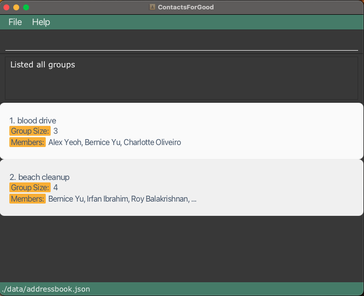

# CFG User Guide

ContactsForGood (CFG) is a **desktop app for Non Government Organisations (NGOs) to manage contacts.**
It is **optimized for use via a Command Line Interface** (CLI) while still having the benefits of a Graphical User Interface (GUI). If you can type fast, CFG can get your contact management tasks done faster than traditional GUI apps.

<!-- * Table of Contents -->
<page-nav-print />

--------------------------------------------------------------------------------------------------------------------

## Quick start

1. Ensure you have Java `17` or above installed in your Computer.

2. Download the latest `.jar` file from [here](https://github.com/AY2425S1-CS2103T-T16-3/tp/releases).

3. Copy the file to the folder you want to use as the _home folder_ for CFG.

4. Open a command terminal, `cd` into the folder you put the jar file in, and use the `java -jar contactsforgood.jar` command to run the application. 
   
5. A GUI similar to the below should appear in a few seconds. Note how the app contains some sample data.
    

6. Type the command in the command box and press Enter to execute it. e.g. typing **`help`** and pressing Enter will open the help window. 
   Some example commands you can try:

   * `list` : Lists all contacts.

   * `add r/volunteer h/30 n/John Doe p/98765432 e/johnd@example.com a/John street, block 123, #01-01` : Adds a 
     contact named `John Doe` with a `volunteer` role to CFG.

   * `delete 3` : Deletes the 3rd contact shown in the current list.

   * `clear` : Deletes all contacts.

   * `exit` : Exits the app.

7. Refer to the [Features](#features) below for details of each command.

--------------------------------------------------------------------------------------------------------------------

## Features

<box type="info" seamless>

**Notes about the command format:** 

* Words in `UPPER_CASE` are the parameters to be supplied by the user. 
  e.g. in `add n/NAME`, `NAME` is a parameter which can be used as `add n/John Doe`.

* Each parameter is preceded by a **prefix**, which indicates the type of data the parameter represents.  
  For example:
    - `n/` is the prefix for `NAME`, as in `add n/John Doe`.
    - `p/` is the prefix for `PHONE_NUMBER`, as in `add p/12345678`.

* Any unrecognized parameter's prefix will be treated as part of the value for the preceding valid prefix. This means that care should be taken to use only the correct prefixes when entering commands to avoid unexpected behavior.
    For example:
    - Correct: `add n/John Doe p/12345678`
    - Incorrect: `add n/John Doe xyz/12345678` (Here, `xyz/12345678` will be treated as part of the name value, which
      will result in an error)

* Items in square brackets are optional. 
  e.g `n/NAME [t/TAG]` can be used as `n/John Doe t/friend` or as `n/John Doe`.  
  Note: If a field is optional and you choose to not input anything into the field, **DO NOT**
  leave an empty prefix, as this will not be a valid command.  
  e.g `edit 1 n/NAME t/` is not a valid command

* Items with `…`​ after them can be used multiple times including zero times. 
  e.g. `[t/TAG]…​` can be used as ` ` (i.e. 0 times), `t/friend`, `t/friend t/family` etc.

* An `INDEX` refers to the person at the index number shown in the **last displayed person list**. 
  The index must meet the following conditions:

  1. **Correct Format**:  
     The index **must be a positive integer** (e.g., 1, 2, 3, …). Non-numeric or improperly formatted inputs (e.g., `-1`, `abc`, `1.5`) will be deemed as incorrect format.

  2. **Valid Index**:  
     The index must be within the range of the last displayed person list. Indices that are numeric but refer to non-existent entries in the list (e.g., `999` when the list has only 10 people) will be deemed as invalid indices.

* `INDICES` takes in multiple `INDEX`s 
  * In this case, each `INDEX` can be a single number (e.g., `2`) or a closed range (e.g., `5-9`)
  * Each `INDEX` is separated by spaces (e.g. of an `INDICES`, `1 2 3 5-9`).
  * **Note:** In a closed range, there must be no spaces between the numbers and the hyphen (e.g., `5-9` is correct, 
    but `5 - 9` or `5 -9` or `5- 9` is incorrect).
  * `INDICES` expects at least one `INDEX` unless the `INDICES` item is optional.

* Parameters can be in any order. 
  e.g. if the command specifies `n/NAME p/PHONE_NUMBER`, `p/PHONE_NUMBER n/NAME` is also acceptable.

* Extraneous parameters for commands that do not take in parameters (such as `help`, `exit` and `clear`) will be ignored.
  e.g. if the command specifies `help 123`, it will be interpreted as `help`.

* If you are using a PDF version of this document, be careful when copying and pasting commands that span multiple lines as space characters surrounding line-breaks may be omitted when copied over to the application.
</box>

## Command summary
### Person-Related Commands
| **Action**                                       | **Format**                                                                                                                     | **Example**                                                                                    |
|--------------------------------------------------|--------------------------------------------------------------------------------------------------------------------------------|------------------------------------------------------------------------------------------------|
| [**Add**](#adding-a-contact-add)                 | `add [r/ROLE] n/NAME p/PHONE_NUMBER e/EMAIL a/ADDRESS [t/TAG]…​ [h/HOURS] [d/DONATED_AMOUNT] [ped/PARTNERSHIP_END_DATE]`       | `add r/volunteer  n/James Ho p/81234567 e/jamesho@example.com a/123, Clementi Rd, 123456 h/19` |
| [**Clear**](#clearing-all-entries--clear)        | `clear`                                                                                                                        | `clear`                                                                                        |
| [**Delete**](#deleting-a-person--delete)         | `delete INDICES`                                                                                                               | `delete 1 2 3 5-7`                                                                             |
| [**Edit**](#editing-a-person--edit)              | `edit INDEX [n/NAME] [p/PHONE_NUMBER] [e/EMAIL] [a/ADDRESS] [t/TAG]…​ [h/HOURS] [d/DONATED_AMOUNT] [ped/PARTNERSHIP_END_DATE]` | `edit 2 n/James Lee e/jameslee@example.com`                                                    |
| [**Search**](#searching-persons-by-field-search) | `search PREFIX/KEYWORD [MORE_PREFIX/KEYWORD]…`                                                                                 | `search n/john`                                                                                |
| [**List**](#listing-all-persons--list)           | `list`                                                                                                                         | `list`                                                                                         |
| [**Sort**](#sorting-the-displayed-list-sort)     | `sort [s/SORT_OPTION]`                                                                                                         | `sort s/name`                                                                                  |

### Group-Related Commands
| **Action**                                                                                          | **Format**                                  | **Example**                                    |
|-----------------------------------------------------------------------------------------------------|---------------------------------------------|------------------------------------------------|
| [**Create Group**](#creating-a-group--creategroup)                                                  | `createGroup g/GROUP_NAME m/INDICES`        | `createGroup g/blood drive m/1 2 4-7`          |
| [**Add New Members to Group**](#adding-new-members-to-an-existing-group--addtogroup)                | `addToGroup g/GROUP_NAME m/INDICES`         | `addToGroup g/beach cleanup m/1 2 3-6`         |
| [**Remove Existing Members from Group**](#removing-members-from-an-existing-group--removefromgroup) | `removeFromGroup g/GROUP_NAME m/INDICES`    | `removeFromGroup g/blood drive m/1 2 3 5-7`    |
| [**Edit Group Name**](#editing-a-groups-name--editgroupname)                                        | `editGroupName g/OLD_GROUP_NAME g/NEW_GROUP_NAME` | `editGroupName g/blood drive g/blood donation` |
| [**List Groups**](#listing-groups-listgroups)                                                       | `listGroups`                                | `listGroups`                                   |
| [**Delete Group**](#deleting-a-group-deletegroup)                                                   | `deleteGroup g/GROUP_NAME`                  | `deleteGroup g/blood donation`                 |

### General Commands
| **Action**                                         | **Format** | **Example** |
|----------------------------------------------------|------------|-------------|
| [**Help**](#viewing-help--help)                    | `help`     | `help`      |
| [**Get Emails**](#getting-emails-email)            | `email`    | `email`     |
| [**Exit Application**](#exiting-the-program--exit) | `exit`     | `exit`      |

--------------------------------------------------------------------------------------------------------------------

### Adding a contact: `add`

This command adds a contact to CFG.
There are 4 types of contacts: Volunteer, Donor, Partner, Person (default).

Format: `add [r/ROLE] n/NAME p/PHONE_NUMBER e/EMAIL a/ADDRESS [t/TAG]…​
[h/HOURS] [d/DONATED_AMOUNT] [ped/PARTNERSHIP_END_DATE]`

- `ROLE` (Optional): Specifies the type of contact. If not provided, the contact will be added as a general `Person`.
- `NAME`: The contact's full name (case-insensitive).
- `PHONE_NUMBER`: The contact's phone number (Any length is allowed, accommodating 3-digit emergency numbers to 15-digit international numbers).
- `EMAIL`: The contact's email address (Only **english** emails are currently supported).
- `ADDRESS`: The contact's physical address.
- `TAG` (Optional): Additional tags associated with the contact (A contact can have any number of tags, including none).
- Role-specific fields(not required for `Person`)
  - **Volunteer**: 
    -  `h/HOURS` - Represents contributed hours.
  - **Donor**:
  - `d/DONATED_AMOUNT` - Represents total donation amount in thousands of USD.
      - The amount can include **up to two decimal places** for precision (e.g., `123.45` represents 123,450 USD).
      - The amount is always displayed in thousands of dollars. For very large numbers, **scientific notation** will 
        be used automatically (e.g., `12345678` will be displayed as `1.2345678E7`, equivalent to 12,345,678 thousand USD)
  - **Partner**: 
    - `ped/PARTNERSHIP_END_DATE` - Represents the partnership's end date.
      - The date must be in the **YYYY-MM-DD** format.
      - The date **must be a valid date**:
          - A valid date is one that has existed in the past or will exist in the future. Both past and future dates are accepted as long as they are actual calendar dates.
          - Examples of **valid dates**:
              - `2023-03-15` (Past date).
              - `2025-10-20` (Future date).
          - Examples of **invalid dates**:
              - `2021-02-29` (February 29 does not exist in 2021 because it is not a leap year).
              - `2023-03-33` (March does not have 33 days).

Note:
1. **Role-specific fields must match the specified role:**
    * For `Volunteer`, `h/HOURS` is required.
    * For `Donor`, `d/DONATED_AMOUNT` is required.
    * For `Partner`, `ped/PARTNERSHIP_END_DATE` is required.
    * If the specified role does not match the provided role-specific fields, the `add` command will be deemed invalid.
2. **Contact Uniqueness**: Contacts are distinguished **by their names only**. 
This means duplicate names are not allowed in the address book. 
However, multiple contacts can share the same phone number or email address if their names are unique.

#### Notes on valid and invalid fields
- The address book differentiates names by checking both the characters and the number of spaces. John Doe
with a single space is NOT the same person as John&nbsp;&nbsp;&nbsp;Doe. If there exists a John Doe currently in 
ContactsForGood, you may add another John &nbsp;Doe with 2 spaces between.
- Note: Email addresses without periods (Single Label Domains) **are supported**. 
e.g. johndoe@intranet is a valid email.

<box type="info" seamless>

</box>

Examples:
* `add r/volunteer h/10 n/John Doe p/98765432 e/johnd@example.com a/John street, block 123, #01-01`
* `add r/donor d/100 n/Betsy Crowe t/friend e/betsycrowe@example.com a/Newgate Prison p/1234567 t/rich`

### Clearing all entries : `clear`

Clears all entries from CFG.

Format: `clear`

### Deleting a person : `delete`

Deletes the specified person from CFG.

Format: `delete INDICES`

* Deletes the person(s) at the specified `INDICES`.

<box type="tip" seamless>

**Tip:** Be careful when using the `delete` command.
* Even if you are currently viewing a list of groups, the delete command will still apply to the last displayed person list.
* Ensure you are viewing the correct list before deleting.

</box>

Examples:
* `list` followed by `delete 2 4 6-8` deletes the 2nd, 4th, 6th, 7th, and 8th persons in CFG.
* `search n/Betsy` followed by `delete 1 3-5` deletes the 1st, 3rd, 4th, and 5th persons in the results of the
  `search` command.

### Editing a person : `edit`

Edits an existing person in CFG.

Format: `edit INDEX [r/ROLE] [n/NAME] [p/PHONE] [e/EMAIL] [a/ADDRESS] [t/TAG]…​
[h/HOURS] [d/DONATED_AMOUNT] [ped/PARTNERSHIP_END_DATE]`

* Edits the person at the specified `INDEX`. The index refers to the index number shown in the displayed person list.
* At least one of the optional fields must be provided.
* Existing values will be updated to the input values.
* The result of an edit can be identical to the original person, but it **cannot be identical to any other existing user in CFG**.
* When editing tags, the existing tags of the person will be removed i.e. adding of tags is not cumulative.
* You can remove all the person’s tags by typing `t/` without specifying any tags after it.
* Role-specific fields must correspond to the resulting role after editing.
    * For example, if you change the role to `Volunteer`, you must also provide `h/HOURS`.
    * Similarly, if the role is changed to `Donor`, `d/DONATED_AMOUNT` is required,
    * For `Partner`, `ped/PARTNERSHIP_END_DATE` must be provided.
* If the resulting role does not have the specified field, the edit will be invalid.

Examples:
*  `edit 1 p/91234567 e/johndoe@example.com` Edits the phone number and email address of the 1st person to be `91234567` and `johndoe@example.com` respectively.
*  `edit 2 n/Betsy Crower t/` Edits the name of the 2nd person to be `Betsy Crower` and clears all existing tags.

### Searching persons by field: `search`

Search persons whose fields match the keywords given.

Format: `search PREFIX/KEYWORD [MORE_PREFIX/KEYWORD]…`

* The search is case-insensitive. e.g. `hans` will match `Hans`.
* Search is restricted to the fields indicated by the provided prefixes.
* The order of the prefixes provided does not affect search results. e.g. `search n/alex t/friends` will return the same result as `search t/friends n/alex`.
* Only full words will be matched e.g. `friend` will not match `friends`.
* For name searches, the order of keywords does not matter (e.g., Hans Bo will match Bo Hans).
* For name searches, persons matching any of the keywords given will be returned (eg., `search n/Alex David` returns both `Alex` and `David`).
* For searches with multiple prefixes, only persons matching all keywords corresponding to the prefixes will be returned.

<box type="tip" seamless>

**Tip:** Supported search prefixes include:
* `NAME`: n/
* `TAG`: t/
* `PHONE_NUMBER`: p/
* `GROUP`: g/
* `ROLE`: r/

</box>

Examples:  
1. **Person A:** `name`: Alex Yeoh `tag`: friends `phone number`: 87438807 `role`: person  
2. **Person B:** `name`: Irfan Ibrahim  `tag`: classmates `phone number`: 92492021 `role`: person  
3. **Person C:** `name`: Charlotte Oliveiro `tag`: neighbours `phone number`: 93210283 `role`: person
* `search n/alex` returns persons with the name `alex` like `Alex Yeoh`.
* `search r/person` returns all contacts with role `Person` like `Alex Yeoh`, `Irfan Ibrahim` and `Charlotte Oliveiro`.
* `search n/charlotte t/neighbours p/93210283` returns all persons with name matching `charlotte`, tag matching `neighbours`, `phone number` 93210283 like `Charlotte Oliveiro`.  

### Listing all persons : `list`

Shows a list of all persons in CFG.

Format: `list`

### Sorting the displayed list: `sort`

Sorts the currently visible list of persons by a specified field.

Format: `sort [s/SORT_OPTION]`

* You can use `sort` to arrange the contacts in the list you're currently viewing, whether it's the full list or a subset from commands like `search`.
* If no sort option is provided, `sort` will restore the currently displayed list to its default order (i.e. the order in which contacts were added).
* The sort order remains active until you apply a new sort option.
* For *role-specific* sort options (e.g. `hours`):
    * Role contacts are sorted by the relevant criterion.
    * Non-role contacts are placed at the back.

<box type="info" seamless>

**Supported sort options include**:
* `name`: Sorts contacts alphabetically by name.
  * For names with numbers, sorting follows **alphabetical order first**, then **numerical order** (e.g. "alfred" < "alfred2" < "ben").
* `hours`: Sorts volunteers by hours contributed (in descending order).
* `donations`: Sorts donors by donation amount (in descending order).
* `end_date`: Sorts partners by partnership end date (from earliest to latest).
  </box>

Examples:
* `sort`
* `sort s/name`
* `sort s/hours`

### Creating a group : `createGroup`

Creates a new group with people as members.

Format: `createGroup g/GROUP_NAME m/INDICES`

* Creates a new group with name `GROUP_NAME`.
* Adds the persons at the specified `INDICES` to the group. 
  Indices refer to the index numbers shown in the displayed person list.
  There must be at least one index provided, and indices should be separated by a space.
* There cannot be two groups with the same name (case-insensitive). If a group
  with the given `GROUP_NAME` currently exists, the command will fail.

Example:
* `createGroup g/blood drive 2024 m/3 4` creates a new group named `blood drive 2024`
  with the 3rd and 4th persons in the current list in view as members.

### Adding new members to an existing group : `addToGroup`

Adds new members to a group that currently exists.

Format: `addToGroup g/GROUP_NAME m/INDICES`

* Adds new members to the group with the name `GROUP_NAME`.
* The indices are based on the indices displayed in the last list command.
* There must already exist a group with the name `GROUP_NAME`. The indices
must be valid indices.
* If either of the above conditions are not met, the command will fail.
* The address book differentiates group names by checking both the characters and the number of spaces. Blood Drive
    with a single space is NOT the same group as Blood&nbsp;&nbsp;&nbsp;Drive.

Example:
* `addToGroup g/blood drive 2024 m/1 2 5 6` adds the persons at index 1, 2, 5 and 6 of
  the current list in view as members to the existing group named `blood drive`.

### Removing members from an existing group : `removeFromGroup`

Remove members from a group that currently exists.

Format: `removeFromGroup g/GROUP_NAME m/INDICES`

* Removes specified members from the group with the name `GROUP_NAME`.
* The indices are based on the indices displayed in the last list command.
* There must already exist a group with the name `GROUP_NAME`. The indices
  must be valid indices.
* If either of the above conditions are not met, the command will fail.

Example:
* `removeFromGroup g/blood drive 2024 m/1 2 5 6` removes the persons at index 1, 2, 5 and 6 of
  the current list in view from the existing group named `blood drive`.

<box type="tip" seamless>

**Tip:** For ease of use, first list out the people in the group using the `search` command, then remove persons using this command.
</box>

### Editing a group's name : `editGroupName`

Edits the name of a group that currently exists.

Format: `editGroupName g/OLD_GROUP_NAME g/NEW_GROUP_NAME`

* Changes the group with `OLD_GROUP_NAME` to `NEW_GROUP_NAME`.
* The old group name must exist, and the new group name must not already be in use.
* If either of the above conditions are not met, the command will fail.

Example:
* `editGroupName g/blood drive 2024 g/charity run` renames an existing group called
  `blood drive 2024` into `charity run`.

### Listing groups: `listGroups`
Shows a list of all existing groups.

Format: `listGroups`

* The group size and up to three members are displayed for each group.
* If a group has more than three members, only the first three are shown, followed by "…" to indicate additional members.

<box type="tip" seamless>

**Tip:** To view all members of a group with more than 3 people, use `search g/GROUP_NAME`.
</box>

### Deleting a group: `deleteGroup`

Deletes a group.

Format: `deleteGroup g/GROUP_NAME`

* Deletes group named `GROUP_NAME`
* Group named `GROUP_NAME` must exist.

Example:
* `deleteGroup g/blood drive 2024`

### Viewing help : `help`

Shows a message explaining how to access the help page.

Format: `help`
### Getting emails: `email`

Copies to system clipboard the emails of all persons in the
current list, separated by commas.

Format: `email`

### Exiting the program : `exit`

Exits the program.

Format: `exit`

### Saving the data

CFG data are saved in the hard disk automatically after any command that changes the data. There is no need to save manually.

### Editing the data file

ContactsForGood data are saved automatically as a JSON file `[JAR file location]/data/addressbook.json`. Advanced users are welcome to update data directly by editing that data file.

<box type="warning" seamless>

**Caution:**
If your changes to the data file makes its format invalid, ContactsForGood will discard all data and start with an empty data file at the next run.  Hence, it is recommended to take a backup of the file before editing it. 
Furthermore, certain edits can cause the ContactsForGood to behave in unexpected ways (e.g., if a value entered is outside the acceptable range). Therefore, edit the data file only if you are confident that you can update it correctly.
</box>

--------------------------------------------------------------------------------------------------------------------

## FAQ

**Q**: Can I use CFG offline?   
**A**: Yes! CFG is fully offline, storing data locally. You can manage contacts and use all commands without an internet connection, making it convenient and accessible anywhere.

 

**Q**: How do I transfer my data to another computer?   
**A**: Install the app on the other computer and overwrite the empty data file it creates with the file containing the data from your previous CFG home folder.

 

**Q**: How does CFG handle duplicate contacts?   
**A**: CFG checks for duplicates by comparing contact names. If a contact with the same name already exists, CFG will prevent the addition of a duplicate. Modify the name slightly or add unique identifiers if you need to create a similar entry.

 

**Q**: I ran a command, but it didn’t seem to work. What went wrong?   
**A**: Check if you entered the command parameters in the correct format and order. For a quick glance at the correct syntax, refer to the [Command Summary](#command-summary) section. 

 

**Q**: How can I improve search accuracy in CFG?   
**A**: For more precise search results:
- Use multiple prefixes (e.g., `search n/John t/friend`) to filter by multiple criteria.
- Remember that searches are case-insensitive but require exact word matches.
- If your search results are too broad, refine them with additional criteria.

 

**Q**: How do I view all members in a large group?   
**A**: Use `search g/GROUP_NAME` to display all members, regardless of the group size.

 

**Q**: Can a contact belong to multiple groups?   
**A**: Yes, a contact can be a member of multiple groups. Simply use the `addToGroup` command with the contact’s index to include them in additional groups without affecting their membership in existing groups.

 

**Q**: Can I add or remove multiple members from a group at once?   
**A**: Yes, CFG allows you to add or remove several members from a group in a single command. Use the `createGroup` or `addToGroup` command with a space-separated list of indices or a closed range to add multiple members. Similarly, use the `removeFromGroup` command with multiple indices or ranges to remove members efficiently. 

 

**Q**: Can I rename a group without changing its members?   
**A**: Yes, you can use the `editGroupName` command to change a group’s name while keeping its members intact. Just specify the old name and the new name, and the group will be updated without losing any contacts.

--------------------------------------------------------------------------------------------------------------------

## Known issues

1. **When using multiple screens**, if you move the application to a secondary screen, and later switch to using only the primary screen, the GUI will open off-screen. The remedy is to delete the `preferences.json` file created by the application before running the application again.
2. **If you minimize the Help Window** and then run the `help` command (or use the `Help` menu, or the keyboard shortcut `F1`) again, the original Help Window will remain minimized, and no new Help Window will appear. The remedy is to manually restore the minimized Help Window.
