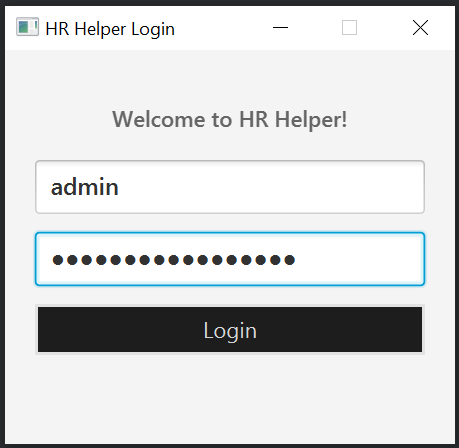

# HR Helper User Guide

HR Helper is a **desktop app for managing employees, optimized for use via a Command Line Interface** (CLI) while still having the benefits of a Graphical User Interface (GUI). If you can type fast, HR Helper can get your employee management tasks done faster than traditional GUI apps.

<!-- * Table of Contents -->
<page-nav-print />

--------------------------------------------------------------------------------------------------------------------

## Quick start

1. Ensure you have Java `17` or above installed in your Computer.

1. Download the latest `.jar` file from [here](https://github.com/se-edu/addressbook-level3/releases).

1. Copy the file to the folder you want to use as the _home folder_ for your AddressBook.

1. Open a command terminal, `cd` into the folder you put the jar file in, and use the `java -jar addressbook.jar` command to run the application. 
   A GUI similar to the below should appear in a few seconds. Note how the app contains some sample data. 
   

1. Type the command in the command box and press Enter to execute it. e.g. typing **`help`** and pressing Enter will open the help window. 
   Some example commands you can try:

   * `list` : Lists all contacts.

   * `add n/John Doe p/98765432 e/johnd@example.com a/John street, block 123, #01-01` : Adds a contact named `John Doe` to the Address Book.

   * `delete 3` : Deletes the 3rd contact shown in the current list.

   * `clear` : Deletes all contacts.

   * `exit` : Exits the app.

1. Refer to the [Features](#features) below for details of each command.
2. Refer to the [Person Detail Window](#person-details-window) below for the format of each command.
3. Refer to the [Command summary](#command-summary) below for the format of each command.

--------------------------------------------------------------------------------------------------------------------

## Features

<box type="info" seamless>

**Notes about the command format:** 

* Words in `UPPER_CASE` are the parameters to be supplied by the user. 
  e.g. in `add n/NAME`, `NAME` is a parameter which can be used as `add n/John Doe`.

* Items in square brackets are optional. 
  e.g `n/NAME [t/TAG]` can be used as `n/John Doe t/friend` or as `n/John Doe`.

* Items with `…`​ after them can be used multiple times including zero times. 
  e.g. `[t/TAG]…​` can be used as ` ` (i.e. 0 times), `t/friend`, `t/friend t/family` etc.

* Parameters can be in any order. 
  e.g. if the command specifies `n/NAME p/PHONE_NUMBER`, `p/PHONE_NUMBER n/NAME` is also acceptable.

* Extraneous parameters for commands that do not take in parameters (such as `help`, `list`, `exit` and `clear`) will be ignored. 
  e.g. if the command specifies `help 123`, it will be interpreted as `help`.

* If you are using a PDF version of this document, be careful when copying and pasting commands that span multiple lines as space characters surrounding line-breaks may be omitted when copied over to the application.
</box>

### Authentication:

Login to HR Helper with your username and password.

Format:

**Tip:** Press `Enter` to go to the next field!

Examples:
* For this version, the username is `admin` and password is `12345678`.
* For faster testing purposes, the username is `test` and password is `test`.

**Warning:** Keep your credentials secure.

We plan to implement adding more users in the future.

### Viewing help : `help`

Shows a message explaining how to access the help page.

Format: `help`

<box type="tip" seamless>

**Tip:** Use the help command anytime to quickly refresh on command usage.

Examples:

`need to update picture`
 

**Warning:** Clicking on the link will leave HR Helper.

### Adding a person: `add`

Adds an employee to the HR Helper.

Format: `add n/NAME p/PHONE_NUMBER e/EMAIL a/ADDRESS [t/TAG]…​ [f/Boolean] [d/DEPARTMENT] [l/LEAVE]`

`Add picture of expected output here`

<box type="tip" seamless>

**Tip:** A person can have any number of tags (including 0)
</box>

Examples:
* `add n/John Doe p/98765432 e/johnd@example.com a/John street, block 123, #01-01 f/true d/Operations l/12`
* `add n/Betsy Crowe t/friend e/betsycrowe@example.com a/Newgate Road p/1234567 t/lazy f/true d/Marketing l/10`

**Warning:** Duplicate employees with the same name cannot be added.

### Listing all persons : `list`

Shows a list of all persons in the address book.

Format: `list`

<box type="tip" seamless>

**Tip:** `list` can be used to show all employees after using the `find` command.

Example:
`Add picture of example here`

`Add picture of expected output here`

**Warning:** Use this command before other commands like delete or edit to ensure you’re modifying the correct entry.

### Counting persons : `count`

Counts number of persons.

Format: `count`(for counting entire list), `count tag/TAG`(for counting persons with given TAG)

* If counting the entire list, use `count`.
* If counting persons with specified TAG, add TAG to end of the command.

Examples:
* `count`
* `count tag/Colleagues`

### Editing a person : `edit`

Edits an existing person in the address book.

Format: `edit INDEX n/NAME p/PHONE_NUMBER e/EMAIL a/ADDRESS [t/TAG]…​ [f/Boolean] [d/DEPARTMENT] [l/LEAVE]`

* Edits the person at the specified `INDEX`. The index refers to the index number shown in the displayed person list. The index **must be a positive integer** 1, 2, 3, …​
* At least one of the optional fields must be provided.
* Existing values will be updated to the input values.
* When editing tags, the existing tags of the person will be removed i.e adding of tags is not cumulative.
* You can remove all the person’s tags by typing `t/` without
    specifying any tags after it.

Examples:
*  `edit 1 p/91234567 e/johndoe@example.com` Edits the phone number and email address of the 1st person to be `91234567` and `johndoe@example.com` respectively.
*  `edit 2 n/Betsy Crower t/` Edits the name of the 2nd person to be `Betsy Crower` and clears all existing tags.

### Locating persons by name: `find`

Finds persons whose names contain any of the given keywords.

Format: `find KEYWORD [MORE_KEYWORDS]`

* The search is case-insensitive. e.g `hans` will match `Hans`
* The order of the keywords does not matter. e.g. `Hans Bo` will match `Bo Hans`
* Only the name is searched.
* Only full words will be matched e.g. `Han` will not match `Hans`
* Persons matching at least one keyword will be returned (i.e. `OR` search).
  e.g. `Hans Bo` will return `Hans Gruber`, `Bo Yang`

Examples:
* `find John` returns `john` and `John Doe`
* `find alex david` returns `Alex Yeoh`, `David Li` 
  

### Deleting a person : `delete`

Deletes the specified person from the address book.

Format: `delete INDEX`

* Deletes the person at the specified `INDEX`.
* The index refers to the index number shown in the displayed person list.
* The index **must be a positive integer** 1, 2, 3, …​

Examples:
* `list` followed by `delete 2` deletes the 2nd person in the address book.
* `find Betsy` followed by `delete 1` deletes the 1st person in the results of the `find` command.

### Sorting Contacts: `sort`

Sorts the displayed contacts based on specified tags.

Format: `sort TAG`

* Sorts the contacts according to the specified tags.
* You can specify multiple tags for sorting.
* If no tags are specified, all contacts will be displayed in their original order.

Examples:
* `sort friend` Sorts and displays all contacts tagged as friend.
* `sort friend family` Sorts and displays contacts tagged as either friend or family.

### Favoriting a person : `favorite`

Favorites the specified person from the address book.

Format: `favorite INDEX`

* Favorites the person at the specified `INDEX`.
* The index refers to the index number shown in the displayed person list.
* The index **must be a positive integer** 1, 2, 3, …​

Examples:
* `list` followed by `favorite 2` favorites the 2nd person in the address book.
* `find Betsy` followed by `favorite 1` deletes the 1st person in the results of the `find` command.

### Clearing all entries : `clear`

Clears all entries from the address book.

Format: `clear`

### Exiting the program : `exit`

Exits the program.

Format: `exit`

### Person Details Window

The **Person Details Window** allows HR personnel to view and edit detailed information about each employee efficiently. This guide provides a concise overview of how to use this feature effectively.

- **Keyboard Shortcut:**
    - Select a person from the **Person List**.
    - Press the `Enter` key to open the **Person Details Window**.

- **Name:** Editable text field displaying the employee's full name.
- **Phone:** Editable text field for the employee's contact number.
- **Email:** Editable text field for the employee's email address.
- **Address:** Editable text field for the employee's residential or mailing address.
- **Department:** Editable text field indicating the employee's department within the organization.
- **Leave:** Editable text field showing the remaining leave days available to the employee.
- **Favorite:** Checkbox to mark the employee as a favorite for quick access.

**Editing Information**

- **Modify Fields:**
    - Press `Enter` on keyboard on any text field (e.g., **Name**, **Phone**) to edit the information.
    - For the **Favorite** checkbox, press `space` bar to toggle the favorite status.
  
- **Navigate Between Fields:**
    - **Tab Key / Down Arrow (`↓`):** Move to the next field.
    - **Shift + Tab Key / Up Arrow (`↑`):** Move to the previous field.

- **Save Changes:**
    - Press the `Enter` key to save all modifications.
    - The window will close, and changes will reflect in the **Person List**.

- **Cancel Changes:**
    - Press the `Esc` key to discard all changes and close the window without saving.

**Validation and Error Handling**

- **Mandatory Fields:**
    - All fields are required. Ensure no field is left empty before saving.

- **Format Requirements:**
    - **Phone:** Must be a valid phone number format.
    - **Email:** Must follow standard email formatting (e.g., `example@domain.com`).

- **Error Messages:**
    - If invalid data is entered, an error dialog will appear prompting correction.
    - Follow the on-screen instructions to rectify any issues.

### Saving the data

HR Helper data are saved in the hard disk automatically after any command that changes the data. There is no need to save manually.

### Editing the data file

HR Helper data are saved automatically as a JSON file `[JAR file location]/data/addressbook.json`. Advanced users are welcome to update data directly by editing that data file.

<box type="warning" seamless>

**Caution:**
If your changes to the data file makes its format invalid, HR Helper will discard all data and start with an empty data file at the next run.  Hence, it is recommended to take a backup of the file before editing it. 
Furthermore, certain edits can cause the AddressBook to behave in unexpected ways (e.g., if a value entered is outside the acceptable range). Therefore, edit the data file only if you are confident that you can update it correctly.
</box>

### Archiving data files `[coming in v2.0]`

_Details coming soon ..._

--------------------------------------------------------------------------------------------------------------------

## FAQ

**Q**: How do I transfer my data to another Computer? 
**A**: Install the app in the other computer and overwrite the empty data file it creates with the file that contains the data of your previous AddressBook home folder.

--------------------------------------------------------------------------------------------------------------------

## Known issues

1. **When using multiple screens**, if you move the application to a secondary screen, and later switch to using only the primary screen, the GUI will open off-screen. The remedy is to delete the `preferences.json` file created by the application before running the application again.
2. **If you minimize the Help Window** and then run the `help` command (or use the `Help` menu, or the keyboard shortcut `F1`) again, the original Help Window will remain minimized, and no new Help Window will appear. The remedy is to manually restore the minimized Help Window.

--------------------------------------------------------------------------------------------------------------------

## Command summary

Action     | Format, Examples
-----------|----------------------------------------------------------------------------------------------------------------------------------------------------------------------
**Add**    | `add n/NAME p/PHONE_NUMBER e/EMAIL a/ADDRESS [t/TAG]…​`   e.g., `add n/James Ho p/22224444 e/jamesho@example.com a/123, Clementi Rd, 1234665 t/friend t/colleague`
**Clear**  | `clear`
**Count**  | `count`: counts entire personel list  `count tag/TAG`: counts people in given tag e.g. `count tag/Colleagues`
**Delete** | `delete INDEX`  e.g., `delete 3`
**Edit**   | `edit INDEX [n/NAME] [p/PHONE_NUMBER] [e/EMAIL] [a/ADDRESS] [t/TAG]…​`  e.g.,`edit 2 n/James Lee e/jameslee@example.com`
**Find**   | `find KEYWORD [MORE_KEYWORDS]`  e.g., `find James Jake`
**Sort**   | `sort TAG`  e.g., `sort managers`
**Favorite** | `favorite INDEX`  e.g., `favorite 3`
**List**   | `list`
**Help**   | `help`
