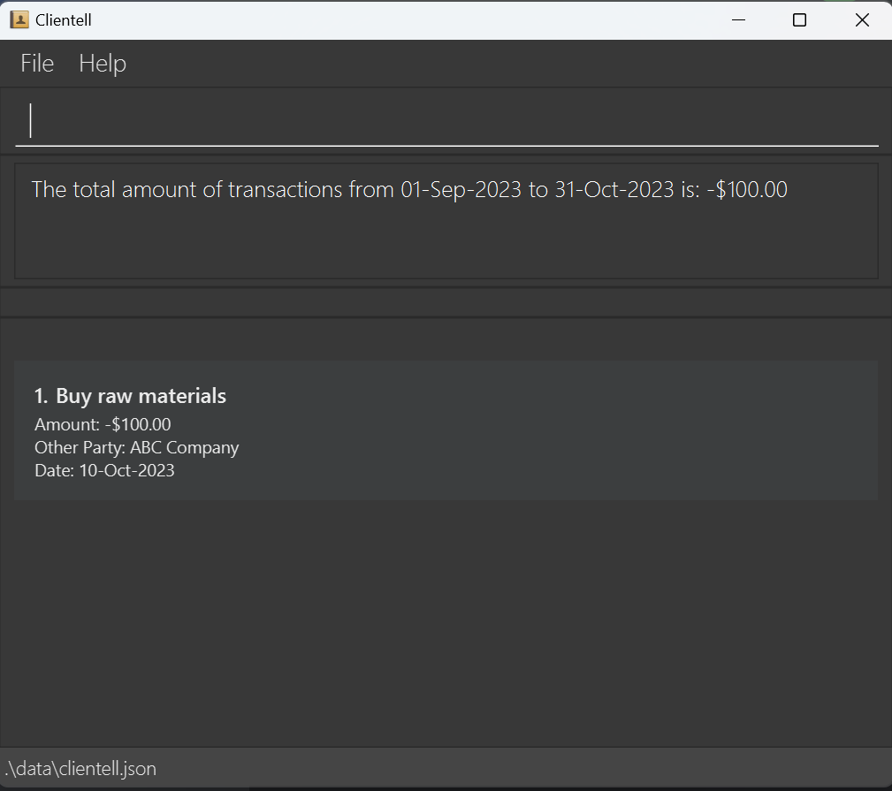

# Clientell User Guide

Clientell is a **desktop app for freelance financial consultants to manage clients and their transactions, optimized for use via a Command Line Interface** (CLI) with a simple Graphical User Interface (GUI). If you can type fast, Clientell can get your client management tasks done faster than traditional GUI apps.

Clientell is structured as an address book (a database to store details of clients), but with enhancements to cater to your financial bookkeeping needs and managing your clients' transactions.

Our guiding principle is: a small app for you to do big things. As such, we allow great flexibility in storing your data. While some features are designed with a certain use in mind (e.g `NAME` should be actual names of your clients), you may use and interpret them in a way that better suits your workflow (e.g `NAME` as NRIC/FIN/IDs rather than name, or both!). Of course, do this at your own risk. With great power comes great responsibility.

Go to [Quick Start](#quick-start) to get started, find [FAQ](#faq) for troubleshooting, [Technical Help](#technical-help) for how to get things running, [Command Summary](#command-summary) for available commands, and [Parameter Summary](#parameter-summary) to know what values are accepted.

## Table of Contents
- [Quick Start](#quick-start)
- [Features](#features)
  - [General Commands](#general-commands)
  - [Client Management Commands](#client-management-commands)
  - [Transaction Management Commands](#transaction-management-commands)
  - [Data Management](#data-management)
- [Command Summary](#command-summary)
- [Parameter Summary](#parameter-summary)
- [FAQ](#faq)
- [Known Issues](#known-issues)
- [Technical Help](#technical-help)


--------------------------------------------------------------------------------------------------------------------

## Quick start

1. Ensure you have [Java](https://www.oracle.com/java/technologies/javase/jdk17-archive-downloads.html) `17` or above installed in your computer.

2. Download the latest `.jar` file from [here](https://github.com/AY2425S1-CS2103T-F13-4/tp/releases).

3. Copy the file to the folder you want to use as the _home folder_ for the application.

4. Open a command terminal, `cd` into the folder you put the jar file in by typing  `cd [folder directory]` (where the folder is at), followed by `java -jar clientell.jar` in the same directory to run the application.<br>
   You should see the GUI below with some sample clients to start with. By default, the app displays the client list view upon launch, which is the view that lists your clients.<br>
   

5. Type a command in the command box and press Enter to execute it. e.g. typing **`help`** and pressing Enter will open the help window.<br>
   We suggest this sequence of commands to get a feeling for the app first:

   * `list` : Lists all clients. This takes you to the **client list view**.

   * `add n/John Doe c/ABC Inc. p/98765432 e/johnd@example.com a/John street, block 123, #01-01` : Adds a client named `John Doe` to the application.

   * `addt 1 d/buy raw materials amt/-100.55 o/Company ABC dt/2024-10-16` : Adds a transaction as shown to the client indexed 1 in the list.

   * `listt 1` : Lists all transactions of client indexed 1. You should see the transaction you just added. This is the **transaction list view**.

   * `list` : Lists all clients, again. This returns you to the **client list view**.
   
   * `exit` : Exits the app.
   
   * Now, in the same folder, you should see a data file `clientell.json`. Opening it will show the saved data from the app, which will be loaded the next time you launch Clientell.
  
   * Try finding the client and transaction you just added. This file is sensitive, so do not edit it. You may transfer this file to another device with Clientell installed and load the same data in that device's app's directory.

6. Refer to the [Features](#features) below for details of each command. Happy Bookkeeping!

--------------------------------------------------------------------------------------------------------------------

## Features

<box type="info" seamless>

**Notes about the command format:**<br>

* Words in `UPPER_CASE` are the parameters to be supplied by the user.<br>
  e.g. in `add n/NAME`, `NAME` is a parameter which can be used as `add n/John Doe`.

* Items in square brackets are optional.<br>
  e.g. `n/NAME [t/TAG]` can be used as `n/John Doe t/friend` or as `n/John Doe`.

* Items with `…`​ after them can be used multiple times including zero times.<br>
  e.g. `[t/TAG]…​` can be used as ` ` (i.e. 0 times), `t/friend`, `t/friend t/family` etc.

* Parameters can be in any order.<br>
  e.g. if the command specifies `n/NAME p/PHONE_NUMBER`, `p/PHONE_NUMBER n/NAME` is also acceptable.

* Extraneous parameters for commands that do not take in parameters (namely `help`, `list`, `exit` and `clear`) will be ignored.<br>
  e.g. if the command specifies `help 123`, it will be interpreted as `help`.

* A summary of non-obvious parameters is given at [Parameter Summary](#parameter-summary).

* If you are using a PDF version of this document, be careful when copying and pasting commands that span multiple lines as space characters surrounding line-breaks may be omitted when copied over to the application.
</box>

<box type="warning" seamless>

**Handling Errors In User Input:** Errors are caught in this order of severity
* First checks for valid command. Did you type a real command word?
* Then checks for presence of fields for that command. Did you give enough/correct info?
* Next checks if the command is run in the correct view (Client VS transaction list view). Are you using it in the right view?
* Next checks if, if there's a positive integer index, is it in range?
* Lastly checks if the command alters the balance beyond the supported range.

*Supported range for balance* is (-1.7976931348623157E+308, 1.7976931348623157E+308).

**Notes about extreme user behaviour:**
* Extreme inputs for some very flexible parameters (e.g name, address) are allowed but at your own risk of inconvenience.
* Namely, the window may not fully display the text/info. This can be remedied by expanding your window.
* This in no way affects other behaviours. In addition, these extreme inputs are also saved in the data file `clientell.json`.

</box>

### General Commands

#### Viewing help : `help`

Shows a message explaining how to access the help page.

Format: `help`


#### Clearing all entries : `clear`

Clears all clients and associated transactions from the application.

Format: `clear`

#### Exiting the program : `exit`

Exits the program.

Format: `exit`

### Client Management Commands

#### Adding a client: `add`

Adds a client to the application.

Format: `add n/NAME c/COMPANY p/PHONE_NUMBER e/EMAIL a/ADDRESS [t/TAG]…​`

<box type="tip" seamless>

**Tips:** <br>

* A client can have any number of tags (including 0).<br>

* Names are automatically formatted for you (i.e natural name casing, name ordinals, excess spacing).<br>

* Phone numbers can also take in additional info (i.e `(+XXX)` in front for country codes, `[Note]` behind for any notes).<br>

* Phone numbers also allow up to 1 space between numbers to cater to your formatting style (e.g `123 45 678` and `1234 5678` allowed and recorded verbatim).<br>
</box>

Examples:
* `add n/John Doe c/ABC Inc. p/98765432 e/johnd@example.com a/John street, block 123, #01-01`
* `add n/Betsy Crowe t/friend e/betsycrowe@example.com a/Newgate Prison p/1234567 t/criminal c/XYZ Co.`
* `add n/jOhN   dOE xvii c/ABC Inc. p/98765432 e/johnd@example.com a/John street, block 123, #01-01` (This name is recorded as `John Doe XVII`)
* `add n/John Doe c/ABC Inc. p/(+65) 987 654 32 [HP] e/johnd@example.com a/John street, block 123, #01-01` (This phone number is recorded exactly as  `(+65) 987 654 32 [HP]`)

#### Listing all clients : `list`

Shows a list of all clients in the application, together with their current financial balance.

Format: `list`
<box type="tip" seamless>

**Tips:** Negative balances are red. Positive and zero balances are green.

</box>
<box type="warning" seamless>

**Note:** `list` displays the **client list view**, and can be used in both client and transaction list views.
</box>

#### Editing a client : `edit`

Edits an existing client in the application.

Format: `edit INDEX [n/NAME] [c/COMPANY] [p/PHONE] [e/EMAIL] [a/ADDRESS] [t/TAG]…​`

* Edits the client at the specified `INDEX`. The index refers to the index number shown in the displayed client list. The index **must be a positive integer** 1, 2, 3, …​
* At least one of the optional fields must be provided.
* Existing values will be updated to the input values.
* When editing tags, the existing tags of the client will be removed i.e adding of tags is not cumulative.
* You can remove all the client's tags by typing `t/` without
    specifying any tags after it.

<box type="warning" seamless>

**Note:** `edit` can only be used in client list view.
</box>

Examples:
*  `edit 1 p/91234567 e/johndoe@example.com` Edits the phone number and email address of the 1st client to be `91234567` and `johndoe@example.com` respectively.
*  `edit 2 n/Betsy Crower t/` Edits the name of the 2nd client to be `Betsy Crower` and clears all existing tags.

#### Locating clients by name or company: `find`

Finds clients whose names or companies contain any of the given keywords.

Format: `find KEYWORD [MORE_KEYWORDS]`

* The search is case-insensitive. e.g `hans` will match `Hans`
* The order of the keywords does not matter. e.g. `Hans Bo` will match `Bo Hans`
* The name and company are searched.
* Only full words will be matched e.g. `Han` will not match `Hans`
* clients matching at least one keyword will be returned (i.e. `OR` search).
  e.g. `Hans Bo` will return `Hans Gruber`, `Bo Yang`

<box type="warning" seamless>

**Note:** `find` can only be used in client list view.
</box>

Examples:
* `find John` returns `john` and `John Doe`
* `find alex innovative` returns `Alex Yeoh`, `Roy Balakrishnan`, whose company matches `innovative`<br>
  

#### Deleting a client : `delete`

Deletes the specified client from the application.

Format: `delete INDEX`

* Deletes the client at the specified `INDEX`.
* The index refers to the index number shown in the displayed client list.
* The index **must be a positive integer** 1, 2, 3, …​

<box type="warning" seamless>

**Note:** `delete` can only be used in client list view.
</box>

Examples:
* `list` followed by `delete 2` deletes the 2nd client in the application.
* `find Betsy` followed by `delete 1` deletes the 1st client in the results of the `find` command.

### Transaction Management Commands

#### Adding a transaction to a specified client: `addt`

Format: `addt INDEX d/DESCRIPTION amt/AMOUNT o/OTHER_PARTY dt/DATE`

* Adds a transaction to the client at the specified `INDEX`
* The index refers to the index number shown in the displayed client list.
* The index **must be a positive integer** 1, 2, 3, …​
* The amount should be a number of up to two decimal places containing only digits (`0 - 9`), one decimal point (`.`) if needed and one minus sign (`-`) if needed with no blank spaces in between.
e.g. `10, -100.5, 1000.55`
* If the amount includes a decimal point, there should be at least one digit before and one digit after the decimal point. 
e.g. `0.5`
* If the amount includes a minus sign, the minus sign should be the first character e.g. `-100`
* The amount should be within the range -1 billion (`-1000000000`) to 1 billion (`1000000000`).
* The date should be in the format `YYYY-MM-DD` e.g. `2024-12-20`

<box type="warning" seamless>

**Note:** `addt` can only be used in client list view.

**IMPORTANT:** adding transactions that cause the client's balance to go beyond the supported range is not allowed.
</box>

Examples:
* `addt 1 d/buy raw materials amt/-100.55 o/Company ABC dt/2024-10-16`
* `list` followed by `addt 1 d/buy new equipment amt/-10000.5 o/ABC Motor Group dt/2024-11-17` 
adds the transaction to the 1st client in the application.
* `find David` followed by `addt 1 d/sell raw materials amt/200 o/Company XYZ dt/2024-09-01` 
adds the transaction to the 1st client in the results of the `find` command.

#### Listing transactions for a specified client: `listt`

Format: `listt INDEX`

* Lists the transactions for the client at the specified `INDEX`.
* The index refers to the index number shown in the displayed client list when using `list` or `find` command.
* The index **must be a positive integer** 1, 2, 3, …​
* Transactions are listed from newest to oldest transaction by transaction date.

<box type="warning" seamless>

**Note:** `listt` can only be used in client list view, and will take you to the **transaction list view**.
</box>

Examples:
* `list` followed by `listt 1` lists transactions for the 1st client in the application.
  
* `find Betsy` followed by `listt 1` lists the transactions for the 1st client in the results of the `find` command.

#### Deleting transactions for a specified client: `deletet`

Format: `deletet INDEX`

* Deletes the transactions at the specified `INDEX`.
* The index refers to the index number of the transaction when using `listt` command.
* The index **must be a positive integer** 1, 2, 3, …​

<box type="warning" seamless>

**Note:** `deletet` can only be used in transaction list view.
</box>

<box type="tip" seamless>

**Tip:** `deletet` and `addt` allow you to modify the transaction list at will. Future versions will support a command to directly edit an existing transaction.
</box>

Examples:
* `listt 1` followed by `deletet 1` loads the transaction list for the first client, then deletes the first transaction.

#### Finding transactions by description: `findt`

In a transaction list, finds all transactions with descriptions matching any of the given keywords.

Format: `findt KEYWORD [MORE_KEYWORDS]`

* The search is case-insensitive. e.g. `invest` will match `Invest`
* The order of the keywords does not matter. e.g. `invest material` will match `Material Invest`
* Only the description is searched.
* Only full words will be matched e.g.  `invest` will not match `investing`
* Clients matching at least one keyword will be returned (i.e. `OR` search).
  e.g. `investing material` will return `material purchase`, `future investing`

<box type="warning" seamless>

**Note:** `findt` can only be used in transaction list view.
</box>

Examples:
* `listt 1` followed by `findt materials invest` returns `Invest` and `Buy raw materials`, which are transactions of client 1.

#### Summarising transactions within month range: `summary`

In a transaction list, summarises the transactions' amount within the specified month range and displays them.

Format: `summary s/START_MONTH e/END_MONTH`
* `START_MONTH` and `END_MONTH` should be in the format `YYYY-MM` e.g. `2024-10`
* Month should be in the range `01-12` and year should be an integer.
* The `START_MONTH` should be before or equal to the `END_MONTH`
* The transactions whose date falls within the first day of `START_MONTH` and the last day of `END_MONTH` (inclusive) will be summarised.

<box type="warning" seamless>

**Note:** `summary` can only be used in transaction list view.
</box>

Examples:
* `listt 6` followed by `summary s/2023-09 e/2023-10` summarises the transactions of client 6 within the month of September and October 2023.
  

### Data Management

#### Saving the data

Clientell data are saved in the hard disk automatically after any command that changes the data. There is no need to save manually.

#### Editing the data file

Clientell data are saved automatically as a JSON file `[JAR file location]/data/clientell.json`. Advanced users are welcome to update data directly by editing that data file (not recommended).

<box type="warning" seamless>

**Caution:**
If your changes to the data file makes its format invalid, Clientell will discard all data and start with an empty data file at the next run.  Hence, it is recommended to take a backup of the file before editing it.<br>
For some cases, the app can autocorrect some mistakes:<br>
* Extraneous key-value pairs (i.e irrelevant fields/info) are ignored<br>
* Copies of relevant key-value pairs (e.g multiple names/companies) only admit the last copy<br>


As a rule of thumb: if the edits you make could've been achieved by using the commands normally and legally, then the edits are valid. Most common mistakes include updating the file to include illegal values. Therefore, edit the data file only if you are confident that you can update it correctly.<br>
Lastly, never update the JSON file while the app is running. As the data saves at the end of a session (e.g when you `exit`), it will override the JSON file (i.e you will lose all manual changes to the JSON)
</box>

--------------------------------------------------------------------------------------------------------------------


## Command Summary

Switching between... | Command | Format
---------------|---------------|------------
Client to transaction list view | List Transactions | `listt INDEX`
Transaction to client list view | List Clients | `list`

Client Commands | Format | Usable in what view?
---------------|--------------|--------
Add | `add n/NAME c/COMPANY p/PHONE_NUMBER e/EMAIL a/ADDRESS [t/TAG]…`|Client list view
List | `list`|Client and transaction list views  
Find | `find KEYWORD [MORE_KEYWORDS]`|Client list view
Edit | `edit INDEX [n/NAME] [c/COMPANY] [p/PHONE_NUMBER] [e/EMAIL] [a/ADDRESS] [t/TAG]…`|Client list view
Delete | `delete INDEX`|Client list view


Transaction Commands | Format | Usable in what view?
---------------|--------------|--------
Add Transaction | `addt INDEX d/DESCRIPTION amt/AMOUNT o/OTHER_PARTY dt/DATE`|Client list view
List Transactions | `listt INDEX`|Client list view
Delete Transaction | `deletet INDEX`|Transaction list view
Find Transactions | `findt KEYWORD [MORE_KEYWORDS]`|Transaction list view
Summarise Transactions | `summary s/START_MONTH e/END_MONTH`|Transaction list view

General Commands | Format| Usable in what view?
----------------|--------------|--------
Help | `help`|Client and transaction list views  
Clear | `clear`|Client and transaction list views  
Exit | `exit`|Client and transaction list views  

--------------------------------------------------------------------------------------------------------------------

## Parameter Summary

This table summarises the non-obvious parameters in natural language.

Parameter | Restrictions                                                                                                                                                                                                                                                                                      | Extreme accepted example | Invalid example 
---------------|---------------------------------------------------------------------------------------------------------------------------------------------------------------------------------------------------------------------------------------------------------------------------------------------------|---------------|--------
Index | Positive integer not exceeding list size                                                                                                                                                                                                                                                          | `5` (assuming at least 5 clients/transactions in list) | `0` (not positive)
Name | Alphanumeric and spaces, but not blank.                                                                                                                                                                                                                                                           | `E1234567 john doe vii` | `john s/o doe` (contains `/`)
Company | Anything, but not blank.                                                                                                                                                                                                                                                                          | `💁 Inc.`| ` ` (blank)
Phone | The optional country code in front `(+XXX)` must be 1-3 digits, the optinal notes `[Notes]` behind must be 1-10 of any characters, and the main number must not be blank, with up to 1 space between digits.                                                                                      | `(+123) 9 8 7 [short note]`| `(+1234) [this is too long]` 
Email | `local-part@domain`, where the local part is alphanumeric with at most 1 of special characters `+_.-` in between alphanumerals (i.e not at start nor end), and domain is alphanumeric with at most 1 of special characters `-.` between alphanumerals. It must end with at least 2 alphanumerals. | `a+b-c.d@a-z.co` | `a++b@c.-d` (too many special characters in between, ends with only 1 alphanumeral)
Address | Anything, but not blank.                                                                                                                                                                                                                                                                          | `💁`| ` ` (blank)
Tag | Alphanumeric, but not blank.                                                                                                                                                                                                                                                                      | `something`| `some thing` (space, not alphanumeric)
Transaction description | Anything, but not blank.                                                                                                                                                                                                                                                                          | `💁`| ` ` (blank)
Transaction amount | Between ± 1 Billion, to 2 decimal places. When there's a decimal point, there must be at least a digit both before and after it.                                                                                                                                                                  | `-1000000000.00`| `-.001` (no digit before `.`, and more than 2 decimal places)
Transaction party | Anything, but not blank.                                                                                                                                                                                                                                                                          | `💁`| ` ` (blank)
Transaction date | `yyyy-mm-dd`, a valid date starting from `-9999-01-01` to `9999-12-31`                                                                                                                                                                                                                            | `9999-12-31`| `2025-02-29` (date doesn't exist)


--------------------------------------------------------------------------------------------------------------------

## FAQ

**Q**: How do I transfer my data to another computer?<br>
**A**: Copy the `clientell.json` data file you want to transfer. On your other device and in the application directory (the folder containing the app), if there's already an existing data file, replace it with your version (preferably saving the replaced copy somewhere). Otherwise if there's no such file, safely paste the file inside the folder.

**Q**: What should I do if the application won't start? <br>
**A**: First verify Java `17` or above is installed correctly. If the problem persists, check if the `clientell.json` file is corrupted, and use a backup of the file (recommended) or rectify the mistakes in the file (not recommended).

**Q**: Can I customize the data file location?<br>
**A**: Currently, the data file location is fixed to the application directory (i.e it's in the same place as the app file). However, you can copy the data elsewhere (or if you're tech-savvy, create a [symbolic link](https://stackoverflow.com/questions/1951742/how-can-i-symlink-a-file-in-linux) )

**Q**: How do I back up my data?<br>
**A**: Simply copy the `clientell.json` file to a backup location.

**Q**: What should I do if I accidentally delete a client?<br>
**A**: Use your latest backup of the `clientell.json` file. There's currently no undo feature, so regular backups are recommended.

**Q**: Can I import data from other applications?<br>
**A**: Currently, direct import is not supported. However, you can manually format your data as JSON matching Clientell's format. This is very much not recommended due to risk of corrupting the data file.

--------------------------------------------------------------------------------------------------------------------

## Known Issues

1. **When using multiple screens**, if you move the application to a secondary screen, and later switch to using only the primary screen, the GUI will open off-screen. The remedy is to delete the `preferences.json` file created by the application before running the application again.
2. **If you minimize the Help Window** and then run the `help` command (or use the `Help` menu, or the keyboard shortcut `F1`) again, the original Help Window will remain minimized, and no new Help Window will appear. The remedy is to manually restore the minimized Help Window.


--------------------------------------------------------------------------------------------------------------------

## Technical Help
Here is a collection of helpful info regarding setting up the application.

Downloading Java `17` for various operating systems (OS):

Linux:
- **x64**: **Debian Package** - [Download](https://download.oracle.com/java/17/archive/jdk-17.0.12_linux-x64_bin.deb)
- **ARM 64**: **RPM Package** - [Download](https://download.oracle.com/java/17/archive/jdk-17.0.12_linux-aarch64_bin.rpm)

macOS:
- **ARM 64**: **DMG Installer** - [Download](https://download.oracle.com/java/17/archive/jdk-17.0.12_macos-aarch64_bin.dmg)
- **x64**: **DMG Installer** - [Download](https://download.oracle.com/java/17/archive/jdk-17.0.12_macos-x64_bin.dmg)

Windows:
- **x64**: **Installer (.exe)** - [Download](https://download.oracle.com/java/17/archive/jdk-17.0.12_windows-x64_bin.exe)

**Accessing Terminal**<br>
On Windows:
   - **Method 1**: Press **Windows Key + R**, type `cmd`, and press **Enter** to open the Command Prompt.
   - **Method 2**: For PowerShell, right-click on the **Start** button and select **Windows PowerShell** or **Terminal** (on Windows 11).
   - **Method 3**: Search for **Command Prompt** or **PowerShell** directly in the Windows search bar.

On macOS:
   - **Method 1**: Press **Command + Space** to open **Spotlight Search**, type "Terminal," and press **Enter**.
   - **Method 2**: Open **Finder** > **Applications** > **Utilities** > **Terminal**.

On Linux:
   - **Method 1**: Use the shortcut **Ctrl + Alt + T** to open the terminal directly in most distributions.
   - **Method 2**: Search for "Terminal" in your applications menu.
   - **Method 3**: Right-click on the desktop or within a folder and select **Open Terminal** (works on many distributions).

Once open, you can enter commands like `java -version` or `java -jar path/to/yourfile.jar` directly in the terminal.

**Check Java Version**<br>
To see if Java is installed and verify its version, use the following command:

```bash
java -version
```

You should see information about the Java version, like `java version "17.0.12"`. If Java is not installed, this command may return an error or say "command not found."

**Run a JAR File**<br>
Once Java is installed, you can run a JAR file using:

```bash
java -jar path/to/yourfile.jar
```

- **Replace `path/to/yourfile.jar`** with the full path or relative path to your JAR file.
- **Note**: Ensure you’re in the directory of the JAR file or provide its full path.

To change directories in the terminal, you use the `cd` (change directory) command, followed by the path to the directory you want to access.

**Changing Directory**<br>
To a specific directory:
   ```bash
   cd path/to/directory
   ```
   - Replace `path/to/directory` with the full path or relative path of your desired directory.
   - **Example**: To go to a folder named `Documents`, use:
     ```bash
     cd ~/Documents
     ```

Go up one level:
   ```bash
   cd ..
   ```
   - `..` tells the terminal to move up one level in the directory structure.

Go to home directory (usually the most "natural" or "default" directory that you'd start in):
   ```bash
   cd ~
   ```
   - The tilde (`~`) symbol represents your home directory.
