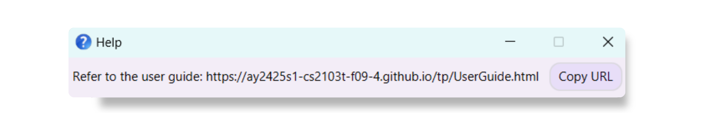

 

# Tuteez User Guide

 

## Welcome Aboard Tuteez

Welcome to Tuteez – a **powerful desktop address book application** designed specifically for **private tutors** to **manage student contacts and lesson schedules**.
Tuteez empowers you to effortlessly keep all your student information organized and accessible in one place, putting any information you need right at your fingertips.

Tuteez offers both a _Command Line Interface (CLI)_ for fast, keyboard-driven commands and a _Graphical User Interface (GUI)_ with clear buttons and menus designed for intuitive navigation, catering to both speed and ease of use.

By letting Tuteez handle your organizational tasks, you can focus on what matters most—_teaching_.

In this guide, we will walk you through Tuteez’s key features and demonstrate how it can transform your tutoring experience.
 

### Table of Contents

<!-- TOC start -->
1. [User Guide Overview](#user-guide-overview)  
 
2. [How to Use this Guide](#how-to-use-this-guide)  
   2.1 [Notations Used](#notations-used)  
   2.2 [Recommended Sections Based on User Experience](#recommended-sections-based-on-user-experience)  
 
3. [Quick Start](#quick-start)  
   3.1 [Prerequisites](#prerequisites)  
   3.2 [Setting up](#setting-up)  
 
4. [GUI Overview](#gui-overview)  
 
5. [Beginner's Tutorial](#beginner-s-tutorial)  
   5.1 [Before You Begin](#before-you-begin)  
   5.2 [Exploring the Application](#exploring-the-application)  
   5.3 [Starting with a Clean Slate](#starting-with-a-clean-slate)  
   5.4 [Adding Your First Student](#adding-your-first-student)  
   5.5 [Adding a Lesson to Your Student's Details](#adding-a-lesson-to-your-student-s-details)  
   5.6 [Editing Student Details](#editing-student-details)  
   5.7 [Deleting a Student](#deleting-a-student)  
   5.8 [Wrapping Up](#wrapping-up)  
 
6. [Features](#features)  
   6.1 [Viewing Help: `help`](#viewing-help-help)  
   6.2 [Adding a Student: `add`](#adding-a-student-add)  
   6.3 [Deleting a Student: `delete`](#deleting-a-student-delete)  
   6.4 [Editing a Student: `edit`](#editing-a-student-edit)  
   6.5 [Listing All Students: `list`](#listing-all-students-list)  
   6.6 [Adding a Remark: `addremark`](#adding-a-remark-addremark)  
   6.7 [Deleting a Remark: `deleteremark`](#deleting-a-remark-deleteremark)  
   6.8 [Adding Lessons: `addlesson`](#adding-lessons-addlesson)  
   6.9 [Deleting Lessons: `deletelesson`](#deleting-lessons-deletelesson)  
   6.10 [Searching for Students: `find`](#searching-for-students-find)  
   6.11 [Displaying Student Information: `display`](#displaying-student-information-display)  
   6.12 [Navigating Command History: <kbd>&uarr;</kbd> or <kbd>&darr;</kbd>](#navigating-command-history)  
   6.13 [Clearing All Entries: `clear`](#clearing-all-entries-clear)  
   6.14 [Exiting the Program: `exit`](#exiting-the-program-exit)  
 
7. [Things You Should Definitely Know](#things-you-should-definitely-know)  
   7.1 [Constraints on Adding a Lesson](#constraints-on-adding-a-lesson)  
   7.2 [Current Limitations](#current-limitations)  
   7.3 [Saving the Data](#saving-the-data)  
   7.4 [Editing the Data File](#editing-the-data-file)  
 
8. [Exciting Features in the Future](#exciting-features-in-the-future)  
 
9. [Frequently Asked Questions](#frequently-asked-questions)  
 
10. [Known Issues](#known-issues)  
 
11. [Glossary](#glossary)  
 
12. [Command Summary](#command-summary)  
 
13. [Command Parameters](#command-parameters)  
<!-- TOC end -->

 

### User Guide Overview

 

Here is a quick look at the various sections in this user guide:
- **[Quick Start](#quick-start)**: A fast-track section to get Tuteez up and running in no time. It includes setup instructions and a list of essential commands you can try out immediately.  
- **[GUI Overview](#gui-overview)**: A quick overview of the user interface of Tuteez, with explanations of the left and right panels.  
- **[Beginner's Tutorial](#beginner-s-tutorial)**: A step-by-step guide for new users to get started with Tuteez. It includes instructions on adding students, editing details, scheduling lessons, and deleting students.  
- **[Features](#features)**: This section covers all the key commands in Tuteez, providing detailed descriptions of each function. You’ll learn how to add students, manage lessons, add remarks, and more.  
- **[Things You Should Definitely Know](#things-you-should-definitely-know)**: Important information about constraints and limitations of the current version of Tuteez.  
- **[Exciting Features in the Future](#exciting-features-in-the-future)**: A sneak peek into the exciting features that will be added to Tuteez in future updates.  
- **[Frequently Asked Questions](#frequently-asked-questions)**: Answers to the most frequently asked questions about Tuteez.  
- **[Known Issues](#known-issues)**: A list of known issues that you may encounter while using Tuteez.  
- **[Glossary](#glossary)**: Explanation of key terms used in the user guide. 
- **[Command Summary](#command-summary)**: A quick reference guide summarising all the commands available in Tuteez.  
- **[Command Parameters](#command-parameters)**: A quick reference guide for acceptable parameters in Tuteez with examples.

 

## How to Use this Guide

 

### Notations Used

Here's how to read this User Guide! We use these visual styles to help you navigate better:

| **Text Styles**              | **Description**                              |
|------------------------------|----------------------------------------------|
| `Command text`               | Used to represent command syntax.            |
| **Bold text**                | Highlights important keywords.               |
| [Hyperlink](#notations-used) | Provides clickable links for your reference. |

| **Call-outs**                                                                                   | **Description**                          |
|-------------------------------------------------------------------------------------------------|------------------------------------------|
| 
ℹ️ **Info**
     | For additional information.             |
| 
❗️️ **Warning**
 | A caution or important warning.         |
| 
💡 **Tip**
  | Helpful tips to make your experience smoother. |

 

### Recommended Sections Based on User Experience

| **User Experience** | **Recommended Sections**                                                                                                                            |
|---------------------|-----------------------------------------------------------------------------------------------------------------------------------------------------|
| **Beginner**        | We highly recommend starting with the [Beginner's Tutorial](#beginner-s-tutorial) to get comfortable with Tuteez’s essential features and commands. |
| **Advanced User**   | Feel free to skip directly to the [Command Summary](#command-summary) for a quick overview of all commands available in Tuteez.                     |

 

 

## Quick start

 

### Prerequisites

- Ensure you have Java `17` or above installed in your computer.
  
  To check if you have Java `17` installed, open up a command terminal in your computer, type `java -version` and press <kbd>Enter</kbd>.

  If you do not have Java `17` installed, you can download it from the [official Oracle website](https://www.oracle.com/java/technologies/javase/jdk17-archive-downloads.html).

 

### Setting up

1. Download the latest `Tuteez.jar` file from [our GitHub Releases](https://github.com/AY2425S1-CS2103T-F09-4/tp/releases).

2. Copy the file to the folder in your computer that you want to use as the _home folder_ for Tuteez.

3. Open a command terminal, navigate into the folder you put the `Tuteez.jar` file in by entering the following command:
   `cd folder/path` where `folder/path` is the path to the folder where the `Tuteez.jar` file is located.

4. Run the application by entering the following command: `java -jar tuteez.jar` 
   A GUI similar to the image below should appear in a few seconds. Note how the app contains some sample data for your reference. 
     
   
     

5. Type the command in the command box and press <kbd>Enter</kbd> to execute it. e.g. typing **`help`** and pressing <kbd>Enter</kbd> will open the help window. 
   Some example commands you can try:

   * `list` : Lists all contacts.

   * `add n/John Doe p/98765432 e/johnd@example.com a/John street, block 123, #01-01` : Adds a student named `John Doe` to Tuteez.

   * `delete 3` : Deletes the 3rd contact shown in the current list.

   * `clear` : Deletes all contacts.

   * `exit` : Exits the app.

6. You may refer to the [Beginner's Tutorial](#beginner-s-tutorial) to get a hands-on walkthrough of the application, or refer to the [Features](#features) section below for details of each command.

 

## GUI Overview

| Component      | Description                                                                                                                                                                                                                                                                                                                                                                                                                                                                    |
|----------------|--------------------------------------------------------------------------------------------------------------------------------------------------------------------------------------------------------------------------------------------------------------------------------------------------------------------------------------------------------------------------------------------------------------------------------------------------------------------------------|
| **Menu Bar** | <ul><li>Located at the top of the application. </li><li>Contains essential functions including File and Help menus.</li></ul>                                                                                                                                                                                                                                                                                                                                                  |
| **Left Panel** | <ul><li>Prioritizes important information such as student's phone number, address, and next lesson based on your computer's current time.  </li><li>If a lesson is currently ongoing, it will show that lesson as the next lesson on the left panel.    
ℹ️ **Info**:  If your computer's time has been changed, please restart the app to sync our internal clock to your new time!
</ul> |
| **Right Panel** | <ul><li>Provides the full view of a student's information when you use the `display` command. </li><li> Shows all the student's lesson details and remarks you have left them. </li> 
ℹ️ **Info**:  Refer to the [Displaying Student Information](#displaying-student-information-display) section for more details on the `display` command. 
</ul>                                          |
| **Results Box** | <ul><li>Displays the results of the commands you have entered.</li><li>If the command was successfully executed, the corresponding message will be shown.</li><li>If the command failed to execute, an error message will be shown.</li></ul>                                                                                                                                                                                                                                  |
| **Command Box** | <ul><li>The area where you can enter commands to interact with the application. </li></ul>                                                                                                                                                                                                                                                                                                                                                                                     |

## Beginner's Tutorial

If you're a new user, fret not! Simply follow this beginner-friendly tutorial that will walk you through your first
steps with the application, which will allow you to get comfortable with managing your student contacts effectively.

 

### Before You Begin
Make sure you have:
- Successfully installed Tuteez and launched the application (Refer to the [Quick Start](#quick-start) section if you have not).

 

 

### Exploring the Application
Upon launching the application, you should see a window similar to the one below:

The *Left Panel* displays the list of students you have added. 
Separated from the left panel by a divider is the *Right Panel* displays the details of the selected student.

The *Command Box* at the bottom of the window is where you can enter commands to interact with the application.

Above the *Command Box*, you will find the *Results Box*, which displays the results of the commands you have entered.

 

 

### Starting with a Clean Slate
Let us start by clearing the sample data that comes with the application. Type `clear` in the Command Box and press <kbd>Enter</kbd>.

You should see a message indicating that all entries have been cleared, and the list of students should now be empty.

If everything went well, you'll be greeted by this view:

 

 

### Adding Your First Student
Let's say you already have a student named John Doe, and you wish to add his details into Tuteez.

Let's try entering the following command: `add n/John Doe p/98765432 e/johnd@example.com a/Jurong West`

This means that you've added a student named `John Doe`, with the phone number `98765432`, email `johnd@example.com`,
and address `Jurong West`.

If everything went well, you'll be greeted by this view:

ℹ️ **Info**: For more details on the `add` command, please refer to the [Add Command](#adding-a-student-add) section.

 

 

### Adding a Lesson to your Student's details
Now, you have finalized a lesson schedule with John Doe, and you wish to add it to his details.

Let's try entering the following command: `addlesson 1 l/Monday 0900-1100`

This means that you've added a lesson for `John Doe` on `Monday` from `9 am to 11 am`.

If everything went well, you'll be greeted by this view:

 

### Editing Student Details
You've realized that you've made a mistake in John Doe's email address, and wish to edit it.

Let's try entering the following command: `edit 1 e/johndoe@gmail.com`

John's email address should now be updated to `johndoe@gmail.com` and the updated email address should be reflected in Tuteez.

If everything went well, you'll be greeted by this view:

ℹ️ **Info**: For more details on the `edit` command, please refer to the [Edit Command](#editing-a-student-edit) section.

 

 

### Deleting a Student
John Doe has decided to stop engaging your tuition services, and you wish to remove him from your list of students.

Let's try entering the following command: `delete John Doe`

John Doe should now be removed from your list of students.

If everything went well, you'll be greeted by this view:

 

 

### Wrapping Up
Congratulations! You've successfully completed the beginner's tutorial for Tuteez.
You're now ready to move on to more advanced features and commands that Tuteez has to offer.
Simply visit the [Features](#features) section to learn more about the various commands available to you.

 

## Features

<box type="info" seamless>

**Notes about the command format:** 

* Words in `UPPER_CASE` are the parameters to be supplied by the user. 
  e.g. in `add n/NAME`, `NAME` is a parameter which can be used as `add n/John Doe`.

* Items in square brackets are optional. 
  e.g `n/NAME [t/TAG]` can be used as `n/John Doe t/Math` or as `n/John Doe`.

* Items with `…`​ after them can be used multiple times including zero times. 
  e.g. `[t/TAG]…​` can be used as ` ` (i.e. 0 times), `t/Secondary`, `t/Math t/Science` etc.

* Parameters can be in any order. 
  e.g. if the command specifies `n/NAME p/PHONE_NUMBER`, `p/PHONE_NUMBER n/NAME` is also acceptable.

* Extraneous parameters for commands that do not take in parameters (such as `help`, `list`, `exit` and `clear`) will be ignored. 
  e.g. if the command specifies `help 123`, it will be interpreted as `help`.

* If you are using a PDF version of this document, be careful when copying and pasting commands that span multiple lines as space characters surrounding line-breaks may be omitted when copied over to the application.
</box>

 

### Viewing Help: `help`

If you are in doubt, type this command to access the online user guide tailored to your needs.

**Format**: `help`

[Take me back to Table of Contents](#table-of-contents)
 

 

### Adding a Student: `add`

You can add a new student and their personal details to your list of students.

**Format**: `add n/NAME p/PHONE_NUMBER [e/EMAIL] [a/ADDRESS] [tg/TELEGRAM_USERNAME] [t/TAG]…​ [l/LESSON]…​`

ℹ️ **Info**: Only the **name** and **phone number** are required fields. The other fields are optional.

 

ℹ️ **Info**:  You cannot add lessons that clash, meaning lessons cannot be scheduled on the same day and overlap in timing. If a clash is detected, the app will notify you with an error message. To see more details on valid lessons, check out the [constraints on adding a lesson](#constraints-on-adding-a-lesson)

 

ℹ️ **Info**: Duplicate detection of students are done by **name**, hence you cannot add a student with the same name as an existing student in tuteez. A workaround is to add numbers to the back of the name (e.g. John Doe 2).

 

💡 **Tip**: You can add any number of tags and lessons to a student (or you could also omit them)

Examples:
* `add n/John Doe p/98765432 e/johnd@example.com a/John street, block 123, #01-01`
* `add n/Betsy Crowe t/friend e/betsycrowe@example.com a/Newgate Prison p/1234567 t/Math l/monday 0900-1100`

[Take me back to Table of Contents](#table-of-contents)
 

 

### Deleting a Student: `delete`

You can delete a specified student from Tuteez.

**Format**: `delete INDEX` or `delete NAME`

* Deletes the student at the specified `INDEX` or by their full `NAME` (case-insensitive).
    - When using the `NAME` option, the full name of the student must be provided.
* The index refers to the index number shown in the displayed student list.
* The index **must be a positive integer** such as 1, 2, 3, …​

ℹ️ **Info**: Duplicate detection of students are done by **name**. Therefore, you cannot change a student's name to match the name of an existing student in Tuteez, unless it is the same student being edited. A workaround is to add numbers to the back of the name (e.g. John Doe 2).

 

💡 **Tip**: You can also use the abbreviated command `del` as a shortcut for `delete`.

Examples:
* `list` followed by `delete 2` deletes the 2nd student in the address book.
* `find Betsy` followed by `delete 1` deletes the first student in the results of the `find` command.
* `delete John Doe` deletes the student with the full name "John Doe" from the address book, ignoring case sensitivity.

[Take me back to Table of Contents](#table-of-contents)
 

 

### Editing a Student: `edit`

You can edit an existing student's details in Tuteez to update outdated information on the fly.

**Format**: `edit INDEX [n/NAME] [p/PHONE] [e/EMAIL] [a/ADDRESS] [t/TAG]…​`

* Edits the student at the specified `INDEX`. The index refers to the index number shown in the displayed student list. The index **must be a positive integer** such as 1, 2, 3, …​
* At least one of the optional fields must be provided.
* Existing values will be updated to the input values.
* When editing **tags**, **all previous values will be replaced** by the new ones entered.
    - This means you must **retype all old tags** you wish to keep, as editing will overwrite them completely.
* You can remove all optional fields as specified in the `add` command by typing its parameter prefix (e.g. `t/`) without specifying any values after them.

Examples:
*  `edit 1 p/91234567 e/johndoe@example.com` Edits the phone number and email address of the 1st student to be `91234567` and `johndoe@example.com` respectively.
*  `edit 2 n/Betsy Crower t/` Edits the name of the 2nd student to be `Betsy Crower` and clears all existing tags.

[Take me back to Table of Contents](#table-of-contents)
 

 

### Listing All Students: `list`

You can easily view the list of all your students in Tuteez on the left panel.

**Format**: `list`

[Take me back to Table of Contents](#table-of-contents)
 

 

### Adding a Remark: `addremark`

You can easily keep track of student details by adding a remark for a specific student in Tuteez.

**Format**: `addremark INDEX r/REMARK` to add a remark to the student at the specified `INDEX`.

* Adds a new remark to the student at the specified `INDEX`. The index refers to the index number shown in the displayed student list. The index **must be a positive integer** such as 1, 2, 3, …​
* You can add any text as a remark except for " r/", and remarks are displayed in the order they were added.

💡 **Tip**: You can also use the abbreviated command `addrmk` as a shortcut for `addremark`.

Examples:
* `addremark 1 r/Great progress in Math` Adds the remark "Great progress in Math" to the first student.
* `addrmk 2 r/Needs more practice in Permutations and Combinations` Adds the remark "Needs more practice in Permutations and Combinations".

[Take me back to Table of Contents](#table-of-contents)
 

 

### Deleting a Remark: `deleteremark`

You can delete a remark for a specific student in Tuteez.

**Format**: `deleteremark INDEX ri/REMARK_INDEX` to add a remark to the student at the specified `INDEX`.

* Deletes an existing remark from the student at the specified `REMARK_INDEX`. The remark index refers to the order in which the remarks were added. The index **must be a positive integer** such as 1, 2, 3, …​
* When deleting, if the `REMARK_INDEX` is not valid, an error will be shown on your screen.

💡 **Tip**: You can also use the abbreviated command `delrmk` as a shortcut for `deleteremark`.

Examples:
* `deleteremark 1 ri/2` Deletes the second remark of the first student in the displayed student list.
* `delrmk 2 ri/1` Deletes the first remark of the second student in the displayed student list.

[Take me back to Table of Contents](#table-of-contents)
 

 

### Adding Lessons: `addlesson`

You can efficiently manage your schedule by adding lesson(s) to a specific student in Tuteez.

**Format**: `addlesson INDEX l/LESSON [l/LESSON]…​`

* short form: `addlsn INDEX l/LESSON [l/LESSON]…​`
* This adds new lesson(s) to the student at the specified `INDEX`. The index refers to the index number shown in the displayed student list. The index **must be a positive integer** such as 1, 2, 3, …​
* You can add multiple lessons to a student at once.
* Lessons have to start with the **day** of the week (case-insensitive) followed by the **time** in the **24-hour format** `HHMM-HHMM`, separated by a space.

💡 **Tip**: You can also use the abbreviated command `addlsn` as a shortcut for `addlesson`.

 

💡 **Tip**: When specifying lesson days, you can enter either the full day name (e.g., `Monday`) or a 3-letter abbreviation (e.g., `Mon`). This applies to all days of the week.

 

️❗️ **Warning**: Lessons added must not clash (i.e., scheduled on the same day and overlapping in timing). If a clash is detected, an error message will be shown on your screen.

 

ℹ️ **Info**: To see more details on valid lessons, check out the [constraints on adding a lesson](#constraints-on-adding-a-lesson)

Examples:
* `addlesson 1 l/Monday 0900-1100` Adds a lesson on Monday from 9 am to 11 am to the first student.
* `addlsn 2 l/tue 1400-1600 l/thu 1400-1600` Adds lessons on Tuesday and Thursday from 2 pm to 4 pm to the second student.

[Take me back to Table of Contents](#table-of-contents)
 

 

### Deleting Lessons: `deletelesson`

You can remove lesson(s) from a specific student in Tuteez.

**Format**: `deletelesson INDEX li/LESSON_INDEX [li/LESSON_INDEX]…​`

* short form: `dellsn INDEX li/LESSON_INDEX [li/LESSON_INDEX]…​`
* Deletes lesson(s) from the student at the specified `INDEX`. The index refers to the index number shown in the displayed student list. The index **must be a positive integer** such as 1, 2, 3, …​
* Lessons are indexed starting from 1 and sorted in ascending order based on their day and time.
* If the `LESSON_INDEX` is not valid, an error will be shown on your screen.

💡 **Tip**: You can also use the abbreviated command `dellsn` as a shortcut for `deletelesson`.

Examples:
* `deletelesson 1 li/1` Deletes the first lesson of the first student.
* `dellsn 2 li/2 li/3` Deletes the second and third lessons of the second student.

💡 **Tip**: Want to delete multiple lessons at once? Simply specify multiple different lesson indices in the parameters.

[Take me back to Table of Contents](#table-of-contents)
 

 

### Searching for Students: `find`

You can find students whose names, addresses, tags or lessons contain any of the given keywords. Searching by these fields is effective, as they are more likely to yield relevant matches based on how students are grouped or organized in the system.
When you are searching for lessons, you can search for lesson day and/or lesson time.

**Format**: `find [n/NAME_KEYWORDS] [a/ADDRESS_KEYWORDS] [t/TAG_KEYWORDS] [ld/LESSON_DAY_KEYWORDS] [lt/LESSON_TIME_KEYWORDS]`

* The search is case-insensitive. e.g `hans` will match `Hans`
* Keyword must not be empty, else an error will be thrown
* The order of the keywords does not matter. e.g. `Hans Bo` will match `Bo Hans`
* For name keywords, only the name is searched. For address keywords, only the address is searched etc.
* For words, only full words will be matched e.g. `Han` will not match `Hans`
* Lesson day keywords must be a **day** of the week (case-insensitive), or the first 3 letters of a day e.g. `mon tue wed`
* Lesson time keywords must be in **24-hour format** `HHMM-HHMM`. Lessons with overlapping time-ranges will be matched e.g. `0800-1000` will overlap with `0900-1100`
* Persons with at least one parameter matching at least one of its keyword will be returned (i.e. `OR` search).

ℹ️ **Info**: After using the find command, running another command may reset the left panel to default view. This is a feature flaw that will be resolved in future iterations.

Examples:
* `find n/alex david` returns `Alex Yeoh`, `David Li`
* `find a/jurong` returns students with address `Jurong Lake #09-11` and `jurong west #13-21`
* `find ld/monday lt/1000-1100` returns students with lessons `monday 0800-0900` and `tuesday 0900-1030`
* `find n/John t/Science English` returns students `John Doe` with tag `Math`, `Alice Richardson` with tag `Science` and `Mary Jane` with tag `English`

[Take me back to Table of Contents](#table-of-contents)
 

 

### Displaying Student Information: `display`

You can view all the details of a student you recorded in Tuteez on the right panel.

**Format**: `display INDEX` or `display NAME`

* This displays the details of the student at the specified `INDEX` or with the specified `NAME`. The index refers to the index number shown in the displayed student list. The index **must be a positive integer** such as 1, 2, 3, …​
* The displayed information includes the student's name, phone number, email, address, telegram handle, tags, lessons, and any remarks associated with the student.

Examples:
* `display 1` Shows the details of the first student in the list.
* `display 3` Shows the details of the third student in the list.
* `display john doe` Shows the details of student John Doe in the list, if they were to be found.

[Take me back to Table of Contents](#table-of-contents)
 

 

### Navigating Command History: <kbd>&uarr;</kbd> or <kbd>&darr;</kbd> 

These keyboard shortcuts will allow you to navigate through your command history in the command box, making it easy to access and reuse previously executed commands.

**Format**: Press <kbd>&uarr;</kbd> or <kbd>&darr;</kbd> on your keyboard

* <kbd>&uarr;</kbd> will allow you to navigate to the previous command you have entered.
* <kbd>&darr;</kbd> will allow you to navigate to the next command you have entered.

💡 **Tip**: Use these shortcuts to quickly access and reuse previous commands without having to retype them.

 

ℹ️ **Info**: Only correctly executed commands will be saved. Erroneous commands will not be added to the command history.

[Take me back to Table of Contents](#table-of-contents)
 

 

### Clearing All Entries: `clear`

You can clear all student entries from Tuteez.

**Format**: `clear`

️❗️ **Warning**:  This action is **irreversible** and will remove all your existing data from the application. Make backups of your data if you need to, and use this command with caution!

[Take me back to Table of Contents](#table-of-contents)
 

 

### Exiting the Program: `exit`

This command allows you to shut down and exit the program.

**Format**: `exit`

❗ **Warning**: This action will close the application. You will need to relaunch the application to use it again.

[Take me back to Table of Contents](#table-of-contents)
 

 

## Things You Should Definitely Know

 

### Constraints on Adding a Lesson

Unfortunately, as of `V1.6` there are a few important constraints regarding lessons:  

  1. Lessons are not allowed to overflow into the next day.
  1. Group tuition is currently not supported, so adding overlapping or clashing lessons is not available yet.

This means the following constraints apply:

  1. Lesson start time must be before end time (e.g. `1600-1500`).
  1. Lesson start and end time cannot be identical (e.g. `1300-1300`).
  1. The latest lesson start time is `2358`.
  1. The latest lesson end time is `2359`, `0000` is treated as the start of a new day.

You can forward to [future updates](#future-features) for group tuition support!

[Take me back to Table of Contents](#table-of-contents)
 

### Current Limitations

As of `V1.6`, our app has a few limitations outlined below. Rest assured, we plan to resolve them in [future updates](#future-features)

1. Remarks can only be added and deleted one at a time.
2. If you wish to edit a remark, first delete the incorrect one, then add the updated version.
3. After using the find command to locate student(s), running most other commands will reset the left panel to the default view, similar to calling `list`.
4. Tags that are too long are cut off on the left panel.
5. If you wish to edit a lesson, first delete the incorrect one, then add the updated version.
6. After running edit, addremark, deleteremark, addlesson and deletelesson, the right panel will reset to the top, so you may need to scroll down to view your changes.

We appreciate your understanding and patience!

[Take me back to Table of Contents](#table-of-contents)
 

### Saving the Data

Tuteez data are saved in your hard disk automatically after any command that changes the data. There is no need to save manually.

[Take me back to Table of Contents](#table-of-contents)
 

### Editing the Data File

Tuteez data are saved automatically as a JSON file `[JAR file location]/data/addressbook.json`. Advanced users are welcome to update data directly by editing that data file.

❗ **Warning**: If your changes to the data file makes its format invalid, Tuteez will **discard all data and start with an empty data file** at the next run.  Hence, it is recommended to take a backup of the data file before editing it. 

Furthermore, certain edits can cause Tuteez to behave in unexpected ways (e.g., if a value entered is outside the acceptable range). Therefore, edit the data file **only** if you are confident that you can update it correctly.

[Take me back to Table of Contents](#table-of-contents)
 

--------------------------------------------------------------------------------------------------------------------

 

## Exciting Features in the Future

With the ever-changing responsibilities of tutors, Tuteez evolves right alongside you, adding new features to support your journey. Here’s what’s in store for future updates.

1. **Group Lessons**: Tuteez will soon support overlapping lessons and student grouping for group tuition! And as always, it will alert you in advance if there are any scheduling conflicts. 😉
1. **Enhanced Student Identification**: We understand that it’s possible for students to share the same first and last names. In the future, Tuteez will support unique identification based on multiple fields, such as name and phone number, offering you greater flexibility in managing student profiles accurately!
1. **Document Management**: Upload and associate PDFs or other documents directly with specific students for easy access and organization.
1. **Quick Messaging**: Instantly open WhatsApp or Telegram chats with students directly from Tuteez with a single click, making it easy to reach out right away.
1. **Data Export**: Enable seamless exporting of student information and lesson data into files for easy sharing, backup, or analysis outside of Tuteez.
1. Of course, addressing all the limitations stated [above](#current-limitations).

[Take me back to Table of Contents](#table-of-contents)

 

--------------------------------------------------------------------------------------------------------------------
 

## Frequently Asked Questions

**Q**: How do I transfer my data to another Computer?

**A**: Install the app on the other computer and overwrite the empty data file it creates with the file that contains the data of your previous Tuteez home folder.

**Q**: Can I add students with the same name?

**A**: As of `V1.6` Tuteez uniquely identifies entries by name. Hence we recommend using a student's full name if there is an existing student with the same first name and surname. We hope to address this in the future, for more info checkout [future features](#exciting-features-in-the-future).

**Q**: How can I view a student’s full details if their name or other fields are cut off in the left panel?

**A**: If a field is truncated in the left panel, use the display command with the student’s index or full name to see all their details in the right panel.

**Q**: I can’t see the left or right panel content after moving the app to a new screen. What’s wrong?

**A**: This is a known issue when switching screens. Try deleting the preferences.json file created by Tuteez, which will reset the display settings upon the next launch.

[Take me back to Table of Contents](#table-of-contents)
 

--------------------------------------------------------------------------------------------------------------------

 

## Known Issues

1. **When using multiple screens**, if you move the application to a secondary screen, and later switch to using only the primary screen, the GUI will open off-screen. The remedy is to delete the `preferences.json` file created by the application before running the application again.
2. **If you minimize the Help Window** and then run the `help` command (or use the `Help` menu, or the keyboard shortcut `F1`) again, the original Help Window will remain minimized, and no new Help Window will appear. The remedy is to manually restore the minimized Help Window.

[Take me back to Table of Contents](#table-of-contents)
 

--------------------------------------------------------------------------------------------------------------------

 

## Glossary

These are the key terms used throughout the user guide:

- **GUI**: Graphical User Interface, a type of visual user interface that allows users to interact with the application through graphical elements like buttons and menus.
- **CLI**: Command Line Interface, a type of text-based user interface that allows users to interact with the application by typing commands.

[Take me back to Table of Contents](#table-of-contents)
 

--------------------------------------------------------------------------------------------------------------------

 

## Command Summary

Action              | Format                                                                                                                                                   | Examples
--------------------|----------------------------------------------------------------------------------------------------------------------------------------------------------|--------------------------------------------------------------------------------------------------------------------------------------------------------------
**Help**            | `help`                                                                                                                                                   |
**Add**             | `add n/NAME p/PHONE_NUMBER [e/EMAIL] [a/ADDRESS] [tg/TELEGRAM_USERNAME] [t/TAG]…​ [l/LESSON]…​`                                                          | `add n/James Ho p/22224444 e/jamesho@example.com a/123, Clementi Rd, 1234665 tg/jamesho123 t/Math l/monday 0900-1100`
**Delete**          | <ul><li>`delete INDEX` or </li><li> `delete NAME`</li></ul>                                                                                              | <ul><li>`delete 3` </li><li>or `delete James Ho`</li></ul>  
**Edit**            | `edit INDEX [n/NAME] [p/PHONE_NUMBER] [e/EMAIL] [a/ADDRESS] [tg/TELEGRAM_USERNAME] [t/TAG]…​`                                                            |`edit 2 n/James Lee e/jameslee@example.com t/Math`
**List**            | `list`                                                                                                                                                   
**Add Remark**      | `addremark INDEX r/REMARK` to add a remark to your student at `INDEX`                                                                                    | `addremark 1 r/Great progress in Math`                                                             
**Delete Remark**   | `deleteremark INDEX ri/REMARK_INDEX` to delete the remark at `REMARK_INDEX` from your student at `INDEX`                                                 | `deleteremark 1 ri/2` to delete the second remark of student 1. 
**Add Lesson**      | `addlesson INDEX l/LESSON [l/LESSON]…​`                                                                                                                  | `addlesson 1 l/Monday 0900-1100`                                                                                                 
**Delete Lesson**   | `deletelesson INDEX li/LESSON_INDEX [li/LESSON_INDEX]…​`| `deletelesson 1 li/1`                                                                 
**Find**            | `find [n/NAME_KEYWORDS] [a/ADDRESS_KEYWORDS] [t/TAG_KEYWORDS] [ld/LESSON_DAY_KEYWORDS] [lt/LESSON_TIME_KEYWORDS]`|`find n/James jake t/science` 
**Display**         | <ul><li>`display INDEX` </li><li> `display NAME` </li></ul>               | <ul><li>`display 1` or </li><li> `display John Doe` </li></ul>                                                                                                    
**<kbd>&uarr;</kbd>** | Press the <kbd>&uarr;</kbd> key to navigate to your previous command in the command history.                                                             
**<kbd>&darr;</kbd>** | Press the <kbd>&darr;</kbd> key to navigate to your next command in the command history.                                                                 
**Clear**           | `clear`                                                                                                                                                  
**Exit**            | `exit`                                                                                                                                                   

[Take me back to Table of Contents](#table-of-contents)
 

--------------------------------------------------------------------------------------------------------------------

 

## Command Parameters
To assist you in navigating Tuteez and _CLI_ with ease, here are the acceptable values for each parameter:

| Parameter           | Format                                                                                                                                                                                                                                                                                                                                                                                                                                                                                                         | Example            |
|---------------------|----------------------------------------------------------------------------------------------------------------------------------------------------------------------------------------------------------------------------------------------------------------------------------------------------------------------------------------------------------------------------------------------------------------------------------------------------------------------------------------------------------------|--------------------|
| NAME                | Start the name with a letter, and you’re welcome to include letters, numbers, spaces, and these special characters: -, ', ., ,, (, ), &, /                                                                                                                                                                                                                                                                                                                                                                     | John Doe           |
| PHONE_NUMBER        | Enter a phone number with numbers only, that is at least 3 digits long                                                                                                                                                                                                                                                                                                                                                                                                                                         | 912345678          |
| EMAIL               | Email should follow the format local-part@domain and meet the following requirements: 1. The local-part should contain only alphanumeric characters and the following special characters: +_.-. It may not start or end with any special character. 2. The domain should contain domain labels separated by periods, and each label must: - start and end with an alphanumeric character, - be at least 2 characters long in the last label, - contain only alphanumeric characters or hyphens. | johndoe@gmail.com  |
| ADDRESS             | Addresses can contain any characters                                                                                                                                                                                                                                                                                                                                                                                                                                                                           | Jurong West #09-11 |
| TAG                 | Tag names can include letters, numbers, and spaces                                                                                                                                                                                                                                                                                                                                                                                                                                                             | Primary 4          |
| REMARK              | Can include all texts (including emojis), but cannot include " r/" in the text and cannot be blank                                                                                                                                                                                                                                                                                                                                                                                                             | Doing well! 💯     |
| LESSON              | Should include the day of the week (case-insensitive) followed by the time in the 24-hour format HHMM-HHMM, separated by a space                                                                                                                                                                                                                                                                                                                                                                               | monday 1500-1700   |
| REMARK_INDEX        | Should include a single, positive number                                                                                                                                                                                                                                                                                                                                                                                                                                                                       | 1                  |
| LESSON_INDEX        | Should include a single, positive number                                                                                                                                                                                                                                                                                                                                                                                                                                                                       | 1                  |
| NAME_KEYWORD        | Should not be blank or whitespace                                                                                                                                                                                                                                                                                                                                                                                                                                                                              | 1                  |
| ADDRESS_KEYWORD     | Should not be blank or whitespace                                                                                                                                                                                                                                                                                                                                                                                                                                                                              | 1                  |
| TAG_KEYWORD         | Should not be blank or whitespace                                                                                                                                                                                                                                                                                                                                                                                                                                                                              | 1                  |
| LESSON_DAY_KEYWORD  | Should include the day of the week (case-insensitive) or the first three letters of the day of the week                                                                                                                                                                                                                                                                                                                                                                                                        | monday             |
| LESSON_TIME_KEYWORD | Should include the time in the 24-hour format HHMM-HHMM, separated by a space                                                                                                                                                                                                                                                                                                                                                                                                                                  | 1500-1700          |

[Take me back to Table of Contents](#table-of-contents)
 
