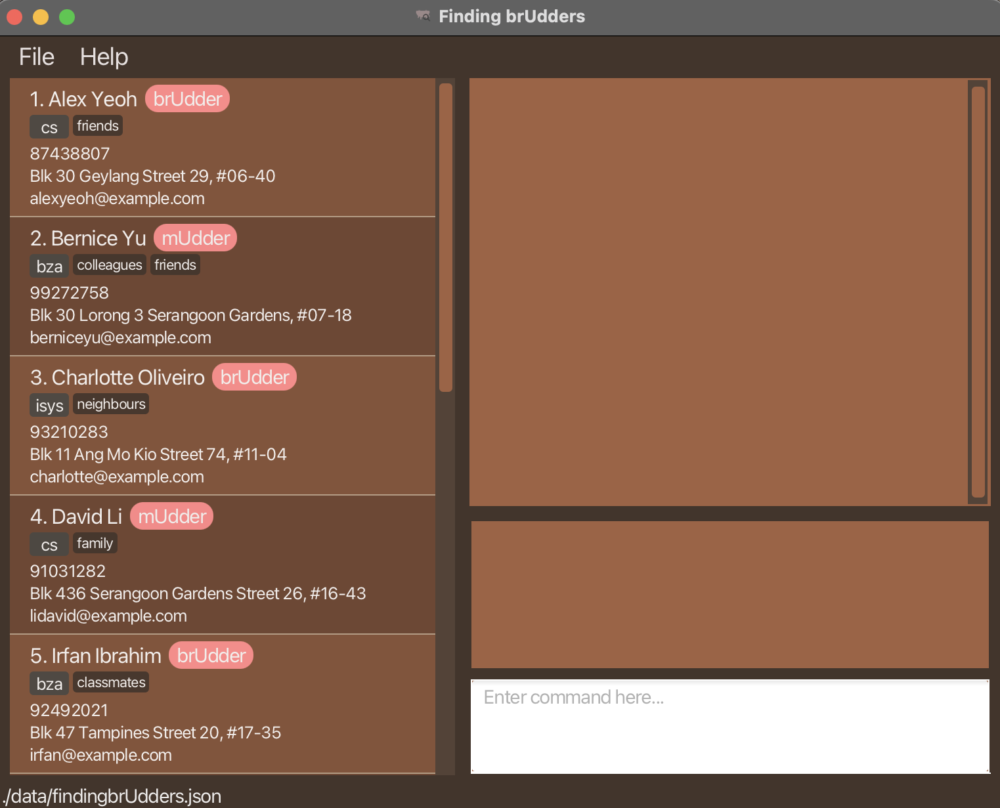

# FindingbrUdders User Guide

Has CS become too stressful? Tired of connecting through Talent Connect, LinkedIn, or even NUSConfessIT? 
Want to form a more personal relationship full of genuine human touch? Let's make finding benefactors, dependable colleagues, and insightful mentors easier for you!

FindingbrUdders is a **desktop app designed exclusively for School of Computing (SoC) students** to manage contacts and schedule meetings, keeping track of the countless friends
you can make along the way during your university journey. As an Udder (a person in the contact book or the user), you can add new people you meet (other Udders) to the app via a simple to use
Command Line Interface (CLI). Furthermore, you can edit, update and keep track of meetings with others in an organised fashion. 
You will _**never forget**_ the meaningful connections you make or the meetings you have after using FindingbrUdders!

<!-- * Table of Contents -->
<page-nav-print />

----------------------
## Quick start

1. Ensure you have Java `17` or above installed in your Computer. 

    You can check the version by running `java -version` in the command terminal.  
    **Windows**: You can access the command terminal by pressing `Win + R` and typing `cmd` in the dialog box that appears. Press `Enter` to open the command terminal.  
    **Mac**: You can access the command terminal by pressing `Cmd + Space` and typing `Terminal` in the search bar that appears. Press `Enter` to open the command terminal.  

    To run any commands, type them in the command terminal and press `Enter`.

2. If you do not have Java installed, you can download it from [here](https://www.oracle.com/java/technologies/javase-jdk17-downloads.html). 

3. Download the latest `.jar` file from [here](https://github.com/AY2425S1-CS2103T-F08-3/tp/releases/).

    The latest release can be found at the top of the page. Under the `Assets` section, download the `.jar` file by clicking on it.

4. Copy the file to the folder you want to use as the _home folder_ for your FindingbrUdders app. This can be any folder on your computer, it can also be an empty folder.

5. Right-click on the `.jar` file and select `Open with` and then `Java(TM) Platform SE binary`. 

   Alternatively, you can also run the `.jar` file by opening a command terminal, typing `cd` into the folder you put the jar file in, and using the`java -jar findingbrUdders.jar` command to run the application.

   A GUI similar to the below should appear in a few seconds. Note how the app contains some sample data to help you get started. 

1. Type the command in the command box at the bottom and press Enter to execute it. e.g. typing **`help`** and pressing Enter will open the help window. 
   Some example commands you can try:

   * `list` : Lists all contacts.

   * `add n/John Doe p/98765432 e/johnd@example.com a/John street, block 123, #01-01 r/mUdder m/cs` : Adds a contact named `John Doe` to the Address Book.

   * `delete 3` : Deletes the 3rd contact shown in the current list.

   * `clear` : Deletes all Udders and meetings.

   * `exit` : Exits the app.

2. Refer to the [Features](#features) below for details of each command.

<box type="warning">

**IMPORTANT:** Take note that you should **never** edit the _JSON file_ in your directory directly.
</box>

<box type="tip">

------------------------------------
### Glossary

* **Udder** refers to any type of user described below, which is either a mUdder or a brUdder
* **brUdder** refers to peers or connections who are experiencing similar things as you
* **mUdder** refers to mentor users or connections who are more experienced in a relevant field
</box>

--------------------------------------------------------------------------------------------------------------------

## Features

<box type="info">

**Notes about the command format:** 

* Whitespace **within** a parameter is not allowed for any command (i.e st/21-10-2024 __ 10:00) is not allowed as it will be treated as the invalid format.

* For all commands involving tags, take note that tags can only be **one word** containing alphanumeric characters (i.e **no spaces**).

* For all commands, the command word is **_case-sensitive_**.

* Words in `UPPER_CASE` are the parameters to be supplied by the user. 
  e.g. in `add n/NAME`, `NAME` is a parameter which can be used as `add n/John Doe`.

* Items in square brackets are optional. 
  e.g `n/NAME [t/TAG]` can be used as `n/John Doe t/friend` or as `n/John Doe`.

* Items with `…`​ after them can be used multiple times including zero times. 
  e.g. `[t/TAG]…​` can be used as ` ` (i.e. 0 times), `t/friend`, `t/friend t/family` etc.

* Parameters can be in any order. 
  e.g. if the command specifies `n/NAME p/PHONE_NUMBER`, `p/PHONE_NUMBER n/NAME`

* Extraneous parameters for commands that do not take in parameters (such as `help`, `list`, `exit` and `clear`) will be ignored. 
  e.g. if the command specifies `help 123`, it will be interpreted as `help`.

* If you are using a PDF version of this document, be careful when copying and pasting commands that span multiple lines as space characters surrounding line-breaks may be omitted when copied over to the application. 

* The limit of the command length is 2000 characters. Anything beyond that might cause the app to crash.
</box>

### Viewing an Udder 👀

To view an Udder's details, click on the Udder in Person List Panel on the left.

### Viewing help : `help` 💡

Shows a message via a popup window explaining how to access the help page.
Access the url shown on the popup window to be redirected to the help screen.

**Format:** `help`

### Adding an Udder: `add` 🐄

Adds an Udder to the address book.

**Format:** `add n/NAME p/PHONE_NUMBER e/EMAIL a/ADDRESS r/ROLE m/MAJOR [t/TAG]…​`

**Constraints:**

1. Names should only contain alphanumeric characters and spaces, and it should not be blank.
2. Phone numbers should only contain numbers, and it should be at least 3 digits long and should not have any whitespaces.
3. Roles should only be 'brUdder' or 'mUdder' and it can't be blank.
4. Major can only be one of the following: ‘cs’, ‘bza’, ‘ceg’, ‘isys’, ‘isec’.
5. Emails should be of the format local-part@domain and the local-part should only contain alphanumeric characters.
6. Addresses can take any values, and it should not be blank.

* When you type in an `add` command after a `find` command, the displayed list will **reset** from the filtered results.
* As it currently works, FindingbrUdders flags contacts as duplicates only if they have exactly the same name, including 
identical capitalization and spacing, while contacts with matching values in other fields are not considered duplicates.
* The name of the contact is _case-sensitive_ so `John Doe` and `JoHn DoE` are treated as 2 different contacts; Be careful in inputting names!

<box type="tip">

**Tip:** An Udder can have any number of tags (including 0) but if there are duplicate tags (i.e same tag), they will be compressed into one tag.
</box>

**Examples:**
* `add n/John Doe p/98765432 e/johnd@example.com a/John street, block 123, #01-01 r/brUdder m/bza`
* `add n/Betsy Crowe t/friend e/betsycrowe@example.com a/Newgate Prison p/1234567 r/mUdder m/ceg`
* `add n/Charlie Brown e/snoopy@gmail.com a/Yellow House p/24157842 m/cs r/brUdder t/friend`

### Listing all Udders : `list` 📜

Shows a list of all Udders in the address book. 

**Format:** `list`

### Listing meetings with all Udders : `meetings` 📅

Shows a list of all meetings with all Udders, arranged in chronological order.

**Format:** `meetings`

### Editing an Udder : `edit` ✏️

Edits an existing Udder in the address book.

**Format:** `edit INDEX [n/NAME] [p/PHONE] [e/EMAIL] [a/ADDRESS] [r/ROLE] [m/MAJOR] [t/TAG]…​`

* Although all parameters are given as optional, **_at least one must be present_** for the command to be **valid**!
* Edits the Udder at the specified `INDEX`. The index refers to the index number shown in the displayed Udder list.
* When editing tags, the existing tags of the Udder will be removed i.e adding of tags is not cumulative.
* You can remove all the Udder’s tags by typing `t/` without specifying any tags after it.
* When you type in an `edit` command after a `find` command, the displayed list will **reset** from the filtered results.

<box type="warning">

**IMPORTANT:** This command will follow the indexing shown on the Udders list.
</box>

**Examples:**
*  `edit 1 p/91234567 e/johndoe@example.com` edits the phone number and email address of the 1st Udder to be `91234567` and `johndoe@example.com` respectively.
*  `edit 2 n/Betsy Crower t/` edits the name of the 2nd Udder to be `Betsy Crower` and clears all existing tags.

### Scheduling a meeting with an Udder : `schedule` 🗓️

Schedules a meeting with an Udder from the specified start time to end time, at the location as shown in the format below

**Format:** `schedule INDEX st/DD-MM-YYYY HH:MM et/DD-MM-YYYY HH:MM l/LOCATION`

* Automatically detects any clash in meetings with other Udders.
* Please input valid meeting dates as inputting invalid ones (e.g. 30th February 2024, 29th February 2023, and 31st April 2024) may lead to unexpected behaviour!

<box type="warning">

**IMPORTANT:** This command will follow the indexing shown on the Udders list.
</box>

**Examples:**
*  `schedule 10 st/25-12-2002 00:00 et/25-12-2002 23:59 l/Gardens of Eden` schedules a meeting with the 10th Udder starting from `25th December 2002, 12:00 a.m.` and ending at `25th December 2002, 11:59 p.m.`, at `Gardens of Eden`.
*  `schedule 1 st/09-10-2024 09:00 et/09-10-2024 10:00 l/The Terrace` schedules a meeting with the 1st Udder starting from `9th October 2024, 09:00 a.m.` and ending at `9th October 2024, 10:00 a.m.`, at `The Terrace`.

### Edit meeting with an Udder: `editm` ✏️

Edits the specified meeting with an Udder from the meetings list.

**Format:** `editm INDEX [n/NAME] [st/DD-MM-YYYY] [et/DD-MM-YYYY] [l/LOCATION]`

* Use the `meetings` command before editing any meetings!
* Edits a meeting with an Udder at the specified meeting `INDEX`.
* The index refers to the index number shown in the displayed meetings list.
* At least one field of the meeting must be changed.
* Take note that the `NAME` field is case-sensitive!
* Please input valid meeting dates as inputting invalid ones (e.g. 30th February 2024, 29th February 2023, and 31st April 2024) may lead to unexpected behaviour!

**Examples:**
*  `editm 1 st/09-10-2024 10:00` edits the start time of the 1st meeting to be `09-10-2024 10:00`.
*  `editm 2 n/Betsy Crower et/10-10-2024 11:00` edits the name and end time of the 2nd meeting to be `Betsy Crower` and `10-10-2024 11:00` respectively.

### Locating Udders by keywords: `find` 🔍

Finds Udders by specified keywords for each field.

**Format:** `find [n/NAME_KEYWORD] [p/PHONE_KEYWORD] [t/TAG_KEYWORD] [a/ADDRESS_KEYWORD] [e/EMAIL_KEYWORD] [m/MAJOR_KEYWORD] [r/ROLE_KEYWORD]`

* The search is case-insensitive. e.g `hans` will match `Hans`
* Udders matching every keyword will be returned. e.g. `bob` will match `bobby`
* For finding Udders based on **EMAIL_KEYWORD**, the keyword provided has to be a valid email (i.e 123example@gmail.com) using exact string matching.

<box type="warning">

**IMPORTANT:** Any command that require indexes (such as edit or delete) executed when the list of Udders is filtered will follow the indexing shown on the Udders list.
</box>

**Examples:**
* `find n/John` returns Udders: `John Mayer` and `John Nissins`. 
* `find t/friend` returns `Alex Yeoh` and `Bernice Yu`. 

### Delete meeting with an Udder: `deletem` 🗑️

Deletes the specified meeting with an Udder from the meetings list.

**Format:** `deletem INDEX`

* Deletes a meeting with an Udder at the specified meeting `INDEX`.
* The index refers to the index number shown in the displayed meetings list.

**Examples:**
* `deletem 1` deletes the first meeting from the meetings list.

### Deleting an Udder : `delete` ❌

Deletes the specified Udder from the address book. Deleting an Udder also deletes all meetings related to that Udder.

**Format:** `delete INDEX`

* Deletes the Udder at the specified `INDEX`.
* The index refers to the index number shown in the displayed Udders list.

<box type="warning">

**IMPORTANT:** This command will follow the indexing shown on the Udders list.
</box>

**Examples:**
* `list` followed by `delete 2` deletes the 2nd Udder in the address book.
* `find n/Bernice` followed by `delete 1` deletes the 1st Udder in the results of the `find` command.

### Clearing all Udders : `clear` 🧹

Clears all Udders from the Udders List.

**Format:** `clear`

### Exiting the program : `exit` 👋

Exits the program.

**Format:** `exit`

### Saving the data

Udder data are saved in the hard disk automatically after any command that changes the data. There is no need to save manually.

### Editing the data file

<box type="warning">

Udder data are saved automatically as a JSON file `[JAR file location]/data/findingbrUdders.json`. This JSON file is to not be edited directly by you.
Changing this file directly can lead to undesirable behaviour of the app and should not be done.
</box>

### More exciting features coming in `[v2.0]`

_Details coming soon ..._

--------------------------------------------------------------------------------------------------------------------

## FAQ

**Q**: How do I transfer my Udder data to anudder (pun intended) Computer? 
**A**: Install the app in the other computer as per the Quick Start guide. Copy the `findingbrUdders.json` file from the previous computer to the new computer. Replace the empty `findingbrUdders.json` file in new computer with the `findingbrUdders.json` file from the previous computer. Your `findingbrUdders.json` file is located in the `data` folder of the directory where the `findingbrUdders.jar` file is located.

**Q**: Can I undo a command in FindingbrUdders? 
**A**: Unfortunately, there is no undo feature available at this time. Please double-check your inputs before executing any commands, especially for irreversible actions like deleting a contact.

**Q**: Can I change the location of the saved `findingbrUdders.json` file? 
**A**: The location of the `findingbrUdders.json` file is automatically set to the folder where the `.jar` file is stored. If you wish to change it, you need to move the `.jar` file to the desired folder, as the data file will follow.

--------------------------------------------------------------------------------------------------------------------

## Known issues

1. **When using multiple screens**, if you move the application to a secondary screen, and later switch to using only the primary screen, the GUI will open off-screen.  
Solution: delete the `preferences.json` file created by the application before running the application again to prevent this problem.
2. **If you minimize the Help Window** and then run the `help` command (or use the `Help` menu, or the keyboard shortcut `F1`) again, the original Help Window will remain minimized, and no new Help Window will appear.  
Solution: manually restore the minimized Help Window.

--------------------------------------------------------------------------------------------------------------------

## Command summary

| Action              | Format, Examples                                                                                                                                                                  |
|---------------------|-----------------------------------------------------------------------------------------------------------------------------------------------------------------------------------|
| **Add**             | `add n/NAME p/PHONE_NUMBER e/EMAIL a/ADDRESS r/ROLE m/MAJOR [t/TAG]…​`   e.g., `add n/James Ho p/22224444 e/jamesho@example.com a/123, Clementi Rd, 1234665 m/cs r/brUdder t/friend` |
| **Clear**           | `clear`                                                                                                                                                                           |
| **Delete**          | `delete INDEX`  e.g., `delete 3`                                                                                                                                               |
| **Edit**            | `edit INDEX [n/NAME] [p/PHONE_NUMBER] [e/EMAIL] [a/ADDRESS] [r/ROLE] [m/MAJOR] [t/TAG]…​`  e.g., `edit 2 n/James Lee e/jameslee@example.com`                                   |
| **Find**            | `find [n/KEYWORD] [p/KEYWORD] [e/KEYWORD] [a/KEYWORD] [r/KEYWORD] [m/KEYWORD] [t/KEYWORD]…​`  e.g., `find n/James Jake`                                                        |
| **Schedule**        | `schedule INDEX st/DD-MM-YYYY HH:MM et/DD-MM-YYYY HH:MM l/LOCATION`                                                                                                               |
| **List**            | `list`                                                                                                                                                                            |
| **Meetings**        | `meetings`                                                                                                                                                                        |
| **Delete Meetings** | `deletem INDEX`  e.g., `deletem 1`                                                                                                                                             |
| **Edit Meetings**   | `editm INDEX [n/NAME] [st/DD-MM-YYYY HH:MM] [et/DD-MM-YYYY HH:MM] [l/LOCATION]`  e.g., `editm 1 l/The Deck st/09-10-2024 09:30`                                                |
| **Help**            | `help`                                                                                                                                                                            |

