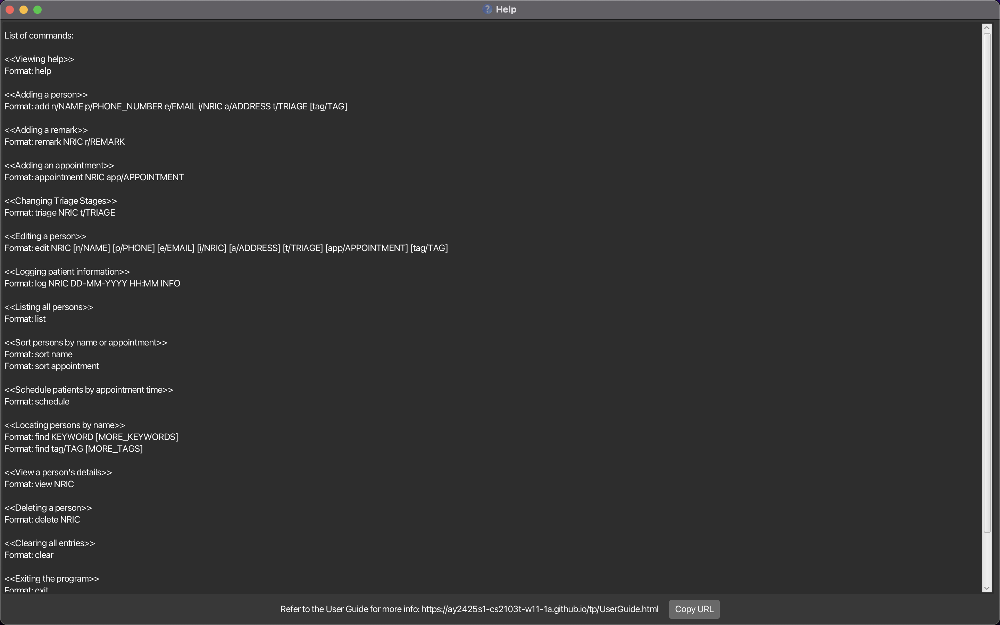
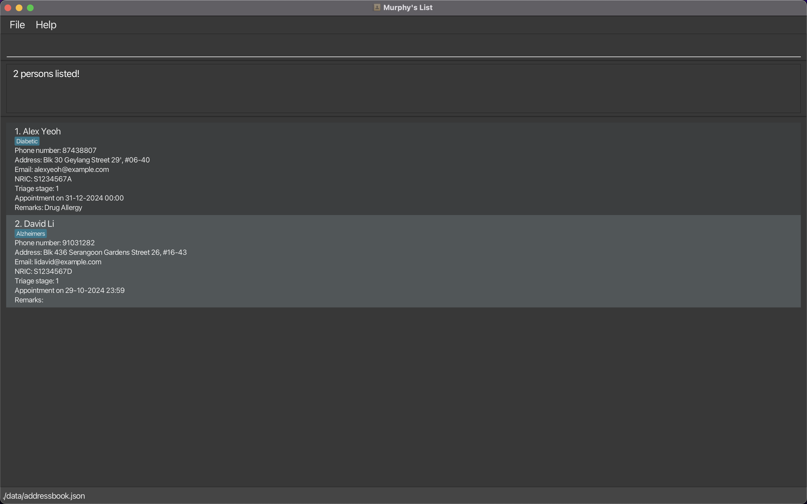

Murphy's List is a **desktop app for managing patient contact info for institutes providing palliative care, optimized for use via a Command Line Interface** (CLI) while still having the benefits of a Graphical User Interface (GUI).
If you can type fast, Murphy's List can get your healthcare administrative tasks done faster than other traditional GUI apps.

## Table of Contents
1. [Quick Start](#quick-start)
2. [Features](#features)
    1. [Viewing Help](#viewing-help--help)
    2. [Adding a Patient Profile](#adding-a-patient-profile--add)
    3. [Adding a Remark](#adding-a-remark--remark)
    4. [Adding an Appointment](#adding-an-appointment--appointment)
    5. [Listing all profiles](#listing-all-patient-profiles--list)
    6. [Editing a patient profile](#editing-a-patient-profile--edit)
    7. [Locating patients by name](#locating-patients-by-name-find)
    8. [Deleting patient profile](#deleting-a-patient-profile--delete)
    9. [Clear all entries](#clearing-all-entries--clear)
   10. [Exiting the program](#exiting-the-program--exit)
3. [Command Summary](#command-summary)
4. [FAQ](#faq)
5. [Known Issues](#known-issues)
6. [Command Summary](#command-summary)

--------------------------------------------------------------------------------------------------------------------

## Quick start

1. Ensure you have Java `17` or above installed in your Computer.

1. Download the latest `.jar` file from [here](https://github.com/se-edu/addressbook-level3/releases).

1. Copy the file to the folder you want to use as the _home folder_ for your AddressBook.

1. Open a command terminal, `cd` into the folder you put the jar file in, and use the `java -jar addressbook.jar` command to run the application. 
   A GUI similar to the below should appear in a few seconds. Note how the app contains some sample data. 
   

1. Type the command in the command box and press Enter to execute it. e.g. typing **`help`** and pressing Enter will open the help window. 
   Some example commands you can try:

   * `list` : Lists all contacts.

   * `add n/John Doe p/98765432 e/johnd@example.com i/S1234567A a/John street, block 123, #01-01` : Adds a patient profile of a patient named `John Doe` to the Address Book.

   * `delete S1231231D` : Deletes the patient profile of the patient with `NRIC S1231231D`.

   * `clear` : Deletes all patient profiles in the database.

   * `exit` : Exits the app.

1. Refer to the [Features](#features) below for details of each command.

--------------------------------------------------------------------------------------------------------------------

## Features

**Notes about the command format:** 

* Words in `UPPER_CASE` are the parameters to be supplied by the user. 
  e.g. in `add n/NAME`, `NAME` is a parameter which can be used as `add n/John Doe`.

* Items in square brackets are optional. 
  e.g `n/NAME [t/TAG]` can be used as `n/John Doe t/friend` or as `n/John Doe`.

* Items with `…`​ after them can be used multiple times including zero times. 
  e.g. `[t/TAG]…​` can be used as ` ` (i.e. 0 times), `t/friend`, `t/friend t/family` etc.

* Parameters can be in any order. 
  e.g. if the command specifies `n/NAME p/PHONE_NUMBER`, `p/PHONE_NUMBER n/NAME` is also acceptable.

* Extraneous parameters for commands that do not take in parameters (such as `help`, `list`, `exit` and `clear`) will be ignored. 
  e.g. if the command specifies `help 123`, it will be interpreted as `help`.

* If you are using a PDF version of this document, be careful when copying and pasting commands that span multiple lines as space characters surrounding line-breaks may be omitted when copied over to the application.

### Viewing help : `help`

Displays a list of accepted commands.

Format: `help`

### Adding a patient profile : `add`

Adds a patient profile to the database.

Format: `add n/NAME p/PHONE_NUMBER e/EMAIL i/NRIC a/ADDRESS [t/TAG]…​`

:bulb: **Tip:**
A patient profile can have any number of tags (including 0)

Examples:
* `add n/John Doe p/98765432 e/johnd@example.com i/S1234567A a/John street, block 123, #01-01`
* `add n/Betsy Crowe p/24681357 e/betsycrowe@example.com i/T1234567D a/Newgate Prison t/criminal t/friend`

### Adding a remark to a patient profile : `remark`

Adds a remark to a specified patient profile.

Format: `remark NRIC r/REMARK`

Examples:
* `remark S1234567A r/allergic to dogs`
* `remark T1231231D r/keep away from flashing lights`

### Adding an appointment : `appointment`

Adds the appointment date of a patient to the patient profile. Note that appointment date must be in the format DD-MM-YYYY HH:MM.

Format: `appointment NRIC app/APPOINTMENT`

### Listing all patient profiles : `list`

Shows a list of all patient profiles in the database.

Format: `list`

### Editing a patient profile : `edit`

Edits the details of the patient identified by the index number used in the displayed patient profile list. **Existing information will be overwritten by the input values**

Format: `edit NRIC [n/NAME] [p/PHONE] [e/EMAIL] [i/NRIC] [a/ADDRESS] [t/TAG]…​`

* Edits the patient profile with specified `NRIC`.
* At least one of the optional fields must be provided.
* Existing values will be updated to the input values.
* When editing tags, the existing tags of the patient will be removed i.e adding of tags is not cumulative.
* You can remove all the patient’s tags by typing `t/` without
    specifying any tags after it.

Examples:
*  `edit S1231231D p/91234567 e/johndoe@example.com` Edits the phone number and email address of the 1st patient to be `91234567` and `johndoe@example.com` respectively.
*  `edit 2 n/Betsy Crower t/` Edits the name of the 2nd patient profile displayed to be `Betsy Crower` and clears all existing tags.

### Locating patients by name: `find`

Finds patients whose names contain any of the given keywords.

Format: `find KEYWORD [MORE_KEYWORDS]`

* The search is case-insensitive. e.g `hans` will match `Hans`
* The order of the keywords does not matter. e.g. `Hans Bo` will match `Bo Hans`
* Only the name is searched.
* Only full words will be matched e.g. `Han` will not match `Hans`
* Profiles matching at least one keyword will be returned (i.e. `OR` search).
  e.g. `Hans Bo` will return `Hans Gruber`, `Bo Yang`

Examples:
* `find John` returns `john` and `John Doe`
* `find alex david` returns `Alex Yeoh`, `David Li` 
  

### Deleting a patient profile : `delete`

Deletes the specified patient profile from the database.

Format: `delete NRIC`

* Deletes the patient with the specified `NRIC`.
* The `NRIC` refers to the NRIC of the patient.

Examples:
* `delete S1234567A` deletes the patient profile of the patient with `NRIC S1234567A`.

### Clearing all entries : `clear`

Clears all entries from the database.

Format: `clear`

### Exiting the program : `exit`

Exits the program.

Format: `exit`

### Saving the data

Murphy's List data are saved in the hard disk automatically after any command that changes the data. There is no need to save manually.

### Editing the data file

Murphy's List data are saved automatically as a JSON file `[JAR file location]/data/addressbook.json`. Advanced users are welcome to update data directly by editing that data file.

:exclamation: **Caution:**
If your changes to the data file makes its format invalid, AddressBook will discard all data and start with an empty data file at the next run. Hence, it is recommended to take a backup of the file before editing it. 
Furthermore, certain edits can cause the AddressBook to behave in unexpected ways (e.g., if a value entered is outside of the acceptable range). Therefore, edit the data file only if you are confident that you can update it correctly.
It is generally recommended to use the application to edit the data file.

### Archiving data files `[coming in v2.0]`

_Details coming soon ..._

--------------------------------------------------------------------------------------------------------------------

## FAQ

**Q**: How do I transfer my data to another Computer? 
**A**: Install the app in the other computer and overwrite the empty data file it creates with the file that contains the data of your previous Murphy's List home folder.
**Q**: What should I do if the application does not start? 
**A**: Ensure you have Java `17` or above installed in your Computer. If the problem persists, contact the developers.
You can check your Java version by running `java -version` in the command terminal.
**Q**: How do I recover data if I accidentally delete a patient profile?
**A**: Unfortunately, there is no built-in undo feature for deleted data. It is recommended to back up your data by making a copy of the data file periodically.
--------------------------------------------------------------------------------------------------------------------

## Known issues

1. **When using multiple screens**, if you move the application to a secondary screen, and later switch to using only the primary screen, the GUI will open off-screen. The remedy is to delete the `preferences.json` file created by the application before running the application again.
2. **If you minimize the Help Window** and then run the `help` command (or use the `Help` menu, or the keyboard shortcut `F1`) again, the original Help Window will remain minimized, and no new Help Window will appear. The remedy is to manually restore the minimized Help Window.

--------------------------------------------------------------------------------------------------------------------

## Command summary

Action | Format, Examples
--------|------------------
**Add** | `add n/NAME p/PHONE_NUMBER e/EMAIL i/NRIC a/ADDRESS [t/TAG]…​`   e.g., `add n/Betsy Crowe p/24681357 e/betsycrowe@example.com i/T1234567D a/Newgate Prison t/criminal t/friend`
**Add Remark** | `remark NRIC r/REMARK`   e.g., `remark S1231231D r/allergic to seafood`
**Add Appointment** | `appointment NRIC app/appointment`   e.g., `appointment S1234567A app/25-12-2024 14:30`
**Clear** | `clear`
**Delete** | `delete NRIC`  e.g., `delete S1234567A`
**Edit** | `edit INDEX(must be positive integer) [n/NAME] [p/PHONE] [e/EMAIL] [i/NRIC] [a/ADDRESS] [t/TAG]…​`  e.g.,`edit 2 n/James Lee e/jameslee@example.com`
**Find** | `find KEYWORD [MORE_KEYWORDS]`  e.g., `find James Jake`
**List** | `list`
**Help** | `help`
**Exit** | `exit`
