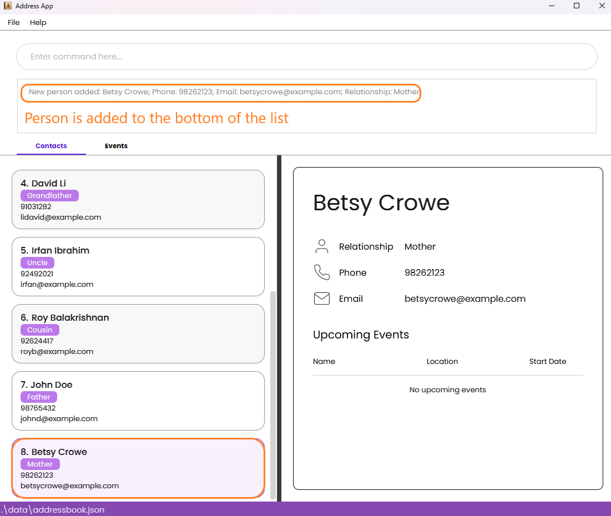
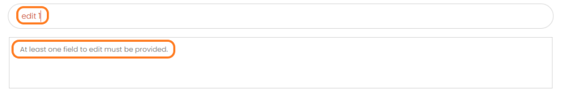
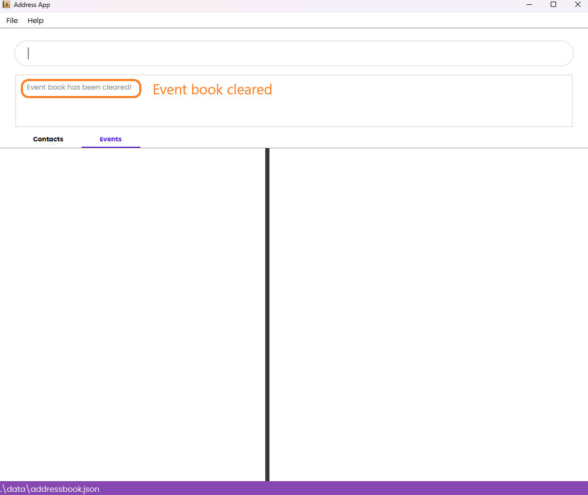

# LegacyLink User Guide

LegacyLink is a **desktop app designed to help you manage your family contacts and events effortlessly, especially optimized for use via a Command Line Interface** (CLI) while still having the benefits of a Graphical User Interface (GUI). If you can type fast, LegacyLink can get your contact and event management tasks done faster than traditional GUI apps.

Whether you have a small, close-knit family or a large extended family, LegacyLink provides the tools you need to stay organized and connected!
<!-- * Table of Contents -->
<page-nav-print />

--------------------------------------------------------------------------------------------------------------------

## Quick start

1. Ensure you have Java `17` or above installed in your Computer.

1. Download the latest `.jar` file from [here](https://github.com/AY2425S1-CS2103T-T10-4/tp/releases).

1. Copy the file to the folder you want to use as the _home folder_ for your LegacyLink.

1. Open a command terminal, `cd` into the folder you put the jar file in, and use the `java -jar legacylink.jar` command to run the application. 
   A GUI similar to the below should appear in a few seconds. Note how the app contains some sample data. 
   

1. Type the command in the command box and press Enter to execute it. e.g. typing **`help`** and pressing Enter will open the help window. 
   Some example commands (full indepth guide below) you can try:

   * `list -p` : Lists all persons.

   * `add -n John Doe -p 98765432 -e johnd@example.com -rs Father` : Adds a contact named `John Doe` with a relationship of `Father` to the Address Book.

   * `delete 3` : Deletes the 3rd contact shown in the current list.

   * `clear -e` : Deletes all events.

   * `exit` : Exits the app.

1. Refer to the [Features](#features) below for details of each command.

--------------------------------------------------------------------------------------------------------------------

## Features

Our **primary** features include:

* Adding a person to the contact list

* Creating (scheduling) events

* Adding a person to the list of attendees for an event

* Listing all contacts in the contact list

* Listing all events (past and present)

 

If you want to update information about a contact or event, you can: 

* Edit a person's contact information

* Update event details (including name, date, location, and attendees)

 

If you wish to delete a contact or cancel an event, you can:

* Delete a person from the contact list

* Cancel an upcoming event

* Clear (mass delete) all contacts

* Clear (mass delete) all events

 

Refer to the feature list below for detailed information of each command that is available in LegacyLink.

<panel header="Notes about the command format:" type="info" expanded no-close>

* Words in `UPPER_CASE` are the parameters to be supplied by the user. 
  e.g. in `add -n NAME`, `NAME` is a parameter which can be used as `add -n John Doe`.

* Parameters can be in any order. 
  e.g. if the command specifies `-n NAME -p PHONE_NUMBER`, `-p PHONE_NUMBER -n NAME` is also acceptable.

* Extraneous parameters for commands that do not take in parameters (such as `help` and `exit`) will be ignored. 
  e.g. if the command specifies `help 123`, it will be interpreted as `help`.

* If you are using a PDF version of this document, be careful when copying and pasting commands that span multiple lines as space characters surrounding line-breaks may be omitted when copied over to the application.

* All commands are **case-sensitive**.  
e.g. The command `Help` is different from `help` and therefore, results in an `Unknown command` error
</panel>

### Viewing help : `help`

Shows a message explaining how to access the help page.

Format: `help`

### Listing all persons : `list -p`

Shows a list of all persons in the address book.

Format: `list -p`

<box type="tip" seamless>

**Tip:** Preceding, trailing and intermediate whitespaces will still result in a successful command.
</box>

### Adding a person: `add`

Adds a person to the address book.

Format: `add -n NAME -p PHONE_NUMBER -e EMAIL -rs RELATIONSHIP`

<box type="tip" seamless>

**Tip:** 
* All parameters `NAME`, `PHONE_NUMBER`, `EMAIL`, `RELATIONSHIP` must be present.
* **Names** should only contain alphanumeric characters and spaces, and it should not be blank.
* **Phone numbers** should only contain numbers, and it should be at least 3 digits long.
* **Emails** should be of the format local-part@domain.
* **Relationships** should only contain alphabetic characters, and it should not be blank.
</box>

Valid Example:
* `add -n Betsy Crowe -rs Mother -e betsycrowe@example.com -p 98262123`
* This command adds a person named Betsy Crowe with the phone number 98262123, email betsycrowe@example.com, and the relationship Mother to the address book.

Invalid Example (Invalid Phone Number):
* `add -n Betsy Crowe -rs Mother -e betsycrowe@example.com -p 12`
* This command will result in the following error message since the phone number must be at least 3 digits long.

Invalid Example (Duplicate Persons):
* Assuming the contact `add -n Betsy Crowe -rs Mother -e betsycrowe@example.com -p 98262123` already exists.
* Typing the following command `add -n Betsy Crowe -rs Mother -e betsycrowe@example.com -p 98262123` will result in a duplicate entry and the person will not be added.
* The following error message will be shown:

### Editing a person : `edit`

Edits an existing person in the address book.

Format: `edit INDEX [-n NAME] [-p PHONE] [-e EMAIL] [-rs RELATIONSHIP]`

<box type="tip" seamless>

**Tip:**
* Edits the person at the specified `INDEX`. The index refers to the index number shown in the displayed person list. The index **must be a positive integer** 1, 2, 3, …​
* At least one of the optional fields must be provided.
* Each of the optional fields can only be specified at most once.  
e.g. `edit 1 -n Carmen -n Betsy` is an invalid command.
* Existing values will be updated to the input values.
</box>

Valid Example (One field edited):
* `edit 2 -n Betsy Crower` Edits the name of the 2nd person to be `Betsy Crower`.
* Note: this assumes that the address book contains at least 1 person.

Valid Example (Multiple fields edited):
*  `edit 1 -p 91234567 -e johndoe@example.com -rs Father` Edits the phone number, email and relationship of the 1st person to be `91234567`, `johndoe@example.com` and `Father` respectively.

Invalid Example:
* `edit 1` 
* This command will result in the following error message since at least one of the optional fields must be provided.

Invalid Example (Multiple parameters:
* `edit 1 -n Carmen -n Betsy -p 12345678 -p 87654321 -e example@email.com -e example@gmail.com -rs Brother -rs Mother`
* This command will result in the following error message since each value should be edited at most once.

Invalid Example (Duplicate Persons):
* Assuming the contact `add -n Betsy Crowe -rs Mother -e betsycrowe@example.com -p 98262123` exists as the first contact.
* Attempting to edit another contact:   e.g. `edit 2 -n Betsy Crowe -rs Mother -e betsycrowe@example.com -p 98262123` will result in a duplicate entry and the person will not be edited.
* The following error message will be shown:
  

### Locating persons by name: `find`

Finds persons whose names contain any of the given keywords.

Format: `find KEYWORD [MORE_KEYWORDS]`

<box type="tip" seamless>

**Tip:**
* The search is case-insensitive. e.g `hans` will match `Hans`
* The order of the keywords does not matter. e.g. `Hans Bo` will match `Bo Hans`
* Only the name is searched.
* Only full words will be matched e.g. `Han` will not match `Hans`
* Persons matching at least one keyword will be returned (i.e. `OR` search).
  e.g. `Hans Bo` will return `Hans Gruber`, `Bo Yang`
* If no person is found, none of the contacts will be displayed and `0 Persons Listed` is shown to the user.
* You are recommended to execute `list -p` after `find` command to restore the original list.
</box>

Valid Example (Found 1 person):
* `find John` returns anyone with `John` as part of their name

Valid Example (Found multiple person):
* `find Alex David` returns anyone with `Alex` OR `David` as part of their name 

Valid Example (Found no person)
* `find Magnus` 
* Note: since there are no `Magnus` in the contact, 0 person is listed.

### Deleting a person : `delete`

Deletes the specified person from the address book.

Format: `delete INDEX`

* Deletes the person at the specified `INDEX`.
* The index refers to the index number shown in the displayed person list.
* The index **must be a positive integer** 1, 2, 3, …​

<box type="warning" seamless>

**Warning:**
* No confirmation message is displayed.
* This action is irreversible, you will have to use `add` command to add the contact again. 
</box>

Valid Example:
* `list -p` followed by `delete 1` deletes the 1st person in the address book.

Valid Example:
* `find Charlotte` followed by `delete 1` deletes the 1st person in the results of the `find` command.
* Assumes that only 1 person named `Charlotte` is found by the `find` command.

### Clearing all persons : `clear -p`

Clears all persons from the address book.

<box type="warning" seamless>

**Warning:**
* No confirmation message is displayed.
* This action is irreversible, you will have to use `add` command to add all the contacts again.
</box>

Format: `clear -p`

### Listing all events : `list -e`

Shows a list of all events in the event book.

Format: `list -e`

<box type="tip" seamless>

**Tip:** Preceding, trailing and intermediate whitespaces will still result in a successful command.
</box>

### Adding an event: `event`

Adds an event to the event book.

Format: `event -n EVENT_NAME -sd EVENT_START_DATE -ed EVENT_END_DATE -l LOCATION [-a ATTENDEES]`  
**Note:** Dates are in (yyyy-mm-dd) format.

<box type="tip" seamless>

**Tip:** 
* All parameters `EVENT_NAME`, `EVENT_START_DATE`, `EVENT_END_DATE`, `LOCATION` must be present but `ATTENDEES` is optional.
* The optional field `-a` can only be specified at most once.
* Indexes supplied to the `ATTENDEES` parameter must be based on existing contacts indexing in the Address Book.
Note that the indexes are separated by **spaces**.
</box>

Valid Example:
* `event -n Get Together Party -sd 2023-10-25 -ed 2023-10-27 -l MBS`.   
Adds a "Get together party" event to the event book.

* `event -n Birthday Party -sd 2023-10-15 -ed 2023-10-15 -l Home -a 1 2 3`.   
Creates the birthday party event and adds the first 3 people in the contacts book to the event.

Invalid Example:
* `event -n Birthday Party -sd 2023-10-15 -ed 2023-10-15 -l Home -a 1, 2, 3`
* This command will result in the following error message since the list of indexes must be separated by whitespaces, not anything else like commas.

Invalid Example:
* `event -n New Year's Party -sd 2025-01-01 -ed 2025-01-02 -l Times Square -a 1 2 -a 4 5`
* This command will result in the following error message since the optional field `-a` is specified more than once.

### Updating an event: `update`

Updates the details of an existing event in the address book.

Format: `update -i INDEX [-n NEW_NAME] [-sd NEW_START_DATE] [-ed NEW_END_DATE] [-l NEW_LOCATION] [-a NEW_ATTENDEES_INDICES] [-r REMOVED_ATTENDEES_INDICES]`

**Note:** Dates are in (yyyy-mm-dd) format.

<box type="tip" seamless>

**Tip:** 
* The initial `INDEX` parameter is required, while the rest of the parameters are optional. The `-r` flag allows you to
remove attendees from an event, and can be used together with the `-a` flag. If you add and remove the same index, the result
will be adding the person first, then removing them, i.e. they will not be present in the attendee list after the command executes.
* Indexes supplied to the `NEW_ATTENDEES_INDICIES`  and `REMOVED_ATTENDEES INDICES` parameters must be based on existing contacts indexing in the Address Book.
* Note that the indexes are separated by **spaces**.
* Each of the optional fields can only be specified at most once.  
e.g. `update -i 1 -n Birthday Party -n Dinner Party -a 1 -a 2` is an invalid command.
</box>

Valid Example (One field updated):
* `update -i 1 -l NUS UTown` only updates the location of the first event to `NUS UTown`.

Valid Example (Multiple field updated):
* `update -i 3 -n New Year's Party -sd 2025-01-01 -ed 2025-01-02 -l Marine Parade Road #12-34 -r 3 6` updates the 3rd event, reflecting all the provided details.

Invalid Example:
* `update -i 3 -n New Year's Party -n Christmas Celebration -a 1 2 -a 4 5`
* This command will result in the following error message since the optional fields `-n` and `-a` are specified more than once.

### Clearing all events : `clear -e`

Clears all events from the event book.

<box type="warning" seamless>

**Warning:**
* No confirmation message is displayed.
* This action is irreversible, you will have to use `event` command to add all the events again.
</box>

Format: `clear -e`

### Exiting the program : `exit`

Exits the program.

<box type="warning" seamless>

**Warning:**
* No confirmation message is displayed.
</box>

Format: `exit`

### Saving the data

LegacyLink data are saved in the hard disk automatically after any command that changes the data. There is no need to save manually.

### Editing the data file

LegacyLink data are saved automatically as a JSON file `[JAR file location]/data/addressbook.json and [JAR file location]/data/eventbook.json`. Advanced users are welcome to update data directly by editing that data file.

<box type="warning" seamless>

**Caution:**
If your changes to the data file makes its format invalid, LegacyLink will discard all data and start with an empty data file at the next run.  Hence, it is recommended to take a backup of the file before editing it. 
Furthermore, certain edits can cause the LegacyLink to behave in unexpected ways (e.g., if a value entered is outside the acceptable range). Therefore, edit the data file only if you are confident that you can update it correctly.

</box>

--------------------------------------------------------------------------------------------------------------------

## FAQ

**Q**: How do I transfer my data to another Computer? 
**A**: Install the app in the other computer and overwrite the empty data file it creates with the file that contains the data of your previous LegacyLink home folder.

--------------------------------------------------------------------------------------------------------------------

## Known issues

1. **When using multiple screens**, if you move the application to a secondary screen, and later switch to using only the primary screen, the GUI will open off-screen. The remedy is to delete the `preferences.json` file created by the application before running the application again.
2. **If you minimize the Help Window** and then run the `help` command (or use the `Help` menu, or the keyboard shortcut `F1`) again, the original Help Window will remain minimized, and no new Help Window will appear. The remedy is to manually restore the minimized Help Window.
3. **When creating 2 or more events that have the same name, start date, end date, and location**, it is possible for these events to have attendees which are subsets for each other, but not equal to each other. The remedy is to implement a more sophisticated duplicate event detection system to enhance user experience in the future.

--------------------------------------------------------------------------------------------------------------------

## Command summary

Action     | Format, Examples
-----------|----------------------------------------------------------------------------------------------------------------------------------------------------------------------
**List Persons**   | `list -p`
**Add Person**    | `add -n NAME -p PHONE_NUMBER -e EMAIL -rs RELATIONSHIP`   e.g., `add -n James Ho -p 22224444 -e jamesho@example.com -rs Brother`
**Delete Person** | `delete INDEX`  e.g., `delete 3`
**Edit Person**   | `edit INDEX [-n NAME] [-p PHONE_NUMBER] [-e EMAIL] [-rs RELATIONSHIP]`  e.g.,`edit 2 -n James Lee -e jameslee@example.com`
**Find Person**   | `find KEYWORD [MORE_KEYWORDS]`  e.g., `find James Jake`
**Clear Person Book**  | `clear -p`
**Add Event**     | `event -n EVENT_NAME -sd EVENT_START_DATE -ed EVENT_END_DATE -l LOCATION -a ATTENDEES`   e.g., `event -n Birthday Party -sd 2023-10-15 -ed 2023-10-15 -l Home -a 1 2 3`
**Cancel Event**  | `cancel INDEX`   e.g., `cancel 1`
**Edit Event**     | `update -i INDEX [-n NEW_NAME] [-sd NEW_START_DATE] [-ed NEW_END_DATE] [-l NEW_LOCATION] [-a NEW_ATTENDEES_INDICES] [-r REMOVED_ATTENDEES_INDICES`]   e.g., `update -i 3 -n New Year's Party -sd 2025-01-01 -ed 2025-01-02 -a 1 2 4 5 -r 3 6`
**List Events**   | `list -e`
**Clear Events**  | `clear -e`
**Help**   | `help`
**Exit**   | `exit`
