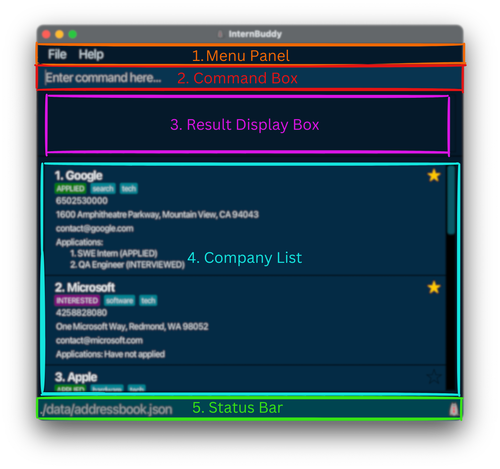
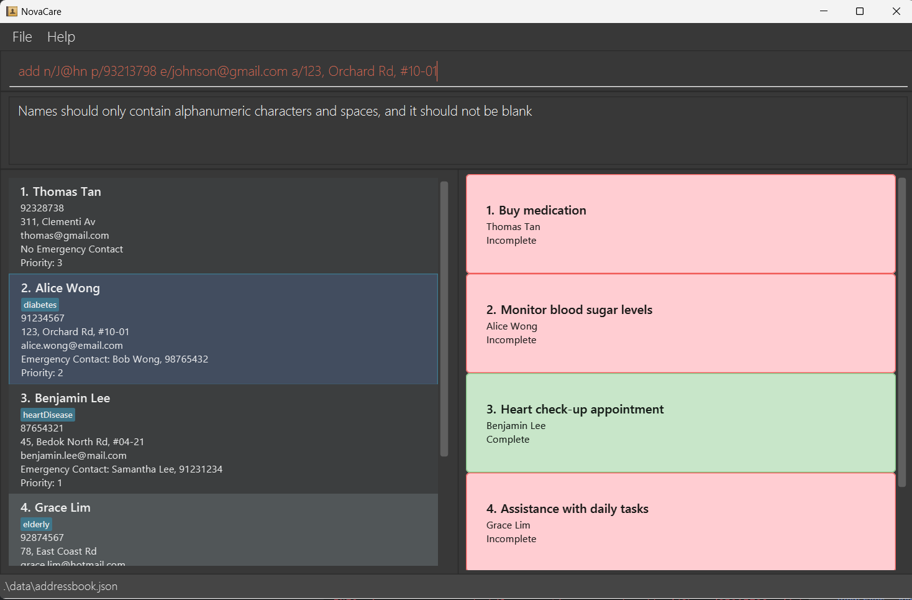

<h2 style="color: #FF6347;">NovaCare</h2>

A **desktop app for private nurses to manage patients, optimized for use via a Command Line Interface** [(CLI)](#10-glossary) while still having the benefits of a Graphical User Interface [(GUI)](#10-glossary).
Tailored to handle the demanding workload of private nurses managing numerous patients, NovaCare is built for speed—ideal for users who type quickly, enabling faster patient management than traditional GUI-based applications.

In this guide, users will be able to learn the following details:

1) **Set up NovaCare** using **Mac/Linux** or **Windows**.
2) **Explore and use features** that are available in NovaCare to add and delete your first private patient details and task details.
3) Quickly learn and master various [commands](#9-command-summary) and actions available in NovaCare.
4) General [FAQs](#7-faq) (Frequently asked questions) of NovaCare.

--------------------------------------------------------------------------------------------------------------------
## Table of Contents
<!-- * Table of Contents -->
1. [How to use NovaCare](#1-how-to-use-novacare)
2. [Annotation Box](#2-annotations-box)
3. [Quick start](#3-quick-start)
4. [Overview of GUI](#4-overview-of-gui)
5. [Get started with NovaCare](#5-get-started-with-novacare)
6. [Features](#6-features)
    - 6.1 [Parameter information](#6-1-parameter-information)
    - 6.2 [Patient commands](#6-2-patient-commands)
      - 6.2.1 [Adding a patient](#6-2-1-adding-a-patient-add)
      - 6.2.2 [Listing all patients](#6-2-2-listing-all-patients-list)
      - 6.2.3 [Editing a patient](#6-2-3-editing-a-patient-edit)
      - 6.2.4 [Locating patients by name](#6-2-4-locating-patients-by-name-find)
      - 6.2.5 [Deleting a patient](#6-2-5-deleting-a-patient-delete)
      - 6.2.6 [Adding emergency contact](#6-2-6-adding-emergency-contact-emergency)
      - 6.2.7 [Deleting emergency contact](#6-2-7-deleting-emergency-contact-deleteemergency)
      - 6.2.8 [Adding priority level](#6-2-8-adding-priority-level-priority)
      - 6.2.9 [Deleting priority level](#6-2-9-deleting-priority-level-deletelevel) 
    - 6.3 [Task commands](#6-3-task-commands)
      - 6.3.1 [Adding a task](#6-3-1-adding-a-task-addtask)
      - 6.3.2 [Deleting a task](#6-3-2-deleting-a-task-deletetask)
      - 6.3.3 [Marking a task](#6-3-3-marking-a-task-marktask)
      - 6.3.4 [Unmarking a task](#6-3-4-unmarking-a-task-unmarktask)
      - 6.3.5 [Finding a task](#6-3-5-finding-a-task-findtask)
      - 6.3.6 [Listing tasks](#6-3-6-listing-tasks-listtask)
      - 6.3.7 [Listing incomplete tasks](#6-3-7-listing-incomplete-tasks-listincomplete)
    - 6.4 [General commands](#6-4-general-commands)
      - 6.4.1 [Viewing help](#6-4-1-viewing-help-help)
      - 6.4.2 [Clearing all entries](#6-4-2-clearing-all-entries-clear)
      - 6.4.3 [Exiting the program](#6-4-3-exiting-the-program-exit)
    - 6.5 [Data Management](#6-5-data-management)
      - 6.5.1 [Saving the data](#6-5-1-saving-the-data)
      - 6.5.2 [Editing the data file](#6-5-2-editing-the-data-file)
      - 6.5.3 [Archiving data files](#6-5-3-archiving-data-files-coming-in-v20)
7. [FAQ](#7-faq)
8. [Known Issues](#8-known-issues)
9. [Command Summary](#9-command-summary)
   - 9.1 [Patient-Related Commands](#9-1-patient-related-commands)
   - 9.2 [Task-Related Commands](#9-2-task-related-commands)
   - 9.3 [Other Commands](#9-3-other-commands)
10. [Glossary](#10-glossary)
      

--------------------------------------------------------------------------------------------------------------------

## 1. How to use NovaCare

This user guide is tailored for new and existing users of NovaCare.


If you are new to NovaCare, we recommend you to start with the [Quick Start](#3-quick-start) section.

If you are an existing user looking for a specific feature, you can jump to the [Features](#6-features) section or [Command Summary](#9-command-summary) section.

[⬆️ Back to Table of Contents](#table-of-contents)

## 2. Annotations box
The following are annotations throughout this user guide that provide additional information to help you understand the NovaCare features better.

<box type="info" seamless>

**Note:** Additional information about the Commands.
</box>

<box type="tip" seamless>

**Tip:** Provide tips to help users understand the command usage better.
</box>

<box type="warning" seamless>

**Warning:** Warns you about potential errors that you may face when using the NovaCare.
</box>

[⬆️ Back to Table of Contents](#table-of-contents)

--------------------------------------------------------------------------------------------------------------------

## 3. Quick start

This section provides a quick overview of how to set up and run NovaCare on your computer.

### Step 1. Ensure you have Java `17` or above installed in your Computer. You can download Java [here](https://www.oracle.com/java/technologies/downloads/#java17).

For **Windows** users, you can type **Command Prompt** in the search bar.
Type `java -version` to check if you have Java installed.
Upon successful installation, you should see something like this:


For **Mac/Linux** users, you can type **Terminal** in the search bar.
Type `java -version` to check if you have Java installed.
Upon successful installation, you should see something like this:


### Step 2. Download NovaCare [here](https://github.com/AY2425S1-CS2103T-F15-1/tp/releases).
1. Download the `NovaCareApp.jar` file from the link provided by scrolling down to Assets as shown below.
   
2. Click on the `NovaCareApp.jar` file to download it.
3. Upon downloading save the app to your preferred location. (e.g. `Desktop`)

### Step 3. Run the application
1. Open `Command Prompt` for Windows users or `Terminal` for Mac/Linux users.
2. Navigate to the preferred location where you saved the `NovaCareApp.jar` file. <br>
> e.g. `cd Desktop`
3. Run the application by typing <br>
> `java -jar NovaCareApp.jar`.

Upon successful execution, you should see the GUI of NovaCare covered in the next section.

[⬆️ Back to Table of Contents](#table-of-contents)

## 4. Overview of GUI

The GUI is broken down into different **sections** as shown in the image below:


1. **Command Box:** This is where you can type your commands to interact with the application.
2. **Result Display Box:** Displays the result of commands.
3. **Patient List:** Displays all the patients in the application.
4. **Task List:** Displays all the task for all patients.
5. **Menu Bar:** Contains the `File` and `Help` menu. (to exit or view the help menu)

[⬆️ Back to Table of Contents](#table-of-contents)

## 5. Get started with NovaCare
Here will be a basic guide on how to use the application.
1. **Launch help guide**:
   * Type the following command in the command box and press Enter to **view help window**:
      > `help`

2. **Clear all entries**:
   * Type the following command in the command box and press Enter to **clear all entries**:
      > `clear`

3. **Add a patient**:
   * Type the following command in the command box and press Enter to **add a patient**:
      > `add n/Johnson p/11111111 e/johnson123@gmail.com a/123 Clementi Rd, 1234665 t/Diabetic`
   * This example command adds a new patient named `Johnson` with phone number `11111111`, email `johnson123@gmail.com`, address `123 Clementi Rd, 1234665` and tagged as `Diabetic` to the system!
<br></br>  

4. **Edit patient information**:
   * Type the following command in the command box and press Enter to **edit a patient's information**:
      > `edit 1 p/91234567`
   * This example command edits the phone number of patient at index 1 of the addressbook, in this case being the patient `Johnson` who was just added!
<br></br>

5. **Delete a patient**:
   * Type the following command in the command box and press Enter to **delete a patient**:
      > `delete 1
   * This example command deletes the patient at index 1 of the addressbook!
<br></br>

6. **Add another patient**:
    * Type the following command in the command box and press Enter to **add a patient**:
      > `add n/Lily p/22222222 e/lily@gmail.com a/456 Bishan St, 222222 t/Asthmatic`
    * This example command adds a new patient named `Lily` with phone number `22222222`, email `lily@gmail.com@gmail.com a/123`, address `456 Bishan St, 222222` and tagged as `Asthmatic` to the system!
<br></br>

7. **Add a task**:
    * Type the following command in the command box and press Enter to **add a task to the patient**:
       > `addtask 1 d/Eat paracetamol 1000mg`
    * This example command adds a new task `Eat paracetamol 1000mg` for the patient at index 1 of the addressbook, in this case being the patient `Lily` who was just added! 
<br></br>
   
8. **Exit**:
    * Type the following command in the command box and press Enter to **exit the program**:
       > `exit`

Refer to the [Features](#6-features) below for details of each command.

[⬆️ Back to Table of Contents](#table-of-contents)

--------------------------------------------------------------------------------------------------------------------

## 6. Features

This section provides a detailed explanation of the features available in NovaCare.

<box type="info" seamless>

**Notes about the command format:**<br>

* All command in NovaCare follows a specific structure. The command structure is as follows:
  `COMMAND prefix/PARAMETERS…​`
  e.g. `add n/NAME p/PHONE_NUMBER e/EMAIL a/ADDRESS`, `add` is the `COMMAND`, `n/`, `p/` and `e/` are `prefixes` and `NAME`, `PHONE_NUMBER`, `EMAIL` and `ADDRESS` are `PARAMETERS`.

* Words in `UPPER_CASE` are the parameters to be supplied by the user.<br>
  e.g. in `add n/NAME`, `NAME` is a parameter which can be used as `add n/John Doe`.

* Items in square brackets `[]` are optional.<br>
  e.g. `n/NAME [t/TAG]` can be used as `n/John Doe t/Diabetic` or as `n/John Doe`.

* Items with `…`​ after them can be used multiple times including zero times.<br>
  e.g. `[t/TAG]…​` can be used as ` ` (i.e. 0 times), `t/Diabetic`, `t/Diabetic t/Allergic to shellfish` etc.

* Parameters can be in any order.<br>
  e.g. if the command specifies `n/NAME p/PHONE_NUMBER`, `p/PHONE_NUMBER n/NAME` is also acceptable.

* Extraneous parameters for commands that do not take in parameters (such as `help`, `list`, `exit`, `clear`, `listincomplete` and `listtask`) will be ignored.<br>
  e.g. if the command specifies `help 123`, it will be interpreted as `help`.

* If you are using a PDF version of this document, be careful when copying and pasting commands that span multiple lines as space characters surrounding line-breaks may be omitted when copied over to the application.
</box>

[⬆️ Back to Table of Contents](#table-of-contents)

### 6.1 Parameter Information
The table below explains each of the parameter available in NovaCare.
It will provide the limitations and examples of the parameter.
<box type = "warning" seamless>

**Warning:**<br>

The parameters must follow the limitations as shown below.
Otherwise, the command will not be executed and display an error message in Result Display Box providing hints as shown below:<br>

</box>

| Parameter                    | Description                       | Limitations                                                                                                                                                                                                                                                                                                                                                                                                                                                                                                                                       | Example                                                                                      |
|------------------------------|-----------------------------------|---------------------------------------------------------------------------------------------------------------------------------------------------------------------------------------------------------------------------------------------------------------------------------------------------------------------------------------------------------------------------------------------------------------------------------------------------------------------------------------------------------------------------------------------------|----------------------------------------------------------------------------------------------|
| **NAME**                     | Name of patient                   | * Names should only contain alphanumeric characters and spaces.<br/>* It should not be blank.                                                                                                                                                                                                                                                                                                                                                                                                                                                     | :white_check_mark: `Thomas Ho`<br/>:x: `Th@mas`                                              |
| **EMERGENCY_CONTACT_NAME**   | Name of emergency contact         | * Names should only contain alphanumeric characters and spaces.                                                                                                                                                                                                                                                                                                                                                                                                                                                                                   | :white_check_mark: `Thomas Ho`<br/>:x: `Th@mas`                                              |
| **PHONE_NUMBER**             | Phone number of patient           | * Phone numbers should only contain numbers no spaces allowed.<br/>* At least 3 digits long.<br/>* Should not be blank.<br/>* Allow international numbers.<br/>* In the event where phone number is unknown, please key in `000` as phone number, you can edit this later. This serves as a temporary field, and does not mean anything.                                                                                                                                                                                                          | :white_check_mark: `91234567`<br/>:white_check_mark: `60194723537`<br/>:x: `9123 4567`       |
| **EMERGENCY_CONTACT_NUMBER** | Phone number of emergency contact | * Phone numbers should only contain numbers no spaces allowed.<br/>* At least 3 digits long.<br/>* Allow international numbers.                                                                                                                                                                                                                                                                                                                                                                                                                   | :white_check_mark: `91234567`<br/>:white_check_mark: `60194723537`<br/>:x: `9123 4567`       |
| **EMAIL**                    | Email of patient                  | * Format must be in `LOCAL-PART@DOMAIN`.<br/> * No space allowed.<br/> * `LOCAL-PART` contains alphanumeric characters and these special characters, excluding the parentheses, (+_.-).<br/> * `LOCAL-PART` local-part may not start or end with any special character.<br/> * `DOMAIN` must be at least 2 characters long, start and end with alphanumeric characters.<br/>* In the event where email is unknown, please key in `unknown@x.com` as email, you can edit this later. This serves as a temporary field, and does not mean anything. | :white_check_mark: `thomasho@gmail.com`<br/>:x: `$thomas@gmail.com`<br/>(`LOCAL-PART` error) |
| **ADDRESS**                  | Address of patient                | * Address should not be blank.<br/> * Address can take any values.<br/>* In the event where address is unknown, please key in `unknown address` as address, you can edit this later. This serves as a temporary field, and does not mean anything.                                                                                                                                                                                                                                                                                                | :white_check_mark: `123, Clementi Rd, 1234665`<br/>                                          |
| **TAG**                      | Tag of patient                    | * Tags take alphanumeric and spaces.                                                                                                                                                                                                                                                                                                                                                                                                                                                                                                              | :white_check_mark: `high blood pressure`<br/>:x:`low income $`                               |
| **INDEX**                    | Index of patient on GUI           | * Index should be a positive integer.<br/> * Index should not be blank, and will be auto incremented by the system.                                                                                                                                                                                                                                                                                                                                                                                                                               | :white_check_mark: `1`<br/>:x: `0`                                                           |
| **DESCRIPTION**              | Description of task               | * Description should not be blank.<br/> * Description can take any values.                                                                                                                                                                                                                                                                                                                                                                                                                                                                        | :white_check_mark: `Eat paracetamol 1000mg`<br/>                                             |
| **PRIORITY_LEVEL**           | Priority level of patient         | * Priority level should be either 1, 2, 3 or reset.                                                                                                                                                                                                                                                                                                                                                                                                                                                                                               | :white_check_mark: `1`<br/>:x: `4`                                                           |

[⬆️ Back to Table of Contents](#table-of-contents)

### 6.2 Patient Commands
In NovaCare, these commands will allow you to modify your list of patients to suit your needs.

<box type="info" seamless>

**Note:**
* For all commands, parts of the command in square brackets are optional parameters that can be included in or omitted from the command. 
  * For example: `[t/TAG]`
</box>

#### 6.2.1 Adding a patient: `add`

Adds a patient's details to the system.

:pencil: Format: `add n/NAME p/PHONE_NUMBER e/EMAIL a/ADDRESS [t/TAG]…​`

<box type="info" seamless>

**Note:**
* Upon adding a patient the default priority is set to *3*. 
  * Users can change the priority level using the [`priority` command](#6-2-8-adding-priority-level-priority).
* To update emergency contact details, use the [`emergency` command](#6-2-6-adding-emergency-contact-emergency).
* A patient will not be added if the name and phone number is already in the system.
* Refer to [Parameter information](#6-1-parameter-information) for the limitations of each parameter.
* As mentioned in [Parameter information](#6-1-parameter-information), our team recommends users to use the specific filler fields for unknown phone/email/address fields. Using your own fields in place is allowed in this version, but will be subjected to your **own risk** of **data loss** or **inaccuracy**. **Please proceed with caution**.
</box>

<box type="tip" seamless>

**Tip:**
* A patient can have any number of tags (including 0).
* A patient can have multiple tags.
* Use `edit` command if you made a mistake in adding a patient.
* Input parameters can be written in any order.
</box>

Examples:
* `add n/John Doe p/98765432 e/johnd@example.com a/John street, block 123, #01-01` adds a patient named `John Doe`, with phone number `98765432`, email `johnd@example.com` and address `John street, block 123, #01-01` into the system.
* `add n/Betsy Crowe e/betsycrowe@example.com a/Blk 50 Tampines Street 21, #08-281 p/1234567 t/Diabetic` adds a patient named `Betsy Crowe` with email `betsycrowe@example.com`, address `Blk 50 Tampines Street 21, #08-281`, phone number `1234567` and tags as `Diabetic` to the system.
* `add n/Jarell p/000 e/unknown@x.com a/unknown address` adds a patient named `Jarell` with phone number `000`, email `unknown@x.com`, address `unknown address` and no tags. As mentioned in [Parameter information](#6-1-parameter-information), phone/email/address fields are unknown, hence they are filled with the recommended filler fields.

Expected output:
```
New person added: John Doe; Phone: 98765432; Email: johnd@example.com; Address: 311, Clementi Ave 2, #02-25; Tags: [Diabetic]
New person added: Betsy Crowe; Phone: 1234567; Email: betsycrowe@example.com; Address: Blk 50 Tampines Street 21, #08-281; Tags: [Diabetic]
New person added: Jarell; Phone: 000; Email: unknown@x.com; Address: unknown address; Tags: 
```
<br>

#### 6.2.2 Listing all patients: `list`

Shows a list of all patients in the system.

:pencil: Format: `list`

Example:
* `list` lists and displays all the patients in the system.

Expected output:
```
Listed all persons
```
<br>

#### 6.2.3 Editing a patient: `edit`

Edits an existing patient's details in the system.

:pencil: Format: `edit INDEX [n/NAME] [p/PHONE] [e/EMAIL] [a/ADDRESS] [t/TAG]…​`

<box type="info" seamless>

**Note:**
* Edits the patient at the specified `INDEX`. The index refers to the index number shown in the displayed patient list. The index **must be a positive integer** 1, 2, 3, …​
* At least one of the optional fields must be provided.
* Existing values will be updated to the input values.
* When editing tags, the existing tags of the patient will be removed i.e. adding of tags is not cumulative.
* You can remove all the patient’s tags by typing `t/` without
  specifying any tags after it.
</box>

Examples:
*  `edit 1 p/91234567 e/johndoe@example.com` edits the phone number and email address of the 1st patient to be `91234567` and `johndoe@example.com` respectively.
*  `edit 2 n/Betsy Crower t/` edits the name of the 2nd patient to be `Betsy Crower` and clears all existing tags.

Expected output:
```
Edited Person: John Doe; Phone: 91234567; Email: johndoe@example.com; Address: 311, Clementi Ave 2, #02-25; Tags: [Diabetic]
Edited Person: Betsy Crower; Phone: 98765432; Email: johnd@example.com; Address: 311, Clementi Ave 2, #02-25; Tags: 
```
<br>

#### 6.2.4 Locating patients by name: `find`

Finds patients whose name contains any of the given keywords.

:pencil: Format: `find KEYWORD [MORE_KEYWORDS]`

<box type="info" seamless>

**Note:**
* The search is case-insensitive. e.g. `hans` will match `Hans`
* The order of the keywords does not matter. e.g. `Hans Bo` will match `Bo Hans`
* Only the name is searched.
* Only full words will be matched e.g. `Han` will not match `Hans`
* Patients matching at least one keyword will be returned (i.e. `OR` search).
  e.g. `Hans Bo` will return `Hans Gruber`, `Bo Yang`
</box>

Examples:
* `find John` returns any patient that has the name John inside, for instance `john` and `John Doe`
* `find alex david` returns any patient with names containing either "Alex" or "David". This means it will return any patient whose name includes either "Alex" or "David" as part of their name, for instance, `Alex Yeoh` or `David Li`<br>

Expected output:
```
2 persons listed!
```
You should see something like this:<br></br>

<br></br>

#### 6.2.5 Deleting a patient: `delete`

Deletes the specified patient and tasks associated to that patient from the system.

:pencil: Format: `delete INDEX`

<box type="info" seamless>

**Note:**
* Deletes the patient and task associated to that patient at the specified `INDEX`.
* The index refers to the index number shown in the displayed patient list.
* The index **must be a positive integer** 1, 2, 3, …​
</box>

Examples:
* `list` followed by `delete 2` deletes the 2nd patient in the system.
* `find john doe` followed by `delete 1` deletes the 1st-indexed patient in the resultant list produced from the `find` command.

Expected output:
```
Deleted Person: John Doe; Phone: 91245555; Email: johnd@example.com; Address: 311, Clementi Ave 2, #02-25; Tags: [Diabetic]
```
<br>

#### 6.2.6 Adding emergency contact: `emergency`

Adds an emergency contact and details to a patient in the system.

:pencil: Format: `emergency INDEX n/EMERGENCY_CONTACT_NAME p/EMERGENCY_CONTACT_NUMBER`

<box type="info" seamless>

**Note:**
* Adds an emergency contact and details at the specified `INDEX`.
* The index refers to the index number shown in the displayed patient list.
* The index **must be a positive integer** 1, 2, 3, …​
</box>

Example:
* `emergency 1 n/Tom Tan p/91237171` adds an emergency contact `Tom Tan` with contact number `91237171` to the 1st-indexed patient in the patient list.

Expected output:
```
Added emergency contact to John Doe: Tom Tan, 91237171
```
<br>

#### 6.2.7 Deleting emergency contact: `deleteemergency`

Deletes an emergency contact and its details from a patient in the system.

:pencil: Format: `deleteemergency INDEX`

<box type="info" seamless>

**Note:**
* Deletes an emergency contact and its details at the specified `INDEX`.
* The index refers to the index number shown in the displayed patient list.
* The index **must be a positive integer** 1, 2, 3, …​
</box>

Example:
* `deleteemergency 1` deletes the emergency contact of the 1st-indexed patient in the patient list.

Expected output:
```
Removed emergency contact (Tom Tan, 91237171) from John Doe
```
<br>

#### 6.2.8 Adding priority level: `priority`

Adds a priority level to a patient in the system.

:pencil: Format: `priority INDEX l/PRIORITY_LEVEL`

<box type="info" seamless>

**Note:**
* Adds a priority level at the specified `INDEX`.
* The `l/` prefix refers to the lowercase letter `l`, not the uppercase letter `I`. 
* The index refers to the index number shown in the displayed patient list.
* The index **must be a positive integer** 1, 2, 3, …​
* The priority level **must be a positive integer** and only from **1, 2, 3**
</box>

Example:
* `priority 1 l/2` adds priority level `2` to 1st-indexed patient in the patient list.

Expected output:
```
Priority level 2 successfully set for John Doe
```
<br>

#### 6.2.9 Deleting priority level: `deletelevel`

Delete a priority level to a patient in the system, resetting it to the default value **3**.

:pencil: Format: `deletelevel INDEX` or `priority INDEX l/reset`

<box type="info" seamless>

**Note:**
* Delete the current priority level at the specified `INDEX`.
* The `l/` prefix refers to the lowercase letter `l`, not the uppercase letter `I`.
* The index refers to the index number shown in the displayed patient list.
* The index **must be a positive integer** 1, 2, 3, …​.
</box>

Examples:
* `deletelevel 1` deletes priority level of the 1st-indexed patient in the patient list.
* `priority 1 l/reset` resets the priority level of the 1st-indexed patient in the patient list to level 3.

Expected output:
```
Priority level reset to default for John Doe
```

[⬆️ Back to Table of Contents](#table-of-contents)

### 6.3 Task commands
In NovaCare, these commands will allow you to modify your list of tasks, with each task being specific to each patient to suit your needs.
<br>

#### 6.3.1 Adding a task: `addtask`

Adds a task to a patient in the system.

:pencil: Format: `addtask INDEX d/DESCRIPTION`

<box type="info" seamless>

**Note:**
* Adds a task at the specified `INDEX`.
* The index refers to the index number shown in the displayed patient list.
* The index **must be a positive integer** 1, 2, 3, …​
* Task description is case-insensitive, e.g. `addtask 1 d/Clear diapers` and `addtask 1 d/clEar Diapers` are considered the same task for the same patient.
</box>

**Warning:**
* As mentioned in the note above, task description is case-insensitive. However, NovaCare does not check for the logic of the task. 2 task of same behaviour will be treated as different if they have different formats apart from casing.<br/> E.g. `addtask 1 d/Clear diapers` and `addtask 1 d/Clear the diapers` could be viewed as the same task, but will be classified as different and hence able to be added to NovaCare task list.
* **Please proceed with caution when describing tasks to be added to avoid conflict.**

Examples:
* `list` followed by `addtask 2 d/Eat paracetamol 1000mg` adds a task to the 2nd-indexed patient in the system.
* `find John doe` followed by `addtask 1 d/Clear Diapers` adds a task `Clear Diapers` to the 1st-indexed patient in the resultant list produced from the `find` command.

Expected output (First example):
```
Listed all persons
New task added: Eat paracetamol 1000mg
```
You should see something like this:<br></br>


Expected output (Second example):
```
1 persons listed!
New task added: Clear Diapers
```
You should see something like this:<br></br>

<br></br>

#### 6.3.2 Deleting a task: `deletetask`

Deletes a task for a patient in the system.

:pencil: Format: `deletetask INDEX`

<box type="info" seamless>

**Note:**
* Deletes a task at the specified `INDEX`.
* The index refers to the index number shown in the displayed patient list.
* The index **must be a positive integer** 1, 2, 3, …​
</box>

Example:
* `deletetask 1` deletes the 1st-indexed task in the task list.

Expected output:
```
Deleted Task: Eat paracetamol 1000mg for Betsy Crower
```
<br>

#### 6.3.3 Marking a Task: `marktask`

Marks a task at a specific index.

:pencil: Format: `marktask INDEX`

<box type="info" seamless>

**Note:**
* Marks a task at the specified `INDEX`.
* The index refers to the index number shown in the displayed Task list.
* The index **must be a positive integer** 1, 2, 3, …​
</box>

Example:
* `marktask 1` marks the 1st-indexed task in the task list as `Complete`.

Expected output:
```
Marked task as complete: Clear diapers for John Doe
```
<br>

#### 6.3.4 Unmarking a Task: `unmarktask`

Unmarks a task at a specific index.

:pencil: Format: `unmarktask INDEX`

<box type="info" seamless>

**Note:**
* Unmarks a task at the specified `INDEX`.
* The index refers to the index number shown in the displayed Task list.
* The index **must be a positive integer** 1, 2, 3, …​
  </box>

Example:
* `unmarktask 1` marks the 1st-indexed task in the task list as `Incomplete`.

Expected output:
```
Marked task as incomplete: Clear diapers for John Doe
```
<br>

#### 6.3.5 Finding a Task: `findtask`

Finds all task for a particular patient specific index.

:pencil: Format: `findtask INDEX`

Example:
* `findtask 1` finds and displays all tasks for the 1st-indexed patient in the patient list.

Expected output:
```
1 tasks listed!
```
<br>

#### 6.3.6 Listing Tasks: `listtask`

List all tasks for all patients in the system.

:pencil: Format: `listtask`

Example:
* `listtask` lists and displays all tasks in the system.

Expected output:
```
Listed all tasks
```
<br>

#### 6.3.7 Listing Incomplete Tasks: `listincomplete`

List all incomplete tasks for all patients in the system.

:pencil: Format: `listincomplete`

Example:
* `listincomplete` lists and displays all incomplete tasks in the system.

Expected output:
```
Listed all incomplete tasks
```

[⬆️ Back to Table of Contents](#table-of-contents)
<br></br>

### 6.4 General commands
In NovaCare, these are the default commands for getting help, clearing and saving your patient and task data.
<br></br>

#### 6.4.1 Viewing help: `help`

Shows a message explaining how to access the help page.

Format: `help`
<box type="info" seamless>

**Note:**
* Due to the amount of commands, the Help Window is made such that it will still be displayed at foreground despite clicking back to NovaCare.
* To hide it, click the `minimize button` on the top right hand corner of the Help Window as shown below.
* To close it, click the `close button` on the top right hand corner of the Help Window as shown below.
</box>


Example:
* `help` shows the help window which displays all commands available in NovaCare.
<br></br>

#### 6.4.2 Clearing all entries: `clear`

Clears all patient and tasks entry from NovaCare.

:pencil: Format: `clear`

<box type="warning" seamless>

**Warning:**
Using this command will **CLEAR ALL PATIENT AND TASK RECORDS** in the NovaCare. 
**This action is irreversible!**
</box>

Example:
* `clear` clears all available data in NovaCare, both patients and tasks.

Expected output:
```
Address book has been cleared!
```
<br>

#### 6.4.3 Exiting the program: `exit`

Exits the program.

:pencil: Format: `exit`

Example:
* `exit` automatically saves and exit NovaCare.

Expected output: NovaCare will automatically close the window.

[⬆️ Back to Table of Contents](#table-of-contents)
<br></br>

### 6.5 Data Management

#### 6.5.1 Saving the data

NovaCare data are saved in the hard disk automatically after any command that changes the data. There is no need to save manually.
<br></br>

#### 6.5.2 Editing the data file

NovaCare data are saved automatically as a JSON file `[JAR file location]/data/addressbook.json`. Advanced users are welcome to update data directly by editing that data file.

<box type="warning" seamless>

**Caution:**
If your changes to the data file makes its format invalid, NovaCare will discard all data and start with an empty data file at the next run.  Hence, it is recommended to take a backup of the file before editing it.<br>
Furthermore, certain edits can cause the NovaCare to behave in unexpected ways (e.g., if a value entered is outside the acceptable range). Therefore, edit the data file only if you are confident that you can update it correctly.
</box>

<br></br>

#### 6.5.3 Archiving data files `[coming in v2.0]`

_Details coming soon ..._

[⬆️ Back to Table of Contents](#table-of-contents)

--------------------------------------------------------------------------------------------------------------------

## 7. FAQ

**Q**: How do I **transfer my data** to another Computer?<br>
**A**: Install the app in the other computer and overwrite the empty data file it creates with the file that contains the data of your previous NovaCare home folder.

**Q**: What should I do if NovaCare **doesn't start** after double-clicking the JAR file? <br>
**A**: Ensure Java is correctly installed by typing `[java -version]` in your command prompt or terminal. If Java is not recognized, install it from Oracle's official site.

[⬆️ Back to Table of Contents](#table-of-contents)

--------------------------------------------------------------------------------------------------------------------

## 8. Known Issues

1. **When using multiple screens**, if you move the application to a secondary screen, and later switch to using only the primary screen, the GUI will open off-screen. The remedy is to delete the `preferences.json` file created by the application before running the application again.
2. **If you minimize the Help Window** and then run the `help` command (or use the `Help` menu, or the keyboard shortcut `F1`) again, the original Help Window will remain minimized, and no new Help Window will appear. The remedy is to manually restore the minimized Help Window.

[⬆️ Back to Table of Contents](#table-of-contents)

--------------------------------------------------------------------------------------------------------------------

## 9. Command Summary

### 9.1 Patient-Related Commands:
| Action                       | Format Examples                                                                                                                                          |
|------------------------------|----------------------------------------------------------------------------------------------------------------------------------------------------------|
| **Add**                      | `add n/NAME p/PHONE_NUMBER e/EMAIL a/ADDRESS [t/TAG] ` <br> e.g., `add n/James Ho p/94391857 e/jamesho@gmail.com a/123, Clementi Rd, 1234665 t/Diabetic` |
| **Edit**                     | `edit INDEX [n/NAME] [p/PHONE] [e/EMAIL] [a/ADDRESS] [t/TAG]` <br> e.g., `edit 1 p/91234567 e/john13432@gmail.com`                                       |
| **Change Priority**          | `priority INDEX l/PRIORITY_LEVEL` <br> e.g., `priority 1 l/2`                                                                                            |
| **Delete Priority**          | `priority INDEX l/reset` or `deletelevel INDEX` <br> e.g., `priority 2 l/reset` or `deletelevel 2`                                                       |
| **Add Emergency Contact**    | `emergency INDEX n/EMERGENCY CONTACT NAME p/EMERGENCY CONTACT NUMBER` <br> e.g., `emergency 1 n/tom tan p/91237171`                                      |
| **Delete Emergency Contact** | `deleteemergency INDEX` <br> e.g., `deleteemergency 1`                                                                                                   |
| **List**                     | `list`                                                                                                                                                   |
| **Delete**                   | `delete INDEX`<br> e.g., `delete 3`                                                                                                                      |
| **Find**                     | `find KEYWORD [MORE_KEYWORDS]`<br> e.g., `find John`                                                                                                     |

### 9.2 Task-Related Commands:
| Action              | Format, Examples                                                                   |
|---------------------|------------------------------------------------------------------------------------|
| **Add Task**        | `addtask INDEX d/TASK_DESCRIPTION` <br> e.g., `addtask 1 d/Eat paracetamol 1000mg` |
| **Delete Task**     | `deletetask INDEX`<br> e.g., `deletetask 1`                                        |
| **Find Task**       | `findtask INDEX`<br> e.g., `findtask 1`                                            |
| **List Task**       | `listtask`                                                                         |
| **Mark Task**       | `marktask INDEX`<br> e.g., `marktask 1`                                            |
| **Unmark Task**     | `unmarktask INDEX`<br> e.g., `unmarktask 1`                                        |
| **List Incomplete** | `listincomplete`                                                                   |


### 9.3 Other Commands:
| Action    | Format, Examples |
|-----------|------------------|
| **Help**  | `help`           |
| **Clear** | `clear`          |
| **Exit**  | `exit`           |

[⬆️ Back to Table of Contents](#table-of-contents)

### 10. Glossary
As you read through the user guide, you may come across some terms that are unfamiliar to you. Here is a glossary of terms that you may encounter:

| Term               | Definition                                                                                                                                                                                                                                                                                                                                                                                                                                               |
|--------------------|----------------------------------------------------------------------------------------------------------------------------------------------------------------------------------------------------------------------------------------------------------------------------------------------------------------------------------------------------------------------------------------------------------------------------------------------------------|
| **JAR**            | A Java Archive (JAR) is a package file that compresses many Java files into a single executable file used for Java applications.                                                                                                                                                                                                                                                                                                                         |
| **CLI**            | A Command Line Interface (CLI) is a text-based interface used to interact with software using text commands.                                                                                                                                                                                                                                                                                                                                             |
| **PARAMETER**      | A parameter is the text that is passed to a software to perform a specific action.                                                                                                                                                                                                                                                                                                                                                                       |
| **Prefix**         | A prefix is a keyword that is used to identify the type of parameter that is being passed to the software.                                                                                                                                                                                                                                                                                                                                               |
| **GUI**            | A Graphical User Interface (GUI) is a visual interface that allows users to interact with software using graphical icons and indicators.                                                                                                                                                                                                                                                                                                                 |
| **Command**        | A command is an input action given to the software to perform a specific action.                                                                                                                                                                                                                                                                                                                                                                         |
| **Index**          | An index is a unique number assigned to each item in a GUI list to identify and reference the item.                                                                                                                                                                                                                                                                                                                                                      |
| **Tag**            | A tag is a label that is assigned to a patient to take note of their medical conditions.                                                                                                                                                                                                                                                                                                                                                                 |
| **Priority Level** | A priority level is a value assigned to a patient to indicate the urgency of their medical condition. A priority level of 1 indicates a critical condition, 2 indicates a serious but non-critical condition, while 3 indicates a non-critical condition. **Caution: Priority level is a relative level, and may vary between nurses. This is intended as a gauge for the condition of a patient and it is not meant to diagnose or treat any illness.** |
| **[Word]**         | Words in square brackets are optional parameters that can be included in the command.                                                                                                                                                                                                                                                                                                                                                                    |

[⬆️ Back to Table of Contents](#table-of-contents)
