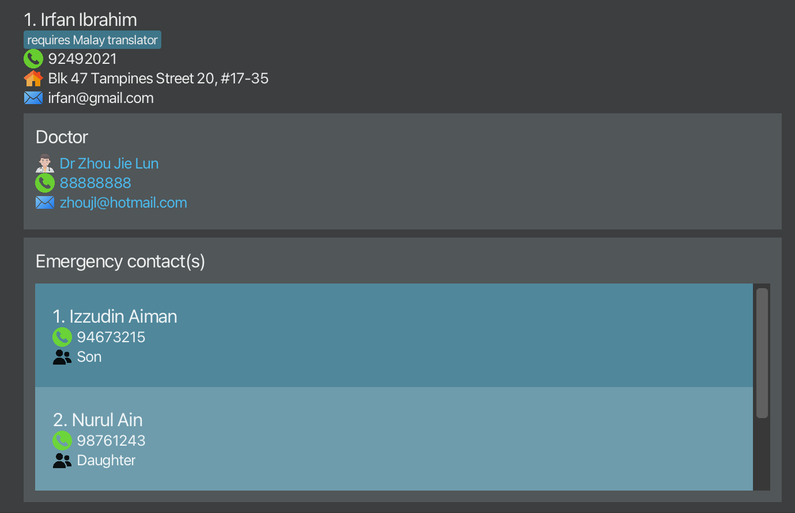

**:warning: Disclaimer**

The current version of MedConnect is only designed to support the **English language** and for use in a **single country and timezone**.

Using MedConnect with other languages or across multiple countries and timezones may lead to unexpected behaviour.

 
MedConnect is a **desktop app designed for healthcare administrators in elderly care homes for dementia patients**. It consolidates crucial contact information into a single, accessible database, allowing administrative staff to manage patient and doctor contacts efficiently under high-pressure conditions.

MedConnect combines the speed of a Command Line Interface ([CLI](#cli)) with the visual clarity of a Graphical User Interface ([GUI](#gui)), making it ideal for administrators who can type fast and need rapid access to information. MedConnect can get your contact management tasks done faster than traditional [GUI](#gui) apps.

With MedConnect, connecting with on-call doctors, family members, or other essential contacts becomes seamless, helping you respond quickly when every second counts.

## Table of Contents
{:.no_toc}

* Table of Contents
{:toc}

## How to use this User Guide
This User Guide is designed to help you understand and use MedConnect effectively. Here are some tips on how to navigate and use this guide:
1. **[Table of Contents](#table-of-contents)**: At the beginning of the guide, you will find a Table of Contents. Use this to quickly jump to the section you are interested in.
1. **[Quick Start](#quick-start)**: If you are new to MedConnect, start with the Quick Start section. It provides step-by-step instructions on how to set up and start using the application.
1. **[Overview of GUI](#overview-of-gui)**: This section provides an overview of the graphical user interface (GUI) of MedConnect. Use this section to familiarize yourself with the different components of the application.
1. **[Features](#features)**: This section details all the commands available in MedConnect. Each command is explained with its format, parameters, and examples. Use this section to learn how to perform specific tasks.
1. **[Command Summary](#command-summary)**: At the end of the guide, there is a Command Summary table that provides a quick reference for all commands. Use this table to quickly look up the format of a command.
1. **[FAQ](#faq)**: The FAQ section addresses common questions and issues. Check this section if you encounter any problems or have questions about using MedConnect.
1. **[Known Issues](#known-issues)**: This section lists any known issues with the application and their workarounds. Refer to this section if you experience any unexpected behavior.
1. **[Glossary](#glossary)**: This section explains unfamiliar terms that we use in this User Guide. Check out the glossary if you're unsure what a certain word means.
1. **Notes and Tips**: Throughout the guide, you will find notes and tips highlighted in different styles. These provide additional information and helpful hints for using MedConnect effectively.

By following these sections, you can quickly find the information you need and make the most out of MedConnect.

[↑ Back to top](#table-of-contents)

## Quick Start

1. Ensure you have Java `17` or above installed on your computer.
   * You can check your Java version by following the instructions [here](https://www.wikihow.com/Check-Your-Java-Version-in-the-Windows-Command-Line).
   * If you do not have Java `17` or above installed in your computer, you can download Java from [here](https://www.oracle.com/java/technologies/downloads/#java17).

2. Download the latest release of the `medconnect.jar` file from [here](https://github.com/AY2425S1-CS2103T-T13-1/tp/releases).

3. Copy the file to the folder you want to use as the _home folder_. The _home folder_ will be where all the data files will be saved.

4. For *Windows:* Open the home folder and right-click anywhere in the red box, as shown in the image below. Click "Open in Terminal". A terminal window will pop up, then type in the command `java -jar medconnect.jar` to run the application.

    
   
    

   
    For *MacOS:* Right-click home folder. Hover over "Services". Select "New Terminal at folder". A terminal window will pop up, then type in the command `java -jar medconnect.jar` to run the application.

       

5. Type the command in the [command box](#command-box) and press `Enter` to execute it. Here are some example commands you can try:

   * `list` : [List](#listing-all-patients--list) all contacts.

   * `add n/John Doe p/98765432 e/johnd@example.com a/John street, block 123, #01-01 ecname/Charlotte Lim ecphone/81243564 ecrs/Sibling dname/Ronald Lee dphone/99441234 demail/ronaldlee@gmail.com` 
   [Add](#adding-a-patient-add) a contact named `John Doe` to the Address Book with emergency contact `Charlotte Lim` and doctor `Ronald Lee`.

   * `delete 3` : [Delete](#deleting-a-patient--delete) the 3rd contact shown in the current list.

   * `clear` : [Clear](#clearing-all-entries--clear) the contacts list of all contacts.

   * `undo` : [Undo](#undoing-previous-command--undo) previous command.

   * `exit` : [Exit](#exiting-the-program--exit) the app.

1. Refer to the [Features](#features) below for details of each command.

[↑ Back to top](#table-of-contents)

## Overview of [GUI](#gui)

* The headers are colour-coded to match the GUI screenshot's boxes above.

Menu Bar
* Clicking `File` will show the option to exit the application.
* Clicking `Help` will show `Help F1` which when clicked will link you to this User Guide.

Command Box
* This is where you will be typing the commands for MedConnect. The full list of commands can be found under [Features](#features).

Result Box
* This is where MedConnect will give you feedback after you type in a command. It will provide information on whether a command was successful or an invalid input was provided. For more information on the valid command inputs, head to [Features](#features).

Patients List
* The list of patients will be shown here.
* You can scroll down the list to see more patients.

Doctor Details
* Each patient has a doctor assigned to them.
* The name, phone number and email of the assigned doctor can be easily identified by the blue text colour.

Emergency Contact Details
* Each patient will have at least one emergency contact listed.
* The name, phone number and relationship to the patient of each emergency contact is listed here.
* If a patient has multiple emergency contacts, this box will become scrollable to be able to view more contacts.

[↑ Back to top](#table-of-contents)

## Features

**:information_source: Notes about the command format:** 

* Words in `UPPER_CASE` are the parameters to be supplied by the user. 
  e.g. in `add n/NAME`, `NAME` is a parameter which can be used as `add n/John Doe`.

* Items in square brackets `[ ]` are optional. 
  e.g `n/NAME [t/TAG]` can be used as `n/John Doe t/friend` or as `n/John Doe`.

* Items with `…` after them can be used multiple times. 
  e.g. `[t/TAG]…` can be used as ` ` (i.e. not included), `t/friend`, `t/friend t/family` etc.

* Items without `…`​ after them should not be inputted multiple times in the command.

* Parameters can be in any order unless otherwise stated. 
  e.g. if the command specifies `n/NAME p/PHONE_NUMBER`, `p/PHONE_NUMBER n/NAME` is also acceptable.

* To avoid being too verbose, some error messages may be simplified for brevity. For a list of valid inputs for each parameter, please refer to the [Glossary](#glossary).

* Extraneous parameters for commands that do not take in parameters (such as `help`, `exit` and `clear`) will be ignored. 
  e.g. if the command specifies `help 123`, it will be interpreted as `help`.

* If you are using a PDF version of this document, be careful when copying and pasting commands that span multiple lines as space characters surrounding line-breaks may be omitted when copied over to the application.

[↑ Back to top](#table-of-contents)

### Suggestions and Autocompletion

The Command Box in MedConnect offers **suggestions** and **autocompletion** to assist users while typing commands. These features aim to enhance the command entry experience through reducing the need for memorising command formats and reducing the chance of errors.

### Suggestions

Suggestions provide visible hints about the expected command format as the command is entered.

* If an incorrect entry is detected (e.g., type `adding` instead of `add`), the suggestion will be hidden to indicate a problem with the format.

**Examples** (words in brackets "()", are suggested by the system.)
* Typing `add` will show the expected format for adding a patient: `add (n/NAME p/PHONE e/EMAIL a/ADDRESS ecname/EMERGENCY_CONTACT_NAME ...)` 
* Upon typing the slash commands (e.g. `n/` or `p/`), the suggestion only shows the parameter that needs to be filled or the next command once done. e.g `add n/(NAME)`, `add n/Saajid Shaik (p/PHONE)`
* Inputs that are prefixes to more than 1 command, will result in full syntax suggestions for those commands to be displayed and separated with a `|`. e.g. `fi(nd KEYWORD MORE_KEYWORDS | finddoc KEYWORD MORE_KEYWORDS)`

**:information_source: Note**

While commands can be written in any order, the suggestion feature only follows the default order which puts related parameters together, analogous to how the contact details are displayed in the app.

You may notice that suggestion and autocomplete features almost always work, even without default ordering, but this is currently a feature-in-progress for future enhancement.

Additionally, suggestions for parameters will never be duplicated unless users manually deviates from autocomplete or suggestion by the system.

[↑ Back to top](#table-of-contents)

### Autocompletion

Autocompletion helps to complete partially typed commands by pressing the `Control` key.

* If an incorrect entry is detected (e.g., type `adding` or `ade` instead of `add`), autocompletion will be disabled to indicate a problem with the format.

**Examples**:
* Typing `ad` followed by pressing `Control` autocompletes the input to `add`.
* Typing `add` followed by pressing `Control` autocompletes the input to `add n/`.
* Typing `add n/Saajid Shaik` followed by pressing `Control` autocompletes the input to `add n/Saajid Shaik p/`.

Since autocomplete can only work on fixed syntaxes, `INDEX`,`KEYWORD` and variable attribute (e.g. `NAME` in commands `n/NAME`) cannot be autocomplete. Should users try to autocomplete, the input text turns red, indicating users to fill in their information as needed.

[↑ Back to top](#table-of-contents)

### Viewing help : `help`

Shows a message explaining how to access the help page.

Format: `help`

[↑ Back to top](#table-of-contents)

### Adding a patient: `add`

Adds a patient to the address book.

Format: `add n/NAME p/PHONE_NUMBER e/EMAIL a/ADDRESS ecname/EMERGENCY_CONTACT_NAME ecphone/EMERGENCY_CONTACT_PHONE
ecrs/EMERGENCY_CONTACT_RELATIONSHIP dname/DOCTOR_NAME dphone/DOCTOR_PHONE demail/DOCTOR_EMAIL [t/TAG]…​`

:bulb: **Tip:**
A patient can have any number of tags (including 0). Tags can be used to add short descriptions or categories to patients.

* You need not enter the prefix 'Dr' when typing `DOCTOR_NAME`. The app automatically adds the prefix `Dr` in front of the `DOCTOR_NAME` entered.
* Patients with the same `PHONE_NUMBER` will be flagged as duplicates and cannot be added to the address book.

**Examples**
* `add n/John Doe p/98765432 e/johnd@example.com a/John street, block 123, #01-01 ecname/Charlotte Lim ecphone/94681352 ecrs/daughter dname/Ronald Lee dphone/99441234 demail/ronaldlee@gmail.com` 
  Adds John Doe as a patient with his daughter Charlotte Lim as his emergency contact and Dr Ronald Lee as his assigned doctor.

* `add n/Betsy Crowe t/friend e/betsycrowe@example.com a/Newgate Prison p/1234567 ecrs/son ecphone/94873631 ecname/Bob Builder demail/liampayne@gmail.com dphone/91231231 dname/Liam Payne t/criminal`  
  Adds Betsy Crowe as a patient with her son Bob Builder as her emergency contact and Dr Liam Payne as her assigned doctor.

[↑ Back to top](#table-of-contents)

### Listing all patients : `list`

Shows a list of every patient in the address book and sets the sort order of the list.

Format: `list [SORT_ORDER]`

Valid inputs for sort order parameter: `timeadded`, `timeadded asc`, `timeadded desc`, `name`, `name asc`, `name desc`

* If `SORT_ORDER` is not provided, the patients listed will be sorted in the order they were added. The patient who was added the most recently will be at the bottom of the list.
* `timeadded`, `timeadded asc` and `timeadded desc` sets the patient list to be sorted according to the time they were added to Medconnect. 
  * `timeadded` and `timeadded asc` sorts the patient list from least to most recently added. 
  * `timeadded desc` sorts the patient list from most to least recently added.
* `name`, `name asc` and `name desc` sets the patient list to be sorted according to their name in alphabetical order. 
  * `name` and `name asc` sorts by the patients' names from uppercase A to Z, followed by lowercase a to z. 
  * `name desc` sorts by the patients' names from lowercase z to a, followed by uppercase Z to A.

**Examples**
* `list name asc` 
  Sorts the patient list in ascending alphabetical order of their names.

* `list timeadded desc` 
  Sorts the patient list in descending order of time added to MedConnect.

[↑ Back to top](#table-of-contents)

### Editing a patient : `edit`

Edits an existing patient in the address book.

Format: `edit INDEX [n/NAME] [p/PHONE] [e/EMAIL] [a/ADDRESS] [ec/EMERGENCY_CONTACT_INDEX] [ecname/EMERGENCY_CONTACT_NAME] [ecphone/EMERGENCY_CONTACT_PHONE] [ecrs/EMERGENCY_CONTACT_RELATIONSHIP] [dname/DOCTOR_NAME] [dphone/DOCTOR_PHONE] [demail/DOCTOR_EMAIL] [t/TAG]…`

* Edits the patient at the specified `INDEX`. Existing values will be updated to the input values.
* `INDEX` should come before any of the optional fields.
* At least one of the optional fields must be provided.
* To edit the patient's emergency contact, provide the index of the emergency contact to edit under `ec/EMERGENCY_CONTACT_INDEX` and at least one of the emergency contact fields.
* When editing tags, all the existing tags of the person will be removed. You will have to re-enter pre-existing tags if you wish to preserve them.

:bulb: **Tip:**
You can remove all of a person’s existing tags by typing `t/` without specifying any tags after it.

**Examples:**
*  `edit 1 p/91234567 e/johndoe@example.com` 
Edits the phone number and email address of the 1st patient to be `91234567` and `johndoe@example.com` respectively.

*  `edit 2 n/Betsy Crower t/` 
Edits the name of the 2nd patient to be `Betsy Crower` and clears all existing tags.

*  `edit 2 n/Betsy Crower ec/1 ecname/Peter Tan` 
   Edits the name of the 2nd patient to be `Betsy Crower`. Edits the name of the first emergency contact of the 2nd patient to be `Peter Tan`.

[↑ Back to top](#table-of-contents)

### Locating patients by patient's name: `find`

Finds patients whose names contain any of the given keywords.

Format: `find KEYWORD [MORE_KEYWORDS]`

* **Only the patient's name is searched.**
* The search is case-insensitive. (e.g `hans` will match `Hans`)
* The order of the keywords does not matter. (e.g. `Hans Bo` will match `Bo Hans`)
* Names will match if the keyword is found in any part of the name. (e.g. `Ha` will match `Hans`)
* All patients matching at least one keyword will be shown in the patient list.
  (e.g. `Hans Bo` will return `Hans Gruber`, `Bo Yang`)
* The `find` command filters the list, which gets reset after entering an `add`, `addec`, `edit`, `list`, `undo` or `redo` command.

Examples:
* `find Alex` displays`Alex Yeoh` and `Alexis Tan`
* `find dav Roy` displays `David Li` and `Roy Balakrishnan`

  {: width="400"}

[↑ Back to top](#table-of-contents)

### Locating patients by doctor's name: `finddoc`

Finds patients by checking if their doctor's names contain any of the provided keywords.

Format: `finddoc KEYWORD [MORE_KEYWORDS]`

* **Only the doctor's name is searched.**
* The search is case-insensitive. (e.g `hans` will match `Hans`)
* The order of the keywords does not matter. (e.g. `Hans Bo` will match `Bo Hans`)
* Names will match if the keyword is found in any part of the doctor's name. (e.g. `Ha` will match `Hans`)
* Persons matching at least one keyword in their doctor's name will be returned. (e.g. `Hans Bo` will return persons whose doctors are `Hans Gruber`, `Bo Yang`)
* * The `finddoc` command filters the list, which gets reset after entering an `add`, `addec`, `edit`, `list`, `undo` or `redo` command.

**Examples:**
* `finddoc John` returns persons with doctors `john` and `John Doe`
* `finddoc tan ed` returns persons with doctors `Tan Wei Ming`, `Ed Sheeran`
* `findoc zhou` returns `Irfan Ibrahim` since `Dr Zhou Jie Lun` is his assigned doctor.

  

[↑ Back to top](#table-of-contents)

### Deleting a patient : `delete`

Deletes the specified patient or emergency contact from the address book.

Format: `delete INDEX [ec/EMERGENCY_CONTACT_INDEX]`

* Deletes the patient at the specified `INDEX` **OR** deletes the emergency contact at the specified `EMERGENCY_CONTACT_INDEX` of the patient at the specified `INDEX`.
* `INDEX` refers to the index number shown in the displayed person list.
* The parameters **must** follow the order given above.
* Each patient must have at least one emergency contact. You cannot delete the final emergency contact in the list.

**Examples:**
* `delete 2 ec/2` deletes the 2nd emergency contact of the 2nd patient in the address book.
* `list` followed by `delete 2` deletes the 2nd patient in the address book.
* `find Betsy` followed by `delete 1` deletes the 1st patient in the results of the `find` command.

[↑ Back to top](#table-of-contents)

### Adding an emergency contact : `addec`

Adds an emergency contact to a specified patient in the address book.

Format: `addec INDEX ecname/EMERGENCY_CONTACT_NAME ecphone/EMERGENCY_CONTACT_PHONE ecrs/EMERGENCY_CONTACT_RELATIONSHIP`

* `INDEX` should come before any of the optional fields.
* A patient cannot have more than one emergency contact with the same phone number.

**Examples**
* `addec 1 ecname/Shannon Wong ecphone/84651325 ecrs/Daughter` 
Adds a new emergency contact Shannon Wong to the 1st patient in the address book.

[↑ Back to top](#table-of-contents)

### Archiving data files: `archive`

Archives the current address book data to a timestamped data file with an optional description.

Format: `archive [DESCRIPTION]`

**Valid inputs**
* `DESCRIPTION` must be a valid file name (i.e., it cannot contain any of the following special characters: `\/:*?"<>|`).
* The archive data file will be saved as a [JSON file](#glossary) in the `[home folder]/data/archive/` folder.

**Examples**
* `archive` Archives the current address book data to a timestamped data file.
* `archive before major update`   Archives the current address book data to a timestamped data file with the description "before major update".

[↑ Back to top](#table-of-contents)

### Listing all archived data files: `listarchives`

Lists the names of all the archived data files in the archive folder.

Format: `listarchives`

[↑ Back to top](#table-of-contents)

### Loading data from an archived data file: `loadarchive`

Loads the data from an archived data file into the address book.

Format: `loadarchive FILE_NAME`

* `FILE_NAME` should be the name of an archived data file in the archive folder. You can view a list of archived data files using the [`listarchives`](#listing-all-archived-data-files-listarchives) command.
* The data from the archived file will replace the current data in the address book.
* The data in the archived file will not be deleted.

:bulb: **Tip:**
Did you accidentally load an archive and want your old data back? Enter the 'undo' command!

**Examples**
* `loadarchive addressbook-2024-11-06T20-29-05.7609475-example.json`   Loads the data from the archived file named `addressbook-2024-11-06T20-29-05.7609475-example.json` into the address book.

[↑ Back to top](#table-of-contents)

### Deleting an archived data file: `deletearchive`

:exclamation: **Caution:**
Deleting an archive file is **permanent**. The `undo` command cannot restore a deleted archive file.

Deletes the data of an existing archived data file in the archive folder.

Format: `deletearchive FILE_NAME`

* `FILE_NAME` should be the name of an archived data file in the archive folder. You can view a list of archived data files using the [`listarchives`](#listing-all-archived-data-files-listarchives) command.

**Examples**
* `deletearchive addressbook-2024-11-06T20-29-05.7609475-example.json` Deletes the archived file with the file name `addressbook-2024-11-06T20-29-05.7609475-example.json`.

[↑ Back to top](#table-of-contents)

### Clearing all entries : `clear`

Clears all entries from the address book.

Format: `clear`

[↑ Back to top](#table-of-contents)

### Undoing previous command : `undo`
Restores the previous state of the address book after any change, such as an addition, edit, or deletion of a patient.

Format: `undo`

:exclamation: **Warning:**
An action cannot be undone once you close the MedConnect application.

[↑ Back to top](#table-of-contents)

### Redoing previous command : `redo`

Restores the state of the address book **after an undo operation has been executed**, effectively "redoing" the undone changes, such as an addition, edit, or deletion of a patient.

Format: `redo`

:exclamation: **Warning:**
An action cannot be redone once you close the MedConnect application.

[↑ Back to top](#table-of-contents)

### Exiting the program : `exit`

Exits the program.

Format: `exit`

[↑ Back to top](#table-of-contents)

### Saving the data

AddressBook data are saved in the hard disk automatically after any command that changes the data. There is no need to save manually.

[↑ Back to top](#table-of-contents)

### Editing the data file

AddressBook data are saved automatically as a JSON file `[JAR file location]/data/addressbook.json`. Advanced users are welcome to update data directly by editing that data file.

:exclamation: **Caution:**
 
If your changes to the data file makes its format invalid, AddressBook will discard all data and start with an empty data file at the next run. Hence, it is recommended to take a backup of the file before editing it.
  
Furthermore, certain edits can cause the AddressBook to behave in unexpected ways (e.g., if a value entered is outside of the acceptable range). Therefore, edit the data file only if you are confident that you can update it correctly.

[↑ Back to top](#table-of-contents)

## FAQ

**Q**: How do I transfer my data to another computer? 
**A**: Install the app in the other computer and overwrite the empty data file it creates with the file that contains the data of your previous MedConnect home folder.

**Q**: How do I change the MedConnect home folder? 
**A**: The MedConnect home folder is set to the folder where the `medconnect.jar` file is located. If you want to change it, move the `medconnect.jar` file and all the files in the original home folder to the new folder.

[↑ Back to top](#table-of-contents)

## Known issues

1. When using multiple screens, if you move the application to a secondary screen, and later switch to using only the primary screen, the GUI will open off-screen. The remedy is to delete the `preferences.json` file created by the application before running the application again.

2. If you minimize the Help Window and then run the `help` command (or use the `Help` menu, or the keyboard shortcut `F1`) again, the original Help Window will remain minimized, and no new Help Window will appear. The remedy is to manually restore the minimized Help Window.

3. When typing commands in the CommandBox, inserting a space, e.g. `he lp` in between `he` and `lp`, will cause the suggestion and autocorrection to bug out and display incorrectly.

4. MedConnect supports up to 2,147,483,647 patient contacts. Attempting to add or edit more than this number of contacts may result in unexpected behaviour.

5. Adding a spaces after `/` for command identifiers such as `n/` or `p/` will cause suggestion to repeat. e.g. `add n/ hello world` (spacing between "/" and "h" will cause n/NAME to be suggested again)

[↑ Back to top](#table-of-contents)

## Glossary
### Terminology

| Term                                               | Details                                                                                                                                                                                                                           | Example                                                                                                                                                                                                           |
|----------------------------------------------------|-----------------------------------------------------------------------------------------------------------------------------------------------------------------------------------------------------------------------------------|-------------------------------------------------------------------------------------------------------------------------------------------------------------------------------------------------------------------|
| **Alphanumeric**                                   | Characters that are either numbers or letters.                                                                                                                                                                                    | 1, 2, 3, A, b, c are alphanumeric characters.                                                                                                                                                                     |
| **Command**                                        | Instructions that are given to MedConnect to execute.                                                                                                                                                                             | [Features](#features) are commands that MedConnect can execute. [`add`](#adding-a-patient-add) is one such command.                                                                                               |
| <a name="cli" />**Command Line Interface (CLI)**   | A Command Line Interface allows users to interact with an application by typing commands to execute actions.                                                                                                                      | The command line acts as a CLI in MedConnect.                                                                                                                                                                     |
| <a name="gui" />**Graphical User Interface (GUI)** | A Graphical User Interface allows users to interact with an application through graphics like buttons or icons.                                                                                                                   | MedConnect acts as a GUI.                                                                                                                                                                                         |
| **JSON**                                           | JSON (JavaScript Object Notation) is a lightweight data-interchange format that is easy for humans to read and write and easy for machines to parse and generate. It is based on a subset of the JavaScript Programming Language. | The data file used by MedConnect is in JSON format.                                                                                                                                                               |
| **Keyword**                                        | The word you want to search for in a `find` or `finddoc` command.                                                                                                                                                                 | Searching for a patient named Bernice Yu could be done by using keywords `Bern` or `Yu`.                                                                                                                          |
| **Parameter**                                      | Information that you are required to provide to the MedConnect command.                                                                                                                                                           | `NAME` and `EMAIL` are examples of parameters you have to provide in an [`add`](#adding-a-patient-add) command.  `Paul` and `paul@gmail.com` are possible examples to provide to the respective parameters. |

[↑ Back to top](#table-of-contents)

### Valid Inputs for Patient parameters

A person is uniquely identified by their `PHONE_NUMBER`. Persons with the same `PHONE_NUMBER` will be flagged as duplicates and cannot be added to the address book.

An emergency contact is considered a duplicate if it has the same `EMERGENCY_CONTACT_PHONE` as another emergency contact. You should not edit an emergency contact to have the same phone number as another emergency contact of the same patient to prevent unexpected app behavior. If you edit an emergency contact to have the same name, phone and relationship as another emergency contact of the same patient, this is considered a duplicate emergency contact and will be automatically removed from the list.

| Parameter                                         | Details                                                                                                                                                                                                                                                                                                                                                                                                                                                                                                                                                                                                                                                                                                                                                                                                                                              | Example                                                                                                                                                                                                                                                                                                                                                                    |
|---------------------------------------------------|------------------------------------------------------------------------------------------------------------------------------------------------------------------------------------------------------------------------------------------------------------------------------------------------------------------------------------------------------------------------------------------------------------------------------------------------------------------------------------------------------------------------------------------------------------------------------------------------------------------------------------------------------------------------------------------------------------------------------------------------------------------------------------------------------------------------------------------------------|----------------------------------------------------------------------------------------------------------------------------------------------------------------------------------------------------------------------------------------------------------------------------------------------------------------------------------------------------------------------------|
| **`name/` NAME**                                  | This parameter accepts alphanumeric characters, the words `s/o`, `d/o`, spaces, and the following characters: `-`, `.`, `(`, `)`, `@`, `/`, `'`                                                                                                                                                                                                                                                                                                                                                                                                                                                                                                                                                                                                                                                                                                      | `Connor T'Challa`, `Vika d/o Rajesh`, `Amir Fakri @ Ahmad` and `Buddy (Charles) Baxter` are examples of names you can provide in an [`add`](#adding-a-patient-add), [`edit`](#editing-a-patient--edit) or [`addec`](#adding-an-emergency-contact--addec) command `name/` paramter.     `Buddy/Charles` is an example of an invalid input to the `name/` parameter. |
| **`phone/` PHONE_NUMBER**                         | Phone numbers should only contain numbers and be at least 3 digits long.                                                                                                                                                                                                                                                                                                                                                                                                                                                                                                                                                                                                                                                                                                                                                                             | `91234567` and `98765432` are examples of phone numbers you can provide in an [`add`](#adding-a-patient-add), [`edit`](#editing-a-patient--edit) or [`addec`](#adding-an-emergency-contact--addec) command `phone/` parameter.                                                                                                                                             |
| **`email/` EMAIL**                                | MedConnect follows the valid email address format detailed [here](https://help.xmatters.com/ondemand/trial/valid_email_format.htm)     Emails should be of the format `local-part@domain` and adhere to the following constraints:   1. `local-part` should only contain alphanumeric characters and these special characters, excluding the parentheses, (+_.-). The local-part may not start or end with any special characters.   2. This is followed by a `@` and then a domain name for `domain`. The domain name is made up of domain labels separated by periods. The domain name must: - end with a domain label at least 2 characters long - have each domain label start and end with alphanumeric characters  - have each domain label consist of alphanumeric characters, separated only by hyphens, if any. | `johndoe@gmail.com` and `janedoe@hotmail.com` are examples of emails you can provide in an [`add`](#adding-a-patient-add), [`edit`](#editing-a-patient--edit) or [`addec`](#adding-an-emergency-contact--addec) command `email/` parameter.                                                                                                                                |
| **`address/` ADDRESS**                            | Addresses can be any value, but they cannot be blank.                                                                                                                                                                                                                                                                                                                                                                                                                                                                                                                                                                                                                                                                                                                                                                                                | `123, Clementi Rd, 123465` and `Block 123, Jurong West Street 6, #08-111` are examples of addresses you can provide in an [`add`](#adding-a-patient-add), [`edit`](#editing-a-patient--edit) or [`addec`](#adding-an-emergency-contact--addec) command `address/` parameter.                                                                                               |
| **`ecname/` EMERGENCY_CONTACT_ NAME**          | Refer to `name/` above.                                                                                                                                                                                                                                                                                                                                                                                                                                                                                                                                                                                                                                                                                                                                                                                                                              |                                                                                                                                                                                                                                                                                                                                                                            |
| **`ecphone/` EMERGENCY_CONTACT_ PHONE_NUMBER** | Refer to `phone/` above.                                                                                                                                                                                                                                                                                                                                                                                                                                                                                                                                                                                                                                                                                                                                                                                                                             |                                                                                                                                                                                                                                                                                                                                                                            |
| **`ecrs/` EMERGENCY_CONTACT_ RELATIONSHIP**    | This parameter accepts the following valid inputs: `Parent, Mother, Father, Child, Son, Daughter, Sibling, Brother, Sister, Friend, Spouse, Husband, Wife, Partner, Cousin, Relative, Uncle, Aunt, Grandparent, Grandmother, Grandfather, Grandchild, Grandson, Granddaughter`.   It is case-insensitive.                                                                                                                                                                                                                                                                                                                                                                                                                                                                                                                                    | `Spouse` and `GRANDcHILD` are examples of relationships you can provide in an [`add`](#adding-a-patient-add), [`edit`](#editing-a-patient--edit) or [`addec`](#adding-an-emergency-contact--addec) command `ecrs/` parameter.                                                                                                                                              |
| **`dname/` DOCTOR_NAME**                          | Refer to `name/` above.                                                                                                                                                                                                                                                                                                                                                                                                                                                                                                                                                                                                                                                                                                                                                                                                                              |                                                                                                                                                                                                                                                                                                                                                                            |
| **`demail/` DOCTOR_EMAIL**                        | Refer to `email/` above.                                                                                                                                                                                                                                                                                                                                                                                                                                                                                                                                                                                                                                                                                                                                                                                                                             |                                                                                                                                                                                                                                                                                                                                                                            |
| **`dphone/` DOCTOR_PHONE**                        | Refer to `phone/` above.                                                                                                                                                                                                                                                                                                                                                                                                                                                                                                                                                                                                                                                                                                                                                                                                                             |                                                                                                                                                                                                                                                                                                                                                                            |
| **`t/` TAG**                                      | Tags should only contain alphanumeric characters, spaces, periods `.` or hyphens `-`.                                                                                                                                                                                                                                                                                                                                                                                                                                                                                                                                                                                                                                                                                                                                                                | `Mandarin-speaking`, `short-term patient`  are examples of tags you can provide in an [`add`](#adding-a-patient-add), [`edit`](#editing-a-patient--edit) or [`addec`](#adding-an-emergency-contact--addec) command `t/` parameter.                                                                                                                                         |

[↑ Back to top](#table-of-contents)

## Command summary

| Action                    | Format, Examples                                                                                                                                                                                                                                                                                                                                                                         |
|---------------------------|------------------------------------------------------------------------------------------------------------------------------------------------------------------------------------------------------------------------------------------------------------------------------------------------------------------------------------------------------------------------------------------|
| **Add**                   | `add n/NAME p/PHONE_NUMBER e/EMAIL a/ADDRESS ecname/EMERGENCY_CONTACT_NAME ecphone/EMERGENCY_CONTACT_PHONE ecrs/EMERGENCY_CONTACT_RELATIONSHIP [t/TAG]…​`    e.g., `add n/James Ho p/81234567 e/jamesho@example.com a/123, Clementi Rd, 123465` `ecname/Lim Jun Wei ecphone/98765678 ecrs/Brother` `dname/Sam Lim dphone/9987766 demail/samlim@hotmail.com` `t/friend t/colleague` |
| **Add Emergency Contact** | `addec INDEX ecname/EMERGENCY_CONTACT_NAME ecphone/EMERGENCY_CONTACT_PHONE ecrs/EMERGENCY_CONTACT_RELATIONSHIP`  e.g., `addec 1 ecname/Shannon Wong ecphone/84651325 ecrs/Daughter`                                                                                                                                                                                                   |
| **Archive**               | `archive [DESCRIPTION]`   e.g., `archive before major update`                                                                                                                                                                                                                                                                                                                         |
| **Clear**                 | `clear`                                                                                                                                                                                                                                                                                                                                                                                  |
| **Delete**                | `delete INDEX`  e.g., `delete 3`                                                                                                                                                                                                                                                                                                                                                      |
| **Delete Archive File**   | `deletearchive FILE_NAME`   e.g., `deletearchive addressbook-2024-11-06T20-29-05.7609475-example.json`                                                                                                                                                                                                                                                                                |
| **Edit**                  | `edit INDEX [n/NAME] [p/PHONE_NUMBER] [e/EMAIL] [a/ADDRESS] [dname/DOCTOR_NAME] [dphone/DOCTOR_PHONE] [demail/DOCTOR_EMAIL] [t/TAG]…​`  e.g.,`edit 2 n/James Lee e/jameslee@example.com`                                                                                                                                                                                              |
| **Find**                  | `find KEYWORD [MORE_KEYWORDS]`  e.g., `find James Jake`                                                                                                                                                                                                                                                                                                                               |
| **Find Doctor**           | `finddoc KEYWORD [MORE_KEYWORDS]`   e.g., `find Tan Sheeran`                                                                                                                                                                                                                                                                                                                          |
| **Help**                  | `help`                                                                                                                                                                                                                                                                                                                                                                                   |
| **List**                  | `list [SORT_ORDER]`   e.g., `list timeadded desc`                                                                                                                                                                                                                                                                                                                                     |
| **List Archive Files**    | `listarchives`                                                                                                                                                                                                                                                                                                                                                                           |
| **Load Archive File**     | `loadarchive FILE_NAME`   e.g., `loadarchive addressbook-2024-11-06T20-29-05.7609475-example.json`                                                                                                                                                                                                                                                                                    |
| **Redo**                  | `redo`                                                                                                                                                                                                                                                                                                                                                                                   |
| **Undo**                  | `undo`                                                                                                                                                                                                                                                                                                                                                                                   |

[↑ Back to top](#table-of-contents)
