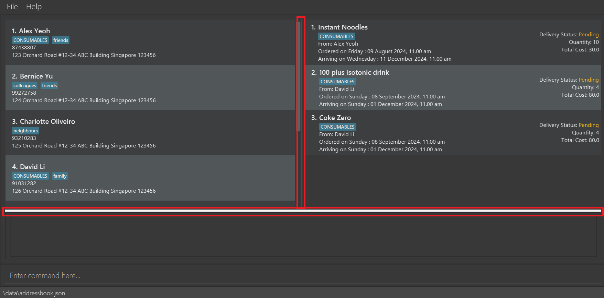

Supply Central is a **desktop app for managing suppliers, optimized for use via a Command Line Interface** (CLI) while still having the benefits of a Graphical User Interface (GUI). If you can type fast, SupplyCentral can get your supplier management tasks done faster than traditional GUI apps. This app aims to resolve the pain points of small business owners (narrowed to the Singapore context) by helping them with information handling. As a **key** feature of SupplyCentral, pending goods with arrival dates that have been passed are even automatically marked as delivered for you! This app is based on the Address Book 3 (AB3) project.

## Table of Contents
<!-- TOC -->
  * [Table of Contents](#table-of-contents)
  * [Quick Start](#quick-start)
  * [Features](#features)
    * [Viewing help : `help`](#viewing-help--help)
    * [Adding a supplier: `add`](#adding-a-supplier-add)
      * [Address format](#address-format)
    * [Listing all suppliers : `list`](#listing-all-suppliers--list)
    * [Editing a supplier : `edit`](#editing-a-supplier--edit)
    * [Locating suppliers by name: `find`](#locating-suppliers-by-name-find)
    * [Deleting a supplier : `delete`](#deleting-a-supplier--delete)
    * [Clearing all entries : `clear`](#clearing-all-entries--clear)
    * [Exiting the program : `exit`](#exiting-the-program--exit)
    * [Adding of Goods : `addgoods`](#adding-of-goods--addgoods)
    * [Deletion of Goods : `deletegoods`](#deletion-of-goods--deletegoods)
    * [View statistics for Goods : `viewgoods`](#view-statistics-for-goods--viewgoods)
    * [Export Goods Data to CSV: `export`](#export-goods-data-to-csv-export)
    * [Saving the data](#saving-the-data)
    * [Editing the Supplier data file](#editing-the-supplier-data-file)
    * [Editing the Goods data file](#editing-the-goods-data-file)
    * [Resizing UI elements](#resizing-ui-elements)
    * [Delivery Status](#delivery-status)
  * [FAQ](#faq)
  * [Known issues](#known-issues)
  * [Command summary](#command-summary)
<!-- TOC -->

--------------------------------------------------------------------------------------------------------------------

## Quick Start

1. Ensure you have Java `17` or above installed in your computer.

2. Download the latest `.jar` file from [here](https://github.com/AY2425S1-CS2103-F10-1/tp/releases).

3. Copy the file to the folder you want to use as the _home folder_ for SupplyCentral.

4. Open a command terminal, `cd` into the folder you put the jar file in, and use the `java -jar SupplyCentral.jar` command to run the application. 
   A GUI similar to the below should appear in a few seconds. Note how the app contains some sample data and goods view will only show undelivered goods upon startup. 
   

5. Type the command in the command box and press Enter to execute it. e.g. typing **`help`** and pressing Enter will open the help window. 
   Some example commands you can try:

   * `list` : Lists all suppliers registered in SupplyCentral.

   * `add n/John Doe p/98765432 a/125 Orchard Road #12-34 ABC Building Singapore 123456` : Adds a supplier named `John Doe` to SupplyCentral.

   * `delete Alex Yeoh` : Deletes the supplier "Alex Yeoh".

   * `addgoods gn/Gardenia Milk Bread q/2 p/5 c/CONSUMABLES pd/2024-08-08 11:00 ad/2024-11-11 11:00 n/John Doe` : Adds an order for "Gardenia Milk Bread" from supplier "John Doe" for tracking.

   * `clear` : Deletes all suppliers and goods registered in the application.

   * `exit` : Exits SupplyCentral.

6. Refer to the [Features](#features) below for details of each command.

--------------------------------------------------------------------------------------------------------------------

## Features

**:information_source: Notes about the provided command format:** 

* Words in `UPPER_CASE` are the parameters to be supplied by the user. 
  e.g. in `add n/NAME`, `NAME` is a parameter which can be used as `add n/John Doe`.

* Items in square brackets are optional. 
  e.g `n/NAME [t/TAG]` can be used as `n/John Doe t/friend` or as `n/John Doe`.

* Items with `…`​ after them can be used multiple times including zero times. 
  e.g. `[t/TAG]…​` can be used as ` ` (i.e. 0 times), `t/friend`, `t/friend t/family` etc.

* Parameters can be in any order. 
  e.g. if the command specifies `n/NAME p/PHONE_NUMBER`, `p/PHONE_NUMBER n/NAME` is also acceptable.

* Extraneous parameters for commands that do not take in parameters (such as `help`, `list`, `exit` and `clear`) will be ignored. The exception to this would be the `viewgoods` command, where extraneous inputs will be raised as errors for clarity.  
  e.g. if the command specifies `help 123`, it will be interpreted as `help`.

* If you are using a PDF version of this document, be careful when copying and pasting commands that span multiple lines as space characters surrounding line-breaks may be omitted when copied over to the application.

### Viewing help : `help`

Shows a message explaining how to access the help page.

Format: `help`

### Adding a supplier: `add`

Adds a supplier to the SupplyCentral.

Format: `add n/NAME p/PHONE_NUMBER a/ADDRESS [t/TAG]…​`

:bulb: **Tip:**
A person can have any number of tags (including 0). Tags are differentiated by case-sensitive characters.

#### Address format
>**[Block Number]** [Street Name]**#[Unit Level]-[Unit No.]** [Building Name] Singapore [Postal Code]
>>[Block Number] & #[Unit Level]-[Unit No.] **are optional**

Examples:
* `add n/John Doe p/98765432 a/421 Marina Bay Road #12-34 Tan Kim PTE Building Singapore 123456`
* `add n/Betsy Crowe p/99991111 a/421 Marina Bay Road #12-34 Tan Kim PTE Building Singapore 123456 p/12345678 t/VegetableSeller`

Note: The application is optimized for convenience store owners within the Singapore context, hence the address and phone numbers accepted are standardized to Singapore's format. 

### Listing all suppliers : `list`

Shows a list of all suppliers registered in SupplyCentral.

Format: `list`

### Editing a supplier : `edit`

Edits an existing supplier in SupplyCentral.

Format: `edit NAME [n/NEW_NAME] [p/PHONE] [a/ADDRESS] [t/TAG]…​`

* Edits the supplier with the specified `NAME`.
* At least one of the optional fields must be provided.
* Existing values will be updated to the input values.
* When editing tags, the existing tags of the supplier will be removed i.e adding of tags is not cumulative.
* You can remove all the supplier’s tags by typing `t/` without
    specifying any tags after it.

Examples:
*  `edit Bety n/Betsy Crower t/` edits the name of `Bety` to be `Betsy Crower` and clears all existing tags.

Note: This change will also be reflected in the goods that are tied to that supplier.

### Locating suppliers by name: `find`

Finds suppliers whose names contain any of the given keywords.

Format: `find KEYWORD [MORE_KEYWORDS] [c/CATEGORY]…​`

* At least one keyword or category should be provided.
* The search is case-insensitive. e.g `hans` will match `Hans`
* The order of the keywords does not matter. e.g. `Hans Bo` will match `Bo Hans`
* The keywords will be searched on the name of the supplier.
* Only full words will be matched e.g. `Han` will not match `Hans`
* Persons matching at least one keyword will be returned (i.e. `OR` search).
  e.g. `Hans Bo` will return `Hans Gruber`, `Bo Yang`
* Optionally, a selection of categories `CONSUMABLES`, `LIFESTYLE`, `SPECIALTY` can be specified to search for suppliers which has goods which has at least one of the specified category. If the category is specified, the keywords are optional.
* When both keywords and category are provided in the search, they will be handled in an `OR` manner.
  e.g. `find Alex c/CONSUMABLES` will return both suppliers who match `Alex` and all suppliers who can supply `CONSUMABLES` items.

Examples:
* `find John` returns `john` and `John Doe`
* `find alex david` returns `Alex Yeoh`, `David Li` 
  
* `find alex c/LIFESTYLE` returns both `Alex` matches and suppliers for `LIFESTYLE` products 
  
* `find c/CONSUMABLES c/LIFESTYLE`

### Deleting a supplier : `delete`

Deletes the specified supplier from SupplyCentral.

Format: `delete NAME`

* Deletes the person with the exact specified `NAME`.

Examples:
* `delete Amy` deletes the supplier of name `Amy` in SupplyCentral.

### Clearing all entries : `clear`

Clears all entries from SupplyCentral, including all tracked goods. This action is irreversible!

Format: `clear`

### Exiting SupplyCentral : `exit`

Exits SupplyCentral.

Format: `exit`

### Adding of Goods : `addgoods`

Adds a specific goods item tied to a supplier. All fields are required for this command.

Format: `addgoods gn/GOODS_NAME q/QUANTITY p/PRICE c/CATEGORY pd/PROCUREMENT_DATE ad/ARRIVAL_DATE n/SUPPLIER_NAME`

* Goods are uniquely identified by all fields. (e.g. Goods can be repeated if any of the fields are different)
* Quantity should be a positive number where `quantity > 0`.
* Price cannot be a negative number (`price >= 0.00`) and should be entered without currency symbols. (eg. 1.5)
* Procurement date and arrival date should be in the format `YYYY-MM-DD HH:MM` (24-hour format).
* The arrival date should strictly be after the Procurement Date.
* The Goods Category has to be fully capitalized and one of `CONSUMABLES`, `LIFESTYLE`, `SPECIALTY`.

Examples:

* `addgoods gn/Gardenia Milk Bread q/2 p/5 c/CONSUMABLES pd/2024-08-08 11:00 ad/2024-11-11 11:00 n/Alex Yeoh` will add goods of name `Gardenia Milk Bread` that belongs to the supplier `Alex Yeoh`.

Note: The goods category of goods will also be reflected on the supplier as a tag. For instance, if a supplier has a goods which has a goods category of `CONSUMABLES`, a `CONSUMABLES` tag will be added to the supplier (only visually). The tag information of the supplier remains as it is.

### Deletion of Goods : `deletegoods`

Deletes all of the specified goods from the specified supplier.

Format: `deletegoods n/NAME gn/GOODS_NAME`

Examples:

* `deletegoods n/John Doe gn/Gardenia Milk Bread` deletes all goods records that has name `Gardenia Milk Bread` which belongs to the supplier `John Doe`. 

### View statistics for Goods : `viewgoods`

Displays a list of goods that fit the currently applied filters. This will also provide the user with simple statistics like quantity/price totals based on the currently displayed list.

Format: `viewgoods [gn/GOODS_NAME] [c/CATEGORY] [n/SUPPLIER_NAME]`

Examples:

* `viewgoods gn/Banana c/CONSUMABLES` will display goods that contain the keyword `banana` and are of the `CONSUMABLES` type.

Note: All filters are optional, and all goods will be shown if no filters are provided for the command. Multiple filters are also accepted as shown by the case in the example above. Any provided keywords that are not preceeded by a valid prefix will be treated as invalid input for clarity purposes.

### Export Goods Data to CSV: `export`

Exports the currently displayed goods in a new CSV file. Should be used after filters have been applied to obtain a clean set of data for any external usage.
- This command is entirely dependent on the `viewgoods` command.
- As such, if the `viewgoods` function has not been used, the default export will be the list of goods with pending deliveries.
- This new CSV file will be saved as `[JAR file location]/data/filteredGoods.csv`.

Format: `export`

Examples:

* if `viewgoods c/CONSUMABLES` was entered, followed by `export`, you will receive a list of `CONSUMABLES` in the newly created CSV file.

Note: If the `filteredGoods.csv` file already exists, the information contained will simply be overwritten with new data from the currently applied filter.

### Saving the data

SupplyCentral data is saved in the hard disk automatically after any command that changes the data. There is no need to save manually.

### Editing the Supplier data file

SupplyCentral supplier data is saved automatically as a JSON file `[JAR file location]/data/addressbook.json`. Advanced users are welcome to update data directly by editing that data file.

:exclamation: **Caution:**
If your changes to the data file makes its format invalid, SupplyCentral will discard all data and start with an empty data file at the next run. Hence, it is recommended to take a backup of the file before editing it. 
Furthermore, certain edits can cause SupplyCentral to behave in unexpected ways (e.g., if a value entered is outside of the acceptable range). Therefore, edit the data file only if you are confident that you can update it correctly.

### Editing the Goods data file

SupplyCentral goods data will be stored in a CSV file `[JAR file location]/data/goods.csv` for advanced users to access and use externally for business purposes. However, it is strongly discouraged for users to directly edit this data file due to risk of data corruption.

:exclamation: **Caution:**
Similar to the supplier data file, if your changes to the data file makes its format invalid, SupplyCentral will discard all invalid data and will only retain any valid data within the current file. Hence, as mentioned above, it is strongly discouraged to directly edit this file. 

### Resizing of UI elements

SupplyCental allows you to resize the UI elements to better fit your screen. You can resize UI elements by clicking and dragging the dividers, as shown in the image below.

The elements will resize according to the position of the divider, allocating more space for the output to be displayed or more space for the suppliers/goods to be displayed.

### Delivery Status

The delivery status of the goods can be easily seen through the color of the delivery status text. The color of the delivery status will be yellow if the delivery status is `PENDING` and will change to green if the delivery status is `Delivered`, as shown in the image below.

This is a **key** feature of our application and deliveries are automatically marked as delivered depending on the current time. 

Examples:
* If an existing goods record has an arrival date set for 1st of January 2024 at 12pm, once 1st of January 2024 12pm has passed, the goods will be marked as delivered without any need for user action.

--------------------------------------------------------------------------------------------------------------------

## FAQ

**Q**: How do I transfer my data to another Computer? 
**A**: Install the app in the other computer and overwrite the empty data file it creates with the file that contains the data of your previous AddressBook home folder.

**Q**: Goods are not showing up when I start SupplyCentral! 
**A**: You likely do not have any pending goods, as only goods pending deliveries will be shown on startup.

--------------------------------------------------------------------------------------------------------------------

## Known issues

1. **When using multiple screens**, if you move the application to a secondary screen, and later switch to using only the primary screen, the GUI will open off-screen. The remedy is to delete the `preferences.json` file created by the application before running the application again.
2. **If you minimize the Help Window** and then run the `help` command (or use the `Help` menu, or the keyboard shortcut `F1`) again, the original Help Window will remain minimized, and no new Help Window will appear. The remedy is to manually restore the minimized Help Window.
3. **UI elements can be resized to be too small**: Each UI element can be resized to a point where it may not be visible at all. If this happens accidentally, the user may be confused about the missing UI element. There should be a minimum height/width for each UI element to prevent this issue.
4. **Unit level and number in the address field are not bounded reasonably**: For commands like `add` and `edit`, the unit level and number in the address field are not reasonably bounded. This allows users to input excessively large unit numbers without any error message.
5. **Inconsistent capitalization of supplier name for adding Goods**: When adding goods, the supplier name follows the user's exact capitalisation of input and not the capitalisation of the supplier name in the supplier list. This may lead to confusion if the user is not aware of the exact capitalisation of the supplier name.
6. **Automatic marking of delivered goods**: In a real-life scenario where it is possible for goods to be delayed or not delivered at all, this feature may cause confusion among users. As we still do not have a method to unmark the delivery status of goods, the remedy would be to delete and re-create the goods with a new arrival date.

--------------------------------------------------------------------------------------------------------------------

## Command summary

Action | Format, Examples
--------|------------------
**Add Supplier** | `add n/NAME p/PHONE_NUMBER a/ADDRESS [t/TAG]…​`   e.g. `add n/James Ho p/22224444 a/125 Orchard Road #12-34 ABC Building Singapore 123456 t/VegetableSeller`
**Clear** | `clear`
**Delete Supplier** | `delete NAME`  e.g. `delete Amy`
**Edit Supplier** | `edit NAME [n/NEW_NAME] [p/PHONE_NUMBER] [a/ADDRESS] [t/TAG]…​`  e.g.`edit James n/James Lee`
**Find Suppliers** | `find KEYWORD [MORE_KEYWORDS] [c/CATEGORY]…​`  e.g. `find James Jake c/CONSUMABLES`
**List Suppliers** | `list`
**Help** | `help`
**Add Goods** | `addgoods gn/GOODS_NAME q/QUANTITY p/PRICE c/CATEGORY pd/PROCUREMENT_DATE ad/ARRIVAL_DATE n/SUPPLIER_NAME`   e.g. `addgoods gn/Gardenia Milk Bread q/2 p/5 c/CONSUMABLES pd/2024-08-08 11:00 ad/2024-11-11 11:00 n/Alex Yeoh`
**Delete Goods** | `deletegoods n/NAME gn/GOODS_NAME`   e.g. `deletegoods n/John Doe gn/Gardenia Milk Bread`
**View Goods List** | `viewgoods [gn/GOODS_NAME] [c/CATEGORY] [n/SUPPLIER_NAME]`   e.g. `viewgoods gn/Banana c/CONSUMABLES`
**Export Goods Data** | `export`
