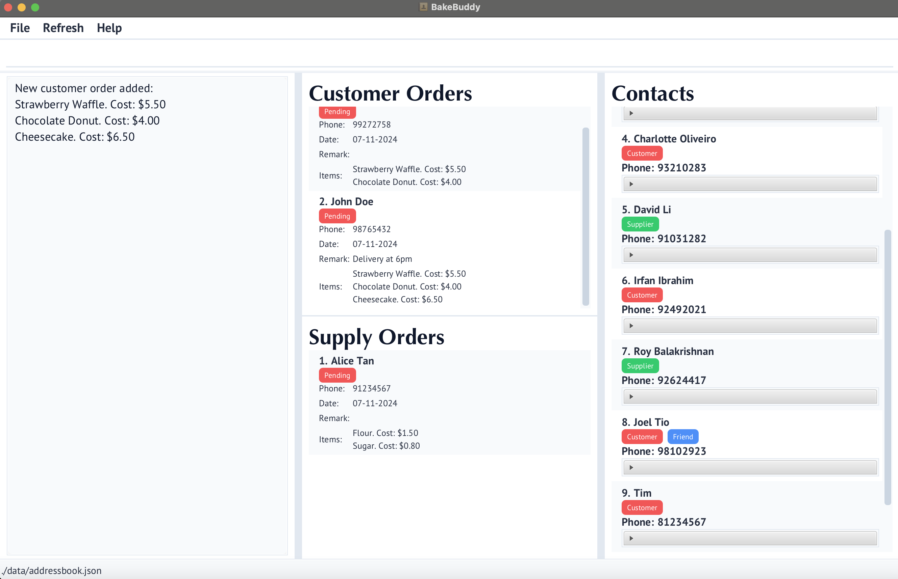

* Table of Contents
{:toc}

--------------------------------------------------------------------------------------------------------------------

# Welcome to BakeBuddy

BakeBuddy is your all-in-one command-line companion for managing your home bakery business. Designed with speed and
efficiency in mind, it combines the power of a Command Line Interface (CLI) with intuitive features to help you focus
on what matters most - creating delicious baked goods.

BakeBuddy is a desktop application that streamlines your bakery operations by helping you manage:
- 🧁 Pastries and recipes
- 👥 Customers and their orders
- 📦 Suppliers and ingredients
- 📋 Order tracking and fulfillment
- 🗄️ Inventory management

## Why Choose BakeBuddy?

- **Speed First**: Execute commands quickly through our CLI, perfect for busy bakers
- **User-Friendly**: Simple GUI elements complement the CLI for enhanced usability
- **All-in-One Solution**: Manage every aspect of your bakery business from a single application
- **Efficiency Focused**: Designed specifically for home-based bakery owners who value their time

## Getting Started

This guide will walk you through everything you need to know about BakeBuddy, from basic commands to advanced features.

--------------------------------------------------------------------------------------------------------------------

## Before You Begin ✔️

### Step 1: Check if Your Computer is Ready
First, we need to make sure your computer has Java 17 installed. Here's how to check:

1. Open your computer's terminal:
  - **For Windows**: Press the Windows key + R, type `cmd`, and press Enter
  - **For Mac**: Press Command + Space, type `terminal`, and press Enter

2. In the black window that appears, type exactly:
   ```
   java --version
   ```
   and press Enter

3. What you should see:
  - ✅ If you see "Java version 17" (or any number above 17), you're ready to go!
  - ❌ If you see "command not found" or a number below 17, visit [Java's download page](https://www.oracle.com/java/technologies/downloads/#java17) to install Java 17

### Step 2: Install BakeBuddy

1. Download BakeBuddy:
  - Click [this link](https://github.com/AY2425S1-CS2103T-T11-1/tp/releases) to download the latest BakeBuddy
  - Look for the file named `bakebuddy.jar`
  - Click on it to download

2. Create a home for BakeBuddy:
  - Create a new folder on your computer named `BakeBuddy`
  - Move the downloaded `bakebuddy.jar` file into this folder

3. Start BakeBuddy:
  - Open your terminal (like in Step 1)
  - Type `cd ` (with a space after cd)
  - Drag your BakeBuddy folder into the terminal window (this fills in the location automatically!)
  - Press Enter
  - Type:
    ```
    java -jar bakebuddy.jar
    ```
  - Press Enter

   You should see the BakeBuddy window appear as follows!


### Step 3: Try Your First Commands

Now that BakeBuddy is running, let's add your first items. In the BakeBuddy window, you'll see a space to type commands at the top.

Refer to the [Features](#features) below for details of each command.


## List of Commands

### Contact Management
#### General Contacts

| Command | Format | Example |
| --- | --- | --- |
| [Add Contact](#add-contact-command) | `addContact n/NAME p/PHONE_NUMBER [e/EMAIL] [a/ADDRESS] [t/TAG]` | `addContact n/Tim p/81234567 e/emily@example.com a/456 Cupcake Road` |
| [Delete Contact](#delete-contact-command) | `deleteContact INDEX` | `deleteContact 1` |
| [Edit Contact](#edit-contact-command) | `editContact INDEX [n/NAME] [p/PHONE_NUMBER] [e/EMAIL] [a/ADDRESS] [t/TAG]` | `editContact 1 p/91150335` |
| [Filter Contact](#filter-contact-command) | `filterContact t/TAG [MORE_TAGS...]` | `filterContact t/Customer` |
| [Find](#find-persons-by-name) | `find KEYWORD [MORE_KEYWORDS]` | `find Charlotte Bernice` |
| [List](#list-command) | `list` | `list` |
| [Remark](#remark-command) | `remark INDEX r/REMARK` | `remark 1 r/Regular customer` |

#### Customer Specific

| Command | Format | Example |
| --- | --- | --- |
| [Add Customer](#add-customer-command) | `addCustomer n/NAME p/PHONE_NUMBER [e/EMAIL] [a/ADDRESS] [i/INFORMATION] [t/TAG]` | `addCustomer n/Tim p/81234567 i/Allergic to peanuts` |

#### Supplier Specific

| Command | Format | Example |
| --- | --- | --- |
| [Add Supplier](#add-supplier-command) | `addSupplier n/NAME p/PHONE_NUMBER e/EMAIL a/ADDRESS s/INGREDIENTS_SUPPLIED [t/TAG]` | `addSupplier n/tim p/81234567 s/salt, chocolate` |

### Order Management
#### Customer Orders

| Command | Format | Example |
| --- | --- | --- |
| [Add Customer Order](#add-customer-order-command) | `addCustomerOrder [n/NAME] p/PHONE_NUMBER o/PRODUCTID [MORE_PRODUCTIDSs...] [r/REMARK]` | `addCustomerOrder n/John p/98765432 o/1 2 3 r/Delivery at 6pm` |
| [Delete Customer Order](#delete-customer-order-command) | `deleteCustomerOrder INDEX` | `deleteCustomerOrder 2` |
| [Mark Customer Order](#mark-customer-order-command) | `markCustomerOrder INDEX` | `markCustomerOrder 1` |
| [Unmark Customer Order](#unmark-customer-order-command) | `unmarkCustomerOrder INDEX` | `unmarkCustomerOrder 1` |

#### Supply Orders

| Command | Format | Example |
| --- | --- | --- |
| [Add Supply Order](#add-supply-order-command) | `addSupplyOrder n/NAME p/PHONE_NUMBER o/PRODUCTID [MORE_PRODUCTIDs...]` | `addSupplyOrder n/John p/98765432 o/1 2 3` |
| [Delete Supply Order](#delete-supply-order-command) | `deleteSupplyOrder INDEX` | `deleteSupplyOrder 1` |
| [Mark Supply Order](#mark-supply-order-command) | `markSupplyOrder INDEX` | `markSupplyOrder 1` |
| [Unmark Supply Order](#unmark-supply-order-command) | `unmarkSupplyOrder INDEX` | `unmarkSupplyOrder 1` |

### Catalogue Management
#### Ingredient Catalogue

| Command | Format | Example |
| --- | --- | --- |
| [Add Ingredient](#add-ingredient-command) | `addIngredient NAME COST` | `addIngredient Syrup 3.50` |
| [Remove Ingredient](#remove-ingredient-command) | `removeIngredient NAME` | `removeIngredient Flour` |
| [View Ingredient Catalogue](#view-ingredientcatalogue-command) | `viewIngredientCatalogue` | `viewIngredientCatalogue` |

#### Pastry Catalogue

| Command | Format | Example |
| --- | --- | --- |
| [Add Pastry](#add-pastry-command) | `addPastry NAME COST INGREDIENT [MORE_INGREDIENTS...]` | `addPastry Croissant 3.50 Flour Cream Sugar` |
| [Remove Pastry](#remove-pastry-command) | `removePastry NAME` | `removePastry Croissant` |
| [View Pastry Catalogue](#view-pastrycatalogue-command) | `viewPastryCatalogue` | `viewPastryCatalogue` |

### Inventory Management

| Command | Format | Example |
| --- | --- | --- |
| [Check Ingredient Stock](#check-ingredient-stock-command) | `checkIngredientStock INGREDIENT` | `checkIngredientStock Flour` |
| [Check Pastry Stock](#check-pastry-stock-command) | `checkPastryStock PASTRY` | `checkPastryStock Croissant` |
| [View Inventory](#view-inventory-command) | `viewInventory` | `viewInventory` |

### General Commands

| Command | Format | Example |
| --- | --- | --- |
| [Help](#help-command) | `help` | `help` |
| [Clear](#clearing-all-entries--clear) | `clear` | `clear` |
| [Exit](#exit-command) | `exit` | `exit` |

**Parameter Reference:**
* `INDEX`: Positive integer (1, 2, 3, ...)
* `NAME`: Name of person/item
* `PHONE_NUMBER`: Phone number
* `EMAIL`: Email address
* `ADDRESS`: Physical address
* `INFORMATION`: Additional customer details
* `INGREDIENTS_SUPPLIED`: List of ingredients (for suppliers)
* `COST`: Numeric value
* `PRODUCTID`: Product identification numbers
* `TAG`: Category or label
* `REMARK`: Additional comments

**Format Notes:**
* `[parameter]`: Optional parameter
* `parameter...`: Parameter can be repeated
* Parameters can be entered in any order
* Commands and parameter prefixes are case-sensitive
* Parameter values are case-insensitive

--------------------------------------------------------------------------------------------------------------------
## FAQ


--------------------------------------------------------------------------------------------------------------------
## Features

<div markdown="block" class="alert alert-info">

**Notes about the command format:**<br>

* Words in `UPPER_CASE` are the parameters to be supplied by the user.<br>
  e.g. in `addContact n/NAME`, `NAME` is a parameter which can be used as `addContact n/John Doe`.

* Items in square brackets are optional.<br>
  e.g `n/NAME [t/TAG]` can be used as `n/John Doe t/friend` or as `n/John Doe`.

* Items with `…`​ after them can be used multiple times including zero times.<br>
  e.g. `[t/TAG]…​` can be used as ` ` (i.e. 0 times), `t/friend`, `t/friend t/family` etc.

* Parameters can be in any order.<br>
  e.g. if the command specifies `n/NAME p/PHONE_NUMBER`, `p/PHONE_NUMBER n/NAME` is also acceptable.

* Extraneous parameters for commands that do not take in parameters (such as `help`, `list`, `exit` and `clear`) will be ignored.<br>
  e.g. if the command specifies `help 123`, it will be interpreted as `help`.

* If you are using a PDF version of this document, be careful when copying and pasting commands that span multiple lines as space characters surrounding line-breaks may be omitted when copied over to the application.
</div>

### **Add Contact Command**
Adds a new contact to the bakery’s database.

```bash
addContact n/NAME p/PHONE_NUMBER [e/EMAIL] [a/ADDRESS] [t/TAG]
```
- **Parameters:**
  - `n/NAME`: The person's name.
  - `p/PHONE_NUMBER`: The person's phone number.
  - `e/EMAIL`: (Optional) The person's email address.
  - `a/ADDRESS`: (Optional) The person's address.
  - `t/TAG`: (Optional) Tags for additional person information.

**Example:**
```bash
addContact n/Tim p/81234567 e/emily@example.com a/456 Cupcake Road, Block 123, 03-04 
```


### **Add Customer Command**
Adds a new customer to the bakery’s customer database.

```bash
addCustomer n/NAME p/PHONE_NUMBER [e/EMAIL] [a/ADDRESS] [i/INFORMATION] [t/TAG]
```
- **Parameters:**
  - `n/NAME`: The customer's name.
  - `p/PHONE_NUMBER`: The customer's phone number.
  - `e/EMAIL`: (Optional) The customer's email address.
  - `a/ADDRESS`: (Optional) The customer's address.
  - `s/INFORMATION`: (Optional) Additional information of the customer such as dietary preference.
  - `t/TAG`: (Optional) Tags for additional customer information.

**Example:**
```bash
addCustomer n/Tim p/81234567 e/emily@example.com a/456 Cupcake Road, Block 123, 03-04 i/Allergic to peanuts
```


### **Add Ingredient Command**
Adds a new ingredient to the bakery's ingredient catalogue, along with its cost.

```bash
addIngredient NAME COST
```
- **Parameters:**
  - `NAME`: The name of the ingredient.
  - `COST`: The cost of the ingredient.

**Example:**
```bash
addIngredient Syrup 3.50 
```


### **Add Customer Order Command**
Adds a customer order by providing the customer's name, phone number and the pastry IDs from the pastry catalogue.

<div class="alert alert-info">
⚠️ **Important Information**  
To view the new order in the customer's contact details:<br>
1. Add the customer order using the command above <br>
2. Click the refresh button in the UI <br>
3. The order will now appear under the customer's contact information <br> <br>
</div>

```bash
addCustomerOrder [n/NAME] p/PHONE_NUMBER o/PRODUCTID [MORE_PRODUCTIDs...] [r/REMARK]
```
- **Parameters:**
  - `n/NAME`: (Optional) The customer's name.
  - `p/PHONE_NUMBER`: The phone number of the customer (new customer will be added with the name if phone number not found in contacts).
  - `o/PRODUCTID`: One or more pastry IDs for the items being ordered.
  - `r/REMARK`: (Optional) Information about the customer order.

**Example:**
```bash
addCustomerOrder n/John Doe p/98765432 o/1 2 3 r/Delivery at 6pm 
```


### **Add Pastry Command**
Adds a new pastry to the bakery's pastry catalogue.

```bash
addPastry NAME COST INGREDIENT [MORE_INGREDIENTS...]
```
- **Parameters:**
    - `NAME`: The name of the pastry.
    - `COST`: The cost of the pastry.
    - `INGREDIENT`: One or more ingredient names.

**Example:**
```bash
addPastry Croissant 3.50 Flour Cream Sugar
```


The Add Pastry Command allows bakery owners to add a new pastry item to their pastry catalogue, specifying the name, 
cost and ingredients for each pastry. This command accepts the pastry's name, a numeric value for how much the 
bakery owner will sell it for, and a list of ingredients required to make it. 

For example, typing **addPastry Croissant 3.50 Flour Cream Sugar** would add a pastry named "Croissant" priced at $3.50, 
with "Flour," "Cream," and "Sugar" listed as its ingredients. By using this command, bakery owners can easily track of 
all their pastries and ingredient needs, making it more convenient for bakery owners to manage their inventory.

### **Add Supplier Command**
Adds a new supplier to the bakery’s supplier database.

```bash
addSupplier n/NAME p/PHONE_NUMBER e/EMAIL a/ADDRESS s/INGREDIENTS_SUPPLIED [t/TAG]
```
- **Parameters:**
    - `n/NAME`: The supplier's name.
    - `p/PHONE_NUMBER`: The supplier's phone number.
    - `e/EMAIL`: The supplier's email address.
    - `a/ADDRESS`: The supplier's address.
    - `s/INGREDIENTS_SUPPLIED`: List of ingredients supplied, comma separated
    - `t/TAG`: (Optional) Tags for additional supplier information.

**Example:**
```bash
addSupplier n/tim p/81234567 e/emily@example.com a/456 Cupcake Road, Block 123, 03-04 s/salt, chocolate
```


The Add Supplier Command allows bakery owners to add a new supplier to the address book records. The supplier is specified
with all relevant contact details and ingredients supplied to the bakery. This command accepts the supplier's name, 
phone number, email address, residential address, and a list of ingredients the supplier provides, with an option to
include a tag for additional information. 

For example, typing **addSupplier n/tim p/81234567 e/emily@example.com a/456 Cupcake Road, Block 123, #03-04 s/salt, chocolate** 
will add a supplier named "Tim" with phone number "81234567," email "emily@example.com," located at "456 Cupcake Road, Block 123, #03-04," 
and supplying "salt" and "chocolate" as the supplied ingredients for the bakery. This command simplifies the tracking 
of supplier contacts and ingredient sources, helping bakery owners efficiently manage supplier relationships and inventory.

### **Add Supply Order Command**
Adds a supplier order by providing the supplier's name, phone number and the product IDs from the ingredient catalogue.

<div class="alert alert-info">
⚠️ **Important Information**  <br>
To view the new order in the supplier's contact details: <br>
1. Add the supplier order using the command above <br> 
2. Click the refresh button in the UI <br>
3. The order will now appear under the supplier's contact information <br> <br>
</div>

```bash
addSupplyOrder n/NAME p/PHONE_NUMBER o/PRODUCTID [MORE_PRODUCTIDs...]
```
- **Parameters:**
    - `n/NAME`: The supplier's name.
    - `p/PHONE_NUMBER`: The phone number of the supplier.
    - `o/PRODUCTID`: One or more product IDs for the items being supplied.

**Example:**
```bash
addSupplyOrder n/John Doe p/98765432 o/1 2 3
```


The Add Supply Order Command enables bakery owners to add a new order from a supplier by specifying the supplier's name,
phone number, and a list of product IDs from the ingredient catalogue, identifying which items are included in the order.

For example, typing **addSupplyOrder n/John Doe p/98765432 o/1 2 3** creates a supply order for a supplier named
"John Doe" with phone number "98765432," ordering products with IDs "1," "2," and "3" from the ingredient catalogue.
This command helps bakery owners efficiently manage incoming supplies, track supply orders by product ID, and streamline 
the ordering process for necessary ingredients.

### **Check Ingredient Stock Command**
Check the stock in the inventory for a certain ingredient.

```bash
checkIngredientStock INGREDIENT
```
- **Parameters:**
    - `INGREDIENT`: The name of the ingredient to be checked.

**Example:**
```bash
checkIngredientStock Flour
```


The Check Ingredient Stock Command allows bakery owners to verify the current stock level of a specified ingredient in 
their inventory. This command requires the ingredient's name and will display the available quantity for that ingredient 
if it is in stock. 

For example, typing **checkIngredientStock Flour** checks the inventory for the "Flour" ingredient and returns the 
quantity available if there is sufficient stock. This command helps bakery owners keep track of ingredient levels, 
ensuring they have sufficient ingredients to make pastries for customers and can plan pastry orders when needed.

### **Check Pastry Stock Command**
Check the stock in the inventory for a certain pastry.

```bash
checkPastryStock PASTRY
```
- **Parameters:**
    - `PASTRY`: The name of the pastry to be checked.

**Example:**
```bash
checkPastryStock Croissant
```


The Check Pastry Stock Command allows bakery owners to verify the availability of a specific pastry in their inventory.
This command requires only the pastry's name and will display whether there is sufficient stock to meet potential
customer demand.

For example, typing **checkPastryStock Croissant** checks the inventory for "Croissant" pastry and returns the quantity
available if there are sufficient pastries. This command helps bakery owners ensure they can fulfill customer orders
by maintaining the right stock levels for popular pastries.

### **Clear All Command**
Removes all entries from the bakery’s address book, including customers, suppliers, and any related information.

```bash
clear
```
**Example:**
```bash
clear
```


The Clear All Command clears all data in the address book, removing all stored records such as customer and supplier
details and inventory items.

For example, typing **clear** will remove all customer, supplier and inventory information from the address book.
This command provides a quick way to delete all existing records in one go, allowing bakery owners to reset their
address book fully. It is helpful when bakery owners want a fresh start or data needs to be purged for any reason.
This command ensures the address book is empty and ready for new entries.

### **Delete Contact Command**
Deletes the contact details of specified person from the address book.

```bash
deleteContact INDEX
```
- **Parameters:**
    - `INDEX`: The index number shown in the displayed Contact List. Must be a positive integer.

**Example:**
```bash
deleteContact 1
```


### **Delete Customer Order Command**
Deletes a customer order from the customer order list at the specified index.

```bash
deleteCustomerOrder INDEX
```
- **Parameters:**
    - `INDEX`: The index of the order to delete, as displayed in the Customer Order List. Must be a positive integer.

**Example:**
```bash
deleteCustomerOrder 2
```

### **Delete Supply Order Command**
Deletes a supply order from the supply order list at the specified index.

```bash
deleteSupplyOrder INDEX
```
- **Parameters:**
    - `INDEX`: The index of the order to delete, as displayed in the Supply Order List. Must be a positive integer.

**Example:**
```bash
deleteSupplyOrder 1
```

### **Edit Contact Command**
Update the contact details of an existing contact in the address book, including persons, customers, and suppliers. 

```bash
editContact INDEX [FIELDS...]
```
- **[FIELDS...]:**
    - `n/NAME`: (optional) The person's name.
    - `p/PHONE_NUMBER`: (optional) The person's phone number.
    - `e/EMAIL`: (Optional) The person's email address.
    - `a/ADDRESS`: (Optional) The person's address.
    - `i/INFORMATION`: (Optional, for customers only) Additional information of the customer such as dietary preference.
    - `s/INGREDIENTS SUPPLIED`: (Optional, for suppliers only) Ingredients supplied of a supplier.
    - `t/TAG`: (Optional) Tags for additional customer information.

**Example:**
```bash
editContact 1 p/91150335
```
    

### **Exit Command**
Exits the program.

```bash
exit
```
### **Filter Contact Command**
Filter and list contacts in the address book based on specified tags.

```bash
filterContact t/TAG [MORE_TAGS...]
```
- **Parameters:**
   - `t/TAG`: A tag to filter contacts by. Multiple tags can be specified by repeating the "t/" prefix with different tag values.

**Example:**
```bash
filterContact t/Customer
```


### **Find persons by name**
Finds persons whose names contain any of the given keywords.

```bash
find KEYWORD [MORE_KEYWORDS]
```
- **Parameters:**
    - `KEYWORD`: The keyword to search for.
    - `[MORE_KEYWORDS]`: Additional keywords to search for.
    - 
* Use the list command to return to the full contact listlist
* The search is case-insensitive. e.g `hans` will match `Hans`
* The order of the keywords does not matter. e.g. `Hans Bo` will match `Bo Hans`
* Only the name is searched.
* Only full words will be matched e.g. `Han` will not match `Hans`
* Persons matching at least one keyword will be returned (i.e. `OR` search).
  e.g. `Hans Bo` will return `Hans Gruber`, `Bo Yang`

**Example:**
```bash
find Charlotte Bernice
```


### **List Command**
Lists all contacts in the bakery's address book.

***Example:***
```bash
list
````


### **Help Command**
Displays a link to our user guide that provides detailed information on how to use the application.

***Example:***
```bash
help
````


### **Mark Customer Order Command**
Mark the customer order status as done.

```bash
markCustomerOrder INDEX
```
- **Parameters:**
    - `INDEX`: The index number for the CustomerOrder displayed in the list.

**Example:**
```bash
markCustomerOrder 1
```


### **Mark Supply Order Command**
Mark the supplier order status as done.

```bash
markSupplyOrder INDEX
```
- **Parameters:**
    - `INDEX`: The index for theSupplyOrder displayed in the list.

**Example:**
```bash
markSupplyOrder 1
```


### ***Remark Command***
Edits the remark of the person identified by the index number used in the last person listing. 
The existing remark will be overwritten.

```bash
remark INDEX r/REMARK
```

- **Parameters:**
    - `INDEX`: The index number of the person in the last listing.
    - `r/REMARK`: The new remark to be updated.

**Example:**
```bash
remark 1 r/Regular customer
```


### **Remove Ingredient Command**
Removes an existing ingredient from the bakery's ingredient catalogue.

```bash
removeIngredient NAME
```
- **Parameters:**
    - `NAME`: The name of the ingredient to remove. This is a case-insensitive match for an existing ingredient in the ingredient catalogue.

**Example:**
```bash
removeIngredient Flour
```

The Remove Ingredient Command enables bakery owners to delete an ingredient from their catalogue. This is useful for removing ingredients no longer used or mistakenly added. After execution, the system confirms the removal by displaying a success message.

For instance, entering removeIngredient Flour will delete the ingredient "Flour" from the catalogue. Attempting to remove an ingredient that does not exist will result in an error message.


### **Remove Pastry Command**
Removes an exisiting pastry from the bakery's pastry catalogue.

```bash
removePastry NAME
```
- **Parameters:**
    - `NAME`: The name of the pastry to remove. This is a case-insensitive match for an existing pastry in the pastry catalogue.

**Example:**
```bash
removePastry Croissant
```

The Remove Pastry Command allows the bakery to maintain an up-to-date catalogue by removing pastries that are discontinued or incorrectly added. On successful removal, the system displays a confirmation message.

For example, entering removePastry Croissant will remove "Croissant" from the catalogue. If the pastry does not exist, an error message will be shown.


### **View IngredientCatalogue Command**
Displays the current list of ingredients available in the bakery’s ingredient catalogue.

```bash
viewIngredientCatalogue
```

**Example:**
```bash
viewIngredientCatalogue
```

The View Ingredient Catalogue Command provides a detailed list of all ingredients, including their IDs, names, and costs. This command ensures that bakery owners have a complete overview of the ingredients, helping in efficient decision-making.

For instance, typing viewIngredientCatalogue displays the full catalogue for ingredient, enabling the bakery to verify all available ingredients in the catalogue.

### **View Inventory Command**
Displays the current list of ingredients available in the bakery’s inventory. It is in the format of "ID, Name, Units".

```bash
viewInventory
```

**Example:**
```bash
viewInventory
```

The View Inventory Command provides a detailed overview of the current inventory, including the stock levels of each ingredient. This command helps bakery owners manage stock efficiently, avoiding shortages or overstocking.

For instance, typing viewInventory displays the inventory with the ingredient names, IDs, and available quantities, offering a clear snapshot of the bakery's stock levels.

### **View PastryCatalogue Command**
Displays the current list of pastries available in the bakery’s pastry catalogue.

```bash
viewPastryCatalogue
```

**Example:**
```bash
viewPastryCatalogue
```

The View Pastry Catalogue Command provides a comprehensive view of all pastries in the bakery in one-go, including their IDs, names, price and ingredients with the costs. This command is vital for keeping track of the pastries offered to customers and ingredients needed to produce them. 

For example, entering viewPastryCatalogue shows the complete list of pastries, ensuring that bakery owners are aware of the available pastries.

### **Unmark Customer Order Command**
Unmark the customer order status as pending.

```bash
unmarkCustomerOrder INDEX
```
- **Parameters:**
  - `INDEX`: The index number for the CustomerOrder displayed in the list.

**Example:**
```bash
unmarkCustomerOrder 1
```


### **Unmark Supply Order Command**
Unmark the supply order status as pending.

```bash
unmarkSupplyOrder INDEX
```
- **Parameters:**
  - `INDEX`: The index for theSupplyOrder displayed in the list.

**Example:**
```bash
umarkSupplyOrder 1
```


----------------------------------------------------------------------------------------------------------------------