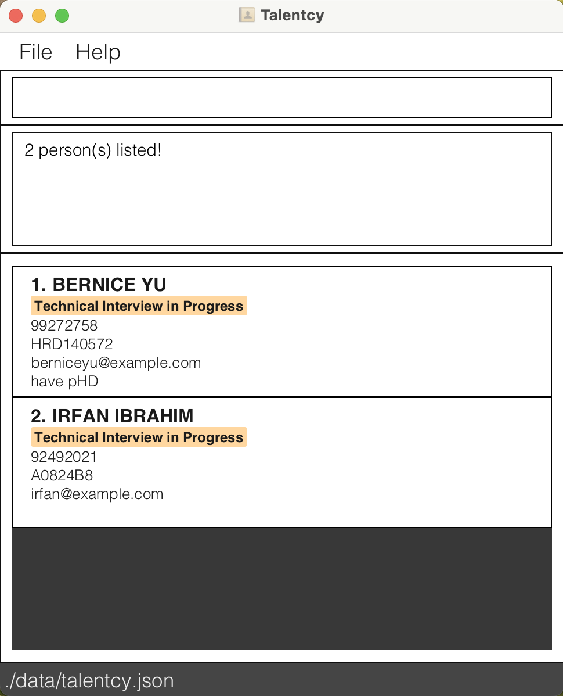

# Talency User Guide

Talency is a **desktop app for managing job applicant contacts and monitoring their interview stages, optimized for use via a  Line Interface** (CLI) while still having the benefits of a Graphical User Interface (GUI). If you can type fast, Talency can get your contact management tasks done faster than traditional GUI apps.

The codebase of Talency originates from AddressBook Level 3 (AB3) developed by CS2103 team.

<!-- * Table of Contents -->
<page-nav-print />

--------------------------------------------------------------------------------------------------------------------

## Quick start

1. Ensure you have Java `17` or above installed in your Computer.

1. Download the latest `.jar` file from [here](https://github.com/se-edu/addressbook-level3/releases).

1. Copy the file to the folder you want to use as the _home folder_ for your AddressBook.

1. Open a command terminal, `cd` into the folder you put the jar file in, and use the `java -jar addressbook.jar` command to run the application. 
   A GUI similar to the below should appear in a few seconds. Note how the app contains some sample data. 
   

1. Type the command in the command box and press Enter to execute it. e.g. typing **`help`** and pressing Enter will open the help window. 
   Some example commands you can try:

    * `list` : Lists all contacts.

    * `add n/John Doe p/98765432 e/johnd@example.com j/SWE123 t/A` : Adds a contact named `John Doe` to the Address Book.

    * `delete 3` : Deletes the 3rd contact shown in the current list.

    * `clear` : Deletes all contacts.

    * `exit` : Exits the app.

1. Refer to the [Features](#features) below for details of each command.

--------------------------------------------------------------------------------------------------------------------

## Features

<box type="info" seamless>

**Notes about the command format:** 

* Words in `UPPER_CASE` are the parameters to be supplied by the user. 
  e.g. in `add n/NAME`, `NAME` is a parameter which can be used as `add n/John Doe`.
* Items in square brackets are optional. 
    e.g `n/NAME [t/TAG]` can be used as `n/John Doe t/friend` or as `n/John Doe`.
* Items with `…`​ after them can be used multiple times including zero times. 
    e.g. `[t/TAG]…​` can be used as ` ` (i.e. 0 times), `t/friend`, `t/friend t/family` etc.
* Parameters can be in any order. 
  e.g. if the command specifies `n/NAME p/PHONE_NUMBER`, `p/PHONE_NUMBER n/NAME` is also acceptable.

* Extraneous parameters for commands that do not take in parameters (such as `help`, `list`, `exit` and `clear`) will be ignored. 
  e.g. if the command specifies `help 123`, it will be interpreted as `help`.

* If you are using a PDF version of this document, be careful when copying and pasting commands that span multiple lines as space characters surrounding line-breaks may be omitted when copied over to the application.
  </box>

### Viewing help : `help`

Shows a message explaining how to access the help page.

Format: `help`

### Adding a person: `add`

Adds a person to the address book.

Format: `add n/NAME p/PHONE_NUMBER e/EMAIL j/JOB_CODE_APPLIED_FOR t/TAG`

<box type="tip" seamless>

**Tip:** Only one interview stage tag will be attached to a contact at any point of time.

Please refer to this table
for list of valid tags:

| Tag | Interview Stage                 |
|-----|---------------------------------|
| N   | New                             |
| TP  | Technical Interview in Progress |
| TC | Technical Interview Confirmed |
| BP | Behavioral Interview in Progress |
| BC | Behavioral Interview Confirmed |
| A| Accepted|
| R | Rejected |

Examples:
* `add n/John Doe p/98765432 e/johnd@example.com j/XYZ1010 t/N`
* `add n/Betsy Crowe t/BP e/betsycrowe@example.com j/AB1301 p/1234567`

### Listing persons based on attribute : `list`

Shows a list of all persons or selected persons with certain attributes.

Format:

`list`

* `list` shows the list of all persons in the address book.

Examples:
* `list`

### Editing a person : `edit`

Edits an existing person in the address book.

Format: `edit INDEX [n/NAME] [p/PHONE] [e/EMAIL] [j/JOB_CODE_APPLIED_FOR] [t/TAG]`

* Edits the person at the specified `INDEX`. The index refers to the index number shown in the displayed person list. The index **must be a positive integer** 1, 2, 3, …​
* At least one of the optional fields must be updated.
* Existing values will be updated to the input values.

Examples:
*  `edit 1 p/91234567 e/johndoe@example.com` Edits the phone number and email address of the 1st person to be `91234567` and `johndoe@example.com` respectively.

### Locating persons by name: `find`

Finds persons 

Format: 
`find n/FULL_NAME`
`find j/JOB_CODE_APPLIED_FOR`
`find t/TAG`
`find n/FULL_NAME p/PHONE_NUMBER`
`find n/FULL_NAME e/EMAIL`

* The search for name is case-insensitive. e.g `hans` will match `Hans`
* The order of the words matter. e.g. `Hans Bo` will only match `Hans Bo` and not `Bo Hans`
* Job code is case-sensitive.
* Tag is case-insensitive.
* Email is case-insensitive.
* Only full words will be matched e.g. `Han` will not match `Hans`

Examples:
* `find n/alex yeoh` returns `Alex Yeoh`
* `find t/TP` returns the list of contacts with TP tag  
  
### Deleting a person : `delete`

Deletes the specified person from the address book.

Format:
`delete INDEX`
`delete n/NAME`
`delete n/NAME p/PHONE_NUMBER`
`delete n/NAME e/EMAIL`

* Deletes the person at the specified `INDEX`, with a specified full name `NAME`, `NAME` and `PHONE_NUMBER`, or `NAME` and `EMAIL`
* The index refers to the index number shown in the displayed person list.
* The index **must be a positive integer** 1, 2, 3, …​
* If there are contacts with duplicate names, user must specifically find `NAME` and `PHONE` or `NAME` and `EMAIL`.

Examples:
* `list` followed by `delete 2` deletes the 2nd person in the address book.
* `find n/Betsy` followed by `delete 1` deletes the 1st person in the results of the `find` command.
* `delete n/Betsy` will delete contact with the full name Betsy.
* If there are two John Doe, one with `p/8834156` and another with `p/3810349`, type command`delete n/John Doe p/8834156` to delete the former.

### Clearing all entries : `clear`

Clears all entries from the address book.

Format: `clear`

### Exiting the program : `exit`

Exits the program.

Format: `exit`

### Saving the data

AddressBook data are saved in the hard disk automatically after any command that changes the data. There is no need to save manually.

### Editing the data file

Talency data are saved automatically as a JSON file `[JAR file location]/data/addressbook.json`. Advanced users are welcome to update data directly by editing that data file.

<box type="warning" seamless>

**Caution:**
If your changes to the data file makes its format invalid, Talency will discard all data and start with an empty data file at the next run.  Hence, it is recommended to take a backup of the file before editing it. 
Furthermore, certain edits can cause the Talency to behave in unexpected ways (e.g., if a value entered is outside the acceptable range). Therefore, edit the data file only if you are confident that you can update it correctly.
</box>

### Archiving data files `[coming in the future]`

_Details coming soon ..._

--------------------------------------------------------------------------------------------------------------------

## FAQ

**Q**: How do I transfer my data to another Computer? 
**A**: Install the app in the other computer and overwrite the empty data file it creates with the file that contains the data of your previous Talency home folder.

--------------------------------------------------------------------------------------------------------------------

## Known issues

1. **When using multiple screens**, if you move the appli
2. cation to a secondary screen, and later switch to using only the primary screen, the GUI will open off-screen. The remedy is to delete the `preferences.json` file created by the application before running the application again.
2. **If you minimize the Help Window** and then run the `help` command (or use the `Help` menu, or the keyboard shortcut `F1`) again, the original Help Window will remain minimized, and no new Help Window will appear. The remedy is to manually restore the minimized Help Window.

--------------------------------------------------------------------------------------------------------------------

## Command summary

Action     | Format, Examples
-----------|----------------------------------------------------------------------------------------------------------------------------------------------------------------------
**Add**    | `add n/NAME p/PHONE_NUMBER e/EMAIL j/JOB_CODE_APPLIED_FOR t/TAG`   e.g., `add n/James Ho p/22224444 e/jamesho@example.com j/CS2103 t/R`
**Clear**  | `clear`
**Delete** | `delete INDEX` e.g. `delete 3` `delete n/NAME` e.g. `delete n/Alex Yeoh`  `delete n/NAME e/EMAIL` e.g. `delete n/Alex Yeoh e/alexyeoh@gmail.com`   `delete n/NAME p/PHONE` e.g. `delete n/Alex Yeoh p/88306733`
**Edit**   | `edit INDEX [n/NAME] [p/PHONE_NUMBER] [e/EMAIL] [a/ADDRESS] [t/TAG]`  e.g.,`edit 2 n/James Lee e/jameslee@example.com`
**Find**   | `find n/FULL_NAME` `find j/JOB_CODE_APPLIED_FOR` `find t/TAG` `find n/FULL_NAME p/PHONE_NUMBER` `find n/FULL_NAME e/EMAIL`
**List**   | `list`
**Help**   | `help`
