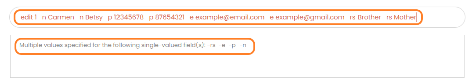
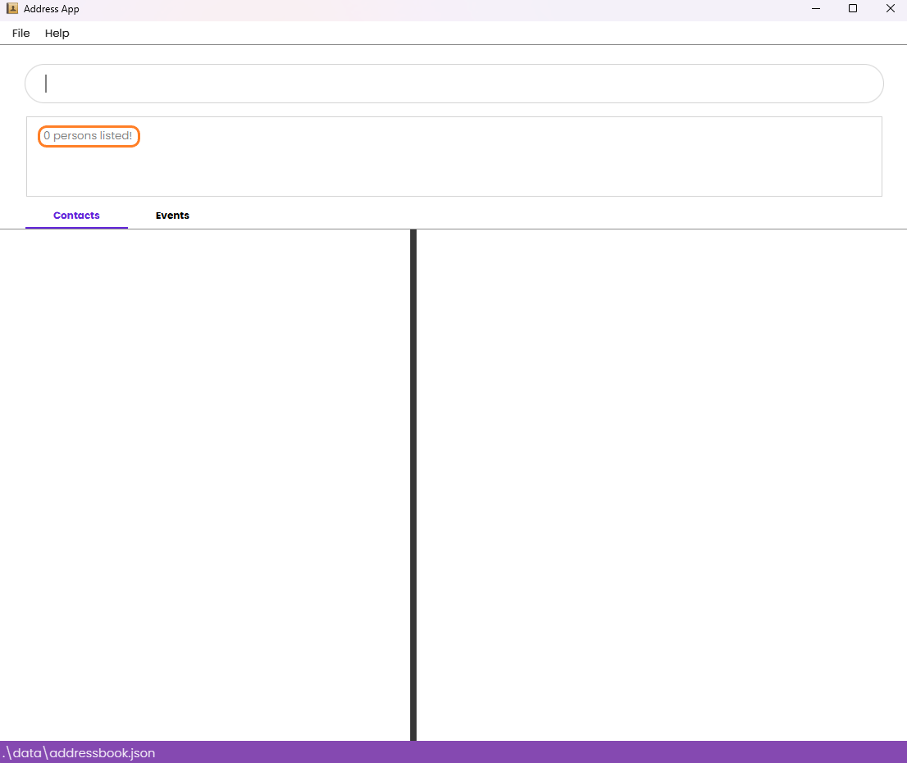

# LegacyLink User Guide


# Welcome to LegacyLink! 👋

LegacyLink is your all-in-one family contact and event management solution, combining the speed of keyboard (CLI, standing for **C**ommand **L**ine **I**nterface) commands with the convenience of a modern interface.


Perfect for managing both small, close-knit families and large extended family networks!
<!-- * Table of Contents -->
<page-nav-print />

### 🎯 Key Features

| Feature Category | What You Can Do |
|-----------------|-----------------|
| 👥 Contact Management | • Store family contact details<br>• Organize by relationships<br>• Quick search and updates |
| 📅 Event Planning | • Schedule family gatherings<br>• Track event attendance<br>• Manage event details |
| ⚡ Smart Interface | • Fast keyboard commands<br>• Visual contact lists<br>• Automatic saving |


--------------------------------------------------------------------------------------------------------------------

<div style="page-break-after: always;"></div>

## 🚀 Quick Start Guide

--------------------------------------------------------------------------------------------------------------------

### 1. System Setup
1. Download and install Java 17 from [the Java downloads page.](https://www.oracle.com/java/technologies/downloads/#java17)
2. To check if Java is correctly installed:
   1. Open your computer's command prompt/terminal
           * **Windows**: Press `Win + R`, type `cmd`, and press Enter
           * **Mac**: Open `Terminal` from Applications
       * Type `java -version` and press Enter
       * You should see a version number 17, something like the image below. <br>
  


### 2. Download LegacyLink

1. Get the latest version (.jar file) from our [releases page](https://github.com/AY2425S1-CS2103T-T10-4/tp/releases).
2. Specifically, look for a file named ``legacylink.jar`` and click on it to download.
3. Save it in a folder where you want to store your LegacyLink data.
   * Ideally, this should be new folder specifically for LegacyLink.

### 3. Launch the Application
1. Get your folder path:
    * Open the file management application (i.e. file explorer for Windows, Finder for MacOS).
    * Navigate to the folder containing the ``jar`` file.
    * Copy the path from the address bar.
2. Open your command prompt/terminal (see instructions above).
3. Navigate to your LegacyLink folder:
    * Type `cd` followed by a space
    * **Windows**: Type your folder path (e.g., `cd C:\Users\YourName\LegacyLink`)
    * **Mac/Linux**: Type your folder path (e.g., `cd /Users/YourName/LegacyLink`)
    * *Pro tip: You can alternatively drag and drop your folder into the terminal after typing ``cd `` (with a space) to automatically fill in the path!*
4. Run LegacyLink by typing: `java -jar legacylink.jar`
5. Pressing enter will open up the LegacyLink window as shown below!

   

### 4. Try These Basic Commands

We've prepopulated LegacyLink with some dummy data for you to play around and get a feel
of how LegacyLink works!
Here are some simple commands to get you started:

```
📋 Essential Commands:
----------------------------------------
list -p     → Show all your contacts
list -e     → Display all events
help        → View all available commands
```

Ready to explore more features? Continue reading our features overview below in the [what can you do with LegacyLink](#-what-can-you-do-with-legacylink) section or
navigate to the [deepdive](#Features-Guide) section, where we break down each command in detail!


--------------------------------------------------------------------------------------------------------------------

<div style="page-break-after: always;"></div>

# 🎯 What Can You Do With LegacyLink?


Our **primary** features include the following:

### 📱 Essential Contact Features
| Feature | Description | Command |
|---------|-------------|----------|
| Add Contacts | Create new family contact entries | `add -n NAME -p PHONE -e EMAIL -rs RELATIONSHIP` |
| View Contacts | See your full contact list | `list -p` |
| Search | Find specific family members | `find KEYWORD` |

### 🎉 Event Management
| Feature         | Description | Command |
|-----------------|-------------|----------|
| Schedule Events | Create family gatherings | `event -n NAME -sd DATE -ed DATE -l LOCATION` |
| Add Attendees   | Include family members in events | `event ... -a ATTENDEES` |
| View Events     | See all scheduled events | `list -e` |

### ✏️ Update & Modify
Keep your information current with these features:

* **Contact Updates**
    * Edit contact details
    * Update relationships
    * Modify phone numbers/emails

* **Event Changes**
    * Reschedule dates
    * Change locations
    * Update attendee lists
    * Modify event names

### 🗑️ Cleanup & Organization
Manage your data efficiently:

* **Contact Management**
    * Remove single contacts
    * Clear all contacts
    * Organize by relationships

* **Event Cleanup**
    * Cancel individual events
    * Clear all events
    * Remove specific attendees

Refer to the [feature list below](#-features-overview) for detailed information of each command that is available in LegacyLink.


# 📚 Features Overview

## Contents
- [General Commands](#general-commands)
- [Managing Contacts](#managing-contacts)
- [Organizing Events](#organizing-events)


<panel header="Notes about the command format:" type="info" expanded no-close>

> **Using This Guide:**
> * Commands are case-sensitive (`help` works, `Help` doesn't)
> * Words in `UPPER_CASE` are values you provide
> * Parameters can be in any order
    >   * For example, if the command specifies `-n NAME -p PHONE_NUMBER`, `-p PHONE_NUMBER -n NAME` is also acceptable.
> * Extraneous parameters for commands that do not take in parameters (such as `help` and `exit`) will be ignored.<br>
> * If you are using a PDF version of this document, be careful when copying and pasting commands that span multiple lines as space characters surrounding line-breaks may be omitted when copied over to the application.


## General Commands

### Get Help 💡
**Format:**
```
help
```
* Shows a message (pictured below) with the link to access this user guide.
* Use anytime you need assistance.


### Save Your Data 💾
* All changes are saved automatically
* No manual saving needed
* Data is stored in your LegacyLink folder

### Exit LegacyLink 👋
**Format:**
```
exit
```
* Closes the application
* All data is automatically saved
> ⚠️ **Warning:** No confirmation message is displayed. 

### Editing The Data File

LegacyLink data are saved automatically as a JSON file `[JAR file location]/data/addressbook.json and [JAR file location]/data/eventbook.json`. Advanced users are welcome to update data directly by editing that data file.

<box type="warning" seamless>

**Caution:**
If your changes to the data file makes its format invalid, LegacyLink will discard all data and start with an empty data file at the next run.  Hence, it is recommended to take a backup of the file before editing it.<br>
Furthermore, certain edits can cause the LegacyLink to behave in unexpected ways (e.g., if a value entered is outside the acceptable range). Therefore, edit the data file only if you are confident that you can update it correctly.

</box>


## Managing Contacts

### View Your Contact List 👥
```
list -p
```
* Shows all your family contacts in one view
* Use this to check contact details or before using other commands


<box type="tip" seamless>

**Tip:** Preceding, trailing and intermediate whitespaces will still result in a successful command.
</box>

### Add a New Contact ➕
**Format:**
```
add -n NAME -p PHONE_NUMBER -e EMAIL -rs RELATIONSHIP
```
* Adds a person to the address book.
* All parameters `NAME`, `PHONE_NUMBER`, `EMAIL`, `RELATIONSHIP` must be present.
* If you want to use special characters such as `d/o` or `s/o` in `name`, please omit the `/` and enter `so` and `do` instead.

<box type="tip" seamless>

**Rules to Remember:**

| Field       | Requirements                                                                                                    |
|-------------|-----------------------------------------------------------------------------------------------------------------|
| Name        | • Letters, numbers, and spaces only<br>• Cannot be blank                                                        |
| Phone       | • 3-15 digits<br>• Alphabetical characters (A-Z, a-z) and special characters (/ - _ ( )) are permitted. <br> • At least one digit is required in the number |
| Email       | • Must be valid email format (example@domain.com)                                                               |
| Relationship| • Letters only<br>• Cannot be blank                                                                             |


**Note:** Names which are very long may not be fully displayed in the detailed person view, as displaying it would
compromise the aesthetic of the User Interface and overall user experience. The person can still be identified through
other information such as their phone number, email, and relationship.

</box>

Valid Example:
```
add -n Betsy Crowe -rs Mother -e betsycrowe@example.com -p 98262123
```
* This command adds a person named Betsy Crowe with the phone number 98262123, email betsycrowe@example.com, and the relationship Mother to the address book.


Invalid Example (Invalid Phone Number):
```
add -n Betsy Crowe -rs Mother -e betsycrowe@example.com -p 12
```
* This command will result in the following error message since the phone number must be at least 3 digits long.


Invalid Example (Duplicate Persons):
* Assuming the contact `add -n Betsy Crowe -rs Mother -e betsycrowe@example.com -p 98262123` already exists.
* Typing the following command `add -n Betsy Crowe -rs Mother -e betsycrowe@example.com -p 98262123` will result in a duplicate entry and the person will not be added.
* The following error message will be shown:


  

### Edit a Contact 📝

**Format:**
```
edit INDEX [-n NAME] [-p PHONE] [-e EMAIL] [-rs RELATIONSHIP]
```
* Edits an existing person in the address book.


<box type="tip" seamless>

**Tips:**
* Edits the person at the specified `INDEX`. The index refers to the index number shown in the displayed person list. The index **must be a positive integer** 1, 2, 3, …​
* At least one of the optional fields must be provided.
* Each of the optional fields can only be specified at most once. <br>
  e.g. `edit 1 -n Carmen -n Betsy` is an invalid command.
* Existing values will be updated to the input values.
* If you want to use special characters such as `d/o` or `s/o` in `name`, please omit the `/` and enter `so` and `do` instead.
  
</box>


Valid Example (One field edited):
* `edit 2 -n Betsy Crower` Edits the name of the 2nd person to be `Betsy Crower`.
* Note: this assumes that the address book contains at least 1 person.


Valid Example (Multiple fields edited):
*  `edit 1 -p 91234567 -e johndoe@example.com -rs Father` Edits the phone number, email and relationship of the 1st person to be `91234567`, `johndoe@example.com` and `Father` respectively.


Invalid Example:
* `edit 1` 
* This command will result in the following error message since at least one of the optional fields must be provided.


Invalid Example (Multiple parameters:
* `edit 1 -n Carmen -n Betsy -p 12345678 -p 87654321 -e example@email.com -e example@gmail.com -rs Brother -rs Mother`
* This command will result in the following error message since each value should be edited at most once.


Invalid Example (Duplicate Persons):
* Assuming the contact `add -n Betsy Crowe -rs Mother -e betsycrowe@example.com -p 98262123` exists as the first contact.
* Attempting to edit another contact: <br> e.g. `edit 2 -n Betsy Crowe -rs Mother -e betsycrowe@example.com -p 98262123` will result in a duplicate entry and the person will not be edited.
* The following error message will be shown:
  


### Find Contacts By Name 🔍

Finds persons whose names contain any of the given keywords.

**Format:**
```
find KEYWORD [MORE_KEYWORDS]
```

<box type="tip" seamless>

**Tip:**
* The search is case-insensitive. e.g `hans` will match `Hans`
* The order of the keywords does not matter. e.g. `Hans Bo` will match `Bo Hans`
* Only the name is searched.
* Only full words will be matched e.g. `Han` will not match `Hans`
* Persons matching at least one keyword will be returned (i.e. `OR` search).
  e.g. `Hans Bo` will return `Hans Gruber`, `Bo Yang`
* If no person is found, none of the contacts will be displayed and `0 Persons Listed` is shown to the user.
* You are recommended to execute `list -p` after `find` command to restore the original list.
</box>

Valid Example (Found 1 person):
* `find John` returns anyone with `John` as part of their name


Valid Example (Found multiple person):
* `find Alex David` returns anyone with `Alex` OR `David` as part of their name<br>


Valid Example (Found no person)
* `find Magnus` 
* Note: since there are no `Magnus` in the contact, 0 person is listed.


### Delete a Contact ❌

**Format:** 
```
delete INDEX
```
* Deletes the person at the specified `INDEX`.
* The index refers to the index number shown in the displayed person list.
* The index **must be a positive integer** 1, 2, 3, …​

<box type="warning" seamless>

> ⚠️ **Warning:** This action cannot be undone, no confirmation message is displayed! You will have to use `add` command to add the contact again. 
</box>

Valid Example:
* `list -p` followed by `delete 1` deletes the 1st person in the address book.


Valid Example:
* `find Charlotte` followed by `delete 1` deletes the 1st person in the results of the `find` command.
* Assumes that only 1 person named `Charlotte` is found by the `find` command.


### Clearing All Contacts ❌❌
**Format:**
```
clear -p
```

Clears all persons from the address book.

<box type="warning" seamless>

> ⚠️ **Warning:** This action cannot be undone, no confirmation message is displayed! You will have to use `add` commands to add all the contacts again.
</box>


## Organizing Events

### View All Events 📅

**Format:**
```
list -e
```
* Shows a list of all events in the event book.

<box type="tip" seamless>

**Tip:** Preceding, trailing and intermediate whitespaces will still result in a successful command.
</box>


### Create New Event 🎉

**Format:**
```
event -n EVENT_NAME -sd EVENT_START_DATE -ed EVENT_END_DATE -l LOCATION [-a ATTENDEES]
```
* Adds an event to the event book.
* Dates are in (yyyy-mm-dd) format.


<box type="tip" seamless>

**Tip:** 
* All parameters `EVENT_NAME`, `EVENT_START_DATE`, `EVENT_END_DATE`, `LOCATION` must be present but `ATTENDEES` is optional.
* The optional field `-a` can only be specified at most once.
* Indexes supplied to the `ATTENDEES` parameter must be based on existing contacts indexing in the Address Book.
Note that the indexes are separated by **spaces**.
</box>

Valid Example:
* `event -n Get Together Party -sd 2023-10-25 -ed 2023-10-27 -l MBS`. <br> 
Adds a "Get together party" event to the event book.


* `event -n Birthday Party -sd 2023-10-15 -ed 2023-10-15 -l Home -a 1 2 3`. <br> 
Creates the birthday party event and adds the first 3 people in the contacts book to the event.


Invalid Example:
* `event -n Birthday Party -sd 2023-10-15 -ed 2023-10-15 -l Home -a 1, 2, 3`
* This command will result in the following error message since the list of indexes must be separated by whitespaces, not anything else like commas.


Invalid Example:
* `event -n New Year's Party -sd 2025-01-01 -ed 2025-01-02 -l Times Square -a 1 2 -a 4 5`
* This command will result in the following error message since the optional field `-a` is specified more than once.


### Update Event Details ✏️

**Format:** 
```
update -i INDEX [-n NEW_NAME] [-sd NEW_START_DATE] [-ed NEW_END_DATE] [-l NEW_LOCATION] [-a NEW_ATTENDEES_INDICES] [-r REMOVED_ATTENDEES_INDICES]
```

* Updates the details of an existing event in the address book.
**Note:** Dates are in (yyyy-mm-dd) format.

<box type="tip" seamless>

**Tip:** 
* The initial `INDEX` parameter is required, while the rest of the parameters are optional. The `-r` flag allows you to
remove attendees from an event, and can be used together with the `-a` flag. If you add and remove the same index, the result
will be adding the person first, then removing them, i.e. they will not be present in the attendee list after the command executes.
* Indexes supplied to the `NEW_ATTENDEES_INDICIES`  and `REMOVED_ATTENDEES INDICES` parameters must be based on existing contacts indexing in the Address Book.
* Note that the indexes are separated by **spaces**.
* Each of the optional fields can only be specified at most once. <br>
e.g. `update -i 1 -n Birthday Party -n Dinner Party -a 1 -a 2` is an invalid command.
</box>

Valid Example (One field updated):
* `update -i 1 -l NUS UTown` only updates the location of the first event to `NUS UTown`.


Valid Example (Multiple field updated):
* `update -i 3 -n New Year's Party -sd 2025-01-01 -ed 2025-01-02 -l Marine Parade Road #12-34 -r 3 6` updates the 3rd event, reflecting all the provided details.


Invalid Example:
* `update -i 3 -n New Year's Party -n Christmas Celebration -a 1 2 -a 4 5`
* This command will result in the following error message since the optional fields `-n` and `-a` are specified more than once.


### Clear All Data 🗑️

**Format:**
```
clear -e`
```
* Clears all events from the event book.
> ⚠️ **Warning:** No confirmation message is displayed. This action is irreversible, you will have to use `event` command to add all the events again.


--------------------------------------------------------------------------------------------------------------------

## FAQ

**Q**: How do I transfer my data to another Computer?<br>
**A**: Install the app in the other computer and overwrite the empty data file it creates with the file that contains the data of your previous LegacyLink home folder.

--------------------------------------------------------------------------------------------------------------------

## Known issues

1. **When using multiple screens**, if you move the application to a secondary screen, and later switch to using only the primary screen, the GUI will open off-screen. The remedy is to delete the `preferences.json` file created by the application before running the application again.
2. **If you minimize the Help Window** and then run the `help` command (or use the `Help` menu, or the keyboard shortcut `F1`) again, the original Help Window will remain minimized, and no new Help Window will appear. The remedy is to manually restore the minimized Help Window.
3. **When creating 2 or more events that have the same name, start date, end date, and location**, it is possible for these events to have attendees which are subsets for each other, but not equal to each other. The remedy is to implement a more sophisticated duplicate event detection system to enhance user experience in the future.
4. **Incorrect error message for invalid index in `edit` command**. Currently, the error message for invalid index such as `-1` (negative numbers), `0` and integer overflow is an invalid command instead of an index out of bounds. This is a known issue and will be addressed in an upcoming update to ensure that users receive more accurate and specific error messages when encountering invalid index values.
5. **Truncation of text in the GUI**, fields with lengthy text, such as long names and address, can sometimes be truncated in the GUI. To avoid this, you can adjust the size of the window by dragging the sides to enlarge the window.

--------------------------------------------------------------------------------------------------------------------

## Command summary

Action     | Format, Examples
-----------|----------------------------------------------------------------------------------------------------------------------------------------------------------------------
**List Persons**   | `list -p`
**Add Person**    | `add -n NAME -p PHONE_NUMBER -e EMAIL -rs RELATIONSHIP` <br> e.g., `add -n James Ho -p 22224444 -e jamesho@example.com -rs Brother`
**Delete Person** | `delete INDEX`<br> e.g., `delete 3`
**Edit Person**   | `edit INDEX [-n NAME] [-p PHONE_NUMBER] [-e EMAIL] [-rs RELATIONSHIP]`<br> e.g.,`edit 2 -n James Lee -e jameslee@example.com`
**Find Person**   | `find KEYWORD [MORE_KEYWORDS]`<br> e.g., `find James Jake`
**Clear Person Book**  | `clear -p`
**Add Event**     | `event -n EVENT_NAME -sd EVENT_START_DATE -ed EVENT_END_DATE -l LOCATION -a ATTENDEES` <br> e.g., `event -n Birthday Party -sd 2023-10-15 -ed 2023-10-15 -l Home -a 1 2 3`
**Cancel Event**  | `cancel INDEX` <br> e.g., `cancel 1`
**Edit Event**     | `update -i INDEX [-n NEW_NAME] [-sd NEW_START_DATE] [-ed NEW_END_DATE] [-l NEW_LOCATION] [-a NEW_ATTENDEES_INDICES] [-r REMOVED_ATTENDEES_INDICES`] <br> e.g., `update -i 3 -n New Year's Party -sd 2025-01-01 -ed 2025-01-02 -a 1 2 4 5 -r 3 6`
**List Events**   | `list -e`
**Clear Events**  | `clear -e`
**Help**   | `help`
**Exit**   | `exit`
