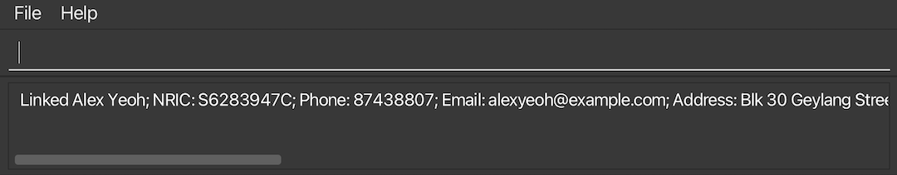
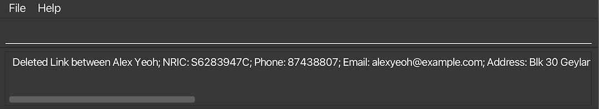
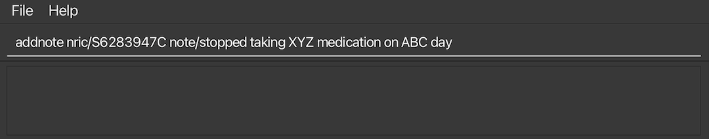
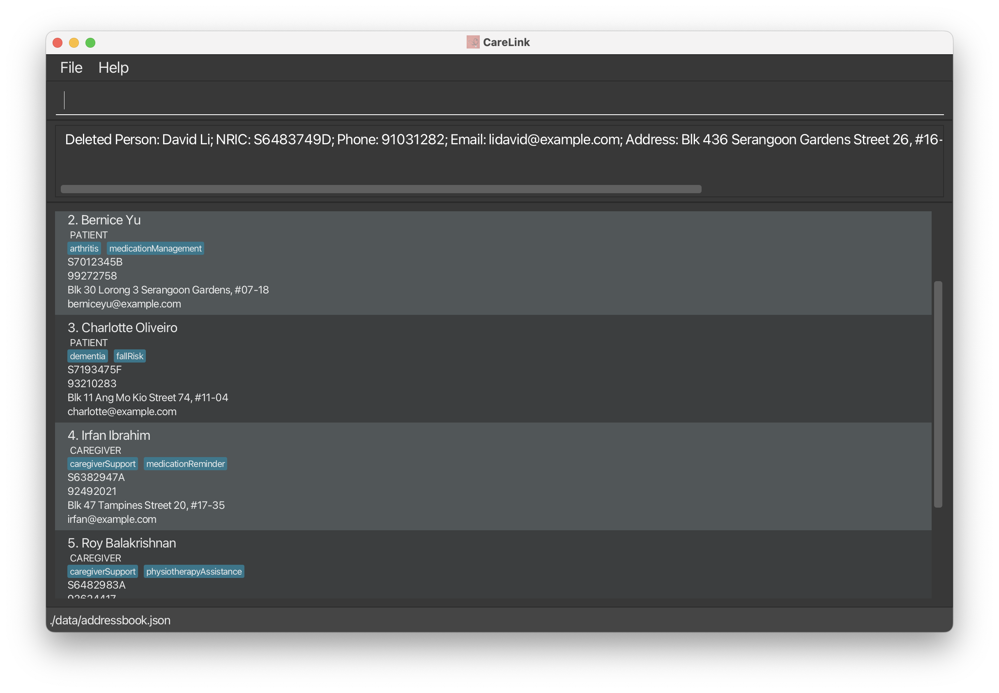
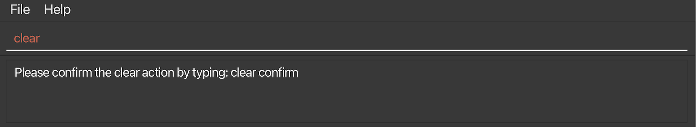

- Table of Contents
  {:toc}

## Introduction

Welcome to CareLink, your comprehensive patient management solution. CareLink is a Command Line Interface (CLI) application with a Graphical User Interface (GUI) that helps independent geriatricians streamline patient care management, appointment scheduling, and caregiver coordination

### What is CareLink?

CareLink simplifies healthcare management through its four core capabilities:

- Enables efficient tracking of patient information
- Seamless caregiver coordination
- Smart appointment scheduling
- Comprehensive medical note management

### Key Features

- **Patient Management**

  - Store and update patient records
  - Track medical histories
  - Search patient information
  - Manage patient-caregiver relationships

- **Appointment System**

  - Schedule and track appointments
  - Manage scheduling conflicts
  - Set appointment reminders
  - Monitor appointment status

- **Caregiver Coordination**

  - Link patients with caregivers
  - Maintain caregiver contact information
  - Track caregiver assignments
  - Enable efficient communication

- **Data Organization**
  - Secure data storage
  - Quick information retrieval
  - Automated backups
  - Advanced search capabilities

### Who is CareLink For?

CareLink is designed specifically for independent geriatricians who:

- Manage multiple elderly patients with chronic conditions
- Need to coordinate with caregivers
- Require efficient appointment scheduling
- Want to track patient histories and medical notes

### How This Guide Helps You

This user guide will walk you through:

1. Setting up CareLink
2. Managing patients and caregivers
3. Scheduling appointments
4. Recording medical notes
5. Using advanced features

For immediate setup, proceed to [Quick Start](#quick-start). For detailed feature information, visit the [Features](#features) section.

## Quick Start

1. Ensure you have Java `17` or above installed on your computer. For optimal display, use a 13-inch screen or larger with a resolution of 1280x720 pixels or higher. Avoid resizing the window below this resolution, as it may hide essential interface elements.

2. Download the latest CareLink `.jar` file from [here](https://github.com/AY2425S1-CS2103T-T13-4/tp/releases).

3. Copy the file to your desired CareLink **home folder**.
4. Open a command terminal, navigate to your home folder, and then run the following command:<br>

```
java -jar carelink.jar
```

When you run this command, the CareLink application window opens with sample data:<br>

_Figure 1: CareLink main window with sample data_

5. Type commands in the command box and press Enter to execute them. Try these basic commands:

- Display all records in CareLink:<br>

  ```
  list
  ```

- Add a new record:<br>

  ```
  add n/John Lee p/91234567 e/johnlee@email.com a/123 Medical Drive nric/S9876543A role/patient
  ```

- View help:<br>

  ```
  help
  ```

- Exit CareLink:<br>
  ```
  exit
  ```

For detailed instructions on all commands, proceed to the [Features](#features) section.

> **Tip:** Type `help` at any time to view the command guide.

## Common Commands Our Users Love

- [**Add a New Record**](#adding-a-person-add): Quickly add a patient or caregiver to the system.

- [**Schedule an Appointment**](#adding-an-appointment-addapp): Set up an appointment with ease.

- [**Link Patient and Caregiver**](#linking-a-patient-and-a-caregiver-link): Connect a patient with a caregiver for streamlined management.

- [**Find a Record**](#locating-persons-by-name-nric-phone-email-role-or-tags-find): Quickly locate a person or record.

- [**Delete a Record**](#deleting-a-person-delete): Remove a person from the system.

- [**Update Appointment Status**](#updating-status-of-an-appointment-updatestatus): Mark an appointment as completed or pending.

---

## Features

<div markdown="block" class="alert alert-info">

**:information_source: Notes about using commands are in the following format:**<br>

- Words in `UPPER_CASE` represent parameters you will supply.<br>
  e.g. in `add n/NAME`, `NAME` is a parameter which can be used as `add n/John Doe`.

- Items in square brackets are optional.<br>
  e.g `n/NAME [t/TAG]` can be used as `n/John Doe t/friend` or as `n/John Doe`.

- Items with `…`​ after them may appear multiple times, including zero times.<br> e.g. `[t/TAG]…​` means you can add: no tags (i.e. 0 times), one tag (`t/friend`), or multiple tags where each tag must have its own `t/` prefix (`t/friend t/family t/elderly`)

- Parameters can be in any order.<br>
  e.g. if the command specifies `n/NAME p/PHONE_NUMBER`, `p/PHONE_NUMBER n/NAME` is also acceptable.

- Extraneous parameters for commands that do not take in parameters (such as `help`, `list`, `exit` and `clear`) will be ignored.<br>
  e.g. if the command specifies `help 123`, it will be interpreted as `help`.

- If you are using a PDF version of this document, be careful when copying and pasting commands that span multiple lines as space characters surrounding line-breaks may be omitted when copied over to the application.
</div>

### Viewing help : `help`

Shows a message explaining how to access the help page.


Use this format: `help`

### Managing Patients and Caregivers

#### Adding a person: `add`

Use this command to add a person to the address book.

Use this format: `add n/NAME nric/NRIC p/PHONE_NUMBER e/EMAIL a/ADDRESS role/ROLE [t/TAG]…`

The following field constraints apply:

- `NAME`: Must start with an alphanumeric character, followed by alphanumeric characters and spaces
- `PHONE`: Must contain only numbers and be at least 3 digits long
- `EMAIL`: Must be of the format local-part@domain where:
  1. Local-part can contain alphanumeric characters and these special characters: + \_ . -
  2. Local-part cannot start or end with special characters
  3. Domain must:
     - End with a domain label at least 2 characters long
     - Have domain labels that start and end with alphanumeric characters
     - Have domain labels with alphanumeric characters, separated only by hyphens
- `ADDRESS`: Must not start with a whitespace and cannot be blank
- `ROLE`: Must be either 'PATIENT' or 'CAREGIVER'
- `NRIC`: NRIC constraints are in NRIC constraints section

**Each person must have the role of patient, caregiver, or both**

<div markdown="span" class="alert alert-primary">:bulb: **Tip:**
You can multiple people to share the same email address, making it easier for caregivers to manage emails on behalf of several patients
</div>

<div markdown="span" class="alert alert-primary">:bulb: **Tip:**
A person can have any number of tags (including 0)
</div>

<div markdown="span" class="alert alert-warning"> **:warning: Important:** Currently, the `NAME` field does not support hyphens. Only letters, numbers, and spaces are allowed. We recommend entering names without hyphens to avoid errors or replacing them with an acceptable alternative such as a space should you wish to do so</div>

Examples:

- `add n/John Doe nric/S8484131E p/98765432 e/johnd@example.com a/311, Clementi Ave 2, #02-25 t/backPain t/diabetic role/patient`

Here’s how to add a patient to the address book.

_Figure 2: Example of using the `add` command to add a patient to CareLink_

When the command succeeds, you’ll see the following message confirming that the person has been added to the address book

_Figure 3: Success message displayed after adding a patient_

Possible Errors:

- `This person already exists in the address book` - Displayed when trying to add a person with an NRIC that already exists
- `Roles should only be 'PATIENT' or 'CAREGIVER'` - When an invalid role is provided

- `Missing required field:` - Displayed when any required field is not provided (name, NRIC, phone, email, address, or role)

#### Linking a patient and a caregiver: `link`

Use this command to link a patient to a caregiver in CareLink

Use this format: `link patient/PATIENT_NRIC caregiver/CAREGIVER_NRIC`

Examples:

- `link patient/S6283947C caregiver/S6382947A`
- `link caregiver/S6382947A patient/S7193475F`

The example below demonstrates how to use CareLink to link a patient and a caregiver

_Figure 4: Example of using the `link` command to link a patient with a caregiver_

When the command succeeds, the patient will be linked with the caregiver and the following message will be displayed.

_Figure 5: Success message displayed after linking a patient with a caregiver_

Possible Errors:

- `This link already exists in CareLink` - When attempting to create a link that already exists
- `Cannot link same people` - When trying to link a person to themselves
- `Incorrect NRIC. Caregiver and Patient not found` - When both NRICs cannot be found in CareLink
- `Incorrect NRIC. Patient not found` - When the patient's NRIC cannot be found
- `Incorrect NRIC. Caregiver not found` - When the caregiver's NRIC cannot be found
- `Incorrect roles. The patient NRIC must correspond to a patient, and the caregiver NRIC must correspond to a caregiver.` - When the roles don't match the specified NRICs

#### Deleting a link between patient and a caregiver: `deletelink`

Use this command to remove a link between a patient and caregiver in CareLink

Use this format: `deletelink patient/PATIENT_NRIC caregiver/CAREGIVER_NRIC`

Examples:

- `deletelink patient/S6283947C caregiver/S6382947A`
- `deletelink caregiver/S6382947A patient/S7193475F`

The example below demonstrates how to use CareLink to delete a link between a patient and a caregiver.

_Figure 6: Example of using the `deletelink` command to remove a link between a patient and a caregiver_

When the command succeeds, you see a message confirming the link was removed

_Figure 7: Success message displayed after deleting a link between a patient and a caregiver_

#### Adding Notes to a Person: `addnote`

Use this command to add notes to an existing person in CareLink.

Use this format: `addnote nric/NRIC note/NOTES`

Examples:

- `addnote nric/S6283947C note/stopped taking XYZ medication on ABC day`
- `addnote nric/S7012345B note/is caregiver for patient XYZ only until ABC day`

<div class="alert alert-warning">
<i>:warning:</i> <b>Warning:</b> CareLink does not check for duplicate notes. Please verify existing notes before adding new ones to avoid redundant medical information.
</div>

<div markdown="span" class="alert alert-primary">:bulb: **Tip:**
To view all notes for a person, use the `find` command with their NRIC or name. Notes are shown only in the search results to keep the main display clean and focused.
</div>

The example below shows how to add notes to a person using CareLink.

_Figure 8: Example of using the `addnote` command to add a note to a patient's record_

When the command succeeds, the notes will be added to the person and the following message will be displayed.

_Figure 9: Success message displayed after adding a note to a patient's record_

Possible Errors:

- `Person not found` - When the person's NRIC entered cannot be found in the system

#### Listing all persons : `list`

Use this command to display a list of all persons in Care Link App.

Use this format: `list`

#### Editing a person : `edit`

Use this command to edit an existing person in the address book.

Use this format: `edit NRIC [n/NAME] [p/PHONE] [e/EMAIL] [a/ADDRESS] [t/TAG]…​`

- Edits the person with the specified `NRIC`. The `NRIC` must be a valid Singapore National Identification Card Number.
- At least one of the optional fields must be provided.
- Existing values will be updated to the input values.
- When editing tags, the existing tags of the person will be removed i.e adding of tags is not cumulative.
- You can remove all the person’s tags by typing `t/` without
  specifying any tags after it.

Examples:

- `edit S1234567D p/91234567 e/johndoe@example.com` Edits the phone number and email address of the person with `S1234567D` to be `91234567` and `johndoe@example.com` respectively.
- `edit S6483749D n/Betsy Crower t/` Edits the person with NRIC `S6483749D` to be `Betsy Crower` and clears all existing tags.

Possible Errors:

- `Incorrect NRIC. Person not found` - When the specified NRIC doesn't exist in CareLink
- `At least one field to edit must be provided.` - When no fields to edit are specified
- `This person already exists in the address book.` - When editing would result in a duplicate person

#### Locating persons by name, NRIC, phone, email, role, or tags: `find`

Use this command to find persons based on specified criteria and prefixes.

<div class="alert alert-warning">
<i>:warning:</i> <b>Warning:</b> All search parameters (NRIC, phone, email, role) must exactly match the stored data, except for name which allows partial matches. For example:
- NRIC 'S1234567D' will match 'S1234567D' only
- Phone '91234567' will match '91234567' only
- Name 'John' will match 'John Doe', 'Johnny'
- The NRIC must be a valid Singapore NRIC that follows the official format ('S/T' for citizens/PRs, 'F/G' for foreigners, followed by 7 digits and a checksum letter)

</div>

#### Deleting a person : `delete`

**Use this command to delete the specified person from CareLink.**

Use this format: `delete NRIC`

- Deletes the person with the specified `NRIC`.
- The NRIC **must be a valid Singapore National ID** (eg. S1234567D)​

Examples:

- `find n/David` returns `David LI` with NRIC `S6483749D`
- `delete S6483749D` deletes the person with the NRIC `S6483749D` in the address book.

The example below of using the delete command in CareLink appears below.
Notice the NRIC used in the example belongs to `David LI`.

_Figure 13: Example of using the `delete` command to remove a person from CareLink_

When the command succeeds, notice that David is removed and hence no longer displayed.

_Figure 14: Display after a successful delete command, showing the removed person is no longer listed_

**Possible Errors:**

- `The patient NRIC provided is not found` - When the specified NRIC does not exist in CareLink

**Format**: `find [n/NAME] [nric/NRIC] [p/PHONE] [e/EMAIL] [role/ROLE] [t/TAG]…​`

- The search is case-insensitive. e.g `n/alex` will match `Alex`.
- The order of the prefixes and keywords does not matter. e.g `n/Alex nric/S1234567D` is equivalent to `nric/S1234567D n/Alex`.
- Persons matching any of the provided criteria will be returned (i.e., `OR` search). For example, `n/Alex t/friend` will return persons whose name contains "Alex" or have the tag "friend".

##### Prefixes:

- `n/NAME`: Searches by name.
- `nric/NRIC`: Searches by Singapore National ID.
- `role/ROLE`: Searches by role (e.g `role/patient` or `role/caregiver`).
- `t/TAG`: Searches by tag (e.g `t/friend`, `t/family`).
- `p/PHONE`: Searches by phone number.
- `e/EMAIL`: Searches by email address.
- `role/ROLE`: Searches by role (e.g `role/patient` or `role/caregiver`).

##### Examples:

- `find n/John` returns `John`, `John Doe`.
- `find n/Alex nric/S1234567D` returns persons whose name contains `Alex` or with NRIC `S1234567D`.
- `find role/patient t/friend` returns all patients or persons with the tag `friend`.
- `find role/caregiver` returns all caregivers.
- `find p/1234567 e/johndoe@example.com` returns persons with phone number `1234567` or email address `johndoe@example.com`.

<div markdown="span" class="alert alert-primary">:bulb: **Tip:**
To navigate through multiple results more efficiently, try using the `Tab` key twice, followed by the `Up` and `Down` arrow keys to cycle through options. This eliminates the need for scrolling or using the mouse.
</div>

The example below of using the find command in CareLink appears below.

_Figure 10: Example of using the `find` command to locate a person in CareLink_

When the command succeeds, the persons found will be displayed providing comprehensive information about the persons.

_Figure 11: List of persons displayed after using the `find` command with specified criteria_

Possible Errors:

- `Invalid command format! `
  find: Finds all persons based on the specified criteria and displays them as a list with index numbers. Search is case-insensitive.
  Parameters: [n/NAME] [nric/NRIC] [role/ROLE] [t/TAG]...
  At least one parameter must be provided. You do not need to include all parameters.

### Managing Appointments

#### Adding an appointment: `addapp`

**Use this command to add an appointment for a person in CareLink.**

Use this format: `addapp nric/NRIC d/DATE start/START_TIME end/END_TIME`

- The `NRIC` must belong to a person already in CareLink
- `DATE` Use the format DD/MM/YYYY (e.g. 01/01/2025)
- `START_TIME` and `END_TIME` must be in 24-hour format HH:MM (e.g 14:30)
- Ensure that the appointment meets the following criteria:
  - Start time must be before end time
  - Appointment must be in the future
  - Must not overlap with existing appointments
- The default status of an appointment when added is PENDING. See the [`updatestatus` command](#updating-status-of-an-appointment-updatestatus) to know more.

**Examples:**

- `addapp nric/S1234567D d/01/01/2025 start/10:00 end/11:00` Use this command to add a one-hour appointment on January 1st, 2025
- `addapp nric/S9876543B d/15/03/2025 start/14:30 end/16:00` Use this command to add a 90-minute appointment on March 15th, 2025

<div class="alert alert-warning">
<i>:warning:</i> <b>Warning:</b> CareLink is designed for independent geriatricians' office hours. All appointments must start and end on the same day.
</div>
<div markdown="span" class="alert alert-primary">:bulb: **Tip:**
You’ll see appointment start and end times displayed in a format that includes a ‘T’ between the date and time (e.g., `2025-01-01T10:00`). This "T" serves as a separator and is part of the standard ISO 8601 date-time format, which ensures consistency across systems.
</div>
<div markdown="span" class="alert alert-warning">:warning: **Warning:**
When using the `addapp` command, ensure that the minutes in the start and end times do not exceed `:59`. For example, a valid time format is `10:30`, not `10:60`.
</div>

**Common errors and their meanings:**

- `Incorrect NRIC. Person not found` - Check that the NRIC exists in CareLink
- `Invalid date` - Make sure to use DD/MM/YYYY format (e.g 01/01/2025)
- `Invalid time` - Make sure to use HH:MM format in 24-hour time (e.g 14:30)
- `Start time must be before end time` - Check your appointment times
- `Start time must be in the future` - Can't schedule appointments in the past
- `An appointment already exists at this date and time` - The person or another person already has an appointment that overlaps with this time slot
- `Please do not enter anything before the keywords` - Do not add anything between the command word `addapp`. The keywords here refer to the parameters

#### Editing an appointment: `editapp`

**Use this command to edit an existing appointment for a person in CareLink**

Use this format: `editapp nric/NRIC d/DATE start/START_TIME [newd/DATE] [newstart/START_TIME] [newend/END_TIME]`

**Constraints**

- The `NRIC` must belong to a person already in CareLink
- `DATE` Use the format DD/MM/YYYY (e.g 01/01/2025)
- `START_TIME` and `END_TIME` must be in 24-hour format HH:MM (e.g 14:30)
  The edited appointment follows the same rules as add appointment:
  - Start time must be before end time
  - Appointment must be in the future
  - Must not overlap with existing appointments

**Examples:**

- `editapp nric/S1234567D d/01/01/2025 start/10:00 end/11:00 newd/02/01/2025` changes the appointment date, timings remain the same
- `editapp nric/S1234567D d/02/01/2025 start/10:00 end/11:00 newstart/08:00  newend/09:00` Shifts the appointment timing forward, appointment remains on the same day.

**Common errors and their meanings:**

- `Incorrect NRIC. Person not found` - Check that the NRIC exists in CareLink
- `This appointment does not exist in CareLink` - The specified appointment cannot be found
- `At least one field to edit must be provided.` - You must specify at least one field to change
- `Invalid date` - Make sure to use DD/MM/YYYY format (e.g 01/01/2025)
- `Invalid time` - Make sure to use HH:MM format in 24-hour time (e.g 14:30)
- `Start time must be before end time` - Check your edited appointment times
- `Start time must be in the future` - Can't schedule appointments in the past
- `An appointment already exists at this date and time` - The person or another person already has an appointment that overlaps with this time slot
- `Please do not enter anything before the keywords` - Do not add anything between the command word `editapp`. The keywords here refer to the parameters

#### Updating Status of an appointment: `updatestatus`

**Updates the status of an existing appointment. The status can be `PENDING` or `COMPLETED`.**

Use this format: `updatestatus nric/NRIC d/DATE start/START_TIME status/STATUS`

- The `NRIC` must belong to a person with an existing appointment
- `DATE` Use the format DD/MM/YYYY (e.g 01/01/2025)
- `START_TIME` must be in 24-hour format HH:MM (e.g 14:30)
- The `STATUS` must be either `PENDING` or `COMPLETED`. It is case insensitive.
- The appointment must exist at the specified date and time for the person

**Examples:**

- `updatestatus nric/S1234567D d/01/01/2025 start/10:00 status/completed` updates the status to completed for the appointment on January 1st, 2025 at 10:00
- `updatestatus nric/S1234567D d/01/01/2025 start/10:00 status/pending` updates the status to pending for the appointment on January 1st, 2025 at 10:00

<div markdown="span" class="alert alert-primary">:bulb: **Tip:**
To change the status of an appointment, you only need the start time. The end time is not required since CareLink can identify the appointment uniquely by the person, date, and start time.
</div>

**Common errors and their meanings:**

- `Incorrect NRIC. Person not found` - Check that the NRIC exists in CareLink
- `Invalid date` - Make sure to use DD/MM/YYYY format (e.g. 01/01/2025)
- `Invalid time` - Make sure to use HH:MM format in 24-hour time (e.g. 14:30)
- `This appointment does not exist in CareLink` - There is no appointment at the specified date and time for this person
- `Status should only be 'COMPLETED' or 'PENDING'` - The status can only take in 2 options, completed or pending.
- `Please do not enter anything before the keywords` - Do not add anything between the command word `updatestatus`. The keywords here refer to the parameters

#### Deleting an appointment: `deleteapp`

**Deletes an existing appointment for a person in CareLink.**

Use this format: `deleteapp nric/NRIC d/DATE start/START_TIME`

- The `NRIC` must belong to a person with an existing appointment
- `DATE` Use the format DD/MM/YYYY (e.g 01/01/2025)
- `START_TIME` must be in 24-hour format HH:MM (e.g 14:30)
- The appointment must exist at the specified date and time for the person

Examples:

- `deleteapp nric/S1234567D d/01/01/2025 start/10:00` deletes the appointment on January 1st, 2025 at 10:00
- `deleteapp nric/S9876543B d/15/03/2025 start/14:30` deletes the appointment on March 15th, 2025 at 14:30

<div markdown="span" class="alert alert-primary">:bulb: **Tip:**
To delete an appointment, you only need the start time. The end time is not required since CareLink can identify the appointment uniquely by the person, date, and start time.
</div>

**Common errors and their meanings:**

- `Incorrect NRIC. Person not found` - Check that the NRIC exists in CareLink
- `Invalid date` - Make sure to use DD/MM/YYYY format (e.g. 01/01/2025)
- `Invalid time` - Make sure to use HH:MM format in 24-hour time (e.g. 14:30)
- `This appointment does not exist in CareLink` - There is no appointment at the specified date and time for this person
- `Please do not enter anything before the keywords` - Do not add anything between the command word `deleteapp`. The keywords here refer to the parameters

#### Locating appointments by date-time range: `findapp`

**Finds and lists appointment that falls within the specified date-time range**. The command displays detailed information about the appointments such as the patient's name, phone, email, NRIC, caregivers, tags, and the appointment's start and end dates and times.

**Format**: `findapp sdate/START_DATE start/START_TIME edate/END_DATE end/END_TIME​`

- `sdate/01/01/2024` sets the search start date to January 1, 2024.
- `start/10:00` sets the search start time to 10:00 AM.
- `edate/30/10/2024` sets the search end date to October 30, 2024.
- `end/12:00` sets the search end time to 12:00 PM.
- `findapp sdate/01/01/2024 start/10:00 edate/30/10/2024 end/12:00` does not list an appointment that starts before 12:00 PM and ends after 12:00 PM on 30/10/2024.
- `findapp sdate/01/01/2024 start/10:00 edate/30/10/2024 end/12:00` does not list an appointment that starts before 10:00 AM and ends after 10:00 PM on 01/01/2024.

##### Examples:

- `findapp sdate/01/01/2024 start/10:00 edate/30/10/2024 end/12:00` finds and lists appointments that starts and ends within the specified date-time range.

<div markdown="span" class="alert alert-primary">:warning: **Note:**
When using date ranges for searching appointments, ensure your end date comes after your start date. For example, searching from 01/01/2024 to 30/12/2024 is valid, but searching from 01/01/2025 to 30/10/2024 will always return 0 results since no appointments can exist in an impossible time range.
</div>

The example below of the result obtained from the `findapp` command appears below.

_Figure 12: Example of using the `findapp` command to locate appointments within a specific date-time range_

**Possible Errors:**

- `Invalid date. Please use the DD/MM/YYYY format` - When the date format is incorrect
- `Invalid time. Please use the HH:MM format` - When the time format is incorrect

### Other important commands

#### Clearing all entries: `clear` `confirm`

**Clears all entries from the address book after receiving confirmation.**

**Warning**: This command will permanently delete all entries from the address book. Ensure that you want to proceed before executing this command.

**Format**: `clear` `confirm`

- You must type `confirm` explicitly to execute this command. Any other input will not clear the address book.

**Example**:

- `clear confirm` clears all entries from the address book.
  
  _Figure 15: Example of using the `clear confirm` command to clear all entries in CareLink_

- `clear` without `confirm` will prompt the user to include the confirmation keyword.
  
  _Figure 16: Display prompt for using `clear` command without `confirm`, reminding user to include confirmation_

#### Exiting the program : `exit`

**Exits the program.**

Use this format: `exit`

### About your data

#### Saving the data

CareLink automatically saves data to the hard disk after every command that changes it, so you don’t need to save manually.

#### Editing the data file

CareLink saves data automatically as a JSON file located at `[JAR file location]/data/addressbook.json`. Advanced users are welcome to update data directly by editing that data file.

<div markdown="span" class="alert alert-warning">:exclamation: **Caution:**
If your changes to the data file makes its format invalid, CareLink will discard all data and start with an empty data file at the next run. Hence, it is recommended to take a backup of the file before editing it.<br>
Furthermore, certain edits can cause the AddressBook to behave in unexpected ways (e.g if a value entered is outside of the acceptable range). Therefore, edit the data file only if you are confident that you can update it correctly.
</div>

---

## FAQ and other important information

**Q**: How do I transfer my data to another Computer?<br>
**A**: Install the app in the other computer and overwrite the empty data file it creates with the file that contains the data of your previous AddressBook home folder.

### Valid NRIC rules

AMake sure each NRIC adheres to the following format and constraints:

1. The NRIC must be 9 characters long.
2. The first character must be one of the following letters: 'S', 'T', 'F', or 'G'. (case-insensitive)

- 'S' and 'T' are for Singapore Citizens and Permanent Residents.
- 'F' and 'G' are for Foreigners.

3. The next 7 characters must be digits.
4. The last character must be an uppercase letter, which serves as a checksum to validate the NRIC.
5. The checksum is computed based on a specific algorithm using the 7 digits of the NRIC.

---

## Known Issues

1. **Multiple Monitor Setup**: The GUI may open off-screen when switching from multi-monitor to single-monitor setup.

   - **Solution**: Delete `preferences.json` and restart the application.

2. **Help Window**: After minimizing the Help Window, using the `help` command, `Help` menu, or `F1` shortcut will not open a new window.

   - **Solution**: Manually restore the minimized Help Window.

3. **Resized Window Visibility**: Reducing the window size below a certain threshold can obscure interface elements, impacting usability.

   - **Solution**: For optimal use, we recommend a screen resolution of at least 1280x720 pixels and maintaining a minimum window size for clarity.

4. **Long Tag Handling**: When adding an excessively long tag, it may hide other tags in the display rather than wrapping or truncating.

   - **Solution**: Avoid using overly long tags. Optimally, long tags should truncate with an ellipsis (`...`) once they reach the edge of the GUI.

5. **Phone Number Field Length**: The phone number field allows for very long entries, which may not be practical. The field currently accepts a minimum of 3 digits, which is shorter than standard international phone numbers.

   - **Workaround**: For best results, enter phone numbers within a typical range of 7–15 digits. Numbers exceeding 15 digits may not display or function as expected.

6. **Full-Screen Help Window**: When the app is in full-screen mode, clicking the help button opens the Help Window in a new full-screen view rather than as a pop-up overlay.

   - **Solution**: Exit full-screen mode before opening the Help Window to have it display as a pop-up.

7. **Inconsistent NRIC Censorship in Success Messages**: In some success messages, the NRIC appears fully displayed, while in others, it is censored

   - **Impact**: This inconsistency is purely visual and does not affect system functionality or data integrity.

---

## Complete Command summary

| Action                 | Format, Examples                                                                                                                                                                                                |
| ---------------------- | --------------------------------------------------------------------------------------------------------------------------------------------------------------------------------------------------------------- |
| **Add**                | `add n/NAME p/PHONE_NUMBER e/EMAIL a/ADDRESS [t/TAG]…` <br> e.g `add n/John Doe nric/S8484131E p/98765432 e/johnd@example.com a/311, Clementi Ave 2, #02-25 t/backPain role/patient`                            |
| **Link**               | `link patient/PATIENT_NRIC caregiver/CAREGIVER_NRIC` <br> e.g. `link patient/S7193475F caregiver/S6482983A`                                                                                                     |
| **Deletelink**         | `deletelink patient/PATIENT_NRIC caregiver/CAREGIVER_NRIC` <br> e.g. `deletelink patient/S7193475F caregiver/S6482983A`                                                                                         |
| **Addnote**            | `addnote nric/NRIC note/NOTES` <br> e.g. `addnote nric/S6283947C note/stopped taking XYZ medication on ABC day`                                                                                                 |
| **Clear**              | `clear confirm`                                                                                                                                                                                                 |
| **Delete**             | `delete NRIC`<br> e.g `delete S6483749D`                                                                                                                                                                        |
| **Edit**               | `edit NRIC [n/NAME] [p/PHONE_NUMBER] [e/EMAIL] [a/ADDRESS] [t/TAG]…` <br> e.g`edit S1234567D n/James Lee e/jameslee@example.com`                                                                                |
| **Find**               | `find [n/NAME] [nric/NRIC] [role/ROLE] [t/TAG]...`<br> e.g `find n/Alex nric/S1234567D`                                                                                                                         |
| **Find Appointment**   | `findapp [sdate/START_DATE] [start/START_TIME] [edate/END_DATE] [end/END_TIME]`<br> e.g `findapp sdate/01/01/2024 start/10:00 edate/30/10/2024 end/12:00`                                                       |
| **Add Appointment**    | `addapp nric/NRIC d/DATE start/START_TIME end/END_TIME`<br> e.g `addapp nric/S1234567D d/01/01/2025 start/10:00 end/11:00`                                                                                      |
| **Edit Appointment**   | `editapp nric/NRIC d/DATE start/START_TIME [newd/DATE] [newstart/START_TIME] [newend/END_TIME]`<br> e.g `editapp nric/S1234567D d/01/01/2025 start/10:00 end/11:00 newd/02/01/2025 newstart/08:00 newend/09:00` |
| **Update Appointment** | `updatestatus nric/NRIC d/DATE start/START_TIME status/STATUS` <br> e.g `updatestatus nric/S1234567D d/01/01/2025 start/10:00 status/completed`                                                                 |
| **Delete Appointment** | `deleteapp nric/NRIC d/DATE start/START_TIME`<br> e.g `deleteapp nric/S9876543B d/15/03/2025 start/14:30`                                                                                                       |
| **List**               | `list`                                                                                                                                                                                                          |
| **Help**               | `help`                                                                                                                                                                                                          |
