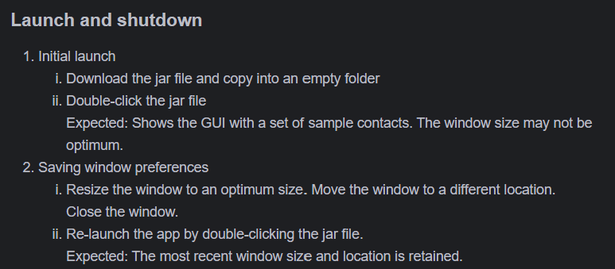

---

layout: default.md
title: "User Guide"
pageNav: 3
---

# Welcome to DLTbook!

We are so thrilled to present a new contact and DLT Public Address management tool.

In the world of cryptocurrency, we know that managing public addresses manually currently is a hassle and improper
management of public addresses might lead to financially costly mistakes.

This is why we developed **DLTbook** for crypto users to manage the public addresses of contacts with greater
convenience and security.

**DLTbook** offers a command-line first interface, allowing you to manage your contacts and their DLT
addresses with ease.

We’ll walk you through each feature, so you can discover with ease **DLTbooks** offerings. Let’s get started with *
*DLTbook** and manage your contact's public addresses with greater ease.

<div style="page-break-after: always"></div>
⚠️ **Security Note**: To protect your data from potential manipulation, we recommend using DLTbook on a device with no internet connectivity.  

# Contents

- [Introduction](#introduction)
- [Beginner's Guide](#beginners-guide)
- [Setup Guide](#setup-guide)
- [GUI Summary](#gui-summary)
- [Features](#features)
    - [Basic Features](#basic-features)
        - [Getting help: `help`](#help)
        - [Clearing all contacts from DLTbook: `clear`]()
        - [Exiting the application: `exit`](#exiting-the-program--exit)
    - [Contact Management Features](#contact-management-features)
        - [Adding a contact: `add`](#adding-a-contact--add)
        - [Deleting a contact: `delete`](#deleting-a-contact--delete)
        - [Editing a contact: `edit`](#editing-a-contact--edit)
        - [Finding contacts: `find`](#finding-contacts--find)
        - [Listing all contacts: `list`](#listing-all-contacts--list)

    - [Public Address Management Features](#public-address-management-features)
        - [Adding a public address to a contact: `addpa`](#adding-a-public-address--addpa)
        - [Deleting a public address from a contact: `deletepa`](#deleting-a-public-address--deletepa)
        - [Editing a public address of a contact: `editpa`](#editing-a-public-address--editpa)
        - [Retrieving public address given contact infomation:
          `retrievepa`](#retrieving-a-public-address-by-label--retrievepa)
        - [Searching for currently displayed contacts for a public address:
          `searchpa`](#searching-a-public-address--searchpa)
        - [Filters contacts based on presence of network: `filter`](#filtering-contacts--filter)
- [Support](#Support)
    - [Frequently Asked Questions](#frequently-asked-questions)
    - [Known Limitations](#known-issues)
    - [Help](#Help)
    - [Data Storage](#Data Storage)
    - [Troubleshooting Guide](#common-errors)
    - [Setup Guide](#setup-guide)
- [Feature Summary](#command-feature)
    - [Basic Features](#basic-commands)
    - [Contact Management Features](#contact-management-commands)
    - [Public Address Management Features](#public-address-management-features)
    -
- [Glossary](#glossary)

<div style="page-break-after: always"></div>

# Introduction

**DLTbook**:

- is essentially a basic address book with the added functionality to effectively manage public addresses of contact.
- is optimized for use via a **Command Line Interface** (CLI) while still having the benefits of a **Graphical User
  Interface** (GUI).

[Back to Top]


<div style="page-break-after: always"></div>


## Beginner's Guide

<panel header="👋 **Welcome to DLTbook Beginner's Guide**" type="primary" expanded>

_If you're new to DLTbook or the concept of Distributed Ledger Technology (DLT), this guide will walk you through the
basics. Here, we'll cover key concepts, important terminology, and guide you through the first steps in using DLTbook._
</panel>

<br>

1. **Understanding the Basics**

DLTbook is a powerful tool that helps you manage contacts and DLT public addresses.
If you're not familiar with these terms, don't worry—this section breaks down the essential concepts.
<box type="info" seamless>

**What is Distributed Ledger Technology (DLT)?**

According to [Investopedia](https://www.investopedia.com/terms/d/decentralized-technology-dlt.asp), Distributed Ledger
Technology (DLT) is the technological infrastructure and protocols that allow simultaneous access,
validation, and record updating across a networked database. DLT is the technology blockchains are created from, and the
infrastructure allows users to view any changes and who made them, reduces the need to audit data, ensures data is
reliable, and only provides access to those that need
it.
</box>

<box type="tip" seamless>

**Why is DLTBook useful in managing contacts?**

DLTbook simplifies the task of managing contacts linked with DLT public addresses,
ensuring secure and efficient interaction with distributed networks.

</box>

2. **Key Terms You Should Know**

Before diving in, let's clarify some essential terms:

<box type="info" seamless>

- **Blockchain/Network**: A decentralized digital ledger that records transactions across multiple computers.
  Acts like a currency, but it's digital and secure. (e.g., Bitcoin, Ethereum, Solana).

- **Software Wallet/Wallet**:  A software wallet, also known simply as a wallet, is an application that exists on a
  connected device such as a phone or computer. It is always connected to the internet. (
  Source: [Ledger](https://www.ledger.com/academy/topics/security/what-is-a-software-wallet))

- **Wallet Name**: A label that you use tag to the wallet to identify the wallets purpose
- (for daily transactions, for decentralised fiannce transactions, for long term storage).

- **Public Address**: A public address is a unique series of cryptographic codes that can be shared with others to
  receive messages, coins, or tokens. (similar to an
  account
  number). (Source: [Ledger](https://www.ledger.com/academy/topics/security/what-is-a-software-wallet))

- **Command Line**: A text-based interface used to run commands on your computer.

- **Java**: The programming language required to run DLTbook.

  </box>


3. **Getting Started: Your First Steps**

Here’s how you can start using DLTbook:

1. Follow our [setup guide](#setup-guide) to install Java and DLTbook on your computer.

2. Open the application and [try](#try-it-out) out some basic commands to manage contacts and DLT public addresses.

3. If you encounter any issues, refer to our [troubleshooting guide](#known-issues) or [FAQ section](#faq) for help.

4. Once you're comfortable with the basics, explore the full range of [features](#features) available in DLTbook.

### Setup Guide

1. **Download/Check Java Installation**

    - Download Java from [Oracle's website](https://www.oracle.com/java/technologies/javase-jdk11-downloads.html)

    - Open Terminal (Mac/Linux) or Command Prompt (Windows) by searching in your system and type `java -version`

    - If you see a version number, you're all set! If not, download and install Java

<box type="info" seamless>

**Note:**

- Java 17 or newer is required to run DLTbook

- If you have multiple versions of Java installed, you may need to specify the path to the correct version
  of DLTbook

- If you're using a Mac, you may need to install the Java Development Kit (JDK) instead of the Java Runtime
  Environment (JRE)

  </box>

2. **Download DLTbook**

    - Get the latest version from our [download page](https://github.com/AY2425S1-CS2103T-T08-1/tp/releases)

    - Download the file named `DLTbook.jar`

3. **Install the Application**

    - Open File Explorer (Windows) or Finder (Mac) and navigate to the Downloads folder

    - Create a new folder where you'd like to keep DLTbook

    - Move the downloaded `DLTbook.jar` file into this folder

4. **Start DLTbook**

    - Copy the path to the folder where you saved `DLTbook.jar`

    - Open Terminal (Mac/Linux) or Command Prompt (Windows)

    - Navigate to the folder where `DLTbook.jar` is saved by using the `cd` command like this:
   ```
    cd your/path/to/DLTbook
   ```
    - Run the Command: `java -jar DLTbook.jar`

<br>

After a few seconds, you'll see the DLTbook window:


### Inexperienced Users

Continue to [Try It Out!](#try-it-out) for a guide of the basic commands

### Experienced Users

If you have used DLTbook before, jump straight to [Quick Start](#quick-start) for a quick overview on basic
commands.
Go to the [Features](#features) section for a detailed guide on all available commands and capabilities.
</panel>

### Try It Out!

DLTbook comes with sample data to help you get started. Here are some basic commands to try:

1. **View all contacts**

   ```
   list
   ```

2. **Add a new contact**

   ```
   add n/Travis p/91234567 e/travis@Linkifyai.com a/1 Travis Avenue, Singapore
   ```


3. **Add a DLT public address**

   ```
   addpa 1 c/BTC l/wallet1 pa/bc1q5y5960gr9vnjlmwfst232z07surun7rey5svu9
   ```


4. **Retrieves the public address of a contact**

   ```
   retrievepa l/wallet1 c/BTC 
   ```


5. **Remove a contact**

   ```
   delete 3
    ```

6. **Exit the application**

    ```
    exit
    ```

<br>

### Need Help?

- Type `help` in the application to see all available commands

- Visit our [Detailed Features Guide](#features) below

- Check our [Common Errors](#common-errors) if you run into any issues

--------------------------------------------------------------------------------------------------------------------


Ready to learn more? Check out the [Features](#features) section below for a complete guide to all DLTbook commands and
capabilities.
<br>
<br>

## Features

### Command Overview

DLTbook supports the following commands:

 Command                                                                | Description                                                                     
------------------------------------------------------------------------|---------------------------------------------------------------------------------
 [**help**](#viewing-help-help)                                         | Shows a message explaining how to access the help page                          
 [**add**](#adding-a-person-add)                                        | Adds a contact to the address book                                              
 [**list**](#listing-all-persons-list)                                  | Shows a list of all contacts in the address book                                
 [**edit**](#editing-a-person-edit)                                     | Edits an existing contact in the address book                                   
 [**find**](#locating-persons-by-name-find)                             | Finds contacts whose names contain any of the given keywords                    
 [**delete**](#deleting-a-person-delete)                                | Deletes the specified contact from the address book                             
 [**clear**](#clearing-all-entries-clear)                               | Clears all entries from the address book                                        
 [**exit**](#exiting-the-program-exit)                                  | Exits the program                                                               
 [**addpa**](#adding-a-public-address-to-a-contact-addpa)               | Adds a public address to a contact                                              
 [**editpa**](#editing-a-public-address-of-a-contact-editpa)            | Edits an existing public address of a contact                                   
 [**retrievepa**](#retrieving-public-addresses-of-a-contact-retrievepa) | Retrieves the public addresses of a contact                                     
 [**deletepa**](#deleting-a-public-address-of-a-contact-deletepa)       | Deletes the public address of a contact                                         
 [**searchpa**](#searching-for-a-public-address-publicaddresssearch)    | Searches for a public address                                                   
 [**filter**](#filtering-persons-by-public-addresses-network-filter)    | Filters out a list of people with the public addresses of the specified network 

<box type="info" seamless>

**Notes about the command format:**<br>

* Words in `UPPER_CASE` are the parameters to be supplied by the user.<br>
  e.g. in `add n/NAME`, `NAME` is a parameter which can be used as `add n/John Doe`.

* Items in square brackets are optional.<br>
  e.g `n/NAME [t/TAG]` can be used as `n/John Doe t/friend` or as `n/John Doe`.

* Items with `…`​ after them can be used multiple times including zero times.<br>
  e.g. `[t/TAG]…​` can be used as ` ` (i.e. 0 times), `t/friend`, `t/friend t/family` etc.

* Parameters can be in any order.<br>
  e.g. if the command specifies `n/NAME p/PHONE_NUMBER`, `p/PHONE_NUMBER n/NAME` is also acceptable.

* Extraneous parameters for commands that do not take in parameters (such as `help`, `list`, `exit` and `clear`) will be
  ignored.<br>
  e.g. if the command specifies `help 123`, it will be interpreted as `help`.

* If you are using a PDF version of this document, be careful when copying and pasting commands that span multiple lines
  as space characters surrounding line-breaks may be omitted when copied over to the application.
  </box>
  <br>

--------------------------------------------------------------------------------------------------------------------

### Viewing help : `help`

Shows a message explaning how to access the help page.


Format: `help`

<br>

--------------------------------------------------------------------------------------------------------------------

### Adding a contact: `add`

Adds a contact to the address book.

Format: `add n/NAME p/PHONE_NUMBER e/EMAIL a/ADDRESS [t/TAG]…​`

* if the another contact within DLTbook already has the same details as contact of the incoming contact to be added,
  the incoming contact will not be added.

<box type="tip" seamless>


**Tip:** A contact can have any number of tags (including 0)

</box>


Examples:

* `add n/John Doe p/98765432 e/johnd@example.com a/John street, block 123, #01-01`

* `add n/Betsy Crowe t/friend e/betsycrowe@example.com a/Newgate Prison p/1234567 t/criminal`

<br>

--------------------------------------------------------------------------------------------------------------------

### Listing all contacts : `list`

Shows a list of all contacts in the address book.

Format: `list`

<br>

--------------------------------------------------------------------------------------------------------------------

### Editing a contact : `edit`

Edits an existing contact in the address book.

Format: `edit INDEX [n/NAME] [p/PHONE] [e/EMAIL] [a/ADDRESS] [t/TAG]…​`

* Edits the contact at the specified `INDEX`. The index refers to the index number shown in the displayed contact list.
  The index **must be a positive integer** 1, 2, 3, …​

* At least one of the optional fields must be provided.

* Existing values will be updated to the input values.

* When editing tags, the existing tags of the contact will be removed i.e adding of tags is not cumulative.

* You can remove all the contact’s tags by typing `t/` without

  specifying any tags after it.

Examples:

* `edit 1 p/91234567 e/johndoe@example.com` Edits the phone number and email address of the 1st contact to be `91234567`
  and `johndoe@example.com` respectively.

* `edit 2 n/Betsy Crower t/` Edits the name of the 2nd contact to be `Betsy Crower` and clears all existing tags.

<br>

--------------------------------------------------------------------------------------------------------------------

### Locating contacts by name: `find`

Finds contacts whose names contain any of the given keywords.

Format: `find KEYWORD [MORE_KEYWORDS]`

* The search is **case-insensitive**. e.g `hans` will match `Hans`

* The order of the keywords does not matter. e.g. `Hans Bo` will match `Bo Hans`

* Only the name is searched.

* Only full words will be matched. e.g. `Han` will not match `Hans`

* contacts matching at least one keyword will be returned (i.e. `OR` search).

  e.g. `Hans Bo` will return `Hans Gruber`, `Bo Yang`

Examples:

* `find John` returns `john` and `John Doe`

* `find alex david` returns `Alex Yeoh`, `David Li`<br>

  

<br>

--------------------------------------------------------------------------------------------------------------------

### Deleting a contact : `delete`

Deletes the specified contact from the address book.

Format: `delete INDEX`

* Deletes the contact at the specified `INDEX`.

* The index refers to the index number shown in the displayed contact list.

* The index **must be a positive integer** 1, 2, 3, …​

Examples:

* `list` followed by `delete 2` deletes the 2nd contact in the address book.

* `find Betsy` followed by `delete 1` deletes the 1st contact in the results of the `find` command.

<br>

--------------------------------------------------------------------------------------------------------------------

### Adding a public address to a contact : `addpa`

Adds a public address to a contact.

Format: `addpa INDEX c/NETWORK l/WALLET_NAME pa/PUBLIC_ADDRESS`

* Adds a public address to a contact at the specified `INDEX`. The index refers to the index number shown in the
  displayed contact list.
  The index **must be a positive integer** 1, 2, 3, …​

* The `NETWORK` parameter specifies the ticker name for each network (e.g., `BTC`, `ETH`,
  `SOL`, etc.). This field is **case-insensitive** and will be converted to UPPERCASE. <br />
  Allowed values: `BTC|ETH|SOL`.

* The `WALLET_NAME` parameter specifies the wallet name to which the public address belongs.
  This field is **case-insensitive** and will be stored as is.

* The `PUBLIC_ADDRESS` parameter specifies the public address to be added.
  The length of BTC/ETH/SOL public addresses should be more than 26 characters, less than 44 characters and can only
  contain alphanumeric characters.
  This field is **case-insensitive** and will be converted to lowercase.

Examples:

* `addpa 1 c/ETH l/wallet1 pa/0x0b1c9e1fb5e13c797c7f0134641810e9a7ca14d2` adds a public address
  to the first contact on the list `Alex Yeoh` under the ETH network with the wallet name `wallet1` and the public
  address `0x0b1c9e1fb5e13c797c7f0134641810e9a7ca14d2`.

* `addpa 4 c/BTC l/savings_wallet pa/bc1q5y5960gr9vnjlmwfst232z07surun7rey5svu9` adds a public address to the fourth
  contact on the list `David Li` under the BTC network with the wallet name `savings_wallet` and the public address
  `bc1q5y5960gr9vnjlmwfst232z07surun7rey5svu9`.



<br>

--------------------------------------------------------------------------------------------------------------------

### Editing a public address of a contact : `editpa`

Edits an existing public address of a contact.

Format: `editpa INDEX c/NETWORK l/WALLET_NAME pa/PUBLIC_ADDRESS`

* Edits the public address of the contact at the specified `INDEX`. The index refers to the index number shown in the
  displayed contact list.
  The index **must be a positive integer** 1, 2, 3, …​


* The `NETWORK` parameter specifies the ticker name for each network (e.g., `BTC`, `ETH`,
  `SOL`, etc.). This field is **case-insensitive** and will be converted to UPPERCASE. <br />
  Allowed values: `BTC|ETH|SOL`.

* The `WALLET_NAME` parameter specifies the wallet name to which the public address belongs.
  This field is **case-insensitive** and will be stored as is.

* The `PUBLIC_ADDRESS` parameter specifies the new public address to be added.
  The length of BTC/ETH/SOL public addresses should be more than 26 characters, less than 44 characters and can only
  contain alphanumeric characters.
  This field is **case-insensitive** and will be converted to lowercase.

#### Examples

* `editpa 3 c/BTC l/Daily wallet pa/bc1q5y5960gr9vnjlmwfst232z07surun7rey5svu9`<br />
  if the contact at index 3 exists and has a BTC public address labelled as 'Daily wallet'.
  Changes the third contact's BTC public address labelled `Daily wallet` to
  `bc1q5y5960gr9vnjlmwfst232z07surun7rey5svu9`.<br />

* `editpa 3 c/BTC l/daily wallet pa/bc1q5y5960gr9vnjlmwfst232z07surun7rey5svu9`<br />
  if the contact at index 3 exists and has a BTC public address 'bc1q5y5960gr9vnjlmwfst232z07surun7rey5svu9'.
  Changes the third contact's BTC public address labelled "Daily wallet" to "daily wallet" as `WALLET_NAME` is *
  *case-insensitive**.

<br>

--------------------------------------------------------------------------------------------------------------------

### Retrieving public addresses of a contact : `retrievepa`

Retrieves the public addresses of a contact.

Format: `retrievepa l/WALLET_NAME [c/NETWORK] [n/PERSON_NAME]`

* `WALLET_NAME` parameter is compulsory and specifies the label (or part of the label) of the public address(es) to be
  retrieved. This field is **case-insensitive**.

* `NETWORK` parameter is optional and specifies the ticker name for each network.
  This field is **case-insensitive** <br />
  Allowed values: `BTC|ETH|SOL`.

* `PERSON_NAME` parameter is optional and specifies the name (or part of the name) of the contact(s) whose addresses
  should be retrieved. This field is **case-insensitive**.

#### Examples

* `retrievepa l/MyWallet`<br />
  Retrieves all public addresses with labels containing "MyWallet" for all contacts and networks.

* `retrievepa l/Daily c/BTC`<br />
  Retrieves all BTC public addresses with labels containing "Daily" for all contacts.

* `retrievepa l/Savings n/John`<br />
  Retrieves all public addresses with labels containing "Savings" for contacts whose names contain "John".

* `retrievepa l/Business c/ETH n/Alice`<br />
  Retrieves all ETH public addresses with labels containing "Business" for contacts whose names contain "Alice".

<br>

--------------------------------------------------------------------------------------------------------------------

### Deleting a public address of a contact : `deletepa`

Deletes the public address of a contact.

Format: `deletepa INDEX c/NETWORK [l/WALLET_NAME]`

* Deletes the public address of the contact at the specified `INDEX`. The index refers to the index number shown in the
  displayed contact list.
  The index **must be a positive integer** 1, 2, 3, …​


* The `NETWORK` parameter specifies the ticker name for each network (e.g., `BTC`, `ETH`,
  `SOL` etc.). This field is **case-insensitive** and will be converted to UPPERCASE. <br />
  Allowed values: `BTC|ETH|SOL`.

* The `WALLET_NAME` parameter is not compulsory and specifies the wallet name of the public address
  that will be deleted. If `WALLET_NAME` is not provided, all public addresses in the `NETWORK` of the contact
  at the specified `INDEX` will be deleted. This field is **case-insensitive**.

Examples:

* `deletepa 1 c/BTC l/wallet1` deletes the public address of the first contact in the BTC network with the wallet name
  `wallet1`.


* `deletepa 3 c/BTC` deletes all the public addresses of the third contact in the BTC network.

<br>

--------------------------------------------------------------------------------------------------------------------

### Searching for a public address : `searchpa`

Based on contacts displayed, it searches for a contact using the unique public address

Format: `searchpa pa/PUBLIC_ADDRESS`

| Parameter        | Explanation          | Details                                                                                                                                                             | 
|------------------|----------------------|---------------------------------------------------------------------------------------------------------------------------------------------------------------------|
| `PUBLIC_ADDRESS` | a DLT public address | - Only alphanumeric characters allowed  <br/>  - The length should be more than 26 characters and less than 44 characters<br/> - This field is **case-insensitive** |

* Searches for a public address based on the `PUBLIC_ADDRESS` provided.

<box type="tip" seamless>
This command only searches the current list of public addresses displayed (e.g. if all contacts are displayed
  searchpa will perform a global search. if a filtered list of contacts
  displayed, searchpa will perform a local
  search on list of contacts displayed).
  </box>

Examples:

* `searchpa pa/bc1q5y5960gr9vnjlmwfst232z07surun7rey5svu9` searches for a public
  address `bc1q5y5960gr9vnjlmwfst232z07surun7rey5svu9` and displays the contact and wallet to
  which it belongs.


<br>

--------------------------------------------------------------------------------------------------------------------

### Filtering contacts by public addresses network : `filter`

Filters out a list of contacts with the public addresses of the specified network.

Format: `filter c/NETWORK`

* The `NETWORK` parameter specifies the ticker name for each network (e.g., `BTC`, `ETH`,
  `SOL` etc.). This field is **case-insensitive** and will be converted to UPPERCASE. <br />
  Allowed values: `BTC|ETH|SOL`.

Examples:

* `filter c/BTC` filters a list of contacts with the public addresses of `BTC` and
  displays it with their respective list number.

<br>

--------------------------------------------------------------------------------------------------------------------

### Clearing all entries : `clear`

Clears all entries from the address book.

Format: `clear`

<br>

--------------------------------------------------------------------------------------------------------------------

### Exiting the program : `exit`

Exits the program.

Format: `exit`

<br>

--------------------------------------------------------------------------------------------------------------------

### Saving the data

DLTbook data are saved in the hard disk automatically after any command that changes the data. There is no need to save
manually.

<br>

--------------------------------------------------------------------------------------------------------------------

### Editing the data file

DLTbook data are saved automatically as a JSON file `[JAR file location]/data/addressbook.json`. Advanced users are
welcome to update data directly by editing that data file.

**Caution:**

If your changes to the data file makes its format invalid, DLTbook will discard all data and start with an empty data
file at the next run. Hence, it is recommended to take a backup of the file before editing it.<br>

Furthermore, certain edits can cause the AddressBook to behave in unexpected ways (e.g., if a value entered is outside
the acceptable range). Therefore, edit the data file only if you are confident that you can update it correctly.
</box>

--------------------------------------------------------------------------------------------------------------------

## FAQ

**Q**: How do I transfer my data to another Computer?<br>
**A**: Install the app in the other computer and overwrite the empty data file it creates with the file that contains
the data of your previous AddressBook home folder.


**Q**: Can I integrate it with other Crypto Wallet services? (eg. Metamask,etc.)<br>
**A**: We are planning to add integration with other Crypto wallets in the future.


**Q**: Does it support other Crypto Networks? (eg. BNB, Polygon, etc.)<br>
**A**: Right now, we only support BTC, ETH and SOL. We are planning to support these networks in the future.


**Q**: Can I use it on my phone?<br>
**A**: DLTbook is a desktop application and is not supported on mobile devices.

**Q**: How do I report a bug?<br>
**A**: You can report a bug by creating an issue on our [GitHub repository](https://github.com/AY2425S1-CS2103T-T08-1/tp/issues).

**Q**: Can I use it offline?<br>
**A**: Yes, DLTbook is a desktop application and does not require an internet connection to run.

--------------------------------------------------------------------------------------------------------------------

## Common Errors

--------------------------------------------------------------------------------------------------------------------

## Known issues

1. **When using multiple screens**, if you move the application to a secondary screen, and later switch to using only
   the primary screen, the GUI will open off-screen. The remedy is to delete the `preferences.json` file created by the
   application before running the application again.

2. **If you minimize the Help Window** and then run the `help` command (or use the `Help` menu, or the keyboard shortcut
   `F1`) again, the original Help Window will remain minimized, and no new Help Window will appear. The remedy is to
   manually restore the minimized Help Window.
3. **Limited names allowed** The names of contacts in DLTbook do not support special symbols and only accepts characters
   from the English alphabet.
4. **Missing email validation** The email field of contacts in DLTbook have no restrictions and can be duplicated across
   contacts.

--------------------------------------------------------------------------------------------------------------------

## Future Enhancements

Most commands currently do not forgive extraneous inputs for commands that do not require them.
Such inputs will be ignored. But the error message displayed for this error for commands are different and may not
exactly describe this error. This shall be fixed in the future.

--------------------------------------------------------------------------------------------------------------------

## Command summary

| Action                      | Format, Examples                                                                                                                                                       |
|-----------------------------|------------------------------------------------------------------------------------------------------------------------------------------------------------------------|
| **Add**                     | `add n/NAME p/PHONE_NUMBER e/EMAIL a/ADDRESS [t/TAG]...` <br> e.g., `add n/James Ho p/22224444 e/jamesho@example.com a/123, Clementi Rd, 1234665 t/friend t/colleague` |
| **Clear**                   | `clear`                                                                                                                                                                |
| **Delete**                  | `delete INDEX`<br> e.g., `delete 3`                                                                                                                                    |
| **Edit**                    | `edit INDEX [n/NAME] [p/PHONE_NUMBER] [e/EMAIL] [a/ADDRESS] [t/TAG]...`<br> e.g.,`edit 2 n/James Lee e/jameslee@example.com`                                           |
| **Find**                    | `find KEYWORD [MORE_KEYWORDS]`<br> e.g., `find James Jake`                                                                                                             |
| **List**                    | `list`                                                                                                                                                                 |
| **Help**                    | `help`                                                                                                                                                                 |
| **Exit**                    | `exit`                                                                                                                                                                 |
| **Add Public Address**      | `addpa INDEX c/NETWORK l/WALLET_NAME pa/PUBLIC_ADDRESS`<br> e.g., `addpa 1 c/ETH l/wallet1 pa/0x0b1c9e1fb5e13c797c7f0134641810e9a7ca14d2`                              |
| **Edit Public Address**     | `editpa INDEX c/NETWORK l/WALLET_NAME pa/NEW_ADDRESS`<br> e.g., `editpa 3 c/BTC l/Daily wallet pa/bc1q5y5960gr9vnjlmwfst232z07surun7rey5svu9`                          |
| **Retrieve Public Address** | `retrievepa l/WALLET_NAME [c/NETWORK] [n/PERSON_NAME]`<br> e.g., `retrievepa l/wallet1 c/BTC n/John`                                                                   |
| **Delete Public Address**   | `deletepa c/NETWORK [l/WALLET_NAME]`<br> e.g., `deletepa 1 c/BTC l/wallet1`                                                                                            |
| **Search Public Address**   | `searchpa pa/PUBLIC_ADDRESS`<br> e.g., `searchpa pa/bc1q5y5960gr9vnjlmwfst232z07surun7rey5svu9`                                                                        |
| **Filter**                  | `filter c/NETWORK`<br> e.g., `filter c/BTC`                                                                                                                            |
