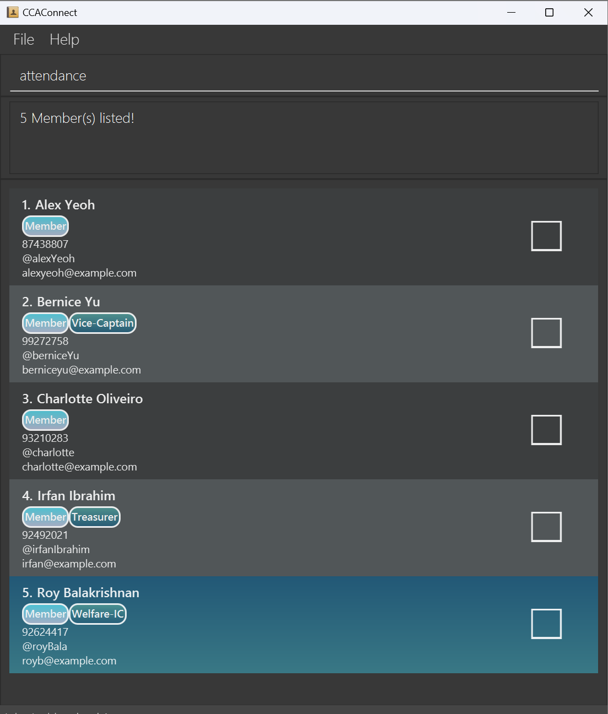

<!-- Project Title -->
<div align="center">
  <h1 style="font-weight:800;font-size:70px;">CCAConnect</h1>
</div>

CCAConnect is a desktop application that aims to **assist NUS CCA leaders** in **managing and collating relevant CCA personnel’s contact details**, as well as to help **track attendance details for CCA sessions**.
Equipped with features like **attendance marking**, **contact management**, **contact filtering** and **profile switching**, CCAConnect helps to reduce the headaches of personnel tracking.

--------------------------------------------------------------------------------------------------------------------

<!-- Table of Content -->
## Table of Contents
* Table of Contents
 {:toc}

--------------------------------------------------------------------------------------------------------------------

## Quick start

1. Ensure you have Java `17` or above installed in your Computer. [How to check?](https://www.java.com/en/download/help/version_manual.html)

2. Download the latest `ccaconnect.jar` file from [here](https://github.com/AY2425S1-CS2103T-F11-2/tp/releases).

3. Copy the file to the folder you want to use as the _home folder_ for CCAConnect. This folder will also be used by CCAConnect to store data. For example, if you put `ccaconnect.jar` in a folder named `CCA`, then `CCA` will be the _home folder_.

4. Open a command terminal, and change the current working directory to the folder where `ccaconnect.jar` was placed in.

    <div markdown="span" class="alert alert-primary">**Example:**<br/>
    On **Mac/Linux**, if you placed `ccaconnect.jar` in the `~/Desktop/CCA` folder, type in the following command:
    ```
    cd ~/Desktop/CCA
    ```
    </div>

    <div markdown="span" class="alert alert-primary">**Example:**<br/>
    On **Windows**, if you placed `ccaconnect.jar` in the `C:\Users\User1\Desktop\CCA` folder, type in the following command:
    ```
    cd C:\Users\User1\Desktop\CCA
    ```
    </div>

5. Launch the CCAConnect application by typing in the following command:
    ```
    java -jar ccaconnect.jar
    ```
   A GUI similar to that given below should appear in a few seconds. Note that the app contains some sample data.<br>
   

6. Type the command in the command box and press Enter to execute it. e.g. typing `help` and pressing Enter will open the help window.<br>
   Some example commands you can try:

    * `list` : Lists all contacts.

    * `add n/John Doe p/98765432 e/johnd@example.com t/johnDoe` : Adds a person named `John Doe`, with those specified information.

    * `delete 1` : Deletes the 1st contact shown in the current list.

    * `clear` : Deletes all contacts stored in the current profile.

    * `exit` : Exits the app.

7. Refer to the [Features](#features) below for details of each command, and check the [Glossary](#glossary) if you need a reminder on any terms.

--------------------------------------------------------------------------------------------------------------------

## Features

<div markdown="1" class="alert alert-primary">:information_source: **Notes about the command format:**<br/>

* Words in <code>UPPER_CASE</code> are the parameters to be supplied by the user.<br>
    * e.g. in <code>add n/NAME</code>, <code>NAME</code> is a parameter which can be used as <code>add n/John Doe p/98765432 e/johnd@example.com t/johnDoe12 r/Exco Member f/</code>.<br><br>
* Items in square brackets are optional.<br>
  * e.g <code>n/NAME [r/ROLE]</code> can be used as <code>n/John Doe r/exco</code> or as <code>n/John Doe</code>.<br><br>
* Items with <code>…</code>​ after them can be used multiple times. If the item is optional, e.g. <code>[r/ROLE]…​</code>, it can also be used zero times<br>
    * e.g. <code>[r/ROLE]…​</code> can be used as <code> </code> (i.e. 0 times), <code>r/exco</code>, <code>r/member r/exco</code> etc. <br><br>
* Parameters can be in any order.<br>
    * e.g. if the command specifies <code>n/NAME p/PHONE_NUMBER</code>, <code>p/PHONE_NUMBER n/NAME</code> is also acceptable.<br><br>
* The parameter prefixes (e.g. <code>n/</code>) with leading spaces are considered restricted keywords, and may not be present within existing parameters. However, for parameters that allow `/`, using parameter prefixes without a leading space within the parameter (e.g. `n/a` within `ROLE`) is allowed.
</div>

<div markdown="span" class="alert alert-warning">:exclamation: **Caution:**<br/>
If you are using a PDF version of this document, be careful when copying and pasting commands that span multiple lines as space characters surrounding line-breaks may be omitted when copied over to the application.
</div>


### Viewing help: `help`

Opens a new window that displays a list of all available commands along with their usage instructions.


#### Format
```
help
```


### Adding a person: `add`

Adds a person to the [address book](#glossary).

#### Format
```
add n/NAME p/PHONE_NUMBER e/EMAIL t/TELEGRAM [r/ROLE]…​ [f/ or nf/ (NOT BOTH)]
```

#### Alias
`a` can be used in place of `add`.

#### Parameters

| Parameter      | Prefix | Compulsory? | Remarks                                                                                                                                                                                                                                                                                                                                                                                                                                                                                                                                                                                                                                                                                                                                                   |
|----------------|--------|-------------|-----------------------------------------------------------------------------------------------------------------------------------------------------------------------------------------------------------------------------------------------------------------------------------------------------------------------------------------------------------------------------------------------------------------------------------------------------------------------------------------------------------------------------------------------------------------------------------------------------------------------------------------------------------------------------------------------------------------------------------------------------------|
| `NAME`         | `n/`   | Yes         | Represents the name of a contact.<br/> Should contain non-numeric characters and spaces, and should not be blank.                                                                                                                                                                                                                                                                                                                                                                                                                                                                                                                                                                                                                                         |
| `PHONE_NUMBER` | `p/`   | Yes         | Represents the phone number of a contact.<br/> Should be a valid Singapore phone number (i.e. have 8 digits and start with 3, 6, 8, or 9), and only contain digits with no spaces.                                                                                                                                                                                                                                                                                                                                                                                                                                                                                                                                                                        |
| `EMAIL`        | `e/`   | Yes         | Represents the email of a contact.<br/> `EMAIL` should be of the format *local-part@domain*, and adhere to the following constraints:<br/> 1. The *local-part* should only contain alphanumeric characters and these special characters (+ _ % . -), excluding the parentheses.<br/> The *local-part* may not start or end with any special characters.<br/> 2. This is followed by an '@', and then a domain name. The domain name is made up of domain labels, separated by periods.<br/> The domain name must:<br/> - end with a domain label at least 2 characters long<br/> - have each domain label start and end with alphanumeric characters<br/> - have each domain label consist of alphanumeric characters, separated only by hyphens, if any. |
| `TELEGRAM`     | `t/`   | Yes         | Represents the telegram handle of a contact.<br/> Should be alphanumeric characters, and be between 5-32 characters long.                                                                                                                                                                                                                                                                                                                                                                                                                                                                                                                                                                                                                                 |
| `ROLE`         | `r/`   | No          | Represents the role(s) held by the contact.<br/> Should be between 1-20 characters long.                                                                                                                                                                                                                                                                                                                                                                                                                                                                                                                                                                                                                                                                  |
|                | `f/`   | No          | Represents the favouriting of a contact.<br/> This keyword should be included only if you intend for this contact to be a favourite contact.                                                                                                                                                                                                                                                                                                                                                                                                                                                                                                                                                                                                              |
|                | `nf/`  | No          | Represents the unfavouriting of a contact.<br/> This keyword can be excluded if you intend for this contact to not be a favourite contact.                                                                                                                                                                                                                                                                                                                                                                                                                                                                                                                                                                                                                |


<div markdown="span" class="alert alert-info">:exclamation: **Note:**<br/>
A person is uniquely identified by his/her **telegram handle**.<br/>
E.g. Once a person with telegram handle `alexYeoh` is added, no other contacts can be created with `alexYeoh` as the telegram handle.<br/>
</div>

<div markdown="span" class="alert alert-info">:exclamation: **Note:**<br/>
Valid telegram handles follow the requirements set by Telegram. See [link](https://telegram.org/faq#:~:text=Q%3A%20What%20can%20I%20use,TeleGram%20is%20the%20same%20user).<br/>
Since Telegram treats their handles as case-insensitive, CCAConnect also treats the telegram field as case-insensitive.
</div>

<div markdown="span" class="alert alert-primary">:bulb: **Tip:**<br/>
A person can have any number of roles (including 0).
</div>

<div markdown="span" class="alert alert-primary">:bulb: **Tip:**<br/>
`Member` is a **special reserved role** in CCAConnect. Attendance related commands will only work for contacts that have the `Member` role.

When adding/editing a person with the role of `Member`, the spelling of `Member` in `r/Member` is case-insensitive. E.g. `r/mEmBER` will also set the person to be a `Member`.
</div>

#### Example
* `add n/John Doe p/98765432 e/johnd@example.com t/johnDoe12`
* `a n/Betsy Crowe r/chairperson e/betsycrowe@example.com t/betsyC p/81234567 r/member f/`

### Listing all persons: `list`

Shows a list of all persons in the address book. <br/>
This can be used to reset the list of contacts back to its unfiltered state.

#### Format
```
list
```

#### Alias
`l` can be used in place of `list`.

### Editing a person: `edit`

Edits an existing person in the address book.

#### Format
```
edit INDEX [n/NAME] [p/PHONE] [e/EMAIL] [t/TELEGRAM] [r/ROLE]…​ [f/ or nf/ (NOT BOTH)]
```
#### Alias
`e` can be used in place of `edit`.

#### Parameters

| Parameter      | Prefix | Compulsory? | Remarks                                                                                                                                                                                                                                                                                                                                                                                                                                                                                                                                                                                                                                                                                                                                                  |
|----------------|--------|-------------|----------------------------------------------------------------------------------------------------------------------------------------------------------------------------------------------------------------------------------------------------------------------------------------------------------------------------------------------------------------------------------------------------------------------------------------------------------------------------------------------------------------------------------------------------------------------------------------------------------------------------------------------------------------------------------------------------------------------------------------------------------|
| `INDEX`        |        | Yes         | Edits the person at the specified `INDEX`.<br/> The index refers to the index number shown in the displayed person list.<br/>  It must be a [non-zero unsigned integer](#glossary) and must not exceed the size of the displayed contact list.                                                                                                                                                                                                                                                                                                                                                                                                                                                                                                           |
| `NAME`         | `n/`   | No          | Represents the name of a contact.<br/> Should contain non-numeric characters and spaces, and should not be blank.                                                                                                                                                                                                                                                                                                                                                                                                                                                                                                                                                                                                                                        |
| `PHONE_NUMBER` | `p/`   | No          | Represents the phone number of a contact.<br/> Should be a valid Singapore phone number (i.e. have 8 digits and start with 3, 6, 8, or 9), and only contain digits with no spaces.                                                                                                                                                                                                                                                                                                                                                                                                                                                                                                                                                                       |
| `EMAIL`        | `e/`   | No          | Represents the email of a contact.<br/>`EMAIL` should be of the format *local-part@domain*, and adhere to the following constraints:<br/> 1. The *local-part* should only contain alphanumeric characters and these special characters (+ _ % . -), excluding the parentheses.<br/> The *local-part* may not start or end with any special characters.<br/> 2. This is followed by an '@', and then a domain name. The domain name is made up of domain labels, separated by periods.<br/> The domain name must:<br/> - end with a domain label at least 2 characters long<br/> - have each domain label start and end with alphanumeric characters<br/> - have each domain label consist of alphanumeric characters, separated only by hyphens, if any. |
| `TELEGRAM`     | `t/`   | No          | Represents the telegram handle of a contact.<br/> Should be alphanumeric characters, and be between 5-32 characters long.                                                                                                                                                                                                                                                                                                                                                                                                                                                                                                                                                                                                                                |
| `ROLE`         | `r/`   | No          | Represents the role(s) held by the contact.<br/> Should be between 1-20 characters long.<br/> When editing roles, the existing roles of the person will be removed. I.e. Adding of roles is *not* cumulative.                                                                                                                                                                                                                                                                                                                                                                                                                                                                                                                                            |
|                | `f/`   | No          | Represents the favouriting of a contact.<br/> This keyword should be included only if you intend for this contact to be a favourite contact.                                                                                                                                                                                                                                                                                                                                                                                                                                                                                                                                                                                                             |
|                | `nf/`  | No          | Represents the unfavouriting of a contact.<br/> This keyword should be included only if you intend for this contact to be unfavourited.                                                                                                                                                                                                                                                                                                                                                                                                                                                                                                                                                                                                                  |

* At least one of the optional fields must be provided.
* Existing values will be updated to the input values.
* Only one of `f/` or `nf/` should be present in the command at once, not both.

<div markdown="span" class="alert alert-primary">:bulb: **Tip:**<br/>
You can remove all the person’s roles by typing `r/` without specifying any roles after it.
</div>

#### Example
*  `edit 1 p/91234567 e/johndoe@example.com` Edits the phone number and email address of the 1st person to be `91234567` and `johndoe@example.com` respectively.
*  `edit 2 n/Betsy Crower r/` Edits the name of the 2nd person to be `Betsy Crower` and clears all existing roles.

<div markdown="span" class="alert alert-info">:exclamation: **Note:**<br/>
Recorded attendances for previous "Member" contacts are not wiped to allow for future reference and verification of participation. It is also important for tracking overall attendance trends and patterns over time.
</div>

<a id="find-command"></a>
### Locating persons: `find`

Search for contact(s) whose contact details satisfy either of the following:
1. Name contains any of the given name keyword(s)
2. Has a role stated by any of the role keyword(s)
3. Telegram handle which matches exactly with any of the given telegram keyword(s)
4. Is a favourite contact

#### Format
```
find [n/NAMEKEYWORD]…​ [r/ROLEKEYWORD]…​ [t/TELEGRAMKEYWORD]…​ [f/]
```

<div markdown="span" class="alert alert-primary">:bulb: **Tip:**<br/>
When using `find`, at least **one** of the optional parameters must be included.
</div>

#### Alias
`f` can be used in place of `find`.

#### Parameters

| Parameter         | Prefix | Compulsory? | Remarks                                                                                                                                                                    |
|-------------------|--------|-------------|----------------------------------------------------------------------------------------------------------------------------------------------------------------------------|
| `NAMEKEYWORD`     | `n/`   | No          | Represents the name to be searched.<br/> `NAMEKEYWORD` can be a partial match for the name.                                                                                |
| `ROLEKEYWORD`     | `r/`   | No          | Represents the role to be searched.<br/> `ROLEKEYWORD` has to match exactly with the role. <br/> Contacts with roles matching at least one `ROLEKEYWORD` will be returned. |
| `TELEGRAMKEYWORD` | `t/`   | No          | Represents the telegram handle to be searched.<br/> `TELEGRAMKEYWORD` has to match exactly with the telegram handle.                                                       |
|                   | `f/`   | No          | Represents finding all contacts that have been favourited.                                                                                                                 |

* The search is case-insensitive for all parameters. E.g `hans` will match `Hans`.
* Persons matching at least one keyword will be returned (i.e. `OR` search).

<div markdown="span" class="alert alert-primary">:bulb: **Tip:**<br/>
Invalid parameters will be accepted and 0 people will be returned.
</div>

#### Example
##### Usage: Find by name
* `find n/david` returns `David Li`.<br>
  

##### Usage: Find by role
* `find r/treasurer` returns `Irfan Ibrahim` who has a role `Treasurer`.<br>
  

##### Usage: Find by telegram
* `find t/alexyeoh` returns `Alex Yeoh` who has the telegram handle `alexYeoh`.<br>
  

##### Usage: Find by favourite
* `find f/` returns 1 favourite contact.<br>
  

##### Usage: Find composition
Composing all 4 types of search will give an `OR` search, a contact that has at least one matching criteria will be returned.
* `find n/david f/` returns all contacts with a name that partially matches `david`, **OR** are favourited contacts.

<a id="sort-command"></a>
### Sorting the contacts: `sort`

Sorts the list of contacts by name, in a user-specified order.<br/>
Sorting works together with the `find` command, meaning that if you sort after reducing the number of listed contacts, the sorting occurs for those listed contacts.

<div markdown="span" class="alert alert-info">:exclamation: **Note:**<br/><br/>
`sort` orders the list of contacts in alphabetical order of their names, and this action is case-insensitive.<br/>
E.g. The letters `A` and `a` will both be treated as `a`.<br/>
Symbols will be sorted according to the ordering specified by the American Standard Code of Information Interchange (ASCII).<br/>
E.g. With ascending sort, `{` will be ordered behind the alphabets, since that is its position on the ASCII table
</div>

#### Format
`sort ORDER`

#### Alias
`so` can be used in place of `sort`.

#### Parameters

| Parameter | Prefix | Compulsory? | Remarks                                                                                                                                                                                                                                                    |
|-----------|--------|-------------|------------------------------------------------------------------------------------------------------------------------------------------------------------------------------------------------------------------------------------------------------------|
| `ORDER`   |        | Yes         | `ORDER` can only take the form of 3 possible options:<br/> `asc` - sorts by name in ascending order. <br/> `desc` - sorts by name in descending order. <br/> `og` - sorts by name in the original order, based on the initial positioning of the contacts. |

#### Example
* `sort asc` sorts the current list of contacts by name, in ascending order

### Deleting a person: `delete`

Deletes the specified person from the address book.

#### Format
```
delete INDEX
```

#### Alias
`d` can be used in place of `delete`.

#### Parameters

| Parameter | Prefix | Compulsory? | Remarks                                                                                                                                                           |
|-----------|--------|-------------|-------------------------------------------------------------------------------------------------------------------------------------------------------------------|
| `INDEX`   |        | Yes         | Deletes the person at the specified `INDEX`.<br/> It must be a [non-zero unsigned integer](#glossary) and must not exceed the size of the displayed contact list. |

* The index refers to the index number shown in the displayed person list. This can change having previously used commands such as `find` or `sort`.

#### Examples
* `list` followed by `delete 2` deletes the 2nd person in the address book.
* `find n/Betsy` followed by `delete 1` deletes the 1st person in the results of the `find` command.

### Listing all members for attendance : `attendance`

Lists all contacts that have the role “Member” in the address book, making it easier to check and mark attendance for them directly.

#### Format
```
attendance
```

#### Alias
`atd` can be used in place of `attendance`.

#### Parameters
This command does not take any additional parameters.

#### Example
`attendance`



### Marking attendance: `mark`

Marks attendance for **members** with specified Telegram handles on a specific date.

#### Format
```
mark t/TELEGRAM…​ d/DATE
```

#### Alias
`m` can be used in place of `mark`.

#### Parameters

| Parameter  | Prefix | Compulsory? | Remarks                                                                                                                                                                                                                                                                                                                                                            |
|------------|--------|-------------|--------------------------------------------------------------------------------------------------------------------------------------------------------------------------------------------------------------------------------------------------------------------------------------------------------------------------------------------------------------------|
| `TELEGRAM` | `t/`   | Yes         | `TELEGRAM` must match exactly alphabetically to the telegram handle of the contact that is being marked. <br/> Note that `TELEGRAM` is not case-sensitive.<br/> `mark` accepts multiple handles separated by spaces, each beginning with `t/`. E.g. `... t/usera t/userb ...`.<br/> **Only telegram handles of contacts with the role of `Member` can be marked.** |
| `DATE`     | `d/`   | Yes         | `DATE` follows [ISO 8601 standard](https://en.wikipedia.org/wiki/ISO_8601) with the format **YYYY-MM-DD**, e.g. `2024-10-19`, and should be an actual date no later than the current date. <br/> If multiple dates are included in the command, only the last one will be recorded as the attendance date.                                                                                               |

#### Example

**Please note the following code will display a different GUI if used on a different day (other than 7th November 2024)**.

* `mark t/alexYeoh t/berniceYu d/2024-11-07`

  

<div markdown="1" class="alert alert-info">:exclamation: **Note:**<br/>

-  If the input date matches the current date, the checkbox for marked members will be automatically selected upon successful attendance marking.<br>

- If the input telegrams include members who have already been marked on input date, the result will remind user of these repeatedly marked members while still marking other members as usual.
</div>

<div markdown="span" class="alert alert-info">:exclamation: **Note:**<br/>
Do not be alarmed if your checkbox looks different from the one displayed in the examples. The checkbox styling depends on your current operating system, and have no impact on CCAConnect's functionality.
</div>

### Unmarking attendance : `unmark`

Unmarks attendance for **members** with specified Telegram handles on a specific date.

#### Format
```
unmark t/TELEGRAM…​ d/DATE
```

#### Alias
`um` can be used in place of `unmark`.


#### Parameters

| Parameter  | Prefix | Compulsory? | Remarks                                                                                                                                                                                                                                                                                                                                                            |
|------------|--------|-------------|--------------------------------------------------------------------------------------------------------------------------------------------------------------------------------------------------------------------------------------------------------------------------------------------------------------------------------------------------------------------|
| `TELEGRAM` | `t/`   | Yes         | `TELEGRAM` must match exactly alphabetically to the telegram handle of the contact that is being marked. <br/> Note that `TELEGRAM` is not case-sensitive.<br/> `mark` accepts multiple handles separated by spaces, each beginning with `t/`. E.g. `... t/usera t/userb ...`.<br/> **Only telegram handles of contacts with the role of `Member` can be marked.** |
| `DATE`     | `d/`   | Yes         | `DATE` follows **ISO 8601 standard** with the format **YYYY-MM-DD**, e.g. `2024-10-19`, and should be an actual date no later than the current date. <br/> If multiple dates are included in the command, only the last one will be recorded as the attendance date.                                                                                               |


#### Example
* `unmark t/alexYeoh t/berniceYu d/2024-11-10`

    

<div markdown="1" class="alert alert-info">:exclamation: **Note:**<br/>

- If the input date matches the current date, the checkbox for previously marked members will be automatically cleared upon successful attendance unmarking. <br>

- If the input telegrams include members who have already been unmarked on input date, the result will remind user of these repeatedly unmarked members while still unmarking other members as usual.

</div>


### Clearing all entries: `clear`

Clears all entries from the address book.

<div markdown="span" class="alert alert-warning">:exclamation: **Caution:**<br/>
This action permanently deletes all the entries from the address book! **Use with extreme caution**.
</div>

#### Format
```
clear
```

#### Alias
`c` can be used in place of `clear`.


### Viewing a specific contact: `view`

Views all the contact information of the specified contact.

#### Format
```
view t/TELEGRAM
```

#### Parameters

| Parameter  | Prefix | Compulsory? | Remarks                                                                                                                                                                                                                                                                             |
|------------|--------|-------------|-------------------------------------------------------------------------------------------------------------------------------------------------------------------------------------------------------------------------------------------------------------------------------------|
| `TELEGRAM` | `t/`   | Yes         | `TELEGRAM` must match exactly alphabetically to the telegram handle of the contact that is being marked. <br/> Note that `TELEGRAM` is not case-sensitive.<br/> Multiple `t/` entries are accepted, but all `t/` entries except for the terminating `t/` entry will be disregarded. |

#### Example
* `view t/bob12` displays page containing all the information of the person with telegram handle `@bob12`.<br>


<div markdown="span" class="alert alert-info">:exclamation: **Note:**<br/>
The use of any other commands (other than another <code>view</code> command) will close the view page and revert back to the list of contacts!
</div>

### Exiting the program: `exit`

Safely exits the program.

#### Format
```
exit
```

<div markdown="span" class="alert alert-warning">:exclamation: **Caution:**<br/>
To ensure data is saved properly, always use the `exit` command or the window's close button to exit. Using any unintended exit methods may lead to data loss.
</div>


### Switching a profile : `switch`
The `switch` command offers an alternative way to organize your contacts by creating separate profiles, each tailored to a specific context or purpose.
Each profile has its own independent set of contacts, allowing you to freely modify the data of one profile without affecting others.
For instance, you may create a 'competition-team' profile to keep track of personnel involved in an upcoming competition, and quickly switch between it and your main profile to view the participants.

#### Format
```
switch PROFILE
```

#### Alias
`sw` can be used in place of `switch`.

<a id="switch-remarks"></a>
#### Parameters

| Parameter | Prefix | Compulsory? | Remarks                                                                                                                                                                                                                                                                                        |
|-----------|--------|-------------|------------------------------------------------------------------------------------------------------------------------------------------------------------------------------------------------------------------------------------------------------------------------------------------------|
| `PROFILE` |        | Yes         | `PROFILE` specifies the profile that `switch` will attempt to switch to.<br/> `PROFILE` must be between 1 and 30 characters, and can only contain letters (a-z, A-Z), numbers (0-9), hyphens (-), and underscores (_).<br/> `PROFILE` names are **case-insensitive** and treated as lowercase. |

<div markdown="span" class="alert alert-primary">:bulb: **Tip:**<br/>
If the specified `PROFILE` does not already exist, switch will create it; otherwise, it will switch to the existing profile.
</div>


#### Example

- `switch competition-team` switches to a profile named 'competition-team'
- `sw ALL-CAPS` switches to a profile named 'all-caps'

<div markdown="span" class="alert alert-primary">:bulb: **Tip:**<br/>
The current profile is indicated at the bottom left window. 
</div>


<div markdown="span" class="alert alert-primary">:bulb: **Tip:**<br/>
The most recent [sort](#sort-command) and [find](#find-command) settings (referred to as "active settings") are automatically applied when you switch profiles, enhancing search efficiency by removing the need to reapply them after each switch. For example, if you use `find f/` in the 'addressbook' profile to view favourite  contacts, this "find favourite " filter will stay active when you switch to another profile like 'competition-team', until a different [valid](#command-summary) command (except `switch`) is issued which removes this active setting.
</div>


### Deleting a profile: `deleteProfile`

The `deleteProfile` command removes an existing profile from the system.

#### Format
```
deleteProfile PROFILE
```

#### Alias
`delp` can be used in place of `deleteProfile`.

#### Parameters

| Parameter | Prefix | Compulsory? | Remarks                                                                                                                                                                                                                                                                                                           |
|-----------|--------|-------------|-------------------------------------------------------------------------------------------------------------------------------------------------------------------------------------------------------------------------------------------------------------------------------------------------------------------|
| `PROFILE` |        | Yes         | `PROFILE` specifies the profile that `deleteProfile` will attempt to delete.<br/> `PROFILE` must meet all [requirements](#switch-remarks) from the `switch` command, and should be an **existing** profile. <br/> Additionally, `PROFILE` must not refer to the currently active profile (the profile you're on). |


#### Example

This is a logical sequence of commands, assuming your current profile is 'addressbook':
* `deleteProfile addressbook` is not allowed because 'addressbook' is the active profile.
* `sw alice` switches the current profile to 'alice'
* `delp addressbook` deletes the 'addressbook' profile after switching to 'alice'


<div markdown="span" class="alert alert-primary">:bulb: **Tip:**<br/>
Profile data is only permanently deleted from the hard disk when the application is closed. If you accidentally delete a profile, you can recover it by switching back to that profile before exiting the application. This allows you to undo accidental deletions during the same [session](#glossary).
</div>

### Saving the data

CCAConnect data are saved in the hard disk automatically when the application is closed. There is no need to save manually.

### Editing the files

<div markdown="span" class="alert alert-warning">:exclamation: **Caution:**<br/>
Modifying (Creating, Editing, Deleting) any files used by CCAConnect—such as those in the `data` folder or the `preferences.json` file—can lead to data loss or cause the program to behave unexpectedly. Only **experienced** users should attempt these changes outside of the CCAConnect app. **Beginners** should make any file changes only through the CCAConnect app to keep the program stable and avoid potential issues.
</div>

CCAConnect contact data is automatically saved as individual [JSON](https://en.wikipedia.org/wiki/JSON) files in the `data` folder located in the [home folder](#glossary), and profile data is saved in the `preference.json` file in the home folder. For example, if your home folder is `CCA` then `data` folder is located at `CCA/data/` and profile data file is saved in `CCA/preferences.json`. Advanced users are welcome to edit the files directly, while beginners should rely on CCAConnect app for any modifications.


--------------------------------------------------------------------------------------------------------------------

## FAQ

**Q**: How do I transfer my data to another computer?

**A**: To transfer your data:
1. [Run](#quick-start) the app on the new computer.
2. Ensure the app is closed on both computers.
3. Locate the `data` folder in your [home folder](#glossary). Replace the default `data` folder in the new installation with this folder.
4. In the original home folder, locate the `preference.json` file. Copy this file and overwrite the default `preference.json` in the new computer's home folder.


--------------------------------------------------------------------------------------------------------------------

## Known issues

1. **If you minimize the Help Window** and then run the `help` command (or use the `Help` menu, or the keyboard shortcut `F1`) again, the original Help Window will remain minimized, and no new Help Window will appear. The remedy is to manually restore the minimized Help Window.

2. If you're using CCAConnect **across two days**, in order for the attendance status of members to be updated (e.g. _marked present at 11:59pm today, not present at 12:00am the next day_), you would have to **execute any other command** to update the card so that the most recent attendance status is displayed.

--------------------------------------------------------------------------------------------------------------------

## Command summary

| Action                | Format                                                                                        | Example Usage                                                           |
|-----------------------|-----------------------------------------------------------------------------------------------|-------------------------------------------------------------------------|
| **Add**               | `add n/NAME p/PHONE_NUMBER e/EMAIL t/TELEGRAM [r/ROLE]…​ [f/ or nf/ (NOT BOTH)]`              | `add n/James Ho p/82224444 e/jamesho@example.com t/jamesho r/logistics` |
| **Clear**             | `clear`                                                                                       | `clear`                                                                 |
| **Delete**            | `delete INDEX`                                                                                | `delete 3`                                                              |
| **Delete Profile**    | `deleteProfile PROFILE`                                                                       | `deleteProfile alice`                                                   |
| **Edit**              | `edit INDEX [n/NAME] [p/PHONE_NUMBER] [e/EMAIL] [t/TELEGRAM] [r/ROLE] [f/ or nf/ (NOT BOTH)]` | `edit 2 n/James Lee e/jameslee@example.com`                             |
| **Find**              | `find [n/NAMEKEYWORD]…​ [r/ROLEKEYWORD]…​ [t/TELEGRAMKEYWORD]…​ [f/]`                         | `find n/James n/Jake`                                                   |
| **Sort**              | `sort ORDER`                                                                                  | `sort asc`                                                              |
| **Switch**            | `switch PROFILE`                                                                              | `switch alice`                                                          |
| **List**              | `list`                                                                                        | `list`                                                                  |
| **Help**              | `help`                                                                                        | `help`                                                                  |
| **Attendance**        | `attendance`                                                                                  | `attendance`                                                            |
| **Mark Attendance**   | `mark t/TELEGRAM…​ d/DATE`                                                                    | `mark t/berniceYu t/alexYeoh d/2024-11-02`                              |
| **Unmark Attendance** | `unmark t/TELEGRAM…​ d/DATE`                                                                  | `unmark t/berniceYu d/2024-11-02`                                       |
| **View**              | `view t/TELEGRAM`                                                                             | `view t/bob12`                                                          |

## Glossary

- **Addressbook**: Is the file that CCAConnect uses to store contact details
- **Home folder**: The folder that `ccaconnect.jar` is placed in
- **Directory**: A synonym for a folder on the computer
- **GUI**: Graphical User Interface. This represents the graphical interface that the user can interact with
- **User**: The individual using the app
- **System/Application**: The CCAConnect program
- **Parameter**: A variable that the command uses
- **JSON**: JavaScript Object Notation. A lightweight data-interchange format used for storing and exchanging data. It is human-readable and easy for machines to parse and generate
- **Non-zero unsigned integer**: An integer that ranges 1 to 2147483647 both inclusive
- **Profile**: A collection of contacts in the system, identified by a profile name
- **Session**: The period during which the application is open and running, from the time it is launched until it is closed
