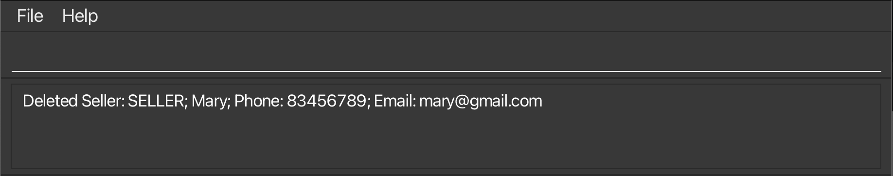
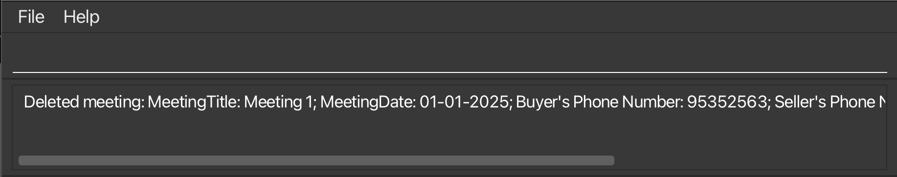

# ClientGrid User Guide

ClientGrid is an address book targeted for English-speaking real estate agents within Singapore to efficiently manage client contacts, properties and meeting schedule. It provides a streamlined way to organize these data while maintaining core address book functionality. The default language of communication in ClientGrid is English.


<!-- * Table of Contents -->
<page-nav-print />

--------------------------------------------------------------------------------------------------------------------

## Quick start

1. Ensure you have Java 17 or above installed in your Computer.

1. Download the latest .jar file from [here](https://github.com/AY2425S1-CS2103T-T16-2/tp/releases).

1. Copy the file to an empty folder that you want to use as the _home folder_ for ClientGrid.

1. Open a command terminal, `cd` into the folder you put the jar file in, and use the `java -jar clientGrid.jar` command to run the application.<br>
   A GUI similar to the below should appear in a few seconds. Note how the app contains some sample data.<br>
   

1. Type the command in the command box and press Enter to execute it. e.g. typing **`help`** and pressing Enter will open the help window.<br>
   Some example commands you can try:

   * `list k/clients` : Lists all clients.

   * `addbuyer n/John p/81234567 e/john@gmail.com` : Adds a buyer whose name is `John`, phone number is `81234567` and email is `john@gmail.com`.

   * `deletebuyer p/81234567` : Deletes the buyer with contact number `81234567`.
   
   * `addproperty c/124894 u/15-20 t/HDB a/600 b/500` : Adds a property with postal code 124894 and unit number #15-20 whose type is a HDB with an ask price of $600 (thousand) and bid price of $500 (thousand).
   
   * `filterproperty t/HDB gte/400 lte/700` : Filters and lists properties which is type HDB and matching price (average of ask and bid prices) is greater than or equal to $400 (thousand) and less than or equal to $700 (thousand).
   
   * `deleteproperty c/124894 u/15-20` : Deletes the property with postal code 124894 and unit number #15-20.

   * `exit` : Exits the app.

1. Refer to the [Features](#features) below for details of each command.

--------------------------------------------------------------------------------------------------------------------

## Features

<box type="info" seamless>

**Notes about the command format:**<br>

* Words in `UPPER_CASE` are the parameters to be supplied by the user.<br>
  e.g. In `addbuyer n/BUYER_NAME p/BUYER_PHONE_NUMBER e/BUYER_EMAIL`, `BUYER_NAME` is a parameter which can be used as `addbuyer n/John p/81234567 e/john@gmail.com`.

* Parameters can be in any order.<br>
  e.g. If the command specifies `n/BUYER_NAME e/BUYER_EMAIL p/BUYER_PHONE_NUMBER`, `e/BUYER_EMAIL p/BUYER_PHONE_NUMBER n/BUYER_NAME` is also acceptable.

* If you are using a PDF version of this document, be careful when copying and pasting commands that span multiple lines as space characters surrounding line-breaks may be omitted when copied over to the application.
</box>

### Viewing help : `help`

Shows a message explaning how to access the help page.


Format: `help`

### Listing ClientGrid records: `list`

Shows a list of all existing buyers, sellers, clients (i.e. buyers and sellers), properties, or meetings in ClientGrid.

Format: `list k/KEY`

* The `list` command displays records based on the specified `KEY`.
* The `KEY` must be one of the following: `buyers`, `sellers`, `clients`, `properties`, or `meetings`.
    * `buyers`: Lists all buyers in the client book.
    * `sellers`: Lists all sellers in the client book.
    * `clients`: Lists all clients (i.e. buyers and sellers combined) in the client book.
    * `properties`: Lists all properties in the property book.
    * `meetings`: Lists all meetings in the meeting book.

* If an invalid `KEY` is provided, an error message will be displayed.

<box type="info" seamless>

**Key Considerations:**

1. Only accepts "buyers", "sellers", "clients", "properties", and "meetings" (case-insensitive) as valid inputs for `k/KEY`.
2. The `KEY` ignores extra/leading/trailing spaces. Extra/leading/trailing spaces will be trimmed, and the input will be converted into an array of words. The `KEY` also ignores UPPER/lower case. All keys will be converted to lower case and checked against the list of valid keys.

</box>

Examples:
* `list k/buyers` displays a list of all existing buyers in ClientGrid.

  

### Adding a buyer : `addbuyer`

Add a specified buyer into the client book of ClientGrid.

Format: `addbuyer n/BUYER_NAME p/BUYER_PHONE_NUMBER e/BUYER_EMAIL`

* Adds a buyer with the specified `BUYER_NAME`, `BUYER_PHONE_NUMBER`, and `BUYER_EMAIL`.
* The `BUYER_NAME` should ignore case sensitivity/extra/leading/trailing spaces and not be empty. Each word is separated by a single space or apostrophes and has a character limit of 747 ([longest name](https://www.guinnessworldrecords.com/world-records/67285-longest-personal-name) in the world is 747 characters). Extra/leading/trailing spaces will be trimmed and the name will be converted into an array of words. All names will be converted to lower case and checked against the client book.
* The `BUYER_PHONE_NUMBER` should only contain 8 numbers in the range [0-9] and can only start with '3', '6', '8' or '9' (as per the format for Singapore phone numbers). Spaces are not allowed between the 8 numbers.
* The `BUYER_EMAIL` should be of the format `local-part@domain-name.top-level-domain` and adhere to the following constraints: 
  * The `local-part` should only contain alphanumeric characters and these special characters, excluding the parentheses, (`+`, `_`, `.`, `-`). 
    * The `local-part` may not start or end with any special characters and must not contain consecutive special characters.
  * This is followed by an `@` and then a `domain-name`. The `domain-name` is made up of domain labels separated by periods.
  * The `domain-name` must:
    * have each domain label start and end with alphanumeric characters.
    * have each domain label consist of alphanumeric characters, separated only by hyphens, if any.
  * The `domain-name` must be followed with a period and end with a `top-level-domain` (TLD) that is at least 2 alphabetic characters long.
  * The `domain-name` with multiple domain labels should be a separated by a single period.
    * e.g. `domain-name` with a single label: `example@gmail.com`.
    * e.g. `domain-name` with multiple labels: `example@u.nus.edu`.
  
<box type="info" seamless>

**Note:**
No duplicate buyers are allowed. Duplicate buyers are checked based on whether there is an existing buyer with the same phone number in the client book.

No duplicate emails are allowed. Duplicate emails are detected if
1. There is a buyer with the same email already in the client book.
2. There is a seller with the same email but a different phone number in the client book. Having the same email address as an existing seller with a different phone number is not allowed as emails should be unique to a client.
</box>

<box type="warning" seamless>

**Special Scenario:** It's possible to have a buyer and seller with the same phone number and email but different names. This flexibility provided by ClientGrid allows users to record the same client under different names in buying and selling roles, which may be useful for clients operating under separate business identities (e.g. personal vs. professional roles).

</box>

Examples:
* `addbuyer n/John p/83456789 e/john@gmail.com` adds a buyer whose name is `John`, phone number is `83456789` and email is `john@gmail.com`.

  

### Adding a seller : `addseller`

Add a specified seller into the client book of ClientGrid.

Format: `addseller n/SELLER_NAME p/SELLER_PHONE_NUMBER e/SELLER_EMAIL`

* Adds a seller with the specified `SELLER_NAME`, `SELLER_PHONE_NUMBER`, and `SELLER_EMAIL`.
* The restrictions for the `SELLER_NAME`, `SELLER_PHONE_NUMBER` and `SELLER_EMAIL` are identical to the restrictions for the `BUYER_NAME`, `BUYER_PHONE_NUMBER` and `BUYER_EMAIL` specified in the [`addbuyer` command](#adding-a-buyer-addbuyer).

<box type="info" seamless>

**Note:** For seller-specific restrictions, please refer to the `addbuyer` command. The same rules apply, including:
- **Duplicate Sellers**: No duplicate sellers are allowed. A duplicate seller is defined as one with the same phone number as an existing seller.
- **Duplicate Emails**: No duplicate emails are allowed, following the same logic as the [`addbuyer` command](#adding-a-buyer-addbuyer):
    1. A seller cannot share the same email as another seller.
    2. A seller cannot have the same email as a buyer with a different phone number. Email uniqueness is enforced per client.

</box>

<box type="warning" seamless>

The **Special Scenario** also applies here: you can have a buyer and seller with the same phone number and email but different names, allowing flexibility for clients who operate under different names in buying and selling roles.

</box>

Examples:
* `addseller n/Mary p/83456789 e/mary@gmail.com` adds a seller whose name is `Mary`, phone number is `83456789` and email is `mary@gmail.com`.

  

### Filtering clients : `filterclient`

Filters the clients that starts with the prefix provided.

Format: `filterclient n/NAME`

* Filters the client with the specified prefix `NAME`.
* The restrictions for the `NAME` is identical to the restrictions for the `BUYER_NAME` specified in the [`addbuyer` command](#adding-a-buyer-addbuyer).

Examples:
* `filterclient n/A` filters the clients that starts with the prefix `A`.

  

### Deleting a buyer : `deletebuyer`

Deletes the specified buyer from the client book of ClientGrid.

Format: `deletebuyer p/BUYER_PHONE_NUMBER`

* Deletes the buyer with the specified `BUYER_PHONE_NUMBER`.
* The restrictions for the `BUYER_PHONE_NUMBER` is identical to the restrictions for the `BUYER_PHONE_NUMBER` specified in the [`addbuyer` command](#adding-a-buyer-addbuyer).

Examples:
* `deletebuyer p/83456789` deletes the buyer with phone number `83456789` from the client book.
  

### Deleting a seller : `deleteseller`

Deletes the specified seller from the client book of ClientGrid.

Format: `deleteseller p/SELLER_PHONE_NUMBER`

* Deletes the seller with the specified `SELLER_PHONE_NUMBER`.
* The restrictions for the `SELLER_PHONE_NUMBER` is identical to the restrictions for the `BUYER_PHONE_NUMBER` specified in the [`addbuyer` command](#adding-a-buyer-addbuyer).

Examples:
* `deleteseller p/83456789` deletes the seller with phone number `83456789` from the client book.

    

### Adding a property : `addproperty`

Adds a specified property into the property book of ClientGrid.

Format: `addproperty c/POSTAL_CODE u/UNIT_NUMBER t/TYPE a/ASK b/BID`

* Adds a property of `TYPE` with the specified `POSTAL_CODE` and `UNIT_NUMBER` with seller's `ASK` price (in thousands) and buyer's `BID` price (in thousands).
* The `POSTAL_CODE` must be a non-negative integer and contain exactly 6 numeric characters.
* The `UNIT_NUMBER` must contain numbers delimited by a dash, and numbers on either side of the dash must be at least 2 characters long with no excess padding. The range of numbers on the **left hand side** of the dash is [00-148] and the **right hand side** is [00-111110].
* The `TYPE` must be one of the following values (case-insensitive): `HDB`, `CONDO`, or `LANDED`.
* The `ASK` must be a non-negative integer smaller than 1,000,000 (thousand) with only numeric characters.
* The `BID` must be a non-negative integer smaller than 1,000,000 (thousand) with only numeric characters.

<box type="info" seamless>

**Note:**
No duplicate properties are allowed. Duplicate properties are checked based on:

1. if at least one of the two properties are `LANDED`, then the comparison is done based on postal code.
2. if one property is a `CONDO` and one property is a `HDB`, then the comparison is done based on postal code.
3. if the two properties are both `CONDO` or are both `HDB`, then the comparison is done based on postal code and unit.
</box>
<box type="warning" seamless>

**Unit Defaults:**
The Unit parameter for `LANDED` properties will default to `00-00` regardless of the unit value placed. This is because, a landed property is not segmented into multiple apartments and therefore, deemed to be a unit in itself.
</box>

Examples:
* `addproperty c/124894 u/15-20 t/HDB a/600 b/500` : Adds a property with postal code `124894` and unit number `#15-20` whose type is a `HDB` with an ask price of `$600 (thousand)` and bid price of `$500 (thousand)`.

  

### Filtering properties : `filterproperty`

Filters the properties based on any combination of type, lower bound for matching price and upper bound for matching price.

Format: `filterproperty [t/TYPE] [gte/MATCHING_PRICE] [lte/MATCHING_PRICE]`

* Filters the properties with any combination of `TYPE`, lower bounded `MATCHING_PRICE` and upper bounded `MATCHING_PRICE`.
* The `TYPE` is case-insensitive: `HDB`, `CONDO` or `LANDED`.
* The `MATCHING_PRICE` is a non-negative integer (i.e. no non-numeric symbols such as decimal points, currency symbols, etc.).

<box type="definition" seamless>

**Matching Price:** The true price of the property given by the average of the property's lowest `ASK` price and highest `BID` price.
</box>
<box type="warning" seamless>

**Important**
1. At least one optional prefix needs to be present for any filtering to be possible.
2. Prices denoted in `gte/` and `lte/` parameters are checked based on the 'AND' condition. For example, `filterproperty gte/500 lte/60000` filters for properties greater than or equal to `$500 (thousand)` and less than or equal to `$60,000 (thousand)`.
</box>

Examples:
* `filterproperty t/HDB gte/400 lte/700` : Filters and lists properties which is type `HDB` and matching price is greater than or equal to `$400 (thousand)` and less than or equal to `$700 (thousand)`.

  

### Deleting a property : `deleteproperty`

Deletes a specified property from the property book of ClientGrid.

Format: `deleteproperty c/POSTAL_CODE u/UNIT_NUMBER`

* Deletes a property with the specified `POSTAL_CODE` and `UNIT_NUMBER`.
* The restrictions for the `POSTAL_CODE` and `UNIT_NUMBER` are identical to the restrictions for the `POSTAL_CODE` and `UNIT_NUMBER` specified in the [`addproperty` command](#adding-a-property-addproperty).

Examples:
* `deleteproperty c/123456 u/01-01` deletes a property with postal code `123456` and unit number `01-01`.

  

### Adding a meeting : `addmeeting`

Adds a specified meeting to the meeting book of ClientGrid.

Format: `addmeeting mt/MEETING_TITLE d/MEETING_DATE bp/BUYER_PHONE sp/SELLER_PHONE t/TYPE c/POSTAL_CODE`

* Adds a meeting with the specified `MEETING_TITLE` and `MEETING_DATE`, including the provided `BUYER_PHONE`, `SELLER_PHONE`, as well as the `POSTAL_CODE` and `TYPE` of the property involved.
* The `MEETING_TITLE` should only contain alphanumeric characters and spaces. It should not be blank (or contain only whitespaces) and it should not exceed 100 characters (excluding starting and ending whitespaces).
* The `MEETING_DATE` should be in the format dd-MM-yyyy and must be a valid date that is today or in the future.
* The restrictions for the `BUYER_PHONE` and `SELLER_PHONE` are identical to the restrictions for the `BUYER_PHONE_NUMBER` specified in the [`addbuyer` command](#adding-a-buyer-addbuyer).
* The restrictions for the `POSTAL_CODE` and `TYPE` are identical to the restrictions for the `POSTAL_CODE` and `TYPE` specified in the [`addproperty` command](#adding-a-property-addproperty).

<box type="info" seamless>

**Note:**
* `BUYER_PHONE` refers to a buyer's phone number. There must be an existing buyer in the client book that has a phone number that is equal to the `BUYER_PHONE`.
* `SELLER_PHONE` refers to a seller's phone number. Likewise, there must be an existing seller in the client book with a phone number equal to `SELLER_PHONE`.
* `POSTAL_CODE` refers to a postal code. The postal code must belong to some existing property in the property book of the specified `TYPE`.
</box>

Examples:
* `addmeeting mt/Meeting 1 d/01-01-2025 bp/95352563 sp/87652533 t/HDB c/123456` adds a meeting with meeting title `Meeting 1`, meeting date `01-01-2025`, buyer's phone number `95352563`, seller's phone number `87652533`, property type `HDB` and postal code `321456`.

  

### Deleting a meeting : `deletemeeting`

Deletes a specified meeting from the meeting book of ClientGrid.

Format: `deletemeeting mt/MEETING_TITLE d/MEETING_DATE`

* Deletes a meeting with the specified `MEETING_TITLE` and `MEETING_DATE`.
* The restrictions for the `MEETING_TITLE` and `MEETING_DATE` are identical to the restrictions for the `MEETING_TITLE` and `MEETING_DATE` specified in the [`addmeeting` command](#adding-a-meeting-addmeeting).


Examples:
* `deletemeeting mt/Meeting 1 d/01-01-2025` deletes a meeting with meeting title `Meeting 1` and meeting date `01-01-2025`.

  

### Exiting the program : `exit`

Exits the program.

Format: `exit`

### Saving the data

ClientGrid data are saved in the hard disk automatically after any command that changes the data. There is no need to save manually.

### Editing the data file

Client, meeting, and property data are automatically saved as separate JSON files in `[JAR file location]/data/`:
- `clientbook.json` for client (i.e. buyers and sellers) entries
- `meetingbook.json` for meeting entries
- `propertybook.json` for property entries

```css
📁 [JAR file location]
└── 📁 data
    ├── clientbook.json
    ├── meetingbook.json
    └── propertybook.json
```
Advanced users are welcome to directly update data by editing these individual files in the data directory.

<box type="warning" seamless>

**Caution:**
If your changes to the data files make its format invalid, ClientGrid will discard all data and start with an empty data file at the next run.  Hence, it is recommended to take a backup of the file before editing it.<br>

Furthermore, certain edits can cause ClientGrid to behave in unexpected ways (e.g. if a value entered is outside the acceptable range). Therefore, user are cautioned to only edit the data files if you are confident that you can update it correctly.
</box>


--------------------------------------------------------------------------------------------------------------------

## FAQ

**Q**: Can buyers and sellers have the same phone number?<br>
**A**: Yes. A single client can be both a buyer and a seller of properties and can use the same phone number in both roles. However, two different buyers or two different sellers cannot share the same phone number.

--------------------------------------------------------------------------------------------------------------------

## Known issues

1. **When using multiple screens**, if you move the application to a secondary screen, and later switch to using only the primary screen, the GUI will open off-screen. The remedy is to delete the `preferences.json` file created by the application before running the application again.

--------------------------------------------------------------------------------------------------------------------

## Command Summary

| Action                | Format, Examples                                                                                 |
|-----------------------|--------------------------------------------------------------------------------------------------|
| **Help**              | `help`                                                                                           |
| **List**              | `list k/KEY`                                                                                     |
| **Add Buyer**         | `addbuyer n/BUYER_NAME p/BUYER_PHONE_NUMBER e/BUYER_EMAIL`                                       |
| **Add Seller**        | `addseller n/SELLER_NAME p/SELLER_PHONE_NUMBER e/SELLER_EMAIL`                                   |
| **Filter Clients**    | `filterclient n/NAME`                                                                            |
| **Delete Buyer**      | `deletebuyer p/BUYER_PHONE_NUMBER`                                                               |
| **Delete Seller**     | `deleteseller p/SELLER_PHONE_NUMBER`                                                             |
| **Add Property**      | `addproperty c/POSTAL_CODE u/UNIT_NUMBER t/TYPE a/ASK b/BID`                                     |
| **Filter Properties** | `filterproperty [t/TYPE] [gte/MATCHING_PRICE] [lte/MATCHING_PRICE]`                                    |
| **Delete Property**   | `deleteproperty c/POSTAL_CODE u/UNIT_NUMBER`                                                     |
| **Add Meeting**       | `addmeeting mt/MEETING_TITLE d/MEETING_DATE bp/BUYER_PHONE sp/SELLER_PHONE t/TYPE c/POSTAL_CODE` |
| **Delete Meeting**    | `deletemeeting mt/MEETING_TITLE d/MEETING_DATE`                                                  |
| **Exit**              | `exit`                                                                                           |


