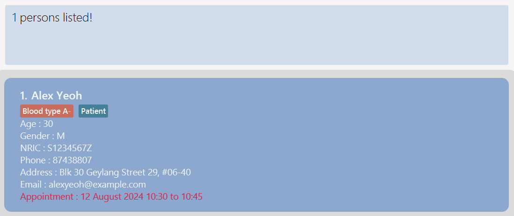

ClinicBuddy aims to enhance the patient management process for small clinics, creating a platform to track patient
information such as their treatment, contact information, visit records and future appointments while still having the
benefits of a Graphical User Interface (GUI).

* Table of Contents
  {:toc}

--------------------------------------------------------------------------------------------------------------------

## Quick start

1. Ensure you have Java `17` or above installed in your Computer.

1. Download the latest `.jar` file from [here](https://github.com/AY2425S1-CS2103T-F11-3/tp/releases).

1. Copy the file to the folder you want to use as the _home folder_ for your AddressBook.

1. Open a command terminal, `cd` into the folder you put the jar file in, and use the `java -jar clinicbuddy.jar` command to run
   the application.<br>

   A GUI similar to the below should appear in a few seconds. Note how the app contains some sample data.<br>
   

1. Type the command in the command box and press Enter to execute it. e.g. typing **`help`** and pressing Enter will
   open the help window.<br>
   Some example commands you can try:

    * `list` : Lists all contacts.

    * `add n/John Doe a/36 g/M i/S1234567Z p/98765432 e/johnd@example.com h/311, Clementi Ave 2, #02-25 apt/02/10/2024 18:30 t/Patient` :
      Adds a patient named `John Doe` whose appointment is at `02 October 2024 18:30` to ClinicBuddy.

    * `delete S1234567Z` : Deletes the patient with the NRIC 'S1234567Z' in the current list.

    * `clear` : Deletes all contacts.

    * `exit` : Exits the app.

    * `backup` : Creates a backup of the current patient records.

    * `restore` : Restores patient records from the most recent backup.

    * `find S1234567Z` : Finds the patient that has the NRIC

    * `find John` : Finds the patient named 'John'

    * `update S1234567Z p/91234567 e/johndoe@example.com` : Updates the email address of the patient with provided NRIC.

    * `update 1 p/91234567 e/johndoe@example.com` : Updates the email address of the first patient in the list.

1. Refer to the [Features](#features) below for details of each command.

--------------------------------------------------------------------------------------------------------------------

## Features

<div markdown="block" class="alert alert-info">

**:information_source: Notes about the command format:**<br>

* Words in `UPPER_CASE` are the parameters to be supplied by the user.<br>
  e.g. in `add n/NAME`, `NAME` is a parameter which can be used as `add n/John Doe`.

* Items in square brackets are optional.<br>
  e.g `n/NAME [t/TAG]` can be used as `n/John Doe t/friend` or as `n/John Doe`.

* Items with `…`​ after them can be used multiple times including zero times.<br>
  e.g. `[t/TAG]…​` can be used as ` ` (i.e. 0 times), `t/friend`, `t/friend t/family` etc.

* Parameters can be in any order.<br>
  e.g. if the command specifies `n/NAME p/PHONE_NUMBER`, `p/PHONE_NUMBER n/NAME` is also acceptable.

* Extraneous parameters for commands that do not take in parameters (such as `help`, `list`, `exit` and `clear`) will be
  ignored.<br>
  e.g. if the command specifies `help 123`, it will be interpreted as `help`.

* If you are using a PDF version of this document, be careful when copying and pasting commands that span multiple lines
  as space characters surrounding line-breaks may be omitted when copied over to the application.

</div>

### Viewing help : `help`

Shows a message explaining how to access the help page.


Format: `help`

### Adding a person: `add`

Adds a person to the address book.

Format: `add n/NAME a/AGE g/GENDER i/NRIC c/CONTACT_NUMBER e/EMAIL h/ADDRESS [apt/APPOINTMENT] [t/TAG]…​`

<div markdown="span" class="alert alert-primary">:bulb: **Tip:**
A person can have any number of tags (including 0)
</div>

Examples:

* `add n/John Doe a/36 g/M i/S1234567Z p/98765432 e/johnd@example.com h/311, Clementi Ave 2, #02-25 apt/02/10/2024 18:30 t/Patient`
* `add n/Betsy Crowe a/42 g/F i/T1235678E apt/02-10-2024 18:30 t/friend e/betsycrowe@example.com a/Newgate Prison p/1234567 t/BloodDonor`

<div markdown="span" class="alert alert-primary">:bulb: **Tip:**
An appointment can be entered in the following formats : '-' , '02 10 2024 12:30' , '02/10/2024 12:30' , '02-10-2024 12:30'
</div>
<div markdown="span" class="alert alert-primary">:bulb: **Tip:**
Appointments can only be made between '08:30' to '21:30' and only one appointment can be made per timeslot
</div>

### Listing all persons : `list`

Shows a list of all persons in the address book.

Format: `list`

### Updating a person : `update`

Updates an existing person in the address book by searching for their index or NRIC.

Format: 
`update INDEX [n/NAME] [a/AGE] [g/GENDER] [i/NRIC] [p/PHONE] [e/EMAIL] [h/ADDRESS] [apt/APPOINTMENT] [t/TAG]…​ `  
OR `update NRIC [n/NAME] [a/AGE] [g/GENDER] [i/NRIC] [p/PHONE] [e/EMAIL] [h/ADDRESS] [apt/APPOINTMENT] [t/TAG]…​`

* Edits the person at the specified `INDEX` or `NRIC`. The index and NRIC refers to the index number and NRIC shown in the displayed person list respectively.
* At least one of the optional fields must be provided.
* Existing values will be updated to the input values.
* When editing tags, the existing tags of the person will be removed i.e adding of tags is not cumulative.
* You can remove all the person’s tags by typing `t/` without
  specifying any tags after it.

Examples:
* `update 1 p/91234567 e/johndoe@example.com` Updates the phone number and email address of the 1st person to be `91234567`
  and `johndoe@example.com` respectively.
* `update 2 n/Betsy Crower t/` Updates the name of the 2nd person to be `Betsy Crower` and clears all existing tags.

* `update S1234567Z p/91234567 e/johndoe@example.com` Updates the phone number and email address of the person whose NRIC is 'S1234567Z' to be `91234567`
  and `johndoe@example.com` respectively.

### Locating persons: `find`

`find` allows you to find patient records by NRIC or name.

#### Finding a single record by its NRIC

Format: `find NRIC`

* The search is case-insensitive. e.g `s1234567z` will match `S1234567Z`
* The NRIC must start with 'S', 'T', 'F','G' or 'M', have 7 digits, and end with a letter.
* In a single command, only one record with the given NRIC can be found. e.g. `find S1234567Z T7654321Z` does not work
  as it
  attempts to find 2 records containing the given NRICs.
* Only full NRICs will be matched e.g. `S12345` will not match `S1234567Z`

Example:

* `find S1234567Z` returns the patient record whose NRIC is `S1234567Z`

  

#### Finding multiple records by their names

Finds patient records whose names contain any of the given keywords.

Format: `find KEYWORD [MORE_KEYWORDS]`

* The search is case-insensitive. e.g `hans` will match `Hans`
* The order of the keywords does not matter. e.g. `Hans Bo` will match `Bo Hans`
* Only the name is searched.
* Only full words will be matched e.g. `Han` will not match `Hans`
* Persons matching at least one keyword will be returned (i.e. `OR` search).
  e.g. `Hans Bo` will return `Hans Gruber`, `Bo Yang`

Examples:

* `find John` returns `john` and `John Doe`
* `find alex david` returns `Alex Yeoh`, `David Li`<br>
  

### Deleting a person : `delete`

Deletes the specified person from the address book.

Format: `delete NRIC`

* Deletes the person that has the specified `NRIC`.
* The NRIC refers to the NRIC shown in the displayed person list.
* The NRIC **must start with 'S', 'T', 'F','G' or 'M', have 7 digits, and end with a letter.**

Examples:

* `list` followed by `delete S1234567Z` deletes the patient that has NRIC of 'S1234567Z' in the list.
* `find Betsy` followed by `delete S2345678E` deletes the person with 'S2345678E' in the results of the `find` command.

### Finding all persons with appointments on a specific date : `bookings`

Finds all persons with appointments on the specified date.

Format: `bookings DATE`

* Finds all persons with appointments on `DATE`
* `DATE` has to be of the format `dd/MM/yyyy` OR `dd-MM-yyyy` OR `dd MM yyyy`

Examples:
* `bookings 01/02/2024`
* `bookings 01-02-2024`

  

### Clearing all entries : `clear`

Clears all entries from the address book.

Format: `clear`

### Exiting the program : `exit`

Exits the program.

Format: `exit`

### Saving the data

AddressBook data are saved in the hard disk automatically after any command that changes the data. There is no need to
save manually.

### Editing the data file

AddressBook data are saved automatically as a JSON file `[JAR file location]/data/addressbook.json`. Advanced users are
welcome to update data directly by editing that data file.

<div markdown="span" class="alert alert-warning">:exclamation: **Caution:**
If your changes to the data file makes its format invalid, AddressBook will discard all data and start with an empty data file at the next run. Hence, it is recommended to take a backup of the file before editing it.<br>
Furthermore, certain edits can cause the AddressBook to behave in unexpected ways (e.g., if a value entered is outside of the acceptable range). Therefore, edit the data file only if you are confident that you can update it correctly.
</div>

### Backup the records : `backup`

The `backup` feature ensures your data is safe by **automatically creating backups** whenever patient records are
modified. Backups are stored in the `backups` folder located in the root directory of the application.

#### **How Automatic Backups Works:**

- Each time the patient records are modified (e.g., adding, editing, or deleting a record), the system **automatically** creates a backup.
- The program retains **only the 10 most recent backups** to manage storage effectively.
- Older backups are automatically deleted when the limit is exceeded.
- These backups are stored in:
  ```
  [Application Directory]/backups/
  ```
- Naming Format:
  ```
  clinicbuddy-backup-[timestamp].json
  ```
- Example:
  ```
  clinicbuddy-backup-2024-10-16_00-00-38-083.json
  ```

#### **Accessing Backup Files:**

1. Navigate to the backup directory:
   ```
   [Application Directory]/backups/
   ```
2. Identify the backup files using their **timestamp-based naming convention**.
3. **Move or copy** the files if needed for external storage or manual restoration.

### Restoring data from backups : `restore`

The `restore` feature allows you to recover patient records from the most recent backup file or a specific backup file by its name. This is useful in case of unintended data loss or errors.

Format: `restore`

#### **How Restore Works:**

1. **Restore from the Most Recent Backup:**
- When you execute the `restore` command, ClinicBuddy will restore the patient records from the most recent backup file located in the `/backups/` directory.
- Command Format:
  ```
  restore
  ```
2. **Restore from a specific backup file**
- Command format:
  ```
  restore <file_path>
  ```
- Example:
  ```
  restore backups/clinicbuddy-backup-2024-10-21_22-22-52_123.json
  ```
- This will restore the application to the state saved in that specific backup file. If no file path is provided, it will restore from the second most recent backup by default.

#### **Important Notes:**

- Restoring from a backup will **overwrite** the current patient records in ClinicBuddy.
- Ensure that you want to discard any changes made since the last backup before performing a restore.
- The `restore` command will restore the entire set of patient records from the backup.
- It is not possible to restore individual records.

#### **After Restoring:**

- After the restore operation, ClinicBuddy will display a message indicating that the data has been successfully restored from the backup.
- All patient records will reflect the state they were in at the time of the backup.


### Archiving data files `[coming in v2.0]`

_Details coming soon ..._

--------------------------------------------------------------------------------------------------------------------

## FAQ

**Q**: How do I transfer my data to another Computer?<br>
**A**: Install the app in the other computer and overwrite the empty data file it creates with the file that contains
the data of your previous AddressBook home folder.

**Q**: Why Use Manual Backups?<br>
**A**:

- **Extra Control:** Save your data at any moment, even without making changes.
- **Checkpointing:** Use manual backups before importing new data or making major changes.
- **Peace of Mind:** Ensure you have a backup exactly when you need it.

**Q**: Can I Save Backups to a Custom Path?<br>
**A**: Currently, manual backups are saved to the **default path** (`/backups` folder). There is no option to specify a
**custom path** within the application. However, you can **move the backup files** manually from the `/backups` folder
to any desired location if needed.


--------------------------------------------------------------------------------------------------------------------

## Known issues

1. **When using multiple screens**, if you move the application to a secondary screen, and later switch to using only
   the primary screen, the GUI will open off-screen. The remedy is to delete the `preferences.json` file created by the
   application before running the application again.
2. **If you minimize the Help Window** and then run the `help` command (or use the `Help` menu, or the keyboard
   shortcut `F1`) again, the original Help Window will remain minimized, and no new Help Window will appear. The remedy
   is to manually restore the minimized Help Window.

--------------------------------------------------------------------------------------------------------------------

## Command summary

 Action     | Format, Examples                                                                                                                                 
------------|--------------------------------------------------------------------------------------------------------------------------------------------------
 **Add**    | `add n/NAME a/AGE g/GENDER i/NRIC c/CONTACT_NUMBER e/EMAIL h/ADDRESS [apt/APPOINTMENT] [t/TAG]…​` <br> e.g., `add n/John Doe a/36 g/M i/S1234567Z p/98765432 e/johnd@example.com h/311, Clementi Ave 2, #02-25 apt/12/10/2024 15:30 t/Patient`                                     
 **Clear**  | `clear`                                                                                                                                          
 **Delete** | `delete NRIC`<br> e.g., `delete S1234567Z`                                                                                                       
 **Update**   | `update INDEX/NRIC [n/NAME] [a/AGE] [g/GENDER] [i/NRIC] [p/PHONE] [e/EMAIL] [h/ADDRESS] [apt/APPOINTMENT] [t/TAG]…​`<br> e.g.,`edit 2 n/James Lee e/jameslee@example.com` 
 **Find**   | `find KEYWORD [MORE_KEYWORDS]`<br> e.g., `find James Jake`                                                                                       
 **List**   | `list`                                                                                                                                           
 **Help**   | `help`                                                                                                                                           
| **Backup** | `backup` <br> e.g., `backup` creates a new backup of the patient records.                                                                        |
**Restore** | `restore`<br> e.g., `restore` restores patient records from the most recent backup file.

