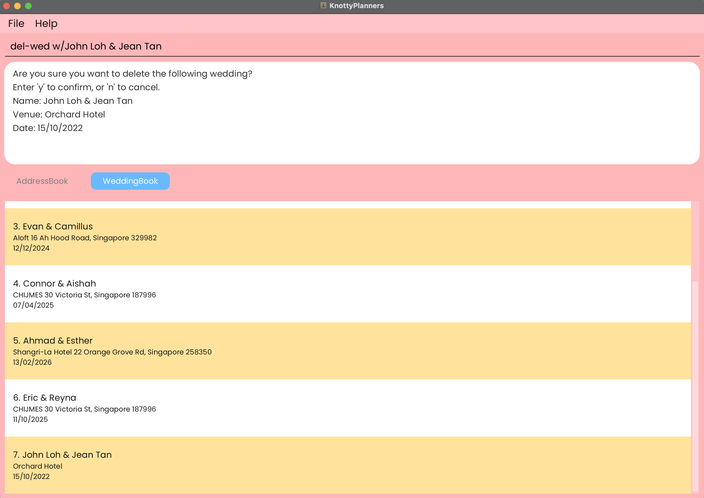
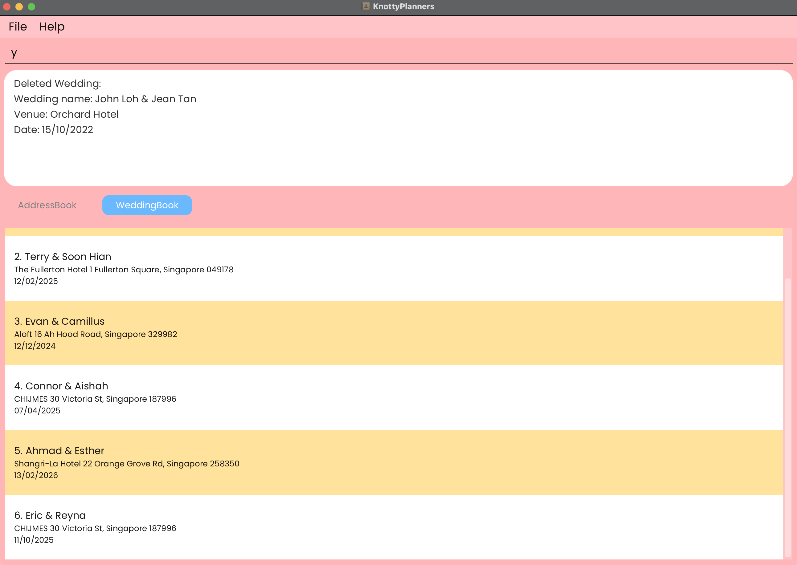
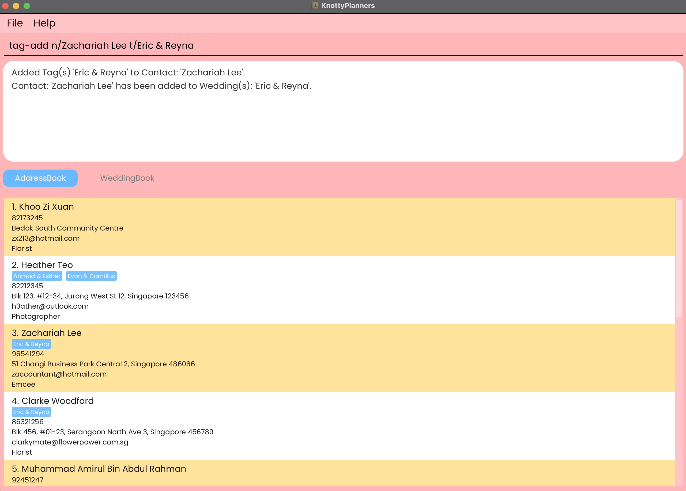
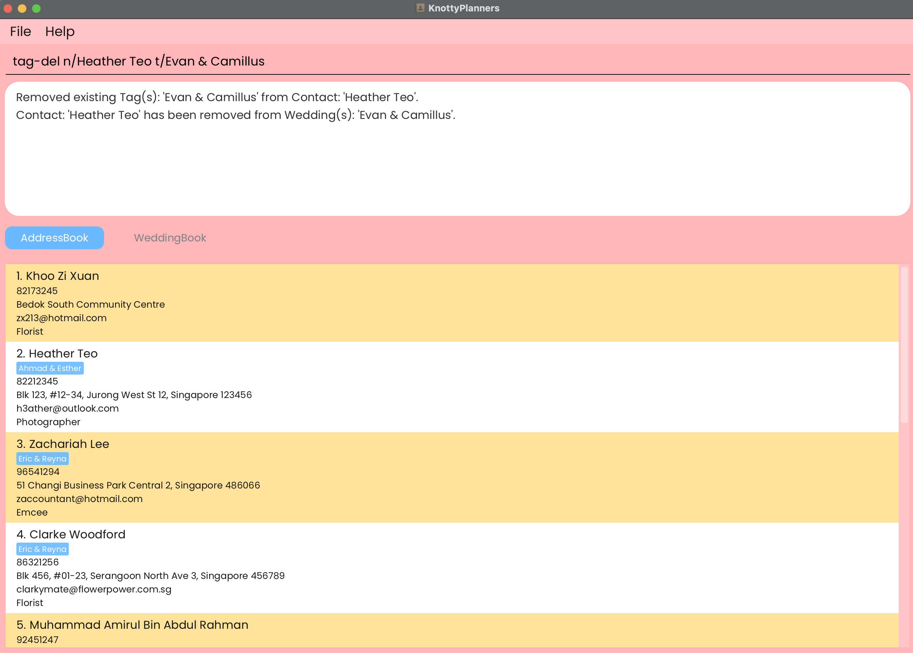

# Knotty Planner 💍🎀

Knotty Planner is a **desktop app for wedding planners, optimised for use via a Command Line Interface** (CLI) while still having the benefits of a Graphical User Interface (GUI). If you are a wedding planner who can type fast, Knotty Planner can make organising weddings a walk in the park!

_Command Line Interface (CLI) allows you to type text commands to perform specific tasks quickly and efficiently._

<!-- * Table of Contents -->
## Table of Contents
- [Quick Start](#quick-start)
- [Command Summary](#command-summary)
- [Features](#features)
- [FAQ](#faq)
- [Known Issues](#known-issues)

<page-nav-print />

--------------------------------------------------------------------------------------------------------------------

## Quick Start (Non-technical Users)

1. Open up the command prompt (in Windows) or terminal (in MacBook) on your computer.

2. Type in `java -version` and hit enter.

3. If your version of Java is 17 and above, skip to step 6. If it is less than 17, click [here](https://www.oracle.com/java/technologies/javase/jdk17-archive-downloads.html) to download Java 17.

4. For Windows users, download the Windows x64 Installer. For MacBook users, download the macOS Arm 64 DMG Installer. Follow the respective installation guides.

5. After successfully completing the installation, repeat steps 1 to 3 to ensure that you have Java 17.

6. Download the latest `KnottyPlanner.jar` file under the Assets tab from [here](https://github.com/AY2425S1-CS2103T-W13-4/tp/releases).

7. Create a new folder in your Desktop and copy the `KnottyPlanner.jar` file into that folder.

8. Repeat step 1 to open up a new terminal.

9. Type in `cd Desktop\NEW_FOLDER_NAME` where `NEW_FOLDER_NAME` is the name of the folder you created in step 7 and hit enter.

10. Type in `java -jar KnottyPlanner.jar` and hit enter to run the application.

11. You can refer to the [Command Summary](#command-summary) for an overview of the available commands. If you need more information, the [Features](#features) section below contains more details regarding each command.

## Quick Start (Technical Users)

1. Ensure you have Java `17` or above installed in your Computer.

2. Download the latest `.jar` file from [here](https://github.com/AY2425S1-CS2103T-W13-4/tp/releases).

3. Copy the file to the folder you want to use as the _home folder_ for your Knotty Planner.

4. Open a command terminal, `cd` into the folder you put the jar file in, and use the `java -jar KnottyPlanner.jar` command to run the application.

5. You can refer to the [Command Summary](#command-summary) for an overview of the available commands. If you need more information, the [Features](#features) section below contains more details reagarding each command.

--------------------------------------------------------------------------------------------------------------------
## Command summary

| Action                                                    | Format, Examples                                                                                                                                                                             |
|-----------------------------------------------------------|----------------------------------------------------------------------------------------------------------------------------------------------------------------------------------------------|
| **[Add](#adding-a-person-add)**                           | `add n/NAME p/PHONE_NUMBER e/EMAIL a/ADDRESS j/JOB [t/TAG]`   e.g., `add n/James Ho p/22224444 e/jamesho@example.com a/123, Clementi Rd, 1234665 j/Photographer t/June and James 16 June` |
| **[Delete](#deleting-a-contact--del-followed-by-y-or-n)** | `del n/NAME` followed by `y` or `n`  e.g., `delete n/John Doe` followed by `y`                                                                                                            |
| **[List](#listing-all-contacts--list)**                   | `list`                                                                                                                                                                                       |
| **[Edit](#editing-a-contact--edit)**                      | `edit n/NAME [new/NEW_NAME] [p/NEW_PHONE] [e/NEW_EMAIL] [a/NEW_ADDRESS] [j/NEW_JOB]`  e.g.,`edit n/John new/James Lee e/jameslee@example.com`                                             |
| **[Add Wedding](#adding-a-wedding-add-wed)**              | `add-wed w/NAME & NAME v/VENUE d/DATE`   e.g., `add w/ John & June v/Orchard Hotel d/12/12/2030`                                                                                          |
| **[Delete Wedding](#deleting-a-wedding-del-wed)**         | `del-wed w/NAME & NAME` followed by `y` or `n`                                                                                                                                               |
| **[Clear](#clearing-all-entries--clear-ab--clear-wb)**    | `clear-ab` for address book or `clear-wb` for wedding book followed by `y` or `n`                                                                                                            |
| **[Adding Tags](#tagging-a-contact--tag-add--tag-del)**   | `tag-add n/NAME t/TAG...`   e.g., `tag-add n/John Doe t/June & James`                                                                                                                     |
| **[Deleting Tags](#tagging-a-contact--tag-add--tag-del)** | `tag-del n/NAME t/TAG...`   e.g., `tag-del n/John Doe t/June & James`                                                                                                                     |
| **[Filter](#filtering-contacts-by-job-filter)**           | `filter n/KEYWORD` or `filter j/KEYWORD`  e.g., `filter n/John` or `filter j/Photographer`                                                                                                |
| **[View Wedding](#view-wedding-view-wed)**                | `view-wed NAME & NAME`   e.g., `view-wed John & Sarah`                                                                                                                                    |
| **[List Weddings](#listing-all-contacts--list)**          | `list-wed`                                                                                                                                                                                   |
| **[Help](#viewing-help--help)**                           | `help`                                                                                                                                                                                       |
| **[Exit](#exiting-the-program--exit)**                    | `exit`                                                                                                                                                                                       |

--------------------------------------------------------------------------------------------------------------------
## Features

<box type="info" seamless>

**Notes about the command format:** 

* Words in `UPPER_CASE` are the parameters to be supplied by the user. 
  e.g. in `add n/NAME`, `NAME` is a parameter which can be used as `add n/John Doe`.

* Tags in Knotty Planners are used exclusively to tag person to wedding, hence both wedding name and tag names should be 2 person names separated with a & (e.g. `John Loh & Jean Tan`, `Stacy & Sam`).

* Items with `…`​ after them can be used multiple times including zero times. 
  e.g. `[t/TAG]…​` can be used as ` ` (i.e. 0 times), `John Loh & Jean Tan`,, `Stacy & Sam` etc.

* Parameters can be in any order. 
  e.g. if the command specifies `n/NAME p/PHONE_NUMBER`, `p/PHONE_NUMBER n/NAME` is also acceptable.

* Extraneous parameters for commands that do not take in parameters (such as `help`, `list`, `exit` and `clear`) will be ignored. 
  e.g. if the command specifies `help 123`, it will be interpreted as `help`.

* If you are using a PDF version of this document, be careful when copying and pasting commands that span multiple lines as space characters surrounding line-breaks may be omitted when copied over to the application.
  </box>

### Viewing Help : `help`

You can view a popup with an overview of all commands, and also a link to this user guide if you need more details.

Format: `help`

### Adding a Contact: `add`

You can add a person to the list of contacts.

Format: `add n/NAME p/PHONE_NUMBER e/EMAIL a/ADDRESS j/JOB [t/TAG]`

* A person can have any number of tags (including 0). Tags are associated to the weddings this person is
  involved in. Weddings must already exist in the wedding book to successfully tag a person to a wedding.
  
* To make adding a person easier, Knotty Planner will format their names for you! Person name will be automatically capitalised and separated with 1 space. Trailing spaces and extra space in between will be removed.
  
  Examples:`john doe`, `JOHN    doe` will all be formatted to `John Doe`

<box type="important" seamless>

**IMPORTANT:**

* If you are worried about adding duplicated people, fret not! Knotty Planner will alert you when an identical person is added
* We will also alert you when you add a different person with the same name, we need your help to change their input name in these situations 😊

</box>

Examples:
* `add n/John Doe p/98765432 e/johnd@example.com a/John street, Blk 123, #01-04 j/Photographer`
* `add n/Betsy Crowe p/90341259 e/betsycrowe@example.com a/Newgate Center j/Caterer t/Stacy & Sam`

### Deleting a Contact : `del` followed by `y` or `n`

You can delete a person from your list of contacts.

Format: `del n/NAME` followed by `y` or `n`

* Deletes the person with the specified `NAME` from the address book.
* The contact's details are shown for confirmation.
* The contact is deleted if `y` is entered.
* The contact is not deleted if `n` is entered, cancelling the delete operation and nothing will occur.

<box type="important" seamless>

**IMPORTANT:** `del n/NAME` MUST BE followed by either of the two commands, otherwise, following delete commands may be affected.

</box>

  

    
    
Confirmation Prompt

  

  

    
    
Success

  

  

    
    
Cancel Operation

  

Examples:
* `del n/John Doe` followed by `y` deletes the person named `John Doe` from the address book.
* `del n/John Doe` followed by `n` cancels the delete operation.

### Editing a Contact : `edit`

You can edit an existing contact's details (name, phone number, email, address and job).

Format: `edit n/NAME [new/NEW_NAME] [p/NEW_PHONE] [e/NEW_EMAIL] [a/NEW_ADDRESS] [j/NEW_JOB]`

* You have to provide at least one of the optional fields.
* If you accidentally type the name of the contact in all capitals or add one too many spaces, don't worry! Knotty Planner will
  automatically format the name by removing the extra spacing and correctly capitalizing it 🤩

<box type="important" seamless>

**IMPORTANT:** Tags can't be edited, so if you'd like to change a tag, simply delete the existing one using
['tag-del'](#deleting-tags-from-a-contact) and add a new one using ['tag-add'](#adding-tags-to-a-contact)!

</box>

   

    
    
Before

  

  

    
    
After

  

Examples:
*  `edit n/John Doe p/91234567 e/johndoe@example.com` Edits the phone number and email address of John Doe to be
   `91234567` and `johndoe@example.com` respectively.
*  `edit n/James new/Clark e/clarknewemail@example.com j/Florist` Edits the name, email and job to be
   `James`, `clarknewemail@example.com` and `Florist` respectively.

### Listing All Contacts : `list`

You can now view all contacts in the order they were added in!

Format: `list`

### Adding a Wedding: `add-wed`

You can add a wedding to the list of weddings.

Format: `add-wed w/NAME & NAME v/VENUE d/DATE`

* If you are worried about adding duplicated weddings, fret not! Knotty Planner will alert you when an identical wedding is added.
* We will also alert you when you add a different wedding with the same name, we need your help to change their input name in these situations 😊.
* To make adding a wedding easier, Knotty Planner will format the names for you! Wedding names will be automatically capitalised and separated with 1 space. Trailing spaces and extra space in between will be removed.

<box type="important" seamless>

**IMPORTANT:** Date must be a valid date in the format of **dd/MM/yyyy**.

</box>

Examples: `john & jane`, `JOHN   & jane` will all be formatted to `John & Jane`.

Examples:
* `add-wed w/John Loh & Jean Tan v/Orchard Hotel d/15/10/2022`
* `add-wed w/Jonus Ho & Izzat Syazani v/Pasir Ris Hotel d/02/11/2022`

### Deleting a Wedding: `del-wed`

You can delete a wedding from your list of weddings.

* Deletes the wedding with the specified `NAME & NAME` from the address book.
* The wedding's details are shown for confirmation.
* The wedding is deleted if `y` is entered.
* The wedding is not deleted if `n` is entered, cancelling the delete operation and nothing will occur.

Format: `del-wed w/NAME & NAME` followed by `y` or `n`

<box type="important" seamless>

**IMPORTANT:** `del-wed w/NAME & NAME` MUST BE followed by either of the two commands, otherwise, following delete commands may be affected.

</box>

  

    
    
Confirmation Prompt

  

  

    
    
Success

  

  

    
    
Cancel Operation

  

Examples:
* `del-wed w/John Loh & Jean Tan` followed by `y` deletes the wedding named `John oh & Jean Tan` from the address book.
* `del-wed w/Jonus Ho & Izzat Syazani` followed by `n` cancels the delete operation.

### Listing All Weddings : `list-wed`

You can now view all weddings in the order they were added in!

Format: `list-wed`

### Tagging a Contact : `tag-add` / `tag-del`

### Adding Tag(s) to a Contact
If you need to add your contacts to a particular wedding, you can use `tag-add` to add them to the wedding.

Format: `tag-add n/NAME t/TAG...`

<box type="warning" seamless>

**TAKE NOTE:** 

* The wedding must already exist in the wedding book to successfully tag a person to a wedding.

* The name of the tag must match the wedding that you want to add the contact to.

* You can add one contact to multiple weddings in one go by specifying multiple tags in your command.

</box>

    

        
        
Before

    

    

        
        
After

    

Examples:
*  `tag-add n/John Doe t/Adam and Steve` Adds the tag `Adam and Steve` to John Doe.
*  `tag-add n/Betsy Crower t/Lacy & Bacy t/Peter & Mary t/Jonny & Bonny` Adds the tags `Lacy & Bacy`, `Peter & Mary`, and `Jonny & Bonny` to Betsy Crower.

### Deleting Tag(s) from a Contact
If you need to remove your contacts from a particular wedding, you can use `tag-del` to remove them from the wedding.

Format: `tag-del n/NAME t/TAG...`

* The name of the tag must match the wedding that you want to delete the contact from.

* You can remove a contact from multiple weddings in one go by specifying multiple tags in your command.

<box type="important" seamless>

**IMPORTANT:** The wedding must already exist in the wedding book to successfully delete a person from a wedding.

</box>

    

        
        
Before

    

    

        
        
After

    

Examples:
*  `tag-del n/John Doe t/Adam and Steve` Removes the tag `Adam and Steve` from John Doe.
*  `tag-del n/Betsy Crower t/Lacy & Bacy t/Peter & Mary t/Jonny & Bonny` Removes the tags `Lacy & Bacy`, `Peter & Mary`, and `Jonny & Bonny` from Betsy Crower.

### Filtering Contacts by Job: `filter`

If you are looking for contacts with a specific name or job, you can use `filter` to filter out a list of contacts whose name or job matches your input.

Format: `filter n/KEYWORD... j/KEYWORD...`

* At least one of the `NAME` or `JOB` fields must be present.
* `KEYWORD` is not case-sensitive. e.g `photographer` will match `Photographer`.
* Only full words will be matched e.g. `jak` will not match `Jake`.
* `filter` returns the largest range of matches based on your input

<box type="tip" seamless>

**Tip:** You can filter by multiple name and/or job fields at once!

</box>

    

        
        
Filter One Field

    

    

        
        
Filter Multiple Fields

    

Examples:
* `filter j/Photographer` returns `John` and `Ernest` whose jobs are photographers.
* `filter n/John` returns `John` whose name is John.
* `filter n/jonus n/harry j/photographer` returns Jonus, Harry and all photographers that are in your contacts.
* `filter j/host j/caterer` returns all hosts and caterers that are in your contacts.

### View Wedding: `view-wed`

If you are looking for participants tagged to a particular wedding, you can use `view-wed` to view a list of contacts tagged to the specified wedding.

Format: `view-wed NAME & NAME`

* `view-wed` shows particpants based on wedding names that match the keyword
* `NAME & NAME` is the name of the wedding and is not case-sensitive e.g `alice & bob` will match `Alice & Bob`
* `NAME & NAME` has to be in the correct order as saved in your wedding book e.g `alice & bob` will not match `Bob & Alice`
* Only full words will be matched e.g. `jak` will not match `Jake`
* Persons matching at least one keyword will not be returned (i.e. `AND` search).
  e.g. `Alice` will not return `Alice & Bob`

Examples:
* `view-wed Jane Lim & Tom Koh` returns `John Doe` who is a caterer for that wedding

### Clearing All Entries : `clear-ab` & `clear-wb`

You can delete ALL contacts in the address book from the application.

1. `clear-ab` clears all contacts in address book.
2. `clear-wb` clears all weddings in wedding book.
3. Both commands will prompt for confirmation before deleting all entries.
4. If you confirm, all entries will be deleted.
5. If you cancel, no entries will be deleted.

Format:
* `clear-ab` followed by `y` clears all contacts in address book.
* `clear-wb` followed by `y` clears all weddings in wedding book.

    

        
        
Clear Address Book

    

    

        
        
Clear Wedding Book

    

### Exiting the Program : `exit`

You can exit the application and save any new changes.

Format: `exit`

### Saving the Data

Knotty Planner data will be saved in the hard disk automatically after any command that changes the data.
There is no need to save manually.

### Editing the Data File

* Knotty Planner data are saved automatically as a JSON file `[JAR file location]/data/knottyplanner.json`.
* Advanced users are welcome to update data directly by editing that data file.

<box type="warning" seamless>

**CAUTION:**
  
* If your changes to the data file makes its format invalid, Knotty Planner will discard all data and start with an empty data file at the next run.  Hence, it is recommended to take a backup of the file before editing it. 

* Furthermore, certain edits can cause the Knotty Planner to behave in unexpected ways (e.g., if a value entered is outside the acceptable range). Therefore, edit the data file only if you are confident that you can update it correctly.

</box>

### Archiving Data Files `[coming in v2.0]`

_Details coming soon ..._

--------------------------------------------------------------------------------------------------------------------

## FAQ

**Q**: How do I transfer my data to another Computer? 
**A**: Install the app in the other computer and overwrite the empty data file it creates with the file that contains the data of your previous KnottyPlanner home folder.

**Q**: What should I do if the application does not start? 
**A**: If you are using a Mac, you may need to right-click the jar file and select `Open` to run the application. If you are using Windows, you may need to run the jar file as an administrator.

**Q**: How do I update the application? 
**A**: Download the latest jar file from the [[releases page]](https://github.com/AY2425S1-CS2103T-W13-4/tp/releases)

**Q**: How do all the commands work? 
**A**: Refer to the [Command summary](#command-summary) section for details of each command. Additionally, some tips and important details are provided in the [Features](#features) section.

--------------------------------------------------------------------------------------------------------------------

## Known issues

1. **When using multiple screens**, if you move the application to a secondary screen, and later switch to using only the primary screen, the GUI will open off-screen. The remedy is to delete the `preferences.json` file created by the application before running the application again.
2. **If you minimise the Help Window** and then run the `help` command (or use the `Help` menu, or the keyboard shortcut `F1`) again, the original Help Window will remain minimised, and no new Help Window will appear. The remedy is to manually restore the minimized Help Window.
3. **List Command** ignores any extraneous parameters after the `list` command. This is a feature, not a bug.
4. **Filter Command** returns the largest range of matches based on your input. This is a feature, not a bug.
5. **Names and Wedding Names** are automatically formatted to have the first letter of each word capitalized. This is a feature, not a bug.

--------------------------------------------------------------------------------------------------------------------
