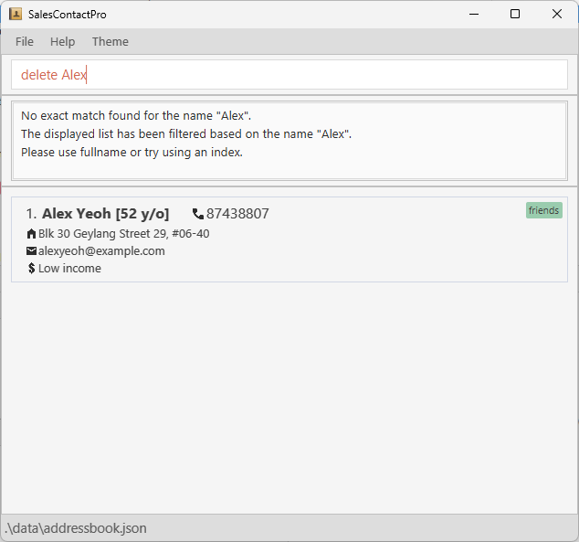

SalesContactPro is a **CLI-first contact management system designed specifically for insurance sales representatives** in the Software-as-a-Service (SaaS) industry. This application aims to streamline contact management, enhance productivity, and optimize the sales process through rapid data entry and retrieval.

* Table of Contents
{:toc}

--------------------------------------------------------------------------------------------------------------------

## Quick start

1. Ensure you have Java `17` or above installed in your Computer.

1. Download the latest `.jar` file from [here](https://github.com/AY2425S1-CS2103T-T17-4/tp/releases).

1. Copy the file to the folder you want to use as the _home folder_ for your SalesContactPro.

1. Open a command terminal, `cd` into the folder you put the jar file in, and use the `java -jar SalesContactPro.jar` command to run the application.<br>
   A GUI similar to the below should appear in a few seconds. Note how the app contains some sample data.<br>
   

1. Type the command in the command box and press Enter to execute it. e.g. typing **`help`** and pressing Enter will open the help window.<br>
   Some example commands you can try:

   * `list` : Lists all contacts.

   * `add n/John Doe p/98765432 e/johnd@example.com a/John street, block 123, #01-01` : Adds a contact named `John Doe` to SalesContactPro.

   * `delete John Doe` : Deletes the John Doe contact.

   * `clear` : Deletes all contacts.

   * `exit` : Exits the app.

1. Refer to the [Features](#features) below for details of each command.

--------------------------------------------------------------------------------------------------------------------

## Features

<div markdown="block" class="alert alert-info">

**:information_source: Notes about the command format:**<br>

* Words in `UPPER_CASE` are the parameters to be supplied by the user.<br>
  e.g. in `add n/NAME`, `NAME` is a parameter which can be used as `add n/John Doe`.

* Items in square brackets are optional.<br>
  e.g `n/NAME [t/TAG]` can be used as `n/John Doe t/client` or as `n/John Doe`.

* Items in angular brackets are options.<br>
  e.g `i/<none/low/mid/high>` can be used as `i/low` or as `i/high` or using other valid options.

* Items with `…`​ after them can be used multiple times including zero times.<br>
  e.g. `[t/TAG]…​` can be used as ` ` (i.e. 0 times), `t/client`, `t/client t/colleague` etc.

* Parameters can be in any order.<br>
  e.g. if the command specifies `n/NAME p/PHONE_NUMBER`, `p/PHONE_NUMBER n/NAME` is also acceptable.

* Extraneous parameters for commands that do not take in parameters (such as `help`, `list`, `exit` and `clear`) will be ignored.<br>
  e.g. if the command specifies `help 123`, it will be interpreted as `help`.

* If you are using a PDF version of this document, be careful when copying and pasting commands that span multiple lines as space characters surrounding line-breaks may be omitted when copied over to the application.
</div>

### Viewing help: `help`

Displays a summary of commands available.
Shows a message explaining how to access the help page at the bottom.


Format: `help`


### Adding a person: `add`

Adds a person to SalesContactPro. People with **both** exact same **Name** (case-sensitive) and **Phone** are not allowed.

Format: `add n/NAME p/PHONE_NUMBER [e/EMAIL] [a/ADDRESS] [nt/NOTES] [i/INCOME<none/low/mid/high>] [age/AGE] [t/TAG]…​`

<div markdown="span" class="alert alert-primary">:bulb: **Tip:**
While we allow any letter for names for flexibility, our primary language is English, and any formatting errors due to other languages is not part of our scope.
</div>

<div markdown="span" class="alert alert-primary">:bulb: **Tip:**
A person can have any number of tags (including 0)
</div>

Examples:
* `add n/John Doe, Alexander p/98765432 e/johnd@example.com a/John street, block 123, #01-01 i/high age/33`
* `add n/Betsy d/o Crowe t/boss e/betsycrowe@example.com a/Jurong West Street p/+651234567 t/golf i/MID age/56`
* `add n/Mary Jane t/client p/+651234567 i/low age/24`

### Listing all persons: `list`

Shows a list of all persons in SalesContactPro. The list can be optionally sorted by various fields to help you organize and find contacts more efficiently.

Format: `list [s/SORT_FIELD] [r/]`

* `s/SORT_FIELD`: The field to sort by, defaults to name if not specified. Valid values are:
  * `name` - Sort by contact name in lexicographical order
  * `email` - Sort by email address in lexicographical order
  * `age` - Sort by age
  * `income` - Sort by income
* `r/`: Reverses the sort order (descending instead of ascending)

<div markdown="span" class="alert alert-warning">:exclamation: **Important Note:**
Sorting is case-sensitive. When sorting by name:
* Names starting with uppercase letters (e.g., "Alice") appear before names starting with lowercase letters (e.g., "bob")
* To ensure consistent sorting, it is recommended to always capitalize the first letter of names when adding contacts
* Example sort order: "Alice", "Bob", "Charlie", "alice", "bob"
</div>

<div markdown="span" class="alert alert-primary">:bulb: **Tip:**
If you notice names appearing lower in the sorted list than expected, check if they were entered with correct capitalization. You can use the `edit` command to fix the capitalization if needed.
</div>

Examples:
* `list` - Shows all contacts
* `list s/name` - Lists all contacts sorted alphabetically by name (A to Z)
  
* `list s/email r/` - Lists all contacts sorted by email in reverse order (Z to A)
  

Expected outcome for `list s/name`:
```
Listed all persons
Results:
1. Alice Pauline (Phone: 94351253)
2. Benson Meier (Phone: 98765432)
...
```

### Editing a person: `edit`

Edits an existing person in SalesContactPro. People with **both** exact same **Name** (case-sensitive) and **Phone** are not allowed.

Format: `edit INDEX [n/NAME] [p/PHONE] [e/EMAIL] [a/ADDRESS] [i/INCOME<none/low/mid/high>] [age/AGE] [t/TAG]…​`

* Edits the person at the specified `INDEX`. The index refers to the index number shown in the displayed person list. The index **must be a positive integer** 1, 2, 3, …​
* At least one of the optional fields must be provided.
* Existing values will be updated to the input values.
* When editing tags, the existing tags of the person will be removed i.e adding of tags is not cumulative.
* You can remove all the person’s tags by typing `t/` without
    specifying any tags after it.

<div markdown="span" class="alert alert-primary">:bulb: **Tip:**
If multiple `i/` or `age/` fields are indicated, the app will use the last one for each.
</div>

Examples:
*  `edit 1 p/91234567 e/johndoe@example.com` Edits the phone number and email address of the 1st person to be `91234567` and `johndoe@example.com` respectively.
*  `edit 2 n/Betsy Crower t/` Edits the name of the 2nd person to be `Betsy Crower` and clears all existing tags.

### Locating persons by name: `find`

Finds persons whose names contain any of the given keywords. If no exact match is found, SalesContactPro displays the names in decreasing order of similarity to search term.

Format: `find KEYWORD [KEYWORD]...`

* The search is case-insensitive. e.g `hans` will match `Hans`
* The order of the keywords does not matter. e.g. `Hans Bo` will match `Bo Hans`
* Only the name is searched.
* Partial words will be matched e.g. `Han` will match `Hans`
* Persons matching at least one keyword will be returned (i.e. `OR` search).
  e.g. `Hans Bo` will return `Hans Gruber`, `Bo Yang`
* If no exact match is found, SalesContactPro displays the names in decreasing order of similarity to search term.

Examples:
* `find John` returns `john`, `John Doe`, and `Johnny`
* `find alex david` returns `Alex Yeoh`, `David Li`<br>
  
* `find Ifan` sorts other names by decreasing similarity to `Ifan` (e.g. Irfan, Isolde, Ayush, ...)

### Filtering persons by criteria: `filter`

Filters the displayed list of persons in SalesContactPro to include all persons who meet the specified criteria and displays them with index numbers.

Format: `filter [p/PHONE] [e/EMAIL] [a/ADDRESS] [t/TAG]…​ [i/INCOME_GROUP…​] [age/AGE_CRITERIA…​]`

Parameters:
* `p/PHONE`: The phone number criteria to filter by. For multiple phone numbers, it checks if any phone number is present.
* `e/EMAIL`: The email criteria to filter by. For multiple emails, it checks if any email is present.
* `a/ADDRESS`: The address criteria to filter by. For multiple addresses, it checks if any address is present.
* `t/TAG…​`: The tags to filter by. For multiple tags, it checks if **all** tags are present.
* `i/INCOME_GROUP…​`: The income group criteria to filter by. Valid values are `none`, `low`, `medium`, and `high` (case sensitive). Multiple income values can be used in the same `i/`, and will check with an `OR` criteria.
* `age/AGE_CRITERIA…​`: The age criteria to filter by. A valid age criteria can only contain `<`, `>`, or numbers. If it contains `<` or `>`, there must only be a single instance of either of them, and only as the first character. It cannot contain both. If only numbers are given, equality is checked. For multiple age criteria used in the same `age/`, it checks if all **age** criteria are satisfied.

**Examples**:
* `filter p/+65 e/example.com a/Clementi t/Inactive i/low age/>20 <60`: Filters the list to include all persons whose phone number contains `+65`, email contains `example.com`, address contains `Clementi`, have the tag `Inactive`, belong to the `low` income group, and are aged between 21 and 59.
* `filter p/987 e/johndoe@example.com a/Street i/medium high age/30`: Filters the list to include all persons whose phone number contains `987`, email is `johndoe@example.com`, address contains `Street`, belong to either the `medium` or `high` income group, and are exactly 30 years old.

**Notes**:
* At least one of `p/PHONE`, `e/EMAIL`, `a/ADDRESS`, `i/INCOME_GROUP`, `age/AGE_CRITERIA` or `t/TAG…` must be provided.
* If a contact does not have a value for the criteria field, it is not displayed.
* Multiple criteria for phone, email, address, tags, income group, and age can be specified, separated by spaces.
* The criteria for phone, email, address, and tags are case-insensitive and can be partial matches.
* The criteria income group only checks for exact matches.

### Managing contact notes: `notes`

View, add, edit, or delete additional notes for any contact in SalesContactPro. Notes can help you remember important details about each contact. Each contact can only have 1 notes.

Format: `notes PARAMETER`

Parameters:
* View: `view/NAME` or `view/INDEX`
* Add: `add/NAME nt/NOTES` or `add/INDEX nt/NOTES`
* Edit: `edit/NAME` or `edit/INDEX`
* Delete: `del/NAME` or `del/INDEX`

<div markdown="span" class="alert alert-primary">:exclamation: **Tip:**
The `notes add/` feature replaces the entire note, for modifications please use `notes edit/`.
</div>
<div markdown="span" class="alert alert-primary">:bulb: **Tip:**
While we allow any character for notes for flexibility, our primary language is English, and any formatting errors due to other languages is not part of our scope.
</div>
<div markdown="span" class="alert alert-warning">:exclamation: **Note:**
When using a person's name:
* If there are multiple contacts with similar names, SalesContactPro will display a filtered list of all matching contacts
</div>
<div markdown="span" class="alert alert-primary">:bulb: **Tip:**
Using the person's index number from the last displayed list is often easier than typing their full name!
</div>

Examples:
* `notes view/John Doe` or `notes view/1` - Views John Doe's notes
  
* `notes add/John Doe nt/Prefers phone contact` or `notes add/1 nt/Prefers phone contact` - Adds a note for John Doe
  
* `notes edit/John Doe` or `notes edit/1` - Opens a window to edit John Doe's notes
  
* `notes del/John Doe` or `notes del/1` - Deletes all notes for John Doe

Expected outcomes:

For viewing notes:
```
Notes for John Doe:
Prefers email contact
```

For adding notes:
```
Added notes for John Doe:
Prefers email contact
```

For editing notes (opens a popup window):


For deleting notes:
```
Deleted notes for John Doe
```

### Deleting a person: `delete`

Deletes the person with the specified `NAME` or the person at the specified `INDEX`

Format: `delete NAME` or `delete INDEX`

<div markdown="span" class="alert alert-primary">:exclamation: **Tip:**
The `delete NAME` feature will only delete if NAME is exact match with contact full name and if there is only 1 contact with that NAME.
</div>

* For deletion by `NAME`:
  * Deletes the person with the specified `NAME`.
  * Only delete if `NAME` is exact match with contact full name.
  * Delete is case-insensitive. e.g `hans` will delete `Hans`.
  * If no exact match, list will be filtered based on given `NAME`.
    SalesContactPro will then prompt user to use fullname or `INDEX`.
  * If no exact and partial match,
    SalesContactPro will then prompt user to use another `NAME` or `INDEX`.
  * If more than 1 exact match, list will be filtered based on given `NAME`.
    SalesContactPro will then prompt user to use `INDEX` instead.

* For deletion by `INDEX`:
  * Deletes the person at the specified INDEX.
  * The index refers to the index number shown in the displayed person list.
  * The index must be a positive integer 1, 2, 3, …​

Examples:
* `delete Alice`: Deletes the person named Alice from SalesContactPro.
* `delete 1`: Deletes the first person in the currently displayed list.
* `delete alex`: If there is no alex in contact, display list has filtered based on the name "alex".



* `delete Alex Yeoh`: If there is multiple Alex Yeoh in contact, SalesContactPro prompt user to use `INDEX`.


### Clearing all entries: `clear`

Clears all entries from SalesContactPro.

<div markdown="span" class="alert alert-warning">:exclamation: **Warning:**
Clearing will delete all contacts and it is an irreversible command.
</div>

Format: `clear`

### Command History: `↑` `↓`
Allows users to quickly access previously entered commands without retyping them using arrow keys.

Format: `↑` or `↓`

- Up Arrow `↑`: Displays the last command you entered. Press multiple times to view older commands in reverse order.
- Down Arrow `↓`: Moves forward through the command history, displaying newer commands. Once you reach the most recent command, pressing `↓` again will clear the command box.

Examples:
- `↑` : Retrieve previous command in the command box.
- `↓` : Retrieve next command in the command box.

### Change theme: `F3`

Allows users to toggle between light and dark theme with `F3` key

Format: `F3`

### Exiting the program: `exit`

Exits the program.

Format: `exit`

### Saving the data

SalesContactPro data are saved in the hard disk automatically after any command that changes the data. There is no need to save manually.

### Editing the data file

SalesContactPro data are saved automatically as a JSON file `[JAR file location]/data/addressbook.json`. Advanced users are welcome to update data directly by editing that data file.

<div markdown="span" class="alert alert-warning">:exclamation: **Caution:**
If your changes to the data file makes its format invalid, SalesContactPro will discard all data and start with an empty data file at the next run. Hence, it is recommended to take a backup of the file before editing it.<br>
Furthermore, certain edits can cause the SalesContactPro to behave in unexpected ways (e.g., if a value entered is outside of the acceptable range). Therefore, edit the data file only if you are confident that you can update it correctly.
</div>

### Archiving data files `[coming in v2.0]`

_Details coming soon ..._

--------------------------------------------------------------------------------------------------------------------

## FAQ

**Q**: How do I transfer my data to another Computer?<br>
**A**: Install the app in the other computer and overwrite the empty data file it creates with the file that contains the data of your previous SalesContactPro home folder.

--------------------------------------------------------------------------------------------------------------------

## Known issues

1. **When using multiple screens**, if you move the application to a secondary screen, and later switch to using only the primary screen, the GUI will open off-screen. The remedy is to delete the `preferences.json` file created by the application before running the application again.
2. **If you minimize the Help Window** and then run the `help` command (or use the `Help` menu, or the keyboard shortcut `F1`) again, the original Help Window will remain minimized, and no new Help Window will appear. The remedy is to manually restore the minimized Help Window.

--------------------------------------------------------------------------------------------------------------------

## Command summary

Action | Format, Examples
-------|------------------
**[Add](#adding-a-person-add)** | `add n/NAME p/PHONE_NUMBER [e/EMAIL] [a/ADDRESS] [nt/NOTES] [i/INCOME<none/low/mid/high>] [age/AGE] [t/TAG]…` <br> e.g., `add n/James Ho p/22224444 e/jamesho@example.com a/123, Clementi Rd, 1234665 t/friend t/colleague`
**[Delete](#deleting-a-person-delete)** | `delete INDEX` or `delete NAME` <br> e.g., `delete 3` `delete James Ho`
**[Edit](#editing-a-person-edit)** | `edit INDEX [n/NAME] [p/PHONE_NUMBER] [e/EMAIL] [a/ADDRESS] [i/INCOME<none/low/mid/high>] [age/AGE] [t/TAG]…` <br> e.g., `edit 2 n/James Lee e/jameslee@example.com`
**[Find](#locating-persons-by-name-find)** | `find KEYWORD [KEYWORD]…` <br> e.g., `find James Jake`
**[Filter](#filtering-persons-by-criteria-filter)** | `find KEYWORD [KEYWORD]…` <br> e.g., `find James Jake`
**[List](#listing-all-persons-list)** | `list [s/SORT_FIELD] [r/]` <br> • SORT_FIELD: `name`, `email`, `income`, or `age` <br> e.g., `list s/name`, `list s/email r/`, `list s/age`
**[Notes](#managing-contact-notes-notes)** | `notes PARAMETER` <br> • View: `notes view/NAME` or `notes view/INDEX` <br> • Add: `notes add/NAME nt/NOTES` or `notes add/INDEX nt/NOTES` <br> • Edit: `notes edit/NAME` or `notes edit/INDEX` <br> • Delete: `notes del/NAME` or `notes del/INDEX` <br> e.g., `notes view/1`, `notes add/James Ho nt/Prefers email`
**[Help](#viewing-help-help)** | `help`
**[Clear](#clearing-all-entries-clear)** | `clear`
**[Exit](#exiting-the-program-exit)** | `exit`
