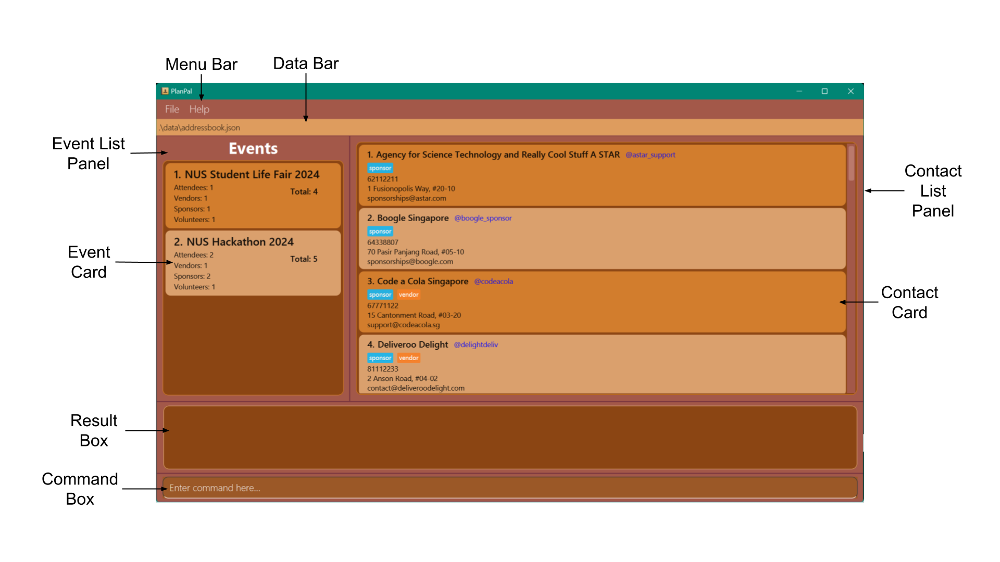
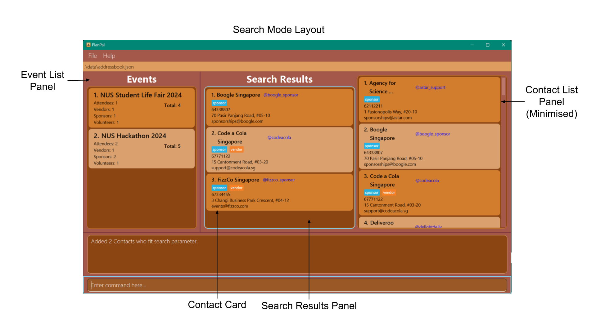

### Welcome to PlanPal's User Guide!


PlanPal is an **address book and event tracker** designed for **student event planners** at NUS who need to manage
contacts (e.g., attendees, vendors, sponsors, and volunteers) and track who is in what event efficiently.

PlanPal offers a **centralized platform** to organize, track, and easily access contact information, and assign them
to their events, helping you to stay organized through the entire planning process.

_This project is based on the AddressBook-Level3 project created by the [SE-EDU initiative](https://se-education.org)._

<div style="page-break-after: always"></div>

### Table of Contents

* Table of Contents
{:toc}

<div style="page-break-after: always"></div>

## 1. Introduction

### 1.1 What is PlanPal

PlanPal is a desktop application tailored for student event planners at the National University of Singapore (NUS). 
It is designed to help users efficiently manage contact information for various stakeholders involved in event planning, 
such as attendees, vendors, sponsors, and volunteers. With its powerful Command Line Interface (CLI), PlanPal combines
ease of use with robust functionality, ensuring a seamless experience for planning and coordinating events.

Overview of Main Features:
* **Contact Management:** Maintain a centralised database of contacts with detailed information, including roles and communication details.
* **Event Organisation:** Create, track, and manage events with associated contacts for streamlined event coordination.
* **Advanced Search:** Leverage powerful search capabilities to filter and manage contacts with precision.
* **Role-Based Assignments:** Assign roles like attendee, sponsor, vendor, or volunteer to contacts for efficient organisation.

### 1.2 User Proficiency

* **Level of Relatedness:** Users of PlanPal are NUS students or event organisers responsible for planning and managing
campus events. The application is specifically designed to address their unique needs, such as managing large contact
lists and organising events with multiple participants.

* **Comprehension:** Users are expected to have a basic understanding of event planning and stakeholder management,
including how to structure and assign roles to contacts.

* **Prior Knowledge:** PlanPal assumes users have a basic level of computer proficiency, particularly with navigating
CLI environments. Users should also be familiar with common event-planning concepts like attendee registration and
vendor coordination.

* **Desire for Efficiency:** PlanPal is aimed at users who prioritise organisation and efficiency, helping them reduce
the time spent on manual tasks like searching for contact details or tracking event participants.

### 1.3 Why This Guide Matters

This user guide is your comprehensive resource for getting the most out of PlanPal. Whether you're organising a small
workshop or a large-scale festival, this guide will help you understand and use PlanPal’s features effectively.
By following the step-by-step instructions and examples, you’ll learn to streamline your workflow, save time, and stay
organised.

From adding contacts to managing events and using advanced features like Search Mode, this guide is structured to ensure
your success. With PlanPal, you can focus more on delivering an unforgettable event experience and less on logistical
challenges.

Let’s get started and see how PlanPal can transform your event planning journey!

<div style="page-break-after: always"></div>

## 2. How to use this User Guide

This section outlines how to effectively navigate the PlanPal User Guide. Whether you're new to the application or a
returning user, these tips will help you make the most of the document.

### 2.1 Navigating the Document

- **Table of Contents:** The Table of Contents at the start provides a clear overview of all topics covered.
Simply click on a section title to jump directly to that part of the guide.

- **Section Organisation:** Each section is divided into clear headings and subheadings, making it easy to locate
specific topics or commands.

### 2.2 Sections

Below is a summary of the main sections in this User Guide and what you can expect from each one.

- [Get Started With PlanPal](#3-quick-start): New to PlanPal? Visit this section for a step-by-step guide to installing and launching the application.
- [Tutorial](#4-tutorial-getting-started-with-planpal): Gain a basic understanding on how to use PlanPal to its fullest potential.
- [Features](#5-features): Explore the full range of PlanPal’s capabilities, with detailed instructions and examples for each command.
- [FAQ](#6-faq): Stuck or have questions? Find answers to common problems and queries here.
- [Command Summary](#8-command-summary): Need a quick reference? This section provides an at-a-glance list of all supported commands.

<box type="info" seamless>
First-time users are strongly encouraged to read the <a href="#3-quick-start">Quick-Start</a> section before diving into PlanPal’s features.
</box>

<div style="page-break-after: always"></div>

## 3. Quick Start

### 3.1 Pre-requisites

Ensure that you have Java `17` or above installed on your computer. If you are unsure whether Java is installed, follow the steps below based on your operating system to check.

**Windows**
1. Open Command Prompt by typing `cmd` in the Start menu and pressing Enter.
2. Type `java -version` and press Enter.
3. If Java is installed, the version will be displayed. Ensure it is version `17` or above.

**Mac**
1. Open Terminal (you can find it by searching in Spotlight by pressing the `Cmd + Space` keys, then type "Terminal").
2. Type `java -version` and press Enter.
3. If Java is installed, the version will be displayed. Ensure it is version `17` or above.

**Linux**
1. Open your terminal.
2. Type `java -version` and press Enter.
3. If Java is installed, the version will be displayed. Ensure it is version `17` or above.

If Java is not installed or if the version is below `17`, download the latest Java Development Kit (JDK) from the [official Oracle website](https://www.oracle.com/java/technologies/javase-jdk17-downloads.html) or use a package manager like `Homebrew` on Mac or `apt-get` on Linux to install Java.

### 3.2 Steps to Start PlanPal

1. **Download the Application**: Download the latest `.jar` file for PlanPal from [this link](https://github.com/AY2425S1-CS2103T-F09-2/tp/releases).

2. **Set Up the Application Folder**: Copy the downloaded `.jar` file to the folder where you want to store PlanPal’s data. This folder will be your _home folder_ for PlanPal.

3. **Run the Application**:
    - Open a command terminal.
    - Navigate to the folder containing the `.jar` file by typing `cd path/to/your/folder` and pressing Enter.
    - Run the application by typing:
      ```bash
      java -jar planpal.jar
      ```
    - Press Enter. After a few seconds, a GUI similar to the one shown below should appear. Note that the application will start with some sample data preloaded for testing purposes.

   

4. **Try Out Basic Commands**:
    - In the command box within PlanPal, type a command and press Enter to execute it. For example:
        - **`help`**: Opens the help window with guidance on commands.
        - **`list`**: Displays a list of all contacts.
        - **`add n/John Doe p/98765432 e/johnd@example.com a/John street, block 123, #01-01`**: Adds a contact named `John Doe` to the address book.
        - **`delete 3`**: Removes the 3rd contact in the current list.
        - **`clear`**: Deletes all contacts from the address book.
        - **`exit`**: Closes the application.
   - Follow the tutorial in the next section to familiarise yourself with the commands in context!

5. **Explore Additional Features**: For detailed explanations of each command and additional features, refer to the [Features](#5-features) section below.

### 3.3 Graphical User Interface Layout

This section gives a quick overview of the different User Interface layouts you may encounter while using PlanPal.

#### 3.3.1 User Interface (UI) Overview



This image shows the default User Interface you'll see when you first launch PlanPal. Let’s go through each part of the 
interface, moving clockwise from the top left:

- **Menu Bar**: Provides quick access to key functions and features within PlanPal.
- **Data Bar**: Displays the relative path to the current storage file in use.
- **Contact List Panel**: Shows a list of contact cards.
- **Contact Card**: Displays detailed system recorded information about a specific contact.
- **Command Box**: Space for users to enter commands for PlanPal to execute.
- **Result Box**: Displays the outcomes of executed commands.
- **Event Card**: Displays detailed system recorded information about a specific event.
- **Event List Panel**: Shows a list of event cards.

#### 3.3.2 Additional UI Components


Let's go through the UI components in more detail.
- **Index**: The identifier used for selecting or referencing a specific contact.
- **Contact Name**: The name of the contact person.
- **Telegram Username**: The Telegram handle of the contact.
- **Role**: The role assigned to the contact (e.g., attendee, volunteer, sponsor, vendor).
- **Phone Number**: The contact's phone number.
- **Address**: The physical address of the contact.
- **Email**: The contact's email address.
- **Total Event Contacts**: The total number of contacts associated with the current event.
- **Event Role Count**: The count of each role in the event; note that the total may differ as some contacts can hold multiple roles.
- **Event Name**: The name of the event being managed.

<div style="page-break-after: always"></div>

#### 3.3.3 Searchmode UI Overview



This image shows how the User Interface will change when you use 
[Search Mode](#54-search-mode-for-event-management--search-mode-or-sm). You can also learn how to use Search Mode in 
[Step 5](#45-using-search-mode) of the tutorial. Let's go through each part of the Search Mode interface, moving clockwise
from the top right:

- **Contact List Panel (Minimised)**: In search mode, the original Contact List Panel remains but is minimised.
- **Search Results Panel**: A separate panel to displays the contact cards that match your search criteria.
- **Contact Card**: Contact cards in the search results continue to have the same format.
- **Event List Panel**: Remains unchanged, displaying a list of event cards.


<div style="page-break-after: always"></div>

## 4. Tutorial: Getting Started with PlanPal


This tutorial guides you step-by-step to use the key features of PlanPal effectively. 
If there are any commands that you do not understand, refer to the [Features](#5-features) section below for more details.


### 4.1 Adding Contacts

Contacts are the heart of PlanPal, so let's start by adding one.
Imagine you’re organising a university festival, and Jeff Tan is your first attendee. 
Here's how you can add Jeff to your contact list:

1. Open PlanPal.
2. Type the `add` command in the command box and press Enter.

**Command Format:** `add n/NAME p/PHONE_NUMBER e/EMAIL a/ADDRESS [t/TELEGRAM_USERNAME] [r/ROLE]…`

**Example:**
`add n/Jeff Tan p/98114507 e/jeff@example.com a/Blk 12 Geylang Street 5, #06-40 r/attendee t/jeffyt`

Great! You’ve just added Jeff Tan as an attendee. You can see his details appear in the contact list. 
Feel free to experiment by adding more contacts for vendors, sponsors, or other attendees. 
Remember, you can assign roles like `attendee`, `sponsor`, `vendor`, and `volunteer` to keep things organised.
Now try and adding a contact with your own details! Once you have done so, let's move onto the next step!

### 4.2 Deleting Contacts

Uh oh, Olivia Ong has just informed you that she is no longer going to be attending the event.
Find what her index number is and delete her from the contacts!

1. Find the contact you want to delete.
2. Use the `delete` command with the contact's **INDEX** as displayed in the list.

**Command Format:** `delete INDEX`

**Example:** `delete 1`

Poof! Olivia is now removed from the list. 
Don’t worry—you can always re-add them later.

### 4.3 Adding Events

Now that your contact list is taking shape, let’s organize them into events. 
Picture this: You’re planning a “Summer Orientation,” and you want to track everyone involved.
To create the event, you need to follow the following format type:

**Command Format:** `new EVENT_NAME`

**Example:** `new Summer Orientation`

Congratulations! Your event “Summer Orientation” is now added to the event list.
You can repeat this process for other events like “Tech Symposium” or other events.
Remember to use descriptive, but succinct, names so you can easily identify your events.

### 4.4 Adding Contacts to Events

What’s an event without people? Let’s add some contacts to your new event.
But before we do that, we need to find the people to add into your contact. 
Searching for them manually is much harder with hundreds of contacts, which 
is why you can search for them by name! Let's look for Jeff Tan again using the 
`find-name` command. 

**Command Format:** `find-name NAME`

**Example:** `find-name Jeff`

Now you can add Jeff to your event! Let's add him to the "Summer Orientation" using the
`event-add` command. In the event of multiple people with the name of Jeff, make sure you
select the one you want carefully!

To add contacts to an event, use the `event-add` command. 
You can specify the event index, contact indices, and the role of the contact in the event.
Because of our previous search of finding Jeff by name, he should be at the top!

**Command Format:** `event-add ei/EVENT_INDEX <a/ or s/ or ve/ or vo/>CONTACT_INDEX [MORE_CONTACT_INDICES]...`

**Example:** `event-add ei/3 a/1`

This command would add Jeff to the list of attendees of the Summer Orientation event.
Do note that Jeff needs to have a role before he can be added to an event!

**Roles:**
- `a/` – Attendee
- `s/` – Sponsor
- `ve/` – Vendor
- `vo/` – Volunteer


_While not required to complete to tutorial, 
if you are curious about the strange bracket notations click [Features](#5-features) to read more about the command formats!_


### 4.5 Using Search Mode

Now imagine your contact list has grown significantly,
and you need a faster way to filter and manage contacts.
That’s where Search Mode comes in! It allows you to perform advanced searches
using multiple criteria, helping you find exactly who you’re looking for.

To activate Search Mode, follow these steps:

1. Open PlanPal and type the following command to enter Search Mode:
   
**Command Format:** `search-mode`

**Example:** `search-mode`

Once activated, you’ll notice the interface changes to display all contacts in PlanPal.
Let’s move on to filtering these contacts!

### 4.6 Searching for Contacts

Let’s say you want to find attendees with a specific name or role.
Search Mode makes this easy! Imagine you need to find all contacts named “Alex” who
are attendees.

1. In Search Mode, type the following command:
   
**Command Format:** `search <n/NAME r/ROLE e/EMAIL a/ADDRESS p/PHONE t/TELEGRAM_USERNAME>`

   **Example:** `search n/Alex r/attendee`

This will filter the list to show only those contacts named “Alex” with the role “attendee.” PlanPal will display these filtered results in the center panel. If the list still feels too broad, you can add more criteria to narrow it down further.

Now try searching for someone from your own contact list!


### 4.7 Excluding Contacts from Search Results

Sometimes, you might want to exclude certain contacts from your results to refine your search even more.
Try the following command which will result in search finding all contacts that have "Co" in their name:
1. `search n/Co`
2. Use the `exclude` command to remove unwanted contacts from the results:
   
**Command Format:** `exclude ci/INDEX [MORE_INDICES]`

**Example:** `exclude ci/2`

This will exclude the contact at index 2 from your search results. 
Excluded contacts won’t appear in future searches until you clear the excluded list. Perfect for filtering down to exactly what you need!

### 4.8 Viewing and Clearing Excluded Contacts

Now that you’ve excluded a contact, you might want to review or reset your excluded list.

1. To view all excluded contacts, type:
   
**Command Format:** `check-excluded`

**Example:** `check-excluded`

2. To clear the excluded list and start fresh, use:
   
**Command Format:** `clear-excluded`

**Example:** `clear-excluded`

Once cleared, the excluded contacts will reappear in search results,
ready to be filtered again. Go ahead and give it a try!

### 4.9 Adding All Filtered Contacts to an Event

After refining your search, you might want to add all filtered contacts to an event.
Let’s say you’ve filtered a group of attendees for the “Summer Orientation” event.

1. Use the `add-all` command to add them to the event:
   
**Command Format:** `add-all EVENT_INDEX`

**Example:** `add-all 3`

This command adds all currently displayed contacts in your search results to the
event with index 3. It’s a huge time-saver for managing large groups of attendees,
sponsors, or vendors.

### 4.10 Exiting Search Mode

Once you’ve completed your searches and added contacts to events, you can exit
Search Mode and return to the normal interface.

1. To exit Search Mode, type:
   
**Command Format:** `exit-search`

**Example:** `exit-search`

You’re back to the default view of your contact list, ready to tackle other tasks.
Don’t forget—you can always re-enter Search Mode whenever you need it.

If you want to erase all the default contacts, simply type `clear`.

Now that you’ve mastered Search Mode, you’re equipped to handle even the
largest contact lists with ease. Onward to managing events like a pro!

<div style="page-break-after: always"></div>

## 5. Features

<div markdown="block" class="alert alert-info">

**:information_source: Notes about the command format:**<br>

* Words in `UPPER_CASE` are the parameters to be supplied by the user.<br>
  e.g. in `add n/NAME`, `NAME` is a parameter which can be used as `add n/John Doe`.

* Items in square brackets are optional.<br>
  e.g `n/NAME [r/ROLE]` can be used as `n/John Doe r/attendee` or as `n/John Doe`.

* Items in angled brackets require at least one item to be present.<br>
  e.g `ei/EVENT_INDEX <a/ or s/ or ve/ or vo/>CONTACT_INDEX` can be used as `ei/2 a/1` or as `ei/2 a/1 ve/3 vo/2 s/5`.

* Items with `…`​ after them can be used multiple times including zero times.<br>
  e.g. `[r/ROLE]…​` can be used as ` ` (i.e. 0 times), `r/attendee`, `r/attendee r/sponsor` etc.

* Parameters can be in any order.<br>
  e.g. if the command specifies `n/NAME p/PHONE_NUMBER`, `p/PHONE_NUMBER n/NAME` is also acceptable.

* Extraneous parameters for commands that do not take in parameters (such as `help`, `list`, `exit` and `clear`) will be ignored.<br>
  e.g. if the command specifies `help 123`, it will be interpreted as `help`.

* If you are using a PDF version of this document, be careful when copying and pasting commands that span multiple lines as space characters surrounding line-breaks may be omitted when copied over to the application.
</div>

### 5.1 Viewing help : `help`

Shows a message explaning how to access the help page.


Format: `help`

### 5.2 Contact Related Features

#### 5.2.1 Adding a contact: `add`

Adds a contact to the address book.

Format: `add n/NAME p/PHONE e/EMAIL a/ADDRESS [t/TELEGRAM_USERNAME] [r/ROLE]…​`

* Telegram usernames must start with an alphabet, contain only alphanumeric characters or underscores and be between 5 and 32 characters long.
* The roles must be one of the following: attendee, vendor, volunteer and sponsor.

<div markdown="span" class="alert alert-primary">:memo: **Note:**
A contact can have any number of roles (including 0), and the Telegram username is optional. <br><br>

:memo: **Note:** You will be unable to add a contact to PlanPal if there already exists a contact with the same phone number, email or telegram username.
</div>

Examples:
* `add n/John Doe p/98765432 e/johnd@example.com a/John street, block 123, #01-01`
* `add n/Betsy Crowe e/bc@gmail.com a/New Street p/1234567 t/betsyyy r/sponsor r/vendor`

<br>


#### 5.2.2 Locating Contacts by Name or Role: `find-name` and `find-role`

##### 5.2.2.1 Find Contacts by Keywords in Name: `find-name` or `fn`
Finds contacts whose names contain provided keywords.

Format: `find-name KEYWORD [MORE_KEYWORDS]...`

* The search is case-insensitive (e.g., `hans` matches `Hans`).
* The order of keywords does not matter (e.g., `Hans Bo` matches `Bo Hans`).
* Contacts whose name contains a word that fully matches **at least one** keyword will be returned OR Contacts whose name
contains **all** the keywords will be returned.<br>


Examples:
* `find-name John` returns `John Street` and `John Doe`.
* `find-name alex david` returns `Alex Yeoh` and `David Li`.<br>
* `find-name Jon N` will return `Jon Ng`, `Jon Lim` and `Jonathan N Lee` .
  


##### 5.2.2.2 Find Contacts by Role: `find-role` or `fr`
Finds contacts who have the specified role.

Format: `find-role ROLE [MORE_ROLES]...`

* The search is case-insensitive (e.g., `attendee` matches `Attendee`).
* Only full words will be matched (e.g., `attend` will not match `attendee`).
* Valid roles are: `attendee`, `sponsor`, `vendor`, `volunteer`.
* If more than one role is specified, contacts matching at least one role will be returned (i.e., an `OR` search).<br>
  For example, `attendee sponsor` returns contacts who are either attendees or sponsors.

Examples:
* `find-role attendee` returns all contacts with the attendee role.<br>
* `find-role attendee sponsor` returns all contacts with either the attendee or sponsor roles (or both!).<br>


#### 5.2.3 Editing a Contact : `edit`

Edits an existing contact in the address book.

Format: `edit INDEX <n/NAME p/PHONE_NUMBER e/EMAIL a/ADDRESS t/TELEGRAM_USERNAME r/ROLE…​>`

* Edits the contact at the specified `INDEX`. The index refers to the position number shown in the displayed contact list. The index **must be a positive integer** (e.g., 1, 2, 3, …).
* At least one of the fields in the angle brackets must be provided.
* Existing values will be updated to the new values entered.
* When adding roles, only the following are valid roles: attendee, sponsor, vendor, volunteer.

<div markdown="span" class="alert alert-primary">:bulb: **Tip:** 
To remove all roles from a contact, type `r/` without specifying any role after it. Similarly, to remove a Telegram handle, type `t/` with no username after it.
</div>

<div markdown="span" class="alert alert-warning">:exclamation: **Caution:**
Editing a contact's information will update it across all events where that contact is included!<br><br>

:exclamation: **Caution:** If a contact’s role is edited so that they no longer hold the role they were originally assigned for an event, they will be removed from that event! (More on this in the events section)
</div>

Examples:
*  `edit 1 p/91234567 e/johndoe@example.com` Edits the phone number and email address of the 1st contact to `91234567` and `johndoe@example.com`.
*  `edit 2 n/Jason Brown t/` Changes the name of the 2nd contact to `Jason Brown` and clears their Telegram username.
*  `edit 3 n/Betsy Crower r/` Updates the name of the 3rd contact to `Betsy Crower` and removes all existing roles.
*  `find-name John` followed by `edit 1 n/John Henry` Updates the name of the first contact in the search results to `John Henry`.


#### 5.2.4 Deleting a Contact : `delete`

Removes the specified contact from the address book.

Format: `delete INDEX`

* Deletes the contact at the specified `INDEX`. 
* The index refers to the number shown in the displayed contact list.
* The index **must be a positive integer** (e.g., 1, 2, 3, …).

<div markdown="span" class="alert alert-warning">:exclamation: **Caution:**
Once you delete a contact, they will also be automatically removed from all events!
</div>

Examples:
* `list` followed by `delete 2` deletes the 2nd contact in PlanPal.
* `find-name Betsy` followed by `delete 1` deletes the 1st contact in the search results from the `find-name` command.

<div style="page-break-after: always"></div>

### 5.3 Event related Features

#### 5.3.1 Adding a new Event : `new`

Adds a new Event to address book.

Format: `new EVENT_NAME`

<div markdown="span" class="alert alert-primary">:memo: **Note:**
The event name cannot be blank.
</div>

Examples:
* `new Sumo Bot Festival`
* `new RC Horror Night`

#### 5.3.2 Finding all Contacts in an event: `find-event`
Displays the list of contacts in the event specified by its index.

Format: `find-event EVENT_INDEX`

* The `EVENT_INDEX` refers to the number shown in the displayed events list.
* The `EVENT_INDEX` **must be a positive integer** (e.g., 1, 2, 3, …).

<div markdown="span" class="alert alert-primary">:memo: **Note:**
The list of contacts displayed by find-event will only have their event-specific roles.
</div>

Examples:
* `find-event 1`

#### 5.3.3 Adding a Contact to an Event : `event-add` or `ea`
Adds a contact to an event with a specified role.

Format: `event-add ei/EVENT_INDEX <a/ or s/ or ve/ or vo/>CONTACT_INDEX [MORE_CONTACT_INDICES]...`

* Contacts can only be added to an event based on their roles (e.g. If John is a sponsor, he can only be added to Event X as a sponsor, not a volunteer)
* Contacts with no roles cannot be added to events
* The `EVENT_INDEX` refers to the number shown in the displayed events list and **must be a positive integer**.
* The `CONTACT_INDEX` refers to the number shown in the current displayed list of contacts and **must be a positive integer**.

<div markdown="span" class="alert alert-primary">:memo: **Note:**
A contact can be added to the same event under multiple roles (e.g. If Alice is both an attendee and a volunteer, she can be added to Event Y as both an attendee and a volunteer)
So, don't worry if the counts for attendees, vendors, sponsors, and volunteers don't exactly match the event total!
</div>

Guide for flag roles:
* `a/` - attendee
* `s/` - sponsor
* `ve/` - vendor
* `vo/` - volunteer

<div markdown="span" class="alert alert-primary">:memo: **Note:**
At least one of the following prefixes is required—`a/`, `s/`, `ve/`, or `vo/`—each followed by one or more contact index/indices
</div>

Examples:
* `event-add ei/1 a/1,2,3` will add the first 3 contacts as attendees to the first event.
* `find-role attendee` followed by `event-add ei/2 a/1,2,3 ve/2,4,5` will add the first 3 contacts from the search results as attendees and the 2nd, 4th and 5th contact as vendors to the 2nd event.

#### 5.3.4 Removing a Contact from an Event : `remove`
Removes a contact from an event.

Format: `remove ei/EVENT_INDEX ci/CONTACT_INDEX`

* The `EVENT_INDEX` refers to the number shown in the displayed events list and **must be a positive integer**.
* The `CONTACT_INDEX` refers to the number shown in the current displayed list of contacts and **must be a positive integer**.
* Only one `CONTACT_INDEX` can be provided.

<div markdown="span" class="alert alert-warning">:exclamation: **Caution:**
Removing a contact from an event will remove the contact from all the roles that he or she has in the event!
</div>

Example:
* `remove ei/1 ci/1`

#### 5.3.5 Deleting an Event : `erase`
Deletes an event from the event list.

Format: `erase EVENT_INDEX`

* The `EVENT_INDEX` refers to the number shown in the displayed events list and **must be a positive integer**.

Example:
* `erase 1`

#### 5.3.6 Clear all events: `clear-event`
Clear all events from the event list.

Format: `clear-event`

### 5.4 Search Mode for Event Management : `search-mode` or `sm`
Search Mode allows you to search for contacts based on multiple criteria,
enabling you to add multiple contacts to an event simultaneously. 
You can search using criteria such as:

- Name
- Phone Number
- Email
- Address
- Telegram Handle
- Role

To enter Search Mode, type `search-mode` or `sm` and press Enter. The display will change to the Search Mode interface.


Search Mode displays all contacts in PlanPal on the right panel (similar to the `list` command).
The contacts matching your search criteria will be shown in the center panel.

The following commands can be used in Search Mode:
- `search` : Searches for contacts based on specified criteria.
- `exclude` : Excludes contacts from appearing in search results.
- `clear-excluded` or `clx` : Clears all excluded contacts.
- `check-excluded` or `chx` : Displays the list of excluded contacts.
- `add-all` : Adds all selected contacts to an event.
- `exit-search` or `es` : Exits Search Mode and returns to the normal display.
- `help` : Displays the help message (same as the `help` command).
- `exit` : Exits the program (same as the `exit` command).

<div style="page-break-after: always"></div>

#### 5.4.1 Searching in Search-mode `search`

Format: `search <n/NAME p/PHONE_NUMBER e/EMAIL a/ADDRESS t/TELEGRAM_USERNAME r/ROLE…​>`

* The search is case-insensitive (e.g., `BLK` matches `blk`).
* For each field (e.g. name, phone number, email), you can specify multiple keywords.

With one Field:
- Contacts whose field contains a word that fully matches **at least one** keyword will be returned OR Contacts whose field
  contains **all** the keywords will be returned.<br>

Example:
* `search n/John` returns `John` and `John Doe`.
* `search a/Jurong East` returns `Jurong West` and `Tampines East`.<br>
* `search p/123 456` will return `123`, `456` and `123456`.

With Multiple Fields:
- Contacts will be returned only if they match **all** specified fields.

Example:
- `search n/Samuel Tan a/Avenue` returns all contacts whose:
    - name has words either `Samuel` or `Tan` **OR** contains `Samuel` **AND** `Tan`. 
    - **AND** address contains `Avenue`.


<div markdown="span" class="alert alert-primary">:memo: **Note:**
A flag parameter should not be empty (e.g. `n/` or `t/`), as it will not return any results.
Flag parameters should also not be repeated (e.g. `n/Alex n/John`).
</div>

<div markdown="span" class="alert alert-primary">:bulb: **Tip:**
You can chain multiple searches to get the full list of contacts you are looking for!
If you are looking for a specific contact, try to be as specific as possible to get the best results!
</div>

#### 5.4.2 Excluding Contacts in Search Mode : `exclude`
Exclude contacts from the search results.

Format: `exclude ci/INDEX, [MORE_INDICES]...`

* `INDEX` refers to the contact index displayed in the search results panel.
* Excluded contacts will not appear in any subsequent searches until they are cleared from the excluded list.

Example:
- `search n/John` returns a list of contacts named `John`. 
<br>
  
- `exclude ci/2` excludes the second contact from the search results. <br>
   <br>
- Subsequent searches will not include the excluded contact.
    - `search p/9234512` will match the previously excluded contact but will not reappear in the results.
    <br>
  

#### 5.4.3 Viewing Excluded Contacts : `check-excluded` or `chx`
To view the contacts currently excluded from search results, use the `check-excluded` command.

Format: `check-excluded`

Example:
- `check-excluded` displays the list of excluded contacts. <br>
  

#### 5.4.4 Clearing Excluded Contacts : `clear-excluded` or `clx`
To remove all contacts from the excluded list, use the `clear-excluded` command. Excluded contacts will then
appear in search results again.

Format: `clear-excluded`

Example:


#### 5.4.5 Adding All Selected Contacts to an Event : `add-all` or `aa`
To add all selected contacts in Search Mode to an event, use the `add-all` command.

Format: `add-all EVENT_INDEX`

* Contacts will be added to the event for each of their roles. (e.g., if John is both a sponsor and a vendor, he will be added to Event X in both roles).
* Contacts with no roles cannot be added to events
* There needs to be at least one contact in the search results panel to add to the event.
* The `EVENT_INDEX` refers to the number shown in the displayed events list and **must be a positive integer**.

Example: `add-all 2`

#### 5.4.6 Exiting Search Mode : `exit-search` or `es`
To exit Search Mode and return to the normal display, use the `exit-search` or `es` command.

Format: `exit-search` or `es`

_This concludes the commands available in Search Mode. The following commands can be used in the normal display mode._

### 5.5 Clearing All Entries : `clear`

Removes all entries from the address book.

Format: `clear`

### 5.6 Exiting the Program : `exit`

Closes the program. Typing `exit` in search mode will close the program as well.

Format: `exit`

### 5.7 Saving Data

PlanPal data is saved automatically to your hard disk after any command that changes the data. There is no need to save manually.

### 5.8 Editing the Data File

PlanPal data is stored as 2 JSON files in `[JAR file location]/data/addressbook.json` and `[JAR file location]/data/eventmanager.json`. 
While it is possible to edit these files to manually insert data, Planpal has various processes to handle parsing the data and invalid data may lead to unexpected behaviour. 
We **do not** recommend editing the storage `.json` files directly, unless you are familiar with the JSON format and PlanPal's data structure.

### 5.9 Navigating Through Command History

Use the `up` and `down` arrow keys to navigate through your command history. Pressing the up arrow displays previously executed commands, allowing you to re-run or edit past commands without retyping them. The down arrow moves forward through the command history, returning to more recent commands.

<div style="page-break-after: always"></div>

## 6. FAQ

**Q**: How do I transfer my data to another computer?<br>
**A**: Install the app on the other computer and replace the empty data file it creates with the file containing the data from your previous PlanPal home folder.

**Q**: What should I do if the program isn’t launching correctly?<br>
**A**: First, ensure you have Java 17 or above installed. If you do, try re-downloading the `.jar` file and running it again. If issues persist, check your system’s permissions for accessing and running files.

**Q**: Can I customize the data file's storage location?<br>
**A**: The data file is saved automatically in `[JAR file location]/data/addressbook.json`. While you cannot change this location within the application, you can move the entire PlanPal folder to a different location. Make sure to update any shortcuts or file paths accordingly.

**Q**: How can I restore accidentally deleted contacts?<br>
**A**: If you recently deleted contacts, the data is permanently removed from PlanPal. We recommend keeping regular backups of your data file to restore information if needed.

**Q**: Why does the GUI open off-screen when I switch monitors?<br>
**A**: This can happen when switching between multiple monitors. To fix this, delete the `preferences.json` file, which stores display settings, and restart PlanPal.

--------------------------------------------------------------------------------------------------------------------


## 7. Known Issues

1. **When using multiple screens**: If you move the application to a secondary screen and later switch to using only the primary screen, the GUI may open off-screen. **Solution**: Delete the `preferences.json` file created by the application before running it again.

2. **Minimized Help Window Issue**: If you minimize the Help Window and then run the `help` command (or use the `Help` menu, or the `F1` shortcut) again, the original Help Window will remain minimized, and no new Help Window will appear. **Solution**: Manually restore the minimized Help Window from your taskbar.

---

## 8. Command Summary

### 8.1 Basic Commands

| Action                        | Format, Examples                                                                                                                                                                                                               |
|-------------------------------|--------------------------------------------------------------------------------------------------------------------------------------------------------------------------------------------------------------------------------|
| **Add Contact**               | `add n/NAME p/PHONE_NUMBER e/EMAIL a/ADDRESS [t/TELEGRAM_USERNAME] [r/ROLE]…​` <br> e.g., `add n/James Ho p/22224444 e/jamesho@example.com a/123, Clementi Rd, 1234665 t/james_ho`                                             |
| **Clear All Contacts**        | `clear`                                                                                                                                                                                                                        |
| **Delete Contact**            | `delete INDEX`<br> e.g., `delete 3`                                                                                                                                                                                            |
| **Edit Contact**              | `edit INDEX <n/NAME p/PHONE_NUMBER e/EMAIL a/ADDRESS t/TELEGRAM_USERNAME r/ROLE…​>`<br> e.g.,`edit 2 n/James Lee e/jameslee@example.com`                                                                                       |
| **Find by Name**              | `find-name KEYWORD [MORE_KEYWORDS]...` or `fn KEYWORD [MORE_KEYWORDS]...` <br> e.g., `find-name James Jake`                                                                                                                    |
| **Find by Role**              | `find-role ROLE [MORE_ROLES]...` or `fr ROLE [MORE_ROLES]...` <br> e.g., `find-role sponsor`                                                                                                                                   |
| **Add Event**                 | `new EVENT_NAME` <br> e.g., `new Sumo Bot Festival`                                                                                                                                                                            |
| **Add Contact to Event**      | `event-add ei/EVENT_INDEX <a/ or s/ or ve/ or vo/>CONTACT_INDEX [MORE_CONTACT_INDICES]...` or <br>`ea ei/EVENT_INDEX <a/ or s/ or ve/ or vo/>CONTACT_INDEX [MORE_CONTACT_INDICES]...` <br> e.g., `e.g. event-add ei/1 a/1,2,3` |
| **Find Contacts in Event**    | `find-event EVENT_INDEX` or `fe EVENT_INDEX` <br> e.g., `find-event 1`                                                                                                                                                         |
| **Remove Contact from Event** | `remove ei/EVENT_INDEX ci/CONTACT_INDEX` <br> e.g., `remove ei/1 ci/1`                                                                                                                                                         |
| **Delete Event**              | `erase EVENT_INDEX`                                                                                                                                                                                                            |
| **Clear-Event**               | `clear-event`                                                                                                                                                                                                                  |
| **List Contacts**             | `list`                                                                                                                                                                                                                         |
| **Help**                      | `help`                                                                                                                                                                                                                         |

### 8.2 Search Mode Summary

| Action                        | Format, Examples                                               |
|-------------------------------|----------------------------------------------------------------|
| **Enter Search Mode**         | `search-mode` or `sm`                                          |
| **Search Contacts**           | `search`                                                       |
| **Exclude Contact**           | `exclude ci/INDEX [MORE_INDEXES]...` <br> e.g., `exclude ci/2` |
| **Check Excluded Contacts**   | `check-excluded` or `chx`                                      |
| **Clear Excluded Contacts**   | `clear-excluded` or `clx`                                      |
| **Add All Selected Contacts** | `add-all EVENT_INDEX` or `aa EVENT_INDEX`                      |
| **Exit Search Mode**          | `exit-search` or `es`                                          |
| **Exit**                      | `exit`                                                         |
