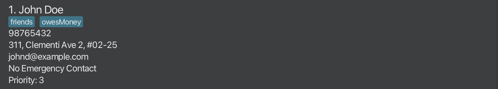

<h2 style="color: #FF6347;">NovaCare</h2>

A **desktop app for managing patients, optimized for use via a Line Interface** (CLI) while still having the benefits of a Graphical User Interface (GUI).
If you can type fast, NovaCare can get your patient management tasks done faster than traditional GUI apps.

--------------------------------------------------------------------------------------------------------------------
## Table of Contents

Refer to the sidebar if you are on the website.

<!-- * Table of Contents -->
<page-nav-print />

--------------------------------------------------------------------------------------------------------------------

## How to use NovaCare

This user guide is tailored for new and existing users of NovaCare.

If you are new to NovaCare, we recommend you to start with the [Quick Start](#quick-start) section.

If you are an existing user looking for a specific feature, you can jump to the [Features](#features) section or [Command Summary](#command-summary) section.

### Glossary
As you read through the user guide, you may come across some terms that are unfamiliar to you. Here is a glossary of terms that you may encounter:

| Term               | Definition                                                                                                                                                                         |
|--------------------|------------------------------------------------------------------------------------------------------------------------------------------------------------------------------------|
| **JAR**            | A Java ARchive (JAR) is a package file that compresses many Java files into a single executable file used for Java applications.                                                   |
| **CLI**            | A Command Line Interface (CLI) is a text-based interface used to interact with software using text commands.                                                                       |
| **PARAMETER**      | A parameter is the text that is passed to a software to perform a specific action.                                                                                                 |
| **Prefix**         | A prefix is a keyword that is used to identify the type of parameter that is being passed to the software.                                                                         |
| **GUI**            | A Graphical User Interface (GUI) is a visual interface that allows users to interact with software using graphical icons and indicators.                                           |
| **Command**        | A command is an input action given to the software to perform a specific action.                                                                                                   |
| **Index**          | An index is a unique number assigned to each item in a GUI list to identify and reference the item.                                                                                |
| **Tag**            | A tag is a label that is assigned to a patient to take note of their medical conditions.                                                                                           |
| **Priority Level** | A priority level is a value assigned to a patient to indicate the urgency of their medical condition. 1 indicates a critical condition while 3 indicates a non-critical condition. |
| **[word]**         | Words in square brackets are optional parameters that can be included in the command.                                                                                              |

### Annotations box
The following are annotations throughout this user guide that provide additional information to help you understand the NovaCare features better.

<box type="info" seamless>

**Note:** Additional information about the Commands.
</box>

<box type="tip" seamless>

**Tip:** Provide tips to help users understand the command usage better.
</box>

<box type="warning" seamless>

**Warning:** Warns you about potential errors that you may face when using the NovaCare.
</box>

--------------------------------------------------------------------------------------------------------------------

## Quick start

This section provides a quick overview of how to set up and run NovaCare on your computer.

### Step 1. Ensure you have Java `17` or above installed in your Computer. You can download Java [here](https://www.oracle.com/java/technologies/downloads/#java17).

For **Windows** users, you can type **Command Prompt** in the search bar.
Type `java -version` to check if you have Java installed.
Upon successful installation, you should see something like this:

For **Mac/Linux** users, you can type **Terminal** in the search bar.
Type `java -version` to check if you have Java installed.
Upon successful installation, you should see something like this:

### Step 2. Download NovaCare [here](https://github.com/AY2425S1-CS2103T-F15-1/tp/releases).
1. Download the `NovaCareApp.jar` file from the link provided by scrolling down to Assets as shown below.
   
2. Click on the `NovaCareApp.jar` file to download it.
3. Upon downloading save the app to your preferred location. (e.g. `Desktop`)

### Step 3. Run the application
1. Open `Command Prompt` for Windows users or `Terminal` for Mac/Linux users.
2. Navigate to the preferred location where you saved the `NovaCareApp.jar` file.  
> e.g. `cd Desktop`
3. Run the application by typing  
> `java -jar NovaCareApp.jar`.

Upon successful execution, you should see the GUI of NovaCare covered in the next section.

## Overview of GUI

The GUI is broken down into different **sections** as shown in the image below:

1. **Command Box:** This is where you can type your commands to interact with the application.
2. **Result Display Box:** Displays the result of commands.
3. **Patient List:** Displays all the patients in the application.
4. **Task List:** Displays all the task for all patients.
5. **Menu Bar:** Contains the `File` and `Help` menu. (to exit or view the help menu)

## Get started with NovaCare
Here will be a basic guide on how to use the application.
1. **Launch help guide**:
   * Type the following command in the command box and press Enter to **view help window**:
      > `help`

2. **Clear all entries**:
   * Type the following command in the command box and press Enter to **clear all entries**:
      > `clear`

3. **Add a patient**:
   * Type the following command in the command box and press Enter to **add a patient**:
      > `add n/Johnson p/98765432 e/johnson123@gmail.com a/123, Clementi Rd, 1234665 t/diabetes`

4. **Edit patient information**:
   * Type the following command in the command box and press Enter to **edit a patients's information**:
      > `edit 1 p/91234567`

5. **Delete a patient**:
   * Type the following command in the command box and press Enter to **delete a patient**:
      > `delete 1`

6. **Add a task**:
    * Type the following command in the command box and press Enter to **add a task to the patient**:
        > `addtask 1 d/Eat paracetamol 1000mg`

7. **Exit**:
    * Type the following command in the command box and press Enter to **exit the program**:
        > `exit`

Refer to the [Features](#features) below for details of each command.

--------------------------------------------------------------------------------------------------------------------

## Features

This section provides a detailed explanation of the features available in NovaCare.

<box type="info" seamless>

**Notes about the command format:** 

* All command in NovaCare follows a specific structure. The command structure is as follows:
  `COMMAND prefix/PARAMETERS…​`
  * `e.g. add n/John Tan p/98765432 e/john@gmail.com a/123, Clementi Rd, 1234665`

* Words in `UPPER_CASE` are the parameters to be supplied by the user. 
  e.g. in `add n/NAME`, `NAME` is a parameter which can be used as `add n/John Doe`.

* Items in square brackets `[]` are optional. 
  e.g `n/NAME [t/TAG]` can be used as `n/John Doe t/friend` or as `n/John Doe`.

* Items with `…`​ after them can be used multiple times including zero times. 
  e.g. `[t/TAG]…​` can be used as ` ` (i.e. 0 times), `t/friend`, `t/friend t/family` etc.

* Parameters can be in any order. 
  e.g. if the command specifies `n/NAME p/PHONE_NUMBER`, `p/PHONE_NUMBER n/NAME` is also acceptable.

* Extraneous parameters for commands that do not take in parameters (such as `help`, `list`, `exit`, `clear`, `listincomplete` and `listtask`) will be ignored. 
  e.g. if the command specifies `help 123`, it will be interpreted as `help`.

* If you are using a PDF version of this document, be careful when copying and pasting commands that span multiple lines as space characters surrounding line-breaks may be omitted when copied over to the application.
</box>

### Parameter Information
The table below explains each of the parameter available in NovaCare.
It will provide the limitations and examples of the parameter.
<box type = "warning" seamless>

The parameters must follow the limitations as shown below.
Otherwise, the command will not be executed and display an error message in Result Display Box providing hints as shown below:

</box>

| Parameter   | Description             | Limitations                                                                                                                                                                                                                                                                                                                                                           | Example                                                                                 |
|-------------|-------------------------|-----------------------------------------------------------------------------------------------------------------------------------------------------------------------------------------------------------------------------------------------------------------------------------------------------------------------------------------------------------------------|-----------------------------------------------------------------------------------------|
| **NAME**    | Name of patient         | * Names should only contain alphanumeric characters and spaces. * It should not be blank.                                                                                                                                                                                                                                                                         | :white_check_mark: `Thomas Ho` :x: `Th@mas`                                         |
|**EMERGENCY_CONTACT_NAME**| Name of emergency contact| * Names should only contain alphanumeric characters and spaces. * It should not be blank.                                                                                                                                                                                                                                                                         | :white_check_mark: `Thomas Ho` :x: `Th@mas`                                         |
| **PHONE_NUMBER** | Phone number of patient | * Phone numbers should only contain numbers no spaces allowed. * At least 3 digits long. * Should not be blank. * Allow international numbers.                                                                                                                                                                                                            | :white_check_mark: `91234567` :white_check_mark: `60194723537` :x:`9123 4567`   |
| **EMERGENCY_CONTACT_NUMBER** | Phone number of emergency contact | * Phone numbers should only contain numbers no spaces allowed. * At least 3 digits long. * Should not be blank. * Allow international numbers.                                                                                                                                                                                                            | :white_check_mark: `91234567` :white_check_mark: `60194723537` :x:`9123 4567`   |
| **EMAIL**   | Email of patient        | *Format must be in `LOCAL-PART@DOMAIN`.  *No space allowed.  * `LOCAL-PART` contains alphanumeric characters and these special characters, excluding the parentheses, (+_.-).  * `LOCAL-PART` local-part may not start or end with any special character.  * `DOMAIN` must be at least 2 characters long, start and end with alphanumeric characters. | :white_check_mark: `thomasho@gmail.com` :x: `$thomas@gmail.com`(`LOCAL-PART` error) |
| **ADDRESS** | Address of patient      | * Address should not be blank.  * Address can take any values                                                                                                                                                                                                                                                                                                     | :white_check_mark: `123, Clementi Rd, 1234665`                                      |
| **TAG**     | Tag of patient          | * Tags take alphanumeric and spaces                                                                                                                                                                                                                                                                                                                                   | :white_check_mark: `high blood pressure` :x:`low income $`                          |
| **INDEX**   | Index of patient on GUI | * Index should be a positive integer.  * Index should not be blank.]                                                                                                                                                                                                                                                                                              | :white_check_mark: `1` :x: `0`                                                      |
| **DESCRIPTION** | Description of task | * Description should not be blank.  * Description can take any values.                                                                                                                                                                                                                                                                                            | :white_check_mark: `Eat paracetamol 1000mg`                                         |
|**PRIORITY_LEVEL** | Priority level of patient | * Priority level should be either 1, 2, 3 or reset.                                                                                                                                                                                                                                                                                                                   | :white_check_mark: `1` :x: `4`                                                      |

### Adding a patient: `add`

Adds a patient details to the system.

:pencil: Format: `add n/NAME p/PHONE_NUMBER e/EMAIL a/ADDRESS [t/TAG]…​`

<box type="info" seamless>

**Note:**
* Upon adding a patient the default priority is set to *3*. 
  * Users can change the priority level using the [`priority` command](#adding-priority-level-priority).
* To update emergency contact details, use the [`emergency` command](#adding-emergency-contact-emergency).
* A person will not be added if the name and phone number is already in the system.
* Refer to [Parameter Information](#parameter-information) for the limitations of each parameter.
</box>

<box type="tip" seamless>

**Tip:**
* A patient can have any number of tags (including 0)
* A patient can have multiple tags with no spaces between them.
* Use `edit` command if you made a mistake in adding a patient.
</box>

Examples:
* `add n/John Doe p/98765432 e/johnd@example.com a/John street, block 123, #01-01`
* `add n/Betsy Crowe t/friend e/betsycrowe@example.com a/Newgate Prison p/1234567 t/criminal`

### Listing all patients : `list`

Shows a list of all patients in the system.

:pencil: Format: `list`

### Editing a patient : `edit`

Edits an existing patient in the system.

:pencil: Format: `edit INDEX [n/NAME] [p/PHONE] [e/EMAIL] [a/ADDRESS] [t/TAG]…​`

<box type="info" seamless>

**Note:**
* Edits the patient at the specified `INDEX`. The index refers to the index number shown in the displayed patient list. The index **must be a positive integer** 1, 2, 3, …​
* At least one of the optional fields must be provided.
* Existing values will be updated to the input values.
* When editing tags, the existing tags of the patient will be removed i.e adding of tags is not cumulative.
* You can remove all the patient’s tags by typing `t/` without
  specifying any tags after it.
</box>

Examples:
*  `edit 1 p/91234567 e/johndoe@example.com` Edits the phone number and email address of the 1st patient to be `91234567` and `johndoe@example.com` respectively.
*  `edit 2 n/Betsy Crower t/` Edits the name of the 2nd patient to be `Betsy Crower` and clears all existing tags.

### Locating patients by name: `find`

Finds patients whose names contain any of the given keywords.

:pencil: Format: `find KEYWORD [MORE_KEYWORDS]`

<box type="info" seamless>

**Note:**
* The search is case-insensitive. e.g `hans` will match `Hans`
* The order of the keywords does not matter. e.g. `Hans Bo` will match `Bo Hans`
* Only the name is searched.
* Only full words will be matched e.g. `Han` will not match `Hans`
* Patients matching at least one keyword will be returned (i.e. `OR` search).
  e.g. `Hans Bo` will return `Hans Gruber`, `Bo Yang`
</box>

Examples:
* `find John` returns `john` and `John Doe`
* `find alex david` returns `Alex Yeoh`, `David Li` 
  

### Deleting a patient : `delete`

Deletes the specified patient and tasks associated to that patient from the system.

:pencil: Format: `delete INDEX`

<box type="info" seamless>

**Note:**
* Deletes the patient and task associated to that patient at the specified `INDEX`.
* The index refers to the index number shown in the displayed patient list.
* The index **must be a positive integer** 1, 2, 3, …​
</box>

Examples:
* `list` followed by `delete 2` deletes the 2nd patient in the system.
* `find john doe` followed by `delete 1` deletes the 1st patient in the results of the `find` command.

### Adding emergency contact : `emergency`

Adds an emergency contact and details to a patient in the system.

:pencil: Format: `emergency INDEX n/EMERGENCY_CONTACT_NAME p/EMERGENCY_CONTACT_NUMBER`

<box type="info" seamless>

**Note:**
* Adds an emergency contact and details at the specified `INDEX`.
* The index refers to the index number shown in the displayed patient list.
* The index **must be a positive integer** 1, 2, 3, …​
</box>

Examples:
* `emergency 1 n/tom tan p/91237171` adds an emergency contact `tom tan` with contact number `91237171` to 1st index in the patient list.

### Deleting emergency contact : `delemergency`

Deletes an emergency contact and its details from a patient in the system.

:pencil: Format: `delemergency INDEX

<box type="info" seamless>

**Note:**
* Deletes an emergency contact and its details at the specified `INDEX`.
* The index refers to the index number shown in the displayed patient list.
* The index **must be a positive integer** 1, 2, 3, …​
</box>

Examples:
* `delemergency 1` deletes the emergency contact of the 1st indexed patient in the patient list.

### Adding priority level : `priority`

Adds an priority level to a patient in the system.

:pencil: Format: `priority INDEX /level PRIORITY_LEVEL`

<box type="info" seamless>

**Note:**
* Adds a priority level at the specified `INDEX`.
* The index refers to the index number shown in the displayed patient list.
* The index **must be a positive integer** 1, 2, 3, …​
* The priority level **must be a positive integer** and only from **1, 2, 3**
</box>

Examples:
* `priority 1 /level 2` adds priority level `2` to 1st index in patient list.

### Deleting priority level : `deletelevel`

Delete a priority level to a patient in the system, resetting it to the default value **3**.

:pencil: Format: `deletelevel INDEX` or `priority INDEX l/reset`

<box type="info" seamless>

**Note:**
* Delete the current priority level at the specified `INDEX`.
* The index refers to the index number shown in the displayed patient list.
* The index **must be a positive integer** 1, 2, 3, …​
</box>

Examples:
* `deletelevel 1` deletes priority level of the 1st indexed patient in the patient list.
* `priority 1 l/reset` resets the priority level of the 1st indexed patient in the patient list.

### Adding a task : `addtask`

Adds a task to a patient in the system.

:pencil: Format: `addtask INDEX d/DESCRIPTION`

<box type="info" seamless>

**Note:**
* Adds a task at the specified `INDEX`.
* The index refers to the index number shown in the displayed patient list.
* The index **must be a positive integer** 1, 2, 3, …​
</box>

Examples:
* `list` followed by `addtask 2 d/Eat paracetamol 1000mg` adds a task to the 2nd patient in the system.
* `find John doe` followed by `addtask 1 d/Clear diapers` deletes the 1st patient in the results of the `find` command.

### Deleting a task : `deletetask`

Deletes a task for a patient in the system.

:pencil: Format: `deletetask INDEX`

<box type="info" seamless>

**Note:**
* Deletes a task at the specified `INDEX`.
* The index refers to the index number shown in the displayed patient list.
* The index **must be a positive integer** 1, 2, 3, …​
</box>

Examples:
* `deletetask 1` deletes the 1st task in the task list.

### Mark Task : `marktask`

Marks a task at a specific index.

:pencil: Format: `marktask INDEX`

<box type="info" seamless>

**Note:**
* Marks a task at the specified `INDEX`.
* The index refers to the index number shown in the displayed Task list.
* The index **must be a positive integer** 1, 2, 3, …​
</box>

Examples:
* `marktask 1` marks a task of the 1st index in task list.

### Find Task : `findtask`

Finds all task for a particular Patient specific index.

:pencil: Format: `findtask INDEX`

Examples:
* `marktask 1` marks a task of the 1st index in task list.

### List Task : `listtask`

List all tasks for all patients in the system.

:pencil: Format: `listtask`

### List Incomplete Task : `listincomplete`

List all incomplete tasks for all patients in the system.

:pencil: Format: `listincomplete`

### Viewing help : `help`

Shows a message explaning how to access the help page.

Format: `help`
<box type="info" seamless>

**Note:**
* Due to the amount of commands, the Help Window is made such that it will still be displayed at foreground despite clicking back to NovaCare.
* To hide it, click the `minimize button` on the top right hand corner of the Help Window as shown below.
* To close it, click the `close button` on the top right hand corner of the Help Window as shown below.
</box>

### Clearing all entries : `clear`

Clears all patient and tasks entry from NovaCare.

:pencil: Format: `clear`

<box type="warning" seamless>

**Warning:**
Using this command will **CLEAR ALL PATIENT AND TASK RECORDS** in the NovaCare. 
**This action is irreversible!**
</box>

### Exiting the program : `exit`

Exits the program.

:pencil: Format: `exit`

### Saving the data

AddressBook data are saved in the hard disk automatically after any command that changes the data. There is no need to save manually.

### Editing the data file

AddressBook data are saved automatically as a JSON file `[JAR file location]/data/addressbook.json`. Advanced users are welcome to update data directly by editing that data file.

<box type="warning" seamless>

**Caution:**
If your changes to the data file makes its format invalid, AddressBook will discard all data and start with an empty data file at the next run.  Hence, it is recommended to take a backup of the file before editing it. 
Furthermore, certain edits can cause the AddressBook to behave in unexpected ways (e.g., if a value entered is outside the acceptable range). Therefore, edit the data file only if you are confident that you can update it correctly.
</box>

### Archiving data files `[coming in v2.0]`

_Details coming soon ..._

--------------------------------------------------------------------------------------------------------------------

## FAQ

**Q**: How do I **transfer my data** to another Computer? 
**A**: Install the app in the other computer and overwrite the empty data file it creates with the file that contains the data of your previous AddressBook home folder.

**Q**: What should I do if NovaCare **doesn't start** after double-clicking the JAR file?  
**A**: Ensure Java is correctly installed by typing `[java -version]` in your command prompt or terminal. If Java is not recognized, install it from Oracle's official site.

--------------------------------------------------------------------------------------------------------------------

## Known Issues

1. **When using multiple screens**, if you move the application to a secondary screen, and later switch to using only the primary screen, the GUI will open off-screen. The remedy is to delete the `preferences.json` file created by the application before running the application again.
2. **If you minimize the Help Window** and then run the `help` command (or use the `Help` menu, or the keyboard shortcut `F1`) again, the original Help Window will remain minimized, and no new Help Window will appear. The remedy is to manually restore the minimized Help Window.

--------------------------------------------------------------------------------------------------------------------

## Command Summary

### Patient-Related Commands:
| Action                    | Format Examples                                                                                                                                          |
|---------------------------|----------------------------------------------------------------------------------------------------------------------------------------------------------|
| **Add**                   | `add n/NAME p/PHONE_NUMBER e/EMAIL a/ADDRESS [t/TAG] `   e.g., `add n/James Ho p/94391857 e/jamesho@gmail.com a/123, Clementi Rd, 1234665 t/diabetes` |
| **Edit**                  | `edit INDEX [n/NAME] [p/PHONE] [e/EMAIL] [a/ADDRESS] [t/TAG]`   e.g., `edit 1 p/91234567 e/john13432@gmail.com`                                       |
| **Change Priority**       | `priority INDEX l/PRIORITY_LEVEL`   e.g., `priority 1 l/2`                                                                                            |
| **Delete Priority**       | `priority INDEX l/reset`   e.g., `priority 2 l/reset`                                                                                                      |
| **Add Emergency Contact** | `emergency INDEX n/EMERGENCY CONTACT NAME p/EMERGENCY CONTACT NUMBER`   e.g., `emergency 1 n/tom tan p/91237171`                                      |
| **Delete Emergency Contact** | `delemergency INDEX`   e.g., `delemergency 1`                                                                                                         |
| **List**                  | `list`                                                                                                                                                   |
| **Delete**                | `delete INDEX`  e.g., `delete 3`                                                                                                                      |
| **Find**                  | `find KEYWORD [MORE_KEYWORDS]`  e.g., `find John`                                                                                                     |

### Task-Related Commands:
| Action              | Format, Examples                                                                   |
|---------------------|------------------------------------------------------------------------------------|
| **Add Task**        | `addtask INDEX d/TASK_DESCRIPTION`   e.g., `addtask 1 d/Eat paracetamol 1000mg` |
| **Delete Task**     | `deletetask INDEX`  e.g., `deletetask 1`                                        |
| **Find Task**       | `findtask INDEX`  e.g., `findtask 1`                                            |
| **List Task**       | `listtask`                                                                         |
| **Mark Task**       | `marktask INDEX`  e.g., `marktask 1`                                            |
| **List Incomplete** | `listincomplete`                                                                   |

### Other Commands:
| Action                | Format, Examples       |
|-----------------------|------------------------|
|**Help**               | `help`                 |
|**Clear**              | `clear`                |
|**Exit**               | `exit`                 |
