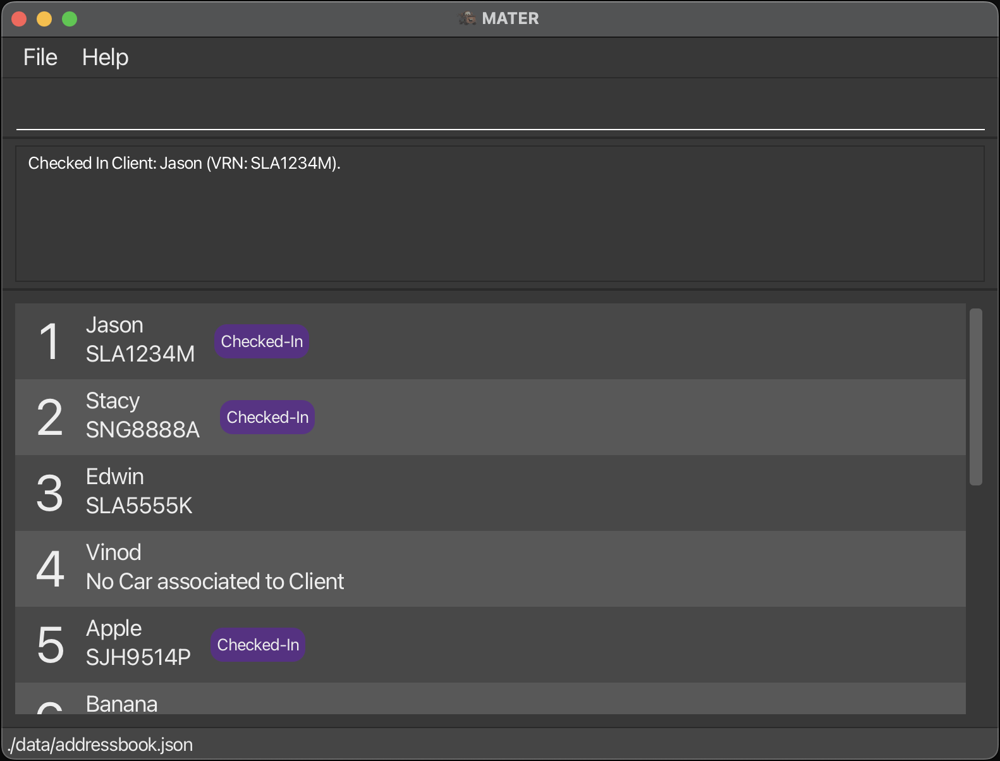

<style>
  .highlight-feature {
    padding: 5px 10px;
    margin-left: 5px;
    border-radius: 15px;
    background-color: #d3d3d3;
    color: #000000;
    transition: background-color 0.3s, color 0.3s;
  }

  .highlight-feature:hover {
    background-color: #b3b3b3;
    cursor: pointer;
  }

  /* New styles for the copied state */
  .highlight-feature.copied {
    background-color: #28a745; /* Green background to indicate success */
    color: #ffffff;
  }

  .highlight-feature.copied::after {
    content: ' ✓ Copied!';
    margin-left: 5px;
    font-weight: bold;
    font-size: 0.4em;
  }

  .icon {
    margin-right: 7px;
  }

</style>

<script>
  function copyToClipboard(text, element) {
    console.log("Copying to clipboard: " + text);
    navigator.clipboard.writeText(text).then(function() {
      // Add 'copied' class to the element
      element.classList.add('copied');

      // Remove the 'copied' class after 1.4 seconds
      setTimeout(function() {
        element.classList.remove('copied');
      }, 1400);
    }, function(err) {
      console.error('Could not copy text: ', err);
    });
  }
</script>


<link rel="stylesheet" href="https://cdnjs.cloudflare.com/ajax/libs/font-awesome/6.0.0-beta3/css/all.min.css">


<h1 style="color: #964B00;"> <i class="fas fa-book icon"></i> MATER User Guide </h1>

Welcome to MATER, a **desktop app designed for efficient management of client and vehicle information in car workshops**. MATER is specially optimized for users who prefer quick interactions through a Graphical User Interface (GUI) while benefiting from the powerful speed of command-based navigation for faster workflows.

<!-- * Table of Contents -->
<page-nav-print />

---

### **Why MATER?**

Modern car workshops often face a variety of operational challenges:
- **Overwhelming client data**: Handling customer and vehicle information can be cumbersome and prone to errors without a dedicated system.
- **Poor record-keeping**: Relying on spreadsheets or paper records leads to inefficiencies, especially when managing vehicle histories, service issues, or specific vehicle details.
- **Slow task execution**: Traditional systems require multiple clicks and navigation steps, slowing down workshop efficiency.


### **Our Solution**

MATER was designed to address these challenges directly:
- **Centralized client management**: Keep all client and vehicle records in one place, reducing the chance of data duplication and simplifying access.
- **Streamlined command-based controls**: Users can type commands to perform tasks faster than by navigating through a typical GUI.
- **Reliable data tracking**: Track issues and maintenance details with consistency, ensuring no information is lost and that clients receive high-quality service.


### **Product Overview**

MATER offers a feature-rich platform with the following capabilities:
- **Client and Vehicle Management**: Store and organize clients' personal details, vehicle registration, and service history.
- **Quick Search and Filter Options**: Find clients and cars instantly by name or vehicle registration number.
- **Command Shortcuts**: Use simple, structured commands to add, edit, delete, or view client details with minimal steps.
- **Status Tracking**: Mark clients as checked in or out for better tracking of in-progress services.
- **Automatic Data Storage**: MATER saves all data automatically, minimizing the risk of accidental data loss.


### **User Base**

MATER is designed for **small to medium-sized car workshop managers** and their team members who:
- **Need faster, streamlined data access** for client and vehicle information.
- **Prefer a hands-on approach** to managing their client lists with minimal steps.

Whether you're a workshop owner, a mechanic, or an administrative staff member responsible for managing records, MATER empowers you to achieve efficient, accurate, and consistent data handling with ease.


--------------------------------------------------------------------------------------------------------------------


<h2 style="color: #28B463;"> <i class="fas fa-rocket icon"></i> Quick Start</h2>

1. **Check Your System**  
   MATER requires **Java 17 or above** to run. If you’re unsure whether it’s installed, you can download it [here](https://www.java.com).

2. **Download MATER**  
   Visit [this link](https://github.com/AY2425S1-CS2103T-T14-3/tp/releases) and download the latest version of MATER as a `.jar` file. This file is the program you’ll be opening each time you use MATER.

3. **Place the Downloaded File**  
   Move the downloaded file to any folder on your computer where you want to keep MATER and its data. This will be your **MATER home folder**.

4. **Open MATER**

   - **Option 1: Open MATER by Double-Clicking**
     - Go to the folder where you saved the `.jar` file.
     - **On Windows or Linux**: Double-click the `.jar` file to open it.
     - **On Mac**: Right-click the `.jar` file, select “Open With,” and choose Java.

   - **Option 2: Open MATER from the Terminal**  
     - Open the **command prompt** (Windows) or **terminal** (Mac/Linux).
     - Use the `cd` command to go to the folder where you saved the `.jar` file. For example, type:
       ```shell
       cd path/to/your/folder
       ```
     - Then, type the following command and press Enter:
       ```shell
       java -jar mater.jar
       ```
     After a few seconds, the MATER window should appear on your screen, preloaded with sample data for you to explore.

5. **Using MATER**  
   MATER has a command box at the bottom where you can type in simple commands to manage your clients and their cars. Here are a few basic commands to get you started:
   - **View all clients**: Type `list` and press Enter to see a list of all clients.
   - **Add a client**: Type `add-client n/John Doe p/98765432 e/johnd@example.com a/123 Example Street` to add a new client named John Doe.
   - **Delete a client**: Type `del-client 3` to delete the 3rd client in the list.
   - **Clear all data**: Type `clear` to remove all clients from MATER.
   - **Exit the app**: Type `exit` to close MATER.

6. **Where to Go Next**  
   For more details on what MATER can do, scroll down to the [Features](#features) section of this guide to explore additional commands and features.


--------------------------------------------------------------------------------------------------------------------

<h2 style="color: #AF7AC5;" id="glossary"> <i class="fas fa-list-alt icon"></i> Glossary</h2>

- **Client:** A person who uses the services of the workshop. In MATER, a client is someone whose personal details are stored and managed.
- **VRN (Vehicle Registration Number):** The unique identifier assigned to a vehicle upon registration. In Singapore, it typically follows the format `XXX1234C`, where:
  - `X` represents an alphabet letter.
  - `1234` represents a four-digit number.
  - `C` represents a checksum letter as defined by the [Land Transport Authority (LTA)](https://en.wikipedia.org/wiki/Vehicle_registration_plates_of_Singapore).
- **VIN (Vehicle Identification Number):** A unique 17-character alphanumeric code assigned to each vehicle by the manufacturer, used to identify individual motor vehicles.
- **Checksum Letter:** The final character in a VRN, calculated based on the other characters to ensure the VRN's validity.
- **Issue:** A problem or maintenance task associated with a client's car. Issues can be recorded in MATER for tracking and management purposes.
- **Command Line Interface (CLI):** A text-based user interface used to interact with MATER by typing commands into a console or terminal.
- **Graphical User Interface (GUI):** A visual interface that allows users to interact with MATER through graphical icons and visual indicators.
- **Command Prefixes:** Short codes used in commands to specify the type of data being entered. For example:
  - `n/` for name
  - `p/` for phone number
  - `e/` for email address
  - `a/` for address
  - `vrn/` for Vehicle Registration Number
  - `vin/` for Vehicle Identification Number
  - `make/` for car make
  - `model/` for car model
  - `i/` for issue
- **Index:** The numerical position of an item in a list, starting from 1. Used in commands like `edit` and `del-client` to specify which client to modify.
- **Field:** An individual piece of data associated with a client or car (e.g., name, phone number, VIN).
- **Optional Field:** A parameter in a command that is not required but can be provided to include additional information. Denoted by square brackets `[]` in command formats.

--------------------------------------------------------------------------------------------------------------------

<h2 id="features" style="color: #000000;"> <i class="fas fa-cogs icon"></i> Features</h2>

<box type="info" seamless>

**Notes about the Command Format:**

- **Parameters in UPPER_CASE** are to be supplied by the user.
  - e.g., in `add-client n/NAME`, `NAME` is a parameter which can be used as `add-client n/John Doe`.
- **Items in square brackets are optional.**
  - e.g., `n/NAME [i/ISSUE]` can be used as `n/John Doe i/oil` or as `n/John Doe`.
- **Items with `...` after them can be used multiple times, including zero times.**
  - e.g., `[i/ISSUE]...` can be used as   (i.e., 0 times), `i/wheel`, `i/steering i/oil`, etc.
- **Parameters can be in any order.**
  - e.g., if the command specifies `n/NAME p/PHONE_NUMBER`, `p/PHONE_NUMBER n/NAME` is also acceptable.
- **Extraneous parameters for commands that do not take in parameters will be ignored.**
  - e.g., if the command is `help`, `help 123` will be interpreted as `help`.
- **Copying commands from PDFs:**
  - If you are using a PDF version of this document, be careful when copying and pasting commands that span multiple lines, as space characters surrounding line-breaks may be omitted when copied over to the application.

</box>

<h3 style="color: #1877F2;">Viewing Help: <span class="highlight-feature" onclick="copyToClipboard(this.textContent, this)">help</span></h3>

Shows a message explaining how to access the help page.

**Format:** `help`

**Parameters:**

Parameter | Requirements | Explanation
--- | --- | ---
*(None)* | *(None)* | The `help` command takes no parameters.


---

<h3 id="adding-a-client-add-client" style="color: #1877F2;">Adding a Client: <span class="highlight-feature" onclick="copyToClipboard(this.textContent, this)">add-client</span></h3>

Adds a client to MATER.

**Format:**

```shell
add-client n/NAME p/PHONE_NUMBER e/EMAIL a/ADDRESS [vrn/CAR_VRN] [vin/CAR_VIN] [make/CAR_MAKE] [model/CAR_MODEL] [i/ISSUE]...​
```

**Parameters:**

Parameter | Requirements | Explanation
--- | --- | ---
`n/NAME` | Required; Must alphanumeric and be at most 40 characters; Must be unique | Client's name.
`p/PHONE_NUMBER` | Required; Must be between 3 and 15 digits | Client's phone number.
`e/EMAIL` | Required | Client's email address.
`a/ADDRESS` | Required; Must be at most 80 characters | Client's address.
`vrn/CAR_VRN` | Optional; Required if adding a car; Must follow the [VRN format](#glossary) and be unique | Car's [Vehicle Registration Number](#glossary).
`vin/CAR_VIN` | Optional; Required if adding a car; Must be a unique 17-character alphanumeric string | Car's [Vehicle Identification Number](#glossary).
`make/CAR_MAKE` | Optional; Required if adding a car; First letter must be capitalized; Must be at most 40 characters; No spaces | Car's make.
`model/CAR_MODEL` | Optional; Required if adding a car; First character is a capitalized letter or a number; Must be at most 40 characters; No spaces | Car's model.
`i/ISSUE` | Optional; Issues must be unique; Identical Issues will be ignored; Multiple entries allowed only if client has a car; Each [Issue](#glossary) must be alphanumeric (max 20 characters) | Issue(s) associated with the car.

**Notes:**

- If adding a client with a car, all car fields (`vrn`, `vin`, `make`, `model`) must be provided.
- If the client does not have a car, these fields should be omitted completely.

<box type="tip" seamless>

**Tip:**

- A client can have any number of issues (including 0).
- A client may be added with or without a car.

</box>

**Examples:**

- `add-client n/John Doe p/98765432 e/johnd@example.com a/John street, block 123, #01-01`
- `add-client n/Betsy Crowe p/92345678 e/betsycrowe@example.com a/Newgate Prison vrn/SJH9514P vin/1G6ABC129P5123456 make/Toyota model/Corolla`

---

<h3 style="color: #1877F2;">Adding a Car to a Client: <span class="highlight-feature" onclick="copyToClipboard(this.textContent, this)">add-car</span></h3>

Adds a car to a client.

**Format:**

```shell
add-car INDEX vrn/CAR_VRN vin/CAR_VIN make/CAR_MAKE model/CAR_MODEL​
```

**Parameters:**

Parameter | Requirements | Explanation
--- | --- | ---
`INDEX` | Required; Must be a positive integer | The [Index](#glossary) of the client in the displayed client list.
`vrn/CAR_VRN` | Required; Must follow the [VRN format](#glossary) and be unique | Car's [Vehicle Registration Number](#glossary).
`vin/CAR_VIN` | Required; Must be a unique 17-character alphanumeric string | Car's [Vehicle Identification Number](#glossary).
`make/CAR_MAKE` | Required; First letter must be capitalized; Must be at most 40 characters; No spaces | Car's make.
`model/CAR_MODEL` | Required; First character is a capitalized letter or a number; Must be at most 40 characters; No spaces | Car's model.

**Notes:**

- The client must not already have a car.

**Examples:**

- `add-car 1 vrn/SJH9514P vin/1G6ABC129P5123456 make/Toyota model/Corolla`

---

<h3 style="color: #1877F2;">Checking in / out a Client: <span class="highlight-feature" onclick="copyToClipboard(this.textContent, this)">check</span></h3>

Checks in / out a client.

**Format:**

```shell
check INDEX​
```

**Parameters:**

Parameter | Requirements | Explanation
--- | --- | ---
`INDEX` | Required; Must be a positive integer | The [Index](#glossary) of the client in the displayed client list.

**Notes:**

- The client must have a car to check in / out.
- If the client is not checked in, `check` will check in the client.
- If the client is checked in, `check` will check out the client.

**Examples:**

- `check 1`

The following image is the result of executing `check 1`.



---

<h3 style="color: #1877F2;">Deleting a Car of a Client: <span class="highlight-feature" onclick="copyToClipboard(this.textContent, this)">del-car</span></h3>

Deletes a car from a client.

**Format:**

```shell
del-car INDEX​
```

**Parameters:**

Parameter | Requirements | Explanation
--- | --- | ---
`INDEX` | Required; Must be a positive integer | The [Index](#glossary) of the client in the displayed client list.

**Notes:**

- The client must have a car to delete.
- Issues associated with the car will be removed.
- The car will be removed from the client's details.

**Examples:**

- `del-car 1`

---

<h3 style="color: #1877F2;">Listing All Clients: <span class="highlight-feature" onclick="copyToClipboard(this.textContent, this)">list</span></h3>

Shows a list of all clients in MATER.

**Format:**

```shell
list
```

**Parameters:**

Parameter | Requirements | Explanation
--- | --- | ---
*(None)* | *(None)* | The `list` command takes no parameters.

---

<h3 style="color: #1877F2;">Editing a Client: <span class="highlight-feature" onclick="copyToClipboard(this.textContent, this)">edit</span></h3>

Edits an existing client in MATER.

**Format:**

```shell
edit INDEX [n/NAME] [p/PHONE] [e/EMAIL] [a/ADDRESS] [vrn/CAR_VRN] [vin/CAR_VIN] [make/CAR_MAKE] [model/CAR_MODEL] [i/ISSUE]...​
```

**Parameters:**

Parameter | Requirements | Explanation
--- | --- | ---
`INDEX` | Required; Must be a positive integer | The [Index](#glossary) of the client in the displayed client list.
`n/NAME` | Optional; Must alphanumeric and be at most 40 characters; Must be unique | New name of the client.
`p/PHONE` | Optional; Must be between 3 and 15 digits | New phone number of the client.
`e/EMAIL` | Optional | New email address of the client.
`a/ADDRESS` | Optional; Must be at most 80 characters | New address of the client.
`vrn/CAR_VRN` | Optional; Must follow [VRN format](#glossary) and be unique | New [Vehicle Registration Number](#glossary) of the client's car.
`vin/CAR_VIN` | Optional; Must be a unique 17-character alphanumeric string | New [Vehicle Identification Number](#glossary) of the client's car.
`make/CAR_MAKE` | Optional; First letter must be capitalized; Must be at most 40 characters; No spaces | New make of the client's car.
`model/CAR_MODEL` | Optional; First character is a capitalized letter or a number; Must be at most 40 characters; No spaces | New model of the client's car.
`i/ISSUE` | Optional; Issues must be unique; Identical Issues will be ignored; Multiple entries allowed only if client has a car; Each [Issue](#glossary) must be alphanumeric (max 20 characters) | Updates list of the client's current issues.

**Notes:**

- At least one of the optional fields must be provided.
- Existing values will be updated to the input values.
- When editing issues, the existing issues of the client will be replaced with the new issues.
- To remove all issues from the client, type `i/` without specifying any issues after it.

**Examples:**

- `edit 1 p/91234567 e/johndoe@example.com`
  Edits the phone number and email address of the 1st client to `91234567` and `johndoe@example.com` respectively.
- `edit 2 n/Betsy Crowe i/`
  Edits the name of the 2nd client to `Betsy Crowe` and clears all existing issues.
- `edit 3 make/Hyundai model/Ioniq 6`
  Edits the make of the 1st client's car to `Hyundai` and model to `Ioniq 6`.


---

<h3 style="color: #1877F2;">Locating Clients by Name or Car VRN: <span class="highlight-feature" onclick="copyToClipboard(this.textContent, this)">find</span></h3>

Finds clients whose names or car VRN contain any of the given keywords.

**Format:**

```shell
find KEYWORD [MORE_KEYWORDS]
```

**Parameters:**

Parameter | Requirements | Explanation
--- | --- | ---
`KEYWORD` | Required | A keyword to search for in client names or car [VRN](#glossary).
`[MORE_KEYWORDS]` | Optional | Additional keywords.

**Notes:**

- The search checks both the client's name and the car's [Vehicle Registration Number (VRN)](#glossary).
- The search is case-insensitive (e.g., `hans` will match `Hans`).
- The order of the keywords does not matter (e.g., `Hans Bo` will match `Bo Hans`).
- Only full words will be matched (e.g., `Han` will not match `Hans`).
- Clients matching at least one keyword will be returned (i.e., an `OR` search).

**Examples:**

- `find John`
  Returns clients with names like `John` and `John Doe`.
- `find alex david`
  Returns `Alex Yeoh`, `David Li`.
- `find SJH9514P`
  Returns client with car [VRN](#glossary) `SJH9514P`.

The following image is the result of executing `find Jason SJH9514P`.


---

<h3 style="color: #1877F2;">Getting Client's Details: <span class="highlight-feature" onclick="copyToClipboard(this.textContent, this)">view</span></h3>

Views a client's details in MATER.

**Format:**

```shell
view INDEX
```

**Parameters:**

Parameter | Requirements | Explanation
--- | --- | ---
`INDEX` | Required; Must be a positive integer | The [Index](#glossary) of the client in the displayed client list.

**Examples:**

- `view 1`
  Returns client details of the 1st client in MATER.

The following image is the result of executing `view 1`.


<box type="info" seamless>

**Note:** The client's details in the `view` window will remain unchanged even if the client's information is updated. This is intentional as it allows users to reference the client's details before the update.

The `correct as of` timestamp at the top right corner of the `view` window shows the time when the window was opened, helping to avoid any confusion.

</box>

---

<h3 style="color: #1877F2;">Deleting a Client: <span class="highlight-feature" onclick="copyToClipboard(this.textContent, this)">del-client</span></h3>

Deletes the specified client from MATER.

**Format:**

```shell
del-client INDEX
```

**Parameters:**

Parameter | Requirements | Explanation
--- | --- | ---
`INDEX` | Required; Must be a positive integer | The [Index](#glossary) of the client in the displayed client list.

**Examples:**

- `list`<br>
  `del-client 2`<br>
  Deletes the 2nd client in MATER.
- `find Betsy`<br>
  `del-client 1`<br>
  Deletes the 1st client in the results of the `find` command.
- `del-client 3`<br>
  Deletes the 3rd client in MATER.

---

<h3 style="color: #1877F2;">Clearing All Entries: <span class="highlight-feature" onclick="copyToClipboard(this.textContent, this)">clear</span></h3>

Clears all entries from MATER.

<box type="warning" seamless>

**Warning:** This command will delete all clients from MATER. This action is irreversible.

</box>

**Format:**

```shell
clear
```

**Parameters:**

Parameter | Requirements | Explanation
--- | --- | ---
*(None)* | *(None)* | The `clear` command takes no parameters.

---

<h3 style="color: #1877F2;">Exiting the Program: <span class="highlight-feature" onclick="copyToClipboard(this.textContent, this)">exit</span></h3>

Closes the MATER application.

**Format:**

```shell
exit
```

**Parameters:**

Parameter | Requirements | Explanation
--- | --- | ---
*(None)* | *(None)* | The `exit` command takes no parameters.

---

<h3 style="color: #1877F2;">Saving the Data</h3>

MATER's data is saved automatically in the hard disk after any command that changes its data. There is no need to save data manually.

---

<h3 style="color: #1877F2;">Editing the Data File</h3>

MATER's data is saved automatically as a JSON file at `[JAR file location]/data/addressbook.json`. Advanced users are welcome to update data directly by editing this data file.

<box type="warning" seamless>

**Caution: FOR EXPERT USERS ONLY**

- If your changes to the data file make its format invalid, MATER will discard all data and start with an empty data file at the next run. It is strongly recommended to create a backup of the file before editing it.
- Certain edits can cause MATER to behave in unexpected ways (e.g., if a value entered is outside the acceptable range). Therefore, edit the data file only if you are confident that you can update it correctly.

</box>

--------------------------------------------------------------------------------------------------------------------

<h2 style="color: #8E44AD;"> <i class="fas fa-question-circle icon"></i>  FAQ</h2>

**Q**: How do I transfer my data to another Computer?<br>
**A**: Install the app in the other computer and overwrite the empty data file it creates with the file that contains the data of your previous MATER home folder.

**Q**: What happens if I enter an invalid command?<br>
**A**: MATER will display an error message. You can refer to the [Features](#features) section for the correct command format or check the `HELP` section in the app.

**Q**: Can I undo a command?<br>
**A**: No, MATER does not support undoing commands. Please double-check your commands before executing them.

--------------------------------------------------------------------------------------------------------------------

<h2 style="color: #2980B9;"> <i class="fas fa-terminal icon"></i> Command Summary</h2>

| Action            | Format         | Examples              |
|-------------------|------------------------------------------------------------------------------------------------------------------------|------------------------------------------------------------------------------------------------------------------------------------------------------------------------------------------------------------------------------|
| **Add Client**    | `add-client n/NAME p/PHONE_NUMBER e/EMAIL a/ADDRESS [vrn/CAR_VRN] [vin/CAR_VIN] [make/CAR_MAKE] [model/CAR_MODEL] [i/ISSUE]...` | `add-client n/John Doe p/98765432 e/johnd@example.com a/John street, block 123, #01-01`<br>`add-client n/Betsy Crowe p/92345678 e/betsycrowe@example.com a/Newgate Prison vrn/SJH9514P vin/1G6ABC129P5123456 make/Toyota model/Corolla i/engine i/wheels` |
| **Add Car**       | `add-car INDEX vrn/CAR_VRN vin/CAR_VIN make/CAR_MAKE model/CAR_MODEL`   | `add-car 1 vrn/SJH9514P vin/1G6ABC129P5123456 make/Toyota model/Corolla`           |
| **Delete Car**    | `del-car INDEX`            | `del-car 1`    |
| **List Clients**  | `list` | `list`  |
| **Edit Client**   | `edit INDEX [n/NAME] [p/PHONE] [e/EMAIL] [a/ADDRESS] [vrn/CAR_VRN] [vin/CAR_VIN] [make/CAR_MAKE] [model/CAR_MODEL] [i/ISSUE]...` | `edit 1 p/91234567 e/johndoe@example.com`<br>`edit 2 n/Betsy Crower i/`    |
| **Find Clients**  | `find KEYWORD [MORE_KEYWORDS]`      | `find John`<br>`find SJH9514P`             |
| **View Client**   | `view INDEX`                    | `view 1`     |
| **Delete Client** | `del-client INDEX`   | `del-client 3`          |
| **Clear**         | `clear`       |     `clear`         |
| **Exit**          | `exit`                |   `exit`              |
| **Help**          | `help`               |     `help`            |

Back to Features [section](#features).
