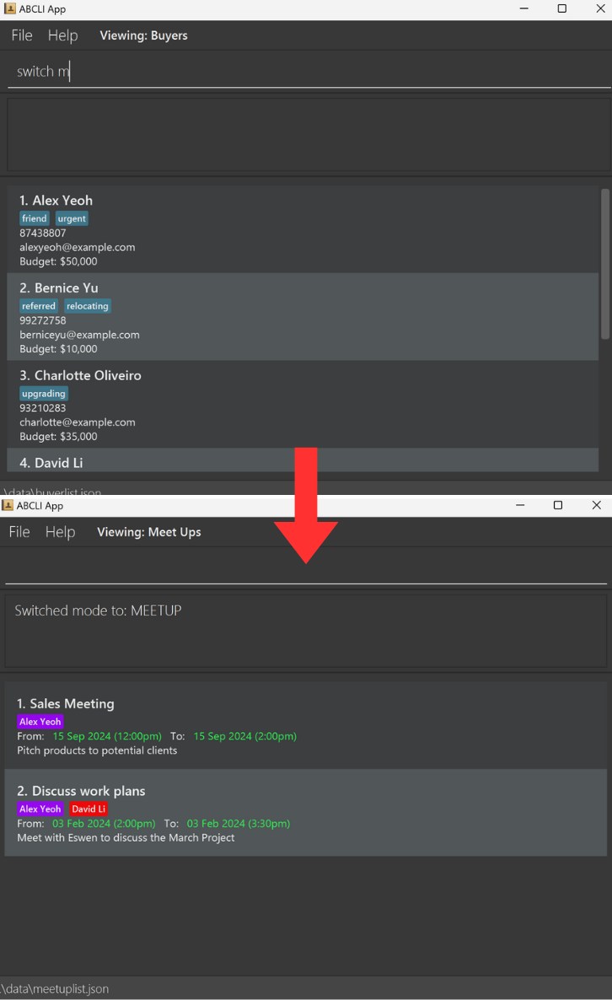
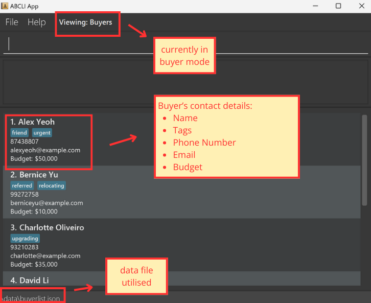
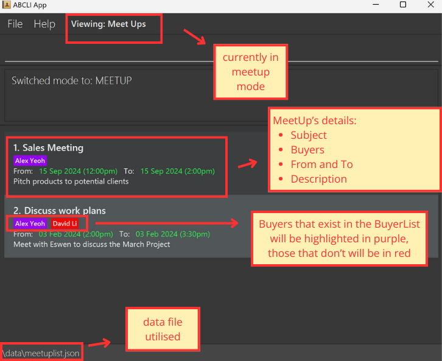
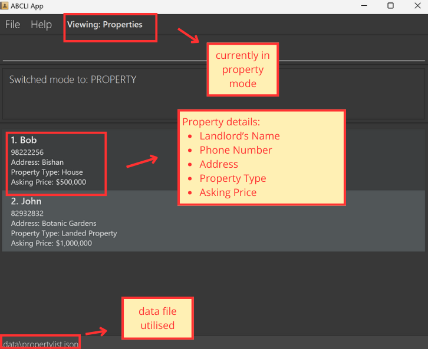
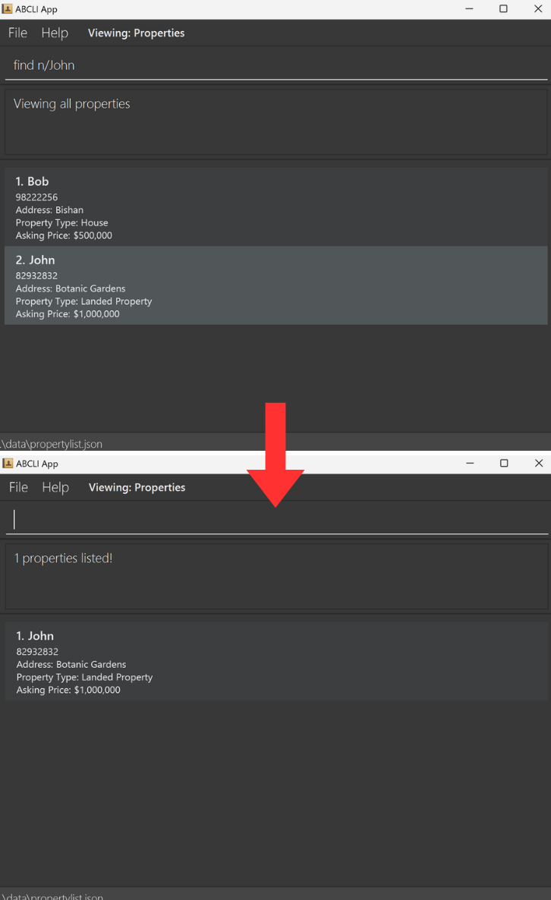

**Address Book Command Line Interface (ABCLI)** is a desktop application tailored for **real estate agents** who value the speed and efficiency of managing workflows through a **Command Line Interface (CLI)**. With the added support of a Graphical User Interface (GUI) for visual clarity, ABCLI empowers agents to handle contacts, schedule meetings, and organize property details significantly faster than traditional GUI-only applications. If you are a fast-typing real estate agent, ABCLI is designed to keep up with your speed, boosting your productivity.

:bulb: **Tip:**
For any terms that you are unfamiliar with, refer to the [Glossary of Terms](#glossary)

 

Table of Contents

* [How to use the User Guide](#how-to-user-guide)
  * [Display Boxes](#display-boxes)
* [Application Overview](#application-overview)
* [Quick Start](#quick-start)
* [Features](#features)
* [General](#general)
  * [Viewing help : `help`](#general-help)
  * [Exiting the program : `exit`](#general-exit)
  * [Saving the data](#general-save)
  * [Editing the data file](#general-edit)
  * [Switching parser modes:  `switch`](#general-switch)
* [Buyers](#buyers)
  * [Viewing all buyers : `view`](#view-buyer)
  * [Adding a buyer : `add`](#add-buyer)
  * [Editing a buyer : `edit`](#edit-buyer)
  * [Finding buyers : `find`](#find-buyer)
  * [Deleting a buyer : `delete`](#delete-buyer)
  * [Clearing all buyers : `clear`](#clear-buyer)
* [Meet Ups](#meet-ups)
  * [Viewing all meet-ups : `view`](#view-meetup)
  * [Adding a meet-up : `add`](#add-meetup)
  * [Editing a meet-up : `edit`](#edit-meetup)
  * [Finding meet-up : `find`](#find-meetup)
  * [Deleting a meet-up : `delete`](#delete-meetup)
  * [Clearing all meet-ups : `clear`](#clear-meetup)
* [Properties](#properties)
  * [Viewing all properties : `view`](#view-property)
  * [Adding a property : `add`](#add-property)
  * [Editing a property : `edit`](#edit-property)
  * [Finding properties : `find`](#find-property)
  * [Deleting a property : `delete`](#delete-property)
  * [Clearing all properties : `clear`](#clear-property)
* [FAQ](#faq)
* [Known issues](#known-issues)
* [Glossary of Terms](#glossary)
* [Command summary](#command-summary)
* [Acceptable Value Ranges for Parameters](#acceptable-parameters)

--------------------------------------------------------------------------------------------------------------------

How to Use the User Guide

This User Guide is designed to help you navigate and make the most of ABCLI. It introduces the application's features and guides you from getting started to mastering each function, all without requiring any prior knowledge. Explore each section below:

1. **[Table of Contents](#toc)**: Located at the start of the guide, this is useful whenever you want to locate a specific section or topic quickly.

2. **[Application Overview](#application-overview)**: Refer to this section if you are new to ABCLI or want to understand its purpose and primary capabilities. It is ideal for getting a high-level understanding of how ABCLI can support your real estate tasks.

3. **[Quick Start](#quick-start)**: Use this section if you are setting up ABCLI for the first time. It provides step-by-step instructions to get the app running.

4. **[Features](#features)**: This is your go-to section as you start using ABCLI. Divided into [General](#general), [Buyers](#buyers), [Meet Ups](#meet-ups), and [Properties](#properties), it details how to use each feature, including command formats, tips, and examples. Refer here whenever you need guidance on operating any part of the app.

5. **[FAQ](#faq)**: Consult this section if you encounter issues or have questions about ABCLI’s functionality. It provides answers to common questions and can help resolve typical challenges.

6. **[Known Issues](#known-issues)**: If ABCLI behaves unexpectedly, refer to this section to see if it’s a known issue. This section lists potential problems and workarounds, helping you troubleshoot effectively.

7. **[Glossary](#glossary)**: If you encounter any unfamiliar terms while using ABCLI or reading the guide, refer to the Glossary. It defines key terms to ensure clarity as you navigate the app.

8. **[Command Summary](#command-summary)**: Ideal as a quick reference guide, this section provides an overview of all available commands. Use it when you need to check the format or options for any command without going into full detail.

9. **[Acceptable Ranges for Parameters](#acceptable-parameters)**: This section provides a handy reference for troubleshooting, listing the valid input ranges and constraints for each command. Use it to ensure your command inputs satisfy the required constraints.

Display Boxes

Throughout the guide, you will see display boxes with additional information:

:bulb: **Tip:**
 Look out for these when you want to enhance your user experience or learn best practices.

**:information_source: Key Insights**
 Refer to these boxes for additional information.

:exclamation: **Caution:**
 Pay attention to these warnings to avoid potential pitfalls or issues.

:rocket: **Future Enhancement:**
 These boxes highlight features that are planned for future releases, keeping you informed about upcoming capabilities.

--------------------------------------------------------------------------------------------------------------------

Application Overview

ABCLI is divided into three core modes, each dedicated to a key aspect of a real estate agent workflows:

* **[Buyer Mode](#buyers)**: Organize prospective buyers with details like budget, contact info, and tags for effective monitoring and follow-up.

* **[Meet Up Mode](#meet-ups)**: Schedule and manage meet-ups with buyers, track attendees, and avoid scheduling conflicts.

* **[Property Mode](#properties)**: Store property listings, including landlord details, asking price, and property type for quick and easy references.

These modes allow real estate agents to handle buyers, meet-ups, and property listings at a rapid pace, ensuring an efficient, convenient and integrated workflow.

--------------------------------------------------------------------------------------------------------------------

Quick Start

1. Install Java `17` or above: Ensure that Java `17` or a later version is installed on your computer. You can download it [here](https://www.oracle.com/java/technologies/downloads/#java17).
    
:bulb: **Tip:**
    MacOS users can refer to this [set of instructions](https://se-education.org/guides/tutorials/javaInstallationMac.html) for easier installation.
    

1. Download the latest ABCLI application: Get the latest `ABCLI.jar` file from the [release page](https://github.com/AY2425S1-CS2103T-F13-2/tp/releases/).  

1. Choose a storage folder: Move the `ABCLI.jar` file to the folder where you want to store and run the application.

1. Open the command terminal:  
    * For Windows users, in the folder containing `ABCLI.jar`, right-click the empty space and select “Open in Terminal”.
      
        
      
    * For MacOS users, right-click the home folder, hover over “Services,” and select “New Terminal at Folder”.  

        

1. Run the application: Enter the command `java -jar ABCLI.jar` to start ABCLI.  

1. Verify the GUI: If you are successful in opening the application, a GUI similar to the below should appear in a few seconds.

   

    
:bulb: **Tip:**
    **Before you start**, ABCLI comes pre-populated with example data. We encourage you to practice the commands on this sample data to get familiar with the app. Once you are comfortable, you can use the `clear` command in each mode to reset the data in the respective modes.
    

1. Here is a quick guide to the GUI.

   

1. Enter commands: Type a command in the command box and press Enter to execute it. For example, typing `help` and pressing Enter will open the help window.

   Some example commands you can try:

   * `view` : Lists all buyers.

   * `add n/John Doe p/98765432 e/johnd@example.com b/120000` : Adds a buyer contact named `John Doe` to the Buyer list.

   * `delete 3` : Deletes the 3rd buyer shown in the current list.

   * `clear` : Deletes all buyers.

   * `exit` : Exits the app.

1. Explore available features: Refer to the [Features](#features) section below for details on each command.

--------------------------------------------------------------------------------------------------------------------

Features

**:information_source: Notes about the command format:** 

* Words in `UPPER_CASE` are the parameters to be supplied by the user. 
  e.g. in `add n/NAME`, `NAME` is a parameter which can be used as `add n/John Doe`.

* Items in square brackets are optional. 
  e.g `n/NAME [t/TAG]` can be used as `n/John Doe t/relocating` or as `n/John Doe`.

* Items with `…`​ after them can be used multiple times including zero times. 
  e.g. `[t/TAG]…​` can be used as ` ` (i.e. 0 times), `t/relocating`, `t/relocating t/upgrading` etc.

* Parameters can be in any order. 
  e.g. if the command specifies `n/NAME p/PHONE`, `p/PHONE n/NAME` is also acceptable.

* Extraneous parameters for commands that do not take in parameters (such as `help`, `view`, `exit` and `clear`) will be ignored. 
  e.g. if the command specifies `help 123`, it will be interpreted as `help`.

* If you are using a PDF version of this document, be careful when copying and pasting commands that span multiple lines as space characters surrounding line-breaks may be omitted when copied over to the application.

General

Viewing help : `help`

Shows a message explaining how to access the help page.

 

Format: `help`

Exiting the program : `exit`

Exits the program.

Format: `exit`

Saving the data

Data is saved in the hard disk automatically after any command that changes the data. There is no need to save manually.

Editing the data file

All data is saved automatically as a JSON file within the storage folder. Advanced users are welcome to update data directly by editing that data file.

Note: By default, the storage folder is set to a folder named `data` in the home folder.

:exclamation: **Caution:**
If your changes to the data file makes one of the fields invalid, the data files will discard all data and start with an empty data file at the next run. Hence, it is recommended to take a backup of the file before editing it. 
If any of the data files, e.g. `buyerlist.json` is deleted, it will create a new data file with pre-populated data, e.g. it will create a new `buyerlist.json` with prepopulated data. 
Furthermore, certain edits can cause the JSON files to behave in unexpected ways (e.g., if a value entered is outside the acceptable range). Therefore, edit the data file only if you are confident that you can update it correctly.

Switching parser modes : `switch`

Switches the parser mode to the specified parser mode.

Format: `switch PARSER_MODE`

* Switches the parser mode to the specified `PARSER_MODE`.
* The parser mode takes 3 types:
* `b` for [buyers](#buyers)
* `m` for [meet-ups](#meet-ups)
* `p` for [properties](#properties)
* The default parser mode is set to `b`.

Examples:
* Upon entering the application, the parser mode is set to `b`.
* `switch` followed by `m` switches the parser mode to meet-ups.

 

**:information_source: Notes about parser mode-switching:** 

* The mode before the switch can be seen at the top bar, where it says `Viewing: Buyers`, after the switch it changes to `Viewing: Meet Ups`.

* The view also automatically changes from showing `Buyers` to `Meet Ups` after the switch command, this view will also change appropriately when switching to `b` or `p`.

* The mode is important for command execution, e.g. to `add` a `Buyer`, you need to be in the `b` mode, to `add` a `MeetUp`, you need to be in the `m` mode, etc.

 
Buyers

Buyers represent your clients interested in purchasing properties. The buyer list allows you to keep track of each buyer's essential details such as name, phone number, email, and budget. Additionally, you can organize and personalize each buyer’s profile by assigning multiple tags. For instance, if a client, `Bernice Yu`, expresses interest in relocating, you could add the tag `relocating` to her contact.

 

**:information_source: These commands are for when the parser is in `b` mode (Buyer mode) see [switching parser modes](#general-switch):** 

* Note how the list already contains sample `Buyer`s (if this is the first time using the app)

* Note how the mode is highlighted by `Viewing: Buyers` above the command line

Viewing all buyers : `view`

Shows a list of all buyers in the buyer list.

Format: `view`

Adding a buyer: `add`

Adds a buyer to the buyer list.

Format: `add n/NAME p/PHONE e/EMAIL b/BUDGET [t/TAG]…​`

* New buyers must have unique names and must not be duplicate names of existing buyers.

:bulb: **Tip:**
A buyer can have any number of tags (including 0)

:exclamation: **Caution:**
Buyer's budget cannot exceed `9223372036854775807`. Refer to [known issues](#known-issues) for more information.

Examples:
* `add n/John Doe p/98765432 e/johnd@example.com b/100,000`
* `add n/Betsy Crowe t/urgent e/betsycrowe@example.com b/7,000,000 p/91234567 t/referred`

Editing a buyer : `edit`

Edits an existing buyer in the buyer list.

Format: `edit INDEX [n/NAME] [p/PHONE] [e/EMAIL] [b/BUDGET] [t/TAG]…​`

* Edits the buyer at the specified `INDEX`. The index refers to the index number shown in the displayed buyer list. 
* The index refers to the index number shown in the **displayed buyer list**.
* The index must be a positive integer: 1, 2, 3, …. ​If the index is not a positive integer, the error message shown will be `invalid command format`.
* At least one of the optional fields must be provided.
* Existing values will be updated to the input values.
* When editing tags, the existing tags of the buyer will be removed i.e adding of tags is not cumulative.
* You can remove all the buyer’s tags by typing `t/` without
    specifying any tags after it.

:bulb: **Tip:**
The `index` you use in the edit command is the one you see on your screen! E.g if `1. Alex Yeoh` is shown in the current filtered view, but `2. Alex Yeoh` was shown after any previous commands, use the one that you can see right now! 

Examples:
*  `edit 1 p/81234567 e/johndoe@example.com` Edits the phone number and email budget of the 1st buyer to be `81234567` and `johndoe@example.com` respectively.
*  `edit 2 n/Betsy Crower t/` Edits the name of the 2nd buyer to be `Betsy Crower` and clears all existing tags.

Finding buyers: `find`

Finds existing buyers in existing buyer list based on keywords.

Format: `find n/KEYWORD [MORE_KEYWORDS]`

* Only the name is searched.
* The search is case-insensitive. e.g `hans` will match `Hans`
* The order of the keywords does not matter. e.g. `Hans Bo` will match `Bo Hans`
* Only full words will be matched e.g. `Han` will not match `Hans`
* Buyers matching at least one keyword will be returned (i.e. `OR` search).
  e.g. `Hans Bo` will return `Hans Gruber`, `Bo Yang`

:rocket: **Future Enhancement:**
Planned update will allow searches using other attributes, such as: `b/BUDGET`, `p/PHONE`, `e/EMAIL`, and `t/TAG`.

Examples:
* `find n/John` returns `john` and `John Doe`
* `find n/alex david` returns `Alex Yeoh`, `David Li` 

 

Deleting a buyer : `delete`

Deletes the specified buyer from the buyer list.

Format: `delete INDEX`

* Deletes the buyer at the specified `INDEX`.
* The index refers to the index number shown in the **displayed buyer list**.
* The index must be a positive integer: 1, 2, 3, …​​. If the index is not a positive integer, the error message shown will be `invalid command format`.
* The index cannot exceed the displayed list's range.

:bulb: **Tip:**
The error message shown for a non-positive integer is different than the error message shown for an integer out of range! Check your input carefully!

Examples:
* `view` followed by `delete 2` deletes the 2nd buyer in the displayed buyer list.
* `find n/David` followed by `delete 1` deletes the 1st buyer in the displayed results of the `find` command.

Clearing all buyers : `clear`

Clears all entries from the buyer list.

Format: `clear`

:exclamation: **Caution:**
Using the clear command will delete all the buyers from the list of buyers, and there is no way to undo this, you may lose your data permanently.

 
Meet Ups

Meet-up represents any scheduled appointment with your clients, allowing you to record essential details, including the subject of the meeting, additional info, its start and end date-times (`From` and `To`), and the buyers involved. Additionally, ABCLI will highlight any overlapping meet-ups to help you avoid scheduling conflicts.

 

**:information_source: These commands are for when the parser is in `m` mode (MeetUp mode) see [switching parser modes](#general-switch):** 

* Note how the list already contains sample `Meet Up`s (if this is the first time using the app)

* Note how the mode is highlighted by `Viewing: Meet Ups` above the command line

* Note how each meet-up contains buyer, if the buyer exists in the BuyerList, it will be marked as purple, else red. The matching here is done by case-sensitive matching, e.g. `Alex Yeoh` will only be purple if there is `Alex Yeoh` in the Buyer List, not `Alex yeoh` or `alex yeoh` or `Alex`.

* However, if an existing buyer's name is edited, the buyer shown in meet-ups will not update accordingly and will just change from purple to red, e.g. in the image above, if the name of `Alex Yeoh` was changed in the BuyerList to `Alex Yeo`, in the meet-up mode, both meetings would still display `Alex Yeoh` but in red now.

Viewing all meet-ups : `view`

Shows a list of all meet-ups in the meet-up list.

Format: `view`

Adding a meet-up: `add`

Adds a meet-up to the meet-up list.

Format: `add s/MEETUP_SUBJECT i/MEETUP_INFO f/MEETUP_FROM t/MEETUP_TO n/BUYER_NAME [n/MORE_BUYER_NAMES]…​`

* New meet-ups must have at least one unique non-duplicate aspect from these three fields: `MEETUP_SUBJECT`, `MEETUP_FROM`, `MEETUP_TO`. Else, it will be marked as a duplicate meet-up.

* `MEETUP_FROM` and `MEETUP_TO` fields should follow the format `YYYY-MM-DD HH:mm`.

* `MEETUP_TO` must be a date-time that is later than `MEETUP_FROM`.

:exclamation: **Caution:**
When adding the `MEETUP_FROM` or `MEETUP_TO`, the `DD` parameter will take in any 2-digit number from 01 to 31. However, in some cases, such as February or April, the date 31 doesn't exist, in this case, instead of rejecting the input, the meet-up will be added but the date will be changed to the closest valid date in the same month. e.g. `2024-02-31 23:59` will create `2024-02-29 23:59`, `2024-04-31 12:00` will create `2024-04-30 12:00`, but `2024-04-32 12:00` will give an error since 32 is not a valid `DD` input.

* There must be at least one `BUYER_NAME` added.

* Buyers that exist in buyer list will be marked as purple, while those that do not will be marked as red, for more details see [here](#meet-ups).

Examples:
* `add s/Discuss work plans i/Meet with Alex and David to discuss the March Project f/2024-02-03 14:00 t/2024-02-03 15:30 n/Alex Yeoh n/David Li `

**:information_source: Clashing Timings:**
 Meet Ups with clashing timings will be displayed in red. Otherwise, the default display colour for timing is green.
 

Editing a meet-up : `edit`

Edits an existing meet-up in the meet-up list.

Format: `edit INDEX [s/MEETUP_SUBJECT] [i/MEETUP_INFO] [f/MEETUP_FROM] [t/MEETUP_TO] [n/BUYER_NAME]…​`

* Edits the meet-up at the specified `INDEX`.
* The index refers to the index number shown in the **displayed meet-up list**. 
* The index must be a positive integer 1, 2, 3, …​. If the index is not a positive integer, the error message shown will be `invalid command format`.
* At least one of the optional fields must be provided.
* Existing values will be updated to the input values.
* When editing buyers associated to the meet-up, the existing buyers will be removed i.e **adding of buyers is not cumulative**.

Examples:
*  `edit 1 i/Meet with Johnny to show him houses. f/2024-10-28 10:00 t/2024-10-28 12:00` edits the info, meet-up start time, and meet-up end time of the 1st meet-up to be `Meet with Johnny to show him houses.`, `2024-10-28 10:00` and `2024-10-28 12:00` respectively.
*  `edit 1 n/John` edits the buyers associated to the first meet-up to be **only** `John`.

Finding meet-ups: `find`

Finds meet-ups whose meet-up names contain any of the given keywords.

Format: `find s/KEYWORD [MORE_KEYWORDS]`

* The search is case-insensitive. e.g `meet` will match `Meet`
* Only the meet-up name is searched.
* Keyword will be matched to exact words, e.g. `meet` will not match `meeting`
* Meet-ups matching at least one keyword will be returned (i.e. `OR` search).
  e.g. `Sales Closing` will return `Sales Meeting`, `Closing Meeting`

:rocket: **Future Enhancement:**
Planned update will allow searches using other attributes, such as: `f/MEETUP_FROM`, `t/MEETUP_TO`, and `n/ADDED_BUYER`.

Examples:
* `find s/Meeting` returns `Sales Meeting` and `Closing Meeting`
* `find s/Sales` returns `Sales Meeting`

 

Deleting a meet-up : `delete`

Deletes the specified meet-up from the meet-up list.

Format: `delete INDEX`

* Deletes the meet-up at the specified `INDEX`.
* The index refers to the index number shown in the **displayed meet-up list**.
* The index must be a positive integer 1, 2, 3, …​​. If the index is not a positive integer, the error message shown will be `invalid command format`.
* The index cannot exceed the displayed list’s range.

Examples:
* `view` followed by `delete 2` deletes the 2nd meet-up in the meet-up list.
* `find s/meeting` followed by `delete 1` deletes the 1st meet-up in the results of the `find` command.

Clearing all meet-ups : `clear`

Clears all entries from the meet-up list.

Format: `clear`

:exclamation: **Caution:**
Using the clear command will delete all the meet-ups from the list of meet-ups, and there is no way to undo this, you may lose your data permanently.

 
Properties

Properties represent each property in your portfolio. The property list helps you keep track of each property's details such as the landlord's name and phone number, as well as the property's address, type (e.g. apartment, landed house, etc) and asking price.

 

**:information_source: These commands are for when the parser is in `p` mode (Property mode) see [switching parser modes](#general-switch):** 

* Note how the list already contains sample `Property`s (if this is the first time using the app)

* Note how the mode is highlighted by `Viewing: Properties` above the command line

Viewing all properties : `view`

Shows a list of all properties in the property list.

Format: `view`

Adding a property: `add`

Adds a property to the property list.

Format: `add n/LANDLORD_NAME p/PHONE a/ADDRESS s/ASKING_PRICE t/PROPERTY_TYPE`

* New properties must have unique addresses and must not be duplicate addresses of existing properties.

:exclamation: **Caution:**
Property's asking price cannot exceed `9223372036854775807`. Refer to [known issues](#known-issues) for more information.

Examples:
* `add n/John p/87152433 a/Paya Lebar s/200,000 t/Condominium`

Editing a property : `edit`

Edits an existing property in the property list.

Format: `edit INDEX [n/LANDLORD_NAME] [p/PHONE] [a/ADDRESS] [s/ASKING_PRICE] [t/PROPERTY_TYPE]`

* Edits the landlord at the specified `INDEX`. 
* The index refers to the index number shown in the **displayed property list**. 
* The index must be a positive integer 1, 2, 3, …​. ​If the index is not a positive integer, the error message shown will be `invalid command format`.
* At least one of the optional fields must be provided.
* Existing values will be updated to the input values.

Examples:
*  `edit 1 p/91234567 s/100000` Edits the first property's landlord phone number and its asking price to be `91234567` and `100,000` respectively.
*  `edit 2 n/Betsy Crower` Edits the name of the 2nd property's landlord to be `Betsy Crower`.

Finding properties: `find`

Find existing properties in the property list based on either name or address keywords.

Format: `find n/LANDLORD_NAME` or `find a/ADDRESS`

* The tags used in searching should only be `n/` or `a/`, but not both.
* The search is case-insensitive. e.g `hans` will match `Hans`
* The order of the keywords does not matter. e.g. `Hans Bo` will match `Bo Hans`
* Only full words will be matched e.g. `Han` will not match `Hans`
* Properties matching at least one keyword will be returned (i.e. `OR` search).
  e.g. `n/Hans Bo` will return property linked with `Hans Gruber`, `Bo Yang`.

:rocket: **Future Enhancement:**
Planned update will allow searches using other attributes, such as: `s/ASKING_PRICE`, `p/PHONE`, and `t/PROPERTY_TYPE`.

Examples:
* `find n/John` returns `john` and `John Doe`
* `find a/Pasir Ris` returns `pasir ris east` and `Pasir Ris West`

 

Deleting a property: `delete`

Deletes the specified property from the property list

Format: `delete INDEX`

* Deletes the property at the specified `INDEX`.
* The index refers to the index number shown in the **displayed property list**.
* The index must be a positive integer: 1, 2, 3, ...​. If the index is not a positive integer, the error message shown will be `invalid command format`.
* The index cannot exceed the displayed list's range

Examples:
* `view` followed by `delete 4` deletes the 4th property in the displayed property list.
* `find n/Adam` followed by `delete 2` deletes the 2nd property in the displayed results of the find command.

Clearing all properties : `clear`

Clears all entries from the property list.

Format: `clear`

:exclamation: **Caution:**
Using the clear command will delete all the properties from the list of properties, and there is no way to undo this, you may lose your data permanently.

--------------------------------------------------------------------------------------------------------------------

FAQ

**Q**: Can I use ABCLI without any programming knowledge?  
**A**: Yes, ABCLI is designed to be user-friendly and does not require any coding skills. Follow the User Guide to learn the commands and usage patterns, and you will be able to use ABCLI effectively.

**Q**: What operating systems are compatible with ABCLI?  
**A**: ABCLI can be run on any system that supports Java `17` or above, including Windows, macOS, and Linux. Refer to [quick start](#Quick-Start) for the step-by-step installation guide.

**Q**: How can I check if Java 17 is installed and set as the default version?  
**A**: Open your command terminal and type:`java -version`. If Java `17` is installed, the output should start with: `java version "17.0.x"`.If not, download Java `17` from [here](https://www.oracle.com/java/technologies/downloads/#java17).

**Q**: How can I troubleshoot if the GUI doesn’t display properly on my screen?  
**A**: If using multiple screens, ensure the app window is on your main display, as secondary screens may cause display issues. If the issue persists, delete the `preferences.json` file to reset GUI settings.

**Q**: How do I transfer my data to another Computer? 
**A**: Install the app in the other computer and overwrite the empty data files (`buyerlist.json`, `meetuplist.json`, and `propertylist.json`) it creates with the respective files that contain your previous data (which should be in the old `buyerlist.json`, `meetuplist.json`, and `propertylist.json`).

**Q**: Where can I find my local data files? 
**A**: In the same folder that contains your app `ABCLI.jar`, there should be a folder called `data` which contains `buyerlist.json`, `meetuplist.json`, and `propertylist.json`.

**Q**: How do I add Meet-Ups or Properties? I can only add Buyers 
**A**: You are likely in the `Buyer Mode` indicated by the `Viewing: Buyers` shown at the top bar, to switch to `MeetUp Mode`, use `switch m`, and to switch to `Property Mode`, use `switch p`. For more details, see [switching parser modes](#general-switch).

**Q**: How are duplicates determined when adding meet-ups?  
**A**: Meet-ups are considered duplicates if they share the same `SUBJECT`, `MEETUP_FROM` date-time, and `MEETUP_TO` date-time. Ensure at least one of these fields is unique to avoid duplication errors.

**Q**: Can I view all buyers, meet-ups, and properties together on a single screen?  
**A**: No, ABCLI organizes these entries by mode. Use the [switch command]((#general-switch)) to move between modes for buyers, meet-ups, or properties.

**Q**: Why is my meet-up entry showing certain buyers in red?  
**A**: Buyers shown in red are not listed in the `Buyer` mode’s current entries. Ensure that the buyer’s name matches exactly in both the buyer list and the meet-up entry for it to be displayed in purple. If the buyer assigned to a particular meet-up has been deleted from the buyer list, it will be shown as red.

**Q**: Why are some date-time entries in meet-ups highlighted in red?  
**A**: Date-time entries in red indicate scheduling conflicts. These meet-ups overlap with another meet-up in the schedule, helping you identify potential double-bookings or timing issues that require attention.

**Q**: Is there a way to search for buyers based on phone number or budget?  
**A**: Currently, the search function for buyers only supports keywords within the `NAME` field. A future enhancement is planned to allow for more advanced searches based on other fields like `PHONE`, `TAG`, `EMAIL` and `BUDGET`.

**Q**: Is there a separate save command/button, are all my changes auto-saved? 
**A**: Any successfully inputted command will save the changes into the data files, thus there is no need to worry about manually saving your changes.

--------------------------------------------------------------------------------------------------------------------

Known issues

1. **When using multiple screens**, if you move the application to a secondary screen, and later switch to using only the primary screen, the GUI will open off-screen. The remedy is to delete the `preferences.json` file created by the application before running the application again.

2. **If you minimize the Help Window** and then run the `help` command (or use the `Help` menu, or the keyboard shortcut `F1`) again, the original Help Window will remain minimized, and no new Help Window will appear. The remedy is to manually restore the minimized Help Window.

3. **If you input a budget or asking price that exceeds** `9223372036854775807`, the command will silently fail, and no error message will be shown. This is due to exceeding the maximum value for a 64-bit integer. A planned enhancement will add a validation check to prevent input beyond a maximum realistic range.

4. **When inputting a name**, if the name is too long, the interface is unable to display the full name, and it will be truncated, with ellipses (...) representing the truncated part of the name.

5. **Editing/Deleting buyers that are included in Meet-Ups**, editing/deleting a buyer in the BuyerList that is also part of a meet-up in the MeetUpList will not update the buyer shown in the MeetUpList. For example, meet-up `Sales Meeting` has buyer `Alex Yeoh` in the MeetUpList and `Alex Yeoh` is a buyer in the BuyerList, thus `Sales Meeting` shows `Alex Yeoh` in purple (the buyer exists). If you go to Buyer mode and edit `Alex Yeoh` to be something different such as `Alex yeoh`,`alex yeoh`,`alex`, etc, `Sales Meeting` will still show `Alex Yeoh` but in red now (buyer does not exist anymore). Deleting `Alex Yeoh` in the BuyerList will cause the same effect. The name matching between buyers in meet-ups and buyers in the BuyerList is done with exact case-sensitive matching, `Alex Yeoh` will only be purple in the `Sales Meeting` if the BuyerList has a buyer with the exact name `Alex Yeoh`.

--------------------------------------------------------------------------------------------------------------------

Glossary of Terms

<table>
    <tr>
        <th>Term</th>
        <th>Definition</th>
        <th>Example</th>
    </tr>
    <tr>
        <td><b>ABCLI</b></td>
        <td>A desktop application used to manage buyers, meet-ups and properties efficiently.</td>
        <td></td>
    </tr>
    <tr>
        <td><b>Buyer</b></td>
        <td>A client that is interested and looking to purchase a house.</td>
        <td><code>add n/Betsy Crowe t/urgent e/betsycrowe@example.com b/7,000,000 p/91234567 t/referred</code> is an example of adding a <code>Buyer</code> in <code>ABCLI</code></td>
    </tr>
    <tr>
        <td><b>Case sensitive/insensitive</b></td>
        <td>Case sensitive/insensitive is when the computer cares/doesn't care about uppercase or lowercase, respectively.</td>
        <td><b>Case sensitive:</b> <code>Apple</code>, <code>apple</code>, <code>aPPle</code> are recognised as three different words.  <b>Case insensitive:</b> <code>Banana</code>, <code>banana</code>, <code>BaNaNa</code> are recognised as the same word.</td>
    </tr>
    <tr>
        <td><b>Command Line Interface (CLI)</b></td>
        <td>Allows a user to interact with the computer or application to execute instructions or commands by typing using a keyboard.</td>
        <td>When typing commands in ABCLI, the panel where you see your typed commands acts as the CLI.</td>
    </tr>
    <tr>
        <td><b>Field</b></td>
        <td>Information that the user provides to the commands in ABCLI.</td>
        <td><code>PHONE</code> and <code>ADDRESS</code> are fields that the user needs to provide to the <code>add</code> buyer command in ABCLI. <code>912345678</code> and <code>Sembawang Street 8 Blk 220</code> are examples of the fields mentioned.</td>
    </tr>
    <tr>
        <td><b>Graphical User Interface (GUI)</b></td>
        <td>An interface that serves as way to interact with a computer or application using pictures, icons, and buttons on the screen instead of typing commands</td>
        <td>The <code>Help</code> button is a clickable element in ABCLI's GUI that directs the user to the user guide.</td>
    </tr>
    <tr>
        <td><b>Hard Disk</b></td>
        <td>A storage box in the computer that keeps all the user's files, programs and information even when the computer is turned off and can be retrieved whenever the user needs it.</td>
        <td>Data that user has added to ABCLI is stored in a file which in turn is stored in the hard disk.</td>
    </tr>
    <tr>
        <td><b>Java</b></td>
        <td>A programming language that lets people write instructions for computers, to create many things like applications, websites and games.</td>
        <td><code>ABCLI</code> is an application that is written using <code>Java</code>.</td>
    </tr>
    <tr>
        <td><b>JAR File (.jar)</b></td>
        <td>A zip file specifically for Java programs, it holds all the files needed to run a Java program in one place.</td>
        <td><code>ABCLI</code> is an application that can be opened through the use of a <code>JAR file</code></td>
    </tr>
    <tr>
        <td><b>JSON File (JSON)</b></td>
        <td>A simple text file used to store and share data in a structured and organised way, that both the user and computer can easily read.</td>
        <td><code>ABCLI</code> uses a <code>JSON file</code> to store <code>buyer</code> data so that it can be easily read and retrieved by the user and computer. </td>
    </tr>
    <tr>
        <td><b>Meet-up</b></td>
        <td>A meeting with a buyer that contains basic information such as meeting subject, starting and ending time of meeting, as well as the buyer to meet.</td>
        <td><code>add s/Discuss work plans i/Meet with Alex and David to discuss the March Project f/2024-02-03 14:00 t/2024-02-03 15:30 n/Alex Yeoh n/David Li</code> is an example of adding a <code>Meet-up</code> in <code>ABCLI</code></td>
    </tr>
    <tr>
        <td><b>Property</b></td>
        <td>An estate or housing that is of interest to buyers.</td>
        <td><code>add n/John p/87152433 a/Paya Lebar s/200,000 t/Condominium</code> is an example of adding a <code>property</code> in <code>ABCLI</code></td>
    </tr>
    <tr>
        <td><b>Parser</b></td>
        <td>Takes in user's commands and translate them into instructions understandable by the computer or application .</td>
        <td>When the command <code>delete 1</code> is typed and entered into ABCLI, the parser will read through the command and inform the application that the user desires to <code>delete</code> at the index <code>1</code>.</td>
    </tr>
    <tr>
        <td><b>Silently fail</b></td>
        <td>Occurs when the computer or application is unable to process or execute a command properly, but it does not show any signs of error to the user.</td>
        <td>An example is when a user inputs a number that is too large into <code>ABCLI</code>, <code>ABCLI</code> will not explicitly inform the user that there is an error, but there will be an error call behind the scenes.</td>
    </tr>
    <tr>
        <td><b>Terminal</b></td>
        <td>A tool that lets users type commands directly to the computer to control it.</td>
        <td>The command terminal is an example of a <code>Terminal</code></td>
    </tr>

</table>

--------------------------------------------------------------------------------------------------------------------

Command summary

<table>
    <tr>
        <th>Action</th>
        <th>Buyer</th>
        <th>Meetup</th>
        <th>Property</th>
    </tr>
    <tr>
        <td><b>View</b></td>
        <td><code>view</code></td>
        <td><code>view</code></td>
        <td><code>view</code></td>
    </tr>
    <tr>
        <td><b>Add</b></td>
        <td><code>add n/NAME p/PHONE e/EMAIL b/BUDGET [t/TAG]…​</code>  e.g., <code>add n/James Ho p/22224444 e/jamesho@example.com b/1200000 t/friend t/colleague</code></td>
        <td><code>add s/SUBJECT i/INFO f/MEETUP_FROM t/MEETUP_TO n/BUYER_NAME [n/MORE_BUYER_NAMES]…​</code>  e.g., <code>add s/Discuss work plans i/Meet with Jason to discuss the March Project n/Alex Yeoh n/David Li f/2024-02-03 14:00 t/2024-02-03 15:30 </code></td>
        <td><code>add n/LANDLORD_NAME a/ADDRESS p/PHONE s/ASKING_PRICE t/PROPERTY_TYPE</code>  e.g., <code>add n/Janice Tan a/123 West Coast #12-288 p/33334444 s/650000 t/HDB</code></td>
    </tr>
    <tr>
        <td><b>Edit</b></td>
        <td><code>edit INDEX [n/NAME] [p/PHONE] [e/EMAIL] [b/BUDGET] [t/TAG]…​</code>  e.g., <code>edit 2 n/James Lee e/jameslee@example.com</code></td>
        <td><code>edit INDEX [s/SUBJECT] [i/INFO] [f/MEETUP_FROM] [t/MEETUP_TO] [n/BUYER_NAME]…​</code>  e.g., <code>edit 3 n/Alex Yeoh n/Ben Ten</code></td>
        <td><code>edit INDEX [n/LANDLORD_NAME] [a/ADDRESS] [p/PHONE] [s/ASKING_PRICE] [t/PROPERTY_TYPE]…​</code>  e.g., <code>edit 2 n/Ben Tan a/East Coast Blk 20 #11-283 </code></td>
    </tr>
    <tr>
        <td><b>Delete</b></td>
        <td><code>delete INDEX</code>  e.g., <code>delete 3</code></td>
        <td><code>delete INDEX</code>  e.g., <code>delete 2</code></td>
        <td><code>delete INDEX</code>  e.g., <code>delete 5</code></td>
    </tr>
    <tr>
        <td><b>Find</b></td>
        <td><code>find n/KEYWORD [MORE_KEYWORDS]…​</code>  e.g., <code>find n/James Jake</code></td>
        <td><code>find s/KEYWORD [MORE_KEYWORDS]…​</code>  e.g., <code>find s/Project </code></td>
        <td><code>find a/KEYWORD [MORE_KEYWORDS]…​ OR find n/KEYWORD [MORE_KEYWORDS]…​</code>  e.g., <code>find a/Lakefront</code></td>
    </tr>
    <tr>
        <td><b>Clear</b></td>
        <td><code>clear</code></td>
        <td><code>clear</code></td>
        <td><code>clear</code></td>
    </tr>
    <tr>
        <td><b>Help</b></td>
        <td colspan="3"><code>help</code></td>
    </tr>
</table>

--------------------------------------------------------------------------------------------------------------------

Acceptable Value Ranges for Parameters

<table>
    <tr><th>Command</th><th>Parameter</th><th>Acceptable inputs</th></tr>
    <tr><th colspan="3">General</th></tr>
    <tr><th>View</th><td colspan="2">No parameters required</td></tr>
    <tr><th>Clear</th><td colspan="2">No parameters required</td></tr>
    <tr><th>Help</th><td colspan="2">No parameters required</td></tr>
    <tr>
        <th>Delete</th>
        <td>Index</td>
        <td>Positive integers only.
             Integers less than 1 will cause an invalid command format error.
             Integers greater than the number of contacts displayed in the given mode are invalid.</td>
    </tr>
    <tr><th colspan="3">Buyer</th></tr>
    <tr><th rowspan="5">Add</th><td>Name</td><td>Alphanumeric characters and space, should not be blank</td></tr>
    <tr><td>Phone</td><td>Numbers, at least 3 digits long</td></tr>
    <tr>
        <td>Email</td>
        <td>Emails should be of the format local-part@domain and adhere to the following constraints:
             The local-part should only contain alphanumeric characters and these special characters, excluding the parentheses, (+_.-). The local-part may not start or end with any special characters.
             This is followed by a '@' and then a domain name. The domain name is made up of domain labels separated by periods. The domain name must:
             - end with a domain label at least 2 characters long - have each domain label start and end with alphanumeric characters
             - have each domain label consist of alphanumeric characters, separated only by hyphens, if any.
             Special characters (+_.-) can only be used to separate alphanumeric values and not be put together consecutively.
        </td>
    </tr>
    <tr>
        <td>Budget</td>
        <td>It should be a positive integer more than 0 and not be blank. 
             It can contain commas at the right positions (exactly 3 digits after each comma) 
             E.g. 10,000 and 10000 are both accepted but 1,0000 is NOT accepted). </td>
    </tr>
    <tr><td>Tag</td><td>Tags names should only contain alphanumeric and dashes</td></tr>
    <tr>
        <th rowspan="2">Edit</th>
        <td>Index</td><td>Refer to General > Delete > Index</td>
    </tr>
    <tr><td colspan="2">The remaining parameters are the same as that for Buyer > Add</td></tr>
    <tr><th>Find</th><td>Name</td><td>Refer to Buyer > Add > Name</td></tr>
    <tr><th colspan="3">Meet-Up</th></tr>
    <tr>
    <th rowspan="5">Add</th>
    <td>Subject</td><td>Alphanumeric characters and spaces, should not be blank</td>
    </tr>
    <tr><td>Info</td><td>Must have at least one non-whitespace character</td></tr>
    <tr><td>From</td><td rowspan="2">Format: YYYY-MM-DD HH:mm</td></tr>
    <tr><td>To</td></tr>
    <tr><td>Added Buyers</td><td>Alphanumeric characters and spaces, should not be blank</td></tr>
    <tr><th rowspan="2">Edit</th><td>Index</td><td>Refer to General > Delete > Index</td></tr>
    <tr><td colspan="2">The remaining parameters are the same as that for MeetUp > Add</td></tr>
    <tr><th>Find</th><td>Subject</td><td>Refer to MeetUp > Add > Subject</td></tr>
    <tr><th colspan="3">Property</th></tr>
    <tr><th rowspan="5">Add</th><td>Landlord Name</td><td>Alphanumeric characters and spaces, should not be blank</td></tr>
    <tr><td>Phone</td><td>Numbers, at least 3 digits long</td></tr>
    <tr>
        <td>Asking Price</td>
        <td>It should be a positive integer more than 0 and not be blank. 
             It can contain commas at the right positions (exactly 3 digits after each comma) 
             E.g. 10,000 and 10000 are both accepted but 1,0000 is NOT accepted). </td>
    </tr>
    <tr><td>Address</td><td>Can take any values, and it should not be blank</td></tr>
    <tr><td>Property Type</td><td>Can take any values, and it should not be blank</td></tr>
    <tr><th rowspan="2">Edit</th><td>Index</td><td>Refer to General > Delete > Index</td></tr>
    <tr><td colspan="2">The remaining parameters are the same as that for Property > Add</td></tr>
    <tr><th rowspan="2">Find</th><td>Landlord Name</td><td>Refer to Property > Add > Landlord Name and Property > Add > Address</td></tr>
    <tr><td>Address</td><td>Prepend the prefix "a/" before the address to be searched. For constraints on the address, refer to Property > Add > Address</td></tr>
</table>
