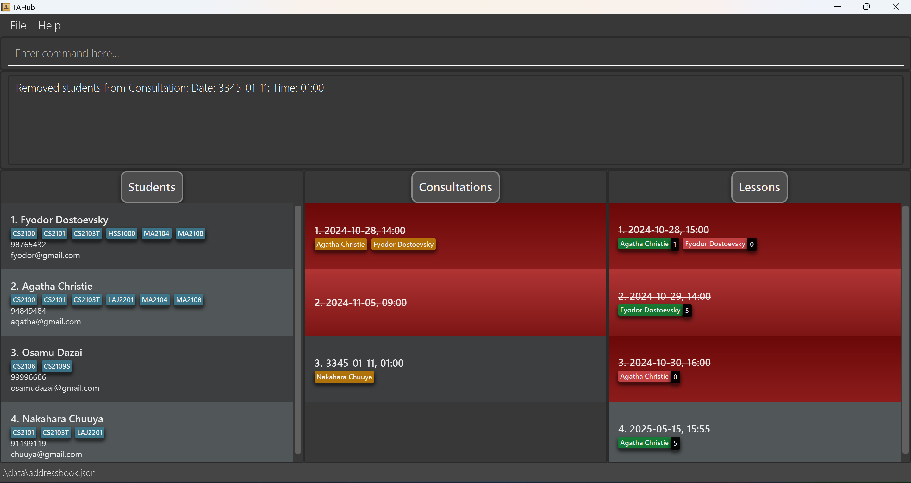
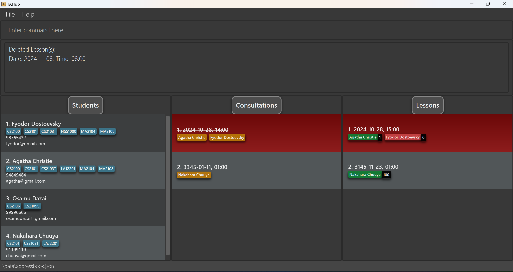

TAHub is a **desktop app for managing students, optimized for use via a Command Line Interface** (CLI) while still having the benefits of a Graphical User Interface (GUI).
If you can type fast, TAHub can get your student management tasks done faster than traditional GUI apps.

TAHub simplifies the role of Teaching Assistants by providing a centralized hub to organize student information, and efficiently manage course-related tasks. This platform empowers TAs to focus more on enhancing student learning and less on administrative chaos.

* Table of Contents
{:toc}

--------------------------------------------------------------------------------------------------------------------

## Quick start

1. Ensure you have Java `17` or above installed in your Computer. 
To check your Computer's Java Version, see this [guide](https://www.wikihow.com/Check-Your-Java-Version-in-the-Windows-Command-Line). 
If you don't have Java, see this installation [guide](https://docs.oracle.com/en/java/javase/23/install/overview-jdk-installation.html). 

2. Download the latest `.jar` file from [here](https://github.com/AY2425S1-CS2103T-F13-1/tp/releases). 
  Scroll down until you see this part. Click on `tahub.jar` to download it.
  

3. Copy the file to the folder you want to use as the _home folder_ for your TAHub. 
  The _home folder_ is where other files such as the data file will be created.

4. Open a command terminal and `cd` into the folder you put the jar file in. 
   If you don't know what that means, fret not - see [here](https://www.wikihow.com/Change-Directories-in-Command-Prompt).

5. Type `java -jar tahub.jar` and hit enter. 
   A GUI similar to the below should appear in a few seconds. 
   Note how the app contains some sample data. 

   

6. Type the command in the command box and press Enter to execute it. e.g. typing **`help`** and pressing Enter will open the help window. 
   Some example commands you can try:

   * `add n/John Doe p/98765432 e/johnd@example.com c/CS2103T;CS2101` : Adds a student named `John Doe` to TAHub.

   * `delete 2` : Deletes the 2nd student shown in the current student list.

   * `clear` : Deletes all students, consultations & lessons.

   * `exit` : Exits the app.

7. Refer to the [Features](#features) below for details of each command.

--------------------------------------------------------------------------------------------------------------------

# Features

**How do I read the command format?** 

* Main command keywords are **case-sensitive** unless specified otherwise. 
  e.g. `Find` and `Add` do not work for `find` and `add` respectively.

* Words in `UPPER_CASE` are the parameters to be supplied by the user. 
  e.g. in `add n/NAME`, `NAME` is a parameter which can be used as `add n/John Doe`.

* Items in square brackets are optional. 
  e.g `n/NAME [c/COURSE]` can be used as `n/John Doe c/CS2103T` or as `n/John Doe`.

* Items with `…` after them can be used multiple times including zero times. 
  e.g. `[c/COURSE]…` can be used as ` ` (i.e. 0 times), `c/CS2103T;CS2101` 
(note that use of `;` is unique to only some fields), `c/CS2103T c/CS2101` etc.

* Parameters can be in any order. 
  e.g. if the command specifies `n/NAME p/PHONE_NUMBER`, `p/PHONE_NUMBER n/NAME` is also acceptable.

* Extraneous parameters for commands that do not take in parameters (such as `help`, `liststudents`, `exit` and `clear`) will be ignored. 
  e.g. if the command specifies `help 123`, it will be interpreted as `help`.

* If you are using a PDF version of this document, be careful when copying and pasting commands that span multiple lines as space characters surrounding line-breaks may be omitted when copied over to the application.

**Additional Notes**

Here are more detailed notes regarding certain parameters that apply to all commands unless specified otherwise.

* When specifying an index, leading zeroes are ignored, i.e. `001` is equivalent to `1`.

* When specifying an index, it should be between 1 and 2147483647, inclusive. The current error message
may not reflect this requirement, but changes for clarification are planned in the future.

* When targeting a student by their index, TAHub uses the indexes **as currently displayed** on the
student list. For example, if you run a `find` command that only lists one student out of originally five, trying
to select a student at index 2 will fail.

## General Commands

### Viewing help : `help`

Shows a message explaining how to access the help page.

Format: `help`

### Clearing all entries : `clear`

Clears all entries from TAHub.

Format: `clear`

### Exiting the program : `exit`

Exits the program.

Format: `exit`

# Students

The student list is shown on the left side of TAHub. 
Currently, you can:
- Add, Edit and delete student
- Find Students by Name or Course
- Export & Import Student Data

In a student, courses are represented by course tags.
Name, Phone Number & Email are represented as texts. 

This is an example of a student. In this example,
the student's name is `Fyodor Dostoevsky`,
studying courses CS2100, CS2101, CS2103T, HSS1000, MA2104 & MA2108,
has Phone Number 98765432 and Email fyodor@gmail.com.

## Student Commands

### Adding a student: `add`

Adds a student to TAHub.

Format: `add n/NAME p/PHONE_NUMBER e/EMAIL [c/COURSE]…`

:bulb: **Tip:**
A student can have any number of courses (including 0)

* `NAME` must only contain alphabetical characters, commas, and spaces.
* `NAME` must be unique, i.e. no two students can have the same name.
  * However, names are **case-sensitive**, i.e. `John Doe` is considered different from `john doe`.
* `PHONE_NUMBER` should only contain numbers, and should be at least 3 numbers long.
* `EMAIL` should conform to the format `local-part@domain` and:
  * `local-part` should only contain alphanumeric characters and these special characters: `+` `_` `.` `-`.
  * `local-part` must start and end with alphanumeric characters.
  * `domain` must end with a domain label at least 2 characters long.
  * `domain` must have each domain label start and end with alphanumeric characters.
  * `domain` must have each domain label consist only of alphanumeric characters separated only if hyphens (if any).
* `COURSE`s should begin with 2-4 letters, followed by 4 digits, followed by 0-2 letters.
Example: `MA1100`, `GEA1000N`, `GESS1000T` etc.

Examples:
* `add n/John Doe p/98765432 e/johnd@example.com`
* `add n/Betsy Crowe e/betsycrowe@example.com p/1234567 c/CS2103T;CS2101`
* `add n/Nakahara Chuuya p/91199119 e/chuuya@gmail.com c/LAJ2201;CS2103T;CS2101`

### Listing all students : `liststudents`

Shows a list of all students in TAHub.

Format: `liststudents`

### Editing a student : `edit`

Edits an existing student in TAHub.

Format: `edit INDEX [n/NAME] [p/PHONE] [e/EMAIL] [c/COURSE]…​`

* Edits the student at the specified `INDEX`. The index refers to the index number shown in the displayed student list. The index **must be a positive integer** 1, 2, 3, …​
* At least one of the optional fields must be provided.
* Existing values will be updated to the input values.
* When editing courses, the existing courses of the student will be removed i.e adding of courses is not cumulative.
* You can remove all the student’s courses by typing `c/` without
    specifying any courses after it.

Examples:
*  `edit 1 p/91234567 e/johndoe@example.com` Edits the phone number and email of the 1st student to be `91234567` and `johndoe@example.com` respectively.
*  `edit 2 n/Betsy Crower c/` Edits the name of the 2nd student to be `Betsy Crower` and clears all existing courses.
*  `edit 3 c/CS2103T;CS2101` Edits the courses of the 3rd student to be CS2103T & CS2101.
*  `edit 4 p/91918181`

### Locating students by name and/or course: `find`

Finds students whose names contain any of the given keywords.

Format: `find KEYWORD [MORE_KEYWORDS]`

* The search is case-insensitive. e.g `hans` will match `Hans`, `cs2103t` will match `CS2103T`
* Can search for names and courses. Use the `n/` prefix to search for names and the `c/` prefix to search for courses.
* Partial searches will be matched e.g. `Jam` will match `James` and `James Ho`
* Each sequence of words not separated by `;` or a prefix will be used as a search. This means that `jam ho` will not match `James Ho`
* If a semicolon was used to separate searches, students matching at least one keyword will be returned (i.e. `OR` search). 
* If a prefix was used to separate searches, students matching all keywords will be returned (i.e. `AND` search).
* If no names are provided to the find command (i.e. `find n/`), all students will be listed.
* **Warning**: `find c/` will not be treated as an error and will return 0 students. Refer to the [Proposed Features](#proposed features) below for details of the proposed changes to this command.

Examples:
* `find n/John` returns `john` and `John Doe`
* `find n/alex;david` returns `Alex Yeoh`, `David Li` 
* `find n/alex n/david` returns `Alex David`, if a student with that name exists
* `find c/CS2103T c/CS2100` will return students who are taking both `CS2103T` and `CS2100`
* `find n/alex c/cs2103t;cs2100` will return all students whose names contain `alex` and are taking at least one of `CS2103T` or `CS2101`.
* `find n/` will return all students.
* `find c/` will return no students.
* `find n/Osamu;Chuuya`

* `find c/CS2103T`

### Deleting a student : `delete`

Deletes the specified student from TAHub.

Format: `delete INDEX[;INDEX]…`

* Deletes the student at the specified `INDEX`.
* The index refers to the index number shown in the displayed student list.
* The index **must be a positive integer** 1, 2, 3, …​

* Can delete multiple students at once by separating indices with semicolons (;).

Examples:
* `liststudents` followed by `delete 2` deletes the 2nd student in TAHub.
* `liststudents` followed by `delete 2;3` deletes the 2nd and 3rd student in TAHub.
* `find n/Betsy` followed by `delete 1` deletes the 1st student in the results of the `find` command.
* `liststudents` followed by `delete 4` deletes the 4th student in TAHub.

### Exporting student data : `export`

Exports the current list of students to a CSV file.

Format: `export [-f] FILENAME`

* Exports student data to 'FILENAME.csv' in both the data directory and user's home directory
* The `-f` flag is optional and allows overwriting of existing files
* The filename must contain only alphanumeric characters (A-Z, a-z, 0-9)
* Files are saved in both the data directory and home directory
* If the home directory copy fails, only the data directory file is created

Examples:
* `export students` creates students.csv containing current student list
* `export -f backup` overwrites backup.csv if it exists

### Importing student data : `import`

Imports students from a CSV file into TAHub.

Format: `import FILENAME`

* The CSV file must have the header: Name,Phone,Email,Courses
* Files can be read from:
  * Data directory (./data/): `import students.csv`
  * Current directory: `import ./students.csv`
  * Home directory (using ~ prefix): `import ~/documents/students.csv`
  * Absolute paths: `import /path/to/students.csv`
* Students with validation errors will be logged in error.csv
* Duplicate students are skipped and logged
* Courses should be semicolon-separated in the CSV

Examples:
* `import students.csv` imports student data from students.csv
* `import ~/documents/students.csv` imports from the home directory

# Consultations

The consultation list is shown in the middle of TAHub. 
Currently, you can:
- Add and delete consultations
- Add and remove students from consultations
- Export and Import Consultation Data

In a consultation, students are represented by name tags. 

This is an example of a consultation. In this example, `Nakahara Chuuya` & `Osamu Dazai`
are in the consultation on 2024-12-05, 09:00.

Additionally, consultations that have passed (the time is before your computer's time)
will be displayed in red, as follows:

## Consultation Commands

### Adding a consultation : `addconsult`

Adds a new consultation to TAHub.

**Format**: `addconsult d/DATE t/TIME`

* The date and time should not conflict with any existing consultation.
* Date format: `YYYY-MM-DD`
* Time format: `HH:mm`

**Examples**:
* `addconsult d/2024-11-05 t/09:00` adds a Consultation Timing that has passed.

* `addconsult d/3345-01-11 t/01:00` adds a Consultation Timing.

### Refreshing the consultation list : `listconsults`

Refreshes and displays the consultation list.
Useful to fix minor UI glitches, e.g. the display not updating after adding a student.

**Format**: `listconsults`

**Example**:
* `listconsults` 

### Adding students to a consultation : `addtoconsult`

Adds students to an existing consultation, specified by its index.

**Format**: `addtoconsult INDEX [n/NAME]… [i/INDEX]…`

* `INDEX` specifies the consultation to add students to.
* Student names (`n/NAME`) and/or student indices (`i/INDEX`) can be used to specify students. At least one name or
index must be provided.
* Students already in the consultation will not be added again, and an error message will be shown.
* Student names are **case-sensitive**.

**Examples**:
* `addtoconsult 1 n/John Doe n/Harry Ng`
* `addtoconsult 2 i/3 i/5` adds students at indices 3 and 5 in the student list to the 2nd consultation.
* `addtoconsult 3 n/Nakahara Chuuya i/3` adds students Nakahara Chuuya & Student at Index 3 to the 3rd consultation.

### Removing students from a consultation : `removefromconsult`

Removes specified students from a consultation, identified by its index.

**Format**: `removefromconsult INDEX n/NAME [n/NAME]…`

* `INDEX` is the index of the consultation from which the students will be removed.
* Specify one or more students to remove by their names.
* Student names are **case-sensitive**.

**Examples**:
* `removefromconsult 1 n/John Doe n/Harry Ng` removes students named John Doe and Harry Ng from the 1st consultation.
* `removefromconsult 3 n/Osamu Dazai` removes student named Osamu Dazai from the 3rd consultation.

### Deleting consultations : `deleteconsult`

Deletes one or more consultations from TAHub by their indices.

**Format**: `deleteconsult INDEX[;INDEX]…`

* `INDEX` specifies the consultation to delete. You can delete multiple consultations by separating indices with semicolons (`;`).

**Examples**:
* `deleteconsult 2`

* `deleteconsult 1;3;5` (deletes the 1st, 3rd, and 5th consultations)

### Exporting consultation data : `exportconsult`

Exports the current list of consultations to a CSV file.

Format: `exportconsult [-f] FILENAME`

* Exports consultation data to 'FILENAME.csv' in both the data directory and user's home directory
* The `-f` flag is optional and allows overwriting of existing files
* The filename must contain only alphanumeric characters (A-Z, a-z, 0-9)
* Files are saved in both the data directory and home directory
* If the home directory copy fails, only the data directory file is created

Examples:
* `exportconsult sessions` creates sessions.csv containing current consultation list
* `exportconsult -f consultbackup` overwrites consultbackup.csv if it exists

### Importing consultation data : `importconsult`

Imports consultations from a CSV file into TAHub.

Format: `importconsult FILENAME`

* The CSV file must have the header: Date,Time,Students
* Files can be read from:
  * Data directory (./data/): `importconsult sessions.csv`
  * Current directory: `importconsult ./sessions.csv`
  * Home directory (using ~ prefix): `importconsult ~/documents/sessions.csv`
  * Absolute paths: `importconsult /path/to/sessions.csv`
* Date must be in YYYY-MM-DD format
* Time must be in HH:mm format (24-hour)
* Students must be semicolon-separated and exist in TAHub
* Consultations with validation errors will be logged in error.csv 
* Duplicate consultations are skipped and logged

Examples:
* `importconsult sessions.csv` imports consultation data from sessions.csv
* `importconsult ~/documents/consultations.csv` imports from the home directory

# Lessons

The lesson list is shown on the right side of TAHub. 
Currently, you can:
- Add and delete lessons
- Add and remove students from lessons
- Mark students' attendance and participation

In a lesson, students are represented by name tags. 
Its color represents their attendance (green for present, red for absent) 
The number next to a student's name represents their participation score.

This is an example of a lesson. In this example, `Jane Doe` is absent,
and has a participation of `0`. `John Doe` is present with a participation
of `2`.

Additionally, lessons that have passed (the time is before your computer's time)
will be displayed in red, as follows:

## Lesson Commands

### Adding a Lesson : `addlesson`

Adds a lesson to TAHub. Lessons will be sorted in chronological order
in the lesson list.

Format: `addlesson d/DATE t/TIME`

* `DATE` must be in the format `YYYY-MM-DD`, and must be a valid date.
* `TIME` must be in the format `HH:mm`, and must be a valid time.

**Examples**:
* `addlesson d/2024-11-08 t/08:00` adds a Lesson Timing that has passed.
  
* `addlesson d/3145-11-23 t/01:00` adds a Lesson Timing.
  

### Refreshing the lesson list : `listlessons`

Refreshes and displays the lesson list.
Useful to fix minor UI glitches, e.g. the display not updating after adding a student.

**Format**: `listlessons`

**Example**:
* `listlessons`

### Adding a student to a lesson : `addtolesson`

Adds student(s) to a lesson. Students added to a lesson will be shown as name tags under
that lesson inside the lesson list.

Format: `addtolesson LESSON_INDEX [n/NAME]… [i/STUDENT_INDEX]…`

* `LESSON_INDEX` is the index of the lesson as displayed in the lesson list.
* At least one of the optional arguments must be provided. There must be at least one name or index.
* `NAME` must be the full name of a student exactly as shown in the student list. Names are **case-sensitive**.
* `STUDENT_INDEX` is the index of a student as displayed in the student list.

Examples:
* `addtolesson 1 n/John Doe` adds `John Doe` to lesson number 1.
* `addtolesson 1 n/John Doe i/3 i/5` adds `John Doe` and students numbered 3 and 5 to lesson number 1.
* `addtolesson 3 n/Nakahara Chuuya i/3` adds students Nakahara Chuuya & Student at Index 3 to the 3rd lesson.
  

### Removing a student from a lesson : `removefromlesson`

Removes student(s) from a lesson.Removing a student will also remove all data associated
with them to that lesson, i.e. re-adding them defaults to no attendance and 0 participation.

Format: `removefromlesson LESSON_INDEX n/NAME [n/NAME]…`

* `LESSON_INDEX` is the index of the lesson as displayed in the lesson list.
* `NAME` must be the full name of a student in the lesson. Names are **case-sensitive**.

Examples:
* `removefromlesson 1 n/John Doe n/Jane Doe` removes `John Doe` and `Jane Doe` from lesson number 1.
* `removefromlesson 3 n/Osamu Dazai` removes student named Osamu Dazai from the 3rd lesson.

* 
### Marking a student's attendance : `marka`

Marks student(s)' attendance in a lesson. The student's attendance is represented by the
color of their name tag under a lesson - **green** for present and **red** for absent.

Format: `marka LESSON_INDEX n/NAME [n/NAME]… a/ATTENDANCE`

* `LESSON_INDEX` is the index of the lesson as displayed in the lesson list.
* `NAME` must be the full name of a student in the lesson. Names are **case-sensitive**.
* If multiple names are provided, all their attendances will be set to the given value.
* `ATTENDANCE` must be one of the following: `Y`,`y`or`1` for yes (student is present) and `N`,`n`or`0` for no (student is absent).
* There must be exactly 1 `ATTENDANCE` argument, e.g. `a/1 a/1` is not allowed.

Examples:
* `marka 1 n/John Doe a/y` marks `John Doe` as present for lesson number 1.
* `marka 2 n/John Doe n/Jane Doe a/N` marks `John Doe` and `Jane Doe` as absent for lesson number 2.
* `marka 3 n/Nakahara Chuuya a/Y` marks Student Nakahara Chuuya as present for lesson number 3.

### Marking a student's participation : `markp`

Marks student(s)' participation in a lesson. The student's participation is reflected in the number next to
their name tag under a lesson. 
**Additionally, setting a student's participation above 0
will also automatically set their attendance to true.**

Format: `markp LESSON_INDEX n/NAME [n/NAME]… pt/PARTICIPATION`

* `LESSON_INDEX` is the index of the lesson as displayed in the lesson list.
* `NAME` must be the full name of a student in the lesson. Names are **case-sensitive**.
* `LESSON_INDEX` is the index of the lesson as displayed in the lesson list.
* `NAME` must be the full name of a student in the lesson.
* If multiple names are provided, all their participation points will be set to the given value.
* `PARTICIPATION` must be an integer between 0 and 100 inclusive.
* There must be exactly 1 `PARTICIPATION` argument, e.g. `pt/3 pt/3` is not allowed.
* The participation score is set **exactly** to the given value. It does not add onto students' existing score.
* Due to a bug in the current version, a `+` before the participation value will be accepted, i.e. `+3` is treated as
`3`. This will be removed in a future release.

Examples:
* `markp 1 n/John Doe pt/3` marks `John Doe` as having 3 participation marks for lesson number 1.
* `markp 2 n/John Doe n/Jane Doe pt/5` marks `John Doe` and `Jane Doe` as having 5 participation marks for lesson number 2.
* `markp 3 n/Nakahara Chuuya pt/100` marks Student Nakahara Chuuya as having 100 participation marks for lesson number 3.
  

### Deleting a lesson : `deletelesson`

Deletes lesson(s) from TAHub.

Format: `deletelesson LESSON_INDEX[;LESSON_INDEX]…`

* `LESSON_INDEX` is the index of the lesson as displayed in the lesson list.

Examples:
* `deletelesson 2`

* `deletelesson 1;2;3` deletes the lessons numbered 1,2,3 in the lesson list

## Storage Operations

### Saving the data

TAHub data is saved in the hard disk automatically after any command that changes the data. There is no need to save manually.

### Editing the data file

TAHub data are saved automatically as a JSON file `[JAR file location]/data/addressbook.json`. Advanced users are welcome to update data directly by editing that data file.

:exclamation: **Caution:**
If your changes to the data file makes its format invalid, TAHub will discard all data and start with an empty data file at the next run. Hence, it is recommended to take a backup of the file before editing it. 
Furthermore, certain edits can cause the TAHub to behave in unexpected ways (e.g., if a value entered is outside of the acceptable range). Therefore, edit the data file only if you are confident that you can update it correctly.

### Archiving data files `[coming in v2.0]`

_Details coming soon ..._

--------------------------------------------------------------------------------------------------------------------

## FAQ

**Q**: The Command I entered does not work. What's Wrong? 
**A**: Check the Instructions for the Command Format in [Features](#features). Refer to the Examples provided as necessary. 

**Q**: Can I run TAHub on a Windows, Mac or Linux Computer? 
**A**: Yes. If your Computer has Java 17 or above installed, TAHub will work on Windows, Mac, and Linux Computers. 

**Q**: Will editing / deleting Students in the Student List change the details of existing students in the Consultation / Lesson List? 
**A**: Yes. Any changes made to Students will be reflected immediately in the Consultation & Lesson List. 

**Q**: Does TAHub require Internet Connection? 
**A**: No. After installation, TAHub does not require internet connection.

**Q**: Where is the data for TAHub stored? 
**A**: TAHub data are saved automatically as a JSON file in `[JAR file location]/data/addressbook.json`. You can make a backup of the file if you wish to. 

**Q**: How do I transfer my data to another Computer? 
**A**: Install the app in the other computer and overwrite the empty data file it creates with the file that contains the data of your previous TAHub home folder. 

**Q**: Do I need to manually save the data? 
**A**: TAHub saves automatically after any command that modifies the data. There is no need to save manually. 

**Q**: Can I edit the JSON Data File directly 
**A**: You are strongly <b>not</b> encouraged to edit the JSON data file directly.
You can use the commands as mentioned in the [Features](#features) to augment any data.
Should the changes made to the data file causes the format to be invalid, TAHub will discard all data and start with an empty data file.
It is highly recommended to make a copy of the date file before editing it.
However, Advanced users are welcome to update data directly by editing that data file. 

--------------------------------------------------------------------------------------------------------------------

## Known issues

1. **When using multiple screens**, if you move the application to a secondary screen, and later switch to using only the primary screen, the GUI will open off-screen. The remedy is to delete the `preferences.json` file created by the application before running the application again.
2. **If you minimize the Help Window** and then run the `help` command (or use the `Help` menu, or the keyboard shortcut `F1`) again, the original Help Window will remain minimized, and no new Help Window will appear. The remedy is to manually restore the minimized Help Window.

--------------------------------------------------------------------------------------------------------------------

## Command summary

Action | Format, Examples
--------|------------------
**Add** | `add n/NAME p/PHONE_NUMBER e/EMAIL [c/COURSE]…​`   e.g., `add n/James Ho p/98765432 e/jamesho@example.com c/CS2103T;CS2101`
**Clear** | `clear`
**Delete** | `delete INDEX [;INDEX]…​`  e.g., `delete 3`   e.g., `delete 2;3;4`
**Edit** | `edit INDEX [n/NAME] [p/PHONE_NUMBER] [e/EMAIL] [c/COURSE]…​`  e.g.,`edit 2 n/James Lee e/jameslee@example.com c/CS2100`  e.g.,`edit 2 c/CS2103T;CS2101;CS2106`   e.g.,`edit 2 c/CS2103T c/CS2101 c/CS2106`   e.g.,`edit 2 c/CS2103T;CS2101 c/CS2106`
**Find** | `find KEYWORD [MORE_KEYWORDS]`  e.g., `find n/James Jake` to find all students named `James Jake`   e.g.,`find n/James;Jake` to find all students whose names contain either `James` or `Jake`   e.g.,`find c/CS2103T c/CS2100` to find all students who are enrolled both `CS2103T` and `CS2100`   e.g.,`find n/James c/CS2103T` to find all students whose names contain `James` and are enrolled in `CS2103T` 
**List Students** | `liststudents`
**Help** | `help`
**Export Students** | `export [-f] FILENAME`  e.g., `export students` (relative)  e.g., `export ~/Documents/students` (home)
**Export Consultations** | `exportconsult [-f] FILENAME`  e.g., `exportconsult sessions` (relative)   e.g., `exportconsult ~/Documents/sessions` (home)
**Import Students** | `import FILENAME`  e.g., `import students.csv` (relative)   e.g., `import ~/Documents/students.csv` (home)
**Import Consultations** | `importconsult FILENAME`  e.g., `importconsult sessions.csv` (relative)  e.g., `importconsult ~/Documents/sessions.csv` (home)
**Add Consultation** | `addconsult d/DATE t/TIME`  e.g., `addconsult d/2024-10-20 t/14:00`
**Add to Consultation** | `addtoconsult INDEX [n/NAME]…​ [i/STUDENT_INDEX]…​`  e.g., `addtoconsult n/James Jake n/John Jill i/2 i/3`
**Delete Consultations** | `deleteconsult INDEX [;INDEX]…​`  e.g., `deleteconsult 3`   e.g., `deleteconsult 2;3;4`
**List Consultations** | `listconsults`
**Remove from Consultation** | `removefromconsult INDEX n/NAME…​`  e.g., `removefromconsult n/Jake John`   e.g., `removefromconsult n/Jake n/John`
**Add Lesson** | `addlesson d/DATE t/TIME`  e.g., `addlesson d/2024-10-20 t/14:00`
**Add to Lesson** | `addtolesson INDEX [n/NAME]…​ [i/STUDENT_INDEX]…​`  e.g., `addtolesson n/James Jake n/John Jill i/2 i/3`
**Delete Lesson** | `deletelesson INDEX [;INDEX]…​`  e.g., `deletelesson 3`   e.g., `deletelesson 2;3;4`
**List Lessons** | `listlessons`
**Mark Attendance for Lesson** | `marka INDEX n/NAME…​ a/ATTENDANCE`  e.g., `marka 3 n/Jack a/y`   e.g., `marka 3 n/Jack n/Jill a/1`   e.g., `marka 3 n/Jack a/n`   e.g., `marka 3 n/Jack a/0`
**Mark Participation for Lesson** | `markp INDEX n/NAME…​ pt/POINTS`  e.g., `markp 3 n/Jack pt/75`
**Remove from Lesson** | `removefromlesson INDEX n/NAME…​`  e.g., `removefromlesson n/Jake John`   e.g., `removefromlesson n/Jake n/John`
