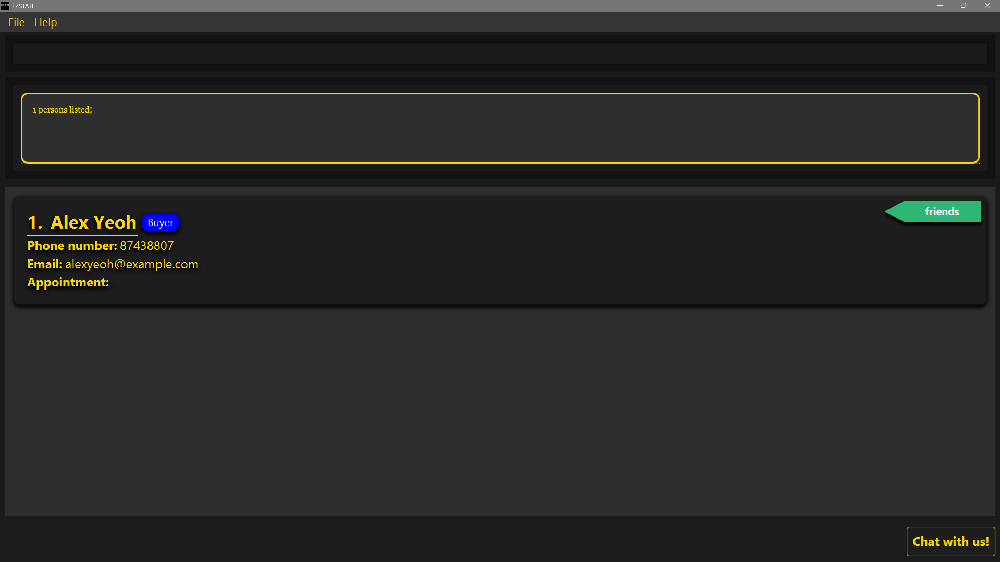

<link rel="stylesheet" type="text/css" href="assets/css/UserGuide.css">

EZSTATES is a Command Line Interface (CLI) desktop app designed specifically for **real estate agents** who manage buyer and seller contacts (i.e. clients), listings, and appointments. Below is a sneak peek into our app:
<br>
<br>
**Client management**

<br>
<br>
**Listing management**

<br>

**You could be part of the ideal target audience of EZSTATES if you meet the following criteria**:

* `Job` : Real Estate Agent focused on managing buyer and seller relationships
* `Typing ability` : Comfortable typing at speeds of ~80 WPM or higher
* `Workflow Preference` : Prefers streamlined typing commands over navigating Graphic User Interface (GUI) buttons
* `Tech Savviness` : Confident using command-based applications and prefers minimal mouse use
* `Work Style` : Handles multiple clients and properties simultaneously and values efficiency in contact and property management
* `Environment` : Works in a fast-paced setting where quick data entry and retrival are essential

But do not worry if you do not meet every criterion — EZSTATES is designed to be **intuitive and efficient for all users**. Give it a try, and head over to our [Quick Start](#quick-start-guide) guide to get started and see how EZSTATES can make your contact and property management tasks faster and easier!

--------------------------------------------------------------------------------------------------------------------
<!-- omit from toc -->
# Table of Contents
<br>
* Table of Contents
{:toc}

--------------------------------------------------------------------------------------------------------------------

## Quick Start Guide

Welcome to EZSTATES! This guide will walk you through installing the app and getting started with basic commands.

### Installation Steps

#### For Windows
1. **Open the Command Prompt**:
   - Press the **Windows key**, type `cmd`, and select **Command Prompt** from the search results.
   <br>
2. **Check your Java version**:
   - In the Command Prompt window, type the following command:
     ```bash
     java -version
     ```
   - Press **Enter**. If Java is installed, it will display the version. Ensure it is **Java 17 or above**.
   <br>
   If you need `Java`, you can download it from [Java Downloads](https://www.oracle.com/java/technologies/downloads/).
   <br>
   <br>
3. Download the latest `.jar` file from [EZSTATES Releases](https://github.com/AY2425S1-CS2103T-F11-4/tp/releases).

4. Copy the file to the folder you want to use as the _home folder_ for EZSTATES.

5. Open a command terminal (repeat Step 1) and navigate to the folder with the `.jar` file by typing:
    ```bash
    cd path/to/your/folder
    ```
    <div class="note" markdown="span">
    Alternatively, you can open the folder where the `.jar` file  is located,
    right click on any space inside the folder and click `Open in Terminal`.
    </div>
    <br>

   Then inside terminal, run the app with:
    ```bash
    java -jar EZSTATES.jar
    ```

   A GUI should appear in a few seconds as shown below. **Note that the initial launch of the app will contain some sample data**.<br><br>
   <br><br>
6. Head over to the [next section](#gui-overview) to understand the GUI. If you're already familiar with it, feel free to skip ahead to [Basic Commands](#basic-commands).

#### For MacOS
1. **Open the Terminal**:
   - Open **Spotlight** by pressing **Command + Space**, type `Terminal`, and press **Enter**.
   - Alternatively, you can go to **Finder > Applications > Utilities**, and double-click on **Terminal**.
   <br>
2. **Check your Java version**:
   - In the Terminal window, type the following command:
     ```bash
     java -version
     ```
   - Press **Enter**. The terminal will display the installed Java version. Ensure it is **Java 17 or above**.
   <br>
   If you need `Java`, you can download it from [Java Downloads](https://www.oracle.com/java/technologies/downloads/).
   <br>
   <br>
3. Download the latest `.jar` file from [EZSTATES Releases](https://github.com/AY2425S1-CS2103T-F11-4/tp/releases).

4. Copy the file to the folder you want to use as the _home folder_ for EZSTATES.

5. Open Terminal (repeat Step 1) and navigate to the folder with the `.jar` file by typing:
    ```bash
    cd path/to/your/folder
    ```
    <div class="note" markdown="span">
    Alternatively, you can open the folder where the `.jar` file  is located,
    right click on any space inside the folder and click `New Terminal at Folder`.
    </div>
    <br>

   Then inside terminal, run the app with:
   ```bash
   java -jar EZSTATES.jar
    ```
   A GUI should appear in a few seconds as shown below. **Note that the initial launch of the app will contain some sample data**.<br><br>
   <br><br>
6. Head over to the [next section](#gui-overview) to understand the GUI. If you're already familiar with it, feel free to skip ahead to [Basic Commands](#basic-commands).

### GUI Overview
The EZSTATES GUI is organized into **five** key components:

   

* `Menu Bar`: Located at the top left, this includes options such as `File` and `Help` for managing settings and accessing support.
* `Command Box`: The main area where users can enter commands to interact with the app.
* `Result Display`: Provides immediate feedback, displaying success or failure messages based on the user’s command. Situated below the `Command Box`.
* `List Card`: Displays key information about clients or listings, depending on the user's command. Situated below the `Result Display`
* `Chat Window`: Located at the bottom right, this serves as a helpful assistant, offering guidance and support through interactive communication.

With a clear understanding of the GUI, let's move on to how you can interact with EZSTATES using [basic commands](#basic-commands).

### Basic Commands
To use EZSTATES, type commands in the command box and press `Enter`. Here are a few to try:

   * `help` : Opens the help window showing all commands.

   * `showclients` : Shows all contacts in the system.

   * `showlistings` : Shows all listings in the system.

   * `buyer n/John Doe p/98765432 e/johnd@example.com` : Adds a buyer named `John Doe` with a phone number `98765432` and email `johnd@example.com`.

   * `deleteclient 1` : Deletes the contact at index 1 (e.g. "bob" according to the picture above).

   * `exit` : Exits the app.

Once you've tried out these basic commands, it's helpful to understand [how they are organized](#command-structure). This will make it easier to navigate and use **all** commands in EZSTATES effectively, and to grasp how each part functions.

### Command Structure

Understanding the command structure in EZSTATES is essential for efficient navigation and use of the app’s features.
Each command in EZSTATES is designed to follow a **clear, consistent format**, allowing you to manage clients, listings, and appointments with precision and speed.
By mastering this structure, you will find it easier to remember commands and customize inputs, making your experience smoother and enabling you to accomplish tasks more effectively.

This section breaks down the **structure, reference, and prefixes** used across all commands, so you can quickly become proficient with EZSTATES.

Commands in EZSTATES follow the same structure:

<p style="text-align: center;">
`commandWord (REFERENCE) (PREFIXES)` 
</p>
<br>

| commandWord                  | REFERENCE                                                                                                            | PREFIXES                                                                                                 |
|------------------------------|----------------------------------------------------------------------------------------------------------------------|----------------------------------------------------------------------------------------------------------|
| Specifies the command to run | Comes before all prefixes and is used to make reference a particular client/listing <br/> Optional for some commands | Used to specify various attributes/properties for a given `commandWord` <br/> Optional for some commands |

#### Reference Types

| REFERENCE           | Meaning                                  | Constraints                                                     | Remarks                                                                                                        |
|---------------------|------------------------------------------|-----------------------------------------------------------------|----------------------------------------------------------------------------------------------------------------|
| INDEX<sup>1,2</sup> | INDEX of a client or a listing in a list | INDEX are positive integers that are `one-based` (i.e. `>= 1`). | Commonly used in edit and delete clients/listings to make reference to these objects in their respective lists |

**Notes:**
1. Since `INDEX` is **one-based** (i.e. starts from 1), the first item in the list cannot start with `0`.
2. EZSTATES handles errors related to the `INDEX` parameter in two ways: 
   1. If `INDEX` is an invalid number (e.g., non-positive integers, numbers larger than Integer.MAX_VALUE, or non-integer values like 4.5), it will be flagged as an invalid command format. 
   2. If `INDEX` is a valid integer but exceeds the size of the currently displayed list (client/listing), it will be flagged as an invalid index. Supported values are [1, displayed list size].

#### Prefix Notation

Prefixes follow the same structure:

<p style="text-align: center;">
`prefix/Value`
</p>
<br>

and can be either optional or mandatory, and variadic or not variadic.
The table below showcases the four different possible notations of prefixes:

|                      | Mandatory          | Optional<sup>1</sup> |
|----------------------|--------------------|----------------------|
| Not variadic         | `prefix/Value`     | `[prefix/Value]`     |
| Variadic<sup>2</sup> | `prefix/Value...`  | `[prefix/Value]...`  |

**Notes:**
1. Optional prefixes can be omitted and the command will still be executed successfully _(assuming all other parts of the command are correctly inputted)_. 
2. Variadic prefixes allow you to enter multiple values for a single command by separating them with spaces. For example:
   <br>
   `t/friend t/colleague t/mentor`
   <br>
   This lets you add multiple tags at once, making it easier to input bulk data.


#### Prefix Types

The prefixes used in **EZSTATES** are universal across all commands.

| Prefix | Meaning | Constraints                                                                                                                                                                                                                                                                                                                                                                                                       | Valid                                 | Invalid                                   |
|--------|---------|-------------------------------------------------------------------------------------------------------------------------------------------------------------------------------------------------------------------------------------------------------------------------------------------------------------------------------------------------------------------------------------------------------------------|---------------------------------------|-------------------------------------------|
| n/     | name    | Names should only contain `alphanumeric` characters and `spaces`, and it should not be `blank`.                                                                                                                                                                                                                                                                                                                   | `n/wen xuan`, `n/muhammad`, `n/sean2` | `n/!@#`, `n/`                             |
| p/     | phone   | Phone numbers should only contain `numbers`, and it should be at least `3` digits long.                                                                                                                                                                                                                                                                                                                           | `p/123`, `p/91230000`                 | `p/12`, `p/abc123`, `p/`                  |
| e/     | email   | Emails must follow the format `local-part@domain`. The local-part can contain alphanumeric characters and special characters (`+_.-`), but cannot start or end with special characters. The special characters cannot be consecutive. The domain must have at least one label, with each label starting and ending with alphanumeric characters and being at least 2 characters long. Labels can contain hyphens. | `e/bob@gmail.com`, `e/123@123`        | `e/bobby`, `e/123@.com`, `e/@example.com` |
| t/     | tag     | Tag names should be `alphanumeric`.                                                                                                                                                                                                                                                                                                                                                                               | `t/friend1`, `t/colleague`, `t/`      | `t/friend@1`, `t/123@abc`                 |
| d/     | date    | Dates should be in the format `dd-MM-yy` or `ddMMyy` (e.g., 25-12-24 or 251224).                                                                                                                                                                                                                                                                                                                                  | `d/08-12-24`, `d/081224`              | `d/32-13-24`, `d/123456`, `d/`            |
| fr/    | from    | Times should be in the format `HH:mm` or `HHmm` (e.g., 0900 or 09:00). `from` time must precede `to` time.                                                                                                                                                                                                                                                                                                        | `fr/0800`, `fr/08:00`                 | `fr/2500`, `fr/100`, `fr/8am`             |
| to/    | to      | Times should be in the format `HH:mm` or `HHmm` (e.g., 0900 or 09:00). `to` time must supercede `from` time.                                                                                                                                                                                                                                                                                                      | `to/1000`, `to/10:00`                 | `to/2500`, `to/110`, `to/`                |
| pr/    | price   | Price should only contain `positive` integers and cannot start with `zeroes`, and it should be at least `6` digits long.                                                                                                                                                                                                                                                                                          | `pr/100000`, `pr/45000000`            | `pr/000123`, `pr/-1000`, `pr/12`          |
| ar/    | area    | Area should only contain `positive` integers and cannot start with `zeroes`, and it should be at least `2` digits long.                                                                                                                                                                                                                                                                                           | `ar/10`, `ar/100`                     | `ar/01`, `ar/-5`, `ar/`                   |
| add/   | address | Addresses can take any values, and it should not be `blank`.                                                                                                                                                                                                                                                                                                                                                      | `add/123 PASIR RIS (S)123456`         | `add/`                                    |
| reg/   | region  | Only the following `9` regions are allowed: `NORTH`, `SOUTH`, `EAST`, `WEST`, `NORTHEAST`, `SOUTHEAST`, `NORTHWEST`, `SOUTHWEST`, `CENTRAL`.                                                                                                                                                                                                                                                                      | `reg/east` `reg/northeast`            | `reg/xyz`, `reg/invalidregion`            |
| sel/   | seller  | Can only take non-zero unsigned integer.                                                                                                                                                                                                                                                                                                                                                                          | `sel/1` `sel/2`                       | `sel/0`, `sel/-1`, `sel/abc`              |
| buy/   | buyer   | Can only take non-zero unsigned integer.                                                                                                                                                                                                                                                                                                                                                                          | `buy/1` `buy/2`                       | `buy/0`, `buy/-2`, `buy/abc`              |

#### Remarks

Below are additional notes regarding certain prefixes. Please keep these in mind while using commands to help maintain data integrity and avoid unexpected issues.

##### n/
1. Names are `space-sensitive`. This means that `n/alexyeoh` (0 space), `n/alex yeoh` (1 space) and `n/alex  yeoh` (2 spaces) _(not exhaustive)_ create three different profiles.
2. Names are `case-insensitive`. This means that `n/alex yeoh` and `n/AlEx YeOh` refer to the same name.
3. Duplicate names are not allowed within the clients or listings lists (e.g., two buyers or sellers both named `Bobby` cannot exist).
4. Duplicate names between clients and listings are allowed (e.g. a client named `Bobby` and a listing named `Bobby` can both exist).
5. Names have `no character limit`, but lengthy names will be automatically truncated with an ellipsis.
6. Names can consist only of numbers, but use caution, as this may cause confusion when displayed alongside the client's index.
7. Allowable Edge Cases: Names can include single characters or initials (e.g. `n/A` is valid). While this is allowed, single-letter names might be confusing in lists with similar entries (e.g. `n/A`, `n/B`, etc.).
8. Names with excessive leading or trailing spaces are treated as names withouit (e.g. `n/Alice Johnson               ` = `n/Alice Johnson`).
9. There is a known issue with the n/ prefix. Please refer to the [Known Issues](#known-issues) section.

##### p/
1. It is permissible for different clients to have the same phone number.
2. Phones have `no character limit`, but lengthy phones will be automatically truncated with an ellipsis.
3. Numbers with leading zeros (e.g. p/0012345) are allowed, though these may be visually confusing or prone to misinterpretation.
4. As an extension to pt. 3, a number with just `zeroes` is allowed, although such a number may not appear realistic. 

##### e/
1. Emails may technically be invalid but still pass the regex test (e.g. 123@123). It’s up to the user to decide how they input their clients' emails.
2. Emails have `no character limit`, but lengthy emails will be automatically truncated with an ellipsis.
3. Emails can have unusual domain labels as long as they’re valid (e.g. `e/user@x-y.com` or `e/person@123.co`). While valid, such domains may not appear realistic.

##### t/
1. Tags are `case-sensitive`. This means that `t/FRIEND` and `t/friend` are treated as unique tags.
2. Very long tags (e.g., t/AAAAAAAAAAAAAAAAAAAAAAAAAAAAAAAAAAAAAAAAAAA) are permissible but might be visually truncated.
3. When editing tags, the existing tags of the person will be removed (i.e. adding of tags is not cumulative).

##### d/
1. There is no restriction on the date range, so unrealistic dates in the far future or past may be entered (e.g. `d/01-01-99`).

##### fr/
NIL (all covered in Constraints)

##### to/
NIL (all covered in Constraints)

##### pr/
1. While only positive values are allowed, there’s no limit on maximum value, allowing extremely high prices (e.g., pr/9999999999) which may affect the display of data.
2. As per constraints, prices like `1000000.50` are not allowed.

##### ar/
1. The unit of measurement is `m²`.
2. There's no maximum limit, so values like ar/99999999999999999999999999999 will pass, which may affect the display of data.
3. As per constraints, areas like `1000.50` are not allowed.

##### add/
1. Unrealistically long addresses passes but will affect the display of data.
2. Since addresses accept any value, symbols and non-standard characters (e.g. `add/123 *^&`) will pass.
3. There is a known issue with the add/ prefix. Please refer to the [Known Issues](#known-issues) section.

##### reg/
1. Regions are case-insensitive (i.e. `reg/east` and `reg/East` are the same).

##### sel/ & buy/
1. Leading zeroes are allowed but will be trimmed (i.e. `sel/01` and `sel/1` refer to the same seller).

<br>
Congratulations - you've successfully completed the Quick Start guide!

The [next section](#features) offers an **in-depth overview** of all the commands available in EZSTATES.

<div class="note" markdown="span">**EXTRA**<br><br>
Curious about how EZSTATES stores data? Check out the [storage section](#saving-the-data) for more information.
<br>
<br>
If you're an advanced user looking to edit the JSON file directly, head over to [this section](#editing-the-data-file) for more information.
</div>
--------------------------------------------------------------------------------------------------------------------

## Features

<div class="alert" markdown="span">
Before proceeding, please review or familiarize yourself with EZSTATES's [Command Structure](#command-structure) to ensure effective use of all features.
</div>
<br>

EZSTATES features (i.e. commands) are divided into **four** main categories:

1. [Client Management Commands](#1-client-management-commands)
    - [Add Buyer](#add-buyer) (`buyer`) 
    - [Add Seller](#add-seller) (`seller`)
    - [Show Clients](#show-clients) (`showclients`)
    - [Find Clients](#find) (`find`)
    - [Edit Client](#edit-client) (`editclient`)
    - [Delete Client](#delete-client) (`deleteclient`)
2. [Appointment Management Commands](#2-appointment-management) 
    - [Schedule Appointment](#schedule-appointment) (`apt`)
    - [Delete Appointment](#delete-appointment) (`deleteapt`)
    - [Filter Appointments](#today) (`today`)
3. [Listing Management Commands](#3-listing-management) 
    - [Add Listing](#add-listing) (`listing`) 
    - [Show Listings](#show-listings) (`showlistings`)
    - [Find Listings](#find-listings) (`findlisting`)
    - [Edit Listing](#edit-listing) (`editlisting`)
    - [Add Buyers to Listing](#add-buyers-to-listing) (`addlistingbuyers`)
    - [Remove Buyers from Listing](#remove-buyers-from-listing) (`removelistingbuyers`)
    - [Delete Listing](#delete-listing) (`deletelisting`)
    - [Clear Listings](#clear-listing) (`clearlistings`)
4. [Utility Commands](#4-utility-commands)
    - [Clear](#clear) (`clear`)
    - [Exit](#exit) (`exit`)
    - [Help](#help) (`help`)
    - [More Info](#more-info) (`moreinfo`)
    - [Chat Window](#chat-window) (`chatbot`)

The following sections cover the **command format**, **description**, **valid** and **invalid inputs**, and **special comments**.

---

### 1. Client Management Commands

Commands for creating, updating, and deleting buyers and sellers.


#### Add Buyer
- **Command:** `buyer n/NAME p/PHONE e/EMAIL [t/TAG]...`
- **Description:** Creates a new buyer profile with specified details.
- **Successful Execution:**
> ---
>
> **Use Case #1**: Adding a buyer named `Bobby` with phone number `91124444` and email `bobby123@gmail.com`
>
> **Input**: `buyer n/Bobby p/91124444 e/bobby123@gmail.com`
>
> **Output**: <br> 
New buyer added: Bobby. <br> 
Phone: 91124444; Email: bobby123@gmail.com 
>
> ---
>
> **Use Case #2**: Adding a buyer named `Bobby` with phone number `91124444`, email `bobby123@gmail.com`, tags `friend`, `owner`
>
> **Input**: `buyer n/Bobby p/91124444 e/bobby123@gmail.com t/friend t/owner`
>
> **Output**: <br>
New buyer added: Bobby. <br>
Phone: 91124444; Email: bobby123@gmail.com
>
> ---

- **Failed Execution:**
> ---
>
> **User Error #1**: Missing `NAME` field
>
> **Input**: `buyer p/91124444 e/bobby123@gmail.com`
>
> **Output**: <br>
Invalid command format! <br>
buyer: Adds a buyer to the address book. <br>
Parameters: n/NAME p/PHONE e/EMAIL [t/TAG]...<br>
Example: buyer n/John Doe p/98765432 e/johnd@example.com t/friends t/owesMoney
>
> ---
>
> **User Error #2**: Missing `PHONE` field
>
> **Input**: `buyer n/Bobby e/bobby123@gmail.com`
>
> **Output**: <br>
Invalid command format! <br>
buyer: Adds a buyer to the address book. <br>
Parameters: n/NAME p/PHONE e/EMAIL [t/TAG]...<br>
Example: buyer n/John Doe p/98765432 e/johnd@example.com t/friends t/owesMoney
>
> ---
>
> **User Error #3**: Missing `EMAIL` field
>
> **Input**: `buyer n/Bobby p/91124444`
>
> **Output**: <br>
Invalid command format! <br>
buyer: Adds a buyer to the address book. <br>
Parameters: n/NAME p/PHONE e/EMAIL [t/TAG]...<br>
Example: buyer n/John Doe p/98765432 e/johnd@example.com t/friends t/owesMoney
>
> ---
> 
> **User Error #4**: Buyer already exists
>
> **Input**: `buyer n/Bobby p/83485111 e/bobby1234@gmail.com` <br>_(Assuming name `Bobby` already exists)_
>
> **Output**: This buyer already exists in the address book
>
> ---

- **Special Comments**
1. Refer to the remarks and constraints for the following prefixes: [n/](#n) [p/](#p) [e/](#e) [t/](#t)

#### Add Seller
- **Command:** `seller n/NAME p/PHONE e/EMAIL [t/TAG]...`
- **Description:** Creates a new seller profile with specified details.
- **Successful Execution:**
> ---
> **Use Case #1**: Adding a seller named `Bobby` with phone number `91124444` and email `john123@gmail.com`
>
> **Input**: `seller n/Bobby p/91124444 e/bobby123@gmail.com`
>
> **Output**: <br>
New seller added: Bobby. <br>
Phone number: 91124444 and Email: bobby123@gmail.com
>
> ---
>
> **Use Case #2**: Adding a seller named `Bobby` with phone number `91124444`, email `john123@gmail.com`, tags `friend`, `owner`
>
> **Input**: `seller n/Bobby p/91124444 e/bobby123@gmail.com t/friend t/owner`
>
> **Output**: <br>
New seller added: Bobby. <br>
Phone number: 91124444 and Email: bobby123@gmail.com
>
> ---

- **Failed Execution:**
> ---
> 
> **User Error #1**: Missing `NAME` field
>
> **Input**: `seller p/91124444 e/bobby123@gmail.com`
>
> **Output**: <br>
Invalid command format! <br>
seller: Adds a seller to the address book. <br>
Parameters: n/NAME p/PHONE e/EMAIL [t/TAG]...<br>
Example: seller n/John Doe p/98765432 e/johnd@example.com t/friends t/owesMoney
>
> ---
>
> **User Error #2**: Missing `PHONE` field
>
> **Input**: `seller n/Bobby e/bobby123@gmail.com`
>
> **Output**: <br>
Invalid command format! <br>
seller: Adds a seller to the address book. <br>
Parameters: n/NAME p/PHONE e/EMAIL [t/TAG]...<br>
Example: seller n/John Doe p/98765432 e/johnd@example.com t/friends t/owesMoney
>
> ---
> **User Error #3**: Missing `EMAIL` field
>
> **Input**: `seller n/Bobby p/91124444`
>
> **Output**: <br>
Invalid command format! <br>
seller: Adds a seller to the address book. <br>
Parameters: n/NAME p/PHONE e/EMAIL [t/TAG]...<br>
Example: seller n/John Doe p/98765432 e/johnd@example.com t/friends t/owesMoney
>
> ---
> 
> **User Error #4**: Seller already exists
> 
> **Input**: `seller n/Bobby p/83485111 e/bobby1234@gmail.com` <br>_(Assuming name `Bobby` already exists)_ 
> 
> **Output**: This seller already exists in the address book
> 
>  ---

- **Special Comments**
1. Refer to the remarks and constraints for the following prefixes: [n/](#n), [p/](#p), [e/](#e), [t/](#t)

#### Show Clients
- **Command:** `showclients`
- **Description:** Displays all clients in the system.
- **Successful Execution:**
> ---
> **Use Case #1**: Displaying all clients in the system
> 
> **Input**: `showclients`
> 
> **Output**: Here are your clients!
> 
> 
> ---
> 
> **Use Case #2**: Displaying all clients in the system (where there are none)
> 
> **Input**: `showclients`
> 
> **Output**: You currently have no clients in the list.
> 
> 
> ---

- **Failed Execution:** NIL
- **Special Comments**
1. You are able to execute `showclients` on an empty list of clients, as per Successful Execution Use Case #2

#### Find
- **Command:** `find KEYWORD [KEYWORD]...`
- **Description:** Finds the specified client(s) based on the provided keywords.
- **Successful Execution:**
> ---
> **Use Case #1**: Finding `Alex`
>
> **Input**: `find Alex`
>
> **Output**: 1 persons listed!
>
> 
>
> ---
>
> **Use Case #2**: Finding `Alex` OR `Bernice`
>
> **Input**: `find Alex Bernice`
>
> **Output**: 2 persons listed!
>
> 
>
> ---

- **Failed Execution:**
> ---
>
> **User Error**: Client not found
> 
> **Input**: `find noMatchingClients`
> 
> **Output**: 0 persons listed!
> 
> 
> 
> ---

- **Special Comments**
1. For cases where names consist of two or more parts (e.g. Wen Xuan), inputting `find Wen Xuan` results in finding clients containing `Wen` OR `Xuan` in their names, as per Successful Execution Use Case #2. 


#### Edit Client
- **Command:** `editclient INDEX [n/NAME] [p/PHONE] [e/EMAIL] [t/TAG]...`
- **Description:** Edits the details of the specified client.
- **Successful Execution:**
> ---
> **Use Case #1**: Changing name of `Bob` to `Bobby` (Assuming displayed index is 1)
>
> **Input**: `editclient 1 n/Bobby`
>
> **Output**: <br>
Successfully edited Bobby. <br> 
Phone number: 91124444 and Email: bobby123@gmail.com!
>
> ---
>
> **Use Case #2**: Changing phone of `Bobby` to `97774444` 
>
> **Input**: `editclient 1 p/97774444`
>
> **Output**: <br>
Successfully edited Bobby. <br>
Phone number: 97774444 and Email: bobby123@gmail.com!
>
> ---
>
> **Use Case #3**: Changing email of `Bobby` to `bobby321@gmail.com`
>
> **Input**: `editclient 1 e/bobby321@gmail.com`
>
> **Output**: <br>
Successfully edited Bobby. <br>
Phone number: 97774444 and Email: bobby321@gmail.com!
>
> ---
>
> **Use Case #4**: Removing tags of `Bobby`
>
> **Input**: `editclient 1 t/`
>
> **Output**: <br> 
Successfully edited Bobby. <br> 
Phone number: 97774444 and Email: bobby321@gmail.com!
>
> ---

- **Failed Execution:**
> ---
> **User Error #1**: No index found / Invalid type / Negative integer
>
> **Input #a**: `editclient n/Bobby`
> 
> **Input #b**: `editclient #a`
> 
> **Input #c**: `editclient -1`
>
> **Output**:
<br> Invalid command format!
<br>edit: Edits the details of the person identified by their name. Existing values will be overwritten by the input values.
<br>Parameters: INDEX (must be a positive integer) [n/NAME] [p/PHONE] [e/EMAIL] [t/TAG]...
<br>Example: editclient 1 e/johndoe@example.com p/91234567
>
> ---
> 
> **User Error #2**: Client index out of bounds (larger than number of clients)
> 
> **Input**: `editclient 100 n/Bobby`
> 
> **Output**: The person index provided is invalid
> 
> ---

- **Special Comments**
1. Refer to [INDEX](#reference-types) constraints and the remarks and constraints following prefixes: [n/](#n) [p/](#p) [e/](#e) [t/](#t)
2. Multiple prefixes can be used in a single command. The prefixes are not compulsory, and the command is executed with at least one prefix present.

#### Delete Client
- **Command:** `deleteclient INDEX`
- **Description:** Deletes the specified client profile.
- **Successful Execution:**
> ---
> **Use Case**: Delete `Bob` from the address book (Assuming displayed index is 1)
>
> **Input**: `deleteclient 1`
>
> **Output**: <br> 
`Successfully deleted Bob. <br>
Phone number: 977774444 and Email: bobby123@gmail.com`
>
> ---

- **Failed Execution:**
> ---
> **User Error #1**: No index found / Invalid type / Negative integer
>
> **Input #a**: `deleteclient`
> 
> **Input #b**: `deleteclient #a`
> 
> **Input #c**: `deleteclient -1`
>
> **Output**: 
<br> Invalid command format! 
<br>delete: Deletes the client profile corresponding to the client's name.
<br>Parameters: INDEX (must be a positive integer)
<br>Example: deleteclient 1
>
> ---
> **User Error #2**: Client index out of bounds (larger than number of clients)
> 
> **Input**: `deleteclient 100`
> 
> **Output**: The person index provided is invalid
> 
> ---

- **Special Comments**
1. Refer to [INDEX](#reference-types) constraints.

---

### 2. Appointment Management

Commands for managing appointments between user and clients.


#### Schedule Appointment
- **Command:** `apt INDEX d/DD-MM-YY fr/HHmm to/HHmm` OR `apt INDEX d/ddMMyy fr/HH:mm to/HH:mm`
- **Description:** Schedules a new appointment to be held with the specified client that includes the specified details (date, time).<br>
- **Successful Execution:**
> ---
> **Use Case #1**: Adding appointment `8th October 2024 7pm to 9pm` for client `Bob` (Assuming displayed index is 1)
>
> **Input**: `apt 1 d/08-10-24 fr/19:00 to/21:00`
>
> **Output**: <br> 
Appointment scheduled for Bob on: <br>
Date: 08-10-24 (From: 19:00 To: 21:00)
>
> 
> 
> ---
>
> **Use Case #2**: Overwriting an existing appointment for client `Bob` to be `9th October 2024 10am to 12pm` instead
>
> **Input**: `apt 1 d/091024 fr/1000 to/1200`
>
> **Output**: <br> 
Appointment scheduled for Bob on: <br>
Date: 09-10-24 (From: 10:00 To: 12:00)
>
> 
> 
> ---

- **Failed Execution:**
> ---
> **User Error #1**: Incorrect `DATE` format 
>
> **Input #a**: `apt 1 d/09-10-2024 fr/1000 to/1200`
>
> **Input #b**: `apt 1 d/aaa fr/1000 to/1200`
> 
> **Output**: Dates should be in the format dd-MM-yy or ddMMyy, e.g., 25-12-24 or 251224.
>
> ---
> 
> **User Error #2**: Incorrect `TIME` format
> 
> **Input #a**: `apt 1 d/20-10-24 fr/100000 to/1200`
> 
> **Input #b**: `apt 1 d/20-10-24 fr/aa to/1200`
> 
> **Output**: Times should be in the format HH:mm or HHmm, e.g., 0900 or 09:00.
> 
> ---
> 
> **User Error #3**: No index found / Invalid type / Negative integer
>
> **Input #a**: `apt d/20-10-24 fr/0800 to/1000` 
>
> **Input #b**: `apt aa`
> 
> **Input #c**: `apt -1`
>
> **Output**: <br>
Invalid command format! <br>
apt: Adds an appointment to a client identified by the index number used in the displayed person list. Existing appointment will be overwritten with the new appointment. <br>
Parameters: INDEX (must be a positive integer) d/ [DATE in ddMMyy] fr/ [FROM] to/ [TO] <br>
Example: apt 1 d/ 201224 fr/ 0800 to/ 1000
>
> ---
> 
> **User Error #4**: Client index out of bounds
>
> **Input**: `apt 100 d/20-10-24 fr/0800 to/1000`
>
> **Output**: The person index provided is invalid!
>
> ---
>
> **User Error #5**: The `From` time is later than `To`
>
> **Input**: `apt d/111124 fr/0900 to/0800`
>
> **Output**: Invalid from and to timings! From timing cannot be after to timing.
>
> ---

- **Special Comments**
1. Refer to [INDEX](#reference-types) constraints and the remarks and constraints following prefixes: [d/](#d) [fr/](#fr) [to/](#to)
2. Executing the command on a client with an appointment will overwrite the existing appointment, as per Successful Execution Use Case #2.

#### Delete Appointment
- **Command:** `deleteapt INDEX`
- **Description:** Deletes an appointment with the specified client.
- **Successful Execution:**
> ---
> **Use Case**: Deleting appointment for `Bob` (Assuming displayed index is 1)
>
> **Input**: `deleteapt 1`
>
> **Output**: Successfully deleted appointment from Bob
>
> 
> 
> ---

- **Failed Execution:**
> ---
> **User Error #1**: Client index out of bounds
>
> **Input**: `deleteapt 100`
>
> **Output**: The person index provided is invalid
>
> ---
> > **User Error #2**: No index found / Invalid type / Negative integer
>
> **Input #a**: `deleteapt -1`
> 
> **Input #b**: `deleteapt aa`
> 
> **Input #c**: `deleteapt`
>
> **Output**: <br>
Invalid command format! <br>
deleteapt: Deletes the appointment identified by the index number used in the displayed person list. <br>
Parameters: INDEX (must be a positive integer) <br>
Example: deleteapt 1
>
> ---

- **Special Comments**
1. Refer to [INDEX](#reference-types) constraints and the remarks & constraints for the following prefixes: [d/](#d) [fr/](#fr) [to/](#to)

#### Today
- **Command:** `today`
- **Description:** Finds clients that have an appointment today
- **Successful Execution:**
> ---
> **Use Case**: Finding clients with appointments today
>
> **Input**: `today`
>
> **Output**: You have 1 appointment(s) today!
>
> 
>
> ---

- **Failed Execution:**
> ---
> **User Error**: No appointments today
>
> **Input**: `today`
>
> **Output**: You have no appointments today
> 
> 
>
> ---

- **Special Comments:** NIL

---

### 3. Listing Management

Commands for managing property listings and associating clients with listings.


#### Add Listing
- **Command:** `listing n/NAME pr/PRICE ar/AREA add/ADDRESS reg/REGION sel/SELLER_INDEX [buy/BUYER_INDEX]...`
- **Description:** Adds a new listing associated to the seller with the specified details.
- **Successful Execution:**
> ---
> **Use Case #1**: Adding a listing with name `Warton House`, price `400000`, area `100`, address `123 PASIR RIS (S)123456`, region `east`, seller `Bernice Yu`, buyer `Alex Yeoh`  
>
> **Input**: `listing n/Warton House pr/400000 ar/100 add/123 PASIR RIS (S)123456 reg/east sel/2 buy/1`
>
> **Output**: <br>
New listing added: Warton House. <br>
Address: 123 PASIR RIS (S)123456
>
> 
> 
> ---
>
> **Use Case #2**: Adding a listing with no buyers
>
> **Input**: `listing n/Warton House pr/400000 ar/100 add/123 PASIR RIS (S)123456 reg/east sel/2`
>
> **Output**: <br>
New listing added: Warton House. <br>
Address: 123 PASIR RIS (S)123456
> 
> 
> 
> ---

- **Failed Execution:**
> ---
> **User Error #1**: Seller index out of bounds
>
> **Input**: `listing n/Warton House pr/400000 ar/1000 add/123 PASIR RIS (S)123456 reg/east sel/100`
>
> **Output**: The seller index provided is invalid!
>
> ---
> 
> **User Error #2**: Buyer index out of bounds
> 
> **Input**: `listing n/Warton House pr/400000 ar/100 add/123 PASIR RIS (S)123456 reg/east sel/2 buy/100`
> 
> **Output**: The buyer index (100) provided is invalid!
> 
> ---
> 
> **User Error #3**: Attempting to add a buyer as a seller of a listing
>
> **Input**: `listing n/Warton House pr/400000 ar/100 add/123 PASIR RIS (S)123456 reg/east sel/1 buy/1`
>
> **Output**: <br>
The seller index specified is not a seller:
><br>1. Alex Yeoh
>
> ---
>
> **User Error #4**: Attempting to add a seller as a buyer of a listing
>
> **Input**: `listing n/Warton House pr/400000 ar/100 add/123 PASIR RIS (S)123456 reg/east sel/2 buy/2`
>
> **Output**: <br>
The buyer index specified is not a buyer:
><br>2. Bernice Yu
>
> ---

- **Special Comments**
1. Refer to the remarks and constraints for the following prefixes: [n/](#n) [pr/](#pr) [ar/](#ar) [add/](#add) [reg/](#reg) [sel/ & buy/](#sel--buy)

#### Show Listings
- **Command:** `showlistings`
- **Description:** Displays all current listings.
- **Successful Execution:**
> ---
> **Use Case #1**: To show all listings in EZSTATES
>
> **Input**: `showlistings`
>
> **Output**: Here are your listings!
>
> 
> 
> ---
> 
> **Use Case #2**: To show all listings (when there are none)
> 
> **Input**: `showlistings`
> 
> **Output**: You have no listings available.
> 
> 
> 
> ---

- **Failed Execution:** NIL
- **Special Comments:**
1. You are able to show an empty list of listings, as per Successful Execution Use Case #2

#### Find Listings
- **Command:** `findlisting KEYWORD [KEYWORD]...`
- **Description:** Finds the specific listing(s) based on the provided keywords
- **Successful Execution:**
> ---
> **Use Case #1**: Finding listings with `David` 
> 
> **Input**: `findlisting david`
> 
> **Output**: 2 listings listed!
> 
>
> ---
> 
> **Use Case #2**: Finding listings with `David` OR `House`
> 
> **Input**: `findlisting david house`
> 
> **Output**: 3 listings listed!
> 
>
> ---

- **Failed Execution:**
> ---
> **User Error**: No matching listings
> 
> **Input**: `findlisting noMatchingListings`
> 
> **Output**: 0 listings listed!
> 
> 
> ---
- **Special Comments**
1. Similar to `find` command, for cases where names consist of two or more parts (e.g. David House), inputting `findlisting David House` results in finding listings containing `David` OR `House` in their names, as per Successful Execution Use Case #2.


#### Edit Listing
- **Command:** `editlisting INDEX [n/NAME] [pr/PRICE] [ar/AREA] [add/ADDRESS] [reg/REGION]`
- **Description:** Edits the details of the listing identified by the listing index number. **Buyers cannot be edited using this command.** Use [`addlistingbuyers`](#add-buyers-to-listing) or [`removelistingbuyers`](#remove-buyers-from-listing) to manage buyers.
- **Successful Execution:**
> ---
> **Use Case #1**: Editing listing `RC4` to become `RC445` with area `150`
> 
> **Input**: `editlisting 1 n/RC445 ar/150`
> 
> **Output**: 
Successfully edited listing: RC445.
Address: test
> 
> ---
> 
> **Use Case #2**: Editing listing `RC4` region to become `central`
> 
> **Input**: `editlisting 1 reg/central`
> 
> **Output**:
Successfully edited listing: RC445.
Address: test
> 
> ---

- **Failed Execution:**
> ---
> **User Error #1**: Listing index out of bounds
> 
> **Input**: `editlisting 1000` 
> 
> **Output**: The listing index provided is invalid!
> 
> ---
> 
> **User Error #2**: Changing name to pre-existing name (or address)
> 
> **Input**: `editlisting 1 n/RC5` _(assuming RC5 already exists in the system)_
> 
> **Output**: This listing name / address already exists in the system.
> 
> ---
> 
> **User Error #3**: No prefixes provided
> 
> **Input**: `editlisting 1`
> 
> **Output**: At least one field to edit must be provided.
> 
> ---
> 
> **User Error #4**: No index found / Invalid type / Negative integer
>
> **Input #a**: `editlisting n/aaaa`
> 
> **Input #b**: `editlisting a`
>
> **Input #c**: `editlisting -1`
>
> **Output**: <br>
Invalid command format! <br>
editlisting: Edits the details of the listing identified by the listing index number. Buyers cannot be edited using this command. Use `addlistingbuyers` or `removelistingbuyers` to manage buyers. <br>
Parameters: LISTING_INDEX [n/NAME] [pr/PRICE] [ar/AREA] [add/ADDRESS] [reg/REGION]... <br>
Example: editlisting 2 pr/450000 ar/1200
>
> ---

- **Special Commands**
1. Refer to [INDEX](#reference-types) constraints and the remarks and constraints for the following prefixes: [n/](#n) [pr/](#pr) [ar/](#ar) [add/](#add) [reg/](#reg) [sel/ & buy/](#sel--buy)
2. There is a known issue where a listing can be edited to assign a buyer as its seller. This will also be documented under [Known Issues](#known-issues) for reference.

#### Add Buyers to Listing
- **Command:** `addlistingbuyers INDEX buy/BUYER_INDEX [buy/MORE_BUYER_INDEXES]...`
- **Description:** Associates buyers with a specified listing.
- **Successful Execution:**
> ---
> **Use Case #1**: Adding one buyer `Alex Yeoh` to listing `RC4` (Assuming RC4 index is 1)
>
> **Input**: `addlistingbuyers 1 buy/1`
>
> **Output**: <br>
Buyers added to listing: RC4. <br>
Address: 134 Clementi Ave
>
> ---
>
> **Use Case #2**: Adding two buyers `Alex Yeoh` and `Charlotte Oliveiro` to listing `David HDB` (Assuming David HDB index is 2)
>
> **Input**: `addlistingbuyers 2 buy/1 buy/3`
>
> **Output**: <br> 
Buyers added to listing: David HDB. <br>
Address: 123 Clementi Ave
>
> ---

- **Failed Execution:**
> ---
> **User Error #1**: Listing index out of bounds / Listing index not found / Invalid type / Negative integer
>
> **Input #a**: `addlistingbuyers 100 buy/1`
> 
> **Input #b**: `addlistingbuyers buy/1`
> 
> **Input #c**: `addlistingbuyers aa`
> 
> **Input #d**: `addlistingbuyers -1 buy/1`
>
> **Output**: The listing index provided is invalid!
> 
> --- 
> 
> > **User Error #2**: Buyer index not found / Invalid type / Negative integer
>
> **Input #a**: `addlistingbuyers 1 buy/`
>
> **Input #b**: `addlistingbuyers 1 buy/aa`
>
> **Input #c**: `addlistingbuyers 1 buy/-1`
>
> **Output**: Index is not a non-zero unsigned integer.
>
> ---
> 
> **User Error #3**: Person is not a buyer
> 
> **Input**: `addlistingbuyers 1 buy/1` <br>_(Assuming client with index 1 is a seller)_
> 
> **Output**: The specified person is not a buyer:<br>1. bob
>
> ---
> 
> **User Error #4**: Missing `buy/` prefix
>
> **Input**: `addlistingbuyers 1`
>
> **Output**: <br>
Invalid command format! <br>
addlistingbuyers: Adds buyers to the listing identified by its index. Parameters: LISTING_NAME buy/BUYER_NAME [buy/MORE_BUYER_NAMES]... <br>
Example: addlistingbuyers 1 buy/1 buy/3
> 
> ---

- **Special Comments**
1. Refer to [INDEX](#reference-types) constraints and the remarks and constraints for the following prefix: [buy/](#sel--buy)
2. There is a minor known issue regarding the failure messsage for User Error #4. The Result Display should show `LISTING_INDEX` instead of `LISTING_NAME`. This will also be documented under [Known Issues](#known-issues) for reference.

#### Remove Buyers from Listing
- **Command:** `removelistingbuyers INDEX buy/BUYER INDEX [buy/MORE_BUYER_INDEXES]...`
- **Description:** Removes buyers associated with a specified listing.
- **Successful Execution:**
> ---
> **Use Case #1**: Removing buyers `Alex Yeoh` and `Charlotte Oliveiro` from listing `RC4` (Assuming RC4 index is 1)
>
> **Input**: `removelistingbuyers 1 buy/1 buy/3` 
>
> **Output**: <br>
Buyers removed from listing: RC4. <br>
Removed buyers: Alex Yeoh, Charlotte Oliveiro
>
> ---

- **Failed Execution:**
> ---
> **User Error #1**: Listing index out of bounds / Listing index not found / Invalid type / Negative integer
>
> **Input #a**: `removelistingbuyers 100 buy/1`
>
> **Input #b**: `removelistingbuyers buy/1`
>
> **Input #c**: `removelistingbuyers aa`
>
> **Input #d**: `removelistingbuyers -1 buy/1`
>
> **Output**: The listing index provided is invalid!
> 
> ---
> 
> **User Error #2**: Buyer index not found / Invalid type / Negative integer
>
> **Input #a**: `removelistingbuyers 1 buy/`
> 
> **Input #b**: `removelistingbuyers 1 buy/aa`
>
> **Input #c**: `removelistingbuyers 1 buy/-1`
>
> **Output**: Index is not a non-zero unsigned integer.
> 
> ---
> 
> **User Error #3**: Person specified is not buyer
>
> **Input**: `removelistingbuyers 1 buy/2`
>
> **Output**: <br>
The specified person is not a buyer:
><br>2. Bernice Yu <br>
>
> ---
> 
> **User Error #4**: Person specified is not a buyer for the listing
>
> **Input**: `removelistingbuyers 1 buy/1`
>
> **Output**: <br>
The specified buyer Alex Yeoh is not a buyer of the listing RC4. <br>
Address: 134 Clementi Ave.
> 
> ---
> 
> **User Error #5**: Buyer index out of bounds
> 
> **Input**: `removelistingbuyers 1 buy/1000`
> 
> **Output**: The person index provided is invalid!
> 
> ---
> 
> **User Error #6**: Missing `buy/` prefix
> 
> **Input**: `removelistingbuyers 1`
> 
> **Output**: 
> <br>Invalid command format!
> <br>removelistingbuyers: Removes buyers from the listing identified by its index number used in the displayed listing list Parameters: LISTING_INDEX buy/BUYER_INDEX [buy/MORE_BUYER_INDEXES]...
> <br>Example: removelistingbuyers 1 buy/1 buy/3
> 
> ---

- **Special Comments**
1. Refer to [INDEX](#reference-types) constraints and the remarks and constraints for the following prefix: [buy/](#sel--buy)

#### Delete Listing
- **Command:** `deletelisting INDEX`
- **Description:** Deletes a specified listing.
- **Successful Execution:**
> ---
> **Use Case #1**: Deleting listing `Warton House` (Assuming displayed index is 1)
>
> **Input**: `deletelisting 1`
>
> **Output**: Successfully deleted listing: Warton House
>
> ---

- **Failed Execution:**
> ---
> **User Error #1**: Listing index out of bounds
>
> **Input**: `deletelisting 100`
>
> **Output**: This listing does not exist in EZSTATES
>
> ---
> > **User Error #2**: No index found / Invalid type / Negative integer
>
> **Input #a**: `deletelisting`
> 
> **Input #b**: `deletelisting aa`
> 
> **input #c**: `deletelisting -1`
>
> **Output**: <br>
Invalid command format! <br>
deletelisting: Deletes the listing identified by its index number used in the displayed listing list. <br>
Parameters: LISTING_INDEX <br>
Example: deletelisting 1
>
> ---
> 

- **Special Comments**
1. Refer to [INDEX](#reference-types) constraints.

#### Clear Listings
- **Command:** `clearlistings`
- **Description:** Deletes ALL listings.
- **Successful Execution:**
> ---
> **Use Case**: Clear all listings in EZSTATES
>
> **Input**: clearlistings
>
> **Output**: All listings have been cleared!
>
> ---

- **Failed Execution:** NIL
- **Special Comments:** NIL

### 4. Utility Commands

Miscellaneous commands for application utility, such as clearing, exiting, and displaying help.

#### Clear
- **Command:** `clear`
- **Description:** Clears all clients and listings.
- **Successful Execution:**
> ---
> **Use Case**: Clear all clients and listings in EZSTATES
>
> **Input**: clear
>
> **Output**: Address book and listings has been cleared!
>
> ---

- **Failed Execution:** NIL
- **Special Comments:** NIL

#### Exit
- **Command:** `exit`
- **Description:** Exits the application.
- **Successful Execution:**
> ---
> **Use Case**: Exit the application
>
> **Input**: exit
> 
> **Output**: Exiting Address Book as requested ...
>
> ---

- **Failed Execution:** NIL
- **Special Comments:** NIL

#### Help
- **Command:** `help`
- **Description:** Displays a list of available commands and their descriptions.
- **Successful Execution:**
> ---
> **Use Case**: Accessing help
>
> **Input**: `help`
>
> **Output**: Opened help window.
>
> 
> 
> ---

- **Failed Execution:** NIL
- **Special Comments:** NIL

#### More Info
- **Command:** `moreinfo INDEX`
- **Description:** Provides additional information about a specific client.
- **Successful Execution:**
> ---
> **Use Case**: Finding out more information about `Bob`
>
> **Input**: `moreinfo 1`
>
> **Output**: Opened window for client's information.
>
> 
> 
> ---

- **Failed Execution:**
> ---
> **User Error #1**: Client index out of bounds
>
> **Input**: `moreinfo 100`
> 
> **Output**: The person index provided is invalid!
>
> ---
> 
> **User Error #2**: No index provided
> 
> **Input**: `moreinfo`
> 
> **Output**:
<br>Invalid command format!
<br>moreinfoCLIENT_INDEX: Open a window to more information about the client.
<br>Example: moreinfo 1
> 
> ---

- **Special Comments:**
1. Refer to [INDEX](#reference-types) constraints.
2. The `Output` for User Error #2 has a missing parameters line where the CLIENT_INDEX should be. The intended look is:
   <br>Invalid command format!
   <br>moreinfo: Open a window to more information about the client.
   <br>Parameters: CLIENT_INDEX
   <br>Example: moreinfo 1
   <br>
   <br> This is a known issue which will also be documented under [Known Issues](#known-issues) for future reference.

#### Chat Window

<div class="alert" markdown="span">
**ALERT:** For this command, `input` refers to the command box **inside** the chat window, and not the one in EZSTATES main GUI.
<br>
<br>
For clarity, the first `Output` demonstration will utilise a screenshot. Subsequent `Output` demonstrations will be written out. It will be understood that they are referring to the output inside the `Result Display` of the chat window. 

</div>

- **Command:** `chatbot`
- **Description:** Opens a chatbot that answers basic queries.
- **Successful Execution:**
> ---
> **Use Case #1**: Valid Greeting
>
> **Input**: `hello`
>
> **Output**:
>
> 
>
> ---
>
> **Use Case #2**: Valid Query
>
> **Input**: `how do i add a listing`
>
>**Output**:
<br>Assistant: This is how to add a listing!<br>
listing n/{name} pr/{price} ar/{area} add/{address} reg/{region} sel/{seller} (Optional: buy/{buyer1} buy/{buyer2} ...)
>
> ---
>
> **Use Case #3**: Valid Farewell
>
> **Input**: `see ya`
>
> **Output**: Assistant: Goodbye! Have a great day!
>
> ---

- **Failed Execution:**
> ---
> **User Error #1**: Invalid Query
>
> **Input**: `invalid input`
>
> **Output**: Assistant: I'm sorry, I didn't understand that. Can you please
rephrase?
>
> ---

- **Special Comments:**
1. There is a known issue where the chatbot text input field appears in black, which does not contrast well with its gray background. This will also be documented under [Known Issues](#known-issues) for reference.

### Saving the data

EZSTATES data are saved in the hard disk automatically after any command that changes the data. There is no need to save manually.

--------------------------------------------------------------------------------------------------------------------

### Editing the data file

EZSTATES data are saved automatically as a JSON file:<br><br> `[JAR file location]/data/addressbook.json`<br><br>**Advanced users** are welcome to update data directly by editing that data file.

<div markdown="span" class="alert">
**Caution:**
If your changes to the data file makes its format invalid, EZSTATES will **discard all data** and start with an empty data file at the next run. Hence, it is recommended to **take a backup of the file before editing it**.<br>
<br>
Furthermore, certain edits can cause EZSTATES to **behave in unexpected ways** (e.g., if a value entered is outside the acceptable range). Therefore, edit the data file only if you are confident that you can update it correctly.
</div>

--------------------------------------------------------------------------------------------------------------------

## FAQ

**Q**: Can I use EZSTATES without any prior programming knowledge?<br>
**A**: Of course! EZSTATES is designed to be user-friendly and does not require the user to have programming knowledge to use.
By reading through our User Guide, you will be able to learn how to use EZSTATES effectively.

**Q**: How do I transfer my data to another Computer?<br>
**A**: Install the app in the other computer and overwrite the empty data file it creates with the file that contains the data of your previous EZSTATES home folder.

**Q**: Can I look at all my clients and listings at the same time?<br>
**A**: Although you are allowed to open EZSTATES using two terminals, this is not recommended as the data saved on one window is not saved on
the separate window. Please utilise the [`showclients`](#show-clients) or [`showlistings`](#show-listings) commands to navigate between your clients and listings.

**Q**: Where can I find more help or report bugs?<br>
**A**: For more help, refer to the User Guide or reach out to the project’s repository on [GitHub](https://github.com/AY2425S1-CS2103T-F11-4/tp). If you encounter any bugs or issues, please submit an issue report through the GitHub Issues section.

--------------------------------------------------------------------------------------------------------------------

## Known issues

1. **When using multiple screens**, if you move the application to a secondary screen, and later switch to using only the primary screen, the GUI will open off-screen. The remedy is to delete the `preferences.json` file created by the application before running the application again.
2. **If you minimize the Help Window** and then run the `help` command (or use the `Help` menu, or the keyboard shortcut `F1`) again, the original Help Window will remain minimized, and no new Help Window will appear. The remedy is to manually restore the minimized Help Window.
3. **For the [n/ prefix](#n)**, users are not able to put slashes in their names (e.g. Kumar S/O Navareen). A temporary workaround is to input `son of` or `so` or `s o` until this issue has been rectified.
4. **For the [add/ prefix](#add)**, addresses are case-sensitive. As a result, `add/123 Clementi Ave` and `add/123 clementi ave` will be treated as distinct addresses, which may lead to unintentional duplicates.
5. **For the [Edit Listing command](#edit-listing)**, users can modify listings to assign a buyer as the seller of a listing.
6. **For the [Add Buyers to Listing command](#add-buyers-to-listing)**, the Result Display displays an incorrect error message.
7. **For the [MoreInfo command](#more-info)**, the `Output` for User Error #2 has a missing **parameters** line where the CLIENT_INDEX should be. Refer to the Special Comments section under [More Info](#more-info) for more clarification.
8. **For the [Chatbot](#chat-window)**, the text input field appears in black, which does not contrast well with its gray background.

--------------------------------------------------------------------------------------------------------------------

## Command summary

| Action                         | Format, Examples                                                                                                                                                                                  |
|--------------------------------|---------------------------------------------------------------------------------------------------------------------------------------------------------------------------------------------------|
| **Add Buyer**                  | `buyer n/NAME p/PHONE e/EMAIL`<br>e.g., `buyer n/James Ho p/22224444 e/jamesho@example.com`                                                                                                       |
| **Add Seller**                 | `seller n/NAME p/PHONE e/EMAIL`<br>e.g., `seller n/James Ho p/22224444 e/jamesho@example.com`                                                                                                     |
| **Show Clients**               | `showclients`                                                                                                                                                                                     |
| **Find Clients**               | `find KEYWORD [MORE_KEYWORDS]`<br>e.g., `find James Jake`                                                                                                                                         |
| **Edit Client**                | `editclient INDEX [n/NAME] [p/PHONE_NUMBER] [e/EMAIL] [t/TAG]...`<br>e.g., `editclient 2 n/James Lee e/jameslee@example.com`<br>e.g., `editclient 2 n/James Voo t/Friend t/Colleague`             |
| **Delete Client**              | `deleteclient INDEX`<br>e.g., `deleteclient 3`                                                                                                                                                    |
| **Schedule Appointment**       | `apt INDEX d/DD-MM-YY fr/HHmm to/HHmm` OR `apt INDEX d/ddMMyy fr/HH:mm to/HH:mm`<br>e.g, `apt 1 d/08-10-24 fr/19:00 to/21:00`<br>e.g, `apt 1 d/091024 fr/1000 to/1200`                            |
| **Delete Appointment**         | `deleteapt INDEX`<br>e.g, `deleteapt 1`                                                                                                                                                           |
| **Filter Appointments**        | `today`                                                                                                                                                                                           |
| **Add Listing**                | `listing n/NAME pr/PRICE ar/AREA add/ADDRESS reg/REGION sel/SELLER_INDEX [buy/BUYER_INDEX]...`<br>e.g., `listing n/Warton House pr/4000 ar/1000 add/123 PASIR RIS (S)123456 reg/east sel/2 buy/1` |
| **Show Listings**              | `showlistings`                                                                                                                                                                                    |
| **Find Listings**              | `findlisting KEYWORD [KEYWORD]...`<br>e.g, `findlisting david`<br>e.g, `findlisting david house`                                                                                                  |
| **Edit Listing**               | `editlisting INDEX [n/NAME] [pr/PRICE] [ar/AREA] [add/ADDRESS] [reg/REGION]`<br>e.g., `editlisting 2 pr/450000 ar/1200`                                                                           |
| **Add Buyers to Listing**      | `addlistingbuyers INDEX buy/BUYER_INDEX [buy/MORE_BUYER_INDEXES]...`<br>e.g., `addlistingbuyers 1 buy/1 buy/3`                                                                                    |
| **Remove Buyers from Listing** | `removelistingbuyers INDEX buy/BUYER_INDEX [buy/MORE_BUYER_INDEXES]...`<br>e.g., `removelistingbuyers 1 buy/1 buy/3`                                                                              |
| **Delete Listing**             | `deletelisting INDEX`<br>e.g., `deletelisting 1`                                                                                                                                                  |
| **Clear Listings**             | `clearlistings`                                                                                                                                                                                   |
| **Clear**                      | `clear`                                                                                                                                                                                           |
| **Exit**                       | `exit`                                                                                                                                                                                            |
| **Help**                       | `help`                                                                                                                                                                                            |
| **More Info**                  | `moreinfo INDEX`<br>e.g., `moreinfo 1`                                                                                                                                                            |
| **Chat Window**                | `chatbot`                                                                                                                                                                                         |

--------------------------------------------------------------------------------------------------------------------

## Glossary of Terms

| **Term**           | **Definition**                                                                                                                                                                                                                                                                                                                                                    |
|--------------------|-------------------------------------------------------------------------------------------------------------------------------------------------------------------------------------------------------------------------------------------------------------------------------------------------------------------------------------------------------------------|
| **.json**          | A lightweight data-interchange format that is easy for humans to read and write, and easy for machines to parse and generate. In EZSTATES, `.json` files are used to store and exchange data, such as `clients` or `listings`, in a structured and easily accessible way. JSON files consist of key-value pairs and can be used to store complex data structures. |
| **Index**          | A number representing the position of an item in a list. In EZSTATES, it is commonly used to refer to `client` or `listing` positions. Valid index values are positive integers within the bounds of the displayed list.                                                                                                                                          |
| **Command**        | A directive given to the EZSTATES application, typically entered by the user, that triggers specific actions such as adding a `buyer`, editing a `client`, or deleting a `client` (e.g., `buyer`, `editclient`, `deleteclient`).                                                                                                                                  |
| **Client**         | A person or entity whose contact details are managed in the system. A `client` can either be a `buyer` or a `seller`.                                                                                                                                                                                                                                             |
| **Buyer**          | A person or entity interested in purchasing properties. In EZSTATES, `buyers` can be added and associated with `listings`.                                                                                                                                                                                                                                        |
| **Seller**         | A person or entity who is selling properties. In EZSTATES, `sellers` are added and associated with `listings`.                                                                                                                                                                                                                                                    |
| **Listing**        | A property available for sale in EZSTATES. Each `listing` contains details such as `price`, `area`, and the `seller` associated with it.                                                                                                                                                                                                                          |
| **CLI**            | Command Line Interface. An interface where the user interacts with the application by typing commands instead of using graphical elements. In EZSTATES, users can enter commands directly through the command line. Each command follows a specific format and structure to perform various actions.                                                              |
| **GUI**            | Graphical User Interface. The visual interface of the application that allows users to interact with the system via buttons, fields, and other visual elements.                                                                                                                                                                                                   |
| **Command Prefix** | A specific keyword or shorthand that precedes arguments in a command. Examples include `add/`, `edit/`, and `delete/` for actions in the EZSTATES CLI. Each prefix is followed by specific parameters for the desired action.                                                                                                                                     |
| **Data File**      | A file that stores all of the data associated with EZSTATES, such as `clients`, `listings`, and `appointments`. These are often stored in `.json` format and can be loaded into the app.                                                                                                                                                                          |
| **Tag**            | A label associated with a `client` or `listing`, used for categorization or filtering. Tags can be added, modified, or removed for `clients` or `listings` in EZSTATES.                                                                                                                                                                                           |
| **Valid Index**    | A valid index refers to an index number that is within the range of available items, such as `clients` or `listings`. Indexes must be positive integers and not exceed the total number of items in the list.                                                                                                                                                     |
| **Invalid Index**  | An invalid index refers to a number that is either non-positive, exceeds the total number of items in the list, or is not a valid integer. The system will return an error when such an index is used.                                                                                                                                                            |
| **Command Error**  | An error caused by an invalid command, such as missing required parameters, incorrect formatting, or invalid argument values. EZSTATES provides feedback to help correct the command.                                                                                                                                                                             |
| **Known Issue**    | A documented problem that is known to the developers. These issues may have workarounds or fixes pending in future releases.                                                                                                                                                                                                                                      |
| **App Launch**     | The initial startup of EZSTATES, where the app loads and displays a GUI for user interaction. On the first launch, sample data may be shown to help users get started.                                                                                                                                                                                            |
| **Sample Data**    | Predefined data loaded into the application on its initial launch to demonstrate features. Users can edit, delete, or replace this data with their own information.                                                                                                                                                                                               |
